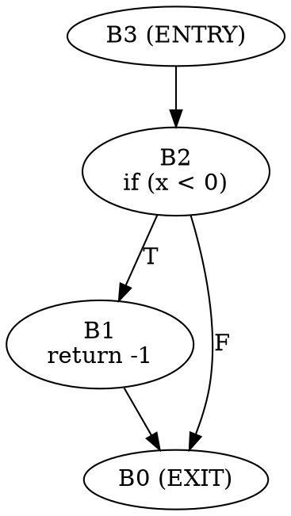

# Authoring Guide — adding Parts 3–7

How to add tools, samples and documentation to the lab without breaking what is already there. Parts 1 and 2 are the reference implementation: copy their structure.

Read this first, then read `docs/part_2_building_cfgs.md` (for tone and depth) and the research page `~/workspace/wiki/pages/research/clang-cfg-api.md` (for ground truth — every API you teach must match it and the installed headers).

## 1. Fixed names

Everything below is fixed so the parallel authors of Parts 3–7 do not collide.

| Part | File (in `docs/`) | Title (used in nav links) | Tool prefix | Manifest prefix |
|------|-------------------|---------------------------|-------------|-----------------|
| 1 | `part_1_reading_cfgs_cli.md` | Reading CFGs on the Command Line | `p01_` (no tools) | `manifests/p01_*` |
| 2 | `part_2_building_cfgs.md` | Building CFGs in C++ | `tools/p02_*/` | `manifests/p02_*` |
| 3 | `part_3_cxx_semantics.md` | C++ Semantics in the CFG | `tools/p03_*/` | `manifests/p03_*` |
| 4 | `part_4_graph_algorithms.md` | Graph Algorithms over the CFG | `tools/p04_*/` | `manifests/p04_*` |
| 5 | `part_5_classic_analyses.md` | Classic CFG Analyses | `tools/p05_*/` | `manifests/p05_*` |
| 6 | `part_6_dataflow_framework.md` | The FlowSensitive Dataflow Framework | `tools/p06_*/` | `manifests/p06_*` |
| 7 | `part_7_capstone.md` | Capstone & Engineering | `tools/p07_*/` | `manifests/p07_*` |

Parts 3–7 already exist as **stubs** with their section lists (taken from the approved outline). Replace the stub's body; keep the file name and the first line. You may rename or re-order sections only if you update the same titles in `docs/PROGRESS.md` and the section list in `docs/README.md` in the same change (`scripts/check_links.py` will tell you if they disagree).

Write **5–9 content sections plus a `Checkpoint`** per part (the stubs show the plan; the skill limit is 10 sections).

## 2. Naming conventions

| Thing | Convention | Example |
|-------|------------|---------|
| Tool directory | `tools/pNN_<name>/` — `NN` is your part, `<name>` is `snake_case`, no part-internal numbering | `tools/p04_dominators/` |
| Tool binary | the directory name; appears at `build/bin/pNN_<name>` | `build/bin/p04_dominators` |
| Tool source | `main.cpp`; extra files in the same directory are fine | `tools/p06_constprop/{main.cpp,lattice.h}` |
| Sample inputs | `manifests/pNN_<name>.cpp` (or `.c`), named after the tool or the topic. Group a topic's functions in one file | `manifests/p04_loops.cpp` |
| Scratch files created by doc commands | under `out/` (git-ignored); create with `mkdir -p out` | `out/ex_catch.cpp` |
| Functions in samples | named for what they demonstrate (`pruned_if`, `cond_temp`), small, self-contained; one construct per function | |
| Doc section headings | `## Section N.M — Title` (em dash), numbered from `N.1` | `## Section 4.3 — Reachability` |
| `llvm::cl` option category | `llvm::cl::OptionCategory Cat("pNN_name options")` | |
| Option names | `--kebab-case`; avoid names that collide with LLVM options or with `clang::` identifiers (see section 8) | `--show-idoms` |

A tool that wants the standard flags (`--preset`, `--set`, `--clear`, `--always-add`, `--func`) uses `CFGLAB_DEFINE_BUILD_FLAGS(Cat)` — see the template.

## 3. Adding a tool

```bash
cp -r tools/_template tools/p04_dominators          # 1. copy the template
$EDITOR tools/p04_dominators/main.cpp               # 2. write the tool
scripts/build.sh p04_dominators                     # 3. build (re-runs CMake, finds the new directory)
build/bin/p04_dominators manifests/p04_loops.cpp    # 4. run
```

No CMake edit is needed: `tools/CMakeLists.txt` globs `tools/p[0-9][0-9]_*/`, and for each directory without its own `CMakeLists.txt` calls `add_cfg_tool(<dirname> <all .cpp files>)`.

The template (`tools/_template/main.cpp`):

```cpp
#include "cfglab.h"

using namespace clang;

static llvm::cl::OptionCategory Cat("pNN_name options");
CFGLAB_DEFINE_BUILD_FLAGS(Cat) // gives --preset --set --clear --always-add --func

int main(int argc, const char **argv) {
  return cfglab::runPerFunction(
      argc, argv, Cat, [](const FunctionDecl *FD, ASTContext &Ctx, Preprocessor &PP) {
        if (!flagWantsFunction(FD)) return;
        CFG::BuildOptions BO;
        if (!flagsToOptions(BO)) std::exit(2);
        std::unique_ptr<CFG> G = CFG::buildCFG(FD, FD->getBody(), &Ctx, BO);
        if (!G) return;
        llvm::outs() << FD->getQualifiedNameAsString() << ": " << G->size() << " blocks\n";
      });
}
```

### Needing more than one source file or extra flags

Put a `CMakeLists.txt` in the tool directory; it replaces the automatic rule. `add_cfg_tool` is available there:

```cmake
# tools/p06_constprop/CMakeLists.txt
add_cfg_tool(p06_constprop main.cpp lattice.cpp)
target_compile_options(p06_constprop PRIVATE -O1)
```

### What is already linked

`add_cfg_tool` links `clang-cpp` and `LLVM`, the two monolithic dylibs. That covers **everything** the lab uses: `clang/Analysis/*` (CFG, `AnalysisDeclContext`, `Analyses/*`), `clang/Analysis/FlowSensitive/*` including the models, `clang/Tooling`, `clang/ASTMatchers`. `tools/p00_smoke` touches each family once; if it builds and runs, your include path and linking are fine. Tools are compiled with `-std=c++20 -fno-rtti` against Homebrew libc++; match those when you need a manual build line (Part 2.1 has one).

### Running and the platform flags

`cfglab::runTool<Action>` and `cfglab::runPerFunction` do three things your `main` should not repeat:

1. add `-std=c++17` (`-std=c11` for `.c`) when the user gives no `--` compile flags;
2. call `cfglab::addPlatformFlags`, which appends `-resource-dir <llvm>/lib/clang/22`, `-nostdinc++ -isystem <llvm>/include/c++/v1` and `-isysroot $(xcrun --show-sdk-path)` — without these an embedded front end cannot find `<stddef.h>` or `<cmath>`;
3. create the `ClangTool` and run the action.

A tool that builds its own `ClangTool` must call `cfglab::addPlatformFlags(Tool)` itself. `CFGLAB_RAW=1` disables the flags (used in Part 2.1 to show why they exist). `scripts/flags.sh` prints the same flags for `clang-query` or plain `clang`.

## 4. `tools/common/cfglab.h` reference

Header-only; included as `"cfglab.h"`; namespace `cfglab` (it `using namespace clang`).

| Function / macro | Purpose |
|------------------|---------|
| `runTool<ActionT>(argc, argv, Cat)` | whole `main()`: parse args, platform flags, run an `ASTFrontendAction` |
| `runPerFunction(argc, argv, Cat, fn)` | same, but calls `fn(const FunctionDecl*, ASTContext&, Preprocessor&)` for every function *definition* in the main file that is not a template pattern (`isInteresting`) |
| `isInteresting(FD, Ctx)` | the predicate used above: has a body, not `isTemplated()`, in the main file |
| `addPlatformFlags(ClangTool&)` | see above |
| `semaPreset()`, `adornedPreset()`, `analyzerPreset()`, `kitchenSinkPreset()`, `defaultOptions()` | `CFG::BuildOptions` as Sema / `AdornedCFG::build` / the Static Analyzer (= `debug.DumpCFG`) / "everything" / defaults would build them |
| `presetByName("sema"…)`, `optionFields()`, `setOptionList(BO, "AddScopes,AddLifetime", true)`, `stmtClassesByName()`, `makeBuildOptions(...)` | name-driven option construction behind `--preset/--set/--clear/--always-add` |
| `applyPreset(Dst, Src)` | copy a preset into an `AnalysisDeclContext`'s `getCFGBuildOptions()` **without** clobbering its `forcedBlkExprs` pointer |
| `CFGLAB_DEFINE_BUILD_FLAGS(Cat)` | defines the five standard options plus `flagsToOptions(BO)` and `flagWantsFunction(FD)` |
| `kindName(CFGElement::Kind)`, `termKindName(CFGTerminator)` | enum → string |
| `elementDetail(CFGElement, Ctx)` | one-line kind-specific description of any element (all 15 kinds) |
| `stmtText(Stmt*, Ctx, Max=48)` | one-line pretty-printed statement |
| `blockName(B)` | `"B3"`, or `"null"` for a null pointer |
| `lineOf(SM, Loc)` | spelling line number |

Add new shared helpers to `cfglab.h` rather than copying them between tools, but **do not change the behaviour of an existing helper** — Parts 1–2 depend on it, and their documented output is checked by `scripts/doccheck.py`. If a helper really has to change, run `scripts/check.sh` before handing back.

## 5. Adding a sample

- File: `manifests/pNN_<topic>.cpp`. First lines: a comment `// Part N.M -- what this file is for`.
- Keep functions short; one construct each; comment the construct on the line above the function. A function you refer to in the doc must exist under exactly that name.
- Make it compile cleanly in `-std=c++17` (no warnings if you can avoid them; warnings from the sample are printed by the tools and end up in `Expected` blocks).
- Avoid `#include` of standard headers unless the section is about them (`p02_includes.cpp` is the example): standard headers add hundreds of functions to a `debug.DumpCFG` run and make outputs unstable across SDKs. `runPerFunction` already restricts tools to the main file; the analyzer scripts do not (use `FN=` to filter).
- **Block numbers are part of the documented output.** If you edit a sample after writing a doc, re-run `scripts/doccheck.py --fill` and re-read the prose: a sentence like "`B3` is the join" is not checked.

## 6. Writing a part

### Section template

Every section has **Why → What to Do → Verify → Expected**, in that order, using exactly these headings:

````markdown
## Section N.M — Title

### Why

One or two sentences: the problem this section solves, in the reader's terms.

### What to Do

**Sample file:** `manifests/pNN_topic.cpp` — one line about it.

Explain the concept first. Then the commands, each followed by its recorded output:

```bash
build/bin/pNN_tool manifests/pNN_topic.cpp --func=demo
```

```text expected
```

Field/option tables (| Field | Value | Why |) where something is non-obvious. `dot` diagrams (see
"Diagrams") for graphs and flows. `> [!warning]` callouts for API surprises.

### Verify

A short command (or two) whose result the reader can predict from what they just learned.

```bash
...
```

### Expected

```text expected
```

One sentence on what the result proves.

> [!hint]- Quiz: question
> a nudge, not the answer

> [!success]- Answer
> the answer
````

Then `---` and the next section.

### Part skeleton (copy Parts 1–2)

```markdown
# Part N — Title

[← Part N-1 — Title](part_N-1_slug.md) | [Part N+1 — Title →](part_N+1_slug.md)

## What You'll Learn
- bullets

## The Big Picture
Explanation, a `dot` diagram, a table of this part's tools.

---

## Section N.1 — ...
...
## Section N.K — Checkpoint

| Concept | What You Proved |
|---------|-----------------|
...
**Ready for Part N+1?** one sentence.

---

[← Part N-1 — Title](part_N-1_slug.md) | [Part N+1 — Title →](part_N+1_slug.md)
```

Navigation links appear at the top (under the title) and at the bottom (after `---`). Part 1's previous link points to `README.md`; Part 7's next link points to `README.md` (the stubs already have the right forms). A part that ends the lab ends with `[README](README.md)`.

### The `text expected` convention (checked by `scripts/doccheck.py`)

- A fenced block with info string `text expected` is the recorded output of the `bash` block immediately before it. Prose may sit between them; another fence may not.
- The command runs in `bash -c`, **from the lab root**, with stdout and stderr merged. Use relative paths. Absolute lab paths in the output are rewritten to relative ones, so `manifests/x.cpp:3:10: error:` is what you see.
- Each `bash` block is a fresh shell: state (`cd`, variables) does not carry over. A block can contain several commands; their outputs are concatenated into one expected block.
- A `bash` block with no `text expected` after it is **not run** (build commands, long runs, commands that open viewers).
- **Do not hand-write expected output.** Write the command, leave the block empty, run `scripts/doccheck.py --fill docs/part_N_*.md`, then read the result and make sure your prose agrees with it. Commit only after `scripts/doccheck.py docs/part_N_*.md` reports 0 problems.
- Outputs must be **deterministic**: no pointer values (`0x600001234`, `Node0x…`), no timestamps, no random temp names, no machine-specific absolute paths. Normalise with `sed`/`awk` in the command itself and say so in the prose (Part 1.5 renames `Node0x…` to `N1…`, Part 1.6 masks `0xADDR`).
- Keep outputs short (≲ 45 lines): select with `head`, `sed -n 3,9p`, `grep -E`, or the `FN=` / `--func=` filters. Show the whole thing only when the whole thing is the lesson.
- Long commands use `\` continuations; one logical operation per block.

### Diagrams

Every diagram is a fenced block whose info string is exactly `dot`, holding one complete Graphviz graph. **No ASCII art.** `scripts/build_site.py` renders each block with `dot -Tsvg` (`brew install graphviz`; the build stops with `docs/part_N_*.md:LINE` and dot's error if a block is invalid, there is no fallback) into an interactive figure: pan and zoom, hover/click highlighting, full screen, the dot source, download as SVG. The fence stays the source of truth and is also the figure's "Source" view.



- One `digraph name { ... }` per fence. The name becomes the download file name (`cfg_sign.svg`). A fence may sit inside a `>` callout or a list item like any other.
- **No colors, fonts or sizes in the source**: never `color`, `fillcolor`, `fontcolor`, `pencolor`, `bgcolor`, `fontname`, `fontsize`. The build passes the defaults (transparent background, Menlo nodes, Helvetica labels, rounded boxes, spacing; the `DOT_FLAGS` constant in `build_site.py`) and `scripts/site_assets/style.css` colors both themes. Meaning is expressed only with `class=`.
- Free to use: `label`, `xlabel`, `tooltip`, `rankdir`, `rank=same`, ports, clusters, `style=dashed|dotted|invis`, HTML-like labels (without colors). Quote names that are not plain identifiers (`"ns::f"`).
- Hovering a node highlights it, its edges and its neighbours; the highlight follows edge endpoints by the node names, so keep node names unique and stable (`B2`, not the label text).

| Element | `class=` values (space-separated, e.g. `class="cond hl"`) |
|---------|-----------------------------------------------------------|
| node | `entry`, `exit`, `block` (default, may be omitted), `cond` (block that ends in a branch), `note` (side annotation), `api` (a Clang class / function / tool), `data` (a value, state or artifact), `hl` (emphasis), `dim` (de-emphasized or unreachable) |
| edge | `t` (true branch), `f` (false branch), `back` (loop back edge), `eh` (exception edge), `weak` (annotation link), `hl` (emphasis) |
| cluster | `subgraph cluster_x { label="..."; }`, optionally `class="group"` |

Color is never the only carrier: label branch edges `T` / `F`, and `back`, `eh` and `weak` also differ by line style.

Text outputs that are graphs need no markup: every `text expected` block that `scripts/outviz` can draw (a `debug.DumpCFG` dump, `cfgshape.sh` lines, dominator trees, DOT text, the Part 2-7 tool formats) becomes a figure with **Graph** and **Output** tabs, drawn from the `bash` block directly before it; the recorded text stays the source of truth and `doccheck.py` is unaffected. A tool whose output is a graph gets its parser in `scripts/outviz/` (the `PARSERS` list; see `outviz/__init__.py`), with tests next to it.

Preview a part while writing: `python3 scripts/build_site.py && open site/index.html`. `scripts/check_site.py` fails if a `dot` fence did not become exactly one figure, or if its source differs from the fence. `scripts/doccheck.py` skips `dot` blocks (like any non-`bash` fence).

### Tone and content rules

- Explain before commanding. One concept per section.
- Show real behaviour, including the surprising kind. When the header, an older tutorial or the Internals Manual disagrees with what you observe, say so in a `> [!warning]` callout with the evidence (Part 2.5's `&&`/`||` ordering is the model).
- Ground truth: the installed 22.1.8 headers, then `wiki/raw/2026-10-03-clang22-*.md`, then `wiki/pages/research/clang-cfg-api.md`. If your experiment contradicts the research page, trust the experiment and flag it.
- Quizzes: Obsidian callouts only (`> [!hint]-`, `> [!success]-`). Never raw HTML. About one quiz per section.
- Diagrams: Graphviz `dot` fences only, never ASCII art (see "Diagrams" above).
- No emojis.
- Link to other parts as `[Part 4](part_4_graph_algorithms.md)`; cross-references by "Section 4.3" in prose are fine.

### Things only you can keep consistent

When you add or rename a section, update **all three**: the heading in the part file, the line in `docs/PROGRESS.md` (`- [ ] N.M — Title`, same title), and the section list in `docs/README.md`.

## 7. Checking your work

```bash
scripts/build.sh                                 # all tools build
scripts/doccheck.py docs/part_4_*.md             # every command reproduces its Expected block
scripts/check_links.py                           # links, nav, PROGRESS and README agree
python3 scripts/build_site.py && python3 scripts/check_site.py   # HTML edition: dot diagrams render, fences intact
scripts/check.sh                                 # all of the above from a CLEAN build, plus the smoke test
```

`scripts/check.sh --quick` skips the clean rebuild. `scripts/doccheck.py --list docs/part_4_*.md` lists the commands it would run.

Before you hand back:

- [ ] `scripts/check.sh` passes from a clean build
- [ ] every API you name appears in the installed headers (`grep -rn Name /opt/homebrew/opt/llvm/include/clang/Analysis`)
- [ ] every tool and sample you reference exists, with the names used in the text
- [ ] nothing outside your part's files changed, except additions to `cfglab.h` and the three section lists
- [ ] no raw HTML anywhere in the docs

## 8. Gotchas found while building Parts 1–2

These cost time once; they should not cost it again.

**Clang API**

- `CFG::dump()` writes to **stderr**; use `G->print(llvm::outs(), LangOpts, false)` in tools so output interleaves with yours.
- `CFGStmtMap::Build` is gone; use the constructor. `ControlFlowContext.h` is `FlowSensitive/AdornedCFG.h`.
- `AdjacentBlock` converts implicitly to `CFGBlock*` → `nullptr` for pruned edges. `getPossiblyUnreachableBlock()` is null for ordinary edges and for the pruned exit of `while (1)`.
- Successor order: **0 = true edge, 1 = false edge** for every conditional terminator (the `CFG.h` comment is wrong for `&&`); `switch` cases are listed in reverse source order, `default` last.
- `getTerminatorStmt()` is null for `VirtualBaseBranch` even though `getTerminator().isValid()`.
- `getAs<CFGStmt>()` matches `Statement`, `Constructor` and `CXXRecordTypedCall`.
- `AnalysisDeclContext::getCFGBuildOptions()`: change fields **before** the first `getCFG()`; use `cfglab::applyPreset` rather than assigning a whole `BuildOptions` (it carries `forcedBlkExprs`).
- `debug.DumpCFG` looks "linearized" because the analyzer calls `setAllAlwaysAdd()`; a default `BuildOptions` folds sub-expressions. `cfglab::analyzerPreset()` reproduces the dump exactly.
- `llvm::json::Object` orders keys alphabetically.
- `AdornedCFG::build` rejects C, Objective-C and templated declarations; `runPerFunction` already skips templated functions.

**Build and shell (macOS)**

- `/bin/bash` here is 3.2: no `mapfile`, no associative arrays. Scripts use `while read` loops. The interactive shell is zsh: unquoted `$VAR` does **not** word-split there, so write multi-argument variables as arrays or inline. BSD `sed`: no `\b`, `-i ''`, `-E` for extended regexes.
- No GNU `timeout` on macOS.
- `llvm::cl::opt` variable names can collide with identifiers in `clang::` (`All` is ambiguous) and option *names* with LLVM's own (the process aborts at startup with "registered more than once"). Prefix generously.
- `debug.ViewCFG` / `debug.ViewCallGraph` try to launch a viewer; use `scripts/viewcfg.sh` (`TMPDIR=<dir> PATH=/var/empty`) in scripts and docs.
- `-dataflow-log` is a hidden `llvm::cl` option; it works directly in any tool that parses `llvm::cl` options through `CommonOptionsParser` (Part 6.8).
- `brew upgrade llvm` changes the Cellar path baked into the tools: `scripts/build.sh` reconfigures on every call, so the next build picks it up.
