# Part 10 — Interprocedural Analysis

[← Part 9 — Call Graph Algorithms](part_9_call_graph_algorithms.md) | [Part 11 — Indirect Calls, Cross-TU and Scale →](part_11_indirect_xtu_scale.md)

## What You'll Learn

- How to join the call graph with the CFG: every call site as a CFG element with an `AnyCall` kind, the `missing:` classes for the calls the graph has no edge for, and the `BuildOptions` that decide which sites a CFG contains at all
- An interprocedural walk that descends into resolved callees, and why recursion is stopped only by its depth bound
- Bottom-up summaries: a transitive `noreturn` analysis computed per strongly connected component in callee-first order, with Jacobi passes to a fixed point inside cycles, a three-point lattice and the `via` chain
- Widening: why `depth` jumps to `inf` on a cycle, and what a summary can never know because it has no call-site context
- Context sensitivity with k-limited call strings: one answer per function and per way of getting there, the cost of every extra `k`, and recursion ended by the limit
- How the Static Analyzer goes interprocedural without a call-graph summary: `CallEvent` kinds, `RuntimeDefinition`, the order of the `shouldInlineCall` checks, inlining versus conservative evaluation, observed with `debug.AnalysisOrder`, `debug.DumpCalls`, `clang_analyzer_eval`, report notes and the exploded graph's `CallEnter` points
- `BodyFarm`: bodies the analyzer synthesises for `dispatch_once`, `std::call_once` and other well-known functions that have none, and why the sample has to look like libc++
- Context sensitivity in the FlowSensitive framework (`ContextSensitiveOptions`, `pushCall`, `popCall`, `canDescend`) and a side-by-side comparison of the four mechanisms of this part

## The Big Picture

Part 8 built the call graph and Part 9 ran algorithms over its edges. Those algorithms know *who* calls *whom*. An **interprocedural analysis** carries a fact across the call: "this function ends the program", "this parameter is zero", "this pointer is null". Every such analysis must answer three questions, and the answers are the design:

1. **What crosses the call?** One value per function (a summary), one value per function and way of getting there (a call string), or the whole state of the caller (descent).
2. **What does it cost?** Time and memory grow with the number of functions, with the number of contexts, or with the number of call sites on every path.
3. **Where does recursion go?** A fixed point inside the cycle, a limit that cuts the string, or a refusal to go deeper.

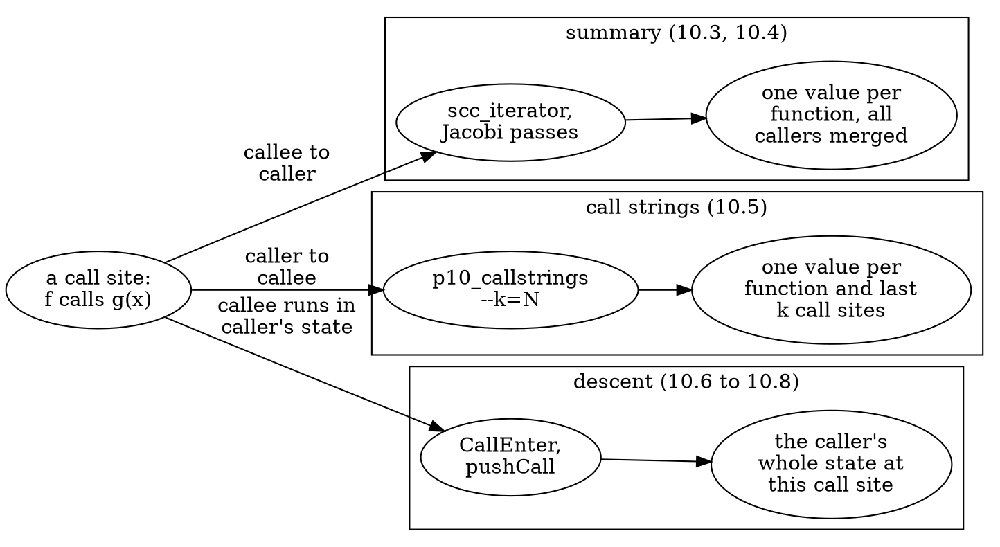

The first two mechanisms are analyses you write on the call graph (10.3 to 10.5); the third is how production tools do it (10.6 to 10.8). Section 10.8 closes the part with a table that puts all of them next to each other. The sections run in this order: join the graph with the CFG (10.1, 10.2), compute bottom-up (10.3, 10.4), split by context (10.5), then see what the Static Analyzer and the FlowSensitive framework do instead (10.6 to 10.8).

| Tool (this part) | Section | Does |
|------------------|---------|------|
| `p10_sites` | 10.1, 10.2 | the call sites in a function's CFG joined with the call graph (`AnyCall`), and an interprocedural walk |
| `p10_summary` | 10.3, 10.4 | bottom-up summaries over the SCCs (`sink`, `depth`) with a traced fixed point |
| `p09_walk` | 10.4 | the shortest call chain (`--path`) behind a summary's `via` (introduced in Part 9) |
| `p10_callstrings` | 10.5 | a context-sensitive "may this parameter be zero?" analysis with k-limited call strings |
| `scripts/dumpcfg.sh` | 10.6, 10.7 | the Static Analyzer with its debug checkers (`debug.AnalysisOrder`, `debug.DumpCalls`, `debug.ExprInspection`) |
| `p10_farm` | 10.7 | the bodies `BodyFarm` synthesises, printed with their CFGs |
| `p07_ctx` | 10.8 | the FlowSensitive framework's context-sensitive mode (from Part 7.5) |

The sample files, one per topic:

| File | Used in | Holds |
|------|---------|-------|
| `manifests/p10_sites.cpp` | 10.1, 10.2 | one `main` with every kind of call site |
| `manifests/p09_recursion.cpp` | 10.2 | self, mutual and three-way recursion (from Part 9) |
| `manifests/p10_sink.cpp` | 10.3, 10.4 | a `[[noreturn]]` sink, always/may/none callers, cycles that meet the sink, a deep chain |
| `manifests/p10_callstrings.cpp` | 10.5 | one `divide` called with a zero, a nonzero and a forwarded divisor, and a recursive caller |
| `manifests/p10_analyzer.cpp` | 10.6 | four `clang_analyzer_eval` questions, one per inlining rule, and a null pointer that travels two calls down |
| `manifests/p10_farm.c`, `manifests/p10_farm.cpp` | 10.7 | `dispatch_once` and `std::call_once`, declared with no body |
| `manifests/p07_ctx.cpp` | 10.8 | helper functions and one caller per context-sensitivity scenario (from Part 7.5) |

The tools of this part share the output grammar of Part 8 (one record per line, names quoted only when they contain a space, `--emit=text|dot|json`, compile flags after `--`). The Static Analyzer sections have no tool: they run `clang --analyze` through `scripts/dumpcfg.sh`, which adds the `-x c++ -std=c++17` (or `-x c`) flags and the SDK for you, and pass analyzer switches with `-Xclang`.

---

## Section 10.1 — Call sites in the CFG: `AnyCall` on elements, the `missing:` classes and the options that decide what the CFG has

### Why

The call graph says *that* `f` may call `g`. The CFG says *where*: in which block, as which element, under which branch. Joining the two is the first interprocedural analysis you can write, and it has a second use: the CFG sees calls the graph has no edge for (the destructors of Part 3.1, `delete`, calls through a pointer), so the join is also how you measure the graph's holes in a real function.

### What to Do

**Sample file:** `manifests/p10_sites.cpp` — `main` contains every kind of call site; `branches` has calls in the branches and the body of a loop; `dispatch` makes a virtual call; `apply` calls through a function pointer; `Holder` has a constructor with an initialiser and a destructor.

```cpp
int main() {
  Holder h(1);
  Derived d;
  int total = branches(h.value) + dispatch(d);
  total += apply(helper, total);
  total += external(total);
  Holder *p = new Holder(total);
  delete p;
  return total + Holder(3).value;
}
```

**`AnyCall` on a CFG element.** Section 8.7 introduced `AnyCall` (`clang/Analysis/AnyCall.h`), the wrapper that puts every call-like expression behind one interface. A CFG tool uses it element by element: `E.getAs<CFGStmt>()` gives the statement of an element; when it is an `Expr` that `AnyCall::forExpr` accepts (the result is `std::nullopt` for anything else) the element is a **site**, `getKind()` says which kind of call it is, and `getDecl()` is the statically known callee, **null** when there is none (a call through a function pointer). The kinds that occur in the sample:

| `AnyCall::Kind` | Comes from | In the sample |
|-----------------|------------|---------------|
| `Function` | `CallExpr`: function, member function, pointer | `branches(...)`, `fn(x)`, `b.run(3)` |
| `Constructor` | `CXXConstructExpr` | `Holder h(1);`, `new Holder(total)` |
| `Allocator` | `CXXNewExpr` | `new Holder(total)` calls `operator new` |
| `Deallocator` | `CXXDeleteExpr` | `delete p` calls `operator delete` |
| `Destructor` | **no expression**: `AnyCall(const CXXDestructorDecl *)` | scope exit, temporaries, `delete` |
| `ObjCMethod`, `Block`, `InheritedConstructor` | message sends, calls through block pointers, `using Base::Base` | not in this sample |

**Elements that are not expressions.** A destructor call at the closing brace has no call expression at all. It is a `CFGImplicitDtor` element (`AutomaticObjectDtor`, `TemporaryDtor`, `DeleteDtor`, ...), and `getDestructorDecl(Ctx)` gives the destructor. `AnyCall` has a constructor from a `CXXDestructorDecl` for exactly this case, and `p10_sites` reports these elements as `Destructor` sites. They are in the CFG only when it is built with the options that add them (see below), and they are the reason a call graph built from expressions can never see them: there is no `CallRecord` without a call expression.

**The address of a site.** Each site is addressed `B<id>.<i>`: the block id and the 1-based element index, the `[B1.4]` that the dump of Part 1.2 shows.

**The class.** Every site is then compared with the call graph and gets a **class**:

| Class | Meaning | Example |
|-------|---------|---------|
| `resolved` | the graph has an edge for this very call expression, and the callee has a body | `branches`, `Holder::Holder` |
| `virtual static=X` | a virtual call: the graph recorded only the static callee `X` | `b.run(3)` in `dispatch` |
| `missing:indirect` | no callee is known; the callee prints as `?` | `fn(x)` in `apply` |
| `missing:implicit-dtor` | a destructor call that is not an expression | the three destructors at the end of `main` |
| `missing:delete` | what `delete` calls: `operator delete` and the destructor | `delete p` |
| `missing:decl` | the callee is known but has no body in this file | `external`, `operator new` |
| `missing:node`, `missing:edge` | a callee with a body that the graph leaves out (`__inline` names), or has a node for but no edge for this expression (should not happen) | none here |

The tool asks the questions below in this order and stops at the first match. The graph's own record is looked up per **expression**: `CallGraphNode::callees()` holds one `CallRecord{Callee, CallExpr}` per call expression that `CGBuilder` visited, so "the graph has an edge" means "a record whose `CallExpr` is this one", not "the callee has a node". (The code tests the record first and the body inside each branch; the outcomes are the ones the figure shows.) An implicit destructor element is not an `AnyCall` and skips the questions: it is `missing:implicit-dtor`, or `missing:delete` when it is the `DeleteDtor` of a `delete`.

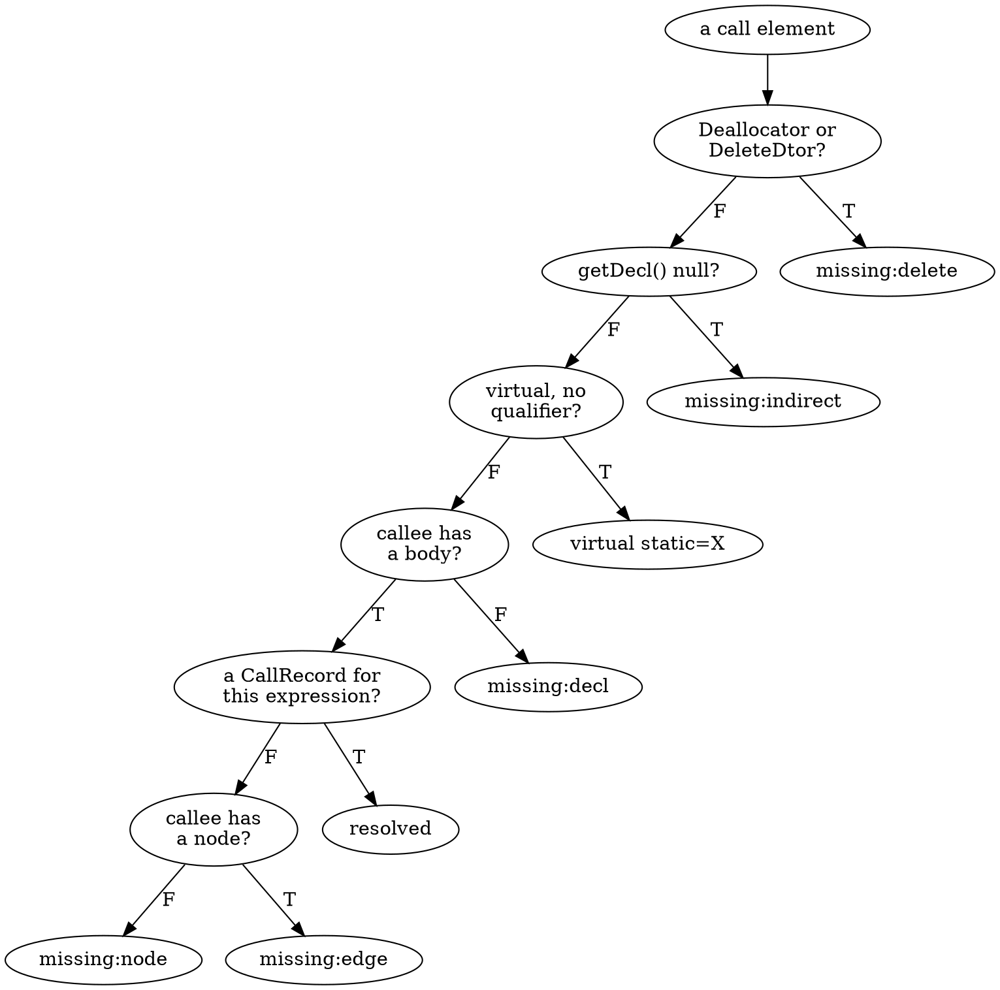

**Where the calls are.** `branches` has a branch and a loop, so its sites are in different blocks. `--succs` prints the CFG's edges, with `T` and `F` on a two-way branch (successor 0 is the true edge, Part 2.5). The analyzer preset is what `debug.DumpCFG` uses, so the numbers match the dump:

```bash
build/bin/p10_sites manifests/p10_sites.cpp --func=branches --preset=analyzer --succs
```

```text expected
== branches: 10 blocks, 3 sites
site branches B7.6 Function helper resolved
site branches B6.6 Function leaf resolved
site branches B3.6 Function leaf resolved
succ branches B9 -> B8
succ branches B8 -> B7 T
succ branches B8 -> B6 F
succ branches B7 -> B5
succ branches B6 -> B5
succ branches B5 -> B4
succ branches B4 -> B3 T
succ branches B4 -> B1 F
succ branches B3 -> B2
succ branches B2 -> B4
succ branches B1 -> B0
```

Read it with the CFG in mind. `B8` ends in `x > 0` and goes to `B7` on `T` and `B6` on `F`; `helper` is called in `B7` (the `then` branch) and `leaf` in `B6` (the `else` branch); `B4` is the loop condition and `leaf` is called in its body `B3`, which loops back through `B2`. The call graph has the edges `branches -> helper` and `branches -> leaf` and nothing else: it cannot say that `helper` is on the true branch only, or that `leaf` is called in a loop.

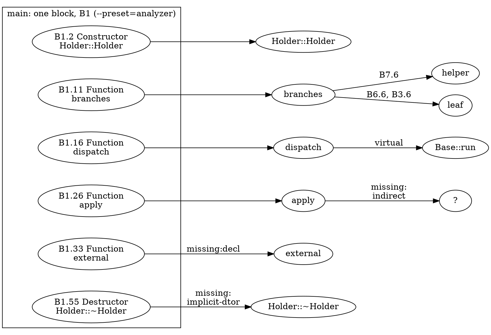

**All the kinds, in `main`.** Under the analyzer preset `main` is a single block, `B1`, so every site is an element of it:

```bash
build/bin/p10_sites manifests/p10_sites.cpp --func=main --preset=analyzer
```

```text expected
== main: 3 blocks, 14 sites
site main B1.2 Constructor Holder::Holder resolved
site main B1.4 Constructor Derived::Derived resolved
site main B1.11 Function branches resolved
site main B1.16 Function dispatch resolved
site main B1.26 Function apply resolved
site main B1.33 Function external missing:decl
site main B1.38 Constructor Holder::Holder resolved
site main B1.39 Allocator "operator new" missing:decl
site main B1.43 Destructor Holder::~Holder missing:delete
site main B1.44 Deallocator "operator delete" missing:delete
site main B1.48 Constructor Holder::Holder resolved
site main B1.55 Destructor Holder::~Holder missing:implicit-dtor
site main B1.57 Destructor Derived::~Derived missing:implicit-dtor
site main B1.58 Destructor Holder::~Holder missing:implicit-dtor
```

- The constructors and the three plain calls are `resolved`: `Holder::Holder` (three times: for `h`, for the `new` and for the temporary `Holder(3)`), `Derived::Derived`, `branches`, `dispatch`, `apply`.
- `external` and `operator new` are `missing:decl`: the graph has the nodes, but there is nothing to descend into.
- `delete p` appears as two sites, `Destructor Holder::~Holder` and `Deallocator "operator delete"`, both `missing:delete`.
- The last three, at `B1.55`, `B1.57` and `B1.58`, are the destructors that run at the end of `main` in reverse order of construction: the temporary `Holder(3)`, `d`, `h`. They are `missing:implicit-dtor`: the CFG shows them, the graph does not.

The other two interesting functions have one site each:

```bash
for f in dispatch apply; do build/bin/p10_sites manifests/p10_sites.cpp --func=$f --preset=analyzer; done
```

```text expected
== dispatch: 3 blocks, 1 sites
site dispatch B1.4 Function ? virtual static=Base::run
== apply: 3 blocks, 1 sites
site apply B1.5 Function ? missing:indirect
```

`dispatch` has a callee (`getDecl()` is `Base::run`), but the call goes through the vtable, so the class is `virtual static=Base::run`: the graph's edge `dispatch -> Base::run` is only the static answer, and `Derived::run` is invisible (Section 11.2 adds it). `apply` has no callee at all: `getDecl()` is null, the site is `?`, `missing:indirect` (Section 11.1 adds candidates). The tool says `virtual` only for a call that really goes through the vtable: a call spelled with a qualifier (`b.Base::run(1)`) is a direct call and is `resolved`.

The element address is the dump's address. The call in `dispatch` is `B1.4` here, and element 4 of `B1` in `debug.DumpCFG`'s output is that call:

```bash
FN=dispatch scripts/dumpcfg.sh manifests/p10_sites.cpp | grep -E '^ +4:'
```

```text expected
   4: [B1.2]([B1.3])
```

**What the CFG contains is a choice.** A site is an element, and which elements exist depends on the `BuildOptions` the CFG was built with (`--preset`, `--set`, `--clear`, as in every CFG tool of Parts 2 to 7). Three options decide what a call-site analysis can see:

| Option | Adds to the CFG | Effect on the sites |
|--------|-----------------|---------------------|
| `AddImplicitDtors` | `AutomaticObjectDtor` and friends at scope exit | `missing:implicit-dtor` sites for named locals (`d`, `h`) |
| `AddTemporaryDtors` | `TemporaryDtor` for temporaries | the destructor of the temporary `Holder(3)` |
| `AddInitializers` | the constructor-initialiser elements | the call `leaf(v)` in `: value(leaf(v))` becomes a site of `Holder::Holder` |

The analyzer preset turns all three on, and also lists every sub-expression as an element of its own (Section 2.2, `setAlwaysAdd`), so the **element numbers belong to the options**. The same call in `main` has two addresses:

```bash
for p in default analyzer; do build/bin/p10_sites manifests/p10_sites.cpp --func=main --preset=$p | grep ' branches '; done
```

```text expected
site main B1.5 Function branches resolved
site main B1.11 Function branches resolved
```

The call graph visits the constructor initialiser (`Holder::Holder -> leaf`, Section 8.5); the default CFG leaves it out until you ask:

```bash
build/bin/p10_sites manifests/p10_sites.cpp --func=Holder::Holder
build/bin/p10_sites manifests/p10_sites.cpp --func=Holder::Holder --set=AddInitializers
build/bin/p10_sites manifests/p10_sites.cpp --func=Holder::Holder --preset=analyzer
```

```text expected
== Holder::Holder: 2 blocks, 0 sites
== Holder::Holder: 3 blocks, 1 sites
site Holder::Holder B1.1 Function leaf resolved
== Holder::Holder: 3 blocks, 1 sites
site Holder::Holder B1.5 Function leaf resolved
```

Without `AddInitializers` the constructor's CFG has two blocks, `ENTRY` and `EXIT`, and no site: the call `leaf(v)` is not in the CFG at all. With it, a third block appears with the call, as element `B1.1` (the default build folds the sub-expressions into the call); under the analyzer preset the same call is `B1.5`, behind the four elements that build its callee and its argument (`leaf`, the function-to-pointer decay, `v` and the lvalue-to-rvalue conversion), and the member initialiser is element 6. Any analysis that joins the two structures has to build the CFG with the options that match what it is asking.

> [!note] The `delete` destructor needs no option
> `delete p` produced two `missing:delete` sites in the default build too: a `DeleteDtor` element is part of how Clang builds a `delete` expression, while the destructors of locals and temporaries are the optional part. That is why the Verify below counts `missing:implicit-dtor`, not "destructors".

### Verify

Predict how many `missing:implicit-dtor` sites `main` has with the default options, after adding `AddImplicitDtors`, after adding `AddTemporaryDtors` as well, and under the analyzer preset (`main` ends with three destructors: `Holder(3)`, `d`, `h`), then count them:

```bash
cnt() { grep -c 'missing:implicit-dtor'; }
echo "default: $(build/bin/p10_sites manifests/p10_sites.cpp --func=main | cnt)"
for s in AddImplicitDtors AddImplicitDtors,AddTemporaryDtors; do
  echo "+$s: $(build/bin/p10_sites manifests/p10_sites.cpp --func=main --set=$s | cnt)"
done
echo "analyzer: $(build/bin/p10_sites manifests/p10_sites.cpp --func=main --preset=analyzer | cnt)"
```

### Expected

```text expected
default: 0
+AddImplicitDtors: 2
+AddImplicitDtors,AddTemporaryDtors: 3
analyzer: 3
```

The default CFG has none; `AddImplicitDtors` adds the destructors of the two named locals; `AddTemporaryDtors` adds the one of the temporary; the analyzer preset has all three. Everything the graph "misses" in a function is a site with a `missing:` class in a CFG built with the right options.

> [!hint]- Quiz: `Holder::~Holder` has a body and a node in the call graph, and `main` ends with a destructor call for `h`. Why is that site `missing:implicit-dtor` and not `resolved`?
> What does `resolved` ask the graph for, and what does an implicit destructor call not have?

> [!success]- Answer
> `resolved` needs a `CallRecord` whose `CallExpr` is this very expression. The destructor call at the closing brace is a `CFGImplicitDtor` element with no expression, so `CGBuilder` never made a record for it. The node `Holder::~Holder` exists (the class defines it and `delete p` names it), but a node is not an edge. To follow the call, a tool has to build the callee itself from `AnyCall(const CXXDestructorDecl *)`.

### Common mistakes

| Mistake | Symptom |
|---------|---------|
| Calling `AnyCall::forExpr` and treating a null `getDecl()` as "unknown function" for every site | a virtual call has a decl; check `isVirtual()` and the qualifier before you call it resolved |
| Looking for destructor calls among the `CFGStmt` elements | there are none: they are `CFGImplicitDtor` elements, and only appear with the options on |
| Comparing `B1.N` numbers across presets | the numbering belongs to the options |
| Building the CFG with default options and expecting constructor initialisers | `AddInitializers` is off by default |
| Assuming the call graph's edge for a callee covers every call to it | the edge belongs to *one* call expression; two calls give two records, and a call the graph missed gives none |

### Exercises

1. `build/bin/p10_sites manifests/p10_sites.cpp --unresolved --preset=analyzer`: count the sites per class. Which class is the most common, and which two classes can the rules of Part 11 (address-taken matching and class-hierarchy analysis) turn into edges?
2. Copy the file to `out/ex_sites.cpp` and add `int via_ref(Base &b) { return b.Base::run(1); }`. Predict the class of its one site before you run `--func=via_ref --preset=analyzer`, then compare with `dispatch`.

---

## Section 10.2 — An interprocedural walk: descending into resolved callees

### Why

With the sites classified, you can follow them: "which code can run below this call?" is the question behind call-tree printers, code-size estimates and the reachability checks of Part 9, but asked per *block* instead of per function, so the answer says under which branch the callee runs. Writing the walk shows exactly what a descent needs (a resolved callee with a CFG) and what it never gets (anything the graph has no edge for), and it makes the one thing the walk does not do, carry state, visible before Sections 10.6 and 10.8 do carry it.

### What to Do

**Sample file:** `manifests/p10_sites.cpp` (the one of Section 10.1), and `manifests/p09_recursion.cpp` for the recursion contrast.

**The algorithm.** `p10_sites --walk=NAME` starts at the entry of one function and visits its blocks in reverse post-order (the order of `PostOrderCFGView`, Part 4.2). At every site that is `resolved` it descends into the callee's CFG, which it visits the same way, up to `--depth` calls deep. The output has two kinds of line:

| Line | Meaning |
|------|---------|
| `walk <depth> <fn>:B<id>` | the walk visited block `B<id>` of `<fn>`, `<depth>` calls below the start |
| `walk <depth> <fn>:B<id> -> <callee>` | a `resolved` site in that block; the walk descends into `<callee>` unless `<depth>` has reached `--depth` |

Only calls that are `resolved` are followed. A virtual site, an indirect site, a body-less callee, `delete` and the implicit destructors are not: the walk would have to guess a callee, or invent one. The lines that mark the descents are the shape of the walk:

```bash
build/bin/p10_sites manifests/p10_sites.cpp --walk=main --depth=2 --preset=analyzer | grep -- '->'
```

```text expected
walk 0 main:B1 -> Holder::Holder
walk 1 Holder::Holder:B1 -> leaf
walk 0 main:B1 -> Derived::Derived
walk 1 Derived::Derived:B1 -> Base::Base
walk 0 main:B1 -> branches
walk 1 branches:B7 -> helper
walk 2 helper:B1 -> leaf
walk 1 branches:B6 -> leaf
walk 1 branches:B3 -> leaf
walk 0 main:B1 -> dispatch
walk 0 main:B1 -> apply
walk 0 main:B1 -> Holder::Holder
walk 1 Holder::Holder:B1 -> leaf
walk 0 main:B1 -> Holder::Holder
walk 1 Holder::Holder:B1 -> leaf
```

`main` descends into `Holder::Holder`, which calls `leaf`; into `Derived::Derived`, which calls the implicit `Base::Base`; into `branches`, where `B7` descends into `helper` (and from there, at depth 2, into `leaf`) while `B6` and `B3` descend into `leaf` directly. `dispatch` and `apply` are entered but contribute no further descent: their sites are `virtual` and `missing:indirect`.

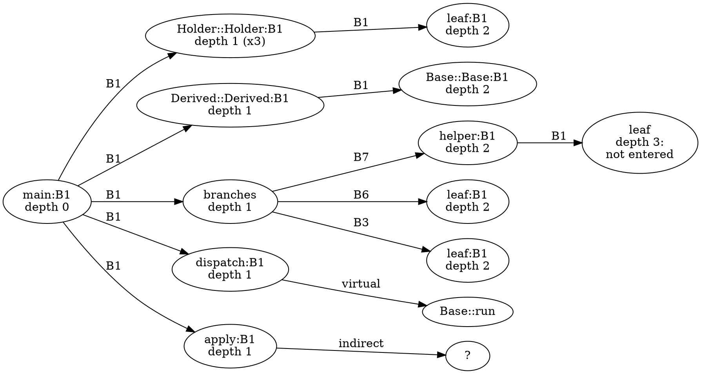

**The depth bound.** `--depth=N` is the number of calls the walk may descend: a site at depth `N` still prints its `-> callee` marker, but nothing below it is visited. `--depth=1` therefore stops one call earlier than the run above:

```bash
diff <(build/bin/p10_sites manifests/p10_sites.cpp --walk=main --depth=1 --preset=analyzer | grep -- '->') \
     <(build/bin/p10_sites manifests/p10_sites.cpp --walk=main --depth=2 --preset=analyzer | grep -- '->')
```

```text expected
6a7
> walk 2 helper:B1 -> leaf
```

At `--depth=1` the walk prints `branches:B7 -> helper` but does not enter `helper`, so the only line depth 2 adds is the one inside it: `walk 2 helper:B1 -> leaf`. That line is a marker again: at depth 3 the walk would enter `leaf`. Where recursion is concerned the depth is the *only* brake. The walk keeps no stack of functions it is inside, so it enters `fact` from `fact` until the bound is reached:

```bash
build/bin/p10_sites manifests/p09_recursion.cpp --walk=fact --depth=2 --preset=analyzer | grep -- '->'
```

```text expected
walk 0 fact:B3 -> fact
walk 1 fact:B3 -> fact
walk 2 fact:B3 -> fact
```

> [!note] Compare with Section 10.8 and with the analyzer
> `Environment::pushCall` in Section 10.8 descends the same way, but carries the caller's *state* into the callee, refuses recursion with `canDescend`, and reports what the callee did with it. The Static Analyzer (Section 10.6) descends along one path at a time, with the state of that path, and counts recursion in its stack-depth limit. The walk here carries nothing: it answers "which code can run below this call", not "with which values". That is the whole difference between a call-graph traversal and a context-sensitive analysis.

### Verify

The walk stops growing when the deepest chain of *resolved* calls has been entered. In `main` that chain is `main -> branches -> helper -> leaf`: three calls. Predict at which `--depth` the number of `walk` lines stops changing, then count the lines for depths 0 to 4:

```bash
for d in 0 1 2 3 4; do
  echo "depth $d: $(build/bin/p10_sites manifests/p10_sites.cpp --walk=main --depth=$d --preset=analyzer | grep -c '^walk') walk lines"
done
```

### Expected

```text expected
depth 0: 10 walk lines
depth 1: 45 walk lines
depth 2: 66 walk lines
depth 3: 69 walk lines
depth 4: 69 walk lines
```

The count grows until depth 3 and is the same at depth 4: `leaf` has no resolved site, so there is nothing below it to enter. The plateau is the height of the walk's call tree, and for a recursive function there is none, which is why the bound is a parameter and not a convenience.

> [!hint]- Quiz: which sites does the walk never follow, and what would each one need?
> Think of the classes of Section 10.1 that are not `resolved`.

> [!success]- Answer
> `virtual` sites need a set of possible targets (class-hierarchy analysis, Section 11.2); `missing:indirect` sites need candidates for the pointer (Section 11.1); `missing:decl` sites have no body to walk (another translation unit, Section 11.5, or a body the analyzer synthesises, Section 10.7); `missing:delete` and `missing:implicit-dtor` sites need a callee built from `AnyCall(const CXXDestructorDecl *)`, because the call graph has no record for them.

### Exercises

1. Run `--walk=branches` for depths 0 to 3. At which depth does the count stop changing, and which function enters last?
2. In `p09_recursion.cpp`, `is_even` and `is_odd` call each other. Predict the `->` lines of `--walk=is_even --depth=3` and compare. Then say which of them a walk that tracked the functions on its stack (as `canDescend` does in Section 10.8) would not print.

---

## Section 10.3 — Bottom-up summaries over SCCs: a transitive `noreturn` analysis with a fixed point

### Why

A **summary** is a fact about a whole function, computed from the summaries of the functions it calls: "may this function end the program?", "how deep can its call chain get?". Compute it once per function and every caller can use it without re-reading the callee. That only works if the callee's summary exists before the caller asks for it, which is what the callees-first order of `scc_iterator` guarantees (Section 9.2), and inside a cycle it does not exist yet, so you iterate until nothing changes: a fixed point, one level up from the worklists of Part 4.7 and the lattice joins of Part 6.

### What to Do

**Sample file:** `manifests/p10_sink.cpp` — a `[[noreturn]]` function `fail`, and functions that reach it in every way there is: always, sometimes, never, through self recursion, through mutual recursion, and through a three-member cycle.

| Function | What it does | Expected `sink` summary |
|----------|--------------|-------------------------|
| `fail` | declared `[[noreturn]]`, never defined: the **sink** | `always` |
| `die` | calls `fail()` | `always` |
| `always_dies` | `if (x) fail(); else die();` | `always` (both branches end in a sink) |
| `guarded` | `if (x < 0) die(); return x;` | `may` (one path avoids it) |
| `safe` | `return x + 1;` | `none` |
| `retry` | self recursion that calls `fail()` on one branch | `may` |
| `fact` | self recursion, no sink | `none` |
| `ping`, `pong` | mutual recursion; `pong` calls `die()` on one branch | `may`, `may` |
| `ring_a`, `ring_b`, `ring_c` | a three-member cycle; `ring_c` calls `fail()` on one branch | `may` ×3 |
| `level4` ... `level1`, `top` | a call chain with no recursion and no sink | `none` |

**The property.** `p10_summary --prop=sink` computes a three-point lattice per function, `none < may < always`:

- `none`: no chain of calls leads to a sink.
- `may`: some chain of calls reaches a sink.
- `always`: **every path** through the function's own CFG passes a call that is itself `always`. This is where the call graph and the CFG meet: the tool builds each function's CFG, removes every block that contains an always-sink call, and asks whether `EXIT` is still reachable from `ENTRY`. If it is not, the function cannot return normally.

A sink is a function with `FunctionDecl::isNoReturn()` (the attribute is on the declaration, so `fail` needs no body), or the function you name with `--sink=NAME`. The transfer function of a member `f` is therefore: `always` if `f` is a sink, or if removing the blocks that call an `always` callee disconnects `ENTRY` from `EXIT`; `may` if some callee is not `none`; otherwise `none`.

The CFG check is what separates `always_dies` from `guarded`. Both have a call that always ends the program on one branch; only in `always_dies` does that hold on *both* branches:

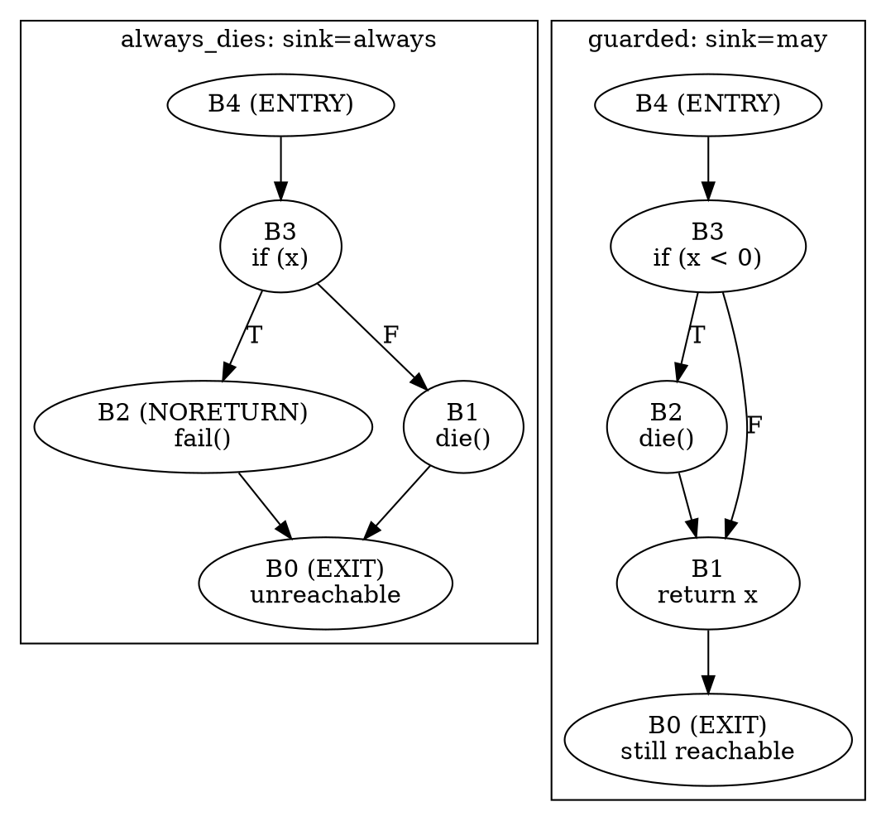

**The order.** `llvm::scc_begin(&CG)` hands out the components callees first (Section 9.2), so when a component is processed every function outside it already has its final summary. For an acyclic component (one function, no self edge) one pass is enough. For a **cyclic** component the answer of each member depends on the others, so the tool iterates. This is the loop, from `tools/p10_summary/Summary.h`:

```cpp
    for (;;) {
      std::vector<Summary> Next;
      Next.reserve(S.Members.size());
      bool Changed = false;
      for (const CallGraphNode *N : S.Members) {
        Summary V = R.Opt.P == Prop::Sink ? sinkTransfer(N) : depthTransfer(N);
        Changed |= !V.sameValue(val(N));
        Next.push_back(V);
      }
      for (size_t K = 0; K < Next.size(); ++K) val(S.Members[K]) = Next[K];
      if (R.Opt.Trace) S.Passes.push_back(std::move(Next));
      if (!S.Cyclic || !Changed) return;
      ++S.Iter;
    }
```

Each pass computes every member from the values of the **previous** pass and writes them all at once (a Jacobi pass), so the number of passes depends on the graph and not on the order in which the members are visited. `iter` counts the passes, including the last one, which changes nothing and proves the fixed point.

```bash
build/bin/p10_summary manifests/p10_sink.cpp --prop=sink
```

```text expected
scc 0: fail iter=1
summary fail: sink=always
scc 1: die iter=1
summary die: sink=always via fail
scc 2: always_dies iter=1
summary always_dies: sink=always via fail
scc 3: guarded iter=1
summary guarded: sink=may via die
scc 4: safe iter=1
summary safe: sink=none
scc 5 cyclic: retry iter=2
summary retry: sink=may via fail
scc 6 cyclic: fact iter=1
summary fact: sink=none
scc 7 cyclic: ping pong iter=3
summary ping: sink=may via pong
summary pong: sink=may via die
scc 8 cyclic: ring_a ring_b ring_c iter=4
summary ring_a: sink=may via ring_b
summary ring_b: sink=may via ring_c
summary ring_c: sink=may via fail
scc 9: level4 iter=1
summary level4: sink=none
scc 10: level3 iter=1
summary level3: sink=none
scc 11: level2 iter=1
summary level2: sink=none
scc 12: level1 iter=1
summary level1: sink=none
scc 13: top iter=1
summary top: sink=none
scc 14: main iter=1
summary main: sink=may via guarded
```

One `scc` line per component, in processing order (`fail` first, `main` last), then one `summary` line per member. `via X` names the next function of the shortest chain to a sink, so `guarded: sink=may via die` reads "guarded can reach a sink, through die" (Section 10.4 shows where that chain comes from). The answers match the table. Look at `always_dies` and `guarded`: both have a sink on a branch, and only the CFG tells `always` from `may`.

**The fixed point, pass by pass.** `--trace` prints every pass of every cyclic component. The three-member cycle is the interesting one: `ring_c` is the only member that calls the sink directly.

```bash
build/bin/p10_summary manifests/p10_sink.cpp --prop=sink --trace --func=ring_a --edges
```

```text expected
scc 8 cyclic: ring_a ring_b ring_c iter=4
trace scc 8 iter 1: ring_a=none ring_b=none ring_c=may
trace scc 8 iter 2: ring_a=none ring_b=may ring_c=may
trace scc 8 iter 3: ring_a=may ring_b=may ring_c=may
trace scc 8 iter 4: ring_a=may ring_b=may ring_c=may
summary ring_a: sink=may via ring_b
summary ring_b: sink=may via ring_c
summary ring_c: sink=may via fail
edge ring_a -> ring_b
edge ring_b -> ring_c
edge ring_c -> ring_a
```

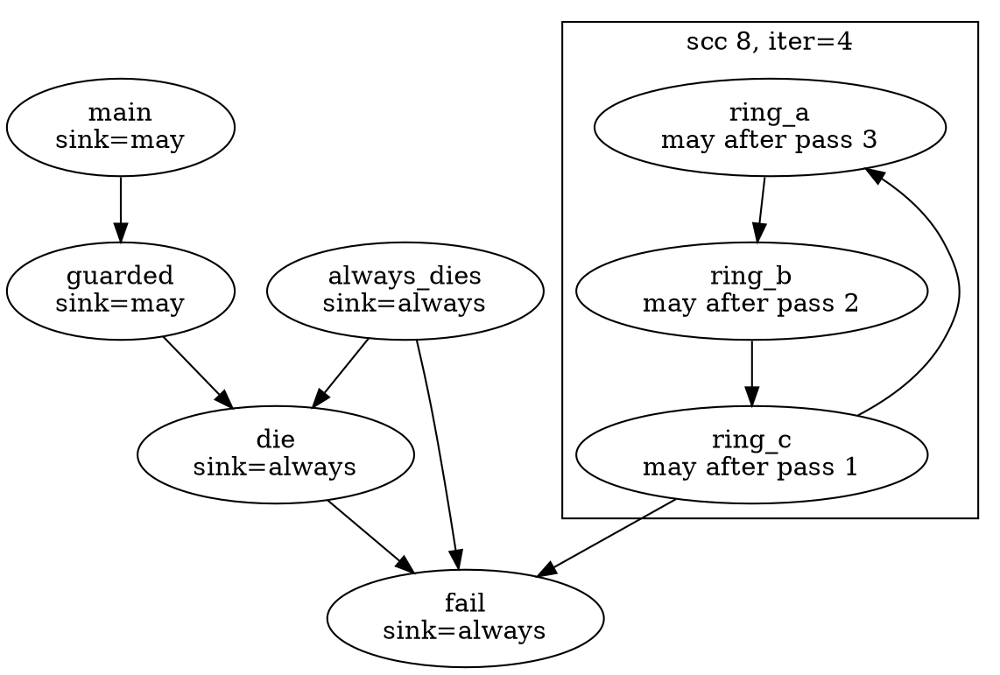

Pass 1 changes only `ring_c` (it calls `fail`, a `may`-or-better callee). `ring_b` calls `ring_c`, which was `none` when pass 1 started, so it learns one pass later; `ring_a` learns in pass 3; pass 4 changes nothing. The fact travels **one call edge per pass**, against the direction of the edges, and passes are only needed because the SCC is a cycle: outside one, the callee-first order already delivered the answer. The same count for every cyclic component:

```bash
build/bin/p10_summary manifests/p10_sink.cpp --prop=sink | grep cyclic
```

```text expected
scc 5 cyclic: retry iter=2
scc 6 cyclic: fact iter=1
scc 7 cyclic: ping pong iter=3
scc 8 cyclic: ring_a ring_b ring_c iter=4
```

| Component | Members *k* | `iter` | Why |
|-----------|------------:|-------:|-----|
| `retry` | 1 | 2 | pass 1 finds `may` (the sink is a direct callee), pass 2 confirms |
| `fact` | 1 | 1 | nothing is ever `may`: pass 1 changes nothing |
| `ping`, `pong` | 2 | 3 | `pong` is `may` in pass 1 (it calls `die`), `ping` in pass 2, pass 3 confirms |
| `ring_a`, `ring_b`, `ring_c` | 3 | 4 | the sink needs three passes to travel round the cycle |

For a boolean "may reach" property the bound is *k* + 1 passes: at most one member per pass is newly right, and one more pass to see that nothing changed. With the three-point lattice the general bound is the lattice height times *k*, plus the confirming pass.

> [!warning] The summary only knows the graph's edges
> A sink behind a function pointer, a virtual call, a block variable, an implicit destructor or a `delete` is invisible: the holes of Section 8.6 and the `missing:` classes of Section 10.1 apply here unchanged. `none` means "no recorded chain reaches a sink", not "this function cannot terminate the program".

### Verify

The bound says a cyclic component of *k* members needs at most *k* + 1 passes. Predict the check for the four components above, then compute it from the `scc` lines (the members are the words between `cyclic:` and `iter=`):

```bash
build/bin/p10_summary manifests/p10_sink.cpp --prop=sink |
  awk '/cyclic/ { split($NF, a, "="); m = NF - 4; printf "members=%d iter=%d bound=%d %s\n", m, a[2], m + 1, (a[2] <= m + 1 ? "ok" : "VIOLATED") }'
```

### Expected

```text expected
members=1 iter=2 bound=2 ok
members=1 iter=1 bound=2 ok
members=2 iter=3 bound=3 ok
members=3 iter=4 bound=4 ok
```

Every component is within its bound. Three of them use all of it (`retry`, `ping`/`pong` and the ring): a sink is reachable, enters through one member and has to be learned by the rest. `fact` stops after one pass because nothing in it ever changes.

> [!hint]- Quiz: why does a boolean "may reach a sink" summary need at most *k* + 1 passes for a cyclic component of *k* members?
> How far does a newly known `may` travel in one pass, and how long can the chain through the component be?

> [!success]- Answer
> A pass reads only the previous pass's values, so a newly known `may` moves one call edge per pass. A fact enters the component through one member (pass 1) and has to reach the other *k* - 1 members, one more per pass, so at most *k* passes change something; one more pass sees that nothing changed. The property only ever moves up a finite lattice (`none` to `may`), so it must stop.

### Common mistakes

| Mistake | Symptom |
|---------|---------|
| Processing functions in reverse post-order for a bottom-up summary | a caller reads its callee's initial value; the results depend on source order |
| Iterating cycles in place (updating a member and reading it in the same pass) | the `iter` count depends on the visiting order, and some orders converge faster; use passes that read the previous values |
| Treating `may` as "every path" | `guarded` is `may`; only the CFG check gives `always` |
| Trusting `none` | a sink behind a function pointer or an implicit destructor is invisible (Section 8.6, Section 10.1) |

### Exercises

1. Copy `manifests/p10_sink.cpp` to `out/ex_sink.cpp` and add `if (n == 7) die();` at the start of `ring_a`. Predict the `iter` of `scc 8` and the trace before you run `build/bin/p10_summary out/ex_sink.cpp --prop=sink --trace --func=ring_a`.
2. `--prop=sink --sink=safe`: which functions leave `none`, and with which level? `--prop=depth` has the numbers for the length of the chain from `main` to `safe`.

---

## Section 10.4 — Widening and the limits of a summary: `depth`, `inf` and call-site context

### Why

A summary is only as good as its lattice, and not every property has a finite one. "How deep can the call chain get?" grows by one for every trip round a cycle, so iterating never stops. And even a property with a perfect lattice has a limit that no amount of iteration removes: a summary describes the function for *all* callers at once. This section shows both, and then the one useful thing the summary keeps from the call graph: the chain behind its `via`.

### What to Do

**Sample file:** `manifests/p10_sink.cpp` again.

**A property without a fixed point: `depth`.** `--prop=depth` computes the length of the longest call chain below a function: 0 for a leaf, one more than the deepest callee otherwise. On a cycle that never settles (every pass adds one more call), so the tool **widens**: all members of a cyclic component jump straight to the top of the lattice, `inf`, and are not iterated (`iter=1`). This is the same idea as the widening in Part 6.3, in a lattice you can see:

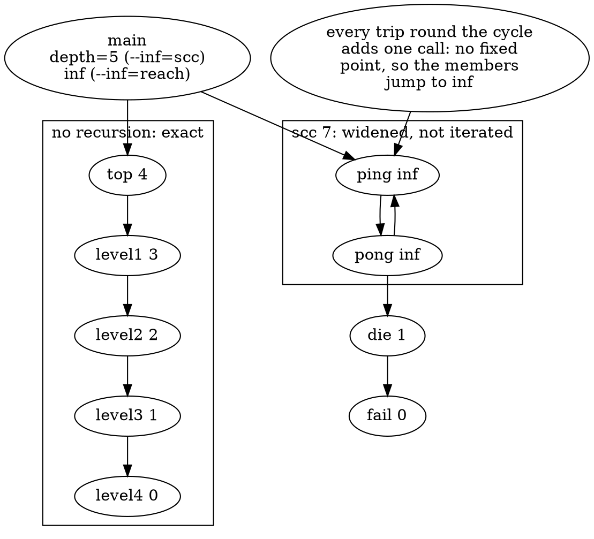

```bash
build/bin/p10_summary manifests/p10_sink.cpp --prop=depth | grep '^summary'
```

```text expected
summary fail: depth=0
summary die: depth=1 via fail
summary always_dies: depth=2 via die
summary guarded: depth=2 via die
summary safe: depth=0
summary retry: depth=inf
summary fact: depth=inf
summary ping: depth=inf
summary pong: depth=inf
summary ring_a: depth=inf
summary ring_b: depth=inf
summary ring_c: depth=inf
summary level4: depth=0
summary level3: depth=1 via level4
summary level2: depth=2 via level3
summary level1: depth=3 via level2
summary top: depth=4 via level1
summary main: depth=5 via top
```

The non-recursive chain is exact: `level4` is 0, `level3` is 1, ... `top` is 4 (`via level1`), and `main` is 5 (`via top`). Every member of a cycle is `inf`. By default only the *members* are `inf`: `main` calls `ping`, which is `inf`, but the tool counts that call as one step and reports the finite depth of the other chain. `--inf=reach` propagates `inf` to every caller of a cycle instead, which is the stricter reading of "can this recurse without bound?":

```bash
build/bin/p10_summary manifests/p10_sink.cpp --prop=depth --inf=reach | grep -E 'summary (guarded|ping|main)'
```

```text expected
summary guarded: depth=2 via die
summary ping: depth=inf
summary main: depth=inf via ping
```

> [!warning] A summary has no call-site context
> `main` calls `guarded(1)`, and `guarded(1)` never reaches `die` because `x < 0` is false; the summary says `may` regardless. A summary describes the function for *all* callers. That is what makes it cheap (computed once per function, in a fixed order) and also what makes it imprecise. Section 10.5 keeps callers apart with call strings, and Sections 10.6 and 10.8 descend with the caller's state.

**Where `via` comes from.** For the `sink` property the tool also records the first step of the **shortest call chain** from the function to a sink: breadth-first over the callees, through functions that may reach a sink, in call-site order. That chain is the witness a diagnostic would print; `p09_walk --path` (Section 9.6) finds a shortest chain on the whole graph in the same way. `main` has two ways to a sink; the summary's `via` is the first hop of the shorter one:

```bash
build/bin/p10_summary manifests/p10_sink.cpp --prop=sink --func=main | grep '^summary'
```

```text expected
summary main: sink=may via guarded
```

```bash
build/bin/p09_walk manifests/p10_sink.cpp --path=main,fail --all-paths --max-paths=3
```

```text expected
path main -> guarded -> die -> fail (3 calls)
path main -> ping -> pong -> die -> fail (4 calls)
paths: 2 shown, 2 found, limit 8
```

`summary main: sink=may via guarded` is the first hop of `main -> guarded -> die -> fail` (3 calls), the first path `--all-paths` lists (shortest first; the plain `--path=main,fail` of Section 9.6 prints only that one). The other chain, through `ping` and `pong`, is one call longer, so it is not the witness. The summary stores one `via` per function, so it can only ever name the first hop: the full chain is rebuilt by following the `via` of each function in turn, or by a path search like `--path`.

> [!warning] The summary only knows the graph's edges
> As in Section 10.3: no pointer, virtual, block-variable, implicit-destructor or `delete` edge, so `main`'s witness chain is only a chain *of recorded calls*.

### Verify

Any function can be the sink. Declare `die` the sink with `--sink=NAME` and predict what happens to `always_dies` (it calls `fail()` on one branch and `die()` on the other), `retry`, and the `ring_*` functions, which only ever reached `fail` directly:

```bash
build/bin/p10_summary manifests/p10_sink.cpp --prop=sink --sink=die | grep -E '^summary (die|always_dies|guarded|retry|ring_a|ping|main):'
```

### Expected

```text expected
summary die: sink=always
summary always_dies: sink=may via die
summary guarded: sink=may via die
summary retry: sink=none
summary ping: sink=may via pong
summary ring_a: sink=none
summary main: sink=may via guarded
```

`die` itself is now the `always` sink. `always_dies` fell from `always` to `may`: its `if (x) fail();` branch no longer ends in a sink, so there is a path from `ENTRY` to `EXIT` that avoids every sink. `retry` and the ring reached only `fail`, so they are `none`. `ping` is still `may` (through `pong`'s call to `die`).

> [!hint]- Quiz: what happens to `depth` if you iterate a cyclic component instead of widening it?
> What does one more trip round `ping -> pong -> ping` do to the depth of each member?

> [!success]- Answer
> Every pass adds one: `ping` is 1 more than `pong`, `pong` is 1 more than `ping`, and the values grow without bound, so there is no fixed point and the loop never ends. The lattice of natural numbers has infinite height. Widening cuts the climb: the members of a cyclic component go straight to `inf` (`iter=1`), which is a sound answer to "can this recurse without bound?" and costs one pass.

### Common mistakes

| Mistake | Symptom |
|---------|---------|
| Expecting `depth` to be finite for recursion | it is `inf` by definition; widen instead of iterating |
| Expecting `via` to name the whole chain | it names the first hop of the shortest one; follow it, or run `p09_walk --path` |
| Reading `main: depth=5` as "no recursion below `main`" | by default only the *members* of a cycle are `inf`; `--inf=reach` marks the callers |

### Exercises

1. `build/bin/p10_summary manifests/p10_sink.cpp --prop=sink --trace` prints a trace for every cyclic component. In which pass does each member first become `may`? No pass changes two members here: what shape of cycle would make two members change in the same pass?
2. Run `build/bin/p09_walk manifests/p10_sink.cpp --path=main,fail --all-paths --max-len=3`. Which of the two chains disappears, and why does `--all-paths` only list *simple* paths (no function twice) in a graph with cycles?

---

## Section 10.5 — Context sensitivity: k-limited call strings

### Why

A summary has one answer per function, so it must merge the answers of all callers (the warning of Section 10.4). When the answer depends on who called, the merged answer is "maybe", and every caller pays for the worst one. **Context sensitivity** keeps the callers apart. The simplest way to name a context is the **call string**: the call sites that led to the function, most recent last. Keeping all of them is impossible with recursion (the string never stops growing), so you keep the last *k*: a *k*-limited call string.

### What to Do

**Sample file:** `manifests/p10_callstrings.cpp` — one question, "may the divisor of `divide` be zero?", and callers that answer it differently.

| Function | Body | What it shows |
|----------|------|---------------|
| `divide(a, b)` | `return a / b;` | the division the analysis watches |
| `safe()` | `divide(10, 2)` | a divisor that is never zero |
| `risky(x)` | `divide(x, 0)` | a divisor that is always zero (`x` only feeds `a`) |
| `pass_on(d)`, `forward(v)` | `divide(100, d)`; `pass_on(v)` | a parameter handed on unchanged through two levels |
| `loop(n)` | `if (n <= 0) return risky(n); return loop(n - 1);` | recursion: the string never stops growing, so *k* ends the analysis |
| `main()` | calls each once, every call on a line of its own | a call site is `main@L<line>` |

**The analysis.** Clang has no call strings, so `p10_callstrings` carries an algorithm of its own. It is deliberately small, AST only (no CFG), so that every output is predictable:

| Piece | Definition |
|-------|------------|
| value | `zero`, `nonzero` or `top` (either); the join of two different values is `top` |
| where values come from | an argument that is a constant expression is `zero` or `nonzero`; an argument that is one of the caller's parameters has the caller's value in that context; anything else (`n - 1`, a call result) is `top` |
| entry | a function nobody calls: its parameters are `top`, its string is empty |
| context | a function plus a call string of at most *k* sites, oldest first; a site is `<caller>@L<line>` |
| cutting | when a call would make the string longer than *k*, the oldest sites are dropped and the string starts with `…` |
| edges followed | the call graph's records whose call expression is a plain or member call (no `operator()`) |
| solving | contexts in reverse post-order of the call graph, until no value changes |
| recursion | ends because the string is cut at *k*, not because of a fixed point over the graph |
| report | a `/` or `%` whose divisor is a parameter that is `zero` or `top` in that context |

It is the call-strings approach of Sharir and Pnueli's 1981 paper on interprocedural data-flow analysis; the other approach in that paper, the functional one, is what a summary is. Note the direction: the summaries of Section 10.3 flow from callees to callers ("what does this function do?"), the values here flow from callers to callees ("what am I called with?").

The output, one record per line:

| Line | Meaning |
|------|---------|
| `ctx k=<k> <fn>[<sites>]: <param>=<value> ...` | a context and the join of the values every call that reached it passed in (`-` when the function has no integer parameter) |
| `trace <fn>[...] <- <caller>[...] @L<line>: <param>=<value> ...` | with `--trace`: one line per call into the context, with the values that call brought |
| `warn <file>:<line>: <fn>[...] divides by <param>=zero\|top` | a division by a parameter that may be zero in this context |
| `summary: k=<k> contexts=<n> functions=<m> warnings=<w>` | the totals |

**k = 0: one context per function.** An empty string, so every caller of `divide` lands in the same context and the values are joined: `zero` from `risky`, `nonzero` from the others, `top` overall. This is the context-insensitive answer, the one a summary also has:

```bash
build/bin/p10_callstrings manifests/p10_callstrings.cpp --k=0 --trace
```

```text expected
ctx k=0 divide[]: a=top b=top
trace divide[] <- risky[] @L18: a=top b=zero
trace divide[] <- safe[] @L16: a=nonzero b=nonzero
trace divide[] <- pass_on[] @L20: a=nonzero b=nonzero
warn p10_callstrings.cpp:14: divide[] divides by b=top
ctx k=0 forward[]: v=nonzero
trace forward[] <- main[] @L31: v=nonzero
ctx k=0 loop[]: n=top
trace loop[] <- main[] @L32: n=nonzero
trace loop[] <- loop[] @L25: n=top
ctx k=0 main[]: -
ctx k=0 pass_on[]: d=nonzero
trace pass_on[] <- forward[] @L21: d=nonzero
ctx k=0 risky[]: x=top
trace risky[] <- main[] @L29: x=nonzero
trace risky[] <- loop[] @L24: x=top
ctx k=0 safe[]: -
trace safe[] <- main[] @L30: -
summary: k=0 contexts=7 functions=7 warnings=1
```

The warning says `divide[] divides by b=top`: "may be zero", with no hint of who passes the zero. It is also the verdict `safe` is judged by, although `safe` never divides by zero: at *k* = 0 nothing separates its call from `risky`'s.

**k = 1: one context per last call site.** Each caller of `divide` now has a context of its own, named by the call that reached it:

```bash
build/bin/p10_callstrings manifests/p10_callstrings.cpp --k=1 --trace
```

```text expected
ctx k=1 divide[…,pass_on@L20]: a=nonzero b=nonzero
trace divide[…,pass_on@L20] <- pass_on[…,forward@L21] @L20: a=nonzero b=nonzero
ctx k=1 divide[…,risky@L18]: a=top b=zero
trace divide[…,risky@L18] <- risky[main@L29] @L18: a=nonzero b=zero
trace divide[…,risky@L18] <- risky[…,loop@L24] @L18: a=top b=zero
warn p10_callstrings.cpp:14: divide[…,risky@L18] divides by b=zero
ctx k=1 divide[…,safe@L16]: a=nonzero b=nonzero
trace divide[…,safe@L16] <- safe[main@L30] @L16: a=nonzero b=nonzero
ctx k=1 forward[main@L31]: v=nonzero
trace forward[main@L31] <- main[] @L31: v=nonzero
ctx k=1 loop[main@L32]: n=nonzero
trace loop[main@L32] <- main[] @L32: n=nonzero
ctx k=1 loop[…,loop@L25]: n=top
trace loop[…,loop@L25] <- loop[main@L32] @L25: n=top
trace loop[…,loop@L25] <- loop[…,loop@L25] @L25: n=top
ctx k=1 main[]: -
ctx k=1 pass_on[…,forward@L21]: d=nonzero
trace pass_on[…,forward@L21] <- forward[main@L31] @L21: d=nonzero
ctx k=1 risky[main@L29]: x=nonzero
trace risky[main@L29] <- main[] @L29: x=nonzero
ctx k=1 risky[…,loop@L24]: x=top
trace risky[…,loop@L24] <- loop[main@L32] @L24: x=nonzero
trace risky[…,loop@L24] <- loop[…,loop@L25] @L24: x=top
ctx k=1 safe[main@L30]: -
trace safe[main@L30] <- main[] @L30: -
summary: k=1 contexts=11 functions=7 warnings=1
```

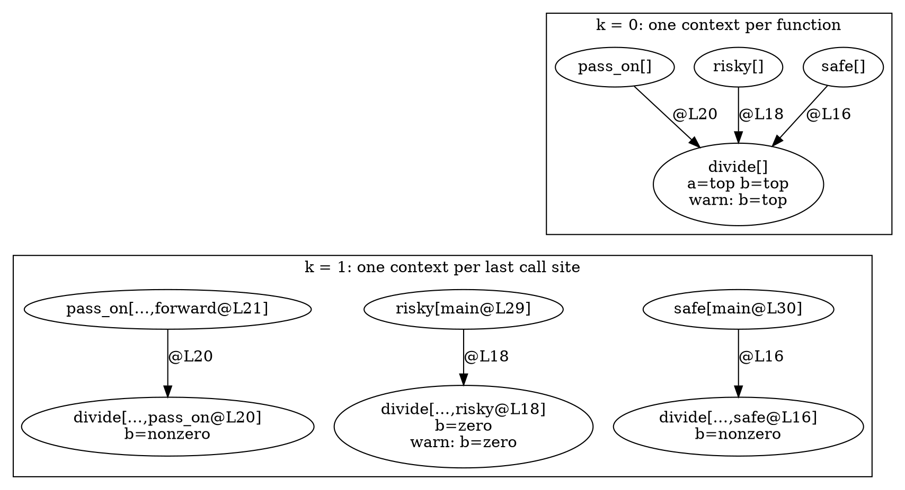

`divide` has three contexts, and the warning moved from "maybe" to the one context where the divisor really is `zero`: `divide[…,risky@L18]`. `safe` is clean. Three things to read in the trace:

- **The ellipsis.** `divide[…,safe@L16]` is `main@L30, safe@L16` cut to its last site: `main@L30` was dropped, which is what the `…` records. `safe[main@L30]` is not cut: nothing older than `main` exists.
- **Forwarding.** `pass_on[…,forward@L21]` received `d=nonzero` from `forward`, which received `v=nonzero` from `main`: a parameter handed on unchanged keeps its value across two levels.
- **Merging.** `divide[…,risky@L18]` has *two* `trace` lines: from `risky[main@L29]` (with `a=nonzero`) and from `risky[…,loop@L24]` (with `a=top`). A string of length 1 cannot tell them apart, so their values are joined: `a=top`, `b=zero` (both bring a zero divisor). Everything older than the last *k* sites is merged: that is the price of the limit.

**k = 2: two sites, and recursion capped.** The chain behind the warning is now visible in the string, and the recursive caller shows what the limit does:

```bash
build/bin/p10_callstrings manifests/p10_callstrings.cpp --k=2 --func=divide
build/bin/p10_callstrings manifests/p10_callstrings.cpp --k=2 --func=loop --trace
```

```text expected
ctx k=2 divide[main@L29,risky@L18]: a=nonzero b=zero
warn p10_callstrings.cpp:14: divide[main@L29,risky@L18] divides by b=zero
ctx k=2 divide[main@L30,safe@L16]: a=nonzero b=nonzero
ctx k=2 divide[…,forward@L21,pass_on@L20]: a=nonzero b=nonzero
ctx k=2 divide[…,loop@L24,risky@L18]: a=top b=zero
warn p10_callstrings.cpp:14: divide[…,loop@L24,risky@L18] divides by b=zero
summary: k=2 contexts=14 functions=7 warnings=2
ctx k=2 loop[main@L32]: n=nonzero
trace loop[main@L32] <- main[] @L32: n=nonzero
ctx k=2 loop[main@L32,loop@L25]: n=top
trace loop[main@L32,loop@L25] <- loop[main@L32] @L25: n=top
ctx k=2 loop[…,loop@L25,loop@L25]: n=top
trace loop[…,loop@L25,loop@L25] <- loop[main@L32,loop@L25] @L25: n=top
trace loop[…,loop@L25,loop@L25] <- loop[…,loop@L25,loop@L25] @L25: n=top
summary: k=2 contexts=14 functions=7 warnings=2
```

`divide[main@L29,risky@L18]` reads as a chain: `main` line 29 called `risky`, whose line 18 called `divide` with a zero. That is a witness chain like the ones of Section 9.6, produced as a by-product. The second warning, `divide[…,loop@L24,risky@L18]`, goes through the recursive function. `loop` has three contexts: the call from `main`, the first recursive call, and `loop[…,loop@L25,loop@L25]`, the context of "`loop` called from `loop` called from `loop`" with everything older cut off. Its trace has a line from itself: that is where recursion ends. Without the cut there would be one context per recursion depth, without end.

**What each *k* costs.** Every call site the string remembers multiplies the possible contexts: a function can have up to (number of call sites)^*k* strings. In this sample only the recursion makes strings grow, so the growth is linear:

```bash
for k in 0 1 2 3 4 5; do build/bin/p10_callstrings manifests/p10_callstrings.cpp --k=$k | tail -1; done
```

```text expected
summary: k=0 contexts=7 functions=7 warnings=1
summary: k=1 contexts=11 functions=7 warnings=1
summary: k=2 contexts=14 functions=7 warnings=2
summary: k=3 contexts=17 functions=7 warnings=3
summary: k=4 contexts=20 functions=7 warnings=4
summary: k=5 contexts=23 functions=7 warnings=5
```

The first step adds four contexts (the callers split), each later step adds three (the recursive `loop`, the `risky` it calls and the `divide` below it each get one more). The warnings grow too, but every new one is a true one (`b=zero`): the same division reached by one more route, each with a longer chain. More precision, more output, more time.

The tool stops instead of running away. A context limit of 5000 turns a runaway *k* into an error with exit status 2:

```bash
build/bin/p10_callstrings manifests/p10_callstrings.cpp --k=2000; echo "exit=$?"
```

```text expected
error: more than 5000 contexts; lower --k
exit=2
```

> [!warning] The analysis is small on purpose
> It follows integer parameters through direct calls only. A pointer call, a virtual call, a divisor that is a local variable, a loop that decrements the divisor: all `top` or invisible. The numbers prove the mechanism (contexts, merging, the cut), not the quality of a divide-by-zero checker. A real one would run the framework of Part 6 over each context's CFG (Section 10.8 shows what carrying a state across a call costs there).

### Verify

The warning is a *true* positive when it names a context whose divisor is `zero`. Predict, for *k* = 0, 1 and 2, whether the warnings say `top` or `zero`, and how many there are, then print them:

```bash
for k in 0 1 2; do build/bin/p10_callstrings manifests/p10_callstrings.cpp --k=$k | grep '^warn' | sed "s/^/k=$k /"; done
```

### Expected

```text expected
k=0 warn p10_callstrings.cpp:14: divide[] divides by b=top
k=1 warn p10_callstrings.cpp:14: divide[…,risky@L18] divides by b=zero
k=2 warn p10_callstrings.cpp:14: divide[main@L29,risky@L18] divides by b=zero
k=2 warn p10_callstrings.cpp:14: divide[…,loop@L24,risky@L18] divides by b=zero
```

At *k* = 0 the only warning is `top`: a maybe that cannot be acted on. From *k* = 1 every warning is `zero` and names the call that passes it, and at *k* = 2 the two routes to `risky` (from `main` directly and through `loop`) are two warnings with two chains.

> [!hint]- Quiz: with *k* = 1 the warning names `divide[…,risky@L18]`. Why can it not say which call in `main` started the chain, and what would you change?
> What does a string of length 1 keep, and what does the `…` record?

> [!success]- Answer
> The string keeps only the last call site, `risky@L18`; `main@L29` was dropped when the call to `divide` made the string longer than 1, and the `…` is the mark of that drop. Every route into `risky` that ends in the same call site is the same context, so their values are joined (the `a=top` of the trace). Raising *k* to 2 keeps `main@L29` and splits the contexts again, at the price of more contexts. Nothing makes the limit exact: some *k* is always too small for some chain.

### Common mistakes

| Mistake | Symptom |
|---------|---------|
| Reading `…` as "unknown" | it means "older call sites were dropped"; the values are still the join of every call that reached the context |
| Expecting *k* = 0 to be a summary | it is context-insensitive like one, but it flows values from callers to callees; a summary flows facts from callees to callers |
| Raising *k* until the warnings are "right" | a larger *k* only moves the merge point further away; the cost grows with the number of call strings |
| Believing the limit is what keeps the analysis finite | the context count is bounded by the strings; the *k* only bounds their length |

### Exercises

1. Copy the sample to `out/ex_cs.cpp`, add `int third() { return divide(8, 0); }` above `main` and `total += third();` after the `loop` call. Predict the number of `divide` contexts and warnings at *k* = 1 before you run `build/bin/p10_callstrings out/ex_cs.cpp --k=1`. Is the new context merged into an existing one, or does it stand alone?
2. `--k=2 --edges` prints the function-level call edges next to the contexts. `loop` has two incoming edges in the call graph (from `main` and from itself) but three contexts. Which two contexts come from the one self edge, and what tells them apart?

---

## Section 10.6 — How the Static Analyzer goes interprocedural: `CallEvent` kinds, inlining versus conservative evaluation, `RuntimeDefinition` and the exploded graph

### Why

Everything so far was built from the outside: a call graph, then a pass over it. The Static Analyzer is interprocedural in another way, and never builds a call-graph summary at all. It explores the paths of one function, and when a path reaches a call it decides on the spot: continue **into the callee's body** with the state of this path (**inlining**), or step over the call and assume as little as possible (**conservative evaluation**). Which of the two happened, and why, decides whether a bug is found. You can watch every decision from the command line, which makes this the best place to learn what "context-sensitive" costs in a production engine.

### What to Do

**Sample file:** `manifests/p10_analyzer.cpp` — run it through the analyzer only (`scripts/dumpcfg.sh`), never through a `build/bin` tool. `main` asks four questions with `clang_analyzer_eval` (checker `debug.ExprInspection`), and `null_chain` passes a null pointer two calls down.

| Line | Question | What it needs |
|------|----------|---------------|
| 29 | `helper(1) == 2` | a small plain function inlined |
| 30 | `big(0) == 0` | a function with five `if`s inlined (it is bigger than the shallow mode allows) |
| 32 | `dispatch(d) == 11` | a virtual call: only the dynamic type of `d` tells `Derived::run` from `Base::run` |
| 33 | `fact(3) == 6` | recursion: three nested frames |
| 37-39 | `null_chain` | the null pointer travels `forward_ptr` and `read_ptr` before it is dereferenced |

`clang_analyzer_eval(e)` reports `TRUE` when the engine proves `e` on every path and `FALSE` when it proves the opposite. When it cannot decide it explores both outcomes, so the line gets a `FALSE` **and** a `TRUE` report: that is "unknown", and it is what a conservatively evaluated call looks like.

**What the engine sees: `CallEvent`.** Every call on a path is wrapped in a `CallEvent` (`StaticAnalyzer/Core/PathSensitive/CallEvent.h`), a small class per kind of call. The kind decides which rules apply (a constructor needs different permissions than a plain function):

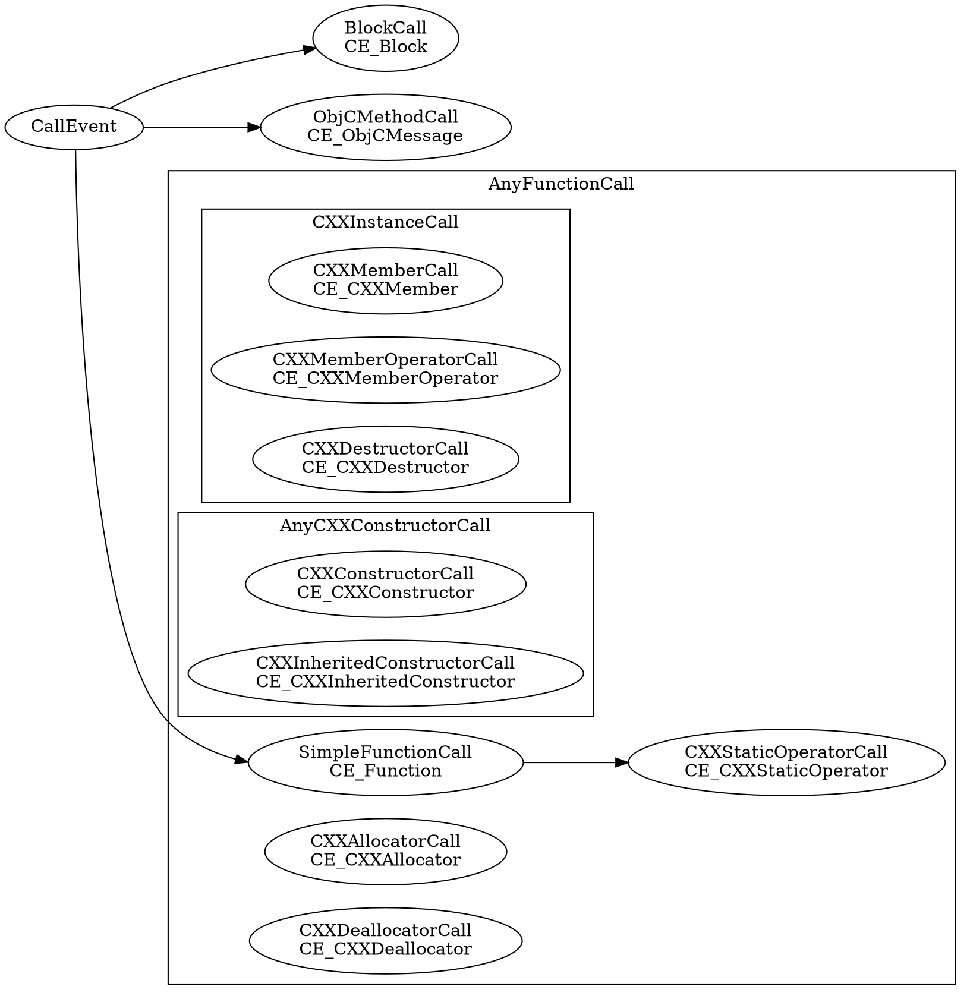

The clusters are the abstract classes between `CallEvent` and the concrete ones (`AnyFunctionCall`, `CXXInstanceCall`, `AnyCXXConstructorCall`); the highlighted kinds are the ones this sample produces. The eleven `CE_` kinds are finer than the eight `AnyCall::Kind`s of Section 10.1, which folds the four function-like kinds into `Function`:

| `AnyCall::Kind` | `CallEvent` kind |
|-----------------|------------------|
| `Function` | `CE_Function`, `CE_CXXStaticOperator`, `CE_CXXMember`, `CE_CXXMemberOperator` |
| `Constructor`, `InheritedConstructor` | `CE_CXXConstructor`, `CE_CXXInheritedConstructor` |
| `Destructor` | `CE_CXXDestructor` |
| `Allocator`, `Deallocator` | `CE_CXXAllocator`, `CE_CXXDeallocator` |
| `Block`, `ObjCMethod` | `CE_Block`, `CE_ObjCMessage` |

`debug.AnalysisOrder` prints the kind of every call in the order the engine evaluates it. `PreCall` and `PostCall` are the checkers' hooks before and after a call is evaluated, so a callee that is inlined shows its own calls between the two:

```bash
CHECKER=debug.AnalysisOrder scripts/dumpcfg.sh manifests/p10_analyzer.cpp \
  -Xclang -analyzer-config -Xclang debug.AnalysisOrder:PreCall=true,debug.AnalysisOrder:PostCall=true 2>&1 |
  grep -E '^(Pre|Post)Call' | grep -v clang_analyzer_eval
```

```text expected
PreCall (forward_ptr) [SimpleFunctionCall]
PreCall (read_ptr) [SimpleFunctionCall]
PreCall (helper) [SimpleFunctionCall]
PostCall (helper) [SimpleFunctionCall]
PreCall (big) [SimpleFunctionCall]
PostCall (big) [SimpleFunctionCall]
PreCall (Derived::Derived) [CXXConstructorCall]
PreCall (Base::Base) [CXXConstructorCall]
PostCall (Base::Base) [CXXConstructorCall]
PostCall (Derived::Derived) [CXXConstructorCall]
PreCall (dispatch) [SimpleFunctionCall]
PreCall (Base::run) [CXXMemberCall]
PostCall (Base::run) [CXXMemberCall]
PostCall (dispatch) [SimpleFunctionCall]
PreCall (fact) [SimpleFunctionCall]
PreCall (fact) [SimpleFunctionCall]
PreCall (fact) [SimpleFunctionCall]
PostCall (fact) [SimpleFunctionCall]
PostCall (fact) [SimpleFunctionCall]
PostCall (fact) [SimpleFunctionCall]
PreCall (Derived::~Derived) [CXXDestructorCall]
PreCall (Base::~Base) [CXXDestructorCall]
PostCall (Base::~Base) [CXXDestructorCall]
PostCall (Derived::~Derived) [CXXDestructorCall]
```

Read it as a call tree. `PreCall (dispatch)` ... `PreCall (Base::run)` ... `PostCall (Base::run)` ... `PostCall (dispatch)`: `run` was entered *inside* `dispatch`, which is what inlining looks like from outside. The three `PreCall (fact)` in a row are three nested frames, and `Derived::Derived` contains `Base::Base` the same way. The first two lines belong to `null_chain`, the first top-level function the engine analyses: its path ends at the dereference, so the two calls have no `PostCall`.

**Static versus runtime callee: `RuntimeDefinition`.** `PreCall (Base::run)` is the *static* declaration: `CallEvent::getDecl()` is what the source names, `Base::run`. The engine asks a second question, `getRuntimeDefinition()`, which returns a `RuntimeDefinition`:

| Member | Meaning |
|--------|---------|
| `getDecl()` | the declaration that will run on this path, or null when unknown |
| `mayHaveOtherDefinitions()` | true when the dynamic type is not exact: a different override may run |
| `getDispatchRegion()` | the region whose runtime type decides, when `mayHaveOtherDefinitions()` is true |
| `isForeign()` | the definition was imported by the ASTImporter (cross-translation-unit analysis, Section 11.6) |

For a virtual call (`CXXInstanceCall::getRuntimeDefinition`) the engine looks at what it knows about the receiver's dynamic type. Here `d` is a local `Derived`, so the type is exact: the runtime definition is `Derived::run` and `mayHaveOtherDefinitions()` is false. Three observations prove it: the result, `1 + 10`, which only `Derived::run` produces; the list of functions the analyzer starts from, below; and the `ipa=inlining` row of the table further down, where a receiver of inexact type would have been refused. A function that was inlined is not analysed again from the top (Section 9.7), and `Base::run`, the static callee that was never entered, **is** a top-level entry, while `Derived::run`, the one that ran, is not:

```bash
scripts/dumpcfg.sh manifests/p10_analyzer.cpp -Xclang -analyzer-display-progress 2>&1 |
  grep 'ANALYZE (Path' | sed -E 's/ : [0-9.]+ ms$//'
```

```text expected
ANALYZE (Path,  Inline_Regular): manifests/p10_analyzer.cpp null_chain()
ANALYZE (Path,  Inline_Regular): manifests/p10_analyzer.cpp main()
ANALYZE (Path,  Inline_Regular): manifests/p10_analyzer.cpp Base::run(int)
```

`null_chain` and `main` are entries because nothing calls them; `Base::run` is one because no path inlined it. The call graph of Part 8 has the edge `dispatch -> Base::run` and nothing else (the static answer, Section 10.1); the analyzer's own bookkeeping is the proof that the static edge is not what ran.

**Inline or conservative: `shouldInlineCall`.** `ExprEngine::evalCall` runs the pre-call checkers, then the checkers that can evaluate the call themselves, then `defaultEvalCall`: ask `getRuntimeDefinition()`, ask `shouldInlineCall(...)`, and either build the callee's stack frame (a `CallEnter` program point, a new `StackFrameContext`) or call `conservativeEvalCall`. A conservative evaluation invalidates every region the callee could write (`invalidateRegions`) and binds a *fresh* symbol as the return value (`bindReturnValue`): the call result is "some int". The source of this is `clang/lib/StaticAnalyzer/Core/ExprEngineCallAndReturn.cpp` in the LLVM 22.1.8 sources (the installed headers declare it but do not contain it); the checks of `shouldInlineCall`, in order:

| # | Check | Switch | Where you see it |
|---|-------|--------|------------------|
| 1 | the `RuntimeDefinition` has a `Decl` | | a call through a pointer of unknown target has none (not exercised here) |
| 2 | the body is synthesised by `BodyFarm` | `faux-bodies` | always inlined, before any limit below (Section 10.7) |
| 3 | the `ipa` mode is not `none` | `ipa` | `ipa=none` |
| 4 | `mayInlineDecl`: the callee has a CFG, is not variadic, is not "huge" (more blocks than `max-inlinable-size`), and the C++ policies allow it (templates, standard library, containers, `shared_ptr` destructors) | `max-inlinable-size`, `c++-template-inlining`, `c++-stdlib-inlining`, `c++-container-inlining`, `c++-shared_ptr-inlining` | `max-inlinable-size=1` |
| 5 | `mayInlineCallKind`: this kind of call is allowed; member functions, constructors and destructors need `ipa` of `inlining` or higher, and `c++-inlining` (cumulative: `methods`, then `constructors`, then `destructors`, the default) | `ipa`, `c++-inlining`, `c++-allocator-inlining` | `ipa=basic-inlining`, `c++-inlining=none` |
| 6 | the stack depth: frames count against the limit unless they are *small* (a CFG without branches, or at most `ipa-always-inline-size` blocks); at the limit only a small, non-recursive callee is still inlined | `-analyzer-inline-max-stack-depth` (a cc1 flag, default 4) | `fact(3)`, Section 9.8 |
| 7 | a *large* function (at least `min-cfg-size-treat-functions-as-large` blocks) is inlined at most `max-times-inline-large` times | both | |

If the call passes all seven and `mayHaveOtherDefinitions()` is true (a virtual call on an inexact type), the `ipa` mode decides: `dynamic-bifurcate` explores **both** (one path inlined, one conservative, once per receiver region), `dynamic` inlines assuming the static type, and any lower mode is conservative. The modes, as `AnalyzerOptions.h` describes them:

| `ipa` | What it inlines |
|-------|-----------------|
| `none` | nothing: intra-procedural only |
| `basic-inlining` | C functions and blocks with a definition |
| `inlining` | callees of C, C++ and Objective-C with a definition; no dynamic dispatch |
| `dynamic` | also dynamically dispatched methods, assuming the static type when it is inexact |
| `dynamic-bifurcate` (default in `mode=deep`) | also dispatched methods, and splits the path when the exact type is unknown |

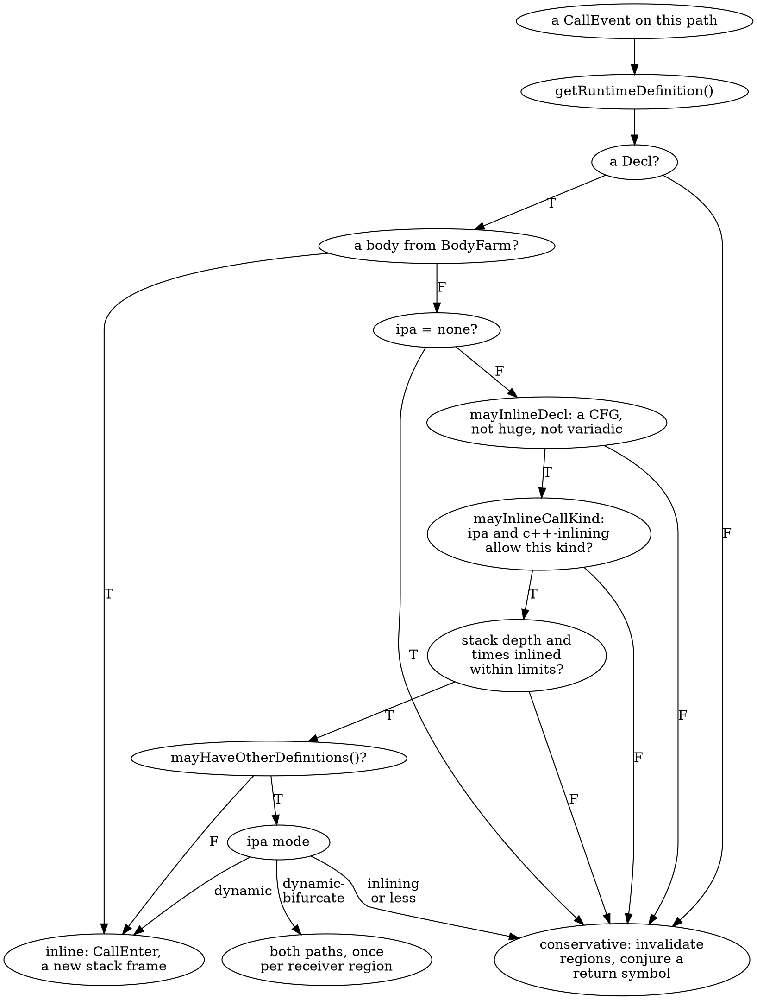

**The decision in action.** The four questions of `main`, under the default mode and four that switch a different check off. One row per setting, one column per question: `T` is `TRUE` on every path, `?` is the `FALSE`-and-`TRUE` pair:

```bash
answers() {
  CHECKER=debug.ExprInspection scripts/dumpcfg.sh manifests/p10_analyzer.cpp "$@" 2>&1 |
    grep ExprInspection | sed -E 's/^[^:]+:([0-9]+):.*warning: ([A-Z]+).*/\1 \2/' | sort -u |
    awk '{ r[$1] = r[$1] $2 } END { for (l = 29; l <= 33; l++) if (l in r) printf " %-8s", (r[l] == "TRUE" ? "T" : "?"); print "" }'
}
printf '%-22s %-8s %-8s %-8s %-8s\n' config helper big dispatch fact
for cfg in ipa=dynamic-bifurcate ipa=none ipa=basic-inlining ipa=inlining c++-inlining=none; do
  printf '%-22s' "$cfg"; answers -Xclang -analyzer-config -Xclang "$cfg"
done
```

```text expected
config                 helper   big      dispatch fact
ipa=dynamic-bifurcate  T        T        T        T
ipa=none               ?        ?        ?        ?
ipa=basic-inlining     T        T        ?        T
ipa=inlining           T        T        T        T
c++-inlining=none      T        T        ?        T
```

- **`ipa=dynamic-bifurcate` (the default):** everything is inlined, all four are `TRUE`.
- **`ipa=none`:** check 3 fails for every call, so all four are unknown.
- **`ipa=basic-inlining`:** plain functions are still inlined (check 3 passes, check 5 passes for `Function` calls), but `b.run(1)` is a member call, which needs `inlining`: only `dispatch(d)` is unknown.
- **`ipa=inlining`:** member calls are allowed, dynamic dispatch is not, and `dispatch(d)` is still `TRUE`: the receiver's type is exact, `mayHaveOtherDefinitions()` is false, and the mode never has to decide (Exercise 2 makes the receiver inexact).
- **`c++-inlining=none`:** the same row as `basic-inlining` from the other side: the member call is refused by check 5 while `ipa` is the default.

`debug.DumpCalls` prints each call as the engine evaluates it, with its result. A `PreCall` prints the call expression (indented by the stack depth, no newline); a `PostCall` prints `Returning` and the value. The addresses and the conjured symbol names vary, so the command normalises them (`0xADDR`, `conj`). Inlined calls return a **value**, conservative ones return a **conjured symbol**:

```bash
for cfg in ipa=dynamic-bifurcate ipa=none; do
  echo "== $cfg"
  CHECKER=debug.DumpCalls scripts/dumpcfg.sh manifests/p10_analyzer.cpp -Xclang -analyzer-config -Xclang $cfg 2>&1 |
    grep -v clang_analyzer_eval | sed -E 's/0x[0-9a-f]+/0xADDR/g; s/conj_\$[0-9]+\{[^}]*\}/conj/g' |
    grep -oE '(helper|big|dispatch|fact)\(.*Returning [^ ]+'
done
```

```text expected
== ipa=dynamic-bifurcate
helper(1)Returning 2
big(0)Returning 0
dispatch(d) b.run(1) Returning 11
fact(3) fact(n - 1)  fact(n - 1)  Returning 1
== ipa=none
fact(n - 1)Returning conj
helper(1)Returning conj
big(0)Returning conj
dispatch(d)Returning conj
fact(3)Returning conj
```

Under the default mode `helper(1)` returns `2` and `big(0)` returns `0`: the engine ran the bodies. `dispatch(d) b.run(1) Returning 11` is a nested pair printed on one line (the outer call's `PreCall`, the inner call's `PreCall`, then the inner `Returning`; the outer `Returning 11` follows on the next line, which the filter drops). `fact(3) fact(n - 1)  fact(n - 1)  Returning 1` is the three-frame recursion. Under `ipa=none` every call returns `conj`, a symbol with no value: `fact(n - 1)Returning conj` is the recursive call inside `fact` analysed **as a top-level function of its own**, because with nothing inlined every function is an entry.

**What it costs to be wrong: a bug that is not found.** `null_chain` is the interprocedural bug of the sample. It exists only on a path that goes through two calls with the null pointer in hand, so it is found exactly when both are inlined:

```bash
for cfg in ipa=dynamic-bifurcate ipa=none max-inlinable-size=1; do
  printf '%-22s' "$cfg"
  CHECKER=core.NullDereference scripts/dumpcfg.sh manifests/p10_analyzer.cpp -Xclang -analyzer-config -Xclang "$cfg" 2>&1 | grep -c 'Dereference of null'
done
```

```text expected
ipa=dynamic-bifurcate 1
ipa=none              0
max-inlinable-size=1  0
```

With `ipa=none` the pointer never reaches `read_ptr`'s body, with `max-inlinable-size=1` both callees count as "huge" (their CFGs have three blocks): the report disappears. Raising the limits finds more bugs and costs time on every path; Section 9.8 lists the switches. When the bug is found, the path report tells the story of the descent. `-analyzer-output=text` turns the path into notes, and every `Calling` note is a `CallEnter`:

```bash
CHECKER=core.NullDereference scripts/dumpcfg.sh manifests/p10_analyzer.cpp \
  -Xclang -analyzer-output=text -Xclang -analyzer-note-analysis-entry-points 2>&1 | grep -E 'warning|note'
```

```text expected
manifests/p10_analyzer.cpp:37:31: warning: Dereference of null pointer (loaded from variable 'p') [core.NullDereference]
manifests/p10_analyzer.cpp:39:5: note: [debug] analyzing from null_chain()
manifests/p10_analyzer.cpp:39:39: note: Passing null pointer value via 1st parameter 'q'
manifests/p10_analyzer.cpp:39:27: note: Calling 'forward_ptr'
manifests/p10_analyzer.cpp:38:43: note: Passing null pointer value via 1st parameter 'p'
manifests/p10_analyzer.cpp:38:34: note: Calling 'read_ptr'
manifests/p10_analyzer.cpp:37:31: note: Dereference of null pointer (loaded from variable 'p')
1 warning generated.
```

`[debug] analyzing from null_chain()` names the top-level entry the path started in (Section 9.7); `Calling 'forward_ptr'` and `Calling 'read_ptr'` are the two inlined frames; the `Passing null pointer value` notes are the arguments that carried the state across the call. This is the "what crosses the call" row of the table in Section 10.8.

### Verify

The report's two `Calling` notes are two `CallEnter` program points in the **exploded graph**, the graph of (program point, state) nodes the engine builds. `-analyzer-dump-egraph=FILE` writes it, and `-trim-egraph` keeps only the nodes on the paths to a report. Predict the number of `CallEnter` nodes (one per inlined frame on the path), then ask the file which functions they enter:

```bash
rm -f out/eg.dot
CHECKER=core scripts/dumpcfg.sh manifests/p10_analyzer.cpp -Xclang -analyzer-dump-egraph=out/eg.dot -Xclang -trim-egraph 2>&1 |
  grep -E '^writing|Trimmed'
grep -oE 'callee_decl[^,]*' out/eg.dot | sed -E 's/.*: //; s/\\"//g'
```

### Expected

```text expected
writing to the newly created file out/eg.dot
warning: Trimmed ExplodedGraph is empty.
warning: Trimmed ExplodedGraph is empty.
forward_ptr(int *)
read_ptr(int *)
```

Two `CallEnter` nodes, for `forward_ptr` and `read_ptr`: the file holds the one function with a report (`null_chain`). The other two top-level functions have no report to trim to, print `Trimmed ExplodedGraph is empty.` and leave the file alone. Node ids in the file are pointers, so only counts and names are stable enough to check; Homebrew does not ship the `exploded-graph-rewriter.py` that draws the file.

> [!hint]- Quiz: `clang_analyzer_eval(dispatch(d) == 11)` is `TRUE` by default and unknown with `c++-inlining=none`. Which `CallEvent` kind was refused, and by which check?
> The plain call `dispatch(d)` is still inlined in that run. Which call inside it is not?

> [!success]- Answer
> The `CE_CXXMember` call `b.run(1)` inside `dispatch`. Check 5 (`mayInlineCallKind`) refuses member functions unless `c++-inlining` is at least `methods`; with `none` that is `CIP_DisallowedAlways`, so the call is evaluated conservatively and its result is a fresh symbol. The `CE_Function` call `dispatch(d)` is not a member call and passes. `ipa=basic-inlining` refuses the same call for another reason: member functions need `ipa` of `inlining` or higher.

### Common mistakes

| Mistake | Symptom |
|---------|---------|
| Reading `PreCall (Base::run)` as the function that ran | it is the static declaration; the result `11` and the missing `Derived::run` entry show that `Derived::run` ran |
| Reading a `FALSE` and a `TRUE` on one line as two reports | it is one unknown: both outcomes were explored |
| Comparing `debug.DumpCalls` output without normalising | `conj_$N{...}` ids and `lazyCompoundVal` addresses change from run to run |
| Running `-trim-egraph` on a function without a report | `Trimmed ExplodedGraph is empty.` and no file is written |
| Expecting the call graph to predict what the analyzer inlines | the graph has the static edge only; the analyzer asks the path's state, which is what `RuntimeDefinition` is for |

### Exercises

1. Run the four-question table for `mode=shallow` and for `max-inlinable-size=1`. Predict first which checks make which questions unknown (`max-inlinable-size` is 4 in the shallow mode; `fact` and `big` have more blocks).
2. Copy the sample to `out/ex_an.cpp` and append `int via_ptr(Base *p) { return p->run(1); }` and `void unknown_receiver(Base *p) { clang_analyzer_eval(via_ptr(p) == 1); }`. The receiver's type is not known. Predict that line's answer under `ipa=inlining`, `ipa=dynamic` and `ipa=dynamic-bifurcate`, then check with `ExprInspection`, and with `debug.DumpCalls` look at what `p->run(1)` returns under the last mode (Section 11.3 returns to this).

---

## Section 10.7 — `BodyFarm`: synthesised bodies for `dispatch_once`, `std::call_once` and friends

### Why

Some functions the analyzer has to understand have no body it can use: `dispatch_once` is declared in a system header and defined in a library, and the real `std::call_once` goes through the standard library's thread-support layer. Evaluated conservatively (Section 10.6), such a call loses everything the program does inside the callback: `x = 1` in a `dispatch_once` block would be "unknown" afterwards. **`BodyFarm`** writes a small body for a handful of well-known functions, as an AST, so the analyzer sees what they do. It is also the one place where a function **with no body gets a CFG**, and any tool that asks `AnalysisDeclContext` for a body can see the same thing.

### What to Do

**Sample files:** `manifests/p10_farm.c` — `dispatch_once` declared and defined nowhere, as in `<dispatch/dispatch.h>`, and a block that assigns a `__block` variable; `manifests/p10_farm.cpp` — a hand-written `std::call_once` and `std::once_flag` (the sample includes no standard header, on purpose; the next paragraphs say why the flag looks the way it does).

**The API.** The pieces are in `clang/Analysis/AnalysisDeclContext.h` and `clang/Analysis/BodyFarm.h`:

| Member | What it does |
|--------|--------------|
| `AnalysisDeclContextManager(ctx, ..., synthesizeBodies, ...)` | the manager decides whether bodies are synthesised; `synthesizeBodies()` reads the flag, and the analyzer's `faux-bodies` option (default `true`) sets it |
| `AnalysisDeclContext::getBody(bool &IsAutosynthesized)` | the body of the declaration, and whether the farm made it |
| `AnalysisDeclContext::isBodyAutosynthesized()` | the same question alone (header: "the lookup is not free", it calls `getBody` behind the scenes) |
| `AnalysisDeclContext::getCFG()` | the CFG of whatever `getBody` returned, farmed bodies included |
| `AnalysisDeclContextManager::getBodyFarm()` | the farm itself |
| `BodyFarm::getBody(const FunctionDecl *)` | the synthesised body of an ordinary function, or null |
| `BodyFarm::getBody(const ObjCMethodDecl *)` | the same for the getter of an Objective-C `@property` (BodyFarm only farms getters; this lab has no sample for it) |

The farm is **name- and shape-sensitive**. In the LLVM 22.1.8 sources (`clang/lib/Analysis/BodyFarm.cpp`) `BodyFarm::getBody` recognises these functions, and a function that has the right name but the wrong shape gets nothing:

| Function | Condition | What the body does |
|----------|-----------|--------------------|
| `dispatch_once` | exactly two parameters: a pointer to an integer type, and a `void (^)(void)` block | `if (*predicate != ~0L) { *predicate = ~0L; block(); }` |
| `dispatch_sync` | two parameters, the second a `void (^)(void)` block | `block();` |
| `std::call_once` | at least two reference parameters; the flag is a record with a `__state_` field (libc++) or a `_M_once` field (libstdc++); the callable is a function or a lambda | `if (!flag.__state_) { f(args); flag.__state_ = 1; }` |
| `std::move`, `std::forward`, `std::as_const`, `std::forward_like`, `std::move_if_noexcept` | recognised as builtins | `return static_cast<return_type>(param);` |
| `OSAtomicCompareAndSwap*`, `objc_atomicCompareAndSwap*` | name prefix; exactly three parameters, the last a pointer; an integer or `bool` result | `if (oldValue == *theValue) { *theValue = newValue; return YES; } else return NO;` |

And two rules that matter more than the list: **the farm wins**. `AnalysisDeclContext::getBody` asks the farm even for a function that has a real body, and the synthesised one replaces it. And a farmed body is inlined **before** any size or depth limit of Section 10.6 (check 2 of `shouldInlineCall`), because these bodies are small and common.

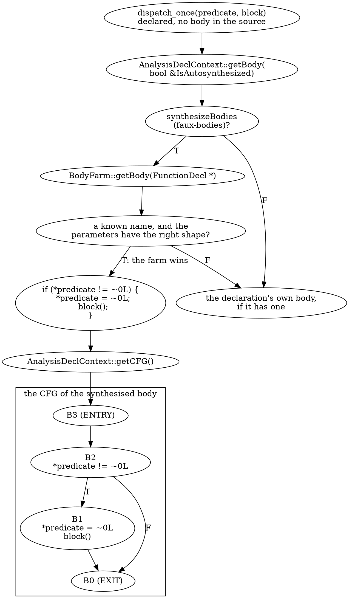

**The effect in the analyzer.** In both samples `x` is assigned only inside the callback, so the question is whether the analyzer runs it. `faux-bodies=false` switches the farm off:

```bash
for fb in true false; do
  echo "== faux-bodies=$fb"
  for f in manifests/p10_farm.c manifests/p10_farm.cpp; do
    CHECKER=debug.ExprInspection scripts/dumpcfg.sh $f -fblocks -Xclang -analyzer-config -Xclang faux-bodies=$fb 2>&1 | grep ExprInspection
  done
done
```

```text expected
== faux-bodies=true
manifests/p10_farm.c:20:3: warning: TRUE [debug.ExprInspection]
manifests/p10_farm.cpp:26:3: warning: TRUE [debug.ExprInspection]
== faux-bodies=false
manifests/p10_farm.c:20:3: warning: FALSE [debug.ExprInspection]
manifests/p10_farm.c:20:3: warning: TRUE [debug.ExprInspection]
manifests/p10_farm.cpp:26:3: warning: FALSE [debug.ExprInspection]
manifests/p10_farm.cpp:26:3: warning: TRUE [debug.ExprInspection]
```

With the farm on, `x == 1` and `x == 7` are `TRUE`. With it off, the callbacks are never run: each line gets the `FALSE` and `TRUE` pair, "unknown". The graph tools of this part cannot see it: `p10_sites` classifies the call in `main` as `missing:decl`, so the walk of Section 10.2 would stop there, while the analyzer descends:

```bash
build/bin/p10_sites manifests/p10_farm.c --func=main --preset=analyzer -- -fblocks | grep dispatch_once
```

```text expected
site main B1.8 Function dispatch_once missing:decl
```

**The body, as a tool sees it.** `p10_farm` creates the manager with `synthesizeBodies=true` (the analyzer's own setting), asks for the body of every function declared in the file, and prints the body and its CFG when the farm made one. A block is a Clang extension in C, so the compile flag goes after `--`:

```bash
build/bin/p10_farm manifests/p10_farm.c -- -fblocks
```

```text expected
farm clang_analyzer_eval: synthesized=no
farm dispatch_once: synthesized=yes kind=dispatch_once
if (*predicate != ~0L) {
    *predicate = ~0L;
    block();
}

 [B3 (ENTRY)]
   Succs (1): B2

 [B1]
   1: *predicate = ~0L
   2: block()
   Preds (1): B2
   Succs (1): B0

 [B2]
   1: *predicate != ~0L
   T: if [B2.1]
   Preds (1): B3
   Succs (2): B1 B0

 [B0 (EXIT)]
   Preds (2): B1 B2

farm main: synthesized=no
```

The declaration of `dispatch_once` has no body in the file, and `getBody` returned one: `synthesized=yes`. The body is the AST the farm built, pretty-printed, and its CFG is an ordinary four-block CFG (the format of Part 2, drawn on the site): a condition block `B2` whose true edge goes through the assignment and the block call. The other two functions are not farmed (`synthesized=no`).

```bash
build/bin/p10_farm manifests/p10_farm.cpp
```

```text expected
farm clang_analyzer_eval: synthesized=no
farm "std::call_once<void (&)(int &),<int &>>": synthesized=yes kind=call_once
if (!flag.__state_) {
    f(args);
    flag.__state_ = 1;
}

 [B3 (ENTRY)]
   Succs (1): B2

 [B1]
   1: f(args)
   2: flag.__state_ = 1
   Preds (1): B2
   Succs (1): B0

 [B2]
   1: !flag.__state_
   T: if [B2.1]
   Preds (1): B3
   Succs (2): B1 B0

 [B0 (EXIT)]
   Preds (2): B1 B2

farm set: synthesized=no
farm main: synthesized=no
```

`call_once` is a template, and a template pattern has no body: the farm works on the **instantiation** `std::call_once<void (&)(int &),<int &>>` that the call in `main` created, which is why the tool visits template instantiations. The printed name is the instantiation's. Note the body: `flag.__state_ = 1` is *inside* the `if`; the comment above `create_call_once` in `BodyFarm.cpp` sketches it after the `if`, and the AST the function builds (and the tool prints) is the reference.

**Name- and shape-sensitive, measured.** The sample gives `std::once_flag` a `__state_` field because the farm looks for exactly that (libc++) or `_M_once` (libstdc++). The loop writes three copies of the sample with the field renamed, and asks the tool about each:

```bash
for f in __state_ _M_once ready_; do
  sed "s/__state_/$f/" manifests/p10_farm.cpp > out/p10_farm_$f.cpp
  printf '%-9s' "$f"; build/bin/p10_farm out/p10_farm_$f.cpp | grep call_once
done
```

```text expected
__state_ farm "std::call_once<void (&)(int &),<int &>>": synthesized=yes kind=call_once
_M_once  farm "std::call_once<void (&)(int &),<int &>>": synthesized=yes kind=call_once
ready_   farm "std::call_once<void (&)(int &),<int &>>": synthesized=no
```

The field name decides: both known layouts are farmed, a renamed one is not (`synthesized=no`). **The farm wins over a real body.** The next command gives `call_once` an empty real body (`{}`) and asks the analyzer, with the farm on and off:

```bash
sed 's/\.\.\.args);/...args) {}/' manifests/p10_farm.cpp > out/p10_farm_body.cpp
for fb in true false; do
  CHECKER=debug.ExprInspection scripts/dumpcfg.sh out/p10_farm_body.cpp -Xclang -analyzer-config -Xclang faux-bodies=$fb 2>&1 | grep ExprInspection
done
```

```text expected
out/p10_farm_body.cpp:26:3: warning: TRUE [debug.ExprInspection]
out/p10_farm_body.cpp:26:3: warning: FALSE [debug.ExprInspection]
```

With the farm on the analyzer still runs `set` (`TRUE`): the empty real body was replaced. With the farm off it uses the real body, which does nothing, and `x == 7` is `FALSE`, not unknown.

> [!warning] A model that does not match the real library
> The farm models `std::call_once` for the flag layouts it knows. A standard library with another layout (or a `once_flag` you wrote, like the sample's) is silently *not* farmed, and the call is evaluated conservatively: no error, no note, only a `FALSE`/`TRUE` pair where you expected `TRUE`. When an analyzer result around one of these functions looks too pessimistic, ask the manager (`p10_farm`, `isBodyAutosynthesized()`) before you suspect the checker.

### Verify

Which of the four functions declared in `p10_farm.cpp` has a farmed body? Predict, then list them (one `farm` line per function, a function declared twice prints once):

```bash
build/bin/p10_farm manifests/p10_farm.cpp | grep '^farm'
```

### Expected

```text expected
farm clang_analyzer_eval: synthesized=no
farm "std::call_once<void (&)(int &),<int &>>": synthesized=yes kind=call_once
farm set: synthesized=no
farm main: synthesized=no
```

Only `std::call_once<...>`: the farm ignores `set` and `main` (no known name) and the analyzer's own `clang_analyzer_eval`.

> [!hint]- Quiz: why does the sample give `std::once_flag` a `__state_` field, and what would the analyzer do without it?
> What does `create_call_once` look for in the flag's record, and what does `shouldInlineCall` do when the farm returns null?

> [!success]- Answer
> `create_call_once` builds its `if` over a field of the flag: it looks for `__state_` (the libc++ layout) and then `_M_once` (libstdc++), and returns null when neither exists. A null body means no farm: the function stays a declaration with no body, which check 4 of Section 10.6 (no CFG) turns into a conservative evaluation, so the callback never runs and `x == 7` is unknown. The sample is a model of a standard library, so it has to look like one.

### Common mistakes

| Mistake | Symptom |
|---------|---------|
| Expecting the farm to cover any function that "obviously" behaves like `call_once` | it is a fixed list keyed by name and shape; a user-written `my_call_once` is not farmed |
| Asking for the body of the template, not the instantiation | the pattern has no body; use the instantiation the call created |
| Building the manager with `synthesizeBodies=false` and expecting `dispatch_once` to have a body | `getBody` returns null; `faux-bodies` is the analyzer's switch for the same flag |
| Compiling `p10_farm.c` without block support | a block literal is an extension in C; pass `-fblocks` |

### Exercises

1. The farm also knows `dispatch_sync`. Copy `p10_farm.c` to `out/ex_farm.c`, declare `typedef int dispatch_queue_t; void dispatch_sync(dispatch_queue_t queue, void (^block)(void));` and call `dispatch_sync(0, ^{ x = 2; });`. Predict the `kind` the tool prints (it only names `dispatch_once` and `call_once`) and the answer of `x == 2`, then run both `p10_farm out/ex_farm.c -- -fblocks` and `ExprInspection`.
2. Compare the two farmed bodies of this section. In which one is the flag set *before* the callback runs, and what would that change for a callback that calls the same once-function again?

---

## Section 10.8 — Context sensitivity in the FlowSensitive framework: `ContextSensitiveOptions`, `pushCall`, `popCall`, `canDescend`

### Why

Part 7.5 introduced context-sensitive analysis in the FlowSensitive framework and measured it on a use-after-move checker. This section reads the same mechanism as the second form of descent, next to the analyzer's inlining of Section 10.6, and sets both beside the summaries of Section 10.3 and the call strings of Section 10.5, so you can say what each one carries across the call, what it costs, and what it does with recursion.

### What to Do

**Sample file:** `manifests/p07_ctx.cpp` — helper functions (`always_true`, `take`, `renew`, `bump`, `rec`) and one caller per scenario; the tool is Part 7's `p07_ctx`.

**The API.** Everything is declared in `clang/Analysis/FlowSensitive`; the signatures, from the installed header:

```bash
grep -nE '^ +(Environment pushCall|void popCall|bool canDescend|size_t callStackSize)' \
  "${LLVM:-/opt/homebrew/opt/llvm}/include/clang/Analysis/FlowSensitive/DataflowEnvironment.h"
```

```text expected
226:  Environment pushCall(const CallExpr *Call) const;
227:  Environment pushCall(const CXXConstructExpr *Call) const;
231:  void popCall(const CallExpr *Call, const Environment &CalleeEnv);
232:  void popCall(const CXXConstructExpr *Call, const Environment &CalleeEnv);
676:  size_t callStackSize() const { return CallStack.size(); }
682:  bool canDescend(unsigned MaxDepth, const FunctionDecl *Callee) const;
```

| Member | What it does |
|--------|--------------|
| `DataflowAnalysisContext::Options::ContextSensitiveOpts` | an `std::optional<ContextSensitiveOptions>`; empty disables the mode. The header warns that it "is fundamentally limited: some constructs, such as recursion, are explicitly unsupported" |
| `ContextSensitiveOptions::Depth` | the maximum depth to analyse; default 2; `0` disables the mode |
| `Environment::pushCall(call)` | the `Environment` for an inline analysis of the callee: the **storage location of each argument becomes the location of the matching parameter**, so the callee sees the caller's objects. Requirements: the callee is a `FunctionDecl`, the arguments map 1:1 to the parameters (and, says the header, the body does not reference globals: Part 7.5 measured that this one is not enforced) |
| `Environment::popCall(call, calleeEnv)` | moves what the callee learned back into the caller's `Environment` |
| `Environment::canDescend(MaxDepth, Callee)` | whether `pushCall` can be used: **recursion is not allowed**, and `MaxDepth` is the largest value `callStackSize()` may have after the call |
| `Environment::callStackSize()` | the size of the call stack, not counting the initial analysis target |

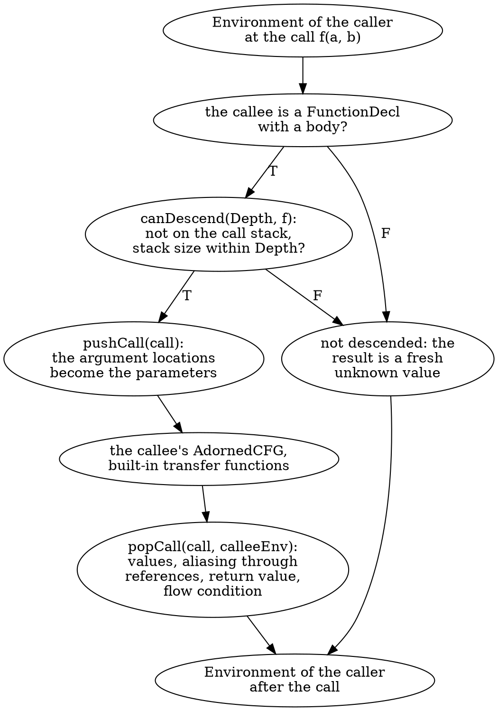

`p07_ctx --explain` is a report of these preconditions, a re-implementation of the rules the tool applies for each call, not the engine's own answer (the engine's answer is the behaviour measured below):

```bash
build/bin/p07_ctx manifests/p07_ctx.cpp --depth=2 --explain | sed -n 3,20p
```

```text expected
guard_literal:
  call always_true at line 23: descendable
  call sink at line 24: not descended (no body)
  call always_false at line 25: descendable
guard_opaque:
  call unknown at line 32: not descended (no body)
  call sink at line 33: not descended (no body)
  call unknown at line 34: not descended (no body)
take:
  call sink at line 39: not descended (no body)
move_in_callee:
  call take at line 42: descendable
renew:
reinit_in_callee:
  call sink at line 50: not descended (no body)
  call renew at line 51: descendable
bump:
unbump:
```

`always_true`, `take` and `renew` are descendable; `sink` and `unknown` are declarations with no body and never are. The depth bounds the stack and nothing else. `deep` hides a literal behind three levels (`wrap2_true` calls `wrap_true`, which calls `always_true`), and the report disappears exactly when the depth reaches 3:

```bash
for d in 1 2 3; do build/bin/p07_ctx manifests/p07_ctx.cpp --depth=$d --func=deep; done
```

```text expected
deep (depth 1, 42 transfers):
  manifests/p07_ctx.cpp:84:5: warning: 'a' used after move (possible)
deep (depth 2, 42 transfers):
  manifests/p07_ctx.cpp:84:5: warning: 'a' used after move (possible)
deep (depth 3, 42 transfers): clean
```

What crosses the call is what the **built-in** transfer functions produce: values, aliasing through reference parameters, return values, and therefore the flow conditions of boolean results (Part 7.5 measured that the callee is not run through your `transfer`). That is why `guard_literal` becomes clean at depth 1: `always_false()` returns the literal `false`, the flow condition of the guard is a contradiction, and the use is on a dead path. The recursion rule is the second thing the table promises:

```bash
build/bin/p07_ctx manifests/p07_ctx.cpp --depth=3 --explain --func=rec
build/bin/p07_ctx manifests/p07_ctx.cpp --depth=3 --func=recursive_callee
```

```text expected
rec:
  call rec at line 68: not descended (recursion (callee is the caller))
recursive_callee (depth 3, 36 transfers):
  manifests/p07_ctx.cpp:73:3: warning: 'a' used after move (possible)
```

The outer call of `rec(3)` is descendable; the call of `rec` inside `rec` is refused (`canDescend`: the callee is already on the stack), so the conditional `n == 0 ? true : rec(n - 1)` stays unknown and the report stays.

**Four mechanisms, one question.** The sections of this part answer the same three questions differently, and each answer has a measured trace in this part:

| | Summary (10.3, 10.4) | Call strings (10.5) | Analyzer inlining (10.6) | `pushCall` (10.8) |
|---|---|---|---|---|
| What crosses the call | one fact per function, **all callers merged**; flows callee to caller | one fact per function and last *k* call sites; flows caller to callee | the whole `ProgramState` of the path (store, constraints) | the caller's `Environment`: values, aliasing, flow condition |
| Context | none (`main: sink=may` although `guarded(1)` never calls `die`) | the last *k* sites (`divide[…,risky@L18]`) | the full path, as long as inlining continues | the call stack up to `Depth` |
| Cost | one pass per function, `iter` ≤ *k* + 1 per cycle (10.3) | contexts grow with *k*: 7, 11, 14, 17 for *k* = 0 to 3 (10.5) | per path and per call site, bounded by `max-inlinable-size`, stack depth and `max-nodes` (10.6) | the callee is re-analysed at every call site, in the caller's environment |
| Recursion | a fixed point inside the cycle, or widening to `inf` (10.4) | the string is cut at *k* (`loop[…,loop@L25,loop@L25]`) | counted in `-analyzer-inline-max-stack-depth`; `fact(3)` needs depth 3 (Section 9.8) | **refused** by `canDescend` |
| Unknown callee | no edge, nothing known (10.1) | no edge, nothing known | conservative evaluation: a conjured symbol (10.6) | not descended: a fresh unknown value |
| Written by | you, over `CallGraph` | you, over `CallGraph` | the engine; you set the switches | the framework; you set `Depth` |

### Verify

Recursion is refused at every depth, so a larger `Depth` can never make `recursive_callee` clean. Predict the number of reports for depths 0, 1, 2, 3 and 8, then count them:

```bash
for d in 0 1 2 3 8; do printf 'depth %s: ' $d; build/bin/p07_ctx manifests/p07_ctx.cpp --depth=$d --func=recursive_callee | grep -c warning; done
```

### Expected

```text expected
depth 0: 1
depth 1: 1
depth 2: 1
depth 3: 1
depth 8: 1
```

One report at every depth. The unknown comes from the self call, not from the depth, which is the practical meaning of "recursion is explicitly unsupported": the analysis degrades to the intra-procedural answer exactly where a summary (a fixed point) or a call string (a cut) would still have something to say.

> [!hint]- Quiz: which of the four mechanisms can tell that `guarded(1)` of Section 10.3 never calls `die`, and why not the others?
> The condition is `x < 0`. What does each mechanism know about `x` when it reaches that branch?

> [!success]- Answer
> Descent: the analyzer's inlining (with `x == 1` in the state of the path) and `pushCall` (with `1` bound to the parameter in the caller's `Environment`) evaluate the branch condition under the caller's values, so the call to `die` is on a dead path. A summary has one value per function for *all* callers, so it must say `may`. The call strings of `p10_callstrings` could keep `guarded(1)` apart from other callers, but their lattice is `zero`/`nonzero`/`top` and the tool does not evaluate conditions, so it could not decide `x < 0` either: a richer lattice would, and would be re-implementing the descent. Descent can, at the price of re-analysing the callee at every call site.

### Common mistakes

| Mistake | Symptom |
|---------|---------|
| Expecting `diagnoseFunction` to descend | it builds its own `DataflowAnalysisContext` with default options; the driver of `p07_ctx` sets `ContextSensitiveOpts` |
| Expecting your `transfer` to run in the callee | the callee runs the built-in transfer only; model your side effects at the call site (Part 7.5) |
| Raising `Depth` to cover recursion | `canDescend` refuses recursion at every depth; the recursive call stays unknown |
| Reading `--explain` as the engine's decision | it is a re-implementation of the preconditions, useful for planning; the behaviour is what the reports show |

### Exercises

1. In the comparison table, pick one row and one scenario from this part that measured it (an output you have seen). Which cell has no measured trace in this lab, and how would you measure it?
2. `build/bin/p07_ctx manifests/p07_ctx.cpp --depth=3 --explain --func=global_callee`: the header says a callee that references a global is not allowed, and Part 7.5 measured the opposite. What does `--explain` print for `bump` and `unbump`, and what does that tell you about trusting a header's "requirements" list?

---

## Section 10.9 — Checkpoint

| Concept | What You Proved |
|---------|-----------------|
| Sites in the CFG | A call site is an element: `AnyCall::forExpr` on a `CFGStmt`, or a `CFGImplicitDtor`'s destructor; each is addressed `B<id>.<i>` and classified against the graph by *expression*: `resolved`, `virtual static=X`, or one of the `missing:` classes (10.1) |
| What the CFG has | Implicit destructors, temporary destructors and constructor initialisers are options; the element numbers belong to the options; the `DeleteDtor` of a `delete` needs none (10.1) |
| The walk | A depth-bounded descent over resolved sites in reverse post-order; it follows only what the graph knows, carries no state, and has no recursion check: the depth is the only brake (10.2) |
| Summaries | Callee-first over `scc_iterator` components, Jacobi passes inside cycles, `iter` ≤ *k* + 1 for a boolean property; `none < may < always` with `always` decided by the CFG (10.3) |
| Widening and limits | `depth` jumps to `inf` on a cycle; a summary has no call-site context and knows only the graph's edges; `via` is the first hop of the shortest chain (10.4) |
| Call strings | One context per function and last *k* call sites; values flow caller to callee; recursion ends because the string is cut; precision, output and cost grow with *k*; a context cap guards against runaway *k* (10.5) |
| `CallEvent` and `RuntimeDefinition` | The analyzer wraps every call in a `CallEvent` of one of eleven kinds; the static callee and the runtime definition can differ (`Base::run` versus `Derived::run`); `mayHaveOtherDefinitions()` hands the decision to the `ipa` mode (10.6) |
| Inline or conservative | `shouldInlineCall` checks in order: a decl, a farmed body, `ipa`, the callee's size and C++ policies, the call kind, stack depth and count; the answer is visible in `clang_analyzer_eval`, `debug.DumpCalls` (value versus `conj`), report notes (`Calling`) and `CallEnter` points (10.6) |
| `BodyFarm` | Synthesised bodies for `dispatch_once`, `dispatch_sync`, `std::call_once`, `std::move` and friends and `OSAtomicCompareAndSwap*`; keyed by name and shape; the farm wins over a real body and is inlined before any limit; a mismatch is silent (10.7) |
| Framework context sensitivity | `ContextSensitiveOpts`/`Depth`, `pushCall`/`popCall`, `canDescend`: the caller's `Environment` crosses, only the built-in transfer runs in the callee, recursion is refused (10.8) |
| The four mechanisms | Summary, call strings, inlining and `pushCall` differ in what crosses the call, what it costs and where recursion goes; none is best (10.8) |

**What is next.** You can now put a fact on a call: a summary, a context or a state. Part 11 widens the graph the first two stand on: calls through function pointers and virtual calls (address-taken matching, class-hierarchy and rapid type analysis, and the analyzer's `ipa=dynamic` modes that Section 10.6 started), the edges a second tool can add (`clang::index`), merging translation units (and Clang's own cross-translation-unit mode, which imports the definitions the analyzer lacks, the `isForeign()` of `RuntimeDefinition`), and the cost of all this on a large translation unit. For depth in the meantime: `ExprEngineCallAndReturn.cpp` (`defaultEvalCall`, `shouldInlineCall`, `inlineCall`) is the source of Section 10.6, `BodyFarm.cpp` of Section 10.7, and `clang-tools-extra/clang-tidy/misc/NoRecursionCheck.cpp` is the production version of the recursion checks of Section 9.2.

**Ready for Part 11?** Pick a call in your own code that goes through a pointer or a virtual method, and decide first which of the four mechanisms you would need, and what answer you would accept when its callee is "one of these four".

---

[← Part 9 — Call Graph Algorithms](part_9_call_graph_algorithms.md) | [Part 11 — Indirect Calls, Cross-TU and Scale →](part_11_indirect_xtu_scale.md)
