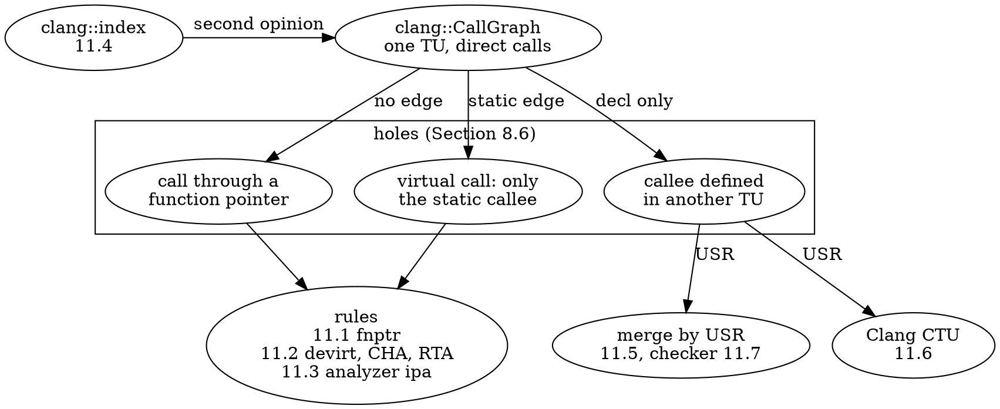
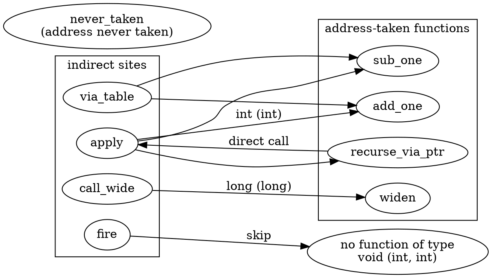
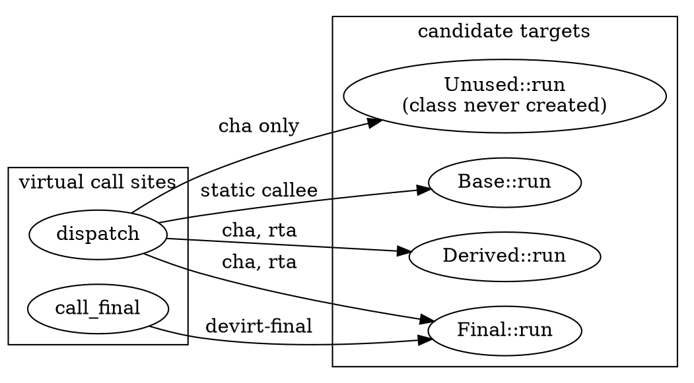
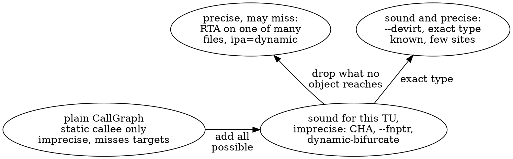
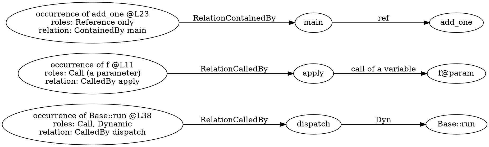
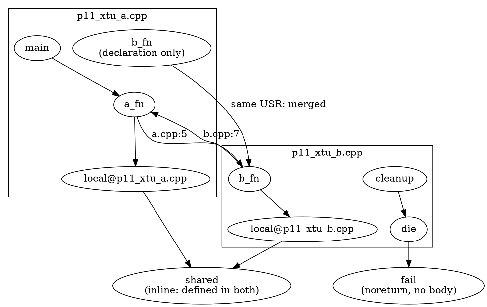
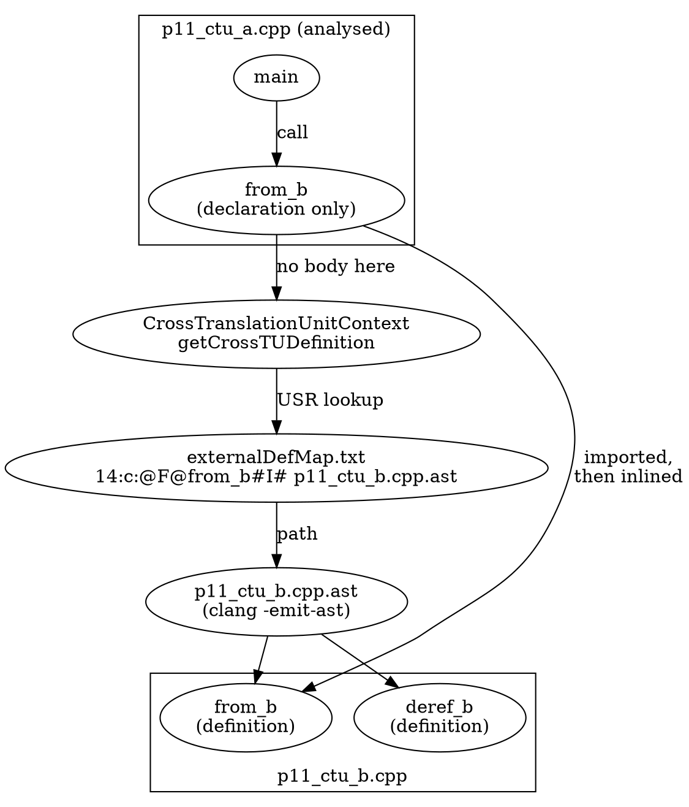
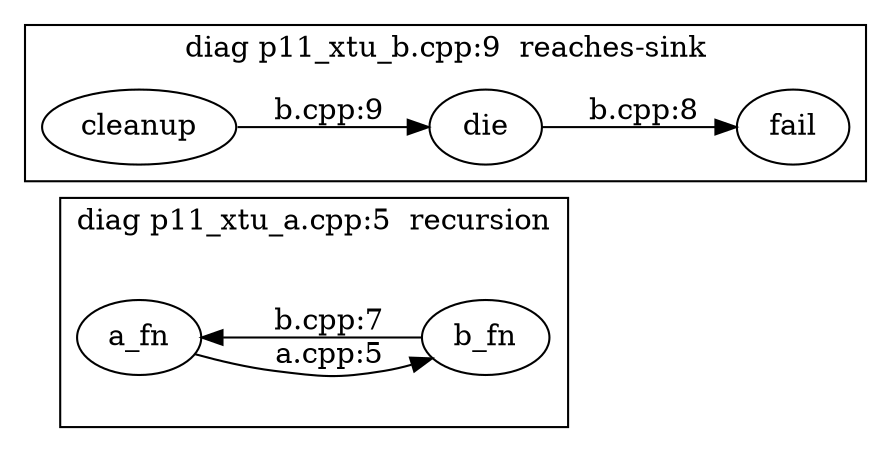
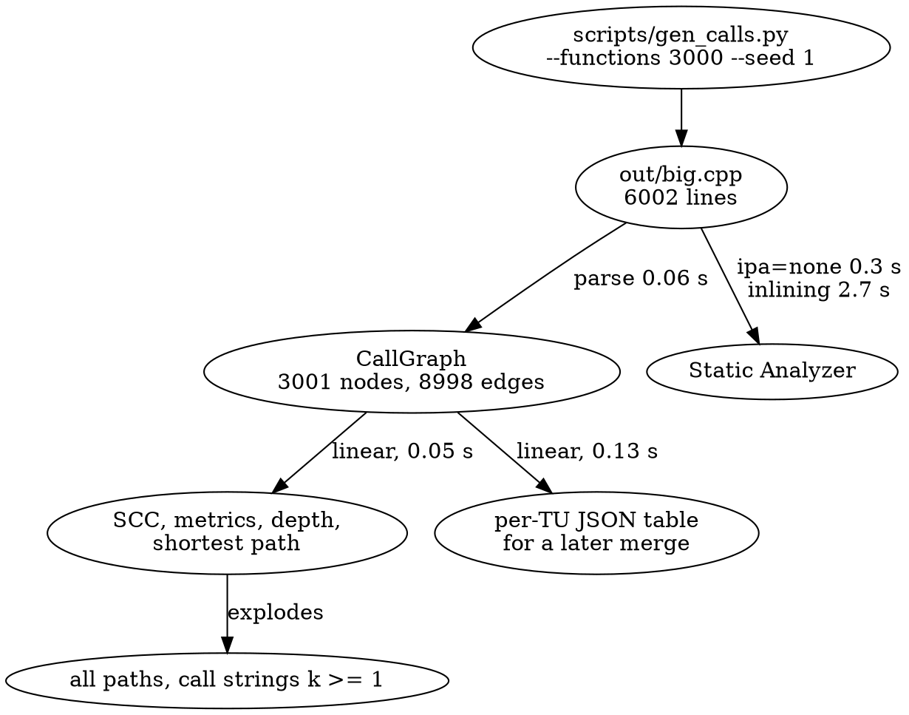

# Part 11 — Indirect Calls, Cross-TU and Scale

[← Part 10 — Interprocedural Analysis](part_10_interprocedural_analysis.md) | [README](README.md)

## What You'll Learn

- Why every analysis of Parts 9 and 10 inherits two holes of the call graph (a call through a function pointer has no edge, a virtual call has only its static callee) and how to count them: *indirect sites*, *resolved*, *candidates*
- Four rules that add edges, and what each one trades: address-taken matching by signature (`--fnptr`), exact devirtualisation (`getDevirtualizedMethod`), class-hierarchy analysis (CHA) and rapid type analysis (RTA)
- The vocabulary that keeps such rules honest: sound *for what this translation unit can see*, precise, candidate set, flow-insensitive
- What the Static Analyzer does about the same problem with a path in hand: `ipa=dynamic` trusts the static type of an unknown receiver, `ipa=dynamic-bifurcate` explores both worlds
- `clang::index` as a second, independently built source of call edges (`SymbolRole::Call`, `RelationCalledBy`, `Dynamic`), diffed against `CallGraph`
- Merging per-TU graphs by USR, saving each TU as a JSON table, merging later without a compiler, and a cross-TU recursion and sink checker with exit codes
- Clang's own cross-translation-unit analysis end to end: `clang-extdef-mapping`, `.ast` files and on-demand parsing, `ctu-dir`, and why the report must be `-analyzer-output=text`
- Scale: a generated 3000-function translation unit, which parts of the pipeline are linear and which are not (`--all-paths`, call strings, inlining), and why you persist tables, not graphs

## The Big Picture

Parts 8 to 10 built the call graph, traversed it and computed on it. Every result was *relative to the graph's edges*, and Section 8.6 listed the edges the graph does not have. This part repairs the holes one by one, adds a second opinion from a different Clang library, follows calls across files, and finishes by asking whether any of it survives a large input.

| Hole (Section 8.6) | Repair | Section | What it costs you |
|--------------------|--------|---------|-------------------|
| A call through a function pointer has no edge | an edge to every address-taken function of the same type | 11.1 | imprecise: every site of a type gets the whole set |
| A virtual call has only the static callee | exact type, CHA, RTA | 11.2, 11.3 | CHA is loose, RTA needs the whole program |
| The same question inside the Static Analyzer | `ipa=dynamic`, `ipa=dynamic-bifurcate` | 11.3 | `dynamic` can be wrong; bifurcation doubles paths |
| "Is the graph right?" | `clang::index` as a second source | 11.4 | a different inclusion policy to learn |
| A callee defined in another file | merge by USR; Clang's CTU | 11.5 to 11.7 | the merge needs a whole-program view; CTU is experimental |
| A real code base | counts, costs, persistence | 11.8 | some steps are linear, some explode |



The last section, 11.8, is not a repair but a measurement: the same graph, 3000 functions, with numbers.

| Tool (this part) | Section | Does |
|------------------|---------|------|
| `p11_resolve` | 11.1 to 11.3 | adds edges to the real `CallGraph`: `--fnptr`, `--devirt`, `--cha`, `--rta`, `--all`; `--counts` and `--sccs` show the effect |
| `p11_index` | 11.4 | the call edges `clang::index` reports, `--refs` for address-taken functions, `--diff` against the `CallGraph` |
| `p11_xtu` | 11.5 | merges the call graphs of several files by USR; `--emit=json` saves one TU, `--load` merges the saved tables |
| `scripts/ctu.sh` | 11.6 | runs Clang's own cross-TU analysis (`clang-extdef-mapping`, `-emit-ast`, `ctu-dir`) |
| `p11_check` | 11.7 | recursion and `[[noreturn]]`-sink checker on the merged graph, with `file:line` and exit codes |
| `scripts/gen_calls.py` | 11.8 | a deterministic generator for a large translation unit |
| `p08_nodes`, `p09_metrics`, `p09_walk`, `p10_summary`, `p10_callstrings` | 11.8 | reused: counts, SCCs, paths and depth at scale |

The sample files:

| File | Used in | Holds |
|------|---------|-------|
| `manifests/p11_fnptr.cpp` | 11.1, 11.4 | address-taken functions of two signatures, a table of pointers, four indirect sites |
| `manifests/p11_virtual.cpp` | 11.2 to 11.4 | a hierarchy with a `final` class, a class nothing instantiates, an abstract base, three virtual sites of different quality |
| `manifests/p11_rta.cpp` | 11.2 | classes created with `new` and as a local, a class nobody creates, a hierarchy with no instance at all |
| `manifests/p09_recursion.cpp` | 11.3 | recursion hidden behind a pointer and behind a vtable |
| `manifests/p10_analyzer.cpp` | 11.3 | one `main` of `clang_analyzer_eval` questions, shared with Parts 9 and 10 |
| `manifests/p08_include.cpp` | 11.4 | templates, implicit members, `new`, default arguments, lambdas, a block, a pointer: every inclusion rule |
| `manifests/p11_xtu.h`, `p11_xtu_a.cpp`, `p11_xtu_b.cpp` | 11.5, 11.7 | two translation units with a cross-file cycle and a sink |
| `manifests/p11_ctu_a.cpp`, `p11_ctu_b.cpp` | 11.6 | a caller and a callee in different files, for the Static Analyzer's CTU |
| `out/big.cpp` | 11.8 | generated by `scripts/gen_calls.py` |

The tools of this part keep the output grammar of Part 8 (one record per line, a name is quoted only when it contains a space, sorted by name, compile flags after `--`). Their new records are explained where they first appear.

---

## Section 11.1 — Function pointers: address-taken sets, signature matching and the recursion they hide

### Why

Section 8.6 showed that a call through a function pointer leaves no edge in the `CallGraph`: the callee is a value, not a name. Everything built on the graph therefore misses recursion through a callback (the `step` of Section 9.2), a chain that reaches `abort()` only through a registered handler, and it reports a callback as dead because nobody "calls" it. The fix is to add edges you compute, and every such rule trades two properties: **soundness** (did you add *every* real target?) and **precision** (did you add *only* real targets?). This section builds the rule for function pointers; Section 11.2 does virtual calls.

### What to Do

**Sample file:** `manifests/p11_fnptr.cpp` — five functions of two signatures, four indirect call sites, one recursion that exists only through a pointer.

| Function | Type | Address taken? | Where |
|----------|------|----------------|-------|
| `add_one` | `int (int)` | yes | initialiser of `table`; argument in `main` |
| `sub_one` | `int (int)` | yes | initialiser of `table` |
| `never_taken` | `int (int)` | **no** | only defined |
| `recurse_via_ptr` | `int (int)` | yes | argument of the call inside itself |
| `widen` | `long (long)` | yes | argument in `main` |

The four indirect sites: `apply` calls its parameter `f` (an `int (*)(int)`), `via_table` calls `table[i]` (also `int (*)(int)`), `call_wide` calls a `long (*)(long)`, and `fire` calls a `void (*)(int, int)`. `recurse_via_ptr` calls `apply(recurse_via_ptr, n - 1)`, and `apply` calls whatever it is given: the program recurses, the graph does not know.

**What the graph says.** Ask `p08_nodes` for the edges of the four callers:

```bash
for f in apply via_table call_wide fire; do build/bin/p08_nodes manifests/p11_fnptr.cpp --edges --sites --func=$f | sed 1d; done
```

```text expected
node apply
node via_table
node call_wide
node fire
```

Four nodes, no edges: the graph says all four call nothing. They each make a call; the call just has no name.

**The tool.** `p11_resolve` adds edges to the real `clang::CallGraph`: `CallGraphNode::addCallee` is public, so the extended graph is an ordinary `CallGraph` and the traversals of Part 9 run on it (the tool re-runs the SCC algorithm with `--sccs`). `CallGraph` has no way to *remove* an edge, so nothing is ever taken away. One record per decision:

- `add <caller> -> <callee> @L<line> reason=... [candidates=n]`: an edge was added. `candidates` is how many targets the site ends up with.
- `skip <caller> @L<line> reason=...`: a site no rule could resolve.
- `stats: edges <before> -> <after>, indirect sites <n>, resolved <m>` with `--counts`. (The flag is `--counts`: LLVM registers its own `-stats` option, and a tool flag named `--stats` aborts at start-up with "registered more than once". The printed line still starts with `stats:`.) *Indirect sites* are all function-pointer calls and all virtual calls of the file; *resolved* are the ones a rule found at least one target for.
- `scc <id> cyclic self|mutual: <members>` with `--sccs`: the cyclic strongly connected components of the *extended* graph.

**The rule, in three steps** (`--fnptr`):

1. **Find the indirect sites.** A call expression with no direct callee that is not an immediately invoked block. The walk is the one `CGBuilder` makes (children, default arguments, default member initialisers; a lambda body belongs to the lambda's own node).
2. **Collect the address-taken set.** Every `DeclRefExpr` to a function that is *not* the callee of a call: `&f`, a bare `f` that decays in an initialiser or an argument, a binding to a function reference. A non-static member function is left out: `&C::m` is a pointer to member, a different type.
3. **Match by type.** A site gets an edge to every address-taken function whose type `ASTContext::hasSameFunctionTypeIgnoringExceptionSpec` finds equal to the pointer's pointee type. No match: `skip reason=unknown-type`. A block variable or a member pointer lands here too, because it has no pointer-to-function type.

```bash
build/bin/p11_resolve manifests/p11_fnptr.cpp --counts --sccs
build/bin/p11_resolve manifests/p11_fnptr.cpp --fnptr --counts --sccs
```

```text expected
stats: edges 5 -> 5, indirect sites 4, resolved 0
add apply -> add_one @L11 reason=fnptr-sig candidates=3
add apply -> recurse_via_ptr @L11 reason=fnptr-sig candidates=3
add apply -> sub_one @L11 reason=fnptr-sig candidates=3
add call_wide -> widen @L16 reason=fnptr-sig candidates=1
skip fire @L18 reason=unknown-type
add via_table -> add_one @L14 reason=fnptr-sig candidates=3
add via_table -> recurse_via_ptr @L14 reason=fnptr-sig candidates=3
add via_table -> sub_one @L14 reason=fnptr-sig candidates=3
stats: edges 5 -> 12, indirect sites 4, resolved 3
scc 4 cyclic mutual: apply recurse_via_ptr
```

The first command shows the graph as Clang builds it: four indirect sites, no edge added, no cycle. The second adds seven edges (`5 -> 12`):

- `apply` and `via_table` call an `int (*)(int)`, and **three** functions of that type have their address taken: `add_one` and `sub_one` (the initialiser of `table`; `add_one` is also passed to `apply` in `main`) and `recurse_via_ptr` (passed to `apply`). `never_taken` has the same signature but nobody takes its address, so it is not a candidate.
- `call_wide` calls a `long (*)(long)`; only `widen` has that type (`candidates=1`).
- `fire` calls a `void (*)(int, int)`: no function in the file has that type, so it is skipped, `unknown-type`.

And the last line is the payoff: `scc 4 cyclic mutual: apply recurse_via_ptr`. The recursion existed all along; the graph could not see it until the missing edges were added.



(`via_table -> recurse_via_ptr` is also added; the figure leaves it out to stay readable.)

**What the rule does not know.** It is *flow-insensitive* and *context-insensitive*: it does not ask which pointer value reaches a site. `main` passes only `add_one` to `apply`, but the edge set of `apply` is all three. An analysis that kept the callers of `apply` apart (the call strings of Section 10.5) is what would tell them apart; a type-based rule cannot.

> [!warning] "Sound" means sound for what this translation unit can see
> The candidate set is the address-taken functions *of this file*. A pointer can also be handed in from another translation unit (an argument, a global initialised elsewhere, a registration function), and a function whose address is taken only there never enters the set. Soundness for the program needs every function of the right type whose address is taken *anywhere*. Section 11.5 merges graphs across files, but the rule itself still runs per TU.

### Verify

The set of address-taken functions drives the edges. Predict what changes if `never_taken` joins the table (the `sed` below rewrites line 13 only, so line numbers stay put): which two sites gain an edge, what `candidates` becomes, and by how many the edge count grows.

```bash
sed 's/{add_one, sub_one}/{add_one, sub_one, never_taken}/' manifests/p11_fnptr.cpp > out/ex_fnptr.cpp
build/bin/p11_resolve out/ex_fnptr.cpp --fnptr --counts | grep -E 'never_taken|stats'
```

### Expected

```text expected
add apply -> never_taken @L11 reason=fnptr-sig candidates=4
add via_table -> never_taken @L14 reason=fnptr-sig candidates=4
stats: edges 5 -> 14, indirect sites 4, resolved 3
```

Both `int (*)(int)` sites (`apply`, `via_table`) gain an edge, `candidates` rises from 3 to 4, and the total grows by two (`5 -> 12` became `5 -> 14`). Taking one address changed the graph at every site of that type, which is exactly why the rule is imprecise.

> [!hint]- Quiz: why can `--fnptr` be sound for a single translation unit and still miss a target?
> Where else can an address come from?

> [!success]- Answer
> The rule only knows the address-taken functions *of this TU*. A pointer can be handed in from another translation unit (an argument, a global initialised elsewhere, a registration function), and a function whose address is taken in another file never enters the candidate set. Soundness needs every function of the right type whose address is taken *anywhere in the program*, which a per-TU graph cannot provide; that is the argument for whole-program tools.

### Common mistakes

| Mistake | Symptom |
|---------|---------|
| Reading "no edge" for `apply` as "`apply` calls nothing" | the four nodes above: the call exists, only the callee is unnamed |
| Treating the candidates as the possible targets | `apply -> sub_one` is a candidate although `main` never passes `sub_one` to `apply` |
| Expecting a non-static member pointer to be matched | `&C::m` is a pointer to member; the rule leaves non-static members out |
| Expecting a block variable to be resolved | `skip reason=unknown-type`: a block pointer is not a pointer to function |
| Passing `--stats` | LLVM registers `-stats` itself and the tool aborts at start-up with "registered more than once"; the flag is `--counts` |

### Exercises

1. In a copy of `manifests/p11_fnptr.cpp`, add `long shrink(long x) { return x / 2; }` and a second call `call_wide(shrink)` in `main`. Predict `call_wide`'s `candidates=` and the `stats:` line, then run it.
2. Add `int (*pick)(int) = never_taken;` as a global in a copy. `pick` is never called. Does `never_taken` become a candidate anyway, and for which sites?

---

## Section 11.2 — Virtual calls: `getDevirtualizedMethod`, class-hierarchy analysis and rapid type analysis

### Why

A virtual call has an edge in the `CallGraph`, but only to the *static* callee: the method name lookup finds in the static type of the object expression. At run time the target is any override that the object's dynamic type selects, so the graph is both short (the real target is missing) and sometimes wrong (the edge points at `Base::run` when `Final::run` runs). Three rules of increasing cost narrow this down: the exact type, every override in the hierarchy (CHA), every override of a class that is actually created (RTA).

### What to Do

**Sample files:** `manifests/p11_virtual.cpp` (a hierarchy with a `final` class, a class nothing instantiates, an abstract base) and `manifests/p11_rta.cpp` (for the last rule).

**The virtual calls in the graph.** One edge per call site, to the static callee. The three sites of `p11_virtual.cpp`:

```cpp
int dispatch(Base &b) { return b.run(3); }                         // site A: dynamic type unknown
int call_final(Final &f) { return static_cast<Base &>(f).run(1); } // site B: a 'final' class
int call_local() {                                                 // site C: a local object
  Derived d;
  return static_cast<Base &>(d).run(2);
}
```

```bash
for f in dispatch call_final call_local; do build/bin/p08_nodes manifests/p11_virtual.cpp --edges --sites --func=$f | sed 1d; done
```

```text expected
node dispatch
edge dispatch -> Base::run @L26 CXXMemberCallExpr
node call_final
edge call_final -> Base::run @L28 CXXMemberCallExpr
node call_local
edge call_local -> Base::run @L32 CXXMemberCallExpr
edge call_local -> Derived::Derived @L31 CXXConstructExpr
```

All three have an edge to `Base::run`, which is right for site A and a lossy answer for B and C. The sample writes `static_cast<Base &>(...)` on purpose: without the cast, `f.run(1)` is looked up in `Final`, the static callee is `Final::run` and the graph already has the exact edge; there would be nothing for devirtualisation to add. The cast hides the type from name lookup but not from the compiler.

**Rule 1: devirtualise when the type is known (`--devirt`).** `CXXMethodDecl::getDevirtualizedMethod(const Expr *Base, bool IsAppleKext)` answers "which method runs here?": the method itself when it is `final` or when the object expression's best-known dynamic class is `final` (`Expr::getBestDynamicClassType()` looks through the cast to the underlying object), the override of that exact class when the object is a local variable or a temporary, and null otherwise. `CXXRecordDecl::isEffectivelyFinal()` is the class-level test. A qualified call `b.Base::run()` names its method and is not dispatched at all, so it is not a virtual site.

```bash
build/bin/p11_resolve manifests/p11_virtual.cpp --devirt --counts
```

```text expected
add call_final -> Final::run @L28 reason=devirt-final
add call_local -> Derived::run @L32 reason=devirt-static
stats: edges 21 -> 23, indirect sites 5, resolved 2
```

`call_final` resolves to `Final::run` (`devirt-final`: the class is `final`) and `call_local` to `Derived::run` (`devirt-static`: the object `d` has exactly the type `Derived`). `dispatch` takes a reference of unknown dynamic type, so no exact rule can resolve it. Two edges were added and two of the five virtual sites are resolved. (The five: the three above, `use_shape` and `use_orphan`.)

**Rule 2: class-hierarchy analysis (`--cha`).** When the type is not known, assume the worst: every override, in any class of this translation unit that derives from the static type of the object, may run. The tool walks every complete class definition, skips abstract classes and finds each class's version of the method with `CXXMethodDecl::getCorrespondingMethodInClass`:

```bash
build/bin/p11_resolve manifests/p11_virtual.cpp --cha --counts
```

```text expected
add call_final -> Derived::run @L28 reason=cha candidates=4
add call_final -> Final::run @L28 reason=cha candidates=4
add call_final -> Unused::run @L28 reason=cha candidates=4
add call_local -> Derived::run @L32 reason=cha candidates=4
add call_local -> Final::run @L32 reason=cha candidates=4
add call_local -> Unused::run @L32 reason=cha candidates=4
add dispatch -> Derived::run @L26 reason=cha candidates=4
add dispatch -> Final::run @L26 reason=cha candidates=4
add dispatch -> Unused::run @L26 reason=cha candidates=4
skip use_orphan @L48 reason=no-overrider
add use_shape -> Square::area @L42 reason=cha candidates=1
stats: edges 21 -> 31, indirect sites 5, resolved 4
```

`dispatch` gains `Derived::run`, `Final::run` and `Unused::run`. `candidates=4` counts `Base::run` as well, the static callee the graph already had. Three things in this list are worth stopping on:

- **`Unused::run`** is in. Nothing in the file creates an `Unused`, and CHA does not know that. That is a loss of *precision*: an impossible target.
- CHA adds the same three overriders to `call_final` and `call_local`, whose dynamic types are known exactly. CHA ignores what `--devirt` knows, which is why `--all` runs devirtualisation first and hands CHA only the sites that remain.
- `use_shape` calls a pure virtual function; the only implementation in the file is `Square::area` (`candidates=1`). `use_orphan` is skipped, `no-overrider`: an abstract base with no implementation anywhere in this translation unit has *no* possible target.

```bash
build/bin/p11_resolve manifests/p11_virtual.cpp --all --counts
```

```text expected
add call_final -> Final::run @L28 reason=devirt-final
add call_local -> Derived::run @L32 reason=devirt-static
add dispatch -> Derived::run @L26 reason=cha candidates=4
add dispatch -> Final::run @L26 reason=cha candidates=4
add dispatch -> Unused::run @L26 reason=cha candidates=4
skip use_orphan @L48 reason=no-overrider
add use_shape -> Square::area @L42 reason=cha candidates=1
stats: edges 21 -> 27, indirect sites 5, resolved 4
```

With `--all` the exact answers win (`devirt-final`, `devirt-static`) and only `dispatch`, `use_shape` and `use_orphan` go to CHA: `edges 21 -> 27`. (`--all` is `--fnptr --devirt --cha`; this file has no function pointers.)

**Rule 3: rapid type analysis (`--rta`).** CHA's flaw is `Unused::run`: a method of a class nobody creates can never be the target of a call on an object of the program. RTA first collects the classes the translation unit *instantiates*, then lets only those classes' versions of the method into the candidate set. A class counts as instantiated when the file contains a constructor call (a temporary, a copy, a variable with an initialiser), a `new`, or a variable of that class type (also an array of it), and an instantiated class brings its by-value members in with it. A parameter does not count: the object arrives from somewhere else.

```bash
build/bin/p11_resolve manifests/p11_virtual.cpp --rta --counts
```

```text expected
instantiated: Derived Final Square
add call_final -> Derived::run @L28 reason=rta candidates=3
add call_final -> Final::run @L28 reason=rta candidates=3
add call_local -> Derived::run @L32 reason=rta candidates=3
add call_local -> Final::run @L32 reason=rta candidates=3
add dispatch -> Derived::run @L26 reason=rta candidates=3
add dispatch -> Final::run @L26 reason=rta candidates=3
skip use_orphan @L48 reason=no-overrider
add use_shape -> Square::area @L42 reason=rta candidates=1
stats: edges 21 -> 28, indirect sites 5, resolved 4
```

The first line names the instantiated classes: `Derived`, `Final` and `Square` (`main` and `call_local` create them). `Unused::run` is gone from `dispatch`. Read `candidates=3` carefully: it counts `Derived::run`, `Final::run` **and `Base::run`**, the static callee. `Base` is never created here, so strict RTA would say 2; the tool counts the static callee because the graph keeps that edge and `CallGraph` cannot remove it. As with CHA, `--rta` alone ignores what devirtualisation knows, so `call_final` and `call_local` get both overriders. Run the combination, exact rules first, RTA for what remains:

```bash
build/bin/p11_resolve manifests/p11_virtual.cpp --all --rta --counts
```

```text expected
instantiated: Derived Final Square
add call_final -> Final::run @L28 reason=devirt-final
add call_local -> Derived::run @L32 reason=devirt-static
add dispatch -> Derived::run @L26 reason=rta candidates=3
add dispatch -> Final::run @L26 reason=rta candidates=3
skip use_orphan @L48 reason=no-overrider
add use_shape -> Square::area @L42 reason=rta candidates=1
stats: edges 21 -> 26, indirect sites 5, resolved 4
```

Now `dispatch` has two added edges, `call_final` and `call_local` have their one exact edge each, and the total is `21 -> 26`, one edge fewer than `--all` (CHA).

`manifests/p11_rta.cpp` isolates the effect. `Heap` is created with `new` in `make_heap`, `Local` is a local variable in `use_local`, `Remote` is created nowhere in this file, and `Gauge` has one concrete class, `Tank`, that nothing creates:

```bash
build/bin/p11_resolve manifests/p11_rta.cpp --cha --counts
build/bin/p11_resolve manifests/p11_rta.cpp --rta --counts
```

```text expected
add poll -> Heap::read @L19 reason=cha candidates=3
add poll -> Local::read @L19 reason=cha candidates=3
add poll -> Remote::read @L19 reason=cha candidates=3
add read_gauge -> Tank::level @L36 reason=cha candidates=1
stats: edges 11 -> 15, indirect sites 2, resolved 2
instantiated: Heap Local
add poll -> Heap::read @L19 reason=rta candidates=2
add poll -> Local::read @L19 reason=rta candidates=2
skip read_gauge @L36 reason=not-instantiated
stats: edges 11 -> 13, indirect sites 2, resolved 1
```

CHA gives `poll` three targets (`Sensor::read` is pure virtual: it has no body and no node, so it is not counted) and `read_gauge` one. RTA keeps `Heap::read` and `Local::read` (`candidates=2`), drops `Remote::read`, and *skips* `read_gauge` with `reason=not-instantiated`: CHA finds an overrider, but no class that has one is ever created in this file, so no object of this file can reach it. `resolved` falls from 2 to 1.



> [!warning] RTA is a whole-program rule
> `poll` takes a `Sensor &` from any caller. If another translation unit creates a `Remote` and passes it in, `Remote::read` is a real target, and RTA dropped it. RTA is sound only when every object that can reach the call is created in the code you analysed; run it on the program, not on one file of it. For a library file, CHA is the safe choice and RTA is a precision gamble.

### Verify

Predict what RTA does to `poll` once the file creates a `Remote` as well, and whether `read_gauge` changes. (The command appends one function to a copy; nothing above it moves.)

```bash
{ cat manifests/p11_rta.cpp; echo 'int make_remote() { Remote r; return poll(r); }'; } > out/ex_rta.cpp
build/bin/p11_resolve out/ex_rta.cpp --rta --counts
```

### Expected

```text expected
instantiated: Heap Local Remote
add poll -> Heap::read @L19 reason=rta candidates=3
add poll -> Local::read @L19 reason=rta candidates=3
add poll -> Remote::read @L19 reason=rta candidates=3
skip read_gauge @L36 reason=not-instantiated
stats: edges 14 -> 17, indirect sites 2, resolved 1
```

`instantiated` now includes `Remote`, `poll` gets all three overriders and `candidates` is 3, which is CHA's answer: when every class of the hierarchy is created, RTA has nothing left to remove. `read_gauge` is still skipped, because `Tank` is still never created.

> [!hint]- Quiz: a class is instantiated only in another translation unit. Which of the three rules breaks, and in which direction?
> Which rule decides from "which classes exist", and which from "which classes are *created here*"?

> [!success]- Answer
> RTA, towards unsoundness. CHA looks at the class hierarchy, which the program's headers usually make visible; the exact rule needs no other file. RTA's candidate set is "classes created in this file", so an object created elsewhere and passed in has a class RTA never put in the set, and its override is a real target the graph lacks. CHA only fails the same way for a subclass defined elsewhere.

### Common mistakes

| Mistake | Symptom |
|---------|---------|
| Writing `f.run(1)` on a `final` object to test devirtualisation | the static callee is already `Final::run`; nothing to add, and the test passes for the wrong reason |
| Treating CHA's candidates as the possible targets | they include classes that are never instantiated, such as `Unused` |
| Forgetting that the static edge stays | `call_final` ends up with `Base::run` *and* `Final::run` after `--devirt`, and `candidates=3` under RTA counts `Base::run` |
| Running `--rta` alone and expecting exact answers | without `--devirt` (or `--all`) the exact-type sites get the whole RTA set |
| Applying RTA to a library file | targets created by the library's users are silently dropped |

### Exercises

1. Copy `manifests/p11_virtual.cpp` to `out/ex_virtual.cpp` and make `Derived` `final` (`struct Derived final : Base`). Predict which line of `--devirt --counts` changes, then run it.
2. In another copy, delete the `Unused` class and its overrider. How do `candidates=` and the number of added edges change for `--cha`? Is that a gain in precision or a change in soundness? Now compare with `--rta` on the *original* file.

---

## Section 11.3 — Soundness and precision: what each rule trades, and the analyzer's `ipa=dynamic` / `dynamic-bifurcate`

### Why

Four rules, each adding edges, and each right about something different. Before using the extended graph you need to say for each what it can miss and what it can invent, and to see that the Static Analyzer faces the identical choice on every virtual call it inlines, with a path to help it.

### What to Do

**The trade-offs, side by side.** *Sound* here means "every target the program can reach through this site, for the code this translation unit can see"; *precise* means "only real targets".

| Rule | Adds | Sound? | Precise? | Example |
|------|------|--------|----------|---------|
| `--devirt` | the single exact target, when the dynamic type is determined | yes: it is the only possible target | yes, but it resolves few sites | `call_final -> Final::run` |
| `--cha` | every override in the hierarchy this TU defines | for the classes this TU sees; a subclass defined elsewhere is missed | no: includes classes that are never created | `dispatch -> Unused::run` |
| `--rta` | CHA's overrides, restricted to classes this TU creates | for objects created here; an object that arrives from another TU may be of a class not in the set | better than CHA | `poll`: `Remote::read` dropped |
| `--fnptr` | an edge to every address-taken function of the pointer's type | for addresses taken in this TU | no: `apply` gets all three | `apply -> sub_one` |



> [!warning] "Sound" means sound for what this translation unit can see
> `Unused::run` is a *precision* loss: an edge no execution takes. A subclass of `Base` in another file, called through `dispatch`, is a *soundness* loss: a real target the analysis never learns. A single translation unit cannot fix the second; the sound answer for a pointer or a virtual call is "every function of that type, every override, in the whole program". Section 11.5 merges graphs across files, but the rules still run per TU.

**The same rules on the old holes.** Recursion through a callback and through a virtual call is the reason to resolve at all. `p09_recursion.cpp` has both. Predict which cyclic SCCs appear once the rules run:

```bash
for flags in "" "--all"; do echo "[$flags]"; build/bin/p11_resolve manifests/p09_recursion.cpp $flags --sccs | grep -E 'step|Grid'; done
```

```text expected
[]
[--all]
add measure -> Grid::area @L35 reason=cha candidates=2
add step -> step @L28 reason=fnptr-sig candidates=1
scc 4 cyclic self: step
scc 6 cyclic mutual: Grid::area measure
```

Without the rules neither `step` nor `Grid::area` is in a cycle. With `--all` the two `add` lines are the edges that close them: `--fnptr` finds that `next_step` can only be `step` (`candidates=1`) and adds `step -> step`, a self edge; CHA adds `measure -> Grid::area` for `s.area(n)` on a `Shape &` (`candidates=2`), closing the cycle `Grid::area -> measure -> Grid::area`.

**The Static Analyzer asks the same question, on a path.** The `ipa` key of `-analyzer-config` picks one of five modes (`AnalyzerOptions.h`, `IPAKind`); `clang -cc1 -analyzer-config-help` gives the default as `inlining` in shallow mode and `dynamic-bifurcate` in deep mode (the default). The engine builds a `CallEvent` for each call and asks `getRuntimeDefinition()`, which returns a `RuntimeDefinition` (`CallEvent.h`): the declaration that would run, and, when the receiver's type is not precise, the region whose runtime type decides (`mayHaveOtherDefinitions()`, `getDispatchRegion()`). The type information comes from `DynamicTypeInfo`, which the engine tracks per region along the path; `canBeASubClass()` is false exactly when the type is precise.

First, the question the shared sample asks, `clang_analyzer_eval(dispatch(d) == 11)` on `p10_analyzer.cpp` line 32, where `d` is a local `Derived`. A `clang_analyzer_eval` that prints both `FALSE` and `TRUE` means the analyzer could not decide: unknown. The command folds each run into one line, and `FALSE+TRUE` is how it writes "both".

```bash
for cfg in ipa=none ipa=basic-inlining ipa=inlining ipa=dynamic ipa=dynamic-bifurcate; do
  printf '%-22s' "$cfg"
  CHECKER=debug.ExprInspection scripts/dumpcfg.sh manifests/p10_analyzer.cpp -Xclang -analyzer-config -Xclang $cfg 2>&1 |
    awk '/:32:[0-9]+: warning: (TRUE|FALSE)/ { v = v (v ? "+" : "") $3 } END { print "dispatch(d) == 11: " v }'
done
```

```text expected
ipa=none              dispatch(d) == 11: FALSE+TRUE
ipa=basic-inlining    dispatch(d) == 11: FALSE+TRUE
ipa=inlining          dispatch(d) == 11: TRUE
ipa=dynamic           dispatch(d) == 11: TRUE
ipa=dynamic-bifurcate dispatch(d) == 11: TRUE
```

With no inlining or only "basic" inlining (C functions and blocks) the virtual call is evaluated conservatively; from `inlining` on, a receiver whose type is exact is devirtualised, and `dynamic-bifurcate` (the default) agrees. The sample cannot show what `dynamic` and `dynamic-bifurcate` are *for*: `d` is a local object, so its dynamic type is precise. They differ for a receiver of unknown type. This file gives the analyzer one of each (written by the command into `out/`, line 5 is the unknown receiver, line 6 the known one):

```bash
cat > out/ex_receivers.cpp <<'EOF'
void clang_analyzer_eval(int);
struct Base { virtual int run(int x) { return x; } virtual ~Base() {} };
struct Derived : Base { int run(int x) override { return x + 10; } };
int dispatch(Base &b) { return b.run(1); }
void unknown_receiver(Base &b) { clang_analyzer_eval(dispatch(b) == 1); }
void known_receiver() { Derived d; clang_analyzer_eval(dispatch(d) == 11); }
EOF
for cfg in ipa=none ipa=basic-inlining ipa=inlining ipa=dynamic ipa=dynamic-bifurcate; do
  printf '%-22s' "$cfg"
  CHECKER=debug.ExprInspection scripts/dumpcfg.sh out/ex_receivers.cpp -Xclang -analyzer-config -Xclang $cfg 2>&1 |
    awk '/warning: (TRUE|FALSE)/ { split($1, p, ":"); v[p[2]] = v[p[2]] (v[p[2]] ? "+" : "") $3 }
         END { print "unknown receiver: " v[5] "   known receiver: " v[6] }'
done
```

```text expected
ipa=none              unknown receiver: FALSE+TRUE   known receiver: FALSE+TRUE
ipa=basic-inlining    unknown receiver: FALSE+TRUE   known receiver: FALSE+TRUE
ipa=inlining          unknown receiver: FALSE+TRUE   known receiver: TRUE
ipa=dynamic           unknown receiver: TRUE   known receiver: TRUE
ipa=dynamic-bifurcate unknown receiver: FALSE+TRUE   known receiver: TRUE
```

Read the two columns:

- **Known receiver** (`Derived d`): unknown until `inlining`, then `TRUE` in every mode that inlines. The type is exact, so this is `--devirt` done by the engine.
- **Unknown receiver** (`Base &b`): unknown under `inlining`, because nothing says which `run` executes. Under `ipa=dynamic` it is **`TRUE`**: the analyzer inlined `Base::run`, the method of the *static* type, as if the dynamic type were exactly `Base`. If the caller passes a `Derived`, `dispatch` returns 11 and `TRUE` is wrong. Under `ipa=dynamic-bifurcate` the answer is `FALSE+TRUE` again: the engine *splits the path*, inlining `Base::run` on one branch and evaluating the call conservatively (a conjured result) on the other, so the verdict stays unknown.

It is the same trade as Section 11.2, on a path: `dynamic` is precise and can be wrong, `dynamic-bifurcate` keeps the conservative branch (its header comment: "bifurcate paths when exact type info is unavailable"). Neither enumerates overriders as CHA does; the conservative branch stands for all of them at once. That is why bifurcation is the default in deep mode.

### Verify

The shared sample cannot tell `dynamic` from `dynamic-bifurcate`: its receiver is a local object. Predict how many analyzer warnings line 32 of `p10_analyzer.cpp` produces under each of the two modes, then count them:

```bash
for cfg in ipa=dynamic ipa=dynamic-bifurcate; do
  printf '%-22s' "$cfg"
  CHECKER=debug.ExprInspection scripts/dumpcfg.sh manifests/p10_analyzer.cpp -Xclang -analyzer-config -Xclang $cfg 2>&1 | grep -c ':32:[0-9]*: warning'
done
```

### Expected

```text expected
ipa=dynamic           1
ipa=dynamic-bifurcate 1
```

One warning each (a single `TRUE`, no `FALSE`): on this sample the two modes are indistinguishable, because the receiver's type is exact and there is nothing to bifurcate.

> [!hint]- Quiz: `dynamic-bifurcate` prints the same as `dynamic` for `dispatch(d)` in the shared sample but not for the unknown receiver. Why, and which of the two answers for the unknown receiver would you trust?
> What does the analyzer know about the dynamic type of a local `Derived d`, and about that of a `Base &` parameter?

> [!success]- Answer
> For `d` the dynamic type is exact (`canBeASubClass()` is false), so there is nothing to bifurcate: both modes inline `Derived::run`. For the `Base &` parameter the type is only an upper bound; `dynamic` still inlines the static type's method (and answers `TRUE`, which is wrong for a `Derived`), while `dynamic-bifurcate` also keeps the path where the call is evaluated conservatively, so `FALSE` and `TRUE` both survive. Trust the bifurcated answer: "unknown" is the honest verdict for a receiver whose class you do not know.

### Common mistakes

| Mistake | Symptom |
|---------|---------|
| Calling a rule "sound" without saying *for what* | RTA looks sound on one file and drops a target another file creates |
| Reading `ipa=dynamic` `TRUE` as a proof | the analyzer assumed the static type; the proof holds only if no subclass reaches the call |
| Using a local object in a test of `dynamic-bifurcate` | the dynamic type is exact, there is no split and the modes look identical |
| Expecting the analyzer to list overriders | it inlines at most the static type's method and treats everything else conservatively |

### Exercises

1. Add `struct Final2 final : Base { int run(int x) override { return x + 20; } };` and a function that takes a `Final2 &` and calls `dispatch` on it. Predict the verdicts of the new `clang_analyzer_eval` under each `ipa`, then run them.
2. In `out/ex_receivers.cpp`, add a third function that creates `Base b;` and passes it to `dispatch`. Is the receiver known? What does `dynamic` answer, and is it right?

---

## Section 11.4 — `clang::index` as a second source of call edges: `SymbolRole::Call`, `RelationCalledBy` and `Dyn`

### Why

Every edge so far came from one place: `CallGraph`'s own visitor and its inclusion rules. Clang has another library that records "who mentions what, and how": `clang::index`, the engine behind libclang's cross-references and tools like clangd. It was not built for call graphs, so it has its own policy about what to record, and the *disagreements* between the two are the best audit either structure gets. This is the same module that gave you `generateUSRForDecl` in Section 8.3.

### What to Do

**Sample files:** `manifests/p11_fnptr.cpp`, `manifests/p11_virtual.cpp` and `manifests/p08_include.cpp` (the file whose inclusion rules Sections 8.4 to 8.6 walked through).

**How the indexer reports a call.** You give `clang::index::createIndexingAction(DataConsumer, IndexingOptions)` a subclass of `IndexDataConsumer`; the indexer walks the AST and calls `handleDeclOccurrence(const Decl *D, SymbolRoleSet Roles, ArrayRef<SymbolRelation> Relations, SourceLocation Loc, ASTNodeInfo)` for **every occurrence of every symbol**, with a set of role bits. There is no graph: only occurrences. A call is an occurrence of the *callee* with these bits (`IndexSymbol.h`):

| Bit | Meaning for a call |
|-----|--------------------|
| `SymbolRole::Call` (`1 << 5`) | the occurrence is a call of this symbol |
| `SymbolRole::Dynamic` (`1 << 6`) | a virtual call that is not qualified |
| `SymbolRole::Reference` (`1 << 2`) | mentioned (an address-taken function is `Reference` without `Call`) |
| `SymbolRole::Implicit` (`1 << 8`) | compiler-generated occurrence |
| `SymbolRole::RelationCalledBy` (`1 << 14`) | a *relation*: the related symbol is the caller |
| `SymbolRole::RelationContainedBy` (`1 << 17`) | a *relation*: the related symbol holds the occurrence |

`IndexingOptions` has a few switches that matter here: `IndexFunctionLocals` (without it a call through a local pointer or block refers to a symbol the indexer never reports), `IndexImplicitInstantiation` (template instantiations), `IndexMacros`. The tool sets `IndexFunctionLocals = true` and `IndexMacros = false`.

`p11_index` turns occurrences into edges and prints them in the grammar of the other tools:

- `edge <caller> -> <callee> @L<line> roles=Call[,Dyn][,Impl][,NoRelCall]`. The caller is the symbol of the `RelationCalledBy` relation.
- `NoRelCall` marks an occurrence that has **no** `RelationCalledBy` relation (a call in a default argument or a default member initialiser): the caller shown is its *container*, from `RelationContainedBy`.
- A call through a pointer is an occurrence of the **variable**, not of a function: the callee prints as `<name>@param` for a parameter and `<name>@var` for any other variable or field.
- `ref <container> -> <fn> @L<line>` with `--refs`: a function that is *mentioned but not called*, so its address is taken.
- The indexer reports some places twice (a constructor call under the variable it initialises and again under the function), so occurrences are deduplicated by (caller, callee, line, column).

**Virtual calls and function pointers.**

```bash
build/bin/p11_index manifests/p11_virtual.cpp | grep -E '^==|Dyn'
build/bin/p11_index manifests/p11_fnptr.cpp --refs
```

```text expected
== p11_virtual.cpp: 14 call occurrences, 0 references
edge call_final -> Base::run @L28 roles=Call,Dyn
edge call_local -> Base::run @L32 roles=Call,Dyn
edge dispatch -> Base::run @L26 roles=Call,Dyn
edge use_orphan -> Orphan::pure @L48 roles=Call,Dyn
edge use_shape -> Shape::area @L42 roles=Call,Dyn
== p11_fnptr.cpp: 8 call occurrences, 5 references
edge apply -> f@param @L11 roles=Call
edge call_wide -> g@param @L16 roles=Call
edge fire -> h@param @L18 roles=Call
edge main -> apply @L23 roles=Call
edge main -> call_wide @L23 roles=Call
edge main -> recurse_via_ptr @L23 roles=Call
edge main -> via_table @L23 roles=Call
edge recurse_via_ptr -> apply @L21 roles=Call
ref main -> add_one @L23
ref main -> widen @L23
ref recurse_via_ptr -> recurse_via_ptr @L21
ref table -> add_one @L13
ref table -> sub_one @L13
```

Every virtual call carries `Dyn`: `dispatch`, `call_final`, `call_local`, `use_shape` and `use_orphan`, five of them: the number of *indirect sites* `p11_resolve` counted in Section 11.2, from a source that never looked at the CHA rules. The callee of a `Dyn` edge is the static callee (`Base::run`), as in the `CallGraph`. `Dyn` is syntactic: it says "the callee is virtual and the call is not qualified", not "the target is unknown" (`call_local`'s object is a local `Derived`, and the call is `Dyn` all the same).

The second command is the one the `CallGraph` cannot give you. `apply -> f@param` is the call through a pointer, recorded as a call of the *parameter*, and the `ref` lines are the address-taken set that Section 11.1 collected by hand: `add_one`, `sub_one`, `widen` and `recurse_via_ptr`, each with the place that mentions it (`ref table -> add_one` is the initialiser, `ref main -> add_one` the argument). The set is exactly the one `--fnptr` matched against; the indexer simply does not know about types, so the matching is still the tool's job.

**The disagreement with the `CallGraph`.** `--diff` compares by (caller, callee, line) and labels every edge `both`, `only-index` or `only-graph`:

```bash
build/bin/p11_index manifests/p08_include.cpp --diff -- -std=c++17 -fblocks | grep -v ' both$'
```

```text expected
== p08_include.cpp: 29 call occurrences, 1 references
edge <block@L66> -> leaf @L66 only-graph
edge <block@L70> -> helper @L70 only-graph
edge Derived::Derived -> Base::Base @L32 only-graph
edge Member::Member -> helper @L54 only-graph
edge Member::m -> helper @L54 roles=Call,NoRelCall only-index
edge blk_now -> <block@L70> @L70 only-graph
edge blk_now -> helper @L70 roles=Call only-index
edge blk_var -> b@var @L67 roles=Call only-index
edge blk_var -> leaf @L66 roles=Call only-index
edge dflt -> leaf @L52 roles=Call,NoRelCall only-index
edge indirect -> fp@var @L75 roles=Call only-index
edge twice -> helper @L20 roles=Call only-index
edge twice -> helper @L20 roles=Call only-index
edge twice<double> -> helper @L20 only-graph
edge twice<double> -> helper @L20 only-graph
edge twice<int> -> helper @L20 only-graph
edge twice<int> -> helper @L20 only-graph
edge two_lambdas -> helper @L60 roles=Call only-index
edge two_lambdas -> leaf @L59 roles=Call only-index
edge two_lambdas()::(lambda@L59)::operator() -> leaf @L59 only-graph
edge two_lambdas()::(lambda@L60)::operator() -> helper @L60 only-graph
edge use_default -> leaf @L52 only-graph
edge use_derived -> Derived::Derived @L35 only-graph
edge use_member -> Member::Member @L55 only-graph
edge use_tpl -> twice @L21 roles=Call only-index
edge use_tpl -> twice @L21 roles=Call only-index
edge use_tpl -> twice<double> @L21 only-graph
edge use_tpl -> twice<int> @L21 only-graph
edge uses_inline_helper -> __inline_helper @L9 roles=Call only-index
edge with_new -> "operator new" @L49 only-graph
ref fp -> leaf @L74
diff: only-index=13 only-graph=17 both=16
```

Every row is a policy difference. The ones worth knowing:

| Rows | Who has it | Why |
|------|-----------|-----|
| `uses_inline_helper -> __inline_helper` | index only | `CallGraph`'s callee door skips identifiers that start with `__inline` (Section 8.4); the indexer has no such rule |
| `twice -> helper`, `use_tpl -> twice` | index only | the indexer reports the template *pattern* `twice` (Section 8.3's naming) |
| `use_tpl -> twice<int>`, `twice<int> -> helper` | graph only | the graph has the instantiations, whose bodies it walks |
| `dflt -> leaf` (`NoRelCall`) | index only | the indexer charges a default argument to the function that *declares* it |
| `use_default -> leaf` | graph only | `CGBuilder` visits `CXXDefaultArgExpr` at the *use* (Section 8.5) |
| `Member::m -> helper` (`NoRelCall`), `Member::Member -> helper` | index / graph | the same split for a default member initialiser |
| `blk_var -> b@var`, `indirect -> fp@var` | index only | calls through a block variable and a pointer: a call of the variable, which the graph has no edge for |
| `blk_var -> leaf`, `two_lambdas -> leaf` | index only | the indexer charges a block or lambda body to the *enclosing* function |
| `two_lambdas()::(lambda@L59)::operator() -> leaf`, `<block@L66> -> leaf` | graph only | the graph gives a lambda's call operator and a block a node of their own |
| `Derived::Derived -> Base::Base`, `use_derived -> Derived::Derived`, `with_new -> "operator new"` | graph only | implicit constructor and allocation calls: the indexer has no occurrence for them (and no `Impl` role ever appears) |

The `diff:` line closes the output. The rows that are `both` (16 of them) include the two `Dyn` edges, `dispatch -> Base::run` and `use_derived -> Derived::run`.

With `--implicit-instantiations=1` the indexer also walks template instantiations (`IndexingOptions::IndexImplicitInstantiation`), and the instantiations get their own edges:

```bash
build/bin/p11_index manifests/p08_include.cpp --implicit-instantiations=1 -- -std=c++17 -fblocks | grep -E '^==|twice'
```

```text expected
== p08_include.cpp: 33 call occurrences, 1 references
edge twice -> helper @L20 roles=Call
edge twice -> helper @L20 roles=Call
edge twice<double> -> helper @L20 roles=Call
edge twice<double> -> helper @L20 roles=Call
edge twice<int> -> helper @L20 roles=Call
edge twice<int> -> helper @L20 roles=Call
edge use_tpl -> twice @L21 roles=Call
edge use_tpl -> twice @L21 roles=Call
```

The pattern's calls are reported under `twice` *and* under `twice<double>` and `twice<int>`: with the option on, the index sees what the graph sees, plus the pattern the graph skips.



### Verify

The count of `Dyn` edges is an independent measurement of what `p11_resolve --counts` calls *indirect sites*, for a file with no function pointers. Predict both numbers and compare:

```bash
build/bin/p11_index manifests/p11_virtual.cpp | grep -c Dyn
build/bin/p11_resolve manifests/p11_virtual.cpp --counts | grep -o 'indirect sites [0-9]*'
```

### Expected

```text expected
5
indirect sites 5
```

Two structures, built by two libraries with different rules, agree on the number of virtual call sites. When they disagree, as in the `--diff` table, the difference is a policy you can name.

> [!hint]- Quiz: which of the two structures would you use to answer "who takes the address of `add_one`?", and which for "what does `twice<int>` call?"
> Which one records mentions that are not calls, and which one walks template instantiations by default?

> [!success]- Answer
> The index for the first: `ref` occurrences are exactly the mentions that are not calls (`ref table -> add_one`, `ref main -> add_one`), and the `CallGraph` has no record of them. The `CallGraph` for the second: it has the nodes `twice<int>` and `twice<double>` with their `helper` edges; the indexer reports the pattern `twice` unless you turn `IndexImplicitInstantiation` on.

### Common mistakes

| Mistake | Symptom |
|---------|---------|
| Reading the caller of a `NoRelCall` edge as a caller | it is the *container* of a default argument; the real call happens in whoever uses the default |
| Counting raw occurrences as call sites | constructor calls and lambda bodies are reported twice; deduplicate by (caller, callee, line, column) |
| Forgetting `IndexFunctionLocals` | calls through local pointers and blocks disappear |
| Treating `Dyn` as "target unknown" | `Dyn` is syntactic: virtual callee, unqualified call |
| Looking for `Impl` edges | the indexer does not tag implicit calls; they are `only-graph` |

### Exercises

1. Run `p11_index` with `--func=with_new --diff` on `manifests/p08_include.cpp`. Which of the two edges does the indexer miss, and why does the graph have it?
2. In a copy of `manifests/p11_fnptr.cpp`, take the address of `never_taken` in a new global. Predict the new `ref` line, then run it.

---

## Section 11.5 — Cross-TU merge by USR

### Why

Everything so far worked on one translation unit, and so does `clang-tidy`'s `misc-no-recursion`: a cycle that goes through two `.cpp` files, `a_fn -> b_fn -> a_fn`, is invisible to it. A `ClangTool` over several files builds one `CallGraph` per file and frees each with its AST, so the cross-file edge simply does not exist in any of them. This section merges the graphs by a stable key, the USR, and saves each translation unit as a small JSON table so the merge can run later, without a compiler.

### What to Do

**Sample files:** `manifests/p11_xtu.h` (shared declarations), `manifests/p11_xtu_a.cpp` and `manifests/p11_xtu_b.cpp`.

```cpp
// p11_xtu.h
int a_fn(int n);                           // defined in p11_xtu_a.cpp
int b_fn(int n);                           // defined in p11_xtu_b.cpp
[[noreturn]] void fail();                  // defined nowhere: the sink
inline int shared(int x) { return x + 1; } // defined in every TU that includes this header
```

```cpp
// p11_xtu_a.cpp
#include "p11_xtu.h"
static int local() { return shared(1); }
int a_fn(int n) { return n <= 0 ? local() : b_fn(n - 1); }
int main() { return a_fn(3); }
```

```cpp
// p11_xtu_b.cpp
#include "p11_xtu.h"
static int local() { return shared(2); }
int b_fn(int n) { return n <= 0 ? local() : a_fn(n - 1); }  // calls back into a.cpp
void die() { fail(); }
void cleanup() { die(); }
```

`a_fn` calls `b_fn`, which calls `a_fn`: a cycle across two files. `cleanup -> die -> fail` reaches the sink. Both files define a `static` function called `local`, and both include the inline function `shared`.

**One graph per TU does not compose.** Run on `p11_xtu_a.cpp` alone, `b_fn` is a node with no body and no callees, a callee-only `decl` node, like `declared_only` in Section 8.4, and there is no cycle:

```bash
build/bin/p11_xtu manifests/p11_xtu_a.cpp --edges 2>/dev/null
```

```text expected
== merged: 5 nodes, 4 edges, 1 tus
node a_fn kind=def tus=p11_xtu_a.cpp
node b_fn kind=decl tus=p11_xtu_a.cpp
node local kind=def static tus=p11_xtu_a.cpp
node main kind=def tus=p11_xtu_a.cpp
node shared kind=def tus=p11_xtu_a.cpp
edge a_fn -> b_fn @p11_xtu_a.cpp:5
edge a_fn -> local @p11_xtu_a.cpp:5
edge local -> shared @p11_xtu_a.cpp:4
edge main -> a_fn @p11_xtu_a.cpp:6
```

A node of `CallGraph` is a `Decl *` of *that* translation unit's AST. The `b_fn` of `a.cpp` (a declaration) and the `b_fn` of `b.cpp` (a definition) are two unrelated pointers in two ASTs that never coexist. Names are no better: two `static void local()` in different files are different functions with the same name. What the two sides share is the **USR** (Section 8.3): the same function has the same USR in every translation unit that sees it, and a `static` function's USR carries its file name.

**The merge.** `tools/p11_xtu/Merge.h` merges the per-TU graphs by USR. A node has no USR when it is a block; blocks are keyed by `file:line:column`.

| Rule | What it does | Why |
|------|--------------|-----|
| Key | the USR; for a block, `file:line:column` | a stable identity across ASTs |
| Node kind | `def` if **any** TU defines it, else `decl` | a declaration in one TU becomes the definition from another |
| `tus=` | the TUs that *define* the function (for a `decl` node: the ones that mention it) | provenance: where the code is |
| Inline function | defined in every TU that includes it, and still **one** node | the same USR; `tus=` lists both files |
| `static` | two functions of the same name stay two nodes; names that print alike get `@<tu>` appended | different USRs (file-prefixed) |
| Edges | the union, deduplicated by (caller, callee, call-site file, line, column) | an inline function's edges are seen twice |
| `xtu` | an edge whose callee is defined, but not in some TU the edge was seen in | the edge exists only because of the merge |

```bash
build/bin/p11_xtu manifests/p11_xtu_a.cpp manifests/p11_xtu_b.cpp --edges 2>/dev/null
```

```text expected
== merged: 9 nodes, 9 edges, 2 tus
node a_fn kind=def tus=p11_xtu_a.cpp
node b_fn kind=def tus=p11_xtu_b.cpp
node cleanup kind=def tus=p11_xtu_b.cpp
node die kind=def tus=p11_xtu_b.cpp
node fail kind=decl noreturn tus=p11_xtu_b.cpp
node local@p11_xtu_a.cpp kind=def static tus=p11_xtu_a.cpp
node local@p11_xtu_b.cpp kind=def static tus=p11_xtu_b.cpp
node main kind=def tus=p11_xtu_a.cpp
node shared kind=def tus=p11_xtu_a.cpp,p11_xtu_b.cpp
edge a_fn -> b_fn @p11_xtu_a.cpp:5 xtu
edge a_fn -> local@p11_xtu_a.cpp @p11_xtu_a.cpp:5
edge b_fn -> a_fn @p11_xtu_b.cpp:7 xtu
edge b_fn -> local@p11_xtu_b.cpp @p11_xtu_b.cpp:7
edge cleanup -> die @p11_xtu_b.cpp:9
edge die -> fail @p11_xtu_b.cpp:8
edge local@p11_xtu_a.cpp -> shared @p11_xtu_a.cpp:4
edge local@p11_xtu_b.cpp -> shared @p11_xtu_b.cpp:4
edge main -> a_fn @p11_xtu_a.cpp:6
```

With two or more files `ClangTool` prints `[1/2] Processing file ...` on stderr; the commands of this part discard it with `2>/dev/null`. Reading the merged graph:

- `b_fn` is `def`, with `tus=p11_xtu_b.cpp`: the declaration seen by `a.cpp` and the definition in `b.cpp` are one node.
- `a_fn -> b_fn` and `b_fn -> a_fn` are both marked `xtu`: each resolves only because of the merge, and together they are the cycle that no single TU contains.
- `shared` is **one** node, `tus=p11_xtu_a.cpp,p11_xtu_b.cpp`, with an edge from each file's `local`.
- The two `local` functions are two nodes, `local@p11_xtu_a.cpp` and `local@p11_xtu_b.cpp`.
- `fail` is `decl noreturn`: nobody defines it. It stays in the merged graph as the sink.

The identities behind it, and the functions no file defines:

```bash
build/bin/p11_xtu manifests/p11_xtu_a.cpp manifests/p11_xtu_b.cpp --usr 2>/dev/null | grep -E 'local|shared'
build/bin/p11_xtu manifests/p11_xtu_a.cpp manifests/p11_xtu_b.cpp --unresolved 2>/dev/null | grep '^unresolved'
```

```text expected
node local@p11_xtu_a.cpp kind=def static tus=p11_xtu_a.cpp usr=c:p11_xtu_a.cpp@F@local#
node local@p11_xtu_b.cpp kind=def static tus=p11_xtu_b.cpp usr=c:p11_xtu_b.cpp@F@local#
node shared kind=def tus=p11_xtu_a.cpp,p11_xtu_b.cpp usr=c:@F@shared#I#
unresolved fail (decl in p11_xtu.h)
```



**Save a translation unit, merge later.** Merging needs the facts of each TU, not its AST. `--emit=json` writes exactly the table the merge keys on, for **one** translation unit, and `--load` reads such tables back: the second pass runs without a compiler, on files that may have been produced on other machines or at other times.

```bash
build/bin/p11_xtu manifests/p11_xtu_a.cpp --emit=json 2>/dev/null > out/xtu_a.json
build/bin/p11_xtu manifests/p11_xtu_b.cpp --emit=json 2>/dev/null > out/xtu_b.json
python3 - <<'EOF'
import json
d = json.load(open('out/xtu_a.json'))
print('table keys:', ' '.join(sorted(d)))
print('node keys: ', ' '.join(sorted(d['nodes'][0])))
print('edge keys: ', ' '.join(sorted(d['edges'][0])))
for n in d['nodes']:
    print(n['kind'], n['key'])
EOF
build/bin/p11_xtu --load out/xtu_a.json out/xtu_b.json --edges | head -3
```

```text expected
table keys: edges nodes tus unresolved
node keys:  declFile implicit key kind name noreturn recursive scc static tus usr
edge keys:  back col file from line path to xtu
def c:@F@a_fn#I#
decl c:@F@b_fn#I#
def c:p11_xtu_a.cpp@F@local#
def c:@F@main#
def c:@F@shared#I#
== merged: 9 nodes, 9 edges, 2 tus from 2 json files
node a_fn kind=def tus=p11_xtu_a.cpp
node b_fn kind=def tus=p11_xtu_b.cpp
```

Each node carries its merge `key` (the USR here) and the file that declares it; each edge carries its endpoints and its call-site position (file, line, column), which is what the merge deduplicates on; the merge works out the `xtu` marks itself. The header of the merged run says `from 2 json files`.

### Verify

The saved tables must reproduce the live merge exactly, nodes, edges, `xtu` marks and USRs, apart from the header's provenance. Compare the two runs:

```bash
build/bin/p11_xtu manifests/p11_xtu_a.cpp manifests/p11_xtu_b.cpp --edges --usr 2>/dev/null > out/merged_live.txt
build/bin/p11_xtu --load out/xtu_a.json out/xtu_b.json --edges --usr | sed 's/ from 2 json files//' > out/merged_json.txt
diff out/merged_live.txt out/merged_json.txt && echo identical
```

### Expected

```text expected
identical
```

The table is a complete, compiler-free representation of what the merge needs; Section 11.8 puts a size on it.

> [!hint]- Quiz: the inline function `shared()` is defined in the header, so both translation units define it. How many nodes does it have after the merge, and what would `CallGraph::getNode` have said inside one of the TUs?
> What is the same, and what is different, between the two copies?

> [!success]- Answer
> One node, with `tus=p11_xtu_a.cpp,p11_xtu_b.cpp`: both copies have the same USR (`c:@F@shared#I#`), so the merge treats them as one function, and their edges are deduplicated. Inside one TU it is an ordinary definition node, found by `getNode` on its canonical declaration like any other (Section 8.2); the merge is only needed to see that two such nodes are the same function. Compare `local`, whose USR contains the file name: two nodes.

### Common mistakes

| Mistake | Symptom |
|---------|---------|
| Keying the merge by printed name | the two `static local()` become one node, and overloads of one name merge |
| Keying by `Decl *` | nothing merges: the pointers belong to different ASTs |
| Keeping the `CallGraph` after the TU is done | dangling pointers: it holds `Decl *` of an AST that is gone (the merge copies *names, USRs and positions* inside the action) |
| Treating `decl` as "does not exist" | the declaration in `a.cpp` is the same function as the definition in `b.cpp` |
| Passing a source file to `--load` | `--load` takes `--emit=json` exports of one TU each, not sources |
| Forgetting `2>/dev/null` with two sources | `ClangTool`'s `[1/2] Processing file` lines land in the output |

### Exercises

1. Swap the two file names on the command line. Is anything in the output different? Why is that a requirement for a tool whose output is compared in tests?
2. Delete the `fail()` declaration's `[[noreturn]]` in a copy of `p11_xtu.h` (copy all three files into `out/`). What does the `fail` node print now?

---

## Section 11.6 — Clang's real CTU: `clang-extdef-mapping`, `-emit-ast`, `ctu-dir`, on-demand parsing and `-analyzer-output=text`

### Why

Section 11.5 merged *graphs*: after the merge the cycle exists. The Static Analyzer asks a harder question: not only who calls `from_b`, but what `from_b(2)` *returns*, and what happens to a null argument inside `deref_b`. For that it needs the callee's **body**, inlined into the caller's path. Clang ships a cross-translation-unit (CTU) mode that imports the body from another file's AST, keyed by the same USRs.

### What to Do

**Sample files:** `manifests/p11_ctu_a.cpp` and `manifests/p11_ctu_b.cpp`.

```cpp
// p11_ctu_a.cpp
void clang_analyzer_eval(int); // debug.ExprInspection: reports TRUE, FALSE or UNKNOWN
int from_b(int x);             // defined in p11_ctu_b.cpp
int deref_b(int *p);           // defined in p11_ctu_b.cpp

int main() {
  clang_analyzer_eval(from_b(2) == 4);
  return deref_b(nullptr);
}
```

```cpp
// p11_ctu_b.cpp
int from_b(int x) { return x * 2; }
int deref_b(int *p) { return *p; } // a null dereference only visible from p11_ctu_a.cpp's call
```

**Baseline: the file analysed alone.** The analyzer cannot see inside `from_b` or `deref_b`, evaluates both conservatively, and reports nothing about the null pointer. A verdict that prints both `FALSE` and `TRUE` is "unknown":

```bash
CHECKER=core,debug.ExprInspection scripts/dumpcfg.sh manifests/p11_ctu_a.cpp 2>&1 | grep 'warning'
```

```text expected
manifests/p11_ctu_a.cpp:8:3: warning: FALSE [debug.ExprInspection]
manifests/p11_ctu_a.cpp:8:3: warning: TRUE [debug.ExprInspection]
2 warnings generated.
```

**The three ingredients of CTU.**

1. **An index of external definitions**: a text file, `externalDefMap.txt`, one line per function, `<length>:<USR> <path>`, where the length is that of the USR string. `clang-extdef-mapping` writes it:

```bash
/opt/homebrew/opt/llvm/bin/clang-extdef-mapping manifests/p11_ctu_b.cpp -- -std=c++17 | sed -E 's|^([0-9]+:[^ ]+) .*/|\1 |'
```

```text expected
14:c:@F@from_b#I# p11_ctu_b.cpp
16:c:@F@deref_b#*I# p11_ctu_b.cpp
```

   The tool prints the absolute source path; the `sed` keeps the file name. The USRs are the strings of Section 11.5 (`c:@F@from_b#I#` is 14 characters: the `14`).
2. **The other file's AST**: either a `.ast` file made by `clang -emit-ast`, or the source itself, parsed on demand with a compile command recorded in a YAML list.
3. **The analyzer configuration** that turns it on.

When the engine meets a call whose callee has no definition in this TU, `CrossTranslationUnitContext::getCrossTUDefinition(FD, CrossTUDir, IndexName, DisplayCTUProgress)` takes the callee's lookup name (`getLookupName`), finds it in the index, loads the AST (`loadExternalAST`) and merges the definition into the current AST with Clang's `ASTImporter` (`importDefinition`). The imported function is *foreign* (`RuntimeDefinition::isForeign()`), and from there the engine inlines it like any other callee.

`scripts/ctu.sh <main> <other...>` does all of it: it writes the index for the other files (paths rewritten to `<file>.ast`, relative to `ctu-dir`), compiles each other file with `-emit-ast` into `out/ctu/`, and analyses `<main>` with the keys below. It prints each command, prefixed with `+`, before running it. `-analyzer-output=text` is part of the command for a reason explained below.

```bash
scripts/ctu.sh manifests/p11_ctu_a.cpp manifests/p11_ctu_b.cpp 2>&1 | grep -E '^\+|CTU loaded|warning|note:'
```

```text expected
+ clang-extdef-mapping manifests/p11_ctu_b.cpp -- -x c++ -std=c++17
+ clang++ -x c++ -std=c++17 -emit-ast -o out/ctu/p11_ctu_b.cpp.ast manifests/p11_ctu_b.cpp
+ clang++ --analyze -x c++ -std=c++17 -Xclang -analyzer-checker=core,debug.ExprInspection -Xclang -analyzer-output=text -Xclang -analyzer-config -Xclang experimental-enable-naive-ctu-analysis=true,ctu-dir=out/ctu,display-ctu-progress=true -o /dev/null manifests/p11_ctu_a.cpp
CTU loaded AST file: p11_ctu_b.cpp.ast
manifests/p11_ctu_b.cpp:3:30: warning: Dereference of null pointer (loaded from variable 'p') [core.NullDereference]
manifests/p11_ctu_a.cpp:9:18: note: Passing null pointer value via 1st parameter 'p'
manifests/p11_ctu_a.cpp:9:10: note: Calling 'deref_b'
manifests/p11_ctu_b.cpp:3:30: note: Dereference of null pointer (loaded from variable 'p')
manifests/p11_ctu_a.cpp:8:3: warning: TRUE [debug.ExprInspection]
manifests/p11_ctu_a.cpp:8:3: note: TRUE
2 warnings generated.
```

Reading the output, top to bottom:

- the three `+` lines: the mapping tool, `clang++ -emit-ast` for `p11_ctu_b.cpp` into `out/ctu/p11_ctu_b.cpp.ast`, and the analysis of `p11_ctu_a.cpp` with `experimental-enable-naive-ctu-analysis=true,ctu-dir=out/ctu,display-ctu-progress=true`;
- `CTU loaded AST file: p11_ctu_b.cpp.ast`: `display-ctu-progress` reports each AST file the analyzer loads;
- **the null dereference is found, in the other file**: the warning sits at `p11_ctu_b.cpp:3:30`, and its notes walk the path from the caller: `Passing null pointer value via 1st parameter 'p'` and `Calling 'deref_b'` in `p11_ctu_a.cpp`, then `Dereference of null pointer` back in `p11_ctu_b.cpp`;
- `clang_analyzer_eval(from_b(2) == 4)` is a single `TRUE`: the body of `from_b` was inlined and the result is exactly 4.

Everything `ctu.sh` leaves behind is in `out/ctu/`:

```bash
cat out/ctu/externalDefMap.txt; ls out/ctu
```

```text expected
14:c:@F@from_b#I# p11_ctu_b.cpp.ast
16:c:@F@deref_b#*I# p11_ctu_b.cpp.ast
externalDefMap.txt
p11_ctu_b.cpp.ast
```

The mapping's second column now ends in `.ast`: a path that names an AST dump, relative to `ctu-dir`. A path that does *not* end in `.ast` is read as a source file and parsed on demand.

**The keys** (`clang -cc1 -analyzer-config-help`):

| Key | Default | Meaning |
|-----|---------|---------|
| `experimental-enable-naive-ctu-analysis` | `false` | the switch; the name says what the feature is |
| `ctu-dir` | `""` | the directory with the index and the `.ast` files |
| `ctu-index-name` | `externalDefMap.txt` | the index file name; relative paths are prefixed with `ctu-dir`, absolute ones used as they are |
| `ctu-invocation-list` | `invocations.yaml` | a YAML file mapping a source path to the command line that compiles it, for on-demand parsing |
| `display-ctu-progress` | `false` | print `CTU loaded AST file: ...` for each import |
| `ctu-phase1-inlining` | `small` | which foreign functions are inlined in the first phase: `none`, `small` (a linear CFG and few statements), `all` |
| `ctu-max-nodes-pct`, `ctu-max-nodes-min` | `50`, `10000` | the second phase may visit this percentage of the single-TU node count, at least the minimum |
| `ctu-import-threshold`, `ctu-import-cpp-threshold` | `24`, `8` | the most translation units considered for import (C, C++) |

**On-demand parsing: no `.ast` files.** The index keeps the absolute source paths, and the YAML list says how to compile each one when the analyzer needs it. `CTU_MODE=ondemand` makes `ctu.sh` write both:

```bash
CTU_MODE=ondemand scripts/ctu.sh manifests/p11_ctu_a.cpp manifests/p11_ctu_b.cpp 2>&1 | grep -E 'CTU loaded|warning|note:'
```

```text expected
CTU loaded AST file: manifests/p11_ctu_b.cpp
manifests/p11_ctu_b.cpp:3:30: warning: Dereference of null pointer (loaded from variable 'p') [core.NullDereference]
manifests/p11_ctu_a.cpp:9:18: note: Passing null pointer value via 1st parameter 'p'
manifests/p11_ctu_a.cpp:9:10: note: Calling 'deref_b'
manifests/p11_ctu_b.cpp:3:30: note: Dereference of null pointer (loaded from variable 'p')
manifests/p11_ctu_a.cpp:8:3: warning: TRUE [debug.ExprInspection]
manifests/p11_ctu_a.cpp:8:3: note: TRUE
2 warnings generated.
```

The report is the same. What differs is the line `CTU loaded AST file:`: it names the *source* file now, parsed when needed, and no `.ast` file exists. `out/ctu/invocations.yaml` has one entry per source, in this shape (the paths are absolute, as the analyzer requires, and `<llvm>` stands for the Homebrew prefix):

```yaml
"/abs/path/to/manifests/p11_ctu_b.cpp":
  - "<llvm>/bin/clang++"
  - "-x"
  - "c++"
  - "-std=c++17"
  - "/abs/path/to/manifests/p11_ctu_b.cpp"
```

> [!warning] A cross-file path needs `-analyzer-output=text`
> The default output of `clang --analyze` is plist, one file per diagnostic. A path that starts in `a.cpp` and ends in `b.cpp` cannot be written that way. Run the same analysis by hand without `-analyzer-output=text` and Clang says so:

```bash
scripts/ctu.sh manifests/p11_ctu_a.cpp manifests/p11_ctu_b.cpp > /dev/null 2>&1
/opt/homebrew/opt/llvm/bin/clang++ --analyze -x c++ -std=c++17 -Xclang -analyzer-checker=core,debug.ExprInspection \
  -Xclang -analyzer-config -Xclang experimental-enable-naive-ctu-analysis=true,ctu-dir=out/ctu,display-ctu-progress=true \
  -o /dev/null manifests/p11_ctu_a.cpp 2>&1 | grep -E 'CTU loaded|warning|note:'
```

```text expected
CTU loaded AST file: p11_ctu_b.cpp.ast
warning: Path diagnostic report is not generated. Current output format does not support diagnostics that cross file boundaries. Refer to --analyzer-output for valid output formats
manifests/p11_ctu_b.cpp:3:30: warning: Dereference of null pointer (loaded from variable 'p') [core.NullDereference]
manifests/p11_ctu_a.cpp:8:3: warning: TRUE [debug.ExprInspection]
2 warnings generated.
```

The bug is still reported at `p11_ctu_b.cpp:3:30`, but as a bare warning: no `Calling 'deref_b'`, no `Passing null pointer value`, nothing that says *which caller* made the pointer null, and a warning at the top says the path was not generated. In a real report that is the difference between a bug you can act on and one you cannot reproduce.

**The two phases.** CTU analysis runs in two phases. Phase 1 analyses every function of the main file with a cheap policy (`ctu-phase1-inlining=small`: only simple foreign functions are inlined). Phase 2 re-analyses the functions that had foreign calls left over, under the node budget of `ctu-max-nodes-pct` and `ctu-max-nodes-min`. With `ctu-phase1-inlining=none` nothing is inlined in phase 1: the `clang_analyzer_eval` is answered in phase 1 (unknown), while the bug, which needs the foreign body, is still found in phase 2:

```bash
for p1 in small none; do
  printf '%-7s' "$p1"
  /opt/homebrew/opt/llvm/bin/clang++ --analyze -x c++ -std=c++17 -Xclang -analyzer-checker=core,debug.ExprInspection \
    -Xclang -analyzer-output=text -Xclang -analyzer-config \
    -Xclang experimental-enable-naive-ctu-analysis=true,ctu-dir=out/ctu,ctu-phase1-inlining=$p1 \
    -o /dev/null manifests/p11_ctu_a.cpp 2>&1 | grep -E 'warning: (TRUE|FALSE|Dereference)' | sed -E 's/^[^ ]+ warning: ([A-Za-z]+).*/\1/' | tr '\n' ' '
  echo
done
```

```text expected
small  Dereference TRUE
none   Dereference FALSE TRUE
```



### Verify

The index and the merge of Section 11.5 key on the same strings. Compare the USRs `p11_xtu` computes for the two functions with the keys of `externalDefMap.txt`:

```bash
scripts/ctu.sh manifests/p11_ctu_a.cpp manifests/p11_ctu_b.cpp > /dev/null 2>&1
diff <(build/bin/p11_xtu manifests/p11_ctu_a.cpp manifests/p11_ctu_b.cpp --usr 2>/dev/null | grep -E 'node (from_b|deref_b) ' | sed -E 's/.* usr=//' | sort) \
     <(cut -d' ' -f1 out/ctu/externalDefMap.txt | sed -E 's/^[0-9]+://' | sort) && echo "the same USRs"
```

### Expected

```text expected
the same USRs
```

The graph-level merge of 11.5 and the analyzer's cross-TU import use one identity: the USR. That is also why neither works for a function with the same name and a different signature in another file.

> [!hint]- Quiz: the analysis without `-analyzer-output=text` still finds the dereference but loses the explanation. Why does the output format matter?
> What does a plist file describe, and what does the path of this report cross?

> [!success]- Answer
> A report is a path of events, each with a location. A plist diagnostic belongs to one file, and this path crosses a file boundary (it starts in `p11_ctu_a.cpp` and ends in `p11_ctu_b.cpp`), so the plist writer refuses it and Clang prints `Path diagnostic report is not generated. Current output format does not support diagnostics that cross file boundaries`. The `text` format prints each event with its own file and line, so it can show the whole path.

### Common mistakes

| Mistake | Symptom |
|---------|---------|
| Leaving the absolute source path in `externalDefMap.txt` while using `.ast` files | the index points at a source, which is then parsed on demand and needs an invocation list |
| Reading `FALSE` and `TRUE` on one line as a bug | it is the analyzer's "unknown" |
| Two other files with the same base name | their `.ast` names collide; `ctu.sh` stops with an error |
| Relying on CTU for exploratory results | the feature is experimental (`experimental-enable-naive-ctu-analysis`); the progress strings and defaults can change with a `brew upgrade llvm` |

### Exercises

1. Run `CHECKER=core scripts/ctu.sh manifests/p11_ctu_a.cpp manifests/p11_ctu_b.cpp 2>&1 | grep -E 'warning|note:'`. What is missing from the earlier output, and why?
2. Add a function `int via_b(int x) { return from_b(x) + 1; }` to a copy of `p11_ctu_b.cpp` and call `via_b` from a copy of `p11_ctu_a.cpp`. Predict the verdict of `clang_analyzer_eval(via_b(2) == 5)` and the number of `CTU loaded AST file` lines (one per AST file or one per imported function?), then run it.

---

## Section 11.7 — Capstone: a cross-TU recursion and sink checker

### Why

You now have a merged graph (Section 11.5) and two analyses that Parts 9 and 10 built on one graph: recursion and "reaches a `[[noreturn]]` function". This section runs both on the merged graph and reports `file:line` diagnostics and an exit status, like a real checker. The cycle of the sample goes through two files, so neither `clang-tidy` nor a single-TU run can see it.

### What to Do

**Sample files:** the three files of Section 11.5.

`p11_check` merges the graphs and reports two kinds of finding, in the shape of a compiler diagnostic. Its two algorithms are the ones the lab already built:

- **Recursion**, the check of `misc-no-recursion` (which runs `scc_iterator` and `hasCycle()`, calls out every function of a cyclic SCC, and then follows callees inside the SCC until one repeats), but on the merged graph: one cycle per cyclic SCC, found by a breadth-first search from the SCC's first function by name back to itself. The location is the first call site of the cycle.
- **Reaches a sink**, the "may" summary of Section 10.3: for every function that can reach a `[[noreturn]]` function, one chain, the shortest by call count; the location is the first call of the chain. `--sink=NAME` makes any function the sink instead.

The merged graph has no single `ASTContext`, so the bottom-up `Summary.h` of Section 10.3 (which builds CFGs for its `always` level) cannot run on it; `p11_check` does its own breadth-first chain search on the merged graph, with the same rule as the summary's `sinkPath`. Exit status: `0` no diagnostics, `1` diagnostics, `2` the front end failed or the options were wrong, the convention of `p07_tu` (Section 7.3).

```bash
(build/bin/p11_check manifests/p11_xtu_a.cpp manifests/p11_xtu_b.cpp 2>/dev/null; echo "exit=$?")
```

```text expected
diag manifests/p11_xtu_a.cpp:5: recursion: a_fn -> b_fn -> a_fn
diag manifests/p11_xtu_b.cpp:8: reaches-sink: die -> fail
diag manifests/p11_xtu_b.cpp:9: reaches-sink: cleanup -> die -> fail
summary: 8 functions, 2 recursive, 2 reach a sink
exit=1
```

The recursion diagnostic is at `p11_xtu_a.cpp:5`: the call to `b_fn` in `a_fn`. The two sink chains are at `p11_xtu_b.cpp:8` (`die` calls `fail`) and `:9` (`cleanup` calls `die`, which reaches `fail`). The summary counts the defined functions (eight: `a_fn`, `b_fn`, `cleanup`, `die`, `main`, `shared` and the two `local`s), the functions on a cycle (`a_fn`, `b_fn`) and the functions with a chain (`die`, `cleanup`; the sink itself is not counted). `--trace` prints every hop of every chain, with the call site of each:

```bash
build/bin/p11_check manifests/p11_xtu_a.cpp manifests/p11_xtu_b.cpp --trace 2>/dev/null
```

```text expected
diag manifests/p11_xtu_a.cpp:5: recursion: a_fn -> b_fn -> a_fn
trace recursion: a_fn -> b_fn @manifests/p11_xtu_a.cpp:5
trace recursion: b_fn -> a_fn @manifests/p11_xtu_b.cpp:7
diag manifests/p11_xtu_b.cpp:8: reaches-sink: die -> fail
trace reaches-sink: die -> fail @manifests/p11_xtu_b.cpp:8
diag manifests/p11_xtu_b.cpp:9: reaches-sink: cleanup -> die -> fail
trace reaches-sink: cleanup -> die @manifests/p11_xtu_b.cpp:9
trace reaches-sink: die -> fail @manifests/p11_xtu_b.cpp:8
summary: 8 functions, 2 recursive, 2 reach a sink
```

The recursion chain crosses files: the first hop is at `p11_xtu_a.cpp:5`, the second at `p11_xtu_b.cpp:7`. That is the edge a per-TU checker never sees.



**The second pass, made runnable.** Section 7.6 packaged one analysis three ways (standalone, plugin, clang-tidy module). The merge is the part that does not fit a compiler plugin or a tidy check, which see one translation unit at a time; this checker is a standalone tool for that reason. A clang-tidy version would need a two-pass design: collect per-TU facts (functions, USRs, edges) in a first run, merge them outside the compiler, and report in a second. That is what Section 7.7 argued for persistence (store compact tables, not state), and with `--load` it runs: the per-TU tables of Section 11.5 go in, the same diagnostics come out, and no compiler is involved.

```bash
(build/bin/p11_check --load out/xtu_a.json out/xtu_b.json; echo "exit=$?")
```

```text expected
diag manifests/p11_xtu_a.cpp:5: recursion: a_fn -> b_fn -> a_fn
diag manifests/p11_xtu_b.cpp:8: reaches-sink: die -> fail
diag manifests/p11_xtu_b.cpp:9: reaches-sink: cleanup -> die -> fail
summary: 8 functions, 2 recursive, 2 reach a sink
exit=1
```

### Verify

Predict the three exit codes: the two files together, the first file alone, and a file that does not exist:

```bash
for files in "manifests/p11_xtu_a.cpp manifests/p11_xtu_b.cpp" "manifests/p11_xtu_a.cpp" "manifests/missing.cpp"; do
  build/bin/p11_check $files >/dev/null 2>&1; echo "$files -> exit $?"
done
```

### Expected

```text expected
manifests/p11_xtu_a.cpp manifests/p11_xtu_b.cpp -> exit 1
manifests/p11_xtu_a.cpp -> exit 0
manifests/missing.cpp -> exit 2
```

Together, the checker finds the cycle and the chains (`1`). With `a.cpp` alone, `b_fn` is a node with no callees and `die` and `cleanup` are not there at all: no cycle, no chain, exit `0`. A missing file is a front-end failure (`2`), distinct from "the code has findings".

> [!hint]- Quiz: `--sink=die --no-recursion` makes `die` the sink. Which function is reported, and why is `die` not reported as reaching a sink?
> What does "reaches a sink" ask about a function, and is a sink one?

> [!success]- Answer
> Only `cleanup` is reported: `cleanup -> die`. A function reaches a sink when a *call chain* leads to one; the sink itself is the end of the chain, not a function that reaches it, so it is not counted (`1 reach a sink`, and the `summary:` line says so). The same rule is why `fail` was not a finding in the default run.

### Common mistakes

| Mistake | Symptom |
|---------|---------|
| Running the checker on one file and reading "no findings" as "none" | `a.cpp` alone has no cycle: the cycle needs both files |
| Parsing the diagnostics with `grep` and ignoring the exit status | the status is the contract (`0`, `1`, `2`), like `p07_tu` |
| Expecting recursion through a function pointer or a virtual call | the checker merges the graph's direct edges; the rules of Sections 11.1 and 11.2 are per TU and are not applied here |
| Keeping per-TU tables from an old build | `--load` trusts the file: stale tables give stale diagnostics |

### Exercises

1. Run `build/bin/p11_check manifests/p11_xtu_a.cpp manifests/p11_xtu_b.cpp --sink=die --no-recursion 2>/dev/null`. Which diagnostics remain? Explain the `summary:` line.
2. Swap the two file names on the command line. Is anything in the output different?
3. Package `p11_check` as a clang-tidy check using the CMake pattern of `tools/p07_tidy/` (Section 7.6). Which half of the algorithm survives, and which must move out of the check?

---

## Section 11.8 — Scale: a 3000-function translation unit, costs and persistence

### Why

Everything so far ran on files of a dozen functions. Real code bases have thousands per translation unit, and the question becomes which steps stay cheap. This section generates one large file and measures counts (which are deterministic and checked) and, outside the checked blocks, times (which are not).

### What to Do

`scripts/gen_calls.py` writes a C++ file with N functions: prototypes `int f0(int x);` ... `int f<N-1>(int x);`, then one definition per function that calls `--fanout` functions picked at random from the whole set, then a `main` that calls `f0(5)`. Each call is guarded by `x <= 0` and passes `x - 1`, so the file is a valid, terminating program. The generator uses `random.Random(seed)` and nothing else: the same arguments give the same bytes on every run.

```bash
python3 scripts/gen_calls.py --functions 3000 --fanout 3 --seed 1 > out/big.cpp
wc -l < out/big.cpp | tr -d ' '
sed -n '2p;3002p;6001,6002p' out/big.cpp | cut -c1-110
```

```text expected
6002
int f0(int x);
int f0(int x) { if (x <= 0) return 0; return f258(x - 1) + f550(x - 1) + f2331(x - 1); }
int f2999(int x) { if (x <= 0) return 2999; return f173(x - 1) + f1695(x - 1) + f2997(x - 1); }
int main() { return f0(5); }
```

**Counts.** The graph has one node per function plus the root, and one edge per call site (`p08_nodes` header; `p09_metrics` totals):

```bash
build/bin/p08_nodes out/big.cpp | head -1
build/bin/p09_metrics out/big.cpp | tail -1
```

```text expected
== big.cpp: 3001 nodes, 8998 edges
totals: functions=3001 edges=8998 sites=8998 sccs=164 cyclic=1 dead=162 leaves=0 roots=145 height=inf
```

3000 functions and `main` make 3001 nodes; 8998 call sites for 3000 functions with a fan-out of at most 3 (a function that draws the same callee twice calls it once, so the count is a little under 9000).

**The shape is not what you might guess.** A random graph with an average out-degree of 3 is not a DAG; it has a **giant strongly connected component**. `p09_metrics` says it: `sccs=164 cyclic=1`. One cyclic component, and 162 functions that nothing reachable from `main` calls (`dead=162`). `p09_walk` and the self-edges of the file say the rest:

```bash
build/bin/p09_walk out/big.cpp --sccs --cyclic | awk '{print $1, $2, $3, $4, NF - 4, "members"}'
build/bin/p09_metrics out/big.cpp --edges | awk '$1 == "edge" && $2 == $4'
```

```text expected
scc 0 cyclic mutual: 2838 members
edge f1676 -> f1676
edge f2938 -> f2938
```

One cyclic SCC with 2838 members, and two functions (`f1676`, `f2938`) that happened to draw themselves as callees: they sit *inside* the giant component, so they do not make SCCs of their own. This is the shape that stresses SCC code, and it is why the fixed point of Section 10.3 and the "inf" of `depth` (Section 10.4) matter at scale: almost every function has `depth=inf`.

```bash
build/bin/p10_summary out/big.cpp --prop=depth | grep -c 'depth=inf'
```

```text expected
2838
```

**Costs.** Every pass over the graph (build it, count it, find the SCCs, run a bottom-up summary) is one traversal. Time them yourself; the numbers in the table are one run on an Apple M4 with Homebrew LLVM 22.1.8 and are not checked by `doccheck.py` (times never are):

```bash
for t in "build/bin/p08_nodes out/big.cpp" "build/bin/p09_metrics out/big.cpp" "build/bin/p09_walk out/big.cpp --sccs" \
         "build/bin/p10_summary out/big.cpp --prop=depth" "build/bin/p11_xtu out/big.cpp --emit=json"; do
  /usr/bin/time -p $t 2>&1 >/dev/null | awk -v c="$t" '/^real/ { print $2 " s  " c }'
done
CHECKER=core /usr/bin/time -p scripts/dumpcfg.sh out/big.cpp 2>&1 | awk '/^real/ { print $2 " s  analyzer, default ipa" }'
CHECKER=core /usr/bin/time -p scripts/dumpcfg.sh out/big.cpp -Xclang -analyzer-config -Xclang ipa=none 2>&1 | awk '/^real/ { print $2 " s  analyzer, ipa=none" }'
```

| Step | One run (M4) | Scales as |
|------|--------------|-----------|
| parse + build the `CallGraph` (`p08_nodes`) | 0.06 s | the size of the file |
| SCCs, metrics, bottom-up depth (`p09_walk`, `p09_metrics`, `p10_summary`) | 0.05 s each, mostly parsing | linear in nodes plus edges |
| per-TU JSON table (`p11_xtu --emit=json`) | 0.13 s | linear |
| Static Analyzer, `ipa=none` | 0.3 s | linear: every function on its own |
| Static Analyzer, default | 2.7 s | the number of *paths*, bounded by the inlining budgets |

The graph work is three orders of magnitude below the parse plus analysis work: the call graph is cheap, the *analyses you run over it* are where the cost lives.

**What the analyzer does with 3000 functions.** Section 9.7 showed that the analyzer walks the graph callers first and does not start a function it already inlined. With `-analyzer-display-progress` each top-level analysis prints a line `ANALYZE (Path`, and without inlining (`ipa=none`) it does not use the graph at all and prints `ANALYZE:` once per function. Count both, for four sizes:

```bash
for n in 500 1000 2000 3000; do
  python3 scripts/gen_calls.py --functions $n --fanout 3 --seed 1 > out/gen_$n.cpp
  printf '%-5s %s | path entries: ' "n=$n" "$(build/bin/p08_nodes out/gen_$n.cpp | head -1 | sed 's/^== [^:]*: //')"
  CHECKER=core scripts/dumpcfg.sh out/gen_$n.cpp -Xclang -analyzer-display-progress 2>&1 | grep -c 'ANALYZE (Path'
done
CHECKER=core scripts/dumpcfg.sh out/big.cpp -Xclang -analyzer-display-progress -Xclang -analyzer-config -Xclang ipa=none 2>&1 | grep -c '^ANALYZE: '
```

```text expected
n=500 501 nodes, 1497 edges | path entries: 38
n=1000 1001 nodes, 2997 edges | path entries: 68
n=2000 2001 nodes, 5998 edges | path entries: 139
n=3000 3001 nodes, 8998 edges | path entries: 206
3001
```

Nodes and edges grow linearly with the number of functions; the analyzer's top-level entries grow much more slowly, about 7 per cent of the functions: each top-level analysis inlines its callees (to the default stack depth of 4) and marks them visited, and the callers-first order means they are never started again. With `ipa=none` there is no inlining and no graph: all 3001 functions are entries (including `main`), and the whole run takes a tenth of the time. The inlining is what costs, and what finds the bugs.

**What is not linear.** Two operations of the lab blow up on this graph, and both are guarded by a limit:

```bash
for len in 10 12 14 16; do
  build/bin/p09_walk out/big.cpp --path=main,f1676 --all-paths --max-paths=1 --max-len=$len | grep '^paths:'
done
build/bin/p09_walk out/big.cpp --path=main,f1676 | sed 's/^path //'
for k in 0 1; do build/bin/p10_callstrings out/big.cpp --k=$k 2>&1 | tail -1; done
```

```text expected
paths: 1 shown, 6 found, limit 10
paths: 1 shown, 57 found, limit 12
paths: 1 shown, 589 found, limit 14
paths: 1 shown, 5271 found, limit 16
main -> f0 -> f2331 -> f1237 -> f1010 -> f2602 -> f2186 -> f127 -> f988 -> f1676 (9 calls)
summary: k=0 contexts=3001 functions=3001 warnings=0
error: more than 5000 contexts; lower --k
```

- **Enumerating all paths.** The *shortest* chain from `main` to `f1676` is 9 calls and costs nothing (Section 9.6). Every simple path of at most *L* calls is another story: 6, 57, 589, 5271, ... paths, about ten times more for every two calls of `--max-len`. The limit 18 finds 46984 paths and takes about 6 seconds on the author's machine (not checked). A diagnostic needs one chain; the enumeration is a tool for small graphs.
- **Call strings.** `k=0` is one context per function, 3001. `k=1` needs up to one context per call site (8998 here), and `p10_callstrings` refuses it with an error (`more than 5000 contexts`). The cost of context sensitivity (Section 10.5) is the number of contexts, and in a graph with a giant cycle it grows with every *k*.

**What to persist.** The per-TU JSON table of Section 11.5 is the unit of persistence: its size is the number of nodes and edges, not of any analysis state.

```bash
build/bin/p11_xtu out/big.cpp --emit=json 2>/dev/null | python3 -c 'import json, sys; d = json.load(sys.stdin); print(len(d["nodes"]), "nodes", len(d["edges"]), "edges")'
```

```text expected
3001 nodes 8998 edges
```

3001 nodes and 8998 edges are what a later merge needs from this file. The graph rebuilds in 0.06 s from the source, so the table pays off when the *source is not at hand*, or when the merge covers thousands of files; what you never persist is the analyzer's state (Section 7.7).



### Verify

The totals line says `functions=3001`, `dead=162`, and `main` is its own component. Predict how many functions the one giant component holds, and check it against the number `p09_walk` printed:

```bash
build/bin/p09_walk out/big.cpp --sccs --cyclic | awk '{print NF - 4}'
build/bin/p09_metrics out/big.cpp | tail -1 | awk '{ split($2, f, "="); split($7, d, "="); print f[2] - d[2] - 1 }'
```

### Expected

```text expected
2838
2838
```

Both are 2838: 3001 functions, minus the 162 that are not reachable from `main`, minus `main` itself.

> [!hint]- Quiz: the analyzer starts a top-level analysis for only a small fraction of the 3001 functions. Why, and which switch would make it start all of them?
> Which order does it walk the graph in, and what does it do with a function it has already inlined?

> [!success]- Answer
> `HandleDeclsCallGraph` walks the call graph in reverse post-order, callers first (Section 9.7), and skips a function that was already visited, which includes every function an earlier top-level analysis inlined into its path. Most functions of a call graph with fan-out 3 are inlined into someone's analysis. With `ipa=none` nothing is inlined and the graph is not used: every function is its own entry.

### Common mistakes

| Mistake | Symptom |
|---------|---------|
| Putting timings in a checked output | the block fails on the next machine, or the next run |
| Assuming a generated graph is a DAG | the random graph has a giant cyclic SCC, and `depth` is `inf` almost everywhere |
| Enumerating all paths without `--max-len` | the run does not end; the number of simple paths is exponential |
| Using `--k` large to "be precise" | the number of contexts is the cost, and the tool refuses past 5000 |
| Persisting analyzer state | it is large, unstable across runs and useless to a later merge |

### Exercises

1. Generate a graph with `--fanout 1` and `--functions 3000`. Predict `p09_metrics`'s `cyclic=` and `height=`, then run it. Does the giant component survive? Try `--fanout 2`.
2. Add `--recursive 0.5` to the generator call. What changes in `p09_metrics`'s totals and why does the SCC structure not?
3. Re-run the all-paths loop with `--max-len=18` and time it. By what factor does the time grow per added call of limit, and what does that say about `--max-paths`?

---

## Section 11.9 — Checkpoint

| Concept | What You Proved |
|---------|-----------------|
| The two holes | A pointer call has no edge and a virtual call has only its static callee; `p11_resolve --counts` counts them as *indirect sites* and `resolved` (11.1, 11.2) |
| Function pointers | Edges to every address-taken function of the same type, matched with `hasSameFunctionTypeIgnoringExceptionSpec`; flow- and context-insensitive; `never_taken` is not a candidate until its address is taken; the recursion through `apply` appears (11.1) |
| Devirtualisation | `getDevirtualizedMethod` resolves a `final` class or an exactly typed object; qualified calls are not virtual sites (11.2) |
| CHA and RTA | CHA adds every override in the hierarchy (including `Unused::run`); RTA restricts that to classes the TU creates, counts the static callee in `candidates`, and drops `Remote::read`; RTA is a whole-program rule (11.2) |
| The static edge stays | `CallGraph` cannot remove an edge, so `Base::run` remains next to the added targets (11.1, 11.2) |
| Soundness | "Sound" always means "for what this TU can see"; `--devirt` is the only rule that is sound and precise, and it resolves few sites (11.3) |
| Analyzer `ipa` | `inlining` devirtualises exact types; `dynamic` inlines the static type's method for an unknown receiver (can be wrong); `dynamic-bifurcate`, the default in deep mode, keeps the conservative path too (11.3) |
| `clang::index` | A second source of call edges: `Call` + `RelationCalledBy`, `Dyn` for virtual sites, a call of a *variable* for pointers, `ref` for address-taken; every `--diff` row is a policy difference (11.4) |
| Cross-TU merge | Keyed by USR; `def` if any TU defines it; an inline function stays one node, two `static`s stay two; `xtu` edges exist only after the merge (11.5) |
| Persistence | `--emit=json` per TU, `--load` merges the tables without a compiler; the result is identical (11.5, 11.7) |
| Clang's CTU | `clang-extdef-mapping` index of `<len>:<USR> <path>`, `.ast` or on-demand parsing, `ctu-dir`, two phases; the same USRs as the merge; the report needs `-analyzer-output=text` (11.6) |
| The checker | Recursion and reaches-sink diagnostics on the merged graph with `file:line`, `--trace`, exit codes 0/1/2 (11.7) |
| Scale | A random graph has a giant SCC; the call graph is cheap (0.05 s for 3000 functions), the analyses are not: all-paths and call strings explode, the analyzer's cost is paths, not nodes (11.8) |

**What is next.** You now have the full path from `clang --analyze` dumps of one function (Part 1) to a call graph repaired with type rules, cross-checked by a second index, merged across files and measured on a large input. For depth: `clang-tools-extra/clang-tidy/misc/NoRecursionCheck.cpp` is the production version of 11.7's recursion check; `AnalysisConsumer::HandleDeclsCallGraph` is the order of Section 9.7; `clang/lib/CrossTU/CrossTranslationUnit.cpp` is what `getCrossTUDefinition` of Section 11.6 does with the index and the `ASTImporter`; `CallEvent::getRuntimeDefinition` and `DynamicTypeInfo` are the code behind `ipa=dynamic-bifurcate`. The whole-program version of Sections 11.1 to 11.5 (devirtualised and higher-order call graphs over a persistent index) is described in `wiki/pages/planning/cidx-devirtualized-callgraph.md` and `wiki/pages/planning/cidx-higher-order-callgraph.md`, and `wiki/pages/research/clang-cfg-api.md` lists every source this lab was checked against.

**Ready to use it on your own code?** Pick a property of your own code base that crosses function boundaries (a lock that must be released by every caller, a function that must never be reached from an interrupt handler, a deprecated API that nothing may call transitively) and decide first which roots, which holes and which resolution rules the answer can tolerate, and whether the answer needs one file or the whole program. Then write ten fixtures for it, as Section 7.4 taught, before the first line of the traversal.

---

[← Part 10 — Interprocedural Analysis](part_10_interprocedural_analysis.md) | [README](README.md)
