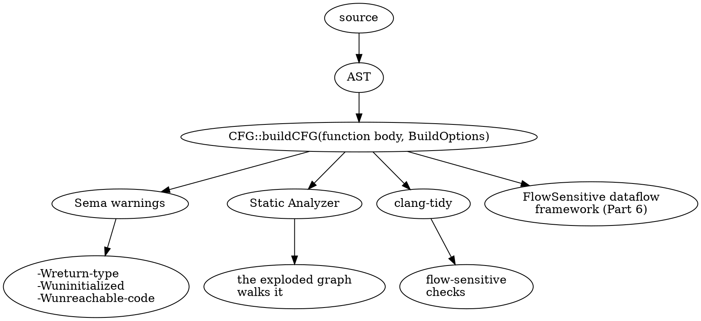
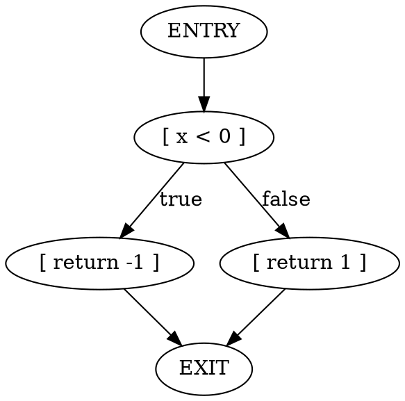
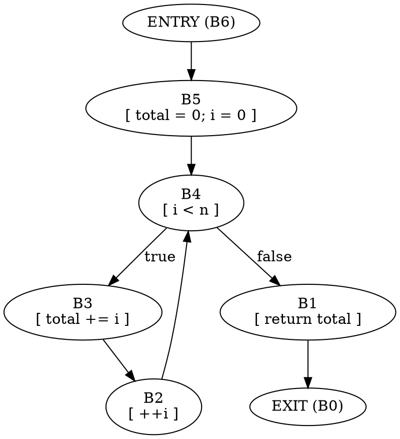
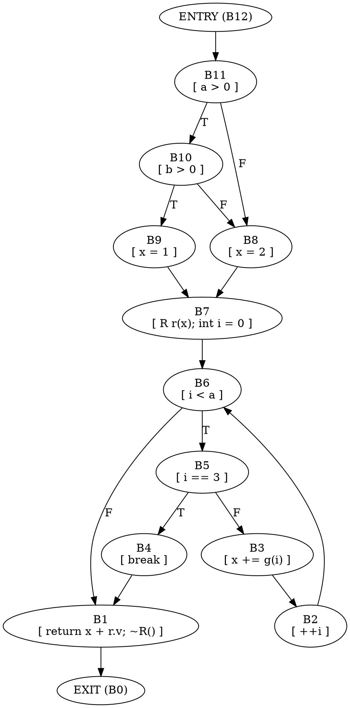
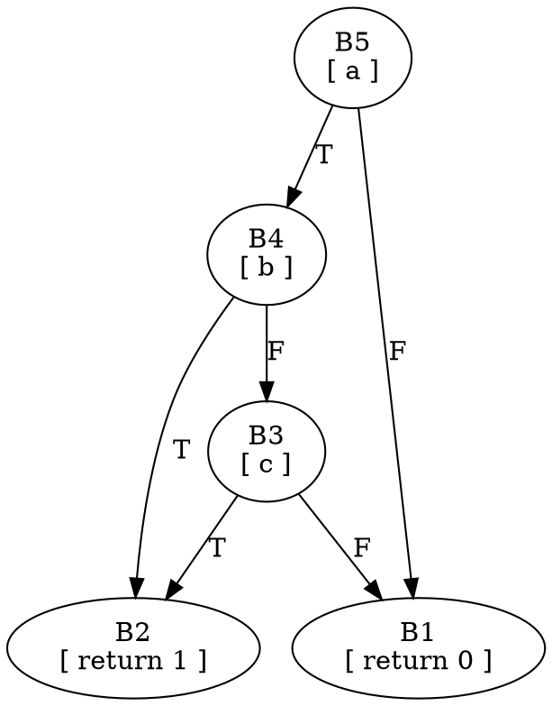

# Part 1 — Reading CFGs on the Command Line

[← README](README.md) | [Part 2 — Building CFGs in C++ →](part_2_building_cfgs.md)

## What You'll Learn

- What a **control-flow graph** is, and why Clang builds one *separately* from the AST
- How to dump a CFG with the Static Analyzer's `debug.DumpCFG` checker and read every part of the output (`[B1.3]`, `T:`, `Preds`/`Succs`)
- What each branch construct (`if`, `&&`/`||`, `?:`, loops, `switch`, `goto`, `break`/`continue`) looks like as blocks and edges
- What the `-analyzer-config cfg-*` options add to a C++ CFG (destructors, temporaries, lifetimes, scopes, loop exits, static-init branches, construction contexts)
- How to get Graphviz output without a GUI viewer
- The companion debug dumps: dominators, post-dominators, control dependencies, liveness, call graph
- What changes between a C and a C++ CFG

## The Big Picture

The AST says what the code *spells*. It does not say how control *flows*: an `IfStmt` is one tree node whether or not its branches rejoin, and a `&&` is one `BinaryOperator` even though it hides a conditional jump. Questions like "can this line run?", "is this variable still needed here?" or "can this function fall off the end?" are questions about **paths**, and paths are edges the AST does not have.

Clang answers them with one source-level, intra-procedural **CFG** per function body. It is *not* stored in the AST — it is built on demand by `CFG::buildCFG(...)` (Part 2) and consumed by everything flow-based:



The same function can produce different CFGs depending on `BuildOptions`. Each consumer picks its own flavour; Part 1 shows the Static Analyzer's flavour, because `clang --analyze` can print it for you with no code at all.

```
 basic block  = a straight-line run of elements; control enters at the top, leaves at the bottom
 edge         = a possible transfer of control between blocks
 ENTRY / EXIT = the empty first and last block of every CFG
```

## Environment for this part

Everything runs from the lab root, `clang-cfg-lab/`, against Homebrew LLVM 22. Tools are not needed yet — only `clang` and four small shell wrappers in `scripts/`:

| Script | What it does |
|--------|--------------|
| `scripts/dumpcfg.sh <file> [clang flags]` | `clang --analyze` with the right language flags; `FN=name` keeps one function, `CHECKER=debug.X` swaps the checker |
| `scripts/cfgshape.sh <file>` | one line per block — a compact view of the graph shape |
| `scripts/viewcfg.sh <file>` | captures the Graphviz graphs of `debug.ViewCFG` without opening a viewer |
| `scripts/flags.sh` | prints the platform flags a standalone Clang front end needs (used from Part 2) |

> [!note]
> Every `bash` block in these docs is run by `scripts/doccheck.py`, and the block after it is that command's real output. Commands are always run from the lab root and use relative paths.

---

## Section 1.1 — What a CFG is, and your first dump

### Why

Before reading dumps you need the vocabulary — block, element, terminator, edge — and one tiny example where you can predict the answer before looking at it.

### What to Do

**Sample file:** `manifests/p01_hello.cpp` — two functions. `sign` has one branch, `sum` has one loop.

```cpp
int sign(int x) {
  if (x < 0)
    return -1;
  return 1;
}

int sum(int n) {
  int total = 0;
  for (int i = 0; i < n; ++i)
    total += i;
  return total;
}
```

Check the toolchain first:

```bash
/opt/homebrew/opt/llvm/bin/clang --version | head -1
```

```text expected
Homebrew clang version 22.1.8
```

Predict `sign`'s graph before you look. One test, two exits:



Now dump it. `FN=sign` keeps only that function.

```bash
FN=sign scripts/dumpcfg.sh manifests/p01_hello.cpp
```

```text expected
int sign(int x)
 [B4 (ENTRY)]
   Succs (1): B3

 [B1]
   1: 1
   2: return [B1.1];
   Preds (1): B3
   Succs (1): B0

 [B2]
   1: 1
   2: -[B2.1]
   3: return [B2.2];
   Preds (1): B3
   Succs (1): B0

 [B3]
   1: x
   2: [B3.1] (ImplicitCastExpr, LValueToRValue, int)
   3: 0
   4: [B3.2] < [B3.3]
   T: if [B3.4]
   Preds (1): B4
   Succs (2): B2 B1

 [B0 (EXIT)]
   Preds (2): B1 B2
```

What the script runs under the hood (long form, broken with `\`):

```bash
/opt/homebrew/opt/llvm/bin/clang --analyze \
  -Xclang -analyzer-checker=debug.DumpCFG -o /dev/null \
  -x c++ -std=c++17 -fcxx-exceptions \
  manifests/p01_hello.cpp 2>&1 | head -3
```

```text expected
int sign(int x)
 [B4 (ENTRY)]
   Succs (1): B3
```

| Piece | Why |
|-------|-----|
| `clang --analyze` | runs the Static Analyzer instead of generating code; the CFG is built because the analyzer needs it |
| `-Xclang -analyzer-checker=debug.DumpCFG` | enables a *debug* checker whose only job is to print each function's CFG |
| `-x c++ -std=c++17 -fcxx-exceptions` | pick the language explicitly; exceptions on so `try`/`catch` parse (Part 1.3 uses them) |
| `-o /dev/null` | the analyzer would otherwise write a `<file>.plist` report into the current directory |
| `2>&1` | the dump goes to **stderr** |

The same thing with the front-end spelling is `clang -cc1 -analyze -analyzer-checker=debug.DumpCFG file.cpp`. It works for a file with no `#include`s, but `-cc1` bypasses the driver, which is what adds the SDK and libc++ include paths:

```bash
/opt/homebrew/opt/llvm/bin/clang -cc1 -analyze -analyzer-checker=debug.DumpCFG \
  -x c++ manifests/p02_includes.cpp 2>&1 | head -1
```

```text expected
manifests/p02_includes.cpp:3:10: fatal error: 'cmath' file not found
```

The driver form above is easier on macOS for that reason.

Now `sum`, which has a loop. The one-line-per-block view is easier to read than the dump while you are learning the notation:

```bash
FN=sum scripts/cfgshape.sh manifests/p01_hello.cpp
```

```text expected
int sum(int n)
  B6   ENTRY             0 elems                           -> B5
  B1                     3 elems                           -> B0
  B2                     2 elems                           -> B4
  B3                     4 elems                           -> B2
  B4                     5 elems  T: for (...; _; ...)     -> B3 B1
  B5                     4 elems                           -> B4
  B0   EXIT              0 elems                           -> -
```

Read the `->` column as "successors". `B4` loops: it is reached from `B5` (first time) and `B2` (every later time), and it leaves to `B3` (stay in the loop) or `B1` (leave).



### Verify

Count blocks per function. `sign` should have 5 (entry, test, two returns, exit) and `sum` should have 7:

```bash
for f in sign sum; do
  echo "$f: $(FN=$f scripts/dumpcfg.sh manifests/p01_hello.cpp | grep -c '^ \[B') blocks"
done
```

### Expected

```text expected
sign: 5 blocks
sum: 7 blocks
```

> [!hint]- Quiz: why does `sum` have 7 blocks and not 5?
> Count the blocks a `for` needs: the initializer, the condition, the body, the increment, and the code after the loop — plus entry and exit.

> [!success]- Answer
> `B6` entry, `B5` init, `B4` condition, `B3` body, `B2` increment, `B1` the `return`, `B0` exit. The increment is its own block because it is a jump target for the back edge.

---

## Section 1.2 — Reading the dump format

### Why

Every later section is a dump. If you can read one block in 5 seconds you can read all of them. This section decodes a function with a short-circuit `&&`, an `if`/`else`, a loop with a `break` and a C++ object with a destructor.

### What to Do

**Sample file:** `manifests/p01_basic.cpp` — function `f`. `R` has a destructor, so the CFG will contain a destructor call.

```cpp
struct R { R(int); ~R(); int v; };
int g(int);

int f(int a, int b) {
  int x;
  if (a > 0 && b > 0)
    x = 1;
  else
    x = 2;
  R r(x);
  for (int i = 0; i < a; ++i) {
    if (i == 3)
      break;
    x += g(i);
  }
  return x + r.v;
}
```

First the shape. Thirteen blocks:

```bash
FN=f scripts/cfgshape.sh manifests/p01_basic.cpp
```

```text expected
int f(int a, int b)
  B12  ENTRY             0 elems                           -> B11
  B1                     8 elems                           -> B0
  B2                     2 elems                           -> B6
  B3                     7 elems                           -> B2
  B4                     0 elems  T: break;                -> B1
  B5                     4 elems  T: if _                  -> B4 B3
  B6                     5 elems  T: for (...; _; ...)     -> B5 B1
  B7                     6 elems                           -> B6
  B8                     3 elems                           -> B7
  B9                     3 elems                           -> B7
  B10                    4 elems  T: if _ && _             -> B9 B8
  B11                    5 elems  T: _ && ...              -> B10 B8
  B0   EXIT              0 elems                           -> -
```

Now the full text of three blocks that show everything. `B11` is the first `a > 0`, `B7` is the code after the `if` (the `R r(x);` and the loop init) and `B1` is the exit path with the destructor. Print only those with `awk`:

```bash
FN=f scripts/dumpcfg.sh manifests/p01_basic.cpp | awk '/^ \[B(11|7|1)\]/ {p=1} /^$/ {p=0} p'
```

```text expected
 [B1]
   1: x
   2: [B1.1] (ImplicitCastExpr, LValueToRValue, int)
   3: r
   4: [B1.3].v
   5: [B1.4] (ImplicitCastExpr, LValueToRValue, int)
   6: [B1.2] + [B1.5]
   7: return [B1.6];
   8: [B7.4].~R() (Implicit destructor)
   Preds (2): B4 B6
   Succs (1): B0
 [B7]
   1: x
   2: [B7.1] (ImplicitCastExpr, LValueToRValue, int)
   3: [B7.2] (CXXConstructExpr, [B7.4], R)
   4: R r(x);
   5: 0
   6: int i = 0;
   Preds (2): B8 B9
   Succs (1): B6
 [B11]
   1: int x;
   2: a
   3: [B11.2] (ImplicitCastExpr, LValueToRValue, int)
   4: 0
   5: [B11.3] > [B11.4]
   T: [B11.5] && ...
   Preds (1): B12
   Succs (2): B10 B8
```

Decode it line by line:

| Text | Meaning |
|------|---------|
| `[B11]` | a block header. IDs are *labels*, not an order of execution |
| `1: int x;` | element 1 of `B11`: the declaration statement. Elements are numbered from 1 in **execution order** |
| `3: [B11.2] (ImplicitCastExpr, LValueToRValue, int)` | `[B11.2]` is "element 2 of block B11" — an operand reference. This element converts the lvalue `a` to the value `a` |
| `5: [B11.3] > [B11.4]` | the comparison `a > 0`, written with references to its operands |
| `T: [B11.5] && ...` | the **terminator**: the statement that ends the block and picks the successor. It is *not* an element. `&&` is a terminator because it is a conditional jump |
| `Preds (1): B12` | blocks that can flow into this one (order is arbitrary) |
| `Succs (2): B10 B8` | blocks this one can flow to. **Order matters**: for a conditional terminator, successor 1 is the *true* edge and successor 2 the *false* edge |
| `3: [B7.2] (CXXConstructExpr, [B7.4], R)` | the call to `R`'s constructor; `[B7.4]` is the object being constructed |
| `8: [B7.4].~R() (Implicit destructor)` | an **implicit destructor call** — present in `B1` because the analyzer's default options include them (Section 1.4) |

Four things in this dump surprise people the first time:

1. **Entry has the highest ID and Exit is always `B0`.** Blocks are numbered in the order they are created, and the builder works backwards from the end of the function. Never read block IDs as program order.
2. **Expression trees are flattened.** `x += g(i)` is seven elements: operands first, then the operator that consumes them, each referring back to its operands with `[Bn.m]`. That is what `setAllAlwaysAdd()` means in Part 2 — the Static Analyzer asks for every sub-expression to be its own element.
3. **An expression can be consumed in a different block than where it is evaluated.** Look at `B10`'s terminator: `if [B11.5] && [B10.4]`. The value `a > 0` was computed in `B11`, but the `&&` is only finished in `B10`.
4. **A terminator is not an element.** `B4` is just `T: break;`: a block with zero elements and one successor.

Here is the whole graph. Follow `x = 1` and `x = 2` into `B7`, and the loop `B6 → B5 → B3 → B2 → B6`. IDs descend along the main path because the builder numbers blocks from the end of the function backwards:



### Verify

List every block header and every terminator in the function, nothing else. This is the skeleton you should be able to recognise:

```bash
FN=f scripts/dumpcfg.sh manifests/p01_basic.cpp | grep -E '^ \[B|T:'
```

### Expected

```text expected
 [B12 (ENTRY)]
 [B1]
 [B2]
 [B3]
 [B4]
   T: break;
 [B5]
   T: if [B5.4]
 [B6]
   T: for (...; [B6.5]; ...)
 [B7]
 [B8]
 [B9]
 [B10]
   T: if [B11.5] && [B10.4]
 [B11]
   T: [B11.5] && ...
 [B0 (EXIT)]
```

Every conditional terminator (`if`, `for`, `&&`) is followed by a block with two successors; the unconditional `break` has one.

> [!hint]- Quiz: which block is the loop's "back edge" and why is `B2` its own block?
> Find the block whose successor is `B6` and whose ID is lower than `B6`'s.

> [!success]- Answer
> `B2` (`++i`) flows back to `B6`. Because the increment must run on every iteration *and* on `continue`, the builder gives it its own block so that both paths can jump to it. Edges that go to a block already seen on the path from entry are **back edges**; each one closes a loop.

---

## Section 1.3 — Branch constructs

### Why

A CFG is made of a handful of patterns. Learn to recognise them and every function becomes a combination of familiar shapes. We use `cfgshape.sh` for the graph and the full dump only where the elements matter.

### What to Do

**Sample file:** `manifests/p01_branches.cpp` — one function per construct (`if_else`, `and_or`, `ternary`, `while_loop`, `do_loop`, `range_for`, `brk_cont`, `sw`, `jump`).

#### `if` / `else`

```bash
FN=if_else scripts/cfgshape.sh manifests/p01_branches.cpp
```

```text expected
int if_else(int a)
  B5   ENTRY             0 elems                           -> B4
  B1                     3 elems                           -> B0
  B2                     3 elems                           -> B1
  B3                     3 elems                           -> B1
  B4                     4 elems  T: if _                  -> B3 B2
  B0   EXIT              0 elems                           -> -
```

A **diamond**: `B4` tests, `B3` and `B2` are the two arms, `B1` is the join. Successor order is `B3 B2` — **true first, then false** — so `B3` is `r = 1` (the `then` arm).

#### `&&` and `||`

Short-circuit evaluation is control flow, so each operand gets its *own block* and the operator is a terminator:

```bash
FN=and_or scripts/cfgshape.sh manifests/p01_branches.cpp
```

```text expected
int and_or(int a, int b, int c)
  B6   ENTRY             0 elems                           -> B5
  B1                     2 elems                           -> B0
  B2                     2 elems                           -> B0
  B3                     3 elems  T: if _ && (_ || _)      -> B2 B1
  B4                     3 elems  T: _ || ...              -> B2 B3
  B5                     3 elems  T: _ && ...              -> B4 B1
  B0   EXIT              0 elems                           -> -
```

The condition was `a && (b || c)`:



Read it off the successor columns: `B5`'s successors are `B4 B1` (true: go on and evaluate `b`; false: short-circuit to the `else`). `B4` is `||`, so its *true* edge goes straight to the `then` block `B2`.

> [!warning] The documented order of `&&`/`||` successors is misleading
> The header comment in `CFG.h` says the successors of a logical operator are "expression that consumes the op, RHS". In practice (22.1.8) **successor 0 is always the true edge and successor 1 the false edge**, for `&&` as well as `||`. For `a && b`, true means "evaluate the RHS", so the RHS comes first; for `a || b`, true means "done", so the short-circuit target comes first. Part 2.6 verifies this from code.

Look at the full terminator of the `if` in this function, which is in `B3` (the last operand):

```bash
FN=and_or scripts/dumpcfg.sh manifests/p01_branches.cpp | grep -E 'T:'
```

```text expected
   T: if [B5.3] && ([B4.3] || [B3.3])
   T: [B4.3] || ...
   T: [B5.3] && ...
```

The `if` terminator prints the *whole* condition, while the `&&` and `||` terminators print only `...` after their operand. One condition, three terminators, one per decision.

#### `?:`

The conditional operator produces a value, so its result flows into the next expression:

```bash
FN=ternary scripts/dumpcfg.sh manifests/p01_branches.cpp | grep -E '^ \[B|T:|\?'
```

```text expected
 [B5 (ENTRY)]
 [B1]
   1: [B4.3] ? [B2.4] : [B3.4]
 [B2]
 [B3]
 [B4]
   T: [B4.3] ? ... : ...
 [B0 (EXIT)]
```

`B1` element 1 is `[B4.3] ? [B2.4] : [B3.4]` — "the condition from `B4`, the then-value from `B2`, the else-value from `B3`" — and that expression is used by the `return` in element 2. Values flow through blocks by reference.

#### Loops

```bash
FN=while_loop scripts/cfgshape.sh manifests/p01_branches.cpp
FN=do_loop scripts/cfgshape.sh manifests/p01_branches.cpp
FN=range_for scripts/cfgshape.sh manifests/p01_branches.cpp
```

```text expected
int while_loop(int n)
  B6   ENTRY             0 elems                           -> B5
  B1                     3 elems                           -> B0
  B2                     0 elems                           -> B4
  B3                     6 elems                           -> B2
  B4                     4 elems  T: while _               -> B3 B1
  B5                     2 elems                           -> B4
  B0   EXIT              0 elems                           -> -
int do_loop(int n)
  B6   ENTRY             0 elems                           -> B5
  B1                     3 elems                           -> B0
  B2                     4 elems  T: do ... while _        -> B4 B1
  B3                     6 elems                           -> B2
  B4                     0 elems                           -> B3
  B5                     2 elems                           -> B3
  B0   EXIT              0 elems                           -> -
int range_for(const int (&arr)[4])
  B6   ENTRY             0 elems                           -> B5
  B1                     3 elems                           -> B0
  B2                     5 elems  T: for (int v : _)       -> B4 B1
  B3                     2 elems                           -> B2
  B4                     9 elems                           -> B3
  B5                    12 elems                           -> B2
  B0   EXIT              0 elems                           -> -
```

| Loop | Where the test lives | The "empty" block |
|------|----------------------|-------------------|
| `while` | `B4`, entered from before the loop *and* from the back edge | `B2` (0 elems): the **loop edge** that jumps back to the condition |
| `do ... while` | `B2`, at the bottom; the body `B3` is entered straight from before the loop | `B4` (0 elems): the loop edge from the condition back to the body |
| range-`for` | `B2` (`__begin1 != __end1`) | none: it has an explicit increment block `B3`; setup (`__range1`, `__begin1`, `__end1`) is `B5` |

The empty loop-edge blocks are not noise: `CFGBlock::getLoopTarget()` is set on the block that jumps back to the loop head — the empty block for `while`/`do`, the increment block for `for` — which is how analyses find the head of a loop (Part 2.6).

The condition block of every loop lists **body first, exit second** (`B3 B1` for `while`).

#### `break` and `continue`

```bash
FN=brk_cont scripts/cfgshape.sh manifests/p01_branches.cpp
```

```text expected
int brk_cont(int n)
  B10  ENTRY             0 elems                           -> B9
  B1                     3 elems                           -> B0
  B2                     2 elems                           -> B8
  B3                     4 elems                           -> B2
  B4                     0 elems  T: break;                -> B1
  B5                     4 elems  T: if _                  -> B4 B3
  B6                     0 elems  T: continue;             -> B2
  B7                     5 elems  T: if _                  -> B6 B5
  B8                     5 elems  T: for (...; _; ...)     -> B7 B1
  B9                     4 elems                           -> B8
  B0   EXIT              0 elems                           -> -
```

`B4` is `break` (a terminator with no elements; edge to the exit-of-loop `B1`). `B6` is `continue` (edge to `B2`, the increment). Both are plain unconditional jumps.

#### `switch` and fallthrough

```bash
FN=sw scripts/cfgshape.sh manifests/p01_branches.cpp
```

```text expected
int sw(int k)
  B7   ENTRY             0 elems                           -> B2
  B1                     3 elems                           -> B0
  B2                     4 elems  T: switch _              -> B4 B5 B6 B3
  B3   default:          4 elems                           -> B1
  B4   case 2:           3 elems  T: break;                -> B1
  B5   case 1:           3 elems                           -> B4
  B6   case 0:           3 elems  T: break;                -> B1
  B0   EXIT              0 elems                           -> -
```

The source is `case 0: ... break; case 1: ... /* falls through */ case 2: ... break; default: ...`.

| Block | Label | What it is |
|-------|-------|-----------|
| `B2` | — | the `switch` terminator; successors `B4 B5 B6 B3` |
| `B6` | `case 0:` | ends with `break` |
| `B5` | `case 1:` | **no terminator**: its successor `B4` is the *next* case — that is the fallthrough |
| `B4` | `case 2:` | ends with `break` |
| `B3` | `default:` | falls out to `B1` |

> [!warning] Switch successors are in reverse source order
> The `switch` block lists the cases **last to first**, then `default` — `B4 B5 B6` is `case 2, case 1, case 0`. The default edge is always last. Never assume case order equals successor order.

#### `goto` and labels

```bash
FN=jump scripts/cfgshape.sh manifests/p01_branches.cpp
```

```text expected
int jump(int n)
  B6   ENTRY             0 elems                           -> B5
  B1   done:             3 elems                           -> B0
  B2                     6 elems  T: goto loop;            -> B4
  B3                     0 elems  T: goto done;            -> B1
  B4   loop:             4 elems  T: if _                  -> B3 B2
  B5                     2 elems                           -> B4
  B0   EXIT              0 elems                           -> -
```

Labels print above a block (`loop:`, `done:`). `B2` is the `goto loop;` that jumps backward to `B4` — a loop made without any loop statement, but still a back edge. `B3` is `goto done;`.

### Verify

Count the blocks with two or more successors in each function — its **decision points**. (Cyclomatic complexity, which you will compute properly in Part 2.9, is related but counts every `case` of a `switch`.)

```bash
for f in if_else and_or ternary while_loop do_loop range_for brk_cont sw jump; do
  printf '%-10s decisions=%s\n' "$f" \
    "$(FN=$f scripts/cfgshape.sh manifests/p01_branches.cpp | grep -c -E -- '-> B[0-9]+ B[0-9]+')"
done
```

### Expected

```text expected
if_else    decisions=1
and_or     decisions=3
ternary    decisions=1
while_loop decisions=1
do_loop    decisions=1
range_for  decisions=1
brk_cont   decisions=3
sw         decisions=1
jump       decisions=1
```

`and_or` has 3 decisions (`&&`, `||`, and the `if`); `brk_cont` has 3 (`for`, and two `if`s); `sw` counts as one block even though it has four successors.

---

## Section 1.4 — `-analyzer-config cfg-*`: what the CFG models

### Why

So far the dumps were simple C-like functions. C++ adds invisible control flow: destructors that run when scope ends, temporaries destroyed at the end of a full expression, `static` locals initialised once, `new` that allocates before it constructs. Whether these appear in the CFG is a *build option*; the Static Analyzer exposes eight of them as `-analyzer-config cfg-*`.

### What to Do

**Sample file:** `manifests/p01_cxx.cpp`. First see the defaults:

```bash
/opt/homebrew/opt/llvm/bin/clang --analyze -Xclang -analyzer-checker=debug.ConfigDumper -o /dev/null \
  -x c++ manifests/p01_hello.cpp 2>&1 | grep '^cfg-'
```

```text expected
cfg-conditional-static-initializers = true
cfg-expand-default-aggr-inits = false
cfg-implicit-dtors = true
cfg-lifetime = false
cfg-loopexit = false
cfg-rich-constructors = true
cfg-scopes = false
cfg-temporary-dtors = true
```

| Option | Default | Adds to the CFG |
|--------|---------|-----------------|
| `cfg-implicit-dtors` | true | automatic-object, member, base, `delete` destructor calls |
| `cfg-temporary-dtors` | true | destructors of temporaries, and the branching they cause |
| `cfg-rich-constructors` | true | construction contexts on constructor and by-value-call elements |
| `cfg-conditional-static-initializers` | true | a branch around the one-time initialisation of a function-local `static` |
| `cfg-lifetime` | **false** | `Lifetime ends` elements |
| `cfg-scopes` | **false** | `CFGScopeBegin` / `CFGScopeEnd` elements |
| `cfg-loopexit` | **false** | a `LoopExit` element when a loop is left |
| `cfg-expand-default-aggr-inits` | **false** | default member initialisers of aggregates, expanded inline |

Change an option with `-Xclang -analyzer-config -Xclang <name>=<value>`; `scripts/dumpcfg.sh` forwards extra arguments. Each experiment below uses the function in `p01_cxx.cpp` that exercises it.

#### Implicit destructors — `dtors`

```cpp
int dtors(int n) {
  T t;                 // T has a destructor
  if (t.ok())
    return n;
  return n + t.v;
}
```

With the default (`cfg-implicit-dtors=true`), `t.~T()` appears on *both* return paths:

```bash
FN=dtors scripts/dumpcfg.sh manifests/p01_cxx.cpp | grep -E '^ \[B|~T|return'
```

```text expected
 [B4 (ENTRY)]
 [B1]
   7: return [B1.6];
   8: [B3.2].~T() (Implicit destructor)
 [B2]
   3: return [B2.2];
   4: [B3.2].~T() (Implicit destructor)
 [B3]
 [B0 (EXIT)]
```

Turn it off and the destructor calls vanish:

```bash
FN=dtors scripts/dumpcfg.sh manifests/p01_cxx.cpp \
  -Xclang -analyzer-config -Xclang cfg-implicit-dtors=false | grep -E '^ \[B|~T|return'
```

```text expected
 [B4 (ENTRY)]
 [B1]
   7: return [B1.6];
 [B2]
   3: return [B2.2];
 [B3]
 [B0 (EXIT)]
```

Control flow did not change — it is the same four blocks — but a checker that cares "is `t` destroyed before this return?" can only answer that with the option on.

#### Temporaries — `temporaries`

```cpp
int temporaries(int n) {
  if (mk().ok() && n)      // mk() returns a T by value: a temporary
    return 1;
  return 0;
}
```

```bash
FN=temporaries scripts/dumpcfg.sh manifests/p01_cxx.cpp | grep -E '^ \[B|T:|~T|BindTemporary|CXXRecordTypedCall'
```

```text expected
 [B6 (ENTRY)]
 [B1]
 [B2]
 [B3]
   2: ~T() (Temporary object destructor)
   T: if [B3.1]
 [B4]
 [B5]
   3: [B5.2]() (CXXRecordTypedCall, [B5.4], [B5.5])
   4: [B5.3] (BindTemporary)
   T: [B5.8] && ...
 [B0 (EXIT)]
```

The temporary returned by `mk()` is created in `B5` (note `(BindTemporary)`) and destroyed in `B3`, **after** the `&&` has been decided. The destructor is in the block where the full expression ends, not where the object was made — and when `n` is false the second operand is skipped, but the temporary still has to be destroyed on both paths. That is the "branching they cause" the option's description mentions.

`CXXRecordTypedCall` is a by-value call returning a class type; its two trailing references — `[B5.4], [B5.5]` — are its **construction context**: the `BindTemporary` and the materialised temporary the result is written into. That information comes from `cfg-rich-constructors`.

#### Lifetimes, scopes and loop exits — `scopes`

```cpp
int scopes(int n) {
  int total = 0;
  while (n > 0) {
    int sq = n * n;       // sq is born and dies on every iteration
    total += sq;
    --n;
  }
  return total;
}
```

These three options are off by default, so first look at the plain graph, then turn them all on:

```bash
FN=scopes scripts/dumpcfg.sh manifests/p01_cxx.cpp | grep -c -E 'Lifetime|CFGScope|LoopExit'
```

```text expected
0
```

```bash
FN=scopes scripts/dumpcfg.sh manifests/p01_cxx.cpp \
  -Xclang -analyzer-config -Xclang cfg-lifetime=true \
  -Xclang -analyzer-config -Xclang cfg-scopes=true \
  -Xclang -analyzer-config -Xclang cfg-loopexit=true | grep -E '^ \[B|Lifetime|CFGScope|LoopExit|T:'
```

```text expected
 [B6 (ENTRY)]
 [B1]
   1: WhileStmt (LoopExit)
   5: [B5.3] (Lifetime ends)
   6: CFGScopeEnd(total)
   7: [Parm: n] (Lifetime ends)
   8: CFGScopeEnd(n)
 [B2]
 [B3]
   1: CFGScopeBegin(sq)
  14: [B3.7] (Lifetime ends)
  15: CFGScopeEnd(sq)
 [B4]
   T: while [B4.4]
 [B5]
   1: CFGScopeBegin(total)
 [B0 (EXIT)]
```

| New element | Printed as | Meaning |
|-------------|-----------|---------|
| `CFGScopeBegin(sq)` / `CFGScopeEnd(sq)` | `CFGScopeBegin(sq)` | the variable's scope opens / closes (for `n`, at function level) |
| `CFGLifetimeEnds` | `[B3.7] (Lifetime ends)` | the *object's storage* ends; points at the declaration it refers to. Parameters print `[Parm: n] (Lifetime ends)` |
| `CFGLoopExit` | `WhileStmt (LoopExit)` | the loop is left; present even if the body never ran |

`sq`'s lifetime ends inside the loop body, every iteration. That is exactly the fact a use-after-scope analysis needs.

#### Function-local statics, `new` and exceptions — `heap_static`

```cpp
int heap_static(int n) {
  static int cache = n;    // initialised once
  int *p = new int(3);
  int r = *p + cache;
  delete p;
  return r;
}
```

```bash
FN=heap_static scripts/cfgshape.sh manifests/p01_cxx.cpp
```

```text expected
int heap_static(int n)
  B4   ENTRY             0 elems                           -> B3
  B1                    18 elems                           -> B0
  B2                     3 elems                           -> B1
  B3                     0 elems  T: static init cache     -> B1 B2
  B0   EXIT              0 elems                           -> -
```

The first real block, `B3` with `T: static init cache`, is the **conditional static initialiser**: two successors. The first, `B1`, skips the initialisation (already done); the second, `B2`, runs `static int cache = n;` and then rejoins at `B1`. With `cfg-conditional-static-initializers=false` the branch disappears:

```bash
FN=heap_static scripts/cfgshape.sh manifests/p01_cxx.cpp \
  -Xclang -analyzer-config -Xclang cfg-conditional-static-initializers=false | grep -c 'static init'
```

```text expected
0
```

`CFGNewAllocator` — an element that stands for the *allocation* before the constructor of a `new`-expression — has no `cfg-*` switch: the analyzer always enables it, so it shows up as `CFGNewAllocator(int *)`:

```bash
FN=heap_static scripts/dumpcfg.sh manifests/p01_cxx.cpp | grep -E 'NewAllocator|new int|delete'
```

```text expected
   1: CFGNewAllocator(int *)
   3: new int([B1.2])
   4: int *p = new int(3);
  15: delete [B1.14]
```

#### Construction contexts — `cfg-rich-constructors`

With the default `cfg-rich-constructors=true` a constructor element names the object it constructs (`[B3.2]`). Turn it off and that link is lost:

```bash
FN=dtors scripts/dumpcfg.sh manifests/p01_cxx.cpp | grep CXXConstructExpr
FN=dtors scripts/dumpcfg.sh manifests/p01_cxx.cpp \
  -Xclang -analyzer-config -Xclang cfg-rich-constructors=false | grep CXXConstructExpr
```

```text expected
   1:  (CXXConstructExpr, [B3.2], T)
   1:  (CXXConstructExpr, T)
```

#### Aggregates — `cfg-expand-default-aggr-inits`

```cpp
struct Agg { int x = 1; int y; };
int aggregate() { Agg g{.y = 2}; return g.x + g.y; }
```

`x` has a default member initialiser `= 1` that the braces did not override. By default the CFG does not show that `1`. With the option, it appears as element 1:

```bash
FN=aggregate scripts/dumpcfg.sh manifests/p01_cxx.cpp | sed -n 6,8p
FN=aggregate scripts/dumpcfg.sh manifests/p01_cxx.cpp \
  -Xclang -analyzer-config -Xclang cfg-expand-default-aggr-inits=true | sed -n 6,9p
```

```text expected
   1:
   2: 2
   3: {.y = [B1.2]}
   1: 1
   2:
   3: 2
   4: {.y = [B1.3]}
```

#### Exceptions and `noreturn` — `eh`

Exceptions are different: there is no `cfg-*` option for exception *edges*. The analyzer builds `try`/`catch` but, by default, **does not connect calls to their handlers**:

```bash
FN=eh scripts/cfgshape.sh manifests/p01_cxx.cpp
```

```text expected
int eh(int n)
  B8   ENTRY             0 elems                           -> B7
  B1                     3 elems                           -> B0
  B2                     0 elems  T: try ...               -> B3 B0
  B3   catch (int e):    4 elems                           -> B0
  B4   NORETURN          3 elems                           -> B0
  B5                     4 elems  T: if _                  -> B4 B1
  B6                     2 elems                           -> B2
  B7                     4 elems  T: if _                  -> B6 B5
  B0   EXIT              0 elems                           -> -
```

`B2` (`T: try ...`) has two successors — the handler `B3` (labelled `catch (int e):`) and the exit `B0` for "no handler matched" — but **nothing flows into `B2`**. Nothing points at the try-dispatch block, so a reachability analysis would call the `catch` dead. Part 2.3 shows the `AddEHEdges` option that adds those edges, and Part 3 covers exceptions in depth.

`B4` is tagged `NORETURN`: its call to `die()` is declared `[[noreturn]]`, so its only successor is `B0`. Control never continues to the `return n;` after the `if`.

### Verify

Count the extra elements the three off-by-default options add to the whole file:

```bash
for opt in cfg-lifetime cfg-scopes cfg-loopexit; do
  printf '%-14s on : %s lines\n' $opt "$(scripts/dumpcfg.sh manifests/p01_cxx.cpp \
    -Xclang -analyzer-config -Xclang $opt=true | wc -l | tr -d ' ')"
done
printf '%-14s off: %s lines\n' defaults "$(scripts/dumpcfg.sh manifests/p01_cxx.cpp | wc -l | tr -d ' ')"
```

### Expected

```text expected
cfg-lifetime   on : 299 lines
cfg-scopes     on : 304 lines
cfg-loopexit   on : 278 lines
defaults       off: 277 lines
```

Each option strictly adds lines; none of them changes any control-flow edge.

> [!hint]- Quiz: which two options both mention "end of scope" and how do their elements differ?
> One tells you the *name* went out of scope, the other that the *storage* is gone.

> [!success]- Answer
> `cfg-scopes` gives `CFGScopeBegin`/`CFGScopeEnd` for the scope of a variable (syntactic, balanced pairs). `cfg-lifetime` gives `CFGLifetimeEnds` (semantic: the object's storage is dead — it is also emitted for parameters and for `catch` variables). Lifetime-ends is what the experimental lifetime-safety analysis consumes.

---

## Section 1.5 — Graphviz: `debug.ViewCFG`

### Why

Text dumps stop being readable past about 15 blocks. A picture shows loops and joins at a glance. The Static Analyzer has a checker for that, `debug.ViewCFG`, and one catch: it tries to *open a viewer*, which is no good in a script or over SSH.

### What to Do

`debug.ViewCFG` calls `CFG::viewCFG`, which calls `llvm::ViewGraph`: write a `CFG-<random>.dot` file into `$TMPDIR`, then launch a viewer (`open` on macOS). Both halves are controllable from outside:

- point `TMPDIR` at a directory you own, so the file lands somewhere you can find it;
- give the process an **empty `PATH`** so no viewer program can be found and nothing launches.

`scripts/viewcfg.sh` does exactly that and renames the files after the functions:

```bash
scripts/viewcfg.sh manifests/p01_hello.cpp out/dot
```

```text expected
out/dot/p01_hello.1.sign.dot
out/dot/p01_hello.2.sum.dot
```

The long form, for one function, with the viewer-launch attempt visible in the output:

```bash
mkdir -p out/dot-raw && env TMPDIR="$PWD/out/dot-raw" PATH=/var/empty \
  /opt/homebrew/opt/llvm/bin/clang --analyze -Xclang -analyzer-checker=debug.ViewCFG -o /dev/null \
  -x c++ manifests/p01_hello.cpp 2>&1 | sed -E "s|^Writing '.*/(CFG-)[0-9a-f]+\.dot'.*|Writing 'out/dot-raw/\1XXXXXX.dot'|" | head -3
```

```text expected
Writing 'out/dot-raw/CFG-XXXXXX.dot'
Error: Couldn't find a usable graph viewer program:
  Tried 'open'
```

The DOT file is plain text — look at one. (The awk filter only renames the pointer-valued node names, `Node0x852ec7050`, to `N1`, `N2`, ... because the raw ones change on every run.)

```bash
awk '{ while (match($0, /Node0x[0-9a-f]+/)) { a = substr($0, RSTART, RLENGTH); if (!(a in m)) m[a] = "N" ++n; $0 = substr($0, 1, RSTART - 1) m[a] substr($0, RSTART + RLENGTH) } print }' \
  out/dot/p01_hello.1.sign.dot
```

```text expected
digraph unnamed {

	N1 [shape=record,label="{ [B0 (EXIT)]\l}"];
	N2 [shape=record,label="{ [B1]\l  1: 1\l  2: return [B1.1];\l}"];
	N2 -> N1;
	N3 [shape=record,label="{ [B2]\l  1: 1\l  2: -[B2.1]\l  3: return [B2.2];\l}"];
	N3 -> N1;
	N4 [shape=record,label="{ [B3]\l  1: x\l  2: [B3.1] (ImplicitCastExpr, LValueToRValue, int)\l  3: 0\l  4: [B3.2] \< [B3.3]\l   T: if [B3.4]\l}"];
	N4 -> N3;
	N4 -> N2;
	N5 [shape=record,label="{ [B4 (ENTRY)]\l}"];
	N5 -> N4;
}
```

| Part | Meaning |
|------|---------|
| `digraph unnamed` | the graph has no name; `viewcfg.sh` names the *file* after the function instead |
| `shape=record, label="{ [B3]\l 1: x\l ... }"` | each block is a record node; `\l` is a left-aligned line break |
| `N3 -> N2;` | one line per successor, in successor order |

Render it with Graphviz (`dot` is `brew install graphviz`):

```bash
scripts/viewcfg.sh manifests/p01_basic.cpp out/dot --svg
```

```text expected
out/dot/p01_basic.1.f.dot
out/dot/p01_basic.1.f.svg
```

Open `out/dot/p01_basic.1.f.svg` in a browser, or on macOS `open out/dot/p01_basic.1.f.svg`.

> [!warning] Edge direction and order
> The `.dot` file lists each block's outgoing edges in the same order as `Succs`, but Graphviz lays edges out as it likes; the left-to-right order of a branch's two arms in the picture is **not** the true/false order. Part 2.8 writes an exporter that labels edges `T`/`F`.

`DOTGraphTraits<const CFG*>` — the class that formats the nodes — is private to `CFG.cpp`, so a tool that wants *its own* DOT output (labelled edges, colours, a different node format) has to write an emitter. Part 2 does.

### Verify

Every function got a graph, and every graph contains one `->` per CFG edge. Compare the number of edges in the DOT file with the sum of `Succs` counts in the dump for `sum`:

```bash
echo "dot edges:    $(grep -c ' -> ' out/dot/p01_hello.2.sum.dot)"
echo "dump succs:   $(FN=sum scripts/dumpcfg.sh manifests/p01_hello.cpp | grep -E 'Succs' | sed -E 's/.*\(([0-9]+)\).*/\1/' | paste -sd+ - | bc)"
```

### Expected

```text expected
dot edges:    7
dump succs:   7
```

---

## Section 1.6 — Companion dumps: dominators, liveness, call graph

### Why

`debug.DumpCFG` shows you the graph. The other `debug.*` checkers run a classic *analysis* on that graph and print the result. They are a free way to see what Parts 4 and 5 will build, and a reference to check your own code against.

### What to Do

The checkers, from `clang -cc1 -analyzer-checker-help-developer`:

```bash
/opt/homebrew/opt/llvm/bin/clang -cc1 -analyzer-checker-help-developer 2>&1 | grep -E '^  debug\.(Dump|View)'
```

```text expected
  debug.DumpCFG                 Display Control-Flow Graphs
  debug.DumpCallGraph           Display Call Graph
  debug.DumpCalls               Print calls as they are traversed by the engine
  debug.DumpControlDependencies Print the post control dependency tree for a given CFG
  debug.DumpDominators          Print the dominance tree for a given CFG
  debug.DumpLiveExprs           Print results of live expression analysis
  debug.DumpLiveVars            Print results of live variable analysis
  debug.DumpPostDominators      Print the post dominance tree for a given CFG
  debug.DumpTraversal           Print branch conditions as they are traversed by the engine
  debug.ViewCFG                 View Control-Flow Graphs using GraphViz
  debug.ViewCallGraph           View Call Graph using GraphViz
  debug.ViewExplodedGraph       View Exploded Graphs using GraphViz
```

For the examples below the sample is `manifests/p01_hello.cpp`; `sign` (5 blocks) is the first graph in each output and `sum` (7 blocks) is the second.

#### Dominators — `debug.DumpDominators`

Block **A dominates B** if every path from entry to B goes through A. The output is the *immediate dominator* tree as `(node, idom)` pairs:

```bash
CHECKER=debug.DumpDominators scripts/dumpcfg.sh manifests/p01_hello.cpp | sed -n 1,6p
```

```text expected
Immediate dominance tree (Node#,IDom#):
(0,3)
(1,3)
(2,3)
(3,4)
(4,4)
```

`(1,3)`: the immediate dominator of `B1` (`return 1`) is `B3` (the test). `(4,4)`: the root maps to itself. Compare with `sign`'s graph from 1.1: `B3` is the only way to get to either return.

#### Post-dominators — `debug.DumpPostDominators`

A **post-dominates** B if every path from B to exit goes through A. Same format, computed on the reversed graph:

```bash
CHECKER=debug.DumpPostDominators scripts/dumpcfg.sh manifests/p01_hello.cpp | sed -n 1,6p
```

```text expected
Immediate post dominance tree (Node#,IDom#):
(0,0)
(1,0)
(2,0)
(3,0)
(4,3)
```

`(0,0)` is the root (exit). `(4,3)`: `B3` post-dominates entry. Note that the two returns `B1` and `B2` are not post-dominated by one another, only by `B0`: the diamond's arms do not reconverge before exit.

#### Control dependence — `debug.DumpControlDependencies`

B is **control dependent** on A if A decides whether B runs: A has an edge into B's path and another that avoids it. Pairs are `(dependent, decider)`:

```bash
CHECKER=debug.DumpControlDependencies scripts/dumpcfg.sh manifests/p01_hello.cpp | sed -n 1,3p
```

```text expected
Control dependencies (Node#,Dependency#):
(1,3)
(2,3)
```

Both returns depend on `B3`, the `x < 0` test. Entry and exit depend on nothing. This is the relation behind program slicing (Part 4.5).

#### Liveness — `debug.DumpLiveVars` / `debug.DumpLiveExprs`

A variable is **live** at a point if some path from there reads it before overwriting it. The dump lists variables live *at the exit of each block*:

```bash
CHECKER=debug.DumpLiveVars scripts/dumpcfg.sh manifests/p01_hello.cpp | awk '/B0 \(/ {n++} n == 2' | grep -v '^$'
```

```text expected
[ B0 (live variables at block exit) ]
[ B1 (live variables at block exit) ]
[ B2 (live variables at block exit) ]
 n <manifests/p01_hello.cpp:11:13>
 total <manifests/p01_hello.cpp:12:7>
 i <manifests/p01_hello.cpp:13:12>
[ B3 (live variables at block exit) ]
 n <manifests/p01_hello.cpp:11:13>
 total <manifests/p01_hello.cpp:12:7>
 i <manifests/p01_hello.cpp:13:12>
[ B4 (live variables at block exit) ]
 n <manifests/p01_hello.cpp:11:13>
 total <manifests/p01_hello.cpp:12:7>
 i <manifests/p01_hello.cpp:13:12>
[ B5 (live variables at block exit) ]
 n <manifests/p01_hello.cpp:11:13>
 total <manifests/p01_hello.cpp:12:7>
 i <manifests/p01_hello.cpp:13:12>
[ B6 (live variables at block exit) ]
 n <manifests/p01_hello.cpp:11:13>
```

This is `sum` (the second function): `n`, `total` and `i` are live at the end of the loop blocks `B2`–`B5` because the next iteration reads them. At the end of `B1` (the `return`) nothing is live — after `return total` nothing reads anything. `B6` (entry) shows only `n`: `total` and `i` are not live yet because they are assigned before they are read. `DumpLiveExprs` does the same for *expressions* whose value is computed in one block and used in another — the `&&` operand from 1.2:

```bash
CHECKER=debug.DumpLiveExprs scripts/dumpcfg.sh manifests/p01_basic.cpp | grep -A3 'B11 (live' | sed -E 's/0x[0-9a-f]+/0xADDR/'
```

```text expected
[ B11 (live expressions at block exit) ]

BinaryOperator 0xADDR '_Bool' '&&'
|-BinaryOperator 0xADDR '_Bool' '>'
```

#### Call graph — `debug.DumpCallGraph`

Not a CFG, but it lives in the same library (`clang/Analysis/CallGraph.h`):

```bash
CHECKER=debug.DumpCallGraph scripts/dumpcfg.sh manifests/p01_basic.cpp
```

```text expected
 --- Call graph Dump ---
  Function: < root > calls: f g
  Function: f calls: g
  Function: g calls:
```

`< root >` is a synthetic node with an edge to **every** function in the graph: `g` is listed under it although `f` calls it too, and a function whose *only* caller is `< root >` is one that nobody in this translation unit calls ([Section 8.1](part_8_call_graphs.md) reads the dump in detail). `debug.ViewCallGraph` draws it, and the same `TMPDIR` / empty `PATH` trick captures the DOT file:

```bash
mkdir -p out/dot-cg && env TMPDIR="$PWD/out/dot-cg" PATH=/var/empty \
  /opt/homebrew/opt/llvm/bin/clang --analyze -Xclang -analyzer-checker=debug.ViewCallGraph -o /dev/null \
  -x c++ manifests/p01_basic.cpp 2>&1 | head -1 | sed -E "s|^Writing '.*/(CallGraph-)[0-9a-f]+\.dot'|Writing 'out/dot-cg/\1XXXXXX.dot'|"
```

```text expected
Writing 'out/dot-cg/CallGraph-XXXXXX.dot'...  done.
```

Two other checkers are worth knowing about. `debug.DumpTraversal` prints `--BEGIN FUNCTION--` / `--END FUNCTION--` markers and the branch conditions as the *analyzer's* engine traverses them — it exposes the exploded-graph walk, not the CFG. `debug.ViewExplodedGraph` draws that walk. Neither is used in this lab.

### Verify

All of those dumps agree with each other about the graph: the post-dominator tree must have the exit block as its root, and the dominator tree the entry block. Check that for `sum`:

```bash
echo "dominator root (idom of itself):      $(CHECKER=debug.DumpDominators scripts/dumpcfg.sh manifests/p01_hello.cpp | sed -n 8,14p | awk -F'[(,)]' '$2==$3 {print "B" $2}')"
echo "post-dominator root (idom of itself): $(CHECKER=debug.DumpPostDominators scripts/dumpcfg.sh manifests/p01_hello.cpp | sed -n 8,14p | awk -F'[(,)]' '$2==$3 {print "B" $2}')"
```

### Expected

```text expected
dominator root (idom of itself):      B6
post-dominator root (idom of itself): B0
```

`B6` is `sum`'s entry and `B0` its exit.

---

## Section 1.7 — C versus C++

### Why

The CFG builder handles C and C++ with the same code, but a C++ translation unit has more to model. Knowing exactly *what* differs keeps you from looking for features that cannot exist in C — and shows two places where the same-looking source yields a different CFG.

### What to Do

**Sample file:** `manifests/p01_both.c` — valid C and valid C++.

```c
struct S { int a; int b; };

int pick(struct S *s, int k) {
  int r = 0;
  while (k > 0 && s->a != 0) {
    r += s->a > s->b ? s->a : s->b;
    --k;
  }
  return r;
}
```

`dumpcfg.sh` picks the language from the file extension (`.c` → C). `LANGMODE=c++` overrides it. The graph shape — blocks, terminators, edges — is identical:

```bash
# drop the "N elems" column: compare only blocks, terminators and edges
scripts/cfgshape.sh manifests/p01_both.c | sed -E 's/ +[0-9]+ elems//' > out/pick_c.txt
LANGMODE=c++ scripts/cfgshape.sh manifests/p01_both.c | sed -E 's/ +[0-9]+ elems//' > out/pick_cxx.txt
diff out/pick_c.txt out/pick_cxx.txt && echo "same blocks, same edges"
```

```text expected
same blocks, same edges
```

But the *elements* differ in one place. In the conditional operator `c ? s->a : s->b`:

```bash
diff <(scripts/dumpcfg.sh manifests/p01_both.c 2>&1) <(LANGMODE=c++ scripts/dumpcfg.sh manifests/p01_both.c 2>&1)
```

```text expected
17,20c17,21
<    1: [B6.10] ? [B4.4] : [B5.4]
<    2: [B6.1] += [B3.1]
<    3: k
<    4: --[B3.3]
---
>    1: [B6.10] ? [B4.3] : [B5.3]
>    2: [B3.1] (ImplicitCastExpr, LValueToRValue, int)
>    3: [B6.1] += [B3.2]
>    4: k
>    5: --[B3.4]
28d28
<    4: [B4.3] (ImplicitCastExpr, LValueToRValue, int)
36d35
<    4: [B5.3] (ImplicitCastExpr, LValueToRValue, int)
```

In **C** each arm of `?:` ends with its own `LValueToRValue` cast (`[B4.4]`, `[B5.4]`) — the conditional yields an rvalue. In **C++**, when both arms are lvalues of the same type the conditional operator is itself an *lvalue*, so the load happens once, after the join, in `B3` (element 2). The source is the same; the language rules differ; the CFG reflects it.

C++ has no analogue of these in C — they simply never appear in a C dump:

| Appears only in C++ | Why |
|---------------------|-----|
| `CXXConstructExpr`, `CXXRecordTypedCall` | constructors |
| `Implicit destructor`, `Temporary object destructor`, `Member`/`Base object destructor` | destructors |
| `try`, `catch`, `throw` blocks | exceptions |
| `static init` branches, `CFGNewAllocator`, `delete` | C++ storage semantics |
| `__begin1`/`__end1` loops | range-`for` |
| `OperatorCall` elements, lambda calls | operator overloading, closures |

And the reverse: a C++-only file does not compile as C. `p01_cxx.cpp` as C:

```bash
/opt/homebrew/opt/llvm/bin/clang --analyze -Xclang -analyzer-checker=debug.DumpCFG -o /dev/null \
  -x c -std=c11 manifests/p01_cxx.cpp 2>&1 | grep -m2 error
```

```text expected
manifests/p01_cxx.cpp:3:3: error: type name requires a specifier or qualifier
manifests/p01_cxx.cpp:4:3: error: type name requires a specifier or qualifier
```

`cfg-*` options are accepted for C but do nothing for the C++-only features: `cfg-implicit-dtors` on a `.c` file changes nothing, since C has no destructors.

```bash
diff <(scripts/dumpcfg.sh manifests/p01_both.c 2>&1) \
     <(scripts/dumpcfg.sh manifests/p01_both.c -Xclang -analyzer-config -Xclang cfg-implicit-dtors=false 2>&1) \
  && echo "no difference"
```

```text expected
no difference
```

> [!note]
> The **FlowSensitive dataflow framework** (Part 6) is C++-only: `AdornedCFG::build` rejects C and Objective-C functions. The classic analyses (`LiveVariables`, `UninitializedValues`, ...) and the Static Analyzer work on C too.

### Verify

The two dumps of `pick` have the same blocks and edges but not the same number of elements. Count them:

```bash
for m in c c++; do
  printf '%-4s total elements in pick(): %s\n' $m \
    "$(LANGMODE=$m scripts/cfgshape.sh manifests/p01_both.c | awk '{ for (i = 1; i <= NF; i++) if ($i == "elems") n += $(i - 1) } END { print n }')"
done
```

### Expected

```text expected
c    total elements in pick(): 37
c++  total elements in pick(): 36
```

---

## Section 1.8 — Checkpoint

| Concept | What You Proved |
|---------|-----------------|
| CFG vs AST | The CFG is a separate structure built per function; you dumped it with `debug.DumpCFG` without writing code |
| Dump format | `[Bn]` blocks, `n: element`, `[Bn.m]` operand references, `T:` terminator, `Preds`/`Succs`; entry = highest ID, exit = `B0` |
| Successor order | Conditional terminators: successor 0 is the **true** edge; loops list body then exit; `switch` lists cases in reverse source order, `default` last |
| Branch shapes | `if` = diamond, `&&`/`||` = one block per operand, loops have an empty loop-edge block, fallthrough = a case block with no terminator |
| `cfg-*` options | Implicit and temporary destructors, rich constructors and static-init branches are on by default; lifetime, scopes, loop exit and aggregate-default expansion are off; they change *elements*, not control flow |
| Exceptions | `try`/`catch` exist, but without EH edges nothing flows into the try-dispatch block |
| Graphviz | `debug.ViewCFG` writes DOT to `$TMPDIR`; an empty `PATH` stops it from launching a viewer |
| Companion dumps | Dominators, post-dominators, control dependence, liveness, call graph — previews of Parts 4–5 |
| C vs C++ | Same shape, different elements: ternary lvalue-ness, and a whole family of C++-only elements |

**Ready for Part 2?** Next you stop reading Clang's dumps and build CFGs yourself with `CFG::buildCFG`, toggle every `BuildOptions` field, and walk the graph from C++.

---

[← README](README.md) | [Part 2 — Building CFGs in C++ →](part_2_building_cfgs.md)
