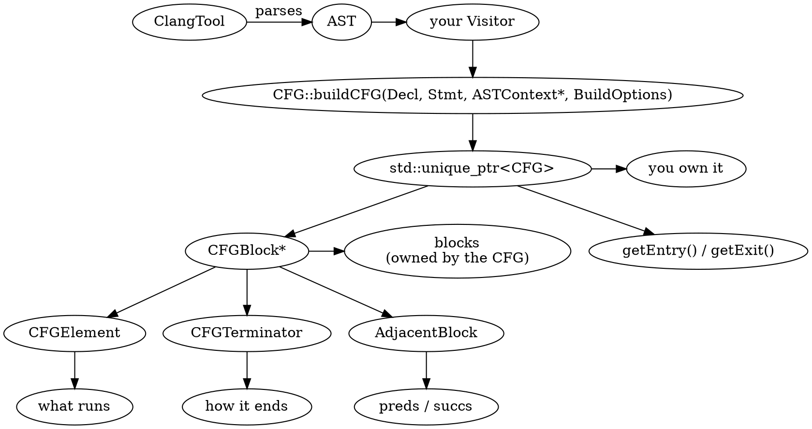

# Part 2 — Building CFGs in C++

[← Part 1 — Reading CFGs on the Command Line](part_1_reading_cfgs_cli.md) | [Part 3 — C++ Semantics in the CFG →](part_3_cxx_semantics.md)

## What You'll Learn

- A complete LibTooling tool for Clang 22 on macOS: `CommonOptionsParser::create`, `ClangTool`, the platform flags (`-resource-dir`, Homebrew libc++, SDK)
- `CFG::buildCFG` — its four arguments, its ownership rules, and building a CFG from something other than a function body
- Every field of `CFG::BuildOptions` (all 19), what it changes, and the option sets that Sema, the Static Analyzer and the FlowSensitive framework really use
- Walking `CFG` → `CFGBlock` → `CFGElement`: iteration order, `getAs<>`/`castAs<>`, all 15 element kinds
- Edges: `succs()`/`preds()`, successor ordering, `AdjacentBlock`, pruned (unreachable) edges, `isLinear()`
- Terminators and conditions: `CFGTerminator` kinds, `getTerminatorStmt`/`getTerminatorCondition`/`getLastCondition`, labels, loop targets, `noreturn` blocks
- Mapping any AST node to its block with `CFGStmtMap` + `ParentMap`, and through `AnalysisDeclContext`
- Exporting a CFG as JSON and Graphviz DOT from your own walker
- Three exercises: cyclomatic complexity, loop counting, a "return inside a loop" finder

## The Big Picture

Part 1 read Clang's own dumps. Now you call the builder yourself:



The same tool structure repeats in every part of this lab, so it lives in a shared header, `tools/common/cfglab.h`. Each tool is a directory `tools/p02_<name>/` with a `main.cpp`; `scripts/build.sh` compiles all of them against Homebrew LLVM 22. Tools use `.cpp` samples in `manifests/` as input.

| Tool (this part) | Section | Does |
|------------------|---------|------|
| `p02_skeleton` | 2.1 | the smallest complete tool; prints each function's block count |
| `p02_options` | 2.2, 2.3 | builds a CFG with any `BuildOptions` you name on the command line |
| `p02_forced`, `p02_observer` | 2.3 | `forcedBlkExprs` and the `CFGCallback` observer |
| `p02_walk` | 2.4 | blocks → elements, every element kind |
| `p02_edges` | 2.5 | successors, predecessors, `AdjacentBlock` |
| `p02_terminators` | 2.6 | terminators, conditions, labels, loop targets |
| `p02_stmtmap` | 2.7 | `CFGStmtMap` + `ParentMap` |
| `p02_export` | 2.8 | JSON and DOT |
| `p02_exercises` | 2.9 | complexity, loops, return-in-loop |

---

## Section 2.1 — A LibTooling skeleton for Clang 22

### Why

Everything after this section is a variation on one skeleton. It has to build on a Mac with Homebrew LLVM and find the standard library at *run time* — an embedded Clang front end knows nothing about where your Mac keeps its headers.

### What to Do

**Build everything** (first run compiles the shared header into each tool; later runs are incremental):

```bash
scripts/build.sh
```

`scripts/build.sh` configures CMake (`tools/CMakeLists.txt`) and runs Ninja. It finds tools by directory name, so adding one never means editing CMake:

```bash
scripts/build.sh --list | grep '^p02_'
```

```text expected
p02_edges
p02_exercises
p02_export
p02_forced
p02_observer
p02_options
p02_skeleton
p02_stmtmap
p02_terminators
p02_walk
```

What it does, step by step, in case you want to run it by hand:

```bash
LLVM=$(brew --prefix llvm)
cmake -G Ninja -S tools -B build \
  -DCMAKE_PREFIX_PATH=$LLVM \
  -DCMAKE_C_COMPILER=$LLVM/bin/clang \
  -DCMAKE_CXX_COMPILER=$LLVM/bin/clang++ \
  -DCMAKE_BUILD_TYPE=RelWithDebInfo
cmake --build build
```

| Detail | Why |
|--------|-----|
| `$LLVM/bin/clang++`, never Apple's | Apple clang has no LibTooling headers and its libc++ ABI differs from the libraries Homebrew's `libclang-cpp` was built with |
| `project(... C CXX)` | LLVM's CMake modules run a C header probe (`FindLibEdit`) |
| `-fno-rtti` | Homebrew's LLVM is built without RTTI; mixing breaks the link (vtable/typeinfo symbols) |
| `target_link_libraries(tool PRIVATE clang-cpp LLVM)` | the two monolithic dylibs, instead of ~60 static `clangFoo` libraries |
| `add_cfg_tool(name src...)` | the helper function in `tools/CMakeLists.txt`; auto-discovery calls it for every `tools/pNN_*/` directory |

You can also skip CMake and compile one file directly — the whole recipe is a handful of flags:

```bash
LLVM=/opt/homebrew/opt/llvm
$LLVM/bin/clang++ -std=c++20 -fno-rtti -stdlib=libc++ \
  -I$LLVM/include -Itools/common \
  -L$LLVM/lib -Wl,-rpath,$LLVM/lib -lclang-cpp -lLLVM \
  tools/p02_skeleton/main.cpp -o out/p02_skeleton_manual && echo built
```

```text expected
built
```

**Sample file:** `manifests/p01_hello.cpp`. Run the first tool:

```bash
build/bin/p02_skeleton manifests/p01_hello.cpp
```

```text expected
sign: 5 blocks, entry=B4 exit=B0
sum: 7 blocks, entry=B6 exit=B0
```

The tool is `tools/p02_skeleton/main.cpp`. It spells out every layer; the core is:

```cpp
class Visitor : public RecursiveASTVisitor<Visitor> {
public:
  explicit Visitor(ASTContext &Ctx) : Ctx(Ctx) {}
  bool VisitFunctionDecl(FunctionDecl *FD) {
    if (!cfglab::isInteresting(FD, Ctx)) return true;   // has a body, not a template, in the main file

    CFG::BuildOptions BO;                                // defaults: everything off but pruning
    std::unique_ptr<CFG> G = CFG::buildCFG(FD, FD->getBody(), &Ctx, BO);
    if (!G) return true;                                 // nullptr == the builder gave up

    llvm::outs() << FD->getQualifiedNameAsString() << ": " << G->size() << " blocks, entry=B"
                 << G->getEntry().getBlockID() << " exit=B" << G->getExit().getBlockID() << "\n";
    return true;
  }
  ASTContext &Ctx;
};
```

| Layer | Class | Job |
|-------|-------|-----|
| 1 | `main()` → `cfglab::runTool<Action>` | `CommonOptionsParser::create` (note: a static factory returning `llvm::Expected`, **not** a constructor), then a `ClangTool` with the platform flags |
| 2 | `Action : ASTFrontendAction` | creates the consumer once per translation unit |
| 3 | `Consumer : ASTConsumer` | `HandleTranslationUnit` is called when the AST is complete |
| 4 | `Visitor : RecursiveASTVisitor` | finds `FunctionDecl`s and builds one CFG each |

`CFG::buildCFG(const Decl *D, Stmt *AST, ASTContext *C, const BuildOptions &BO)`:

| Parameter | Meaning |
|-----------|---------|
| `D` | the declaration the statement belongs to (used for context: parameters, `this`, `noreturn` attributes). It does not have to be a function |
| `AST` | **what gets lowered.** A whole function body, but the header says it "can represent an entire function body, or a single expression" |
| `C` | the `ASTContext` |
| `BO` | the build options (Sections 2.2 and 2.3) |
| returns | `std::unique_ptr<CFG>`; **you own it**, and it owns every `CFGBlock`. Blocks die with the CFG — never keep a `CFGBlock*` past it |

> [!warning] The Internals Manual is stale
> The Clang Internals Manual still shows `CFG::buildCFG(FooBody)` with one argument. The real signature takes four. Treat the installed headers (`/opt/homebrew/opt/llvm/include/clang/Analysis/CFG.h`) as ground truth.

**The default CFG is compact.** Dump `sign`'s CFG with `-dump` and compare with the Static Analyzer's from Part 1:

```bash
build/bin/p02_skeleton manifests/p01_hello.cpp -dump | sed -n 1,25p
```

```text expected
sign: 5 blocks, entry=B4 exit=B0

 [B4 (ENTRY)]
   Succs (1): B3

 [B1]
   1: 1
   2: return [B1.1];
   Preds (1): B3
   Succs (1): B0

 [B2]
   1: -1
   2: return [B2.1];
   Preds (1): B3
   Succs (1): B0

 [B3]
   1: x < 0
   T: if [B3.1]
   Preds (1): B4
   Succs (2): B2 B1

 [B0 (EXIT)]
   Preds (2): B1 B2
```

Block `B3` is `1: x < 0` plus `T: if [B3.1]` — one element for the whole comparison. The Static Analyzer's dump of the same function listed `x`, the cast, `0` and `<` as four elements. The difference is not the language and not the function: it is `BuildOptions`. By default the builder folds sub-expressions into the statement that consumes them; the analyzer asked for them to be listed separately (Section 2.2, `setAlwaysAdd`).

**A CFG from a bare expression.** `-conditions` builds a CFG for each `if` condition *alone*, by passing the `Expr` instead of the body:

```bash
build/bin/p02_skeleton manifests/p01_basic.cpp -conditions
```

```text expected
f: 13 blocks, entry=B12 exit=B0
  condition `a > 0 && b > 0` (line 13): 5 blocks
  condition `i == 3` (line 19): 3 blocks
```

`a > 0 && b > 0` has 5 blocks (entry, `a > 0`, `b > 0`, join, exit): the short-circuit `&&` is control flow even when there is no `if` around it.

**The platform flags.** Compare the same file with and without the flags `cfglab.h` adds. `manifests/p02_includes.cpp` uses `<cmath>`, `<optional>` and `<string>`:

```bash
CFGLAB_RAW=1 build/bin/p02_skeleton manifests/p02_includes.cpp 2>&1 | head -4
```

```text expected
manifests/p02_includes.cpp:3:10: fatal error: 'cmath' file not found
    3 | #include <cmath>
      |          ^~~~~~~
1 error generated.
```

```bash
build/bin/p02_skeleton manifests/p02_includes.cpp
```

```text expected
length_or_zero: 5 blocks, entry=B4 exit=B0
```

What `cfglab::addPlatformFlags` appends to every compile command (`scripts/flags.sh` prints the same set for `clang-query` or a plain `clang` invocation):

```bash
scripts/flags.sh | sed -E 's|/opt/homebrew/(opt\|Cellar)/llvm(/[0-9.]+)?|$LLVM|g; s|-isysroot .*|-isysroot <macOS SDK>|'
```

```text expected
-resource-dir $LLVM/lib/clang/22 -nostdinc++ -isystem $LLVM/include/c++/v1 -isysroot <macOS SDK>
```

| Flag | Why it is needed |
|------|------------------|
| `-resource-dir $LLVM/lib/clang/22` | the builtin headers (`stddef.h`, `stdarg.h`, intrinsics). A tool binary lives in `build/bin/`, so Clang's default guess ("two directories up from my executable") is wrong |
| `-nostdinc++ -isystem $LLVM/include/c++/v1` | use Homebrew's libc++ headers. Without `-nostdinc++` the SDK's copy is also on the include path and the two mix; `<cmath>` then fails with `memcpy` / `FP_NAN` errors |
| `-isysroot <SDK>` | the C library headers, from `xcrun --show-sdk-path` |

`CommonOptionsParser` also accepts `-p <build-dir>` (use a `compile_commands.json`) and `--extra-arg=<flag>`. If you pass no `--`, `cfglab.h` supplies `-std=c++17` (or `-std=c11` for `.c`). To choose a standard yourself, put it after `--`:

```bash
build/bin/p02_skeleton manifests/p01_hello.cpp -- -std=c++20
```

```text expected
sign: 5 blocks, entry=B4 exit=B0
sum: 7 blocks, entry=B6 exit=B0
```

`scripts/run.sh` is a thin wrapper: it builds the tool if missing and accepts a bare manifest name.

```bash
scripts/run.sh p02_skeleton p01_hello.cpp
```

```text expected
sign: 5 blocks, entry=B4 exit=B0
sum: 7 blocks, entry=B6 exit=B0
```

### Verify

The skeleton agrees with the analyzer about block counts. Count blocks in `p01_basic.cpp`'s function `f` both ways:

```bash
echo "tool:     $(build/bin/p02_skeleton manifests/p01_basic.cpp | grep '^f:' | cut -d, -f1)"
echo "analyzer: f: $(FN=f scripts/dumpcfg.sh manifests/p01_basic.cpp | grep -c '^ \[B') blocks"
```

### Expected

```text expected
tool:     f: 13 blocks
analyzer: f: 13 blocks
```

> [!hint]- Quiz: why does `buildCFG` take both `FD` and `FD->getBody()`?
> You could build a CFG for just one `Stmt` inside the function. What does `D` give the builder that the `Stmt` alone cannot?

> [!success]- Answer
> Context. A statement is a tree; it does not know which function it is in. The builder uses the declaration to resolve things like "is this call `noreturn`", the function's parameters for `Lifetime ends`, and `this` for member access. In the `-conditions` experiment `D` is still `FD` while the `Stmt` is just the condition.

---

## Section 2.2 — `BuildOptions` I: what the CFG records

### Why

`CFG::BuildOptions` decides what the graph *contains*. The same small function (`dtors` below) has 7 elements with the defaults and 27 with every switch on. Before you copy someone's options (or write your own), you need to know what each field buys you and what it costs.

### What to Do

`CFG::BuildOptions` (22.1.8) has 17 `bool`s and two pointers (`Observer`, `forcedBlkExprs`) — **19 public data members** — plus a private per-statement-class mask that `setAlwaysAdd`/`setAllAlwaysAdd` write. Only `PruneTriviallyFalseEdges` is on by default. `p02_options` sets any of them from the command line:

```bash
build/bin/p02_options manifests/p02_options.cpp --func=dtors --fields
```

```text expected
== dtors (preset default)
  [x] PruneTriviallyFalseEdges
  [ ] AddEHEdges
  [ ] AddInitializers
  [ ] AddImplicitDtors
  [ ] AddLifetime
  [ ] AddLoopExit
  [ ] AddTemporaryDtors
  [ ] AddScopes
  [ ] AddStaticInitBranches
  [ ] AddCXXNewAllocator
  [ ] AddCXXDefaultInitExprInCtors
  [ ] AddCXXDefaultInitExprInAggregates
  [ ] AddRichCXXConstructors
  [ ] MarkElidedCXXConstructors
  [ ] AddVirtualBaseBranches
  [ ] OmitImplicitValueInitializers
  [ ] AssumeReachableDefaultInSwitchStatements
  alwaysAdd (of the classes present here): none
```

Flags: `--preset=NAME`, `--set=Field,Field` (repeatable), `--clear=Field,...`, `--always-add=Class,...|all`, `--func=NAME`, `--summary`. The helper `scripts/optdiff.sh <file> <function> <Field>` runs the tool twice — with and without the field — and prints only what changed. This section covers the fields that add **elements**; Section 2.3 covers the fields that change the **shape** of the graph.

**Sample file:** `manifests/p02_options.cpp` — one function per field.

#### `AddInitializers` and `AddCXXDefaultInitExprInCtors`

Constructors run initialisers before the body: base classes, then members, in declaration order. Without `AddInitializers` the CFG contains only the body.

```cpp
struct A : Base { int a = 5; T t; A(); };
A::A() {}
```

```bash
scripts/optdiff.sh manifests/p02_options.cpp A::A AddInitializers
```

```text expected
--- without
+++ +AddInitializers
-== A::A: blocks=2 elements=0 linear=1
+== A::A: blocks=3 elements=5 linear=1
+   Initializer          3
+   Statement            2
```

Three `CFGInitializer` elements (base `Base`, member `a`, member `t`) and the expressions that compute them. `a` has a default member initialiser `= 5`; the *expression* `5` is only added with `AddCXXDefaultInitExprInCtors`:

```bash
MODE=dump scripts/optdiff.sh manifests/p02_options.cpp A::A AddCXXDefaultInitExprInCtors \
  --set=AddInitializers --always-add=all
```

```text expected
--- without
+++ +AddCXXDefaultInitExprInCtors
-   3:
-   4: a([B1.3]) (Member initializer)
-   5:  (CXXConstructExpr, T)
-   6: t([B1.5]) (Member initializer)
+   3: 5
+   4:
+   5: a([B1.4]) (Member initializer)
+   6:  (CXXConstructExpr, T)
+   7: t([B1.6]) (Member initializer)
```

`MODE=dump` diffs the full text instead of the summary, and `--always-add=all` makes every sub-expression visible (see the end of this section).

#### `AddImplicitDtors` and `AddTemporaryDtors`

```bash
scripts/optdiff.sh manifests/p02_options.cpp dtors AddImplicitDtors
scripts/optdiff.sh manifests/p02_options.cpp temps AddTemporaryDtors
```

```text expected
--- without
+++ +AddImplicitDtors
-== dtors: blocks=5 elements=7 linear=0
+== dtors: blocks=5 elements=9 linear=0
+   AutomaticObjectDtor  2
--- without
+++ +AddTemporaryDtors
-== temps: blocks=7 elements=8 linear=0
+== temps: blocks=7 elements=9 linear=0
+   TemporaryDtor        1
```

`AddImplicitDtors` adds `CFGAutomaticObjDtor` (a local going out of scope — one per path out of the scope), `CFGBaseDtor` and `CFGMemberDtor` (inside destructors). `CFGDeleteDtor` (`delete p` of a class) is *not* gated by it: on 22.1.8 it appears under the default options too (`p02_options manifests/p03_dtors.cpp --func=delete_dtor --summary` lists one `DeleteDtor` with every field off; Section 3.1 shows it). `AddTemporaryDtors` adds `CFGTemporaryDtor` for temporaries — `mk()` in `mk().ok() && n` — *and* the conditional branches around destructors of temporaries that exist only on one side of `&&`/`||`/`?:` (Section 2.6 shows that branch).

#### `AddLifetime`, `AddScopes`, `AddLoopExit`

```bash
for o in AddLifetime AddScopes AddLoopExit; do scripts/optdiff.sh manifests/p02_options.cpp scopes $o; done
```

```text expected
--- without
+++ +AddLifetime
-== scopes: blocks=7 elements=7 linear=0
+== scopes: blocks=7 elements=10 linear=0
+   LifetimeEnds         3
--- without
+++ +AddScopes
-== scopes: blocks=7 elements=7 linear=0
+== scopes: blocks=7 elements=12 linear=0
+   ScopeBegin           2
+   ScopeEnd             3
--- without
+++ +AddLoopExit
-== scopes: blocks=7 elements=7 linear=0
+== scopes: blocks=7 elements=8 linear=0
+   LoopExit             1
```

| Field | Element | Count in `scopes` |
|-------|---------|-------------------|
| `AddLifetime` | `CFGLifetimeEnds` | three: `sq` (each iteration), `total`, and the parameter `n` |
| `AddScopes` | `CFGScopeBegin`, `CFGScopeEnd` | two begins, three ends (the scope of `n` has no begin: a parameter's scope starts before the body) |
| `AddLoopExit` | `CFGLoopExit` | one, where the `while` is left |

#### `AddStaticInitBranches` and `AddCXXNewAllocator`

```bash
scripts/optdiff.sh manifests/p02_options.cpp heap_static AddStaticInitBranches
scripts/optdiff.sh manifests/p02_options.cpp heap_static AddCXXNewAllocator
```

```text expected
--- without
+++ +AddStaticInitBranches
-== heap_static: blocks=3 elements=7 linear=1
+== heap_static: blocks=5 elements=7 linear=0
--- without
+++ +AddCXXNewAllocator
-== heap_static: blocks=3 elements=7 linear=1
+== heap_static: blocks=3 elements=8 linear=1
+   NewAllocator         1
```

`AddStaticInitBranches` is the only field in this section that changes the **block structure**: it adds two blocks (and makes the CFG non-linear) for the `if (!initialised) initialise;` that guards a function-local `static`. `AddCXXNewAllocator` adds one `CFGNewAllocator` element for the allocation call that precedes the constructor of a `new` expression.

#### `AddCXXDefaultInitExprInAggregates` and `OmitImplicitValueInitializers`

```cpp
struct Agg { int x = 1; int y; };
int aggregate() { Agg g{}; return g.x + g.y; }
```

```bash
MODE=dump scripts/optdiff.sh manifests/p02_options.cpp aggregate AddCXXDefaultInitExprInAggregates --always-add=all | head -8
MODE=dump scripts/optdiff.sh manifests/p02_options.cpp aggregate OmitImplicitValueInitializers --always-add=all | head -6
```

```text expected
--- without
+++ +AddCXXDefaultInitExprInAggregates
-   1:
-   2: /*implicit*/(int)0
-   3: {}
-   4: Agg g{};
-   5: g
-   6: [B1.5].x
--- without
+++ +OmitImplicitValueInitializers
-   2: /*implicit*/(int)0
-   3: {}
-   4: Agg g{};
-   5: g
```

`Agg g{}` initialises `x` from its default member initialiser (`= 1`) and `y` by value-initialisation (`(int)0`). The first field makes the `1` an element; the second *removes* the implicit `/*implicit*/(int)0` elements. Neither changes any edge.

#### `AddRichCXXConstructors` and `MarkElidedCXXConstructors`

```cpp
T elide() { T t = mk(); return t.v; }
```

```bash
MODE=dump scripts/optdiff.sh manifests/p02_options.cpp elide AddRichCXXConstructors --always-add=all
```

```text expected
--- without
+++ +AddRichCXXConstructors
-   3: [B1.2]()
+   3: [B1.2]() (CXXRecordTypedCall, [B1.5], [B1.4])
```

A `CFGCXXRecordTypedCall` (a call returning a class by value) now carries a **`ConstructionContext`**: the trailing references `[B1.5], [B1.4]` say "the result object is the variable declared by element 5 (`T t = mk();`), and element 4 is the `BindTemporary`" — under C++17's guaranteed copy elision the call constructs its result directly *in* `t`. The Static Analyzer needs that to know *where* the returned object lives. `MarkElidedCXXConstructors` matters for pre-C++17 code, where `T t = mk()` is a call followed by an *elidable* copy constructor (element 7 below): the option appends that constructor to the call's context, so the chain reads "call result → temporary → materialisation → the copy that will be skipped".

```bash
MODE=dump scripts/optdiff.sh manifests/p02_options.cpp elide MarkElidedCXXConstructors \
  --set=AddRichCXXConstructors --always-add=all -- -std=c++14
MODE=dump scripts/optdiff.sh manifests/p02_options.cpp elide MarkElidedCXXConstructors \
  --set=AddRichCXXConstructors --always-add=all -- -std=c++17
```

```text expected
--- without
+++ +MarkElidedCXXConstructors
-   3: [B1.2]() (CXXRecordTypedCall, [B1.4], [B1.6])
+   3: [B1.2]() (CXXRecordTypedCall, [B1.4], [B1.6], [B1.7])
no change
```

Under `-std=c++17` guaranteed copy elision means there is no copy constructor to mark, and the option changes nothing.

#### Compact versus linearized: `setAlwaysAdd` and `setAllAlwaysAdd`

This is the biggest switch of all, and it is not a `bool`. By default the builder adds a statement to a block only if it is a *block-level* statement; sub-expressions such as `x` in `x < 0` are folded into their parent. `setAlwaysAdd(Stmt::StmtClass)` forces one class to appear as its own element; `setAllAlwaysAdd()` forces them all — a **linearized** CFG, which is what `debug.DumpCFG`, the FlowSensitive framework, and Sema's unreachable-code and thread-safety analyses use.

```bash
for flag in "" "--always-add=DeclRefExpr" "--always-add=DeclRefExpr,ImplicitCastExpr,IntegerLiteral" "--always-add=all"; do
  printf '%-70s' "${flag:-(default)}"
  build/bin/p02_options manifests/p01_hello.cpp --func=sign --summary $flag | head -1
done
```

```text expected
(default)                                                             == sign: blocks=5 elements=5 linear=0
--always-add=DeclRefExpr                                              == sign: blocks=5 elements=6 linear=0
--always-add=DeclRefExpr,ImplicitCastExpr,IntegerLiteral              == sign: blocks=5 elements=9 linear=0
--always-add=all                                                      == sign: blocks=5 elements=9 linear=0
```

Which classes are on is not queryable as a list — `alwaysAdd(const Stmt*)` is a per-statement test — so `p02_options --fields` probes the classes that occur in the function:

```bash
build/bin/p02_options manifests/p01_hello.cpp --func=sign --always-add=DeclRefExpr,IntegerLiteral --fields | tail -1
```

```text expected
  alwaysAdd (of the classes present here): DeclRefExpr IntegerLiteral
```

> [!note]
> Even with `setAllAlwaysAdd()` the CFG never contains `ParenExpr` or `ExprWithCleanups` as elements — "the CFG takes the operator precedence into account, but otherwise omits the node".

### Verify

How many of the 17 fields are on by default, and how many in each preset?

```bash
for p in default sema adorned analyzer kitchen; do
  printf '%-9s %s on\n' $p "$(build/bin/p02_options manifests/p01_hello.cpp --func=sign --preset=$p --fields | grep -c '\[x\]')"
done
```

### Expected

```text expected
default   1 on
sema      5 on
adorned   6 on
analyzer  9 on
kitchen   16 on
```

Only `PruneTriviallyFalseEdges` by default; `kitchen` turns on 16 — every field except `OmitImplicitValueInitializers`, the one option that *removes* elements. The presets are in Section 2.3.

> [!hint]- Quiz: you want to know *which* temporaries are destroyed at the end of a statement. Which two fields do you need?
> One adds the destructor element, one adds the branching that makes it conditional, and both are the same field. Which?

> [!success]- Answer
> `AddTemporaryDtors` alone: it adds `CFGTemporaryDtor` elements *and* the `TemporaryDtorsBranch` terminators. You will usually also want `AddImplicitDtors` for the locals, but temporaries and locals are separate switches.

---

## Section 2.3 — `BuildOptions` II: shape, hooks and presets

### Why

Four fields change which *edges* (and branch blocks) exist — and so what a reachability analysis concludes. (`AddStaticInitBranches` from Section 2.2 is a fifth.) Two more are hooks into the builder. And once you know all 19, you can read the three option sets Clang's own consumers use and reproduce `debug.DumpCFG` exactly.

### What to Do

`p02_edges` (details in Section 2.5) prints each block's successors; `(unreach Bn)` marks a pruned edge.

#### `PruneTriviallyFalseEdges` (the one default-on field)

When the builder can evaluate a condition at compile time (`if (0)`, `while (1)`), it marks the impossible edge *unreachable* instead of leaving it as an ordinary edge. Source: `if (0) n = 1; return n;`

```bash
build/bin/p02_edges manifests/p02_options.cpp --func=pruned_if
build/bin/p02_edges manifests/p02_options.cpp --func=pruned_if --clear=PruneTriviallyFalseEdges
```

```text expected
== pruned_if: blocks=5 isLinear=1 edges=4 (+1 pruned)
B0   T=-              succs:   preds: B1
B1   T=-              succs: B0   preds: B2 B3
B2   T=-              succs: B1   preds: (unreach B3)
B3   T=IfStmt         succs: (unreach B2) B1   preds: B4
B4   T=-              succs: B3   preds:
== pruned_if: blocks=5 isLinear=0 edges=5 (+0 pruned)
B0   T=-              succs:   preds: B1
B1   T=-              succs: B0   preds: B2 B3
B2   T=-              succs: B1   preds: B3
B3   T=IfStmt         succs: B2 B1   preds: B4
B4   T=-              succs: B3   preds:
```

With pruning (first output): `B3`'s then-edge is `(unreach B2)`, `isLinear=1`, and `B2` (`n = 1`) lists `(unreach B3)` as its predecessor. Without pruning, the same edge is ordinary and the CFG is not linear. Sema leaves pruning on so that `-Wunreachable-code` sees dead code as dead.

For `while (1)` the exit edge is pruned **and has no recorded target at all**:

```bash
build/bin/p02_edges manifests/p02_options.cpp --func=pruned_while | grep WhileStmt
```

```text expected
B6   T=WhileStmt      succs: B5 null   preds: B2 B7
```

#### `AddEHEdges`

Without it, a `try` block's dispatch node has no predecessors — nothing points at it — so the handler looks dead:

```bash
build/bin/p02_edges manifests/p02_options.cpp --func=eh | grep -E 'CXXTryStmt|^B5'
build/bin/p02_edges manifests/p02_options.cpp --func=eh --set=AddEHEdges | grep -E 'CXXTryStmt|^B5'
```

```text expected
B2   T=CXXTryStmt     succs: B3   preds:
B5   T=-              succs: B4   preds:
B2   T=CXXTryStmt     succs: B3   preds: B5
B5   T=-              succs: B4 B2   preds: B6
```

With `AddEHEdges` the block that contains the call `may_throw(n)` gets a second successor, the try dispatch `B2`, and `B2` finally has a predecessor. Sema deliberately turns this off "to avoid the n² explosion for destructors": every call inside a scope with destructors would otherwise need an edge to each cleanup.

#### `AssumeReachableDefaultInSwitchStatements`

A `switch` over an enum that covers every enumerator has an implicit "no case matched" edge that can never happen. The builder prunes it; this option keeps it:

```bash
build/bin/p02_edges manifests/p02_options.cpp --func=covered | grep SwitchStmt
build/bin/p02_edges manifests/p02_options.cpp --func=covered --set=AssumeReachableDefaultInSwitchStatements | grep SwitchStmt
```

```text expected
B2   T=SwitchStmt     succs: B3 B4 (unreach B1)   preds: B5
B2   T=SwitchStmt     succs: B3 B4 B1   preds: B5
```

An out-of-range cast (`(Color)7`) *can* reach that edge in real programs, so a safety-oriented analysis wants it.

#### `AddVirtualBaseBranches`

A class with a virtual base has its virtual base initialised by the **most derived** class only. When `VB`'s constructor runs as a base of something else, it must skip that initialisation. With this option the CFG contains the branch:

```bash
scripts/optdiff.sh manifests/p02_options.cpp VB::VB AddVirtualBaseBranches
```

```text expected
--- without
+++ +AddVirtualBaseBranches
-== VB::VB: blocks=2 elements=0 linear=1
+== VB::VB: blocks=4 elements=0 linear=0
```

The branch's terminator is not a statement at all — it is `CFGTerminator::VirtualBaseBranch`; Section 2.6 shows it.

#### `Observer` — the `CFGCallback` hook

`BuildOptions::Observer` is a `CFGCallback*`. The builder calls it *while building*, whenever it evaluates a condition and finds it is a tautology. Sema's `LogicalErrorHandler` is the real client (`-Wtautological-overlap-compare` and friends). Four virtual methods: `logicAlwaysTrue`, `compareAlwaysTrue`, `compareBitwiseEquality`, `compareBitwiseOr`.

```cpp
class Printer : public CFGCallback {
  void logicAlwaysTrue(const BinaryOperator *B, bool IsAlwaysTrue) override { /* ... */ }
  // ...
};
Printer P;
CFG::BuildOptions BO;
BO.Observer = &P;                       // callbacks fire during buildCFG, not afterwards
CFG::buildCFG(FD, FD->getBody(), &Ctx, BO);
```

```bash
build/bin/p02_observer manifests/p02_observer.cpp 2>/dev/null
```

```text expected
== logic_true
  logicAlwaysTrue         line 6  `!x || x`  always true
== logic_false
  logicAlwaysTrue         line 13  `!x && x`  always false
== pair_true
  compareAlwaysTrue       line 20  `x != 1 || x != 2`  always true
== bitwise_eq
  compareBitwiseEquality  line 27  `(x & 4) == 3`  always false
== bitwise_or
  compareBitwiseOr        line 34  `x | 4`
== clean
```

These callbacks are not a lab invention. Sema installs the same kind of observer and turns each call into a warning; the same file through plain `clang++ -Wall` reports the very same five lines (6, 13, 20, 27 and 34):

```bash
/opt/homebrew/opt/llvm/bin/clang++ -fsyntax-only -std=c++17 -Wall manifests/p02_observer.cpp 2>&1 | grep -o 'p02_observer.cpp:[0-9]*:[0-9]*: warning.*'
```

```text expected
p02_observer.cpp:6:10: warning: '||' of a value and its negation always evaluates to true [-Wtautological-negation-compare]
p02_observer.cpp:13:10: warning: '&&' of a value and its negation always evaluates to false [-Wtautological-negation-compare]
p02_observer.cpp:20:14: warning: overlapping comparisons always evaluate to true [-Wtautological-overlap-compare]
p02_observer.cpp:27:15: warning: bitwise comparison always evaluates to false [-Wtautological-bitwise-compare]
p02_observer.cpp:34:9: warning: bitwise or with non-zero value always evaluates to true [-Wtautological-bitwise-compare]
```

| Hook | Fires for | Seen above in |
|------|-----------|---------------|
| `logicAlwaysTrue` | a negated operand paired with itself: `!x \|\| x` (always true), `!x && x` (always false) | `logic_true`, `logic_false` |
| `compareAlwaysTrue` | comparisons of one variable against constants that cover every value: `x != 1 \|\| x != 2` | `pair_true` |
| `compareBitwiseEquality` | `(x & 4) == 3` — the mask can never produce 3 | `bitwise_eq` |
| `compareBitwiseOr` | a bitwise `\|` with a non-zero constant used as a condition: `if (x \| 4)` is always true | `bitwise_or` |

#### `forcedBlkExprs` — "put this expression in a block, and tell me which"

`forcedBlkExprs` is a `ForcedBlkExprs **` (pointer to a pointer to a `DenseMap<const Stmt*, const CFGBlock*>`). You allocate the map, register the statements you care about as keys, build, and read the blocks back from the values:

```cpp
CFG::BuildOptions::ForcedBlkExprs *Forced = new CFG::BuildOptions::ForcedBlkExprs();
for (const Stmt *S : Interesting) (*Forced)[S];     // register
BO.forcedBlkExprs = &Forced;                        // note: address of the pointer
auto G = CFG::buildCFG(FD, FD->getBody(), &Ctx, BO);
const CFGBlock *B = (*Forced)[S];                   // the block S ended up in
delete Forced;                                      // you own the map
```

```bash
build/bin/p02_forced manifests/p01_hello.cpp --func=sum
```

```text expected
== sum: DeclRefExpr nodes=6  elements default=7 forced=13
  line 13  `i` -> B4
  line 13  `n` -> B4
  line 13  `i` -> B2
  line 14  `total` -> B3
  line 14  `i` -> B3
  line 15  `total` -> B1
```

Registered `DeclRefExpr`s became elements (element count 7 → 13) and the map tells you each one's block. This is the mechanism behind `AnalysisDeclContext::registerForcedBlockExpression` (Part 4).

#### The presets

Clang's consumers do not use the defaults. `tools/common/cfglab.h` reproduces three of their option sets as functions (`semaPreset()`, `adornedPreset()`, `analyzerPreset()`) plus `kitchenSinkPreset()`:

| Preset | Real source | Fields on besides pruning |
|--------|-------------|---------------------------|
| `sema` | `AnalysisBasedWarnings.cpp` | `AddInitializers`, `AddImplicitDtors`, `AddTemporaryDtors`, `AddCXXDefaultInitExprInCtors`, `setAllAlwaysAdd()` |
| `adorned` | `AdornedCFG::build` (FlowSensitive) | the `sema` set plus `AddLifetime` |
| `analyzer` | `AnalysisManager` + the `cfg-*` defaults | `AddInitializers`, `AddImplicitDtors`, `AddTemporaryDtors`, `AddRichCXXConstructors`, `MarkElidedCXXConstructors`, `AddStaticInitBranches`, `AddCXXNewAllocator`, `AddVirtualBaseBranches`, `setAllAlwaysAdd()` |
| `kitchen` | (this lab) | everything that adds information: 16 of 17 fields (not `OmitImplicitValueInitializers`) + `setAllAlwaysAdd()` |

The effect on one function with a local, a temporary and a loop:

```bash
for p in default sema adorned analyzer kitchen; do
  printf '%-9s' $p; build/bin/p02_options manifests/p01_cxx.cpp --func=temporaries --preset=$p --summary | head -1
done
```

```text expected
default  == temporaries: blocks=7 elements=8 linear=0
sema     == temporaries: blocks=7 elements=17 linear=0
adorned  == temporaries: blocks=7 elements=19 linear=0
analyzer == temporaries: blocks=7 elements=17 linear=0
kitchen  == temporaries: blocks=9 elements=21 linear=0
```

> [!note] Sema's EH choice
> Sema's set leaves `AddEHEdges` off and `AddCXXNewAllocator` off. The real `AnalysisBasedWarnings` also turns on `AddLifetime` for the experimental lifetime-safety analysis, and chooses `setAllAlwaysAdd()` only when it runs an analysis that needs a linearized CFG (unreachable code, thread safety, consumed, lifetime safety); otherwise it forces just seven classes (`BinaryOperator`, `CompoundAssignOperator`, `BlockExpr`, `CStyleCastExpr`, `DeclRefExpr`, `ImplicitCastExpr`, `UnaryOperator`). `semaPreset()` is the linearized variant.

**The bridge back to Part 1.** `debug.DumpCFG` is just `CFG::print` on a CFG built with the analyzer's options. Prove it: the `analyzer` preset prints exactly what the checker prints, for every function, ignoring only the header line that names the function:

```bash
for f in p01_hello p01_basic p01_branches p01_cxx; do
  scripts/dumpcfg.sh manifests/$f.cpp 2>&1 | grep -v '^[^ \[(]' | grep -v '^$' > out/a.txt
  build/bin/p02_options manifests/$f.cpp --preset=analyzer 2>&1 | grep -v '^[^ \[(]' | grep -v '^$' > out/b.txt
  printf '%-14s %s differing lines\n' $f "$(diff out/a.txt out/b.txt | wc -l | tr -d ' ')"
done
```

```text expected
p01_hello      0 differing lines
p01_basic      0 differing lines
p01_branches   0 differing lines
p01_cxx        0 differing lines
```

And the three `cfg-*` switches that default to false are plain fields:

```bash
diff <(scripts/dumpcfg.sh manifests/p01_cxx.cpp -Xclang -analyzer-config -Xclang cfg-lifetime=true \
         -Xclang -analyzer-config -Xclang cfg-scopes=true -Xclang -analyzer-config -Xclang cfg-loopexit=true 2>&1 \
       | grep -v '^[^ \[(]' | grep -v '^$') \
     <(build/bin/p02_options manifests/p01_cxx.cpp --preset=analyzer --set=AddLifetime,AddScopes,AddLoopExit 2>&1 \
       | grep -v '^[^ \[(]' | grep -v '^$') && echo identical
```

```text expected
identical
```

| `-analyzer-config` | `CFG::BuildOptions` field |
|--------------------|---------------------------|
| `cfg-implicit-dtors` | `AddImplicitDtors` |
| `cfg-temporary-dtors` | `AddTemporaryDtors` |
| `cfg-rich-constructors` | `AddRichCXXConstructors` |
| `cfg-conditional-static-initializers` | `AddStaticInitBranches` |
| `cfg-lifetime` | `AddLifetime` |
| `cfg-scopes` | `AddScopes` |
| `cfg-loopexit` | `AddLoopExit` |
| `cfg-expand-default-aggr-inits` | `AddCXXDefaultInitExprInAggregates` |

### Verify

The full field list is the contract. Check you can name all 19 public data members: 17 flags from `--fields`, plus the two pointers, which you set in code:

```bash
echo "bool fields: $(build/bin/p02_options manifests/p01_hello.cpp --func=sign --fields | grep -c '^  \[')"
grep -c -E 'ForcedBlkExprs \*\*forcedBlkExprs|CFGCallback \*Observer' /opt/homebrew/opt/llvm/include/clang/Analysis/CFG.h
```

### Expected

```text expected
bool fields: 17
2
```

> [!hint]- Quiz: the analyzer preset equals `debug.DumpCFG`, but the `sema` preset does not. Name one visible difference in the dump of `p01_cxx.cpp:heap_static`.
> Look at Section 2.2's `AddStaticInitBranches` and `AddCXXNewAllocator`.

> [!success]- Answer
> Sema leaves `AddCXXNewAllocator` and `AddStaticInitBranches` off, so its CFG has no `CFGNewAllocator` element and no branch around the static initialiser: fewer blocks, fewer elements. That is also why "nothing is wrong" in a warning does not mean the analyzer sees the same graph.

---

## Section 2.4 — Walking blocks and elements

### Why

A CFG is a container of blocks; a block is a container of elements; an element is a tagged union. Knowing the iteration order and the cast API is what separates a ten-line walker from a crash.

### What to Do

`p02_walk` iterates every block and prints one line per element. Take a small function first:

```bash
build/bin/p02_walk manifests/p01_hello.cpp --func=sign
```

```text expected
== sign: 5 blocks
B0  elements=0  (EXIT)
B1  elements=2
  [ 0] Statement            IntegerLiteral     1
  [ 1] Statement            ReturnStmt         return 1
B2  elements=2
  [ 0] Statement            UnaryOperator      -1
  [ 1] Statement            ReturnStmt         return -1
B3  elements=1
  [ 0] Statement            BinaryOperator     x < 0
B4  elements=0  (ENTRY)
```

The loop that produced it:

```cpp
for (const CFGBlock *B : *G) {                      // blocks: creation order = Exit first, Entry last
  for (const CFGElement &E : *B) {                  // elements: execution order
    E.getKind();                                    // CFGElement::Kind
    if (auto S = E.getAs<CFGStmt>()) S->getStmt();  // std::optional<CFGStmt>
  }
}
```

| Fact | Detail |
|------|--------|
| `CFG` iteration | `begin()`/`end()` over `CFGBlock*`, also `rbegin()`/`rend()`, `nodes()`, `const_nodes()`, `reverse_nodes()`. It is `BumpVector<CFGBlock*>` — iterate with `for (const CFGBlock *B : *G)`, note the `*` |
| Block order | creation order. Exit (`B0`) first, Entry last. **Not** program order, **not** a topological order — use `PostOrderCFGView` (Part 4) for that |
| `size()` | `CFG::size()` is the number of block IDs (same as `getNumBlockIDs()`) |
| `CFGBlock` iteration | `begin()`/`end()` yield elements in **execution order**, `rbegin()`/`rend()` in reverse. (Internally the vector is stored backwards, and `ElementList` hides that) |
| Element access | `B->size()`, `B->empty()`, `B->front()`, `B->back()`, `(*B)[i]` — all return `CFGElement` **by value** |
| `getAs<T>()` | returns `std::optional<T>`: empty if the element is not a `T` |
| `castAs<T>()` | asserts; use after you have switched on `getKind()` |

**Every element kind.** `CFGElement::Kind` has 15 values. `manifests/p02_walk.cpp` is built to produce all of them with the `kitchen` preset (the walk below uses `--by-kind` to show totals):

```bash
build/bin/p02_walk manifests/p02_walk.cpp --preset=kitchen --by-kind
```

```text expected
== D::D: 3 blocks
  Constructor          2
  Initializer          2
== D::~D: 3 blocks
  BaseDtor             1
  MemberDtor           1
== showcase: 10 blocks
  AutomaticObjectDtor  1
  CXXRecordTypedCall   1
  CleanupFunction      1
  Constructor          1
  DeleteDtor           1
  LifetimeEnds         6
  LoopExit             1
  NewAllocator         1
  ScopeBegin           3
  ScopeEnd             4
  Statement            36
  TemporaryDtor        1
```

| Kind | Class | What you get | Needs |
|------|-------|--------------|-------|
| `Statement` | `CFGStmt` | `getStmt()` | always |
| `Constructor` | `CFGConstructor : CFGStmt` | `getConstructionContext()` | `AddRichCXXConstructors` |
| `CXXRecordTypedCall` | `CFGCXXRecordTypedCall : CFGStmt` | `getConstructionContext()` | `AddRichCXXConstructors` |
| `Initializer` | `CFGInitializer` | `getInitializer()` → `CXXCtorInitializer*` | `AddInitializers` |
| `NewAllocator` | `CFGNewAllocator` | `getAllocatorExpr()` | `AddCXXNewAllocator` |
| `LoopExit` | `CFGLoopExit` | `getLoopStmt()` | `AddLoopExit` |
| `LifetimeEnds` | `CFGLifetimeEnds` | `getVarDecl()`, `getTriggerStmt()` | `AddLifetime` |
| `ScopeBegin` / `ScopeEnd` | `CFGScopeBegin` / `CFGScopeEnd` | `getVarDecl()`, `getTriggerStmt()` | `AddScopes` |
| `AutomaticObjectDtor` | `CFGAutomaticObjDtor` | `getVarDecl()`, `getTriggerStmt()` | `AddImplicitDtors` |
| `DeleteDtor` | `CFGDeleteDtor` | `getCXXRecordDecl()`, `getDeleteExpr()` | always (not gated by `AddImplicitDtors`, 22.1.8) |
| `BaseDtor` | `CFGBaseDtor` | `getBaseSpecifier()` | `AddImplicitDtors` |
| `MemberDtor` | `CFGMemberDtor` | `getFieldDecl()` | `AddImplicitDtors` |
| `TemporaryDtor` | `CFGTemporaryDtor` | `getBindTemporaryExpr()` | `AddTemporaryDtors` |
| `CleanupFunction` | `CFGCleanupFunction` | `getVarDecl()`, `getFunctionDecl()` | `__attribute__((cleanup))` + `AddImplicitDtors`-class options |

All destructor classes derive from `CFGImplicitDtor`, which adds `getDestructorDecl(ASTContext&)` and `isNoReturn(ASTContext&)`.

> [!warning] Two 22.1.8 quirks of `CFGImplicitDtor`
> `isNoReturn(ASTContext&)` is declared but not exported by `libclang-cpp`, so calling it is a link error; use `getDestructorDecl(Ctx)->isNoReturn()`. And `getDestructorDecl()` returns null for a `CFGBaseDtor`. Section 3.1 has the details and the workaround.

> [!warning] `getAs<CFGStmt>()` matches three kinds
> `Constructor` and `CXXRecordTypedCall` *are* `CFGStmt`s, and `getAs<CFGStmt>()` is a range check on the kind. If you want only plain statements, test `E.getKind() == CFGElement::Statement`. The tool shows this: its `Constructor` lines are printed through `castAs<CFGStmt>().getStmt()`.

See the kind-specific accessors in use, for a constructor with an initialiser list and a destructor with base and member destruction:

```bash
build/bin/p02_walk manifests/p02_walk.cpp --preset=kitchen --func=D::D
build/bin/p02_walk manifests/p02_walk.cpp --preset=kitchen --func=D::~D
```

```text expected
== D::D: 3 blocks
B0  elements=0  (EXIT)
B1  elements=4
  [ 0] Constructor          CXXConstructExpr      [ctor ctx kind 2]
  [ 1] Initializer          base B
  [ 2] Constructor          CXXConstructExpr      [ctor ctx kind 2]
  [ 3] Initializer          member m
B2  elements=0  (ENTRY)
== D::~D: 3 blocks
B0  elements=0  (EXIT)
B1  elements=2
  [ 0] MemberDtor           member m
  [ 1] BaseDtor             base B
B2  elements=0  (ENTRY)
```

Three more ways to iterate a block:

```bash
build/bin/p02_walk manifests/p01_hello.cpp --func=sign --reverse | sed -n 2,5p
build/bin/p02_walk manifests/p01_hello.cpp --func=sign --refs | sed -n 2,5p
```

```text expected
B0  elements=0  (EXIT)
B1  elements=2
  [ 1] Statement            ReturnStmt         return 1
  [ 0] Statement            IntegerLiteral     1
B0  elements=0  (EXIT)
B1  elements=2
  [ 0] Statement            IntegerLiteral     1
  [ 1] Statement            ReturnStmt         return 1
```

`--reverse` uses `rbegin()`/`rend()` (the indices still count the execution position). `--refs` uses `B->refs()`, which yields **`ElementRef`** — a `(block, index)` pair with `getIndexInBlock()`. Prefer it when you need to *remember* an element: a `CFGElement` is a value and cannot be used as a map key, while an `ElementRef` is comparable and orderable.

### Verify

`B0` (Exit) comes first and the Entry block last, and both are empty:

```bash
build/bin/p02_walk manifests/p01_basic.cpp --func=f | grep -E 'ENTRY|EXIT|^B1  '
```

### Expected

```text expected
B0  elements=0  (EXIT)
B1  elements=2
B12  elements=0  (ENTRY)
```

> [!hint]- Quiz: your checker finds `CFGInitializer`s but never `CFGAutomaticObjDtor`s. What did you forget?
> Both are off in a default `BuildOptions`.

> [!success]- Answer
> `AddImplicitDtors`. Each kind has an enabling field (table above); a default `BuildOptions` yields neither, and nothing in the API tells you an element "would have been" there.

---

## Section 2.5 — Edges, `AdjacentBlock` and pruning

### Why

Edges carry the structure, and they hide the most traps: a successor can be `nullptr`, the successor *order* has meaning, and the same function can have two edge sets depending on a build option.

### What to Do

`p02_edges` prints, per block, its terminator class, its successors **in order**, and its predecessors. Rule of thumb first, by example (`manifests/p02_edges.cpp` has one function per rule):

```bash
build/bin/p02_edges manifests/p02_edges.cpp --func=if_order
```

```text expected
== if_order: blocks=5 isLinear=0 edges=5 (+0 pruned)
B0   T=-              succs:   preds: B1 B2
B1   T=-              succs: B0   preds: B3
B2   T=-              succs: B0   preds: B3
B3   T=IfStmt         succs: B2 B1   preds: B4
B4   T=-              succs: B3   preds:
```

`B3` (`T=IfStmt`) has `succs: B2 B1`. `B2` is `return 1` — the `then` arm. Check the source: `if (a) return 1; else return 2;`. **Successor 0 is the true edge.**

#### The ordering contract

The header documents the order as "if: then, else; ?: LHS, RHS; logical and/or: *expression that consumes the op, RHS*". Test each:

```bash
for f in cond_order and_order or_order loop_order; do
  build/bin/p02_edges manifests/p02_edges.cpp --func=$f | grep -E '^==|T=(Cond|Binary|While)'
done
```

```text expected
== cond_order: blocks=6 isLinear=0 edges=6 (+0 pruned)
B4   T=ConditionalOpe succs: B2 B3   preds: B5
== and_order: blocks=5 isLinear=0 edges=5 (+0 pruned)
B3   T=BinaryOperator succs: B2 B1   preds: B4
== or_order: blocks=5 isLinear=0 edges=5 (+0 pruned)
B3   T=BinaryOperator succs: B1 B2   preds: B4
== loop_order: blocks=7 isLinear=0 edges=7 (+0 pruned)
B4   T=WhileStmt      succs: B3 B1   preds: B2 B5
```

| Terminator | Successor 0 | Successor 1 | Verified by |
|------------|-------------|-------------|-------------|
| `if` | then | else | `if_order` |
| `?:` | LHS (true value) | RHS (false value) | `cond_order` |
| `&&` | evaluate the RHS (condition **true**) | skip the RHS (**false**) | `and_order`: succ0 is the RHS block |
| `||` | skip the RHS (condition **true**) | evaluate the RHS (**false**) | `or_order`: succ0 is the short-circuit target |
| loop | body (true) | exit (false) | `loop_order` |
| `switch` | cases, **in reverse source order**, then `default` last | | `switch_order` below |

> [!warning] The documented `&&`/`||` order is half wrong
> The header text ("expression that consumes the op, RHS") holds only for `||`. For `&&` the order is reversed. The real rule, true for every conditional terminator: **successor 0 = condition true, successor 1 = condition false.** Section 2.6 re-checks it from the other side, by asking whether each successor block evaluates the RHS.

```bash
build/bin/p02_edges manifests/p02_edges.cpp --func=switch_order
build/bin/p02_terminators manifests/p02_edges.cpp --func=switch_order | grep -E 'succ|label'
```

```text expected
== switch_order: blocks=6 isLinear=0 edges=7 (+0 pruned)
B0   T=-              succs:   preds: B2 B3 B4
B1   T=SwitchStmt     succs: B3 B4 B2   preds: B5
B2   T=-              succs: B0   preds: B1
B3   T=-              succs: B0   preds: B1
B4   T=-              succs: B0   preds: B1
B5   T=-              succs: B1   preds:
    succ0:  B3  case/default
    succ1:  B4  case/default
    succ2:  B2  case/default
    label:  DefaultStmt
    label:  CaseStmt 2
    label:  CaseStmt 1
```

The source is `case 1: ... case 2: ... default: ...`. `B1` is the `switch`; its successors are `B3 B4 B2` — and the second command shows what those are: `B3` is `case 2`, `B4` is `case 1`, `B2` is `default`. The case blocks come in **reverse** source order and `default` is last. Never index into a switch's successors by case position.

#### `AdjacentBlock` and the null successor

Successor and predecessor lists contain `CFGBlock::AdjacentBlock`, not `CFGBlock*`. It encodes three states (`AB_Normal`, `AB_Unreachable`, `AB_Alternate`):

| Member | Returns |
|--------|---------|
| `isReachable()` | true for a normal edge or an edge with an alternate |
| `getReachableBlock()` | the target, or **`nullptr` for a pruned edge** |
| `getPossiblyUnreachableBlock()` | the *pruned* target, if one was recorded — **null for ordinary edges** (so it is not "the block, whatever the edge kind") |
| implicit `operator CFGBlock*()` | calls `getReachableBlock()` |

The implicit conversion is the trap. `for (CFGBlock *S : B->succs())` compiles, and hands you a null:

```bash
build/bin/p02_edges manifests/p02_edges.cpp --func=pruned_if | grep IfStmt
build/bin/p02_edges manifests/p02_edges.cpp --func=pruned_if --naive | grep IfStmt
```

```text expected
B3   T=IfStmt         succs: (unreach B2) B1   preds: B4
B3   T=IfStmt         succs: NULL B1   preds: B4
```

The first line is the correct reading (`(unreach B2)`), the second is the naive loop (`NULL`). Real code that has been bitten by this: `PostOrderCFGView` and `AdornedCFG` both carry an explicit `if (Succ)` for it.

There are two different kinds of pruned edge, and they behave differently:

```bash
build/bin/p02_edges manifests/p02_edges.cpp --func=pruned_if | grep IfStmt
build/bin/p02_edges manifests/p02_edges.cpp --func=pruned_while | grep WhileStmt
```

```text expected
B3   T=IfStmt         succs: (unreach B2) B1   preds: B4
B6   T=WhileStmt      succs: B5 null   preds: B2 B7
```

For `if (0)` the pruned edge remembers its target (`unreach B2`); for `while (1)` the pruned exit edge is **entirely null** — `getPossiblyUnreachableBlock()` is null too, so a DOT exporter must be ready to skip it (`tools/p02_export` does).

Predecessors are `AdjacentBlock`s too. A dead block is still a predecessor of its successors:

```bash
build/bin/p02_edges manifests/p02_edges.cpp --func=pruned_if
```

```text expected
== pruned_if: blocks=5 isLinear=1 edges=4 (+1 pruned)
B0   T=-              succs:   preds: B1
B1   T=-              succs: B0   preds: B2 B3
B2   T=-              succs: B1   preds: (unreach B3)
B3   T=IfStmt         succs: (unreach B2) B1   preds: B4
B4   T=-              succs: B3   preds:
```

`B2` (the dead `n = 1`) has `preds: (unreach B3)` and is still listed among `B1`'s predecessors. If you count predecessors to find merge points, filter on `isReachable()`.

#### Filtered iteration and `isLinear()`

`filtered_succ_start_end` / `filtered_pred_start_end` take a `FilterOptions` with two bits: `IgnoreNullPredecessors` (default on) and `IgnoreDefaultsWithCoveredEnums` (default off). Dereferencing gives plain `CFGBlock*`:

```bash
build/bin/p02_edges manifests/p02_edges.cpp --func=pruned_if --filtered | grep -E 'B1 |B3 '
```

```text expected
B1   T=-              succs: B0   preds: B2 B3
B2   T=-              succs: B1   preds:
B3   T=IfStmt         succs: null B1   preds: B4
B4   T=-              succs: B3   preds:
```

Compare with the unfiltered output above. `B2`'s predecessor list used to be `(unreach B3)`; the filtered iterator drops it, because the pruned edge's reachable block is null (`IgnoreNullPredecessors`). The *successor* side is not touched by that bit: `B3` still yields `null` for the pruned then-edge. The other bit, `IgnoreDefaultsWithCoveredEnums`, drops the `default`-like edge of an enum switch that covers every case — but only when the edge target is not null:

```bash
build/bin/p02_edges manifests/p02_edges.cpp --func=covered --filtered | grep SwitchStmt
build/bin/p02_edges manifests/p02_edges.cpp --func=covered --filtered --set=AssumeReachableDefaultInSwitchStatements | grep SwitchStmt
```

```text expected
B2   T=SwitchStmt     succs: B3 B4 null   preds: B5
B2   T=SwitchStmt     succs: B3 B4   preds: B5
```

With the default pruning, the "no case matched" edge is already null and the filter does not touch it; once `AssumeReachableDefaultInSwitchStatements` keeps the edge, the filter removes it.

`isLinear()` is true when the CFG has no branching *after pruning* (size ≤ 3, or a walk of the reachable successors never branches or loops):

```bash
for f in if_order pruned_if pruned_while; do build/bin/p02_edges manifests/p02_edges.cpp --func=$f | head -1; done
```

```text expected
== if_order: blocks=5 isLinear=0 edges=5 (+0 pruned)
== pruned_if: blocks=5 isLinear=1 edges=4 (+1 pruned)
== pruned_while: blocks=8 isLinear=0 edges=8 (+1 pruned)
```

`pruned_if` is "linear" because the only branch is statically decided. Clang uses `isLinear()` to skip expensive analyses on trivial functions.

### Verify

Total edge count is a graph invariant that every consumer must agree on. Count edges two ways for `sum`: the tool's `edges=` count, and the analyzer's `Succs` totals:

```bash
build/bin/p02_edges manifests/p01_hello.cpp --func=sum | head -1
echo "analyzer Succs total: $(FN=sum scripts/dumpcfg.sh manifests/p01_hello.cpp | grep Succs | sed -E 's/.*\(([0-9]+)\).*/\1/' | paste -sd+ - | bc)"
```

### Expected

```text expected
== sum: blocks=7 isLinear=0 edges=7 (+0 pruned)
analyzer Succs total: 7
```

> [!hint]- Quiz: you iterate `B->succs()` to build an adjacency list for Dijkstra. Which two bugs can the unguarded loop have?
> One is a crash, one is a wrong answer.

> [!success]- Answer
> Dereferencing a pruned edge's `nullptr` crashes. And if you *skip* pruned edges you get a graph in which dead code is genuinely unreachable (right for reachability), whereas if you instead substitute `getPossiblyUnreachableBlock()` you quietly keep edges the program cannot take (wrong for most analyses, right for "structure of the source"). Decide which graph you want and handle `isReachable()` explicitly.

---

## Section 2.6 — Terminators, conditions, labels and loop targets

### Why

The *terminator* is how a block ends: the statement that chooses the successor. Everything you can say about "this block branches because of X" starts here, and the surrounding API — conditions, labels, loop targets, `noreturn` — answers the usual follow-up questions.

### What to Do

`p02_terminators` prints, for every block that has anything to say about itself, its terminator kind and statement, the condition, and the role of each successor. Sample: `manifests/p02_terms.cpp`.

#### `getTerminatorStmt()`, `getTerminatorCondition()` and `getLastCondition()`

```cpp
int chain(int a, int b, int c) { if (a && b && c) return 1; return 0; }
```

```bash
build/bin/p02_terminators manifests/p02_terms.cpp --func=chain
```

```text expected
== chain
B3  StmtBranch IfStmt  line 7
    T:      if a && b && c
    cond:   BinaryOperator  `a && b && c`
    last:   ImplicitCastExpr  `c`
    succ0:  B2  then
    succ1:  B1  else
B4  StmtBranch BinaryOperator  line 7
    T:      a && b && ...
    cond:   BinaryOperator  `a && b`
    last:   ImplicitCastExpr  `b`
    succ0:  B3  evaluates RHS
    succ1:  B1  skips RHS
B5  StmtBranch BinaryOperator  line 7
    T:      a && ...
    cond:   ImplicitCastExpr  `a`
    last:   ImplicitCastExpr  `a`
    succ0:  B4  evaluates RHS
    succ1:  B1  skips RHS
```

Read the three blocks from the bottom up (the order the condition is evaluated):

| Block | Terminator | `getTerminatorCondition()` | `getLastCondition()` |
|-------|-----------|----------------------------|----------------------|
| `B5` | the inner `a && ...` | `a` | `a` |
| `B4` | the outer `... && b` | `a && b` | `b` |
| `B3` | the `if` | `a && b && c` (the whole condition) | **`c`** |

`getLastCondition()` returns the **last element of the block** — the value this block's branch actually tests — and is what a path-sensitive analysis wants. `getTerminatorCondition()` returns the condition *expression of the terminator statement*, i.e. the whole `a && b && c`. Both return `nullptr` for a block without a terminator; `getLastCondition()` additionally requires a `StmtBranch` terminator, at least two successors, and a last element that is a statement but not a `DeclStmt`.

`successor roles` in the output are computed by `roleOf()`: for `&&` the question "does this successor start inside the RHS?" is answered with source ranges, which confirms Section 2.5's rule (`evaluates RHS` is successor 0 for `&&`, and for `||` it is successor 1).

#### `CFGTerminator::Kind`

`CFGBlock::getTerminator()` returns a `CFGTerminator`, not a `Stmt*`. It has three kinds:

| Kind | `getStmt()` | Appears when |
|------|-------------|--------------|
| `StmtBranch` | the `if`, `while`, `for`, `&&`, `?:`, `break`, `goto`, `switch`, `try`... | always |
| `TemporaryDtorsBranch` | the `CXXBindTemporaryExpr` | `AddTemporaryDtors`: a temporary that exists on only one path |
| `VirtualBaseBranch` | **null** | `AddVirtualBaseBranches` |

```bash
build/bin/p02_terminators manifests/p02_terms.cpp --func=cond_temp --set=AddTemporaryDtors
build/bin/p02_terminators manifests/p02_options.cpp --func=VB::VB --set=AddVirtualBaseBranches --set=AddInitializers
```

```text expected
== cond_temp
B3  TemporaryDtorsBranch CXXBindTemporaryExpr  line 57
    T:      (Temp Dtor) mk()
    succ0:  B2  run ~T()
    succ1:  B1  skip ~T()
B5  StmtBranch BinaryOperator  line 57
    T:      n && ...
    cond:   ImplicitCastExpr  `n`
    last:   ImplicitCastExpr  `n`
    succ0:  B4  evaluates RHS
    succ1:  B3  skips RHS
== VB::VB
B3  VirtualBaseBranch (no statement)
    T:      (See if most derived ctor has already initialized vbases)
    succ0:  B1  vbases already initialised: skip
    succ1:  B2  not yet: run the base initialisers
```

In `cond_temp` (`n && mk().ok()`), the temporary `mk()` is only created when `n` is true, so its destructor must be conditional: `B3` is a `TemporaryDtorsBranch` whose successors are "run `~T()`" and "skip". For the virtual-base branch, successor 0 skips the base initialisers and successor 1 runs them.

> [!warning] A valid terminator can have a null statement
> `getTerminatorStmt()` returns null for `VirtualBaseBranch`, so `if (B->getTerminatorStmt())` is **not** the same as "this block has a terminator". Use `B->getTerminator().isValid()`. `CFGTerminator` also has `isStmtBranch()`, `isTemporaryDtorsBranch()`, `isVirtualBaseBranch()`, and — through `simplify_type` — `dyn_cast<IfStmt>(B->getTerminator())` works directly.

`B->printTerminator(OS, LangOpts)` prints the `T:` text (`if a && b && c`, `a && ...`, `(Temp Dtor) mk()`), and `printTerminatorJson(OS, LO, AddQuotes)` the same for JSON output.

#### Conditional operators and loops

```bash
build/bin/p02_terminators manifests/p02_terms.cpp --func=ternary
build/bin/p02_terminators manifests/p02_terms.cpp --func=loop
```

```text expected
== ternary
B4  StmtBranch ConditionalOperator  line 12
    T:      a ? ... : ...
    cond:   ImplicitCastExpr  `a`
    last:   ImplicitCastExpr  `a`
    succ0:  B2  lhs
    succ1:  B3  rhs
== loop
B2
    loopTarget: ForStmt (line 17)
B4  StmtBranch ForStmt  line 17
    T:      for (...; i < n; ...)
    cond:   BinaryOperator  `i < n`
    last:   BinaryOperator  `i < n`
    succ0:  B3  body
    succ1:  B1  exit
```

#### Labels: `getLabel()`

A block can be prefixed by a label: a `LabelStmt` (`out:`), a `SwitchCase` (`case`/`default`) or a `CXXCatchStmt`:

```bash
build/bin/p02_terminators manifests/p02_terms.cpp --func=labels
build/bin/p02_terminators manifests/p02_terms.cpp --func=catching
```

```text expected
== labels
B1
    label:  LabelStmt out
B2  StmtBranch GotoStmt  line 28
    T:      goto out;
    succ0:  B1
B3  StmtBranch SwitchStmt  line 24
    T:      switch k
    cond:   ImplicitCastExpr  `k`
    last:   ImplicitCastExpr  `k`
    succ0:  B5  case/default
    succ1:  B4  case/default
B4  StmtBranch BreakStmt  line 26
    T:      break;
    succ0:  B2
    label:  DefaultStmt
B5
    label:  CaseStmt 1
== catching
B2  StmtBranch CXXTryStmt  line 34
    T:      try ...
    succ0:  B3  handler
    succ1:  B0  (other)
B3
    label:  CXXCatchStmt (int)
```

A label is a property of the block it prefixes, not a terminator: the `case 1:` block (`B5`) and the `catch` block (`B3`) have no terminator of their own — the branching lives in the `switch` / `try` block that points at them. A `goto` and a `break` *are* terminators, with one successor each.

#### Loop targets: `getLoopTarget()`

A block that jumps back to the head of a loop has `getLoopTarget()` set to that loop statement. Which block that is depends on the loop kind:

```bash
for f in loop while_loop do_loop range_for; do
  build/bin/p02_terminators manifests/p01_branches.cpp --func=$f 2>/dev/null | grep -B1 loopTarget
done
build/bin/p02_terminators manifests/p02_terms.cpp --func=loop | grep -B1 loopTarget
```

```text expected
B2
    loopTarget: WhileStmt (line 25)
B4
    loopTarget: DoStmt (line 34)
B3
    loopTarget: CXXForRangeStmt (line 43)
B2
    loopTarget: ForStmt (line 17)
```

| Loop | The block with `getLoopTarget()` |
|------|----------------------------------|
| `for` | the **increment** block (`++i`) — it already exists and already jumps back |
| `range-for` | the `++__begin1` block |
| `while` | an **empty** block inserted just for the back edge |
| `do ... while` | an empty block between the condition and the body |

This is how the FlowSensitive engine finds loop back-edge blocks: it widens only at blocks whose `getLoopTarget()` is non-null (Part 6).

#### `noreturn` blocks

```bash
build/bin/p02_terminators manifests/p02_terms.cpp --func=noret
```

```text expected
== noret
B2
    noreturn element: yes (single successor: B0)
B3  StmtBranch IfStmt  line 44
    T:      if a
    cond:   ImplicitCastExpr  `a`
    last:   ImplicitCastExpr  `a`
    succ0:  B2  then
    succ1:  B1  else
```

`hasNoReturnElement()` is true for a block that contains a call to a `[[noreturn]]` function (or a `noreturn` destructor). Such a block has exactly one successor, the Exit block, and no code after the call is reachable. `isInevitablySinking()` is the transitive version: every path out of this block ends in a noreturn call. The FlowSensitive engine skips noreturn predecessors when it joins states.

### Verify

Every block with a conditional terminator has exactly two successors, a `switch` has one per case plus one for `default`, and unconditional terminators (`break`, `continue`, `goto`) have one. Count terminator classes and their successor counts across the whole sample:

```bash
build/bin/p02_terminators manifests/p01_branches.cpp | awk '
  function emit() { if (cls != "") print cls, k }
  /^B[0-9]+ / { emit(); cls = ($2 == "StmtBranch") ? $3 : ""; k = 0 }
  /^    succ[0-9]+:/ { k++ }
  END { emit() }' | sort | uniq -c
```

### Expected

```text expected
   2 BinaryOperator 2
   3 BreakStmt 1
   1 ConditionalOperator 2
   1 ContinueStmt 1
   1 CXXForRangeStmt 2
   1 DoStmt 2
   1 ForStmt 2
   2 GotoStmt 1
   5 IfStmt 2
   1 SwitchStmt 4
   1 WhileStmt 2
```

Read it as "N blocks whose terminator is that statement class, each with K successors": the five `if`s, the `?:`, the loops and each `&&`/`||` have 2; `break`, `continue` and `goto` have 1; the one `switch` has 4.

> [!hint]- Quiz: a `for (;;)` loop has no condition. What does its terminator look like?
> Think about `getTerminatorCondition()` and the pruned exit edge.

> [!success]- Answer
> `getTerminatorCondition()` returns `nullptr` (the tool prints no `cond:` or `last:` line) and the exit edge is pruned. Run `p02_terminators manifests/p02_terms.cpp --func=forever` to see `T: for (; ; )`, `succ0: body` and `succ1: (pruned)` — the only way out of that loop is the `break`.

---

## Section 2.7 — `CFGStmtMap` and `ParentMap`

### Why

You usually start from the *AST* — a diagnostic location, a matcher hit, a `ReturnStmt` — and need to know which block it is in. `CFGStmtMap` is that index. Its sibling, `ParentMap`, answers "what is the enclosing statement", and together they let you ask structural questions the CFG alone cannot.

### What to Do

```cpp
ParentMap PM(FD->getBody());            // statement -> parent
CFGStmtMap Map(*G, PM);                 // 22.x: a constructor. CFGStmtMap::Build() is gone
const CFGBlock *B = Map.getBlock(S);    // may be nullptr
```

> [!warning] `CFGStmtMap::Build` no longer exists
> Older tutorials call `CFGStmtMap::Build(cfg, parentMap)`. In Clang 22 it is a constructor (`CFGStmtMap(const CFG &, const ParentMap &)`) and `Build` is a compile error: `no member named 'Build' in 'clang::CFGStmtMap'`.

`getBlock()` is more careful than a plain table lookup:

1. It maps block-level expressions, labels and terminators. A terminator maps to the block it *terminates* (not the block it might also appear in as an element — an `&&` is an element of one block and the terminator of the next).
2. A `CaseStmt` or `LabelStmt` maps to the block it labels.
3. If `S` itself is not in the map, it walks **up** the `ParentMap` until it finds an ancestor that is. That is why a `DeclRefExpr` which the default CFG folded into its parent still has an answer.
4. If nothing is found — a `CompoundStmt`, or a statement in unreachable code that was pruned — it returns `nullptr`.

`p02_stmtmap` prints, for every statement in a function, its block and *why* (`element`, `terminator`, `label`, `ancestor` or `none`):

```bash
build/bin/p02_stmtmap manifests/p02_terms.cpp --func=chain
```

```text expected
== chain
  line 6   CompoundStmt           { if (a && b && c) return 1; retu...   -> null  none
  line 7   IfStmt                 if (a && b && c) return 1              -> B3    terminator
  line 7   BinaryOperator         a && b && c                            -> B4    terminator
  line 7   BinaryOperator         a && b                                 -> B5    terminator
  line 7   DeclRefExpr            a                                      -> B5    ancestor
  line 7   DeclRefExpr            b                                      -> B4    ancestor
  line 7   DeclRefExpr            c                                      -> B3    ancestor
  line 8   ReturnStmt             return 1                               -> B2    element
  line 8   IntegerLiteral         1                                      -> B2    element
  line 9   ReturnStmt             return 0                               -> B1    element
  line 9   IntegerLiteral         0                                      -> B1    element
```

Three things to read off this output:

- `IfStmt` → `B3` as a **terminator**; the middle `a && b && c` → `B4`, and the inner `a && b` → `B5`. Each `&&` is the terminator of its own block.
- `DeclRefExpr`s (`a`, `b`, `c`) are `ancestor`: with the default options they are not elements, and `getBlock` found their enclosing statement.
- The function's `CompoundStmt` is `none`.

With the `sema` preset (which linearizes) the same `DeclRefExpr`s become elements:

```bash
build/bin/p02_stmtmap manifests/p02_terms.cpp --func=chain --preset=sema | grep DeclRefExpr
```

```text expected
  line 7   DeclRefExpr            a                                      -> B5    element
  line 7   DeclRefExpr            b                                      -> B4    element
  line 7   DeclRefExpr            c                                      -> B3    element
```

Query by line — "which blocks does line 7 touch?":

```bash
build/bin/p02_stmtmap manifests/p02_terms.cpp --func=chain --line=7
```

```text expected
== chain
  line 7   IfStmt                 if (a && b && c) return 1              -> B3    terminator
  line 7   BinaryOperator         a && b && c                            -> B4    terminator
  line 7   BinaryOperator         a && b                                 -> B5    terminator
  line 7   DeclRefExpr            a                                      -> B5    ancestor
  line 7   DeclRefExpr            b                                      -> B4    ancestor
  line 7   DeclRefExpr            c                                      -> B3    ancestor
```

#### Through `AnalysisDeclContext`

`AnalysisDeclContext` (Part 4) is a per-function cache that builds the CFG, the `ParentMap` and the `CFGStmtMap` lazily and hands them out:

```cpp
AnalysisDeclContextManager Mgr(Ctx);
AnalysisDeclContext *AC = Mgr.getContext(FD);
const CFG *G = AC->getCFG();                    // built on first call, then cached
const CFGStmtMap *Map = AC->getCFGStmtMap();
```

```bash
build/bin/p02_stmtmap manifests/p01_cxx.cpp --func=dtors --adc | head -9
```

```text expected
== dtors  (AnalysisDeclContext)
  line 14  CompoundStmt           { T t; if (t.ok()) return n; retu...   -> null  none
  line 15  DeclStmt               T t                                    -> B3    element
  line 15  CXXConstructExpr                                              -> B3    element
  line 16  IfStmt                 if (t.ok()) return n                   -> B3    terminator
  line 16  CXXMemberCallExpr      t.ok()                                 -> B3    element
  line 16  MemberExpr             t.ok                                   -> B3    ancestor
  line 16  DeclRefExpr            t                                      -> B3    ancestor
  line 17  ReturnStmt             return n                               -> B2    element
```

The CFG it built uses `AnalysisDeclContextManager`'s *constructor defaults* (no implicit destructors, no initialisers, `addCXXNewAllocator` and `addRichCXXConstructors` on), not any of this section's presets. To change options, edit `AC->getCFGBuildOptions()` **before** the first `getCFG()` call; the CFG is cached after that.

> [!note]
> `AnalysisDeclContext::getCFG()` returns the *pruned* CFG; `getUnoptimizedCFG()` builds a second one with `PruneTriviallyFalseEdges` off. Part 4.1 covers both.

### Verify

Every statement that is a terminator of some block must map to exactly that block:

```bash
build/bin/p02_stmtmap manifests/p01_branches.cpp --func=sw | grep -E 'terminator'
build/bin/p02_stmtmap manifests/p01_branches.cpp --func=sw | grep -c -E 'label'
```

### Expected

```text expected
  line 62  SwitchStmt             switch (k) { case 0: r = 10; brea...   -> B2    terminator
  line 65  BreakStmt              break                                  -> B6    terminator
  line 71  BreakStmt              break                                  -> B4    terminator
4
```

> [!hint]- Quiz: a `ReturnStmt` is both inside a loop and in a block that does not belong to any cycle. How can `CFGStmtMap` + `ParentMap` tell you it is "inside" the loop?
> Which of the two knows about nesting?

> [!success]- Answer
> The CFG does not remember syntactic nesting: after a `return` the block goes to Exit, so it is not part of the loop's cycle. `ParentMap` still knows the `ReturnStmt` is a descendant of the `ForStmt`; `CFGStmtMap` then gives you the blocks of both. Exercise 2.9 builds exactly this.

---

## Section 2.8 — Exporting JSON and DOT

### Why

A CFG you cannot get out of the process is a CFG you cannot diff, store or look at. JSON feeds scripts and databases; DOT feeds Graphviz. Both are small walkers over what you now know.

### What to Do

`p02_export --format=json|dot` writes one document per function — to stdout, or into `--outdir`.

```bash
build/bin/p02_export manifests/p01_hello.cpp --func=sign --format=json | head -42
```

```text expected
{
  "blocks": [
    {
      "elements": [],
      "id": 0,
      "noreturn": false,
      "preds": [
        1,
        2
      ],
      "succs": []
    },
    {
      "elements": [
        {
          "class": "IntegerLiteral",
          "kind": "Statement",
          "line": 8,
          "text": "1"
        },
        {
          "class": "ReturnStmt",
          "kind": "Statement",
          "line": 8,
          "text": "return 1"
        }
      ],
      "id": 1,
      "noreturn": false,
      "preds": [
        3
      ],
      "succs": [
        {
          "reachable": true,
          "role": "",
          "to": 0
        }
      ]
    },
    {
      "elements": [
```

The schema is one object per CFG: `function`, `entry`, `exit`, and `blocks`; each block has its `id`, `elements` (kind, plus `class`/`text`/`line` for statements, `detail` for other kinds), `succs` and `preds`, `noreturn`, and optionally `terminator`, `label` and `loopTarget`. Each successor edge has `reachable`, `role` (`T`, `F`, `switch`, `handler`, `unwind`, or empty) and `to`.

> [!note]
> `llvm::json::Object` is an ordered map keyed by name, so keys come out alphabetically (`blocks`, `entry`, `exit`, `function`), not in the order you insert them.

Because it is JSON, the usual tools work:

```bash
build/bin/p02_export manifests/p01_basic.cpp --func=f --format=json | python3 -c '
import json, sys
d = json.load(sys.stdin)
edges = sum(len([s for s in b["succs"] if s["reachable"]]) for b in d["blocks"])
print(d["function"], "blocks:", len(d["blocks"]), "edges:", edges, "entry: B%d" % d["entry"])'
```

```text expected
f blocks: 13 edges: 16 entry: B12
```

#### DOT

```bash
build/bin/p02_export manifests/p01_hello.cpp --func=sign --format=dot
```

```text expected
digraph "sign" {
  node [shape=record, fontname="Menlo", fontsize=10];
  edge [fontname="Menlo", fontsize=9];
  B0 [label="{B0 (EXIT)\l}", style=filled, fillcolor="#f8cecc"];
  B1 [label="{B1\l0: IntegerLiteral 1\l1: ReturnStmt return 1\l}"];
  B2 [label="{B2\l0: UnaryOperator -1\l1: ReturnStmt return -1\l}"];
  B3 [label="{B3\l0: BinaryOperator x \< 0\lT: if x \< 0\l}"];
  B4 [label="{B4 (ENTRY)\l}", style=filled, fillcolor="#d5e8d4"];
  B1 -> B0;
  B2 -> B0;
  B3 -> B2 [label="T" color="#2e7d32"];
  B3 -> B1 [label="F" color="#c62828"];
  B4 -> B3;
}
```

Choices made in `toDot()`:

| Choice | Why |
|--------|-----|
| record nodes with `\l` line breaks | one left-aligned line per element |
| `dotEscape` on `<` `>` `{` `}` `\|` `"` | these characters are special in record labels |
| Entry green, Exit red, loop-edge blocks dashed | orientation at a glance |
| edge `label="T"` / `"F"` + colours | successor 0 / 1 of a conditional terminator, from Section 2.5 |
| unreachable edges dashed grey; skip edges with *no* target | `if (0)` keeps a target; `while (1)` has none |

Pruned edges look different:

```bash
build/bin/p02_export manifests/p02_edges.cpp --func=pruned_if --format=dot | grep -E ' -> '
```

```text expected
  B1 -> B0;
  B2 -> B1;
  B3 -> B2 [label="T" style=dashed color=gray];
  B3 -> B1 [label="F" color="#c62828"];
  B4 -> B3;
```

Write the graphs for a whole file and render them:

```bash
rm -rf out/export
build/bin/p02_export manifests/p01_basic.cpp --format=dot --outdir=out/export
dot -Tsvg out/export/p01_basic.f.dot -o out/export/p01_basic.f.svg && ls out/export
```

```text expected
out/export/p01_basic.f.dot
p01_basic.f.dot
p01_basic.f.svg
```

Open `out/export/p01_basic.f.svg`: the green `T` edges and red `F` edges make the `&&`, the loop and the `break` obvious in a way the Part 1 `viewcfg.sh` pictures are not.

### Verify

The JSON and the DOT describe the same graph. Count `->` edges in the DOT for `f` and reachable successors in the JSON:

```bash
echo "dot:  $(build/bin/p02_export manifests/p01_basic.cpp --func=f --format=dot | grep -c ' -> ')"
echo "json: $(build/bin/p02_export manifests/p01_basic.cpp --func=f --format=json | grep -c '"reachable": true')"
```

### Expected

```text expected
dot:  16
json: 16
```

> [!hint]- Quiz: why can't the exporter just call `CFG::viewCFG` and keep the DOT file?
> Look at where the DOT formatting code for `CFG` lives.

> [!success]- Answer
> `DOTGraphTraits<const CFG*>` is defined inside `CFG.cpp`, in an anonymous scope — a client cannot instantiate it. `viewCFG` (what `debug.ViewCFG` calls) writes a file into `$TMPDIR` and launches a viewer, as Part 1.5 worked around. A tool that wants labelled edges has to emit its own DOT.

---

## Section 2.9 — Exercises: complexity, loops, return-in-loop

### Why

Three small analyses that each use a different corner of the API: counting edges, finding cycles, and combining the CFG with the AST. Sample file: `manifests/p02_exercises.cpp`, with the expected answers in its comments.

### What to Do

`p02_exercises --mode=cyclomatic|loops|return-in-loop`.

#### Exercise 1 — cyclomatic complexity

McCabe's measure for a connected graph is `M = E − N + 2P`. Count **reachable** blocks and **reachable** edges (skip pruned edges!), with `P = 1`:

```cpp
auto Reach = reachableFromEntry(G);                  // DFS over isReachable() successors
unsigned E = 0;
for (const CFGBlock *B : Reach)
  for (const CFGBlock::AdjacentBlock &S : B->succs())
    if (S.isReachable()) ++E;
unsigned M = E - Reach.size() + 2;
```

The tool also counts the decision points in the AST (`if`, loops, `case`, `?:`, `&&`, `||`, `catch`) plus one, as a cross-check:

```bash
build/bin/p02_exercises manifests/p02_exercises.cpp --mode=cyclomatic
```

```text expected
straight     N=3  E=2   E-N+2 = 1   decisions+1 = 1
one_if       N=5  E=5   E-N+2 = 2   decisions+1 = 2
logic        N=7  E=9   E-N+2 = 4   decisions+1 = 4
sw           N=7  E=9   E-N+2 = 4   decisions+1 = 4
loops1       N=10 E=11  E-N+2 = 3   decisions+1 = 3
find         N=16 E=20  E-N+2 = 6   decisions+1 = 6
goto_loop    N=6  E=6   E-N+2 = 2   decisions+1 = 2
nested       N=11 E=13  E-N+2 = 4   decisions+1 = 4
```

The two columns match for every function. Look at `sw`: its `switch` block has four successors (three `case`s and a `default`), which adds 3 to `E − N` — the same as McCabe's rule "one per `case`, `default` is free".

With exceptions, McCabe counts a `catch` as a decision — but without `AddEHEdges` the handler is unreachable and contributes nothing:

```bash
cat > out/ex_catch.cpp <<'EOF'
int may_throw(int);
int f(int n) {
  try { n = may_throw(n); } catch (...) { n = 0; }
  return n;
}
EOF
build/bin/p02_exercises out/ex_catch.cpp --mode=cyclomatic
build/bin/p02_exercises out/ex_catch.cpp --mode=cyclomatic --eh
```

```text expected
f            N=4  E=3   E-N+2 = 1   decisions+1 = 2
f            N=7  E=7   E-N+2 = 2   decisions+1 = 2
```

The CFG-based number is only as honest as the options you built with — a recurring theme.

#### Exercise 2 — count the loops

Two ways to count loops: by **syntax** (a terminator that is a `while`/`for`/`do`/range-`for`) and by **graph structure** (a back edge found by DFS: an edge to a block still on the DFS stack):

```bash
build/bin/p02_exercises manifests/p02_exercises.cpp --mode=loops
```

```text expected
straight     loop statements=0  back edges=0
one_if       loop statements=0  back edges=0
logic        loop statements=0  back edges=0
sw           loop statements=0  back edges=0
loops1       loop statements=1  back edges=1
find         loop statements=3  back edges=3
goto_loop    loop statements=0  back edges=1
nested       loop statements=2  back edges=2
```

They agree except for `goto_loop`: it has no loop statement but one back edge. Graph structure finds every cycle; syntax finds only the ones the programmer spelled as loops. (Part 4.4 turns back edges into *natural loops* with dominators.)

#### Exercise 3 — find a `return` inside a loop

The CFG alone cannot answer this: a `return`'s block flows to Exit and is not part of any cycle. The AST knows the nesting; the CFG knows the blocks. `ParentMap` walks outwards from the `ReturnStmt`; `CFGStmtMap` converts each statement to a block:

```cpp
for (const Stmt *P = PM.getParent(R); P; P = PM.getParent(P))
  if (isa<WhileStmt>(P) || isa<ForStmt>(P) || isa<DoStmt>(P) || isa<CXXForRangeStmt>(P))
    Loops.push_back(P);                       // innermost first
// ... Map.getBlock(R) is the return's block, Map.getBlock(Loop) the loop header's block
```

```bash
build/bin/p02_exercises manifests/p02_exercises.cpp --mode=return-in-loop --func=find
build/bin/p02_exercises manifests/p02_exercises.cpp --mode=return-in-loop --func=nested
```

```text expected
== find
  return at line 44 (in B12) is inside: WhileStmt@line 42 (header B14)
  return at line 52 (in B3) is inside: ForStmt@line 50 (header B5)
== nested
  return at line 74 (in B4) is inside: ForStmt@line 72 (header B6) ForStmt@line 71 (header B8)
```

`find` has three returns; two are inside loops, and the tool reports the `while` (header `B14`) and the `for` (header `B5`). `nested` shows both loops of a doubly nested return, innermost first. The header block is `CFGStmtMap::getBlock(loop)` — the loop is the *terminator* of that block (Section 2.7).

> [!note] Try it yourself
> Extend `p02_exercises` with a fourth mode, `--mode=dead-blocks`: report every block that is not reachable from Entry, and the source line of its first element. Run it with and without `--clear=PruneTriviallyFalseEdges` on `pruned_if`, and with and without `--eh` on a `try` block.

### Verify

Cyclomatic complexity and the loop analyses agree on a function with both. For `loops1` (a `for` with a `?:` inside): complexity 3, one loop, no return inside it.

```bash
build/bin/p02_exercises manifests/p02_exercises.cpp --mode=cyclomatic | grep '^loops1'
build/bin/p02_exercises manifests/p02_exercises.cpp --mode=loops | grep '^loops1'
build/bin/p02_exercises manifests/p02_exercises.cpp --mode=return-in-loop --func=loops1
```

### Expected

```text expected
loops1       N=10 E=11  E-N+2 = 3   decisions+1 = 3
loops1       loop statements=1  back edges=1
== loops1
  (no return inside a loop)
```

---

## Section 2.10 — Checkpoint

| Concept | What You Proved |
|---------|-----------------|
| Tool skeleton | `CommonOptionsParser::create` + `ClangTool` + platform flags (`-resource-dir`, Homebrew libc++, SDK) build and run on macOS; without the flags `<cmath>` fails |
| `buildCFG` | four arguments, `unique_ptr` ownership, `nullptr` on failure, works on a bare `Expr` |
| Default CFG | compact: `x < 0` is one element, because `setAlwaysAdd` is empty |
| `BuildOptions` | 19 public members: 17 flags (only pruning on), `Observer`, `forcedBlkExprs`, plus the private `alwaysAdd` mask; most flags add elements, five change the graph itself (pruning, EH edges, assume-reachable-default, virtual-base and static-init branches) |
| Presets | `analyzer` reproduces `debug.DumpCFG` exactly; `sema` and `adorned` are linearized with fewer fields; `kitchen` turns on every field that adds information |
| Walking | blocks in creation order (Exit first, Entry last), elements in execution order; 15 kinds; `getAs` returns `optional`, and `getAs<CFGStmt>()` matches three kinds |
| Edges | successor 0 = true edge; `switch` cases are reversed, `default` last; pruned edges are `AdjacentBlock`s whose reachable block is null |
| Terminators | `StmtBranch` / `TemporaryDtorsBranch` / `VirtualBaseBranch`; `getLastCondition()` vs `getTerminatorCondition()`; a valid terminator may have no statement |
| Loop targets | on the increment block for `for`/range-`for`, on an inserted empty block for `while`/`do` |
| `CFGStmtMap` | a constructor in 22; walks up `ParentMap`; terminators map to the block they end; `nullptr` for the function body |
| Export | JSON and DOT from your own walker; `DOTGraphTraits<const CFG*>` is not accessible |
| Exercises | `E − N + 2` over reachable edges equals decisions + 1; back edges find `goto` loops; `ParentMap` + `CFGStmtMap` find returns in loops |

### API surprises collected in this part

1. `CFGStmtMap::Build` is gone (constructor now); `ControlFlowContext.h` is `AdornedCFG.h` (Part 6).
2. The documented order of `&&`/`||` successors is half wrong — it is always `[true, false]`.
3. `switch` successors are in **reverse** case order, `default` last.
4. `getPossiblyUnreachableBlock()` is null for ordinary edges, and null for the pruned exit of `while (1)`.
5. `getTerminatorStmt()` can be null while `getTerminator().isValid()` is true.
6. `CFG::dump()` writes to stderr; `print()` lets you choose the stream.
7. `CFGElement::getAs<CFGStmt>()` matches `Constructor` and `CXXRecordTypedCall` too.
8. Sema's CFG is not the analyzer's CFG: defaults differ, which is why one tool may report a "dead" `catch` the other does not.

**Ready for Part 3?** Next you use these tools to study what C++ puts in the CFG: destructors on every exit path, temporaries, construction contexts, exceptions, lambdas and templates.

---

[← Part 1 — Reading CFGs on the Command Line](part_1_reading_cfgs_cli.md) | [Part 3 — C++ Semantics in the CFG →](part_3_cxx_semantics.md)
