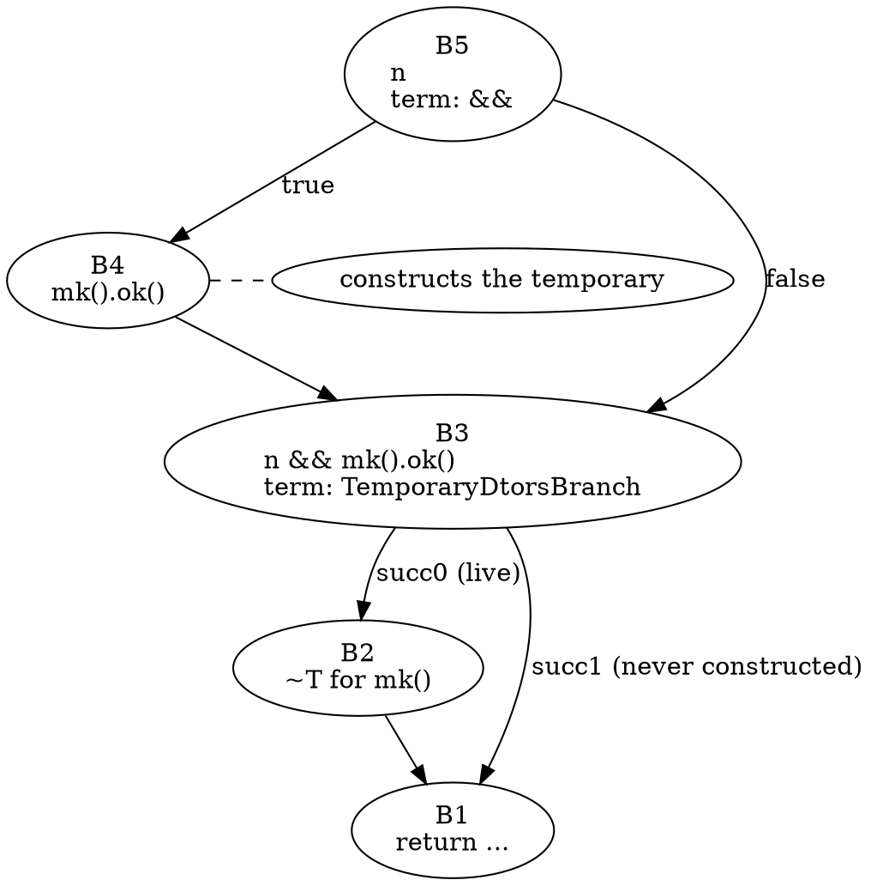
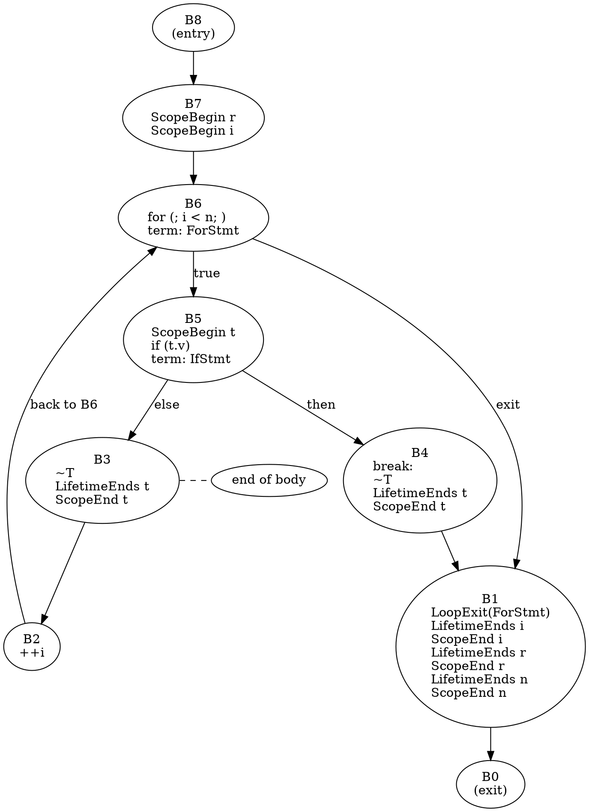
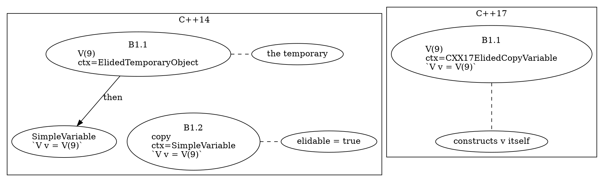
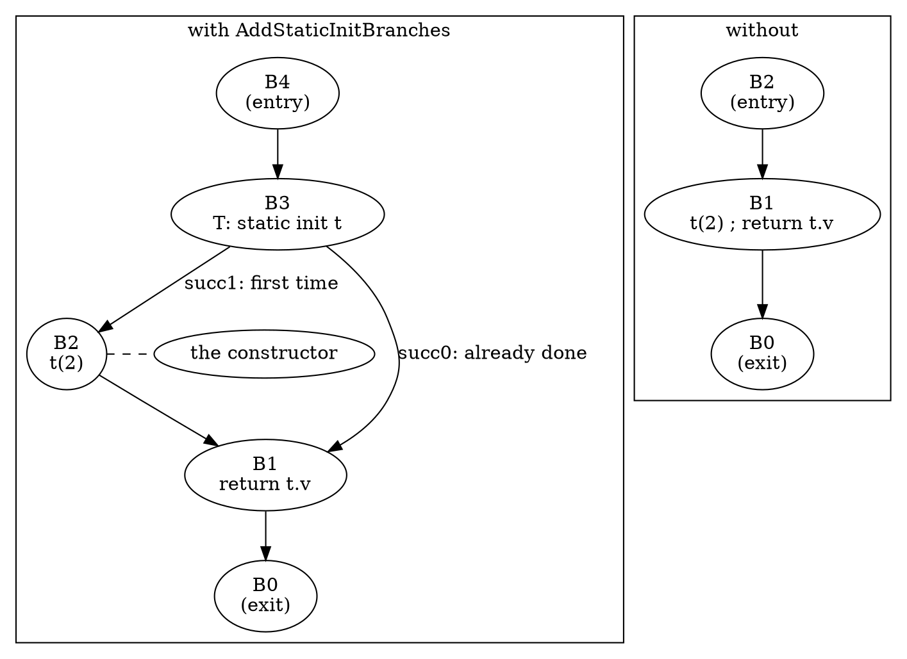
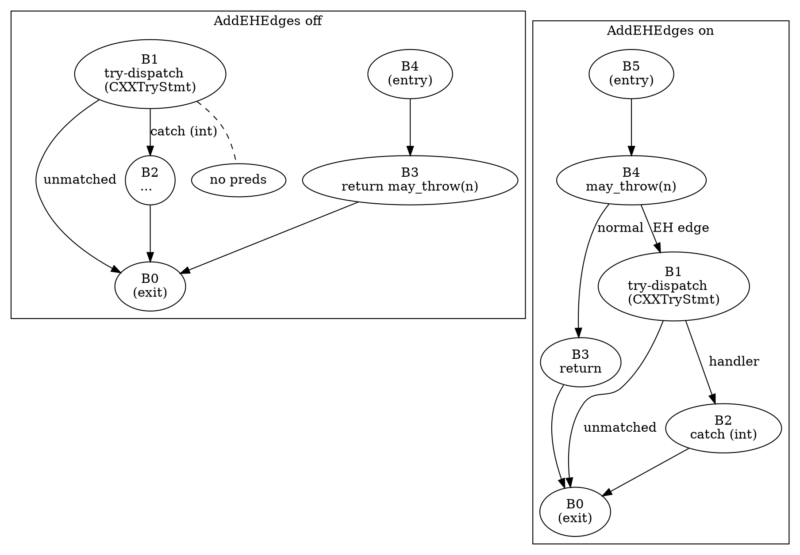

# Part 3 — C++ Semantics in the CFG

[← Part 2 — Building CFGs in C++](part_2_building_cfgs.md) | [Part 4 — Graph Algorithms over the CFG →](part_4_graph_algorithms.md)

## What You'll Learn

- The five implicit-destructor element kinds (`CFGAutomaticObjDtor`, `CFGTemporaryDtor`, `CFGBaseDtor`, `CFGMemberDtor`, `CFGDeleteDtor`), where the builder puts them, in what order, `noreturn` destructors, and the conditional branch that guards a temporary's destructor
- `CFGLifetimeEnds`, `CFGScopeBegin`/`CFGScopeEnd`, `CFGLoopExit` and `CFGCleanupFunction`: what each marks, what its trigger statement is, and which option and which *other* option each one needs
- `CFGConstructor`, `CFGCXXRecordTypedCall` and the `ConstructionContext` class tree: all eleven context kinds, the layered contexts of C++14 elision versus the single `CXX17ElidedCopy*` contexts of C++17
- `CFGInitializer`: base, member and delegating initialisers in declaration order, default member initialisers, and the aggregate-initialisation options
- `CFGNewAllocator`, `CFGDeleteDtor`, the `AddStaticInitBranches` diamond around a function-local `static`, and the `VirtualBaseBranch` terminator in constructors
- Exceptions: try-dispatch blocks (`CFG::try_blocks()`), `CXXCatchStmt` labels, what `AddEHEdges` adds (and the destructors it skips), `throw`, rethrow and `noreturn` calls inside `try`
- Which function-like declarations get a CFG: lambda call operators, generic lambdas, template patterns versus instantiations, coroutines, and why `AdornedCFG::build` rejects templated declarations
- The Sema, `AdornedCFG` and Static Analyzer option sets compared on one C++ function, and verified against the real builders
- Four new tools (`p03_elems`, `p03_ctors`, `p03_eh`, `p03_lambdas`) and one comparison tool (`p03_compare`)

## The Big Picture

C++ puts invisible code in every function: destructors, constructor calls hidden inside declarations, scope ends, allocation functions, exception dispatch. The AST shows only the source. The CFG is where that hidden code becomes explicit, and **each kind of hidden code is a `BuildOptions` switch** that is off by default:

| Source construct | CFG element / structure | Switch |
|------------------|-------------------------|--------|
| `T t;` (end of scope) | `CFGAutomaticObjDtor` | `AddImplicitDtors` |
| `mk().f()` (end of full expr) | `CFGTemporaryDtor` (+ `TemporaryDtorsBranch`) | `AddTemporaryDtors` |
| `~D() { }` (members, bases) | `CFGMemberDtor`, `CFGBaseDtor` | `AddImplicitDtors` |
| `delete p;` | `CFGDeleteDtor` | (always, see 3.1) |
| `{ int x; }` (scope boundaries) | `CFGScopeBegin` / `CFGScopeEnd` | `AddScopes` |
| `x` dies | `CFGLifetimeEnds` | `AddLifetime` |
| `while` / `for` / `do` | `CFGLoopExit` | `AddLoopExit` |
| `__attribute__((cleanup(f)))` | `CFGCleanupFunction` | `AddImplicitDtors` |
| `T t(1);` (constructor call) | `CFGConstructor` + `ConstructionContext` | `AddRichCXXConstructors` |
| `T v = make();` (returns a class) | `CFGCXXRecordTypedCall` + context | `AddRichCXXConstructors` |
| `A() : b(1) {}` | `CFGInitializer` | `AddInitializers` |
| `new T` | `CFGNewAllocator` | `AddCXXNewAllocator` |
| `static T t(2);` (function-local) | a branch block around the initialiser | `AddStaticInitBranches` |
| `struct M : virtual V { M(){} }` | `VirtualBaseBranch` terminator | `AddVirtualBaseBranches` |
| `try { f(); } catch (...) { }` | try-dispatch block, `CXXCatchStmt` labels | (always); `AddEHEdges` for edges |

The tools of this part print exactly these elements with all of their accessors.

| Tool (this part) | Section | Does |
|------------------|---------|------|
| `p03_elems` | 3.1, 3.2, 3.4, 3.5 | prints the C++-specific elements of any function, with every accessor; `--blocks` adds block headers, `--count` totals |
| `p03_ctors` | 3.3 | one line per `CFGConstructor` / `CFGCXXRecordTypedCall` with its `ConstructionContext` unpacked |
| `p03_eh` | 3.6 | try-dispatch blocks, their handlers, `throw` and `noreturn` blocks |
| `p03_lambdas` | 3.7 | every function-like declaration (lambda operators, templates, instantiations) and whether `buildCFG` / `AdornedCFG::build` accept it |
| `p03_compare` | 3.8 | the same function under the five presets; the option matrix; verification against the real builders |

Build them once (the first build compiles the shared header into each tool):

```bash
scripts/build.sh p03_elems p03_ctors p03_eh p03_lambdas p03_compare
```

Sample files are `manifests/p03_*.cpp`, one per section topic. Every sample is small enough to read in full; read the function before reading its output.

---

## Section 3.1 — Implicit destructors: automatic, temporary, member, base, delete

### Why

C++ destroys things you never wrote a call for, and it does so on *every* path out of a scope. A CFG without these elements cannot tell you that a lock guard is released before a `return`, or that a `noreturn` destructor ends the block. Each destructor kind has its own element, its own accessors and its own trigger.

### What to Do

**Sample file:** `manifests/p03_dtors.cpp` — one function per destructor kind.

`p03_elems` prints the C++ element kinds with all their accessors. The standard flags (`--preset`, `--set`, `--clear`, `--func`) select the build options; `--kinds=dtors` keeps only the five destructor kinds; `--blocks` adds a header line per block. Start with a local variable under the analyzer preset:

```bash
build/bin/p03_elems manifests/p03_dtors.cpp --func=auto_dtor --preset=analyzer --kinds=dtors --blocks
```

```text expected
== auto_dtor @L12: 5 blocks
B0 EXIT ->
B1 -> B0
  B1.8 AutomaticObjectDtor  dtor=~T noreturn=0  var=t type=T trigger=ReturnStmt@L16
B2 -> B0
  B2.4 AutomaticObjectDtor  dtor=~T noreturn=0  var=t type=T trigger=ReturnStmt@L15
B3 term=StmtBranch:IfStmt -> B2 B1
B4 ENTRY -> B3
```

The element line is `B<block>.<index> <Kind> <accessors>`. `t` has **two** `CFGAutomaticObjDtor` elements: one at the end of each `return`, because the object dies once per *path* out of its scope, not once per declaration. `trigger=` is `getTriggerStmt()`: the statement at whose end the destructor runs (here each `ReturnStmt`; for a scope that is simply left it would be the `CompoundStmt`).

| Element | Class | Accessors | Added by |
|---------|-------|-----------|----------|
| local object going out of scope | `CFGAutomaticObjDtor` | `getVarDecl()`, `getTriggerStmt()` | `AddImplicitDtors` |
| temporary at the end of its full expression | `CFGTemporaryDtor` | `getBindTemporaryExpr()` | `AddTemporaryDtors` |
| base subobject, in a destructor | `CFGBaseDtor` | `getBaseSpecifier()` | `AddImplicitDtors` |
| member subobject, in a destructor | `CFGMemberDtor` | `getFieldDecl()` | `AddImplicitDtors` |
| `delete p` on a class pointer | `CFGDeleteDtor` | `getCXXRecordDecl()`, `getDeleteExpr()` | always (see below) |

All five derive from `CFGImplicitDtor`, which adds `getDestructorDecl(ASTContext&)` and `isNoReturn(ASTContext&)`.

> [!warning] `CFGImplicitDtor::isNoReturn()` does not link
> `isNoReturn(ASTContext&)` is declared in `CFG.h` of 22.1.8, but `libclang-cpp` exports no definition: a tool that calls it fails at link time with `Undefined symbols ... CFGImplicitDtor::isNoReturn`. `getDestructorDecl()` is exported. Ask the declaration instead: `getDestructorDecl(Ctx)->isNoReturn()`, which is what `p03_elems` does. Also, `getDestructorDecl()` returns **null for `CFGBaseDtor`** in this release; go through the base specifier (`getBaseSpecifier()->getType()->getAsCXXRecordDecl()->getDestructor()`).

#### Order, arrays and temporaries

Objects are destroyed in reverse order of construction; an array of objects gets **one** element for the whole array:

```bash
build/bin/p03_elems manifests/p03_dtors.cpp --func=two_objects --preset=analyzer --kinds=AutomaticObjectDtor
build/bin/p03_elems manifests/p03_dtors.cpp --func=array_dtor --preset=analyzer --kinds=AutomaticObjectDtor
```

```text expected
== two_objects @L20: 3 blocks
B1.13 AutomaticObjectDtor  dtor=~T noreturn=0  var=b type=T trigger=ReturnStmt@L23
B1.14 AutomaticObjectDtor  dtor=~T noreturn=0  var=a type=T trigger=ReturnStmt@L23
== array_dtor @L27: 3 blocks
B1.10 AutomaticObjectDtor  dtor=~T noreturn=0  var=arr type=T[3] trigger=ReturnStmt@L29
```

Temporaries need their own switch because their destruction can be *conditional*. In `n && mk().ok()` the temporary `mk()` exists only if `n` was true:

```cpp
int cond_temp(int n) { return n && mk().ok(); }
```

```bash
build/bin/p03_elems manifests/p03_dtors.cpp --func=cond_temp --preset=analyzer --kinds=TemporaryDtor,CXXRecordTypedCall --blocks
```

```text expected
== cond_temp @L38: 7 blocks
B0 EXIT ->
B1 -> B0
B2 -> B1
  B2.1 TemporaryDtor        dtor=~T noreturn=0  bte=`mk()`
B3 term=TemporaryDtorsBranch:CXXBindTemporaryExpr -> B2 B1
B4 -> B3
  B4.3 CXXRecordTypedCall   CallExpr           `mk()`
B5 term=StmtBranch:BinaryOperator -> B4 B3
B6 ENTRY -> B5
```

The graph is a diamond that the source never mentions. `B3` has a `TemporaryDtorsBranch` terminator (Section 2.6): at run time it tests "was the temporary constructed?":



When a temporary is bound to a `const` reference it is *not* a temporary at the end of the statement any more: its lifetime is extended to the reference's scope, and the destructor becomes a `CFGAutomaticObjDtor` **of the reference variable**:

```bash
build/bin/p03_elems manifests/p03_dtors.cpp --func=bound_temp --preset=analyzer --kinds=dtors,CXXRecordTypedCall
```

```text expected
== bound_temp @L43: 3 blocks
B1.3 CXXRecordTypedCall   CallExpr           `mk()`
B1.12 AutomaticObjectDtor  dtor=~T noreturn=0  var=r type=const T & trigger=ReturnStmt@L45
```

`var=r type=const T &` — a destructor for a *reference*. If you pair `CFGTemporaryDtor` with every `CXXBindTemporaryExpr` you will miss this one.

#### Base and member destructors

They live in the *destructor's own* CFG, after the body: members in reverse declaration order, then direct bases in reverse, then virtual bases. Trivially destructible members and bases get no element.

```cpp
struct Derived : Base, virtual VBase { int plain; M m1; T m2; ~Derived(); };
```

```bash
build/bin/p03_elems manifests/p03_dtors.cpp --func=Derived::~Derived --preset=analyzer --kinds=dtors
```

```text expected
== Derived::~Derived @L64: 3 blocks
B1.1 MemberDtor           dtor=~T noreturn=0  field=m2 type=T
B1.2 MemberDtor           dtor=~M noreturn=0  field=m1 type=M
B1.3 BaseDtor             dtor=none noreturn=0  base=Base via-record=~Base
B1.4 BaseDtor             dtor=none noreturn=0  base=VBase (virtual) via-record=~VBase
```

#### `delete`

```bash
build/bin/p03_elems manifests/p03_dtors.cpp --func=delete_dtor --kinds=DeleteDtor
build/bin/p03_elems manifests/p03_dtors.cpp --func=delete_array_dtor --kinds=DeleteDtor
```

```text expected
== delete_dtor @L67: 3 blocks
B1.1 DeleteDtor           dtor=~T noreturn=0  class=T delete=`delete p`
== delete_array_dtor @L72: 3 blocks
B1.1 DeleteDtor           dtor=~T noreturn=0  class=T delete=`delete [] p`
```

These ran with the **default** options (no `AddImplicitDtors`), and `CFGDeleteDtor` is still there.

> [!warning] `CFGDeleteDtor` ignores `AddImplicitDtors`
> Section 2.2 listed `CFGDeleteDtor` among the elements `AddImplicitDtors` adds. Observed on 22.1.8: a `delete` of a class pointer produces the element under the default options too, for single and `[]` deletes. `p03_compare` in Section 3.8 shows `DeleteDtor 1` in all five presets.

#### `noreturn` destructors

A destructor declared `__attribute__((noreturn))` ends its block: the element is the last in the block and the only successor is the exit.

```bash
build/bin/p03_elems manifests/p03_dtors.cpp --func=noreturn_dtor --preset=analyzer --kinds=dtors --blocks
build/bin/p02_edges manifests/p03_dtors.cpp --func=noreturn_temp --preset=analyzer
```

```text expected
== noreturn_dtor @L81: 4 blocks
B0 EXIT ->
B1 ->
B2 noreturn -> B0
  B2.6 AutomaticObjectDtor  dtor=~Fatal noreturn=1  var=f type=Fatal trigger=ReturnStmt@L83
B3 ENTRY -> B2
== noreturn_temp: blocks=4 isLinear=1 edges=3 (+0 pruned)
B0   T=-              succs:   preds: B1 B2
B1   T=-              succs: B0   preds: (unreach B2)
B2   T=-              succs: B0   preds: B3
B3   T=-              succs: B2   preds:
```

`B2 noreturn` is `CFGBlock::hasNoReturnElement()`; the destructor is the last element of `B2`, and `B2`'s only successor is the exit. `B1` in the first function is the orphan block for "whatever follows": it has neither predecessors nor successors. In the second function the temporary's destructor is `noreturn` too, so the edge `B2 -> B1` is pruned (`(unreach B2)`) and `B1` is reachable from nowhere.

### Verify

Count destructor elements for three functions under two option sets. Predict first: which kinds are missing with `default`, and what does `analyzer` add?

```bash
for p in default analyzer; do
  echo "--- $p"
  for f in auto_dtor temp_dtor cond_temp; do
    build/bin/p03_elems manifests/p03_dtors.cpp --func=$f --preset=$p --count --kinds=dtors | tr '\n' ' '; echo
  done
done
```

### Expected

```text expected
--- default
== auto_dtor @L12: 5 blocks
== temp_dtor @L33: 3 blocks
== cond_temp @L38: 5 blocks
--- analyzer
== auto_dtor @L12: 5 blocks   AutomaticObjectDtor  2
== temp_dtor @L33: 3 blocks   TemporaryDtor        1
== cond_temp @L38: 7 blocks   TemporaryDtor        1
```

The default build contains no `AutomaticObjectDtor` and no `TemporaryDtor`; the analyzer preset contains both. `cond_temp` has one `TemporaryDtor` element even though the destructor runs on at most one of the two paths: the element exists once, the *branch* decides — and the branch is why `cond_temp` grows from 5 blocks to 7.

> [!hint]- Quiz: `T t; if (c) return 1; return 2;` — how many `CFGAutomaticObjDtor` elements does `t` get?
> Count the paths that leave the scope.

> [!success]- Answer
> Two, one before each `return`. Falling off the end of a scope adds one more for that path. The element count follows the number of exits, so a function with many early returns has many copies of the same destructor.

---

## Section 3.2 — Lifetimes, scopes and cleanup attributes

### Why

Destructors only exist for class types. To know that an `int` goes out of scope (a use-after-scope checker, a dangling-pointer analysis) you need explicit markers for *every* variable. Three switches add them, and they are independent of the destructor switches.

### What to Do

**Sample file:** `manifests/p03_scopes.cpp` — nested blocks, loops, `break`, `goto`, `cleanup`.

| Element | Class | Accessors | Added by |
|---------|-------|-----------|----------|
| a variable is declared | `CFGScopeBegin` | `getVarDecl()`, `getTriggerStmt()` (the `DeclStmt`) | `AddScopes` |
| a variable's scope ends | `CFGScopeEnd` | `getVarDecl()`, `getTriggerStmt()` | `AddScopes` |
| a variable's lifetime ends | `CFGLifetimeEnds` | `getVarDecl()`, `getTriggerStmt()` | `AddLifetime` |
| a loop is left | `CFGLoopExit` | `getLoopStmt()` | `AddLoopExit` |
| `__attribute__((cleanup(f)))` variable dies | `CFGCleanupFunction` | `getVarDecl()`, `getFunctionDecl()` | `AddImplicitDtors` |

Turn on all three scope switches on top of the analyzer preset and look at nested blocks. Scopes end innermost-first, and each `}` ends one scope per variable declared in it:

```bash
build/bin/p03_elems manifests/p03_scopes.cpp --func=nested --preset=analyzer --set=AddLifetime,AddScopes,AddLoopExit \
  --kinds=scopes --blocks
```

```text expected
== nested @L23: 3 blocks
B0 EXIT ->
B1 -> B0
  B1.1 ScopeBegin           var=a trigger=DeclStmt@L24
  B1.5 ScopeBegin           var=b trigger=DeclStmt@L26
  B1.11 ScopeBegin           var=c trigger=DeclStmt@L28
  B1.22 LifetimeEnds         var=c trigger=CompoundStmt@L30
  B1.23 ScopeEnd             var=c trigger=CompoundStmt@L30
  B1.29 LifetimeEnds         var=b trigger=CompoundStmt@L32
  B1.30 ScopeEnd             var=b trigger=CompoundStmt@L32
  B1.34 LifetimeEnds         var=a trigger=ReturnStmt@L33
  B1.35 ScopeEnd             var=a trigger=ReturnStmt@L33
  B1.36 LifetimeEnds         var=n trigger=ReturnStmt@L33
  B1.37 ScopeEnd             var=n trigger=ReturnStmt@L33
B2 ENTRY -> B1
```

Read it as a bracket sequence. The function has no branches, so it is one block and the element index (`B1.<n>`) is the order. `a`, `b` and `c` are opened in turn; at line 30 the innermost `}` closes `c` (`trigger=CompoundStmt@L30` is the *end line of the trigger statement*: the closing brace); at line 32 the next `}` closes `b`; the `return` on line 33 closes `a` and the *parameter* `n`. The first element is index 1 and the gaps are the linearized sub-expressions between them. Two things to notice:

- `n` has `LifetimeEnds` and `ScopeEnd` but **no `ScopeBegin`**: a parameter's scope starts before the body.
- Every variable gets `LifetimeEnds` and then `ScopeEnd` back to back, with the same trigger. They carry the same information; pick whichever your analysis models and do not count both.

Now a `break`. The destructor, the lifetime end and the scope end of `t` are repeated on the `break` edge, because `t` dies there too; the loop's own variable `i` and the `LoopExit` are *not* repeated — they sit once in the shared exit block `B1`:

```bash
build/bin/p03_elems manifests/p03_scopes.cpp --func=early_exit --preset=analyzer --set=AddLifetime,AddScopes,AddLoopExit \
  --kinds=scopes,dtors --blocks
```

```text expected
== early_exit @L37: 9 blocks
B0 EXIT ->
B1 -> B0
  B1.1 LoopExit             loop=ForStmt@L39
  B1.2 LifetimeEnds         var=i trigger=ForStmt@L44
  B1.3 ScopeEnd             var=i trigger=ForStmt@L44
  B1.7 LifetimeEnds         var=r trigger=ReturnStmt@L45
  B1.8 ScopeEnd             var=r trigger=ReturnStmt@L45
  B1.9 LifetimeEnds         var=n trigger=ReturnStmt@L45
  B1.10 ScopeEnd             var=n trigger=ReturnStmt@L45
B2 -> B6
B3 -> B2
  B3.5 AutomaticObjectDtor  dtor=~T noreturn=0  var=t type=T trigger=CompoundStmt@L44
  B3.6 LifetimeEnds         var=t trigger=CompoundStmt@L44
  B3.7 ScopeEnd             var=t trigger=CompoundStmt@L44
B4 term=StmtBranch:BreakStmt -> B1
  B4.1 AutomaticObjectDtor  dtor=~T noreturn=0  var=t type=T trigger=BreakStmt@L42
  B4.2 LifetimeEnds         var=t trigger=BreakStmt@L42
  B4.3 ScopeEnd             var=t trigger=BreakStmt@L42
B5 term=StmtBranch:IfStmt -> B4 B3
  B5.1 ScopeBegin           var=t trigger=DeclStmt@L40
B6 term=StmtBranch:ForStmt -> B5 B1
B7 -> B6
  B7.1 ScopeBegin           var=r trigger=DeclStmt@L38
  B7.4 ScopeBegin           var=i trigger=DeclStmt@L39
B8 ENTRY -> B7
```



`CFGLoopExit::getLoopStmt()` is the `ForStmt`. It is placed where *every* path that leaves the loop converges, so an analysis that clears per-loop state needs only one place.

#### `__attribute__((cleanup))`

A C-level destructor. `CFGCleanupFunction` is emitted **before** the variable's `LifetimeEnds`, once per exit path, and names the function through `getFunctionDecl()`:

```bash
build/bin/p03_elems manifests/p03_scopes.cpp --func=with_cleanup --preset=analyzer --set=AddLifetime,AddScopes --kinds=scopes --blocks
```

```text expected
== with_cleanup @L70: 5 blocks
B0 EXIT ->
B1 -> B0
  B1.4 CleanupFunction      var=c fn=cleanup
  B1.5 LifetimeEnds         var=c trigger=ReturnStmt@L74
  B1.6 ScopeEnd             var=c trigger=ReturnStmt@L74
  B1.7 LifetimeEnds         var=n trigger=ReturnStmt@L74
  B1.8 ScopeEnd             var=n trigger=ReturnStmt@L74
B2 -> B0
  B2.4 CleanupFunction      var=c fn=cleanup
  B2.5 LifetimeEnds         var=c trigger=ReturnStmt@L73
  B2.6 ScopeEnd             var=c trigger=ReturnStmt@L73
  B2.7 LifetimeEnds         var=n trigger=ReturnStmt@L73
  B2.8 ScopeEnd             var=n trigger=ReturnStmt@L73
B3 term=StmtBranch:IfStmt -> B2 B1
  B3.1 ScopeBegin           var=c trigger=DeclStmt@L71
B4 ENTRY -> B3
```

Which switch does it need? Turn the switches on one at a time from the *default* options and count the scope-family kinds (`CleanupFunction`, `LifetimeEnds`, ...):

```bash
for o in AddLifetime AddScopes AddLoopExit AddImplicitDtors; do
  echo "+$o: $(build/bin/p03_elems manifests/p03_scopes.cpp --func=with_cleanup --set=$o --count --kinds=scopes | tail -n +2 | tr -s ' ' | tr '\n' ';')"
done
```

```text expected
+AddLifetime:  CleanupFunction 2; LifetimeEnds 4;
+AddScopes:  ScopeBegin 1; ScopeEnd 4;
+AddLoopExit:
+AddImplicitDtors:  CleanupFunction 2;
```

`AddLifetime` gives `LifetimeEnds`; `AddScopes` gives the begin/end pair; `AddLoopExit` gives nothing here because the function has no loop. `CleanupFunction` shows up with `AddImplicitDtors` **or** `AddLifetime`, and not with `AddScopes` alone: the cleanup call is part of the "object handling" code that either of those two switches enables.

> [!warning] Scope elements are not destructors
> `AddScopes`/`AddLifetime` mark `int`s, pointers and references as well as class objects. `CFGAutomaticObjDtor` is only for objects with a non-trivial destructor. A checker that wants "variable `x` is dead here" for a plain `int` needs `AddLifetime`; `AddImplicitDtors` will never mention it.

### Verify

A `goto` out of a scope is an exit path like any other: it carries the destructor of the object it leaves. Count `t`'s destructors in `goto_out`:

```bash
build/bin/p03_elems manifests/p03_scopes.cpp --func=goto_out --preset=analyzer --kinds=AutomaticObjectDtor --blocks
```

### Expected

```text expected
== goto_out @L58: 6 blocks
B0 EXIT ->
B1 label=LabelStmt -> B0
B2 -> B1
  B2.7 AutomaticObjectDtor  dtor=~T noreturn=0  var=t type=T trigger=CompoundStmt@L64
B3 term=StmtBranch:GotoStmt -> B1
  B3.1 AutomaticObjectDtor  dtor=~T noreturn=0  var=t type=T trigger=GotoStmt@L62
B4 term=StmtBranch:IfStmt -> B3 B2
B5 ENTRY -> B4
```

Two destructors for the single `T t`: `B3` (the `goto done`, trigger `GotoStmt`, whose terminator is a `StmtBranch` with the label block as its only successor) and `B2` (falling off the end of the block, trigger `CompoundStmt`). `B1` holds the label `done:` and is reached from both; it contains no destructor — `t` is already gone.

> [!hint]- Quiz: why does `LifetimeEnds` for a `for`-loop variable appear after `LoopExit` and not before it?
> Where does the variable's scope end relative to the loop?

> [!success]- Answer
> The scope of `i` is the whole `for` statement, so it ends when control leaves the loop: after `CFGLoopExit` on the exit block, with `ForStmt` as the trigger. A variable declared inside the body ends at the body's `}` (or at a `break`/`continue`/`return`/`goto` out of it).

---

## Section 3.3 — Constructors and `ConstructionContext`

### Why

A constructor call is an expression, but *where the object goes* depends on the surrounding syntax: a local variable, a temporary, a function argument, a member, the heap, a return slot. The analyzer needs that to connect the call with the memory region it initialises. `AddRichCXXConstructors` records it as a `ConstructionContext` on the element.

### What to Do

**Sample file:** `manifests/p03_ctors.cpp` — one function per context kind.

Without `AddRichCXXConstructors` a constructor call is an ordinary `CFGStmt` (`Statement` kind, a `CXXConstructExpr`); with it the same expression becomes a `CFGConstructor`, and a call returning a class *by value* becomes a `CFGCXXRecordTypedCall`. Both carry `getConstructionContext()`. Remember Section 2.4: `getAs<CFGStmt>()` matches all three kinds.

```bash
for o in "" "--set=AddRichCXXConstructors"; do
  build/bin/p03_elems manifests/p03_ctors.cpp --func=typed_call --count --kinds=Statement,Constructor,CXXRecordTypedCall $o | tr -s ' ' | tr '\n' ';'; echo
done
```

```text expected
== typed_call @L61: 3 blocks; Statement 3;
== typed_call @L61: 3 blocks; CXXRecordTypedCall 1; Statement 2;
```

The element that was a plain `Statement` (the call `make()`) is now a `CXXRecordTypedCall`: `Statement` dropped from 3 to 2. (`typed_call` has no constructor call in C++17: `V v = make();` is guaranteed elision, so the callee constructs `v`.)

`p03_ctors` turns the rich-constructor option on (plus `AddInitializers`, because member contexts need it, and `MarkElidedCXXConstructors`, Section 2.2) and unpacks each context. Under C++17:

```bash
build/bin/p03_ctors manifests/p03_ctors.cpp -- -std=c++17
```

```text expected
== ctx_variable
B1.1 Constructor        ctor V(1 args)  ctx=SimpleVariable decl=`V v(1)`
== ctx_temporary
B1.1 Constructor        ctor V(1 args)  ctx=SimpleTemporaryObject bte=yes mte=yes
== ctx_materialized
B1.1 Constructor        ctor V(1 args)  ctx=SimpleTemporaryObject bte=no mte=yes
== ctx_return
B1.1 Constructor        ctor V(1 args)  ctx=CXX17ElidedCopyReturnedValue return=`return V(4)` bte=yes
== ctx_argument
B1.1 Constructor        ctor V(1 args)  ctx=Argument call=`take(V(5))` index=0
== ctx_new
B1.1 Constructor        ctor V(1 args)  ctx=NewAllocatedObject new=`new V(6)`
== Holder::Holder
B1.1 Constructor        ctor V(1 args)  ctx=SimpleConstructorInitializer init=member a
B1.3 Constructor        ctor V(0 args)  ctx=SimpleConstructorInitializer init=member b
== ctx_lambda
B1.1 Constructor        ctor V(1 args)  ctx=LambdaCapture field-type=V index=0
== typed_call
B1.1 CXXRecordTypedCall call `make()`  ctx=CXX17ElidedCopyVariable decl=`V v = make()` bte=yes
== elision
B1.1 Constructor        ctor V(1 args)  ctx=CXX17ElidedCopyVariable decl=`V v = V(9)` bte=yes
== return_call
B1.1 CXXRecordTypedCall call `make()`  ctx=CXX17ElidedCopyReturnedValue return=`return make()` bte=yes
== arg_ref
B1.1 Constructor        ctor V(1 args)  ctx=SimpleTemporaryObject bte=yes mte=yes
== Holder2::Holder2
B1.1 CXXRecordTypedCall call `make()`  ctx=CXX17ElidedCopyConstructorInitializer init=member a bte=yes
```

#### The context classes

`ConstructionContext` is a small class tree; `getKind()` returns one of these 11 values (`ConstructionContext::Kind`). The three abstract families have a common accessor.

| Kind | Family (`dyn_cast` target) | Names | Example above |
|------|-----------------------------|-------|---------------|
| `SimpleVariableKind` | `VariableConstructionContext` | `getDeclStmt()` | `ctx_variable` |
| `CXX17ElidedCopyVariableKind` | `VariableConstructionContext` | `getDeclStmt()`, `getCXXBindTemporaryExpr()` | `typed_call`, `elision` |
| `SimpleConstructorInitializerKind` | `ConstructorInitializerConstructionContext` | `getCXXCtorInitializer()` | `Holder::Holder` |
| `CXX17ElidedCopyConstructorInitializerKind` | same | `getCXXCtorInitializer()`, `getCXXBindTemporaryExpr()` | `Holder2::Holder2`, C++17 |
| `NewAllocatedObjectKind` | — | `getCXXNewExpr()` | `ctx_new` |
| `SimpleTemporaryObjectKind` | `TemporaryObjectConstructionContext` | `getCXXBindTemporaryExpr()`, `getMaterializedTemporaryExpr()` | `ctx_temporary`, `ctx_materialized` |
| `ElidedTemporaryObjectKind` | same | the two above, plus `getConstructorAfterElision()`, `getConstructionContextAfterElision()` | C++14 only |
| `SimpleReturnedValueKind` | `ReturnedValueConstructionContext` | `getReturnStmt()` | C++14 only |
| `CXX17ElidedCopyReturnedValueKind` | same | `getReturnStmt()`, `getCXXBindTemporaryExpr()` | `ctx_return`, `return_call` |
| `ArgumentKind` | — | `getCallLikeExpr()`, `getIndex()`, `getCXXBindTemporaryExpr()` | `ctx_argument` |
| `LambdaCaptureKind` | — | `getLambdaExpr()`, `getIndex()`, `getInitializer()`, `getFieldDecl()` | `ctx_lambda` |

A context can say less than you hope: `ctx_materialized` has `bte=no mte=yes` (a temporary with a trivial destructor has no `CXXBindTemporaryExpr`; it is materialized because it is bound to a reference). `TemporaryObjectConstructionContext` documents that both can be null in principle, "all combinations possible".

#### C++14 versus C++17: layers versus one kind

Before C++17 `V v = V(9)` is "construct a temporary, then copy-construct `v` from it, and the compiler may elide the copy". Under C++17 there is just one construction, directly into `v`. The CFG models both. `MarkElidedCXXConstructors` is what makes the C++14 form legible: the temporary's construction context becomes an `ElidedTemporaryObject` that *contains* the context the object has after the copy is skipped.

```bash
build/bin/p03_ctors manifests/p03_ctors.cpp --func=elision -- -std=c++14
build/bin/p03_ctors manifests/p03_ctors.cpp --func=elision -- -std=c++17
```

```text expected
== elision
B1.1 Constructor        ctor V(1 args)  ctx=ElidedTemporaryObject bte=yes mte=yes elided-ctor=V then{ctx=SimpleVariable decl=`V v = V(9)`}
B1.2 Constructor        ctor V(1 args, elidable)  ctx=SimpleVariable decl=`V v = V(9)`
== elision
B1.1 Constructor        ctor V(1 args)  ctx=CXX17ElidedCopyVariable decl=`V v = V(9)` bte=yes
```

Same function, same options, a different language mode:



The C++14 pair reads: element 1 builds a temporary, and its context says "if the copy that follows is elided, I am the construction of `v`" (`getConstructionContextAfterElision()` is the `SimpleVariable` context). Element 2 is the elidable copy itself, flagged by `CXXConstructExpr::isElidable()`. The Static Analyzer constructs directly into `v` and skips element 2. Without `MarkElidedCXXConstructors` both elements still exist, but element 1 only says "a temporary" and nothing links it to the copy:

```bash
build/bin/p03_ctors manifests/p03_ctors.cpp --func=elision --clear=MarkElidedCXXConstructors -- -std=c++14
```

```text expected
== elision
B1.1 Constructor        ctor V(1 args)  ctx=SimpleTemporaryObject bte=yes mte=yes
B1.2 Constructor        ctor V(1 args, elidable)  ctx=SimpleVariable decl=`V v = V(9)`
```

> [!warning] `--clear` and the helper
> `p03_ctors` forces `AddRichCXXConstructors` and `MarkElidedCXXConstructors` on before applying `--clear`, so you can switch either off from the command line. Clearing `AddRichCXXConstructors` also clears the mark option, because `MarkElidedCXXConstructors` only has an effect with rich constructors.

#### A call returning a class by value

`CFGCXXRecordTypedCall` wraps the `CallExpr`, not a `CXXConstructExpr` — there is no constructor call, the callee constructs its result. `isCXXRecordTypedCall(E)` is true when the expression is a prvalue of class type. Under C++17 `V v = make();` is guaranteed elision, so the callee writes into `v` and the context says so (`CXX17ElidedCopyVariable`, the `typed_call` line of the C++17 run above). Under C++14 the call is followed by an elidable copy, and the call's context is the same `ElidedTemporaryObject` chain as for a constructor:

```bash
build/bin/p03_ctors manifests/p03_ctors.cpp --func=typed_call -- -std=c++14
build/bin/p03_ctors manifests/p03_ctors.cpp --func=Holder2::Holder2 -- -std=c++17
```

```text expected
== typed_call
B1.1 CXXRecordTypedCall call `make()`  ctx=ElidedTemporaryObject bte=yes mte=yes elided-ctor=V then{ctx=SimpleVariable decl=`V v = make()`}
B1.2 Constructor        ctor V(1 args, elidable)  ctx=SimpleVariable decl=`V v = make()`
== Holder2::Holder2
B1.1 CXXRecordTypedCall call `make()`  ctx=CXX17ElidedCopyConstructorInitializer init=member a bte=yes
```

`Holder2::Holder2` shows the member-initialiser variant of the C++17 form: `CXX17ElidedCopyConstructorInitializer` with `init=member a`.

### Verify

Which context kinds does the whole file produce under each standard? Collect and count them:

```bash
for s in 14 17; do
  echo "c++$s: $(build/bin/p03_ctors manifests/p03_ctors.cpp -- -std=c++$s | grep -o 'ctx=[A-Za-z0-9]*' | sort | uniq -c | awk '{printf "%s:%s ", substr($2,5), $1}')"
done
```

### Expected

```text expected
c++14: Argument:2 ElidedTemporaryObject:7 LambdaCapture:2 NewAllocatedObject:1 SimpleConstructorInitializer:4 SimpleReturnedValue:4 SimpleTemporaryObject:3 SimpleVariable:6
c++17: Argument:1 CXX17ElidedCopyConstructorInitializer:1 CXX17ElidedCopyReturnedValue:2 CXX17ElidedCopyVariable:2 LambdaCapture:1 NewAllocatedObject:1 SimpleConstructorInitializer:2 SimpleTemporaryObject:3 SimpleVariable:1
```

C++14 has `ElidedTemporaryObject` and `SimpleReturnedValue` and no `CXX17ElidedCopy*`; C++17 has the opposite. In C++14 every temporary that initialises something is paired with an elidable copy, so `SimpleVariable` goes from 1 context to 6 and `Argument` from 1 to 2. Constructions that never involve a copy (`NewAllocatedObject`, `SimpleTemporaryObject`) have the same count in both; `SimpleConstructorInitializer` doubles in C++14 because `Holder2` copies from a call.

> [!hint]- Quiz: `take_ref(V(10))` and `take(V(5))` both pass a `V(...)` temporary. Why is the first context `SimpleTemporaryObject` and the second `Argument`?
> What does the parameter type say about where the object lives?

> [!success]- Answer
> `take_ref` takes `const V &`: the temporary is materialized and bound to the reference, so its home is the temporary itself (`mte=yes`). `take` takes a `V` by value: in C++17 the temporary *is* the parameter object, constructed directly into the argument slot (`ArgumentConstructionContext`, index 0).

---

## Section 3.4 — Initialisers, default member initialisers and aggregates

### Why

A constructor's `{}` is the *end* of the constructor. Before it run the base and member initialisers, in an order that is not the order you wrote them, and some of them come from `= 5` on a member declaration. The CFG records each as a `CFGInitializer`.

### What to Do

**Sample file:** `manifests/p03_init.cpp` — three constructors of one class with a base, a member with a default initialiser, a member with a constructor and a plain `int`.

`CFGInitializer::getInitializer()` returns a `CXXCtorInitializer`. `p03_elems --kinds=Initializer` prints, for each: base / member / delegating, `isWritten()` (appeared in the mem-initialiser list), `isInClassMemberInitializer()` (comes from `= 5` on the member) and the class of `getInit()`. The constructors are overloaded, so the header line carries the line number of the constructor:

```bash
build/bin/p03_elems manifests/p03_init.cpp --func=A::A --preset=analyzer --kinds=Initializer
```

```text expected
== A::A @L22: 3 blocks
B1.2 Initializer          base Base  written=0 in-class=0 init=CXXConstructExpr
B1.4 Initializer          member a  written=0 in-class=1 init=CXXDefaultInitExpr
B1.6 Initializer          member m  written=0 in-class=0 init=CXXConstructExpr
B1.8 Initializer          member plain  written=1 in-class=0 init=IntegerLiteral
== A::A @L25: 3 blocks
B1.4 Initializer          base Base  written=1 in-class=0 init=CXXConstructExpr
B1.7 Initializer          member a  written=1 in-class=0 init=ImplicitCastExpr
B1.9 Initializer          member m  written=1 in-class=0 init=CXXConstructExpr
== A::A @L28: 3 blocks
B1.5 Initializer          delegating  written=1 in-class=0 init=CXXConstructExpr
```

Read the three constructors against the source (`A() : plain(1)`, `A(int n) : Base(n), m(), a(n)`, `A(const A &o) : A(o.a)`):

1. **Order is declaration order, not written order.** In the second constructor `m()` is written before `a(n)`, but the elements are `Base, a, m`: base first, then members as declared.
2. **Unwritten initialisers are still elements** (`written=0`): the implicit `Base()` call, the default member initialiser of `a` (`in-class=1`, `init=CXXDefaultInitExpr`) and the default construction of `m`.
3. **A delegating constructor has exactly one initialiser**, and it is the whole job.

Members with trivial default initialisation and no initialiser (`int plain` in the others) produce no element; neither does a class with only such members:

```bash
build/bin/p03_elems manifests/p03_init.cpp --func=Empty::Empty --preset=analyzer --kinds=Initializer
```

```text expected
== Empty::Empty @L34: 3 blocks
B1.2 Initializer          member m  written=0 in-class=0 init=CXXConstructExpr
```

Only `m` has an element; `int x` is left uninitialised and the CFG does not invent an initialiser for it.

> [!warning] `AddInitializers` is off by default
> With the default options `A::A` has *no* `Initializer` elements at all (Section 2.2). Every C++ analysis you build on constructors needs it on; Sema and the analyzer both set it.

#### `AddCXXDefaultInitExprInCtors`

`a` is `int a = 5;`. The `CFGInitializer` for it exists regardless, but the *expression* `5` is only an element if you ask:

```bash
MODE=dump scripts/optdiff.sh manifests/p03_init.cpp A::A AddCXXDefaultInitExprInCtors --set=AddInitializers --always-add=all
```

```text expected
--- without
+++ +AddCXXDefaultInitExprInCtors
-   3:
-   4: a([B1.3]) (Member initializer)
-   5:  (CXXConstructExpr, M)
-   6: m([B1.5]) (Member initializer)
-   7: 1
-   8: plain([B1.7]) (Member initializer)
+   3: 5
+   4:
+   5: a([B1.4]) (Member initializer)
+   6:  (CXXConstructExpr, M)
+   7: m([B1.6]) (Member initializer)
+   8: 1
+   9: plain([B1.8]) (Member initializer)
```

The `CXXDefaultInitExpr` (the blank line before `a(...)`) is the *use* of the member's initialiser at this constructor; with the option on, its value (`5`, a new element 3) is expanded in front of it, and everything after shifts by one. The diff only concerns the first `A::A` — the other two constructors write `a` themselves, so there is no default initialiser to expand. The analyzer preset leaves the option off (matrix in Section 3.8); Sema and `AdornedCFG` turn it on.

#### Aggregates: `AddCXXDefaultInitExprInAggregates`, `OmitImplicitValueInitializers`

`struct Agg { int x = 1; int y; }` has no constructor to run, so there is no `CFGInitializer`; the equivalent is the aggregate's `InitListExpr`. Three initialisations show the two options:

```bash
for f in aggregate_empty aggregate_designated aggregate_full; do
  echo "--- $f"
  MODE=dump scripts/optdiff.sh manifests/p03_init.cpp $f AddCXXDefaultInitExprInAggregates --preset=analyzer | grep -E '^\+ +[0-9]+:|no change' | head -3
done
```

```text expected
--- aggregate_empty
+   1: 1
+   2:
+   3: /*implicit*/(int)0
--- aggregate_designated
+   1: 1
+   2:
+   3: 2
--- aggregate_full
no change
```

`Agg g{}` and `Agg g{.y = 2}` do not mention `x`; the `CXXDefaultInitExpr` standing for its `= 1` is always there, but the value `1` becomes an element only with `AddCXXDefaultInitExprInAggregates` (the new `+ 1: 1`). `Agg g{3, 4}` names everything, so the option changes nothing (the last diff is empty and `optdiff.sh` says "no change"). `OmitImplicitValueInitializers` is the opposite kind of switch — it *removes* the `/*implicit*/(int)0` elements for value-initialised members:

```bash
MODE=dump scripts/optdiff.sh manifests/p03_init.cpp aggregate_empty OmitImplicitValueInitializers --preset=analyzer | head -5
```

```text expected
--- without
+++ +OmitImplicitValueInitializers
-   2: /*implicit*/(int)0
-   3: {}
-   4: Agg g{};
```

### Verify

How many initialiser elements does each constructor of `A` have, and how many of them are written?

```bash
build/bin/p03_elems manifests/p03_init.cpp --func=A::A --preset=analyzer --kinds=Initializer \
  | awk '/^==/ {if (n) print n " initializers, " w " written"; n=0; w=0; next} {n++; if ($0 ~ /written=1/) w++} END {print n " initializers, " w " written"}'
```

### Expected

```text expected
4 initializers, 1 written
3 initializers, 3 written
1 initializers, 1 written
```

4, 3 and 1 initialisers. In the default constructor only `plain` is written (1 of 4); the three implicit ones are still real work. The second constructor writes all three. The delegating constructor has exactly one.

> [!hint]- Quiz: in `A::A(int n) : Base(n), m(), a(n) {}` the mem-initialiser list is written `Base, m, a`. In which order do the `CFGInitializer` elements appear?
> Look at the second block of the Section 3.4 output.

> [!success]- Answer
> `Base`, `a`, `m`: base classes first, then members in the order they are *declared* in the class (`a` before `m`), whatever order the list is written in. That is also the order the code really runs, and the reason compilers warn with `-Wreorder`.

---

## Section 3.5 — `new`, `delete`, static-init and virtual-base branches

### Why

Three C++ features make the *executed* path differ from the lexical one without any `if` in the source: allocation happens before construction, a function-local `static` is initialised once, and a virtual base is constructed by only one constructor in the whole hierarchy. Each gets an element or a branch of its own.

### What to Do

**Sample file:** `manifests/p03_alloc.cpp` — `new` in four shapes, `delete`, two function-local statics, a virtual-base hierarchy.

#### `CFGNewAllocator` (`AddCXXNewAllocator`)

`CFGNewAllocator::getAllocatorExpr()` returns the `CXXNewExpr`. The element marks the moment the allocation function has returned: the memory exists, the constructor has not run. Look at where it sits relative to the other elements:

```bash
build/bin/p03_elems manifests/p03_alloc.cpp --func=new_one --preset=analyzer --kinds=Statement,NewAllocator,Constructor
build/bin/p03_elems manifests/p03_alloc.cpp --func=new_array --preset=analyzer --kinds=Statement,NewAllocator,Constructor
```

```text expected
== new_one @L9: 3 blocks
B1.1 NewAllocator         new=`new T(1)` array=0 placement=0
B1.2 Statement            IntegerLiteral     `1`
B1.3 Constructor          CXXConstructExpr   `T(1 args)`
B1.4 Statement            CXXNewExpr         `new T(1)`
B1.5 Statement            ReturnStmt         `return new T(1)`
== new_array @L13: 3 blocks
B1.1 Statement            IntegerLiteral     `4`
B1.2 Statement            ImplicitCastExpr   `4`
B1.3 NewAllocator         new=`new T [4]` array=1 placement=0
B1.4 Constructor          CXXConstructExpr   `T[4](0 args)`
B1.5 Statement            CXXNewExpr         `new T [4]`
B1.6 Statement            ReturnStmt         `return new T [4]`
```

Two orders: for `new T(1)` the allocator comes first and the constructor argument `1` after it; for `new T[4]` the *array size* `4` comes before it, because the size is an operand of the allocation function. Both then run the constructor (`T[4]` is one `CFGConstructor` for the whole array) and only then complete the `CXXNewExpr` itself. `new int(3)` has an allocator and no constructor; placement `new (buf) P` has `placement=1`:

```bash
build/bin/p03_elems manifests/p03_alloc.cpp --func=new_int --preset=analyzer --kinds=alloc,Constructor
build/bin/p03_elems manifests/p03_alloc.cpp --func=placement --preset=analyzer --kinds=alloc,Constructor
build/bin/p03_elems manifests/p03_alloc.cpp --func=new_one --preset=analyzer --clear=AddCXXNewAllocator --kinds=alloc,Constructor
```

```text expected
== new_int @L17: 3 blocks
B1.1 NewAllocator         new=`new int(3)` array=0 placement=0
== placement @L26: 3 blocks
B1.3 NewAllocator         new=`new (buf) P` array=0 placement=1
B1.4 Constructor          CXXConstructExpr   `P(0 args)`
== new_one @L9: 3 blocks
B1.2 Constructor          CXXConstructExpr   `T(1 args)`
```

The third command clears the option: the constructor is still there, the allocator element is gone. Sema's preset leaves it off (Section 3.8); the Static Analyzer needs it to bind the new memory region before the constructor runs.

`delete` is the mirror image (Section 3.1): one `CFGDeleteDtor` immediately before the `CXXDeleteExpr`. A `new` that is never paired with a `delete` leaves no trace in the CFG — pairing them is an analysis, not a CFG feature.

#### `AddStaticInitBranches`

`static T t(2);` inside a function runs its constructor the first time control reaches it. The option makes that visible as a branch whose terminator is the `DeclStmt`:

```bash
build/bin/p02_terminators manifests/p03_alloc.cpp --func=cached_obj --preset=analyzer
build/bin/p03_elems manifests/p03_alloc.cpp --func=cached_obj --preset=analyzer --clear=AddStaticInitBranches --blocks --kinds=Constructor
```

```text expected
== cached_obj
B3  StmtBranch DeclStmt  line 42
    T:      static init t
    succ0:  B1
    succ1:  B2
== cached_obj @L41: 3 blocks
B0 EXIT ->
B1 -> B0
  B1.2 Constructor          CXXConstructExpr   `T(1 args)`
B2 ENTRY -> B1
```



`succ0` (`B1`) skips the initialiser and `succ1` (`B2`) runs it. The branch depends on a hidden guard variable that the CFG does not model, so both edges are possible on every path. Without the option the constructor appears unconditionally, and a checker would believe the function constructs `t` on every call.

#### `AddVirtualBaseBranches`

A virtual base is initialised by the *most derived* class's constructor, not by the intermediate ones. In `Mid::Mid()` the virtual base `VB` is built only if `Mid` is the most-derived object. The CFG makes that explicit with a `VirtualBaseBranch` terminator, whose text (`CFGBlock::printTerminator`) is "See if most derived ctor has already initialized vbases":

```bash
build/bin/p02_terminators manifests/p03_alloc.cpp --func=Mid::Mid --preset=analyzer
build/bin/p02_terminators manifests/p03_alloc.cpp --func=Most::Most --preset=analyzer
```

```text expected
== Mid::Mid
B2  VirtualBaseBranch (no statement)
    T:      (See if most derived ctor has already initialized vbases)
    succ0:  B0  vbases already initialised: skip
    succ1:  B1  not yet: run the base initialisers
== Most::Most
B3  VirtualBaseBranch (no statement)
    T:      (See if most derived ctor has already initialized vbases)
    succ0:  B1  vbases already initialised: skip
    succ1:  B2  not yet: run the base initialisers
```

`succ0` is "already initialised: skip", `succ1` is "run the virtual-base initialisers". `getTerminatorStmt()` is null for this terminator (Section 2.6); use `getTerminator().isVirtualBaseBranch()`. In `Most::Most`, `Most` itself may be a base of something else, so *its* virtual-base initialisation is guarded too; `Mid` appears as an ordinary base initialiser in the unguarded path.

Turn the option off and the guard disappears — and so does the information that `Mid::Mid` must not construct `VB` when it is a subobject:

```bash
build/bin/p03_elems manifests/p03_alloc.cpp --func=Mid::Mid --preset=analyzer --clear=AddVirtualBaseBranches --blocks --kinds=Initializer
```

```text expected
== Mid::Mid @L54: 3 blocks
B0 EXIT ->
B1 -> B0
  B1.2 Initializer          base VB (virtual)  written=0 in-class=0 init=CXXConstructExpr
B2 ENTRY -> B1
```

> [!note] Constructors only
> `Derived::~Derived` in Section 3.1 has a virtual base `VBase` and no `VirtualBaseBranch`: the branch is added to constructors only; a destructor destroys its virtual bases through a `CFGBaseDtor` with `(virtual)` after the body.

### Verify

Count the blocks of each function under the analyzer preset with and without its structural option. Predict first: which of the three options adds the most blocks, and which adds none?

```bash
for spec in "cached_obj AddStaticInitBranches" "Mid::Mid AddVirtualBaseBranches" "new_one AddCXXNewAllocator"; do
  set -- $spec
  a=$(build/bin/p03_elems manifests/p03_alloc.cpp --func=$1 --preset=analyzer | sed -n 1p | sed -E 's/.*: ([0-9]+) blocks/\1/')
  b=$(build/bin/p03_elems manifests/p03_alloc.cpp --func=$1 --preset=analyzer --clear=$2 | sed -n 1p | sed -E 's/.*: ([0-9]+) blocks/\1/')
  printf '%-10s %-24s with=%s without=%s\n' $1 $2 $a $b
done
```

### Expected

```text expected
cached_obj AddStaticInitBranches    with=5 without=3
Mid::Mid   AddVirtualBaseBranches   with=4 without=3
new_one    AddCXXNewAllocator       with=3 without=3
```

The two *branch* options change the block count — `AddStaticInitBranches` adds two blocks (the branch and the guarded initialiser, with the join being the old block), `AddVirtualBaseBranches` adds one (the branch; the guarded initialisers stay in the old block) — while the allocator option adds an element but no block. Predict which is which from the diagrams before you read the numbers.

> [!hint]- Quiz: why can `succ0` of a function-local static's branch be reached on the first call too?
> Does the CFG know whether the function has been called before?

> [!success]- Answer
> It does not. The branch condition is hidden global state ("is this guard variable set?"). The CFG gives both edges and any dataflow analysis must treat them as possible on every call. This is also why an analysis that wants "the initialiser ran" needs a path-sensitive engine (the Static Analyzer) or an explicit model of the guard.

---

## Section 3.6 — Exceptions: try/catch, `throw`, `AddEHEdges`, `noreturn`

### Why

A `catch` block is code that no ordinary edge reaches, and any call can throw. The CFG handles the first with a dedicated *try-dispatch* block and the second with an option — and what it does with the *destructors* on the throwing path is a trap.

### What to Do

**Sample file:** `manifests/p03_eh.cpp` — a simple try, three handlers, throw and rethrow, nested try, `noreturn` and `noexcept` calls, a function-try-block.

The try statement produces a **try-dispatch block**: its terminator is the `CXXTryStmt`, its successors are the handler blocks in source order (each labelled with its `CXXCatchStmt`), and — unless a `catch (...)` exists — one more successor for "no handler matched". The CFG lists these blocks itself: `CFG::try_blocks()` (also `try_blocks_begin()`/`try_blocks_end()`). `p03_eh` prints them:

```bash
build/bin/p03_eh manifests/p03_eh.cpp --func=simple_try
build/bin/p03_eh manifests/p03_eh.cpp --func=three_handlers
```

```text expected
== simple_try: 5 blocks, 1 try-dispatch block(s), AddEHEdges=0
try B1  CXXTryStmt@L13  preds=[]
  handler B2  catch (int)
  unmatched -> B0 (exit)
== three_handlers: 8 blocks, 1 try-dispatch block(s), AddEHEdges=0
try B2  CXXTryStmt@L22  preds=[]
  handler B3  catch (int)
  handler B4  catch (const char *)
  handler B5  catch (...)
```

- `preds=[]` for `simple_try`: nothing points at the dispatch block yet, so its handler is unreachable in the graph. This is Section 2.3's observation, now with the dispatch block named.
- `unmatched -> B0 (exit)`: when no handler fits the exception leaves the function. `three_handlers` has `catch (...)`, so every exception is caught and there is no unmatched edge.
- Handlers are in source order: the order the runtime tries them.

#### `AddEHEdges`

With the option on, every block that contains a call that may throw gets an extra successor: the dispatch block of the innermost enclosing `try`, or the exit block if there is none.

```bash
build/bin/p03_eh manifests/p03_eh.cpp --func=simple_try --set=AddEHEdges
build/bin/p02_edges manifests/p03_eh.cpp --func=simple_try --set=AddEHEdges
```

```text expected
== simple_try: 6 blocks, 1 try-dispatch block(s), AddEHEdges=1
try B1  CXXTryStmt@L13  preds=[B4]
  handler B2  catch (int)
  unmatched -> B0 (exit)
== simple_try: blocks=6 isLinear=0 edges=7 (+0 pruned)
B0   T=-              succs:   preds: B2 B1 B3
B1   T=CXXTryStmt     succs: B2 B0   preds: B4
B2   T=-              succs: B0   preds: B1
B3   T=-              succs: B0   preds: B4
B4   T=-              succs: B3 B1   preds: B5
B5   T=-              succs: B4   preds:
```



The call `may_throw(n)` is now its own block (the builder has to end a block before an EH edge), and that block's successors are `B3` (normal) and `B1` (exception).

Calls that cannot throw get no edge. `nothrow(int) noexcept` in `nothrow_try`:

```bash
build/bin/p03_eh manifests/p03_eh.cpp --func=nothrow_try --set=AddEHEdges
build/bin/p03_eh manifests/p03_eh.cpp --func=ftb --set=AddEHEdges
```

```text expected
== nothrow_try: 5 blocks, 1 try-dispatch block(s), AddEHEdges=1
try B1  CXXTryStmt@L85  preds=[]
  handler B2  catch (...)
== ftb: 6 blocks, 1 try-dispatch block(s), AddEHEdges=1
try B1  CXXTryStmt@L93  preds=[B4]
  handler B2  catch (...)
```

`preds=[]` again: the only call is `noexcept`, so there is no way into the handler and the CFG says so. The second function is a *function-try-block* (`int ftb(int n) try { ... } catch (...) { ... }`); it builds exactly like an ordinary try block.

#### `throw`, rethrow and `noreturn`

A `throw` expression ends its block; its successor is the dispatch block of the enclosing `try`, or the exit — **with or without** `AddEHEdges`, because the throw is explicit control flow, not a guess about a call. A bare `throw;` (rethrow) inside a handler leaves that handler's own dispatch block behind and goes outward:

```bash
build/bin/p03_eh manifests/p03_eh.cpp --func=throwing
build/bin/p03_eh manifests/p03_eh.cpp --func=throwing --set=AddEHEdges
build/bin/p03_eh manifests/p03_eh.cpp --func=escapes
```

```text expected
== throwing: 8 blocks, 1 try-dispatch block(s), AddEHEdges=0
try B2  CXXTryStmt@L36  preds=[B5]
  handler B3  catch (int)
  unmatched -> B0 (exit)
throw B3  rethrow=1  -> B0
throw B5  rethrow=0  -> B2
== throwing: 8 blocks, 1 try-dispatch block(s), AddEHEdges=1
try B2  CXXTryStmt@L36  preds=[B4, B5]
  handler B3  catch (int)
  unmatched -> B0 (exit)
throw B3  rethrow=1  -> B0
throw B5  rethrow=0  -> B2
== escapes: 5 blocks, 0 try-dispatch block(s), AddEHEdges=0
throw B2  rethrow=0  -> B0
```

In `throwing`, `B5` is `throw 1` inside the `try`: its successor is `B2`, the dispatch block, in both builds. The handler has one predecessor (`B5`) without EH edges and two with them (`B4` is the call `may_throw(n)`). `B3` is the handler `catch (int) { throw; }`: it is a rethrow (`rethrow=1`), so it goes to `B0`. `escapes` has no `try`: the `throw` goes to the exit.

A `noreturn` call such as `die()` also ends its block. Without EH edges its only successor is the exit; **with** them it additionally gets the dispatch block, because a `noreturn` function can still throw:

```bash
build/bin/p03_eh manifests/p03_eh.cpp --func=noreturn_in_try --set=AddEHEdges
build/bin/p03_eh manifests/p03_eh.cpp --func=noreturn_in_try
build/bin/p03_eh manifests/p03_eh.cpp --func=nested_try --set=AddEHEdges
```

```text expected
== noreturn_in_try: 7 blocks, 1 try-dispatch block(s), AddEHEdges=1
try B2  CXXTryStmt@L75  preds=[B4]
  handler B3  catch (...)
noreturn B4 -> B0 B2
== noreturn_in_try: 7 blocks, 1 try-dispatch block(s), AddEHEdges=0
try B2  CXXTryStmt@L75  preds=[]
  handler B3  catch (...)
noreturn B4 -> B0
== nested_try: 8 blocks, 2 try-dispatch block(s), AddEHEdges=1
try B2  CXXTryStmt@L61  preds=[B5, B4]
  handler B3  catch (...)
try B4  CXXTryStmt@L62  preds=[B6]
  handler B5  catch (int)
  unmatched -> B2
noreturn B5 -> B0 B2
```

In `nested_try` the inner handler (`B5`) calls `die()`: its successors are `B0` and `B2`, the *outer* dispatch block. The inner try's unmatched edge also goes to `B2`, not to the exit. Nested trys chain their dispatches.

`unwinding` has a local with a destructor and one throwing call. Look at where the call block's edges go:

```bash
build/bin/p03_elems manifests/p03_eh.cpp --func=unwinding --preset=analyzer --set=AddEHEdges --blocks --kinds=AutomaticObjectDtor
```

```text expected
== unwinding @L54: 4 blocks
B0 EXIT ->
B1 -> B0
  B1.2 AutomaticObjectDtor  dtor=~T noreturn=0  var=t type=T trigger=ReturnStmt@L56
B2 -> B1 B0
B3 ENTRY -> B2
```

> [!warning] The EH edge skips the destructors
> `B2` (the call) has successors `B1` and `B0`. `B1` runs `~T` and returns; the EH edge goes **straight to the exit, without running `~T`**. The CFG does not model the destructors of stack unwinding. Sema turns `AddEHEdges` off for exactly this reason: to model it, every call inside a scope with N objects would need its own cleanup chain (the "n^2 explosion" Section 2.3 quotes from `AnalysisBasedWarnings.cpp`). Do not use `AddEHEdges` to prove "the lock is always released".

### Verify

Which of the following has a try-dispatch block with no predecessors when `AddEHEdges` is off, and which still has none when it is on? Predict from the sample, then check:

```bash
for f in simple_try nothrow_try noreturn_in_try; do
  for o in "" "--set=AddEHEdges"; do
    printf '%-16s %-18s ' $f "${o:-(no EH edges)}"
    build/bin/p03_eh manifests/p03_eh.cpp --func=$f $o | grep '^try' | sed -E 's/.*(preds=.*)/\1/'
  done
done
```

### Expected

```text expected
simple_try       (no EH edges)      preds=[]
simple_try       --set=AddEHEdges   preds=[B4]
nothrow_try      (no EH edges)      preds=[]
nothrow_try      --set=AddEHEdges   preds=[]
noreturn_in_try  (no EH edges)      preds=[]
noreturn_in_try  --set=AddEHEdges   preds=[B4]
```

Without EH edges all three handlers are unreachable. With them, `simple_try` and `noreturn_in_try` get a predecessor (the throwing call); `nothrow_try` does not, because the call is `noexcept`.

> [!hint]- Quiz: a tool reports "dead code" for a `catch` block. Name two reasons that report may be wrong.
> One is about the option set, one about the callee.

> [!success]- Answer
> (1) The CFG was built without `AddEHEdges` (the default, Sema's choice and the analyzer's), so the dispatch block has no predecessors and the handler looks unreachable although a call in the `try` can throw. (2) With `AddEHEdges` on, the callee might be declared `noexcept`: then the report is right, and the `catch` really is dead.

---

## Section 3.7 — Lambdas and templates

### Why

Not every function-like construct in a source file has a CFG you can reach the obvious way. A lambda body is a *different function*; a template has a pattern and instances; a coroutine is one function with a rewritten body. Knowing which one `buildCFG` and `AdornedCFG::build` accept saves hours.

### What to Do

**Sample file:** `manifests/p03_lambdas.cpp` — a lambda, a generic lambda, a function template and its use, a member of a class template. Coroutines get their own small file at the end of the section.

`p03_lambdas` visits **every** function with a body in the main file — including the implicit `operator()` of lambdas and, with `--instantiations`, template instantiations — and for each asks `CFG::buildCFG` (analyzer preset) and `dataflow::AdornedCFG::build`:

```bash
build/bin/p03_lambdas manifests/p03_lambdas.cpp
```

```text expected
outer                        plain                                      buildCFG=3 blocks  AdornedCFG=ok
<lambda@L3>::operator()      lambda-operator()                          buildCFG=5 blocks  AdornedCFG=ok
generic_user                 plain                                      buildCFG=3 blocks  AdornedCFG=ok
<lambda@L13>::operator()     generic-lambda-operator(),templated        buildCFG=3 blocks  AdornedCFG=error(Cannot analyze templated declarations)
twice                        templated                                  buildCFG=5 blocks  AdornedCFG=error(Cannot analyze templated declarations)
use_twice                    plain                                      buildCFG=3 blocks  AdornedCFG=ok
Box::get                     templated                                  buildCFG=3 blocks  AdornedCFG=error(Cannot analyze templated declarations)
use_box                      plain                                      buildCFG=3 blocks  AdornedCFG=ok
Plain::f                     plain                                      buildCFG=6 blocks  AdornedCFG=ok
```

#### Lambdas are separate functions

The lambda in `outer` is a `LambdaExpr` in `outer`'s CFG — *one element*, evaluated where the closure is created — and its body belongs to a different function, the closure class's `operator()`. The call `l(3)` in `outer` is an ordinary `OperatorCall`. Compare:

```bash
build/bin/p02_skeleton manifests/p03_lambdas.cpp
build/bin/p03_lambdas manifests/p03_lambdas.cpp --name=L3 --dump | sed -n 1,3p
```

```text expected
outer: 3 blocks, entry=B2 exit=B0
generic_user: 3 blocks, entry=B2 exit=B0
use_twice: 3 blocks, entry=B2 exit=B0
use_box: 3 blocks, entry=B2 exit=B0
Plain::f: 6 blocks, entry=B5 exit=B0
<lambda@L3>::operator()      lambda-operator()                          buildCFG=5 blocks

 [B4 (ENTRY)]
```

`p02_skeleton` (like every `runPerFunction` tool) never sees the lambda's `operator()`: it is an implicit declaration and the visitor does not traverse implicit code. `p03_lambdas` turns `shouldVisitImplicitCode()` on to reach it. The lambda's own CFG:

```bash
build/bin/p03_lambdas manifests/p03_lambdas.cpp --name=L3 --dump | sed -n 4,30p
```

```text expected
   Succs (1): B3

 [B1]
   1: n
   2: [B1.1] (ImplicitCastExpr, LValueToRValue, int)
   3: return [B1.2];
   Preds (1): B3
   Succs (1): B0

 [B2]
   1: k
   2: [B2.1] (ImplicitCastExpr, LValueToRValue, int)
   3: return [B2.2];
   Preds (1): B3
   Succs (1): B0

 [B3]
   1: k
   2: [B3.1] (ImplicitCastExpr, LValueToRValue, int)
   3: n
   4: [B3.3] (ImplicitCastExpr, LValueToRValue, int)
   5: [B3.2] > [B3.4]
   T: if [B3.5]
   Preds (1): B4
   Succs (2): B2 B1

 [B0 (EXIT)]
```

The lambda's CFG is a plain `if`/`return` with five blocks. The captured `n` appears as an ordinary `DeclRefExpr` (the second `n`, element `B3.3`) naming the *enclosing function's* variable; nothing in the graph says "capture". To know that, look at the `LambdaExpr`'s captures (`LambdaExpr::captures()`).

#### Templates: pattern versus instantiation

A function template's *pattern* has dependent types; an *instantiation* is an ordinary function. The table above lists both once `--instantiations` is on:

```bash
build/bin/p03_lambdas manifests/p03_lambdas.cpp --instantiations | grep -E 'twice|get|generic'
```

```text expected
generic_user                 plain                                      buildCFG=3 blocks  AdornedCFG=ok
<lambda@L13>::operator()     generic-lambda-operator(),templated        buildCFG=3 blocks  AdornedCFG=error(Cannot analyze templated declarations)
<lambda@L13>::operator()     generic-lambda-operator(),instantiation    buildCFG=3 blocks  AdornedCFG=ok
twice                        templated                                  buildCFG=5 blocks  AdornedCFG=error(Cannot analyze templated declarations)
twice                        instantiation                              buildCFG=5 blocks  AdornedCFG=ok
use_twice                    plain                                      buildCFG=3 blocks  AdornedCFG=ok
Box::get                     templated                                  buildCFG=3 blocks  AdornedCFG=error(Cannot analyze templated declarations)
Box<int>::get                instantiation                              buildCFG=3 blocks  AdornedCFG=ok
```

| Declaration | `isTemplated()` | `isTemplateInstantiation()` | `buildCFG` | `AdornedCFG::build` |
|-------------|-----------------|------------------------------|------------|---------------------|
| plain function, lambda `operator()` | no | no | ok | ok |
| template pattern (`twice<U>`, `Box<U>::get`, generic lambda) | **yes** | no | ok (dependent types) | **error** |
| instantiation (`twice<int>`, `Box<int>::get`) | no | **yes** | ok | ok |

`AdornedCFG::build` returns `llvm::Error("Cannot analyze templated declarations")` for a pattern: the framework's types must be concrete. `CFG::buildCFG` itself accepts the pattern (it is only a syntax tree), which is why a Sema warning can run on templates. Two practical consequences: iterate instantiations (`shouldVisitTemplateInstantiations() == true`) when you want dataflow results, and note that every instantiation gets its own CFG — a hundred instantiations are a hundred graphs.

> [!warning] Always check `isTemplated()`
> `AdornedCFG::build(*FD)` documents `!FD.isTemplated()` as a precondition and returns an error. Calling `buildCFG` is fine, but your tool must decide what to do with the pattern; `cfglab::isInteresting()` skips it, which is why none of the `p02_*` tools list `twice`.

#### Coroutines

A coroutine function's body is a `CoroutineBodyStmt`, which holds the user's body plus synthesised statements (promise object, initial and final suspend, allocation, `get_return_object`). `manifests/p03_coro.cpp` declares its own minimal `<coroutine>` pieces so that it needs no standard header:

```bash
build/bin/p03_lambdas manifests/p03_coro.cpp -- -std=c++20
build/bin/p02_edges manifests/p03_coro.cpp --func=coro --preset=analyzer -- -std=c++20
build/bin/p03_elems manifests/p03_coro.cpp --func=coro --preset=analyzer --blocks --kinds=Statement -- -std=c++20 \
  | grep -E '^B|CoroutineBodyStmt|Coawait|Coreturn|ReturnStmt|promise_typ'
```

```text expected
coro                         plain                                      buildCFG=7 blocks  AdornedCFG=ok
== coro: blocks=7 isLinear=0 edges=7 (+0 pruned)
B0   T=-              succs:   preds: B1 B2 B3 B4
B1   T=-              succs: B0   preds:
B2   T=-              succs: B0   preds:
B3   T=-              succs: B0   preds: B5
B4   T=-              succs: B0   preds: B5
B5   T=IfStmt         succs: B4 B3   preds: B6
B6   T=-              succs: B5   preds:
B0 EXIT ->
B1 -> B0
  B1.4 Statement            CoroutineBodyStmt  `{ if (n) co_return; co_await std::suspend_nev...`
B2 -> B0
  B2.25 Statement            ReturnStmt         `return __promise.get_return_object()`
B3 -> B0
  B3.18 Statement            CoawaitExpr        `co_await std::suspend_never{}`
  B3.20 Statement            DeclStmt           `std::coroutine_traits<Task, int>::promise_typ...`
  B3.39 Statement            CoawaitExpr        `co_await __promise.initial_suspend()`
  B3.58 Statement            CoawaitExpr        `co_await __promise.final_suspend()`
  B3.65 Statement            CoreturnStmt       `co_return`
B4 -> B0
  B4.4 Statement            CoreturnStmt       `co_return`
B5 term=StmtBranch:IfStmt -> B4 B3
B6 ENTRY -> B5
```

What to take from it (all observed, none of it documented):

- The source's own control flow is real: `B5` is the `if (n)`, `B4` is `co_return` in the `then` branch, `B3` the rest.
- **There are no suspend or resume edges.** A `co_await` is an element (`CoawaitExpr`) in the middle of a block.
- `B1` (which holds the `CoroutineBodyStmt` element) and `B2` (the synthesised `return __promise.get_return_object()`) have **no predecessors**: they are in the graph, but nothing reaches them.
- The synthesised pieces are not in execution order: in `B3` the user's `co_await` (`B3.18`) comes *before* the promise declaration (`B3.20`) and `co_await __promise.initial_suspend()`, which come before `final_suspend()`.

An analysis that needs coroutine semantics has to build them itself; treat a coroutine's CFG as a syntax-shaped approximation.

### Verify

How many CFGs does the file produce if every function and instantiation counts, and how many are accepted by the dataflow framework?

```bash
build/bin/p03_lambdas manifests/p03_lambdas.cpp --instantiations | awk '{n++} /AdornedCFG=ok/ {ok++} END {print n " CFGs, " ok " accepted by AdornedCFG::build, " n-ok " rejected"}'
```

### Expected

```text expected
12 CFGs, 9 accepted by AdornedCFG::build, 3 rejected
```

The three rejections are the template patterns: the generic lambda's `operator()`, `twice` and `Box<U>::get`.

> [!hint]- Quiz: your checker iterates `runPerFunction` and never reports anything inside lambdas. Why, and what is the smallest change?
> What does `RecursiveASTVisitor` do with implicit declarations by default?

> [!success]- Answer
> The lambda's `operator()` is an implicit member of the closure class, and `RecursiveASTVisitor::shouldVisitImplicitCode()` is `false` by default, so `VisitFunctionDecl` is never called for it. Override `shouldVisitImplicitCode()` to return true (and filter out other implicit functions, as `p03_lambdas` does with `isLambdaCallOperator`-style checks), or visit `LambdaExpr` and take `getCallOperator()` directly.

---

## Section 3.8 — Option presets: Sema versus `AdornedCFG` versus the analyzer

### Why

Three Clang consumers build "the CFG" of the same function and get three different graphs. If you compare their answers (a warning, a dataflow fact) without knowing which graph each used, you chase differences that are not bugs. This section lines up their C++ content.

### What to Do

**Sample file:** `manifests/p03_presets.cpp` — one function (`kitchen`) with automatic objects, a temporary in a condition, a loop, a `new`/`delete`, a function-local static and a `cleanup` variable, plus a try/catch function (`guarded`).

First the option sets themselves. Part 2 listed what each preset *is*; here it is as a matrix (`p03_compare --matrix`, function independent):

```bash
build/bin/p03_compare manifests/p03_presets.cpp --func=kitchen --matrix
```

```text expected
field                                     default   sema      adorned   analyzer  kitchen
PruneTriviallyFalseEdges                  x         x         x         x         x
AddEHEdges                                .         .         .         .         x
AddInitializers                           .         x         x         x         x
AddImplicitDtors                          .         x         x         x         x
AddLifetime                               .         .         x         .         x
AddLoopExit                               .         .         .         .         x
AddTemporaryDtors                         .         x         x         x         x
AddScopes                                 .         .         .         .         x
AddStaticInitBranches                     .         .         .         x         x
AddCXXNewAllocator                        .         .         .         x         x
AddCXXDefaultInitExprInCtors              .         x         x         .         x
AddCXXDefaultInitExprInAggregates         .         .         .         .         x
AddRichCXXConstructors                    .         .         .         x         x
MarkElidedCXXConstructors                 .         .         .         x         x
AddVirtualBaseBranches                    .         .         .         x         x
OmitImplicitValueInitializers             .         .         .         .         .
AssumeReachableDefaultInSwitchStatements  .         .         .         .         x
```

Then what each produces, by element kind, for `kitchen`:

```bash
build/bin/p03_compare manifests/p03_presets.cpp --func=kitchen
```

```text expected
== kitchen
                      default   sema      adorned   analyzer  kitchen
blocks                10        11        11        13        17
AutomaticObjectDtor   0         2         2         2         2
CXXRecordTypedCall    0         0         0         2         2
CleanupFunction       0         1         1         1         1
Constructor           0         0         0         2         2
DeleteDtor            1         1         1         1         1
LifetimeEnds          0         0         6         0         6
LoopExit              0         0         0         0         1
NewAllocator          0         0         0         1         1
ScopeBegin            0         0         0         0         3
ScopeEnd              0         0         0         0         4
TemporaryDtor         0         1         1         1         1
Statement             20        57        57        53        53
```

Reading the columns left to right:

- **default**: no C++ semantics at all, apart from `DeleteDtor` (Section 3.1's surprise). Fewest blocks; a destructor-free view of the function.
- **sema**: destructors (`AutomaticObjectDtor 2`, `TemporaryDtor 1`, `CleanupFunction 1`), but no `NewAllocator`, no rich constructors and no static-init branch — two blocks fewer than the analyzer. Its `Statement 57` is the analyzer's `Statement 53` plus the four constructor calls (`Constructor 2` + `CXXRecordTypedCall 2`) that stay plain statements without `AddRichCXXConstructors`.
- **adorned**: sema plus `AddLifetime` — the `LifetimeEnds 6` row is the only difference.
- **analyzer**: the opposite trade. It has the rich constructors, `NewAllocator` and the static-init branch (`blocks 13`), but *not* `AddCXXDefaultInitExprInCtors` and not lifetimes or scopes.
- **kitchen**: everything that adds information. `blocks 17` — `AddEHEdges` splits blocks at calls — and the only column with `ScopeBegin`/`ScopeEnd`/`LoopExit`.

Now check the claim "these presets are what the real builders use". `--verify` builds the CFG through the real entry points — `AdornedCFG::build`, and an `AnalysisDeclContext` configured with the fields Sema sets (`AnalysisBasedWarnings.cpp`) — and compares the *printed* graph with the one from the matching preset function:

```bash
for f in kitchen guarded; do build/bin/p03_compare manifests/p03_presets.cpp --func=$f --verify; done
```

```text expected
== kitchen
AdornedCFG::build  vs adornedPreset()             identical
AnalysisDeclContext(Sema fields) vs semaPreset()  identical
adornedPreset() vs semaPreset()+AddLifetime       identical
adornedPreset() vs semaPreset()                   DIFFERENT
== guarded
AdornedCFG::build  vs adornedPreset()             identical
AnalysisDeclContext(Sema fields) vs semaPreset()  identical
adornedPreset() vs semaPreset()+AddLifetime       identical
adornedPreset() vs semaPreset()                   DIFFERENT
```

The first two lines of each function are the claims from Part 2: `AdornedCFG::build` equals `adornedPreset()`, and an `AnalysisDeclContext` configured with Sema's fields equals `semaPreset()`. The third line proves the "only `AddLifetime`" statement for these C++ functions. The fourth line is the answer to "are they the same graph?": **no**, for both functions — what differs is only the lifetime markers.

For the analyzer, the reference is the checker itself (`debug.DumpCFG`). Because C++ constructs are where the analyzer config knobs matter, compare on this part's samples:

```bash
for f in kitchen guarded; do
  FN=$f scripts/dumpcfg.sh manifests/p03_presets.cpp 2>&1 | grep -v '^[^ \[(]' | grep -v '^$' > out/a.txt
  build/bin/p02_options manifests/p03_presets.cpp --func=$f --preset=analyzer 2>&1 | grep -v '^[^ \[(]' | grep -v '^$' > out/b.txt
  printf '%-8s %s differing lines (%s lines)\n' $f "$(diff out/a.txt out/b.txt | wc -l | tr -d ' ')" "$(wc -l < out/a.txt | tr -d ' ')"
done
```

```text expected
kitchen  0 differing lines (104 lines)
guarded  0 differing lines (32 lines)
```

> [!warning] "The CFG" is a choice
> The same `delete`, the same `static`, the same `new` appear or not depending on which consumer built the graph. A destructor-aware Sema warning, a lifetime-aware dataflow analysis and a path-sensitive analyzer checker see three graphs. When you port a check from one to another, port the option set with it.

### Verify

Using the matrix, predict how many fields differ between `sema` and `adorned`, and between `sema` and `analyzer`; then count them.

```bash
build/bin/p03_compare manifests/p03_presets.cpp --func=kitchen --matrix | awk 'NR>1 {if ($3 != $4) a++; if ($3 != $5) b++} END {print "sema vs adorned: " a ", sema vs analyzer: " b}'
```

### Expected

```text expected
sema vs adorned: 1, sema vs analyzer: 6
```

One field separates Sema from `AdornedCFG` (`AddLifetime`); the analyzer is six fields away (`AddCXXDefaultInitExprInCtors` off; `AddStaticInitBranches`, `AddCXXNewAllocator`, `AddRichCXXConstructors`, `MarkElidedCXXConstructors`, `AddVirtualBaseBranches` on).

> [!hint]- Quiz: which of the five presets would show you a `new` expression's allocation point and a destructor that runs on the `break` edge of a loop?
> You need `AddCXXNewAllocator` and `AddImplicitDtors`.

> [!success]- Answer
> `analyzer` (and `kitchen`). `sema` and `adorned` have destructors but not `NewAllocator`; `default` has neither.

---

## Section 3.9 — Checkpoint

| Concept | What You Proved |
|---------|-----------------|
| Automatic destructors | one `CFGAutomaticObjDtor` per *path* out of the scope, reverse declaration order, one element per array, a destructor of a *reference* for a lifetime-extended temporary |
| Temporary destructors | `CFGTemporaryDtor` + `TemporaryDtorsBranch` diamond when the temporary exists on one side of `&&`/`||`/`?:` only |
| Base / member / delete | base and member destructors live in the destructor's CFG, members reverse then bases; `CFGDeleteDtor` appears even with `AddImplicitDtors` off |
| `noreturn` destructors | the block ends, its only successor is the exit; the continuation is an orphan block |
| Scopes and lifetimes | `AddScopes` (begin/end), `AddLifetime`, `AddLoopExit` are independent; parameters have no `ScopeBegin`; `break` repeats the end markers; `CleanupFunction` needs `AddImplicitDtors` or `AddLifetime` |
| Construction contexts | `AddRichCXXConstructors` turns `Statement` into `Constructor`/`CXXRecordTypedCall`; 11 context kinds; C++14 builds layered `ElidedTemporaryObject` chains, C++17 uses single `CXX17ElidedCopy*` kinds |
| Initialisers | declaration order, unwritten ones included, delegating = one element; `AddInitializers` is off by default |
| `new` / static / virtual base | `CFGNewAllocator` has no block effect; `AddStaticInitBranches` and `AddVirtualBaseBranches` each add a guard branch (`succ0` = skip) |
| Exceptions | the try-dispatch block comes from the `CXXTryStmt` and is listed by `CFG::try_blocks()`; without `AddEHEdges` its handlers have no predecessors; EH edges bypass destructors |
| Lambdas, templates, coroutines | lambda `operator()` is a separate function; `AdornedCFG::build` rejects template patterns; a coroutine is one CFG with no suspend edges, unreachable synthesised blocks and out-of-order synthesised elements |
| Presets | Sema, `AdornedCFG` and the analyzer disagree on 1 to 6 fields, and the graphs differ accordingly |

### API surprises collected in this part

1. `CFGImplicitDtor::isNoReturn(ASTContext&)` is declared and **not defined** in `libclang-cpp` 22.1.8: a call is a link error.
2. `CFGImplicitDtor::getDestructorDecl()` returns null for a `CFGBaseDtor`.
3. `CFGDeleteDtor` is emitted without `AddImplicitDtors`.
4. A lifetime-extended temporary is destroyed through the *reference variable's* `CFGAutomaticObjDtor` (type `const T &`), not through a `CFGTemporaryDtor`.
5. `CFGCleanupFunction` appears with `AddImplicitDtors` or `AddLifetime`, not with `AddScopes` alone.
6. `AddEHEdges` points a throwing call straight at the dispatch block or the exit; the destructors of the objects in scope are skipped.
7. A `noreturn` call gets an EH edge too (a `noreturn` function can throw).
8. `getTerminatorStmt()` is null for `VirtualBaseBranch`; the branch exists in constructors only.
9. Lambda bodies are not visited by a default `RecursiveASTVisitor`; `buildCFG` accepts template patterns and `AdornedCFG::build` does not.

### Common mistakes

- **Counting `CFGAutomaticObjDtor` elements as "objects"**: they count *exits*. Three returns, three elements for one variable.
- **Forgetting `AddInitializers`** and wondering why a constructor's CFG is empty.
- **Pairing every `CXXBindTemporaryExpr` with a `CFGTemporaryDtor`**: a temporary bound to a reference is destroyed with the reference variable.
- **Reading `getConstructionContext()` on a `Statement`-kind element**: it only exists on `Constructor` and `CXXRecordTypedCall`, which need `AddRichCXXConstructors`.
- **Assuming C++17 `ConstructionContext` shapes when the file is compiled `-std=c++14`** (or vice versa); the layers are different.
- **Using `AddEHEdges` for resource-leak proofs**: the destructor chain is not on the exception path.
- **Passing a template pattern to `AdornedCFG::build`**.

### Exercises

1. **Destructor counter.** Write a tool (copy `tools/p03_elems`) that prints, per function, the number of exit paths of each local with a non-trivial destructor. Check it on `auto_dtor` (2 exits) and `early_exit` (2).
2. **Unreleased guard.** Using `AddImplicitDtors` and `AddEHEdges` together, list the blocks on which a local with a destructor is live and an EH edge leaves. Check `unwinding`: it should report `B2`.
3. **Context census.** Extend `p03_ctors` to take a directory of files and print, per `ConstructionContext` kind, how many constructors fall under it in C++14 and in C++17. Which kinds exist only in one standard?
4. **Template census.** With `p03_lambdas --instantiations` count patterns, instantiations and lambdas in a file that includes `<vector>`. (The first run will be big: add `--name=` filtering.)

**Ready for Part 4?** You can now read every C++-specific element and know which switch to turn on; next you stop looking at single blocks and run graph algorithms — traversal orders, dominators, loops — over the whole CFG.

---

[← Part 2 — Building CFGs in C++](part_2_building_cfgs.md) | [Part 4 — Graph Algorithms over the CFG →](part_4_graph_algorithms.md)
