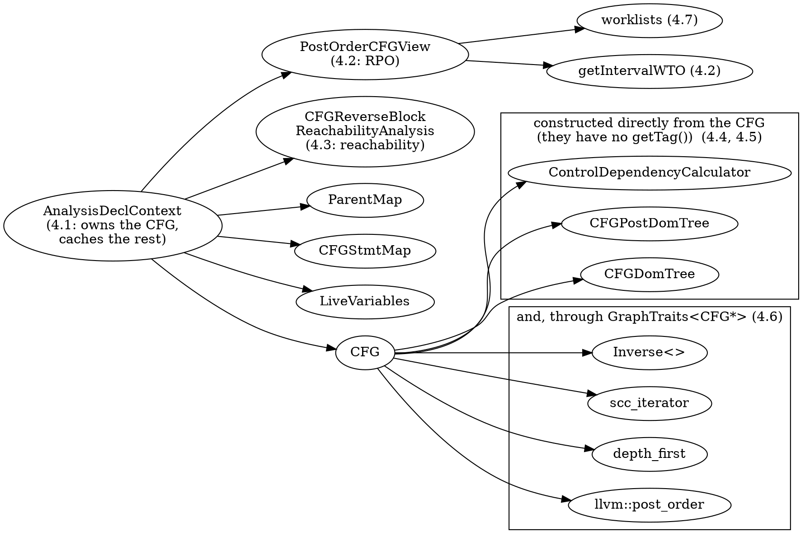
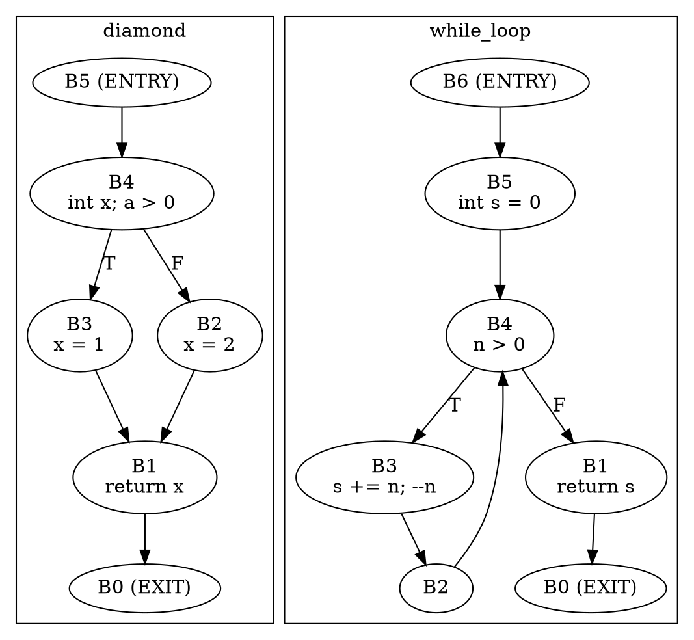
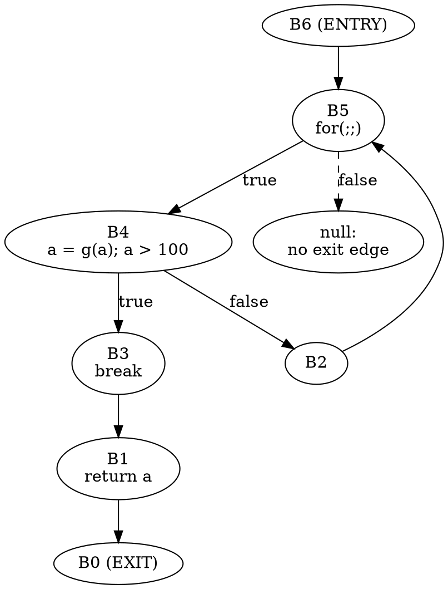
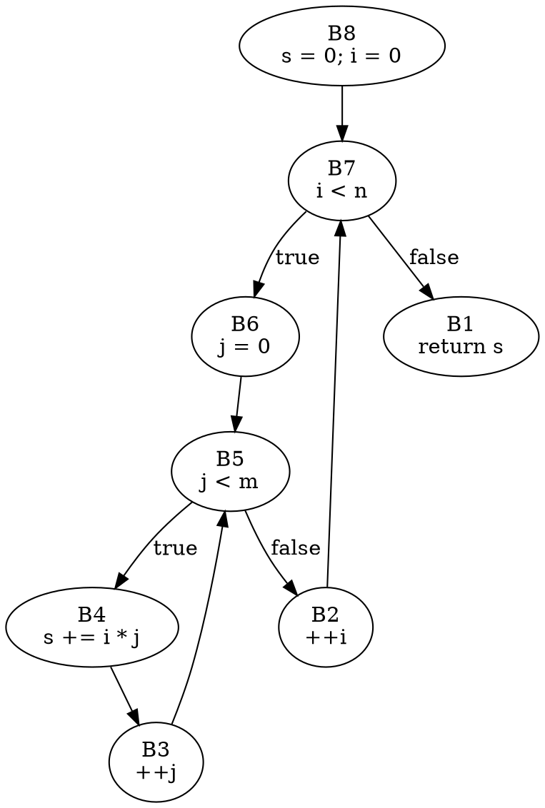
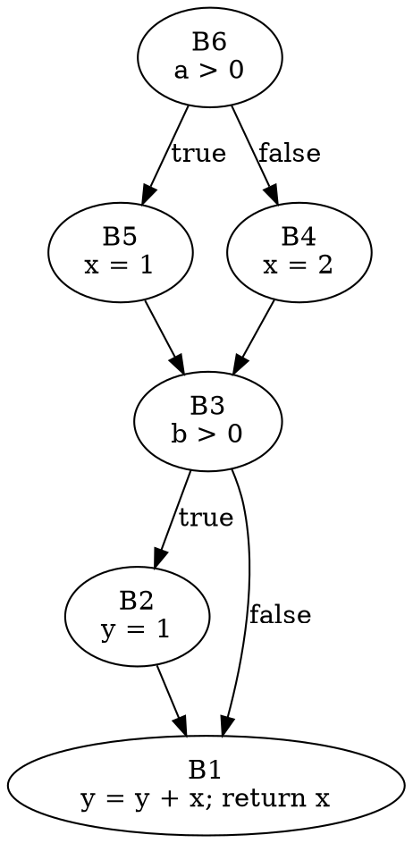
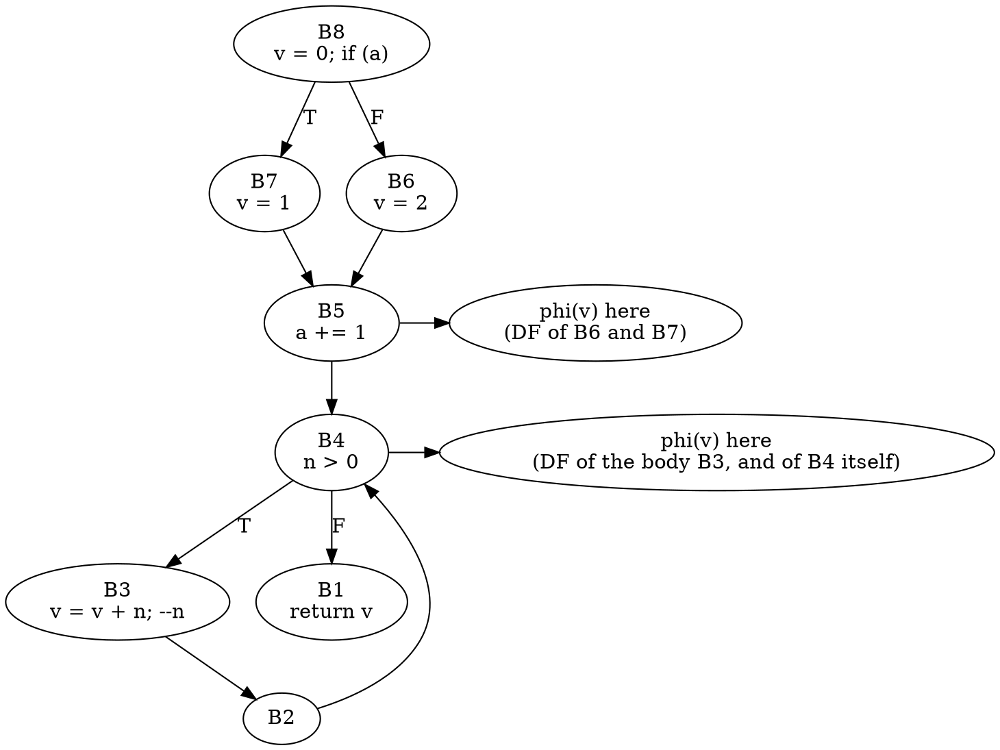

# Part 4 — Graph Algorithms over the CFG

[← Part 3 — C++ Semantics in the CFG](part_3_cxx_semantics.md) | [Part 5 — Classic CFG Analyses →](part_5_classic_analyses.md)

## What You'll Learn

- `AnalysisDeclContext` and its manager: which CFG you get from `getCFG()` versus `getUnoptimizedCFG()`, what is cached, how `getAnalysis<T>()` works and which types can be asked for that way (three, not five)
- Iteration orders: `PostOrderCFGView` (loop-body-first reverse post order), its comparator, and `getIntervalWTO` (a weak topological order that returns `nullopt` for irreducible CFGs)
- Reachability with `CFGReverseBlockReachabilityAnalysis` and `reachable_code::ScanReachableFromBlock`, including what it does with pruned edges and why `isReachable(B, B)` is never a cycle test
- `CFGDomTree` and `CFGPostDomTree`: dominance queries, the null virtual root, back edges, natural loops, nesting depth, and how to recognise an irreducible CFG
- `ControlDependencyCalculator`, dominance frontiers and the iterated dominance frontier (`IDFCalculatorBase`, where SSA phi nodes go), and a toy backward slicer built on both
- LLVM's generic algorithms through `GraphTraits` (`post_order`, `depth_first`, `ReversePostOrderTraversal`, `scc_iterator`, `Inverse`), the null-successor trap, and three ways to detect a cycle
- `ForwardDataflowWorklist`, `BackwardDataflowWorklist`, `WTODataflowWorklist`, and a bit-vector fixpoint solver you write once and run with every worklist

## The Big Picture

Part 2 built a CFG and walked it block by block. Part 4 treats the CFG as what it is mathematically, a directed graph with one entry and one exit, and asks the questions graph theory asks. The answers are what every analysis in Parts 5 and 6 stands on.



| Tool (this part) | Section | Does |
|------------------|---------|------|
| `p04_context` | 4.1 | what `AnalysisDeclContext` builds, when, and what it caches; `BuildOptions` of the manager; late option changes; forced block expressions |
| `p04_orders` | 4.2 | block ids, `PostOrderCFGView` RPO, its comparator, the weak topological order, and `ReversePostOrderTraversal` for contrast |
| `p04_reach` | 4.3 | reachability scan, the whole `isReachable` relation, single queries |
| `p04_dom` | 4.4 | dominator and post-dominator trees, back edges, natural loops, nesting depth, irreducibility, queries, library `dump()` |
| `p04_slice` | 4.5 | control dependences, dominance frontiers and phi placement, a backward slicer |
| `p04_graphs` | 4.6 | LLVM's generic algorithms over a CFG, SCCs, cycle detection, the null-successor trap |
| `p04_solver` | 4.7 | liveness and maybe-uninitialised solvers on every worklist strategy |

All tools take the same sample file, `manifests/p04_graphs.cpp`. Its functions are small and named for what they demonstrate: `straight`, `diamond`, `while_loop`, `nested`, `break_continue`, `irreducible`, `dead_code`, `pruned_if`, `forever`, `slice_demo`, `phi_demo`, `solver_demo`, `solver_chain`. Two shapes you will see all the time:



Block ids are part of every output below. Each tool builds its CFG with `AnalysisDeclContextManager`'s defaults (Section 4.1), so the numbers match the sample as printed here.

---

## Section 4.1 — `AnalysisDeclContext`: lazy CFGs, `getAnalysis<T>`, pruned versus unoptimised

### Why

Clang's own analyses never call `CFG::buildCFG` themselves. They ask an `AnalysisDeclContext` for "the CFG of this function" and for derived products (orders, reachability, liveness), and expect each to be built once. To use or extend those analyses you need to know what is lazy, what is cached, and which options were in force.

### What to Do

**Sample file:** `manifests/p04_graphs.cpp` — thirteen small functions; `pruned_if` has a constant-false condition so the two CFG flavours differ.

Build the tools of this part (one `cmake --build` per tool is fine; no CMake edit is needed):

```bash
scripts/build.sh p04_context p04_orders p04_reach p04_dom p04_slice p04_graphs p04_solver
```

```bash
scripts/build.sh --list | grep '^p04_'
```

```text expected
p04_context
p04_dom
p04_graphs
p04_orders
p04_reach
p04_slice
p04_solver
```

The classes involved, in the order you meet them:

| Object | Created by | Owns / caches |
|--------|-----------|---------------|
| `AnalysisDeclContextManager(ASTContext&, useUnoptimizedCFG=false, addImplicitDtors=false, ...)` | you, once per translation unit | one `AnalysisDeclContext` per `Decl`, and the `CFG::BuildOptions` they all start from |
| `AnalysisDeclContext` | `Manager.getContext(D)` | the CFG(s), `CFGStmtMap`, reachability analysis, `ParentMap`, and every `ManagedAnalysis` |
| `ManagedAnalysis` | `AC->getAnalysis<T>()` | a type-erased slot keyed by `T::getTag()` |

Everything is lazy. `p04_context` asks for each product twice and reports whether the second call returned the same object:

```bash
build/bin/p04_context manifests/p04_graphs.cpp --func=pruned_if
```

```text expected
== pruned_if
getBody() is the FunctionDecl's body: yes
getCFG(): 5 blocks, second call returns the same object: yes
  pruned edges: 1
getUnoptimizedCFG(): 5 blocks, cached: yes, distinct from getCFG(): yes
  pruned edges: 0
getAnalysis<PostOrderCFGView>(): 4 blocks in RPO, cached: yes
getAnalysis<LiveVariables>(): built, cached: yes
getCFGStmtMap(): cached: yes
getCFGReachablityAnalysis() [sic]: cached: yes
ParentMap: yes (same object each call)
```

Read it line by line:

- `getCFG()` and `getUnoptimizedCFG()` are two **different** CFG objects. Both have 5 blocks, but `getCFG()` has one pruned edge (the `if (0)` true edge, an `AdjacentBlock` whose `getReachableBlock()` is null) and the unoptimised one has none. Part 2.5 showed the pruned edge; here is where the choice lives.
- `getAnalysis<PostOrderCFGView>()` has **4** blocks, not 5: the `then` block of `if (0)` is not reachable from ENTRY through non-pruned edges, so the view leaves it out (Section 4.2).
- Everything else is cached: a second call returns the same pointer.

**Which options does the manager start from?** Its constructor has more parameters than you will ever pass, so print the result:

```bash
build/bin/p04_context manifests/p04_graphs.cpp --func=diamond --mode=options
```

```text expected
== diamond
  PruneTriviallyFalseEdges                  true
  AddEHEdges                                false
  AddInitializers                           false
  AddImplicitDtors                          false
  AddLifetime                               false
  AddLoopExit                               false
  AddTemporaryDtors                         false
  AddScopes                                 false
  AddStaticInitBranches                     false
  AddCXXNewAllocator                        true
  AddCXXDefaultInitExprInCtors              false
  AddCXXDefaultInitExprInAggregates         false
  AddRichCXXConstructors                    true
  MarkElidedCXXConstructors                 true
  AddVirtualBaseBranches                    true
  OmitImplicitValueInitializers             false
  AssumeReachableDefaultInSwitchStatements  false
```

Compare with Part 2.3's presets. The manager's defaults are *not* the Sema preset and not the analyzer preset: `AddRichCXXConstructors`, `MarkElidedCXXConstructors`, `AddVirtualBaseBranches` and `AddCXXNewAllocator` default to **true**, everything else except pruning to false. If you want Sema's or the analyzer's CFG, write the preset into `AC->getCFGBuildOptions()` with `cfglab::applyPreset` (never assign a whole `BuildOptions`: `forcedBlkExprs` points into the context).

**The first constructor argument.** `useUnoptimizedCFG=true` clears `PruneTriviallyFalseEdges` in the manager's options:

```bash
build/bin/p04_context manifests/p04_graphs.cpp --func=pruned_if --mgr-unoptimized | sed -n 3,7p
```

```text expected
getCFG(): 5 blocks, second call returns the same object: yes
  pruned edges: 0
getUnoptimizedCFG(): 5 blocks, cached: yes, distinct from getCFG(): no
  pruned edges: 0
getAnalysis<PostOrderCFGView>(): 5 blocks in RPO, cached: yes
```

Now `getCFG()` and `getUnoptimizedCFG()` return the *same object*, with no pruned edges. This is the behaviour of `AnalysisDeclContext::getCFG()`: it re-reads `PruneTriviallyFalseEdges` on every call and delegates to `getUnoptimizedCFG()` when it is false. Which leads to a trap.

**Changing options late.** `getCFGBuildOptions()` is a plain reference. What happens if you change a field after the first `getCFG()`?

```bash
build/bin/p04_context manifests/p04_graphs.cpp --func=pruned_if --mode=late
```

```text expected
== pruned_if
after AddScopes=true, getCFG() returns the same object: yes
after Prune=false, getCFG() returns the same object: no
  ... it is getUnoptimizedCFG(): yes
  pruned edges: first 1, second 0
```

| Change after the first `getCFG()` | Effect |
|-----------------------------------|--------|
| `AddScopes = true` (or any field except pruning) | none: the CFG was built once with the old value and is cached |
| `PruneTriviallyFalseEdges = false` | `getCFG()` now returns a different, unpruned CFG, because the flag is read on every call |

> [!warning] Options are read when the CFG is built, with one exception
> Set every option **before** the first `getCFG()`. The pruning flag alone is read on each call, so flipping it mid-analysis silently changes which graph later callers see, while objects built from the old one (`PostOrderCFGView`, `CFGStmtMap`) keep pointing at the old CFG.

**Forced block expressions.** `registerForcedBlockExpression(const Stmt*)` asks the builder to keep a sub-expression as its own element so that `getBlockForRegisteredExpression` can find the block holding it. Part 2.3 used it through `BuildOptions`; this is the same machinery through the context:

```bash
build/bin/p04_context manifests/p04_graphs.cpp --func=diamond --mode=forced
```

```text expected
== diamond
forced expression: a > 0
block holding it: B4 of 6 blocks
```

**`getAnalysis<T>()` and what `T` may be.** The template needs `T::getTag()` (a unique address) and `static std::unique_ptr<ManagedAnalysis> T::create(AnalysisDeclContext&)`. Search the headers for who provides them:

```bash
grep -rn '^  static const void \*getTag' "${LLVM:-/opt/homebrew/opt/llvm}/include/clang/Analysis" | sed 's|.*/Analysis/||'
```

```text expected
Analyses/LiveVariables.h:100:  static const void *getTag();
Analyses/LiveVariables.h:114:  static const void *getTag();
Analyses/PostOrderCFGView.h:143:  static const void *getTag();
```

Three entries: `PostOrderCFGView`, `LiveVariables`, and `RelaxedLiveVariables` (the second `LiveVariables.h` line). The dominator classes and `ControlDependencyCalculator` *derive from* `ManagedAnalysis` but have no `getTag()`, so `AC->getAnalysis<CFGDomTree>()` does not compile (Section 4.4 shows the error). You construct them from the CFG yourself.

> [!warning] `getAnalysis<>` always works on `getCFG()`
> `PostOrderCFGView::create` and `LiveVariables::create` take the context's **optimised** CFG. There is no way to ask for them over `getUnoptimizedCFG()`; build a `PostOrderCFGView(const CFG*)` directly if you need that.

### Verify

`while_loop` has no constant condition. Predict what the two CFG flavours look like, then check:

```bash
build/bin/p04_context manifests/p04_graphs.cpp --func=while_loop | grep -E 'getCFG\(\)|getUnoptimizedCFG|pruned'
```

### Expected

```text expected
getCFG(): 7 blocks, second call returns the same object: yes
  pruned edges: 0
getUnoptimizedCFG(): 7 blocks, cached: yes, distinct from getCFG(): yes
  pruned edges: 0
```

Same block count, no pruned edges in either, and the objects are still distinct: the two CFGs differ only when something is actually prunable.

> [!hint]- Quiz: why does `getAnalysis<PostOrderCFGView>()` report 4 blocks for `pruned_if` while `getCFG()` has 5?
> What does a pruned edge look like to a walk that starts at ENTRY?

> [!success]- Answer
> The `then` block `B2` has no non-pruned incoming edge, so a traversal from ENTRY never reaches it. `PostOrderCFGView` is a depth-first walk from ENTRY, hence it lists only reachable blocks.

### Common mistakes

| Mistake | Symptom |
|---------|---------|
| Changing `getCFGBuildOptions()` after `getCFG()` | no effect (or, for the pruning flag, a surprise second CFG) |
| Assigning a whole `BuildOptions` to `AC->getCFGBuildOptions()` | `forcedBlkExprs` is lost; `getBlockForRegisteredExpression` returns null |
| Calling `getAnalysis<CFGDomTree>()` | compile error: no member named `getTag` |
| Expecting `getAnalysis<PostOrderCFGView>()` to follow `getUnoptimizedCFG()` | the view is built on the pruned CFG |

### Exercises

1. Run `p04_context --func=forever` with and without `--mgr-unoptimized`. Which line changes, and why does the pruned-edge count stay at 1 in both? (A `for (;;)` has no condition, so the builder never creates its exit edge: that null successor is not the result of pruning.)
2. Look at `AnalysisDeclContext::getCFGReachablityAnalysis` in the header. What is misspelled, and what does that mean for code that must also compile against older Clang?

---

## Section 4.2 — Iteration orders: `PostOrderCFGView` and weak topological order

### Why

A fixpoint analysis visits blocks repeatedly; visiting them in a good order decides how many passes it needs. The CFG's block numbers are *not* a general-purpose order. Clang gives you two ready-made ones.

### What to Do

**Sample file:** `manifests/p04_graphs.cpp` — `while_loop`, `nested`, `dead_code`, `irreducible` and `forever` exercise the orders.

`p04_orders` prints, for each function:

| Line | Source |
|------|--------|
| `ids` | iteration order of `CFG::begin()` (what Part 2 walked) |
| `RPO` | `AC->getAnalysis<PostOrderCFGView>()`, front to back |
| `sorted` | the block list after `std::sort(..., view->getComparator())` |
| `missing` | blocks in the CFG but not in the view |
| `WTO` | `getIntervalWTO(*cfg)`, or `none (irreducible)` |
| `WTOrank` | the number `WTOCompare` stores for each block |
| `llvm RPO` | `llvm::ReversePostOrderTraversal<const CFG*>` for contrast (with `--vs-llvm`) |

```bash
build/bin/p04_orders manifests/p04_graphs.cpp --func=while_loop --vs-llvm
```

```text expected
== while_loop: 7 blocks
ids     : B0 B1 B2 B3 B4 B5 B6
RPO     : B6 B5 B4 B3 B2 B1 B0
sorted  : B6 B5 B4 B3 B2 B1 B0   (std::sort with getComparator())
missing : -
WTO     : B6 B5 B4 B3 B1 B2 B0
WTOrank : B6=1 B5=2 B4=3 B3=4 B1=5 B2=6 B0=7
llvm RPO: B6 B5 B4 B1 B0 B3 B2
```

Three things to read off `while_loop` (`B4` is the loop header, `B3` the body, `B2` the empty block that jumps back, `B1` the exit path):

```
 PostOrderCFGView RPO :  B6 B5 B4 B3 B2 B1 B0      body (B3, B2) before exit path (B1)
 llvm RPO (default)   :  B6 B5 B4 B1 B0 B3 B2      exit path first, body last
 WTO                  :  B6 B5 B4 B3 B1 B2 B0      body block B3, then the exit B1, then the back-jump block B2
```

1. **`PostOrderCFGView` is a reverse post order with a twist.** It iterates successors *in reverse* (`CFGLoopBodyFirstTraits`, in the header), because the CFG lists the loop body as successor 0 of a loop condition. A plain RPO would put the loop exit before the body. The twist puts the body first, which means a forward analysis settles the body before it looks at what follows the loop. Compare the first two lines.
2. **The order is nearly the descending block id.** The builder numbers blocks so that ids decrease along the program (ENTRY is the highest id). For these functions `RPO` is exactly `ids` reversed, but not always; see `forever` below.
3. **`sorted` equals `RPO`.** `getComparator()` is a strict ordering `cmp(a, b)` meaning "a comes before b in the view". `ForwardDataflowWorklist` flips it for a priority queue (Section 4.7).

**The weak topological order** is different. `getIntervalWTO` (declared in `IntervalPartition.h`, Bourdoncle's idea built on interval partitioning) returns a `std::vector<const CFGBlock*>`, **not** a nested structure, and returns `std::nullopt` when the CFG is irreducible. It differs from the RPO in how it orders the inside of a loop:

```bash
build/bin/p04_orders manifests/p04_graphs.cpp --func=nested | grep -E '^RPO|^WTO'
```

```text expected
RPO     : B9 B8 B7 B6 B5 B4 B3 B2 B1 B0
WTO     : B9 B8 B7 B6 B1 B0 B5 B4 B2 B3
WTOrank : B9=1 B8=2 B7=3 B6=4 B1=5 B0=6 B5=7 B4=8 B2=9 B3=10
```

In the nested loop (`B7` outer header, `B5` inner header) the RPO is simply every block from `B9` down to `B0`. The WTO is `B9 B8 B7 B6 B1 B0 B5 B4 B2 B3`: the exit path `B1 B0` is listed *before* the inner loop's blocks, and the inner body `B4` comes before the increment blocks `B2` and `B3`. A WTO exists for **iteration with widening**: it is the order in which an interval-based solver wants to be offered work, with each loop header ahead of its own body. It is not a program-order listing, and you cannot read component boundaries out of it: there are none (`IntervalPartition.h` declares only `using WeakTopologicalOrdering = std::vector<const CFGBlock *>`).

`WTOCompare` turns the vector into a priority: it stores, per block id, the block's 1-based position in the WTO, and compares with `>` so that the block *earliest* in the WTO is dequeued first from a max-heap:

```bash
build/bin/p04_orders manifests/p04_graphs.cpp --func=break_continue | grep -E '^WTO'
```

```text expected
WTO     : B10 B9 B8 B7 B6 B5 B4 B3 B1 B2 B0
WTOrank : B10=1 B9=2 B8=3 B7=4 B6=5 B5=6 B4=7 B3=8 B1=9 B2=10 B0=11
```

**Unreachable blocks are absent from both orders.** `dead_code` has a block (`B1`) that nothing jumps to:

```bash
build/bin/p04_orders manifests/p04_graphs.cpp --func=dead_code
```

```text expected
== dead_code: 4 blocks
ids     : B0 B1 B2 B3
RPO     : B3 B2 B0
sorted  : B3 B2 B0 B1   (std::sort with getComparator())
missing : B1
WTO     : B3 B2 B0
WTOrank : B3=1 B2=2 B0=3
```

`missing` names `B1`. `sorted` puts it last: a block that the view never saw loses every comparison. Any analysis driven by the view silently skips dead code, which is what you want for most analyses and not what you want for a "report unreachable code" analysis (that one needs the CFG itself, Part 5).

**Irreducible CFGs.** `irreducible` has a `goto` into the middle of a loop, so the loop has two entries. A CFG is reducible when every cycle has a single entry (equivalently: every retreating edge is a back edge, Section 4.4). The interval partition cannot collapse such a graph to one node:

```bash
build/bin/p04_orders manifests/p04_graphs.cpp --func=irreducible
```

```text expected
== irreducible: 8 blocks
ids     : B0 B1 B2 B3 B4 B5 B6 B7
RPO     : B7 B6 B5 B4 B3 B2 B1 B0
sorted  : B7 B6 B5 B4 B3 B2 B1 B0   (std::sort with getComparator())
missing : -
WTO     : none (irreducible)
```

`PostOrderCFGView` still produces an order (every CFG has a reverse post order); only `getIntervalWTO` gives up.

**`forever`**, a `for (;;)` with one `break`, is the case where the RPO is not the descending id order:

```bash
build/bin/p04_orders manifests/p04_graphs.cpp --func=forever | sed -n 2,3p
```

```text expected
ids     : B0 B1 B2 B3 B4 B5 B6
RPO     : B6 B5 B4 B3 B1 B0 B2
```

The `break` path `B3 B1 B0` is listed before the loop's back-jump block `B2`, so EXIT (`B0`) is not the last block of the view. Successor 0 of the `if` in `B4` is the `break`, and the view's reversed child order finishes it last in the post order, hence first in the RPO.

> [!warning] A pruned edge is a null successor
> `llvm::ReversePostOrderTraversal<const CFG*>` walks `succs()` and hands null pointers to its visitor for a pruned edge and for the missing exit edge of a condition-less `for (;;)`. `p04_orders --vs-llvm` therefore skips the comparison for CFGs with null successors. `PostOrderCFGView::CFGBlockSet::insert` has the explicit null check that makes it safe. Section 4.6 shows what the unguarded traversal does.

### Verify

Which of the sample functions have a `PostOrderCFGView` that is exactly the block ids in descending order? Predict, then compute (`ids` reversed against `RPO`):

```bash
for f in straight diamond while_loop nested break_continue irreducible dead_code forever; do
  build/bin/p04_orders manifests/p04_graphs.cpp --func=$f |
    awk -v f=$f '/^ids/ {r=""; for (i=NF; i>=3; i--) r = r " " $i}
                 /^RPO/ {s=""; for (i=3; i<=NF; i++) s = s " " $i; print f ": " (s == r ? "descending ids" : "different")}'
done
```

### Expected

```text expected
straight: descending ids
diamond: descending ids
while_loop: descending ids
nested: descending ids
break_continue: descending ids
irreducible: descending ids
dead_code: different
forever: different
```

Only the functions whose CFG has a missing block (`dead_code`) or an exit reached early (`forever`) differ. The descending-id property is a by-product of how the builder numbers blocks, not a promise; use the view.

> [!hint]- Quiz: why does the view iterate successors in reverse?
> Which successor of a loop condition block is the body, and what would a plain RPO do with it?

> [!success]- Answer
> Successor 0 of a loop condition is the body and successor 1 the exit. A plain depth-first post order finishes the last-visited successor first, so the reversed order would place the exit path before the body. Reversing the child order makes the body come first in the RPO, which saves a fixpoint analysis from computing the exit path's facts too early and redoing them.

### Common mistakes

| Mistake | Symptom |
|---------|---------|
| Using block ids as an iteration order | works for simple code, wrong for `forever`-like shapes and after any change to the builder |
| Expecting every block in the view | unreachable blocks are missing; `dead_code`'s `B1` |
| Treating `getIntervalWTO`'s result as always present | `std::optional` is empty for irreducible CFGs; check it |
| Reading loop nesting out of the WTO vector | there is no nesting information, only an order |

### Exercises

1. Run `p04_orders` on `break_continue`. Is its RPO descending ids? Is its WTO the same as its RPO? Where do they first differ?
2. Add a function with a `switch` inside a loop to a scratch copy of the sample (under `out/`) and check whether `getIntervalWTO` still succeeds.

---

## Section 4.3 — Reachability

### Why

"Can control get from here to there?" is the question behind unreachable-code warnings, "is this call on every path to the exit", and the later slicer. Clang has two tools for it and they disagree about exactly one thing: what a pruned edge is.

### What to Do

**Sample file:** `manifests/p04_graphs.cpp` — `dead_code`, `pruned_if`, `forever`, `while_loop`.

The two APIs:

| API | Header | Question |
|-----|--------|----------|
| `reachable_code::ScanReachableFromBlock(const CFGBlock *Start, llvm::BitVector &Reachable)` | `Analyses/ReachableCode.h` | "mark everything reachable *from* `Start`"; returns how many blocks it marked |
| `CFGReverseBlockReachabilityAnalysis(const CFG&)`, `isReachable(Src, Dst)` | `Analyses/CFGReachabilityAnalysis.h` | "can `Dst` be reached from `Src`", answered per destination |

The second is created by `AC->getCFGReachablityAnalysis()` (the spelling in the header). It is lazy and cached **per destination**: the first `isReachable(?, D)` walks backwards from `D` and stores a bit vector of everything that reaches `D`; later queries about `D` are a bit test. Hence the name *reverse* block reachability.

`p04_reach` prints the scan from ENTRY (`scan`, `dead`), what the analysis says when you ask each block about itself (`self`), blocks that really are on a cycle (`cycle`), and, with `--matrix`, one line per block listing every destination it can reach:

```bash
build/bin/p04_reach manifests/p04_graphs.cpp --func=dead_code --matrix
```

```text expected
== dead_code: 4 blocks
scan    : 3 reachable from entry: B0 B2 B3
dead    : B1
self    : -
cycle   : -
B0  -> -
B1  -> B0
B2  -> B0
B3  -> B0 B2
```

`B1` is the code after `return a;`. It reaches EXIT (`B1 -> B0`) but no path from ENTRY reaches it (`dead: B1`). The scan from ENTRY and the all-pairs relation agree.

**Pruned edges are not edges.**

```bash
build/bin/p04_reach manifests/p04_graphs.cpp --func=pruned_if --matrix
```

```text expected
== pruned_if: 5 blocks
scan    : 4 reachable from entry: B0 B1 B3 B4
dead    : B2
self    : -
cycle   : -
B0  -> -
B1  -> B0
B2  -> B0 B1
B3  -> B0 B1
B4  -> B0 B1 B3
```

`B3` is the `0` condition, `B2` the `then` block (`a = g(a)`), `B1` the join. `B2 -> B1` exists, but `B3 -> B2` does not: the analysis follows `succs()` and skips the null that the pruned edge yields. The scan agrees (`dead: B2`). That is the right answer for "is this code dead" and the wrong one for "what if the condition were not constant"; for the latter build with `getUnoptimizedCFG()`.

> [!warning] `isReachable(B, B)` is not a cycle test
> You might expect `isReachable(B, B)` to be true for a block on a loop. Run `while_loop`:

```bash
build/bin/p04_reach manifests/p04_graphs.cpp --func=while_loop | sed -n 2,5p
```

```text expected
scan    : 7 reachable from entry: B0 B1 B2 B3 B4 B5 B6
dead    : -
self    : -
cycle   : B2 B3 B4
```

The `self` line is empty although `B2 B3 B4` are on the loop (`cycle` line). `mapReachability(Dst)` starts its backward walk at `Dst`, marks it visited, and records only the blocks it reaches *afterwards*, so `Dst` is never recorded, even when a cycle leads back to it. To test for a cycle use the correct formulation printed on the `cycle` line: block `B` is on a cycle iff some successor `S` satisfies `S == B || isReachable(S, B)`.

**Queries.** `--from` and `--to` ask one question; `forever` has an exit that only the `break` reaches:

```bash
build/bin/p04_reach manifests/p04_graphs.cpp --func=forever --from=6 --to=0
build/bin/p04_reach manifests/p04_graphs.cpp --func=forever --from=0 --to=6
```

```text expected
== forever: 7 blocks
isReachable(B6, B0) = true
== forever: 7 blocks
isReachable(B0, B6) = false
```

The first ENTRY-to-EXIT query is true, the reverse false. The missing exit edge of `for (;;)` (a null successor in `B5`) is never followed; `B0` is reachable only through `break`.



### Verify

Predict the `scan` and `dead` lines for `forever`, then run:

```bash
build/bin/p04_reach manifests/p04_graphs.cpp --func=forever | sed -n 2,5p
```

### Expected

```text expected
scan    : 7 reachable from entry: B0 B1 B2 B3 B4 B5 B6
dead    : -
self    : -
cycle   : B2 B4 B5
```

Nothing is dead: the loop is infinite only in the sense that the condition is constant; the `break` still reaches EXIT. `cycle` names `B2 B4 B5`, the loop (header `B5`, body test `B4`, back-jump `B2`).

> [!hint]- Quiz: why is the analysis cheap even when you ask many questions?
> What does it store, and for how many destinations?

> [!success]- Answer
> One `BitVector` per *destination* that was queried, filled by one backward walk. Many sources against the same destination cost one walk. The worst case is one walk per block, O(N*(N+E)) for the whole relation, which is what `--matrix` triggers.

### Common mistakes

| Mistake | Symptom |
|---------|---------|
| Using `isReachable(B, B)` for loop detection | always false |
| Expecting pruned edges to count | `pruned_if`: the `then` block is not reachable |
| Running `ScanReachableFromBlock` with a `BitVector` sized for the wrong CFG | out of range write; size it with `cfg->getNumBlockIDs()` |
| Calling it on an AST that has `AddEHEdges` off and expecting `catch` to be reachable | handlers look dead (Part 2.3) |

### Exercises

1. Run `p04_reach --func=irreducible --matrix`. Which blocks reach themselves through two different routes? (`cycle` lists them.)
2. Which function in the sample has a block that reaches EXIT but is not reachable from ENTRY? Is there any function with the opposite, a block reachable from ENTRY that cannot reach EXIT? Check `--matrix` on `forever` before you answer.

---

## Section 4.4 — Dominators, post-dominators and natural loops

### Why

Block `D` *dominates* `B` if every path from ENTRY to `B` goes through `D`. That one definition gives you loop detection (a back edge goes to a dominator), safe code motion, and the dominance frontier of Section 4.5. Post-dominance is the same idea toward EXIT and is what control dependence is made of.

### What to Do

**Sample file:** `manifests/p04_graphs.cpp` — `diamond`, `while_loop`, `nested`, `irreducible`, `dead_code`.

The classes (`Analyses/Dominators.h`):

| Item | Meaning |
|------|---------|
| `CFGDomTree` = `CFGDominatorTreeImpl<false>` | dominator tree, built by the constructor `CFGDomTree DT(cfg)` |
| `CFGPostDomTree` = `CFGDominatorTreeImpl<true>` | post-dominator tree |
| `getBase()` | the underlying `llvm::DominatorTreeBase<CFGBlock, IsPostDom>`: `getNode(B)`, `getIDom()`, children |
| `getRoot()`, `getRootNode()` | root block / root node |
| `dominates(A, B)`, `properlyDominates(A, B)` | a block dominates itself; `properlyDominates` excludes that |
| `findNearestCommonDominator(A, B)` | nearest common ancestor in the tree |
| `isReachableFromEntry(B)` | false for a block that no path from ENTRY reaches |
| `dump()`, `print(OS)` | `dump()` writes `(Node#,IDom#)` lines to stderr |

`p04_dom` prints both trees, the immediate dominator of every block, back edges grouped into natural loops, and a check for retreating edges that are not back edges. Start with `diamond`:

```bash
build/bin/p04_dom manifests/p04_graphs.cpp --func=diamond
```

```text expected
== diamond: 6 blocks
root    : dom=B5 postdom=B0
idom    : B0<-B1  B1<-B4  B2<-B4  B3<-B4  B4<-B5  B5=root
dom tree:
  B5
    B4
      B1
        B0
      B2
      B3
ipdom   : B0<-<virtual>  B1<-B0  B2<-B1  B3<-B1  B4<-B1  B5<-B4
pdom tree:
  <virtual>
    B0
      B1
        B2
        B3
        B4
          B5
loops   : none
retreat : every retreating edge is a back edge (reducible)
```

Read the dominator tree as the "who must run before me" tree: `B4` (the `a > 0` test) dominates both arms and the join `B1`; neither arm dominates the join, because the other arm reaches it too. Read the post-dominator tree the other way: `B1` post-dominates `B2`, `B3` and `B4`, because every path from them goes through `B1`.

> [!warning] The post-dominator tree has a virtual root
> The tree's root node (`getRootNode()`) has a **null block**; it exists so that a CFG with several exits has a single root. `getRoot()` returns the first real root, `B0`. Any code that walks `getIDom()->getBlock()` upward must stop at null. This is why `p04_dom` prints `B0<-<virtual>` for EXIT, and why the library's own `dump()` has the comment "LLVM's Dominator tree builder uses nullpointers to signify the virtual root".

**Queries.**

```bash
build/bin/p04_dom manifests/p04_graphs.cpp --func=diamond --query=2,3
build/bin/p04_dom manifests/p04_graphs.cpp --func=diamond --query=4,0
```

```text expected
== diamond: 6 blocks
dominates(B2, B3) = 0
properlyDominates(B2, B3) = 0
post: dominates(B2, B3) = 0
nearest common dominator: B4
nearest common post-dominator: B1
== diamond: 6 blocks
dominates(B4, B0) = 1
properlyDominates(B4, B0) = 1
post: dominates(B4, B0) = 0
nearest common dominator: B0
nearest common post-dominator: B0
```

The two arms do not dominate each other; their nearest common dominator is `B4` and their nearest common post-dominator is `B1`. `B4` properly dominates EXIT.

**Back edges and natural loops.** An edge `u -> h` is a *back edge* if `h` dominates `u`. Its *natural loop* is `h` plus every block that can reach `u` without passing through `h`. Two back edges with the same header form one loop. Nesting depth is the number of loops that contain a loop's header.

```bash
build/bin/p04_dom manifests/p04_graphs.cpp --func=nested | grep -E '^(loop|retreat)'
```

```text expected
loop    : header B5 depth 2 back-edges from B3 body {B3 B4 B5}
loop    : header B7 depth 1 back-edges from B2 body {B2 B3 B4 B5 B6 B7}
retreat : every retreating edge is a back edge (reducible)
```

Inner loop: header `B5` (`j < m`), back edge from `B3` (`++j`). Outer loop: header `B7` (`i < n`), back edge from `B2` (`++i`), body containing the whole inner loop. The inner header has depth 2.



**Irreducible CFGs.** DFS from ENTRY marks some edges *retreating* (they point to a block still on the DFS stack). In a reducible CFG every retreating edge is a back edge. `irreducible` is built so that one is not:

```bash
build/bin/p04_dom manifests/p04_graphs.cpp --func=irreducible | grep -E '^(idom|loops|retreat)'
```

```text expected
idom    : B0<-B1  B1<-B3  B2<-B3  B3<-B6  B4<-B6  B5<-B6  B6<-B7  B7=root
loops   : none
retreat : B4 -> B3 goes back in DFS but B3 does not dominate B4 (irreducible)
```

No block dominates the "loop" `{B2, B3, B4}` as a whole: it can be entered at `B3` (from `B5`, the `goto L1`) and at `B4` (from `B6`). So there is no back edge, `loops: none`, and the DFS finds a retreating edge `B4 -> B3` whose target does not dominate its source. That is the definition of irreducible; it is also exactly the condition under which `getIntervalWTO` returned `nullopt` in Section 4.2.

**Cross-check with the Static Analyzer.** `debug.DumpDominators` prints the same `(Node#,IDom#)` lines. Its checkers print no function name, so use the one-function file `manifests/p04_small.cpp` (a copy of `while_loop`):

```bash
CHECKER=debug.DumpDominators scripts/dumpcfg.sh manifests/p04_small.cpp
```

```text expected
Immediate dominance tree (Node#,IDom#):
(0,1)
(1,4)
(2,3)
(3,4)
(4,5)
(5,6)
(6,6)
```

```bash
build/bin/p04_dom manifests/p04_small.cpp --dump --no-loops 2>&1 | sed -n '/^Immediate dominance/,$p' | sed -n 1,8p
```

```text expected
Immediate dominance tree (Node#,IDom#):
(0,1)
(1,4)
(2,3)
(3,4)
(4,5)
(5,6)
(6,6)
```

The tool's `DT.dump()` and the checker print the same pairs. In both, the root maps to itself (`(6,6)`), the convention `dump()` uses instead of a null.

**Construct, do not ask.** The dominator classes derive from `ManagedAnalysis`, tempting you to write `AC->getAnalysis<CFGDomTree>()`:

```bash
LLVM=/opt/homebrew/opt/llvm; cat > out/p04_gettag.cpp <<'EOF'
#include "clang/Analysis/Analyses/Dominators.h"
#include "clang/Analysis/AnalysisDeclContext.h"
void f(clang::AnalysisDeclContext &AC) { AC.getAnalysis<clang::CFGDomTree>(); }
EOF
$LLVM/bin/clang++ -std=c++20 -fno-rtti -stdlib=libc++ -I$LLVM/include -fsyntax-only out/p04_gettag.cpp 2>&1 | grep -E 'error:' | sed -E 's/^[^ ]+ //' | head -2
```

```text expected
error: no member named 'getTag' in 'clang::CFGDominatorTreeImpl<false>'
```

> [!warning] `dump()` hangs on a CFG with an unreachable block
> `dump()` calls `DT.getNode(B)->getIDom()` for every block of the CFG. For a block that no path from ENTRY reaches there is no tree node, `getNode` returns null, and the dereference does not fail cleanly: in this build the process spins forever (the same hang takes down `debug.DumpDominators` on a file containing `dead_code`, which is why `p04_small.cpp` exists). The run below is limited to five seconds with `alarm`; it prints the first dump header and one line, then is killed:

```bash
perl -e 'alarm 5; exec @ARGV' build/bin/p04_dom manifests/p04_graphs.cpp --func=dead_code --dump --no-loops 2>&1 | tail -2
```

```text expected
Immediate dominance tree (Node#,IDom#):
(0,2)
```

The tool's own `idom` line handles this case: `B1<-?` means "not in the tree".

```bash
build/bin/p04_dom manifests/p04_graphs.cpp --func=dead_code | grep '^idom'
```

```text expected
idom    : B0<-B2  B1<-?  B2<-B3  B3=root
```

Always test `isReachableFromEntry(B)` (or `getNode(B) != nullptr`) before asking a tree about a block.

### Verify

Which functions of the sample have back edges, and what is the deepest nesting? Predict from the code, then run:

```bash
for f in straight diamond while_loop nested break_continue forever; do
  echo "$f: $(build/bin/p04_dom manifests/p04_graphs.cpp --func=$f | grep -c '^loop ') loop(s)"
done
```

### Expected

```text expected
straight: 0 loop(s)
diamond: 0 loop(s)
while_loop: 1 loop(s)
nested: 2 loop(s)
break_continue: 1 loop(s)
forever: 1 loop(s)
```

`nested` has two loops; `break_continue` and `forever` have one each (the `continue`, `break` and `++i` all share one header). `for (;;)` is a loop even though its condition block is empty.

> [!hint]- Quiz: why is `B2 -> B4` in `while_loop` a back edge, but `B4 -> B3` in `irreducible` (with the loop entered from the side) is not?
> Which block must dominate the source for a back edge?

> [!success]- Answer
> A back edge `u -> h` needs `h` to dominate `u`. In `while_loop` every path to the body goes through the header. In `irreducible`, `B4` can be reached from `B6` without passing through `B3`, so `B3` does not dominate `B4`.

### Common mistakes

| Mistake | Symptom |
|---------|---------|
| `getAnalysis<CFGDomTree>()` | compile error, no `getTag` |
| Calling `dump()` or `getNode(B)->getIDom()` on a CFG with unreachable blocks | null dereference / hang |
| Walking up the post-dominator tree without checking for the null virtual root | crash at EXIT |
| Assuming the entry block's `getIDom()` is itself | it is null; `dump()` prints `(root, root)` by convention |
| Equating "has a cycle" with "has a natural loop" | irreducible cycles have no back edge |

### Exercises

1. In `break_continue`, name the back edge and say which block is the header. Then predict, and check with `--query`, whether the `break` block dominates the exit path.
2. A natural loop's header dominates every block of the body. Write the one-line check using `DT.dominates` and add it to a copy of `p04_dom` (under `out/`, not in the tool) to verify it holds for `nested`.

---

## Section 4.5 — Control dependence and a program-slicing toy

### Why

Data dependence says which assignments feed a value; **control dependence** says which branches decide whether a statement runs at all. Together they are the edges of a program dependence graph, and a backward walk over them is a slice. The tool for control dependence is built on the post-dominator tree and on the *iterated dominance frontier*, which is also the answer to "where do SSA phi nodes go".

### What to Do

**Sample file:** `manifests/p04_graphs.cpp` — `slice_demo` (slicing), `while_loop` (self-dependence), `phi_demo` (phi placement), `solver_chain` (a slice that needs several rounds).

`ControlDependencyCalculator(CFG*)` (in `Dominators.h`) holds a `CFGPostDomTree` and an `IDFCalculatorBase<CFGBlock, true>`. For block `A`:

- `getControlDependencies(A)` returns the blocks `A` is control dependent on, computed lazily as the IDF of `{A}` on the post-dominator tree;
- `isControlDependent(A, B)` is a membership test on that;
- `dump()` prints `(Node#,Dependency#)` pairs to stderr.

`B` is a control dependence of `A` when `B` has a branch where one outcome always reaches `A` and another may avoid it. `p04_slice` prints each block with its dependencies and the condition of each:

```bash
build/bin/p04_slice manifests/p04_graphs.cpp --func=slice_demo
```

```text expected
== slice_demo: 8 blocks
B0  depends on: -
B1  depends on: -
B2  depends on: B3 [IfStmt: b > 0]
B3  depends on: -
B4  depends on: B6 [IfStmt: a > 0]
B5  depends on: B6 [IfStmt: a > 0]
B6  depends on: -
```

Reading it with the code of `slice_demo` (`B6` tests `a > 0`, its arms are `B5: x = 1` and `B4: x = 2`; `B3` tests `b > 0`, its only arm is `B2: y = 1`; `B1` is the join with `return x`):



- `B5` and `B4` depend on `B6`: whether they run is decided by `a > 0`.
- `B2` depends on `B3`.
- `B3` and `B1` depend on **nothing**. Every path goes through them; they are the joins. That is the whole point of post-dominance: `B3` post-dominates `B6`, so `B6` does not control it.

**A loop controls itself.**

```bash
build/bin/p04_slice manifests/p04_graphs.cpp --func=while_loop --dump 2>&1 | sed -n '/^Control/,$p'
```

```text expected
Control dependencies (Node#,Dependency#):
(2,4)
(3,4)
(4,4)
```

`(4,4)`: the loop header depends on itself, because whether the header runs *again* is decided by its own condition. The body (`B3`, `B2`) depends on the header too. Compare with the checker:

```bash
CHECKER=debug.DumpControlDependencies scripts/dumpcfg.sh manifests/p04_small.cpp
```

```text expected
Control dependencies (Node#,Dependency#):
(2,4)
(3,4)
(4,4)
```

**Dominance frontiers and phi placement.** The dominance frontier `DF(N)` of a block is the set of blocks `Y` where `N`'s dominance *ends*: `N` dominates a predecessor of `Y` but does not strictly dominate `Y`. The *iterated* DF of the blocks that assign a variable is exactly where SSA construction puts phi nodes (Cytron et al.). `IDFCalculatorBase<CFGBlock, false>` computes it on the dominator tree; `p04_slice --mode=df` computes `DF` by the definition and the IDF both ways:

```bash
build/bin/p04_slice manifests/p04_graphs.cpp --func=phi_demo --mode=df --var=v
```

```text expected
== phi_demo: 10 blocks
DF(B0)  = {}
DF(B1)  = {}
DF(B2)  = {B4}
DF(B3)  = {B4}
DF(B4)  = {B4}
DF(B5)  = {}
DF(B6)  = {B5}
DF(B7)  = {B5}
DF(B8)  = {}
DF(B9)  = {}
blocks assigning 'v': B3 B6 B7 B8
IDFCalculatorBase phi blocks: B4 B5
closure of DF by hand:      B4 B5
```

In `phi_demo`, `v` is assigned in `B8` (`int v = 0`), the two arms (`B7`, `B6`) and the loop body (`B3`). The arms' frontier is the join `B5` (`a += 1`), so `v` needs a phi there; the body's frontier is the loop header `B4`, so `v` needs a phi there too. `IDFCalculatorBase` and the hand-written closure of `DF` agree.



> [!hint] A cheaper phi set
> `IDFCalculatorBase::setLiveInBlocks` restricts the result to blocks where the variable is live on entry (pruned SSA). Without it you get semi-pruned placement, as here.

**A slicer in sixty lines.** The tool combines the pieces. Criterion: the value of variable `V` at the function's last `return`. Algorithm (a fixpoint):

1. `relevant = {V}`; the slice starts with the `return` statement.
2. **Data:** every statement in a block that can reach the criterion (reachability, Section 4.3) and defines a relevant variable joins the slice, and the variables it uses become relevant.
3. **Control:** for every block in the slice, each block in `getControlDependencies` joins, with its branch condition, and the condition's variables become relevant.
4. Repeat until nothing changes.

```bash
build/bin/p04_slice manifests/p04_graphs.cpp --func=slice_demo --mode=slice --var=x
```

```text expected
== slice_demo: 8 blocks
criterion: 'x' at line 101 (return x) in B1
fixpoint after 2 rounds; relevant variables: {a, x}
slice (5 statements):
  line 92: int x = 0
  line 94: (IfStmt) a > 0
  line 95: x = 1
  line 97: x = 2
  line 101: return x
```

`b`, `y = 1` and `y = y + x` are gone: `return x` does not depend on them. The branch `a > 0` is in the slice because `x = 1` and `x = 2` are control dependent on it. Ask for `y` instead (same return, different criterion variable):

```bash
build/bin/p04_slice manifests/p04_graphs.cpp --func=slice_demo --mode=slice --var=y
```

```text expected
== slice_demo: 8 blocks
criterion: 'y' at line 101 (return x) in B1
fixpoint after 2 rounds; relevant variables: {a, b, x, y}
slice (9 statements):
  line 92: int x = 0
  line 93: int y = 0
  line 94: (IfStmt) a > 0
  line 95: x = 1
  line 97: x = 2
  line 98: (IfStmt) b > 0
  line 99: y = 1
  line 100: y = y + x
  line 101: return x
```

Now `b > 0` and `y = 1` are in, and `x` and its branch come with `y = y + x`.

Slices can need several rounds because a dependence discovered late can pull in statements an earlier pass already skipped. `solver_chain` passes values around a loop one `if` per iteration:

```bash
build/bin/p04_slice manifests/p04_graphs.cpp --func=solver_chain --mode=slice --var=a | sed -n 2,3p
```

```text expected
criterion: 'a' at line 148 (return a + b + c + d) in B1
fixpoint after 5 rounds; relevant variables: {a, b, c, d, i, n}
```

> [!warning] This is a toy
> It is flow-insensitive about *which* definition reaches the criterion (any definition on a path to it counts), works at statement granularity inside blocks, has no alias or pointer handling, and ignores the order of statements within a block. Part 5's reaching-definitions and liveness analyses are the principled version; the lesson here is how the three graph results (reachability, post-dominance, IDF) compose.

### Verify

`isControlDependent` should agree with the table above. Predict which blocks of `slice_demo` have no dependence at all, then check:

```bash
build/bin/p04_slice manifests/p04_graphs.cpp --func=slice_demo | grep -E 'depends on: -'
```

### Expected

```text expected
B0  depends on: -
B1  depends on: -
B3  depends on: -
B6  depends on: -
```

`B0` (EXIT), `B1`, `B3` and `B6` run on every execution; `B7`, ENTRY, is omitted from the table. A block with no control dependence is a block every path executes (or, as for EXIT, a block with no branch above it).

> [!hint]- Quiz: why is the loop header `B4` in `while_loop` control dependent on itself?
> After the body finishes, what decides whether the header runs a second time?

> [!success]- Answer
> The header's own conditional branch. One outcome (true) leads to the body and then back to the header; the other (false) leaves. By the definition of control dependence, the header decides whether the header is executed again, so it appears in its own set.

### Common mistakes

| Mistake | Symptom |
|---------|---------|
| Reading control dependence as "dominated by a branch" | a join is dominated by the branch but is not control dependent on it |
| Expecting `B` to appear among its own dependencies only for loops | true: only blocks that can reach themselves show `(n,n)` |
| Constructing `ControlDependencyCalculator` on a CFG with unreachable blocks and calling `dump()` | the same hang as Section 4.4 |
| Using the IDF of defs as the *final* phi set | it is a superset when the variable is not live at the join |

### Exercises

1. Run `--mode=slice --var=n` on `while_loop`. Why does the slice contain the decrement but not `s += n`?
2. In `phi_demo`, `a += 1` defines `a`. Run `--mode=df --var=a`. Where does `a` need a phi, and why not in the loop?

---

## Section 4.6 — LLVM's generic graph algorithms through `GraphTraits`

### Why

Clang's CFG plugs into LLVM's graph library through `GraphTraits`. Once you see how, you can call `post_order`, `scc_iterator` and every other algorithm in `llvm/ADT` on a CFG, or on a graph you build yourself. There is one trap, and it is the same null successor as in 4.2.

### What to Do

**Sample file:** `manifests/p04_graphs.cpp` — `while_loop`, `irreducible`, `nested`, `pruned_if`.

`CFG.h` specialises `llvm::GraphTraits` for `CFGBlock*`, `const CFGBlock*`, `CFG*`, `const CFG*` and for `Inverse<>` of each:

| Algorithm | Header | CFG call |
|-----------|--------|----------|
| post order | `PostOrderIterator.h` | `llvm::post_order(cfg)` (needs a `CFG*`; the entry is `getEntry()`) |
| reverse post order | `PostOrderIterator.h` | `llvm::ReversePostOrderTraversal<const CFG*> R(cfg)` |
| depth first | `DepthFirstIterator.h` | `llvm::depth_first(cfg)` |
| inverse post order | `PostOrderIterator.h` | `llvm::post_order(llvm::Inverse<const CFGBlock*>(&cfg->getExit()))` |
| strongly connected components | `SCCIterator.h` | `for (auto I = llvm::scc_begin(cfg); !I.isAtEnd(); ++I)`, `I.hasCycle()` |

`p04_graphs` runs all of them and then finds cycles a third way, by colouring a DFS:

```bash
build/bin/p04_graphs manifests/p04_graphs.cpp --func=while_loop
```

```text expected
== while_loop: 7 blocks
post_order      : B2 B3 B0 B1 B4 B5 B6
reverse post   : B6 B5 B4 B1 B0 B3 B2
depth_first    : B6 B5 B4 B3 B2 B1 B0
inverse po     : B3 B2 B6 B5 B4 B1 B0
scc (sinks 1st): {B0} {B1} [B2 B3 B4] {B5} {B6}
cyclic sccs    : 1 of 5  [B2 B3 B4]
dfs back edges : B2->B4
```

Compare with Section 4.2: this `reverse post` (`B6 B5 B4 B1 B0 B3 B2`) is the "llvm RPO" line, with the exit before the body, not the `PostOrderCFGView` order. `scc` lists components **sinks first** (a component appears after everything it can reach); `[B2 B3 B4]` marks a component with a cycle and `{...}` one without. The DFS colouring finds the one back edge `B2 -> B4`.

**Three cycle detectors, one irreducible CFG.**

```bash
build/bin/p04_graphs manifests/p04_graphs.cpp --func=irreducible | tail -2
```

```text expected
cyclic sccs    : 1 of 6  [B4 B2 B3]
dfs back edges : B4->B3
```

| Method | Finds `irreducible`'s cycle? |
|--------|------------------------------|
| Natural loops via back edges (Section 4.4) | no, `loops: none` |
| `scc_iterator` | yes, `[B4 B2 B3]` |
| DFS colouring (retreating edges) | yes, `B4 -> B3` |

Use SCCs when you only need "is there a cycle, and which blocks are in it". Use dominators when you need the loop *structure* (header, nesting). The mismatch between the two is itself the irreducibility test.

**Your own `GraphTraits`.** `p04_graphs` does not run the algorithms on `const CFG*` by default. It copies the graph into a `SafeCFG` (nodes with `Succs`/`Preds` vectors) and gives *that* a `GraphTraits`, about twenty lines in `tools/p04_graphs/main.cpp`:

```cpp
template <> struct GraphTraits<const SNode *> {
  using NodeRef = const SNode *;
  using ChildIteratorType = std::vector<const SNode *>::const_iterator;
  static NodeRef getEntryNode(NodeRef N) { return N; }
  static ChildIteratorType child_begin(NodeRef N) { return N->Succs.begin(); }
  static ChildIteratorType child_end(NodeRef N) { return N->Succs.end(); }
};
```

(plus the `Inverse<>` twin, and a `GraphTraits<const SafeCFG*>` that adds the entry node). Every generic algorithm in the report is one function template instantiated for both `const CFG*` and `const SafeCFG*`. Why bother? Run the raw version where the CFG has a null successor:

```bash
(build/bin/p04_graphs manifests/p04_graphs.cpp --func=pruned_if --raw; echo "exit=$?") 2>/dev/null
```

```text expected
== pruned_if: 5 blocks
exit=139
```

> [!warning] A null successor is a null child
> `GraphTraits<const CFGBlock*>` returns `succ_begin()/succ_end()`, whose elements convert to `nullptr` for a pruned edge, and also for the absent exit edge of `for (;;)` (`forever` crashes the same way: exit status 139). `post_order` and `depth_first` insert that null into their visited set and then dereference it: exit status 139, a segmentation fault, with the `== pruned_if` header the last thing printed. `PostOrderCFGView`'s `CFGBlockSet::insert` has the explicit check that avoids it. Safe options: use `PostOrderCFGView`, or copy the graph as `SafeCFG` does. `getUnoptimizedCFG()` removes the constant-condition prunes (and makes dead code look live) but not the `for (;;)` null, so it is not a fix.

With the safe copy the same function works, and `inverse po` shows that the dead block still *reaches* the exit:

```bash
build/bin/p04_graphs manifests/p04_graphs.cpp --func=pruned_if | sed -n 2,5p
```

```text expected
post_order      : B0 B1 B3 B4
reverse post   : B4 B3 B1 B0
depth_first    : B4 B3 B1 B0
inverse po     : B2 B4 B3 B1 B0
```

The raw traversal works on a CFG without pruned edges and gives exactly the same report as the safe copy (`diff` prints nothing):

```bash
diff <(build/bin/p04_graphs manifests/p04_graphs.cpp --func=nested) \
     <(build/bin/p04_graphs manifests/p04_graphs.cpp --func=nested --raw) && echo identical
```

```text expected
identical
```

> [!warning] `Inverse<const CFG*>` does not compile for the whole graph
> `GraphTraits<Inverse<const CFG*>>` in `CFG.h` defines `getEntryNode(const CFG *F)` (it takes the CFG, not the `Inverse`), hiding the base class's `Inverse`-taking overload. `llvm::post_order(llvm::Inverse<const CFG*>(cfg))` therefore fails to instantiate. Start from the exit block instead: `Inverse<const CFGBlock*>(&cfg->getExit())`, as the table above does.

### Verify

Count cyclic components with `scc_iterator` and compare with the number of natural loops from Section 4.4. Predict: equal for a single loop, different for `nested`.

```bash
for f in straight while_loop nested break_continue forever; do
  echo "$f: $(build/bin/p04_graphs manifests/p04_graphs.cpp --func=$f | grep 'cyclic sccs' | sed 's/cyclic sccs *: //')"
done
```

### Expected

```text expected
straight: 0 of 3
while_loop: 1 of 5  [B2 B3 B4]
nested: 1 of 5  [B2 B3 B4 B5 B6 B7]
break_continue: 1 of 6  [B3 B5 B2 B6 B7 B8]
forever: 1 of 5  [B2 B4 B5]
```

`nested` has two natural loops but **one** cyclic SCC: an SCC merges nested loops into one component. SCC count is not loop count.

> [!hint]- Quiz: why does `scc_iterator` return sinks first, and what does that make it good for?
> Think of the component DAG and a bottom-up algorithm.

> [!success]- Answer
> Tarjan's algorithm completes a component when it has finished everything reachable from it, so components come out in reverse topological order of the component DAG. Processing them in that order gives you, for each component, results for everything it can reach: callees before callers, in call-graph terms; and for a CFG, a bottom-up summary.

### Common mistakes

| Mistake | Symptom |
|---------|---------|
| `post_order(cfg)` on a CFG with a null successor (pruned edge, `for (;;)`) | segmentation fault (exit 139) |
| `Inverse<const CFG*>` for a whole-graph traversal | compile error in `PostOrderIterator.h` |
| Treating `scc_iterator`'s order as top-down | it is bottom-up (sinks first) |
| Counting cyclic SCCs as loops | nested loops merge into one SCC |
| Using the generic RPO as a dataflow order | it puts loop exits before loop bodies (Section 4.2) |

### Exercises

1. Run `p04_graphs --func=break_continue`. The loop contains a `break` and a `continue`; how many cyclic SCCs and how many DFS back edges are there, and why do `break` and `continue` not add any?
2. In `tools/p04_graphs/main.cpp`, find where `SafeCFG`'s constructor drops null successors. What would `Preds` look like if it did not?

---

## Section 4.7 — Worklists and your own fixpoint solver

### Why

Dataflow analyses are fixpoints: apply a transfer function to a block, and if its output changed, revisit its neighbours. Clang ships the scheduling half: worklists that never hold a block twice and pop in a chosen order. Writing the other half, a solver, makes every later part's machinery concrete.

### What to Do

**Sample file:** `manifests/p04_graphs.cpp` — `solver_demo`, `solver_chain`, `nested`, `irreducible`.

`FlowSensitive/DataflowWorklist.h` defines (all in `namespace clang`):

| Class | Built from | Pops in | Enqueue helper |
|-------|-----------|---------|----------------|
| `DataflowWorklistBase<Comp, N>` | `(const CFG&, Comp)` | priority of `Comp` | `enqueueBlock(const CFGBlock*)`, `dequeue()` |
| `ForwardDataflowWorklist` | `(const CFG&, PostOrderCFGView*)` or `(const CFG&, AnalysisDeclContext&)` | reverse post order (earliest in the view first) | `enqueueSuccessors(B)` |
| `BackwardDataflowWorklist` | `(const CFG&, AnalysisDeclContext&)` | post order (latest in the view first) | `enqueuePredecessors(B)` |
| `WTODataflowWorklist` | `(const CFG&, const WTOCompare&)` | weak topological order | `enqueueSuccessors(B)` |

Every one is a `std::priority_queue`-style heap plus a `BitVector`, so `enqueueBlock` ignores a block that is already queued **and ignores null** (a pruned edge from `succs()`). There is no `enqueue all`: you seed it yourself.

`p04_solver` is a generic gen/kill may-analysis solver: `Out = Gen | (In & ~Kill)`, `In` = union of the neighbours' `Out`, seeded with every block, iterated until no `Out` changes. Two problems use it:

| `--problem` | Direction | Gen / Kill per block | Boundary |
|-------------|-----------|----------------------|----------|
| `live` | backward | upward-exposed uses / definitions | nothing live at EXIT |
| `uninit` | forward | nothing / definitions | every non-parameter variable uninitialised at ENTRY |

Variables are bits (`llvm::BitVector`); the def/use extractor is the same one `p04_slice` uses. Run liveness on `solver_demo` with every worklist:

```bash
build/bin/p04_solver manifests/p04_graphs.cpp --func=solver_demo
```

```text expected
== solver_demo: live (backward), 8 blocks, 4 variables
po     visits=10
wto    visits=20
fifo   visits=10
fifo-r visits=19
lifo   visits=20
all strategies reach the same fixpoint: yes
  B0  live-in {}         live-out {}
  B1  live-in {y}        live-out {}
  B2  live-in {n,y,x}    live-out {n,y,x}
  B3  live-in {n,y,x}    live-out {n,y,x}
  B4  live-in {n,y,x}    live-out {n,y,x}
  B5  live-in {n,y}      live-out {n,y,x}
  B6  live-in {a,n,x}    live-out {n,y,x}
  B7  live-in {a,n,x}    live-out {a,n,x}
```

Facts to read:

- The result is identical for all five strategies. The *visits* (block transfers evaluated) are not: that is the only thing the order changes.
- `B7` (ENTRY) has `a`, `n` and `x` live-in: `x` is used in the loop and assigned only on one branch, so on the other path it is live all the way back. Liveness found a read of a possibly-uninitialised variable without being asked to.
- `wto` and `lifo` are worse for a *backward* problem. The WTO is a forward order; running it backward is correct but slow.

The second problem is that read made explicit. `uninit` is forward, and after the fixpoint the tool replays each block statement by statement and reports a use of a variable still in the set:

```bash
build/bin/p04_solver manifests/p04_graphs.cpp --func=solver_demo --problem=uninit
```

```text expected
== solver_demo: uninit (forward), 8 blocks, 4 variables
rpo    visits=9
wto    visits=9
fifo   visits=16
fifo-r visits=9
lifo   visits=9
all strategies reach the same fixpoint: yes
  B0  maybe-uninit at entry {x}
  B1  maybe-uninit at entry {x}
  B2  maybe-uninit at entry {x}
  B3  maybe-uninit at entry {x}
  B4  maybe-uninit at entry {x}
  B5  maybe-uninit at entry {x}
  B6  maybe-uninit at entry {y,x}
  B7  maybe-uninit at entry {y,x}
  line 126: 'x' may be used uninitialised (y = y + x)
```

`y = y + x` in the loop reads `x`, which is uninitialised on the path where `if (a)` is false. This is a ten-line version of Clang's `-Wuninitialized` machinery (`Analyses/UninitializedValues.h`, Part 5).

**The order matters, a little.** `--trace` with a single worklist prints the dequeue order, which shows the mechanism: the forward worklist visits `B7 B6 B5 B4 B3 B2` (RPO), then `B4` *again* because the body changed its input, then the exit path.

```bash
build/bin/p04_solver manifests/p04_graphs.cpp --func=solver_demo --problem=uninit --worklist=rpo | sed -n 2p
```

```text expected
rpo    visits=9   order: B7 B6 B5 B4 B3 B2 B4 B1 B0
```

A loop costs at least one extra visit of its header: the back edge delivers new facts after the header was first processed. With a better order the extra visits are fewer, never zero. See how the strategies compare when facts travel one `if` per iteration:

```bash
build/bin/p04_solver manifests/p04_graphs.cpp --func=solver_chain | sed -n 2,7p
```

```text expected
po     visits=24
wto    visits=57
fifo   visits=24
fifo-r visits=55
lifo   visits=73
all strategies reach the same fixpoint: yes
```

The backward worklist (`po`) needs 24 transfers for 14 blocks. A plain FIFO seeded in descending id order, or a stack, needs 2 to 3 times as many. FIFO seeded in *ascending* id order does as well as `po` here, but only because ascending ids happen to be a good backward order; seed it the other way (`fifo-r`) and the advantage vanishes. The priority worklists do not depend on seeding order, which is the reason they exist.

For a forward problem the roles swap:

```bash
build/bin/p04_solver manifests/p04_graphs.cpp --func=nested --problem=uninit | sed -n 2,7p
```

```text expected
rpo    visits=10
wto    visits=10
fifo   visits=15
fifo-r visits=10
lifo   visits=10
all strategies reach the same fixpoint: yes
```

Here ascending-id FIFO is the bad one (15 visits for 10 blocks): ids ascend toward ENTRY, which is the wrong end for a forward problem.

**Irreducible CFGs and the WTO worklist.** `WTODataflowWorklist` needs a `WTOCompare`, which needs the vector from `getIntervalWTO`, which does not exist for irreducible CFGs:

```bash
build/bin/p04_solver manifests/p04_graphs.cpp --func=irreducible --problem=uninit | sed -n 2,6p
```

```text expected
rpo    visits=8
wto    n/a (irreducible CFG: getIntervalWTO returned nullopt)
fifo   visits=8
fifo-r visits=8
lifo   visits=8
```

The other strategies still converge: a worklist solver does not need a reducible graph for correctness, only for a WTO order. The priority worklists built on `PostOrderCFGView` are the ones that always apply.

**How Part 6 uses this.** The FlowSensitive framework's `runDataflowAnalysis` does the same loop: a `PostOrderCFGView`, a `ForwardDataflowWorklist`, `enqueueSuccessors` after a block's output changes (Part 6.2). Everything beyond this section is a richer lattice and transfer function in the same loop.

### Verify

Predict, for `solver_demo`, whether liveness and maybe-uninitialised point at the same variable. Then print the live-in/live-out sets of the first blocks (`B6`, `B7`) and the loop header `B4`, and the maybe-uninitialised set at `B4`:

```bash
build/bin/p04_solver manifests/p04_graphs.cpp --func=solver_demo | grep -E '^  B(4|6|7) '
build/bin/p04_solver manifests/p04_graphs.cpp --func=solver_demo --problem=uninit | grep -E '^  B4 '
```

### Expected

```text expected
  B4  live-in {n,y,x}    live-out {n,y,x}
  B6  live-in {a,n,x}    live-out {n,y,x}
  B7  live-in {a,n,x}    live-out {a,n,x}
  B4  maybe-uninit at entry {x}
```

`x` is live-in at ENTRY (liveness, backward) and maybe-uninitialised at the loop header (forward): two directions, one bug.

> [!hint]- Quiz: why seed the worklist with every block instead of only ENTRY?
> What would happen to a block whose neighbours never change?

> [!success]- Answer
> A worklist only re-queues a block when a neighbour's output changed. With a "may" analysis starting from bottom, a block whose gen set is non-empty must be processed at least once even if no neighbour changes, otherwise its gen never enters the result. Seeding with every block guarantees one transfer each; the worklist then handles the re-visits.

### Common mistakes

| Mistake | Symptom |
|---------|---------|
| Enqueueing `succs()` elements without a null check | `enqueueBlock` tolerates null, your own queue will not |
| Using `ForwardDataflowWorklist` for a backward problem | correct result, extra visits |
| `WTODataflowWorklist` on an irreducible CFG | cannot be constructed: no `WTOCompare` |
| Forgetting to seed the worklist | only ENTRY's neighbours ever change; most blocks are never evaluated |
| Comparing visit counts on tiny CFGs | on three blocks every order is equal; use loops |

### Exercises

1. Add `--trace` to the `solver_chain` run with `--worklist=po`. Which block is visited most often, and is it a loop header?
2. In `solve()`, change the join from union to intersection and the boundary to "everything defined". You have written *definitely assigned*. Which variable of `solver_demo` does it report?

---

## Section 4.8 — Checkpoint

| Concept | What You Proved |
|---------|-----------------|
| `AnalysisDeclContext` | lazily builds and caches the CFG, `CFGStmtMap`, reachability analysis and `ParentMap`; `getCFG()` re-reads the pruning flag on every call and delegates to `getUnoptimizedCFG()` when it is off (4.1) |
| `getAnalysis<T>()` | works for exactly three types in 22.1.8: `PostOrderCFGView`, `LiveVariables`, `RelaxedLiveVariables`; dominator classes and `ControlDependencyCalculator` are constructed directly (4.1, 4.4) |
| `PostOrderCFGView` | reverse post order with the loop body first; only blocks reachable from ENTRY; `getComparator()` orders "earlier in the RPO" (4.2) |
| `getIntervalWTO` | a flat vector in weak topological order; `nullopt` for an irreducible CFG, which `irreducible` demonstrates (4.2) |
| `CFGReverseBlockReachabilityAnalysis` | per-destination bit vectors; follows non-pruned edges only; `isReachable(B, B)` is always false, so it is not a cycle test (4.3) |
| Dominators and post-dominators | `CFGDomTree(cfg)` / `CFGPostDomTree(cfg)`; the post-dominator root is a null virtual node; `dump()` hangs on unreachable blocks (4.4) |
| Natural loops | a back edge goes to a dominator; the loop is the header plus what reaches the tail; depth is containment; an irreducible cycle has no back edge (4.4) |
| Control dependence | the IDF of a block on the post-dominator tree; joins depend on nothing; loops depend on themselves (4.5) |
| Dominance frontier / IDF | where phi nodes go; `IDFCalculatorBase` agrees with the closure of the hand-computed DF (4.5) |
| Slicing | data dependences through reachable definitions plus control dependences, iterated to a fixpoint (4.5) |
| `GraphTraits` | all of LLVM's graph algorithms run on a CFG; a null successor (pruned edge or `for (;;)` exit) is a null child and crashes `post_order`; `Inverse<const CFG*>` does not instantiate for a whole graph (4.6) |
| Cycle detection | SCCs and DFS colouring see irreducible cycles; natural loops do not; nested loops are one SCC (4.6) |
| Worklists | `Forward`, `Backward` and `WTO` variants over a priority queue plus a `BitVector`; the order changes visit counts, never the fixpoint (4.7) |
| A bit-vector solver | one generic `Out = Gen | (In & ~Kill)` loop gave liveness (backward) and maybe-uninitialised (forward) and found the same bug in two directions (4.7) |

**Ready for Part 5?** You can now schedule, order and query a CFG; Part 5 uses those tools to build the classic analyses (live variables, reaching definitions, dead stores) that Clang's warnings are made of.

---

[← Part 3 — C++ Semantics in the CFG](part_3_cxx_semantics.md) | [Part 5 — Classic CFG Analyses →](part_5_classic_analyses.md)
