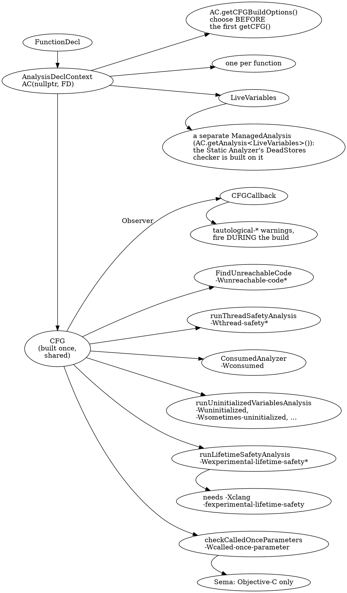
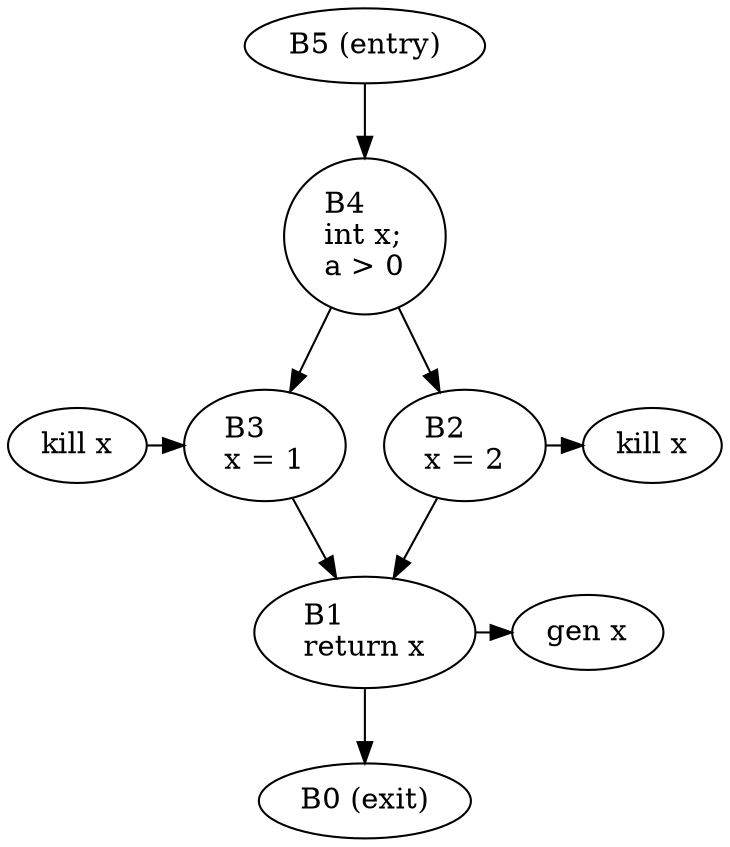
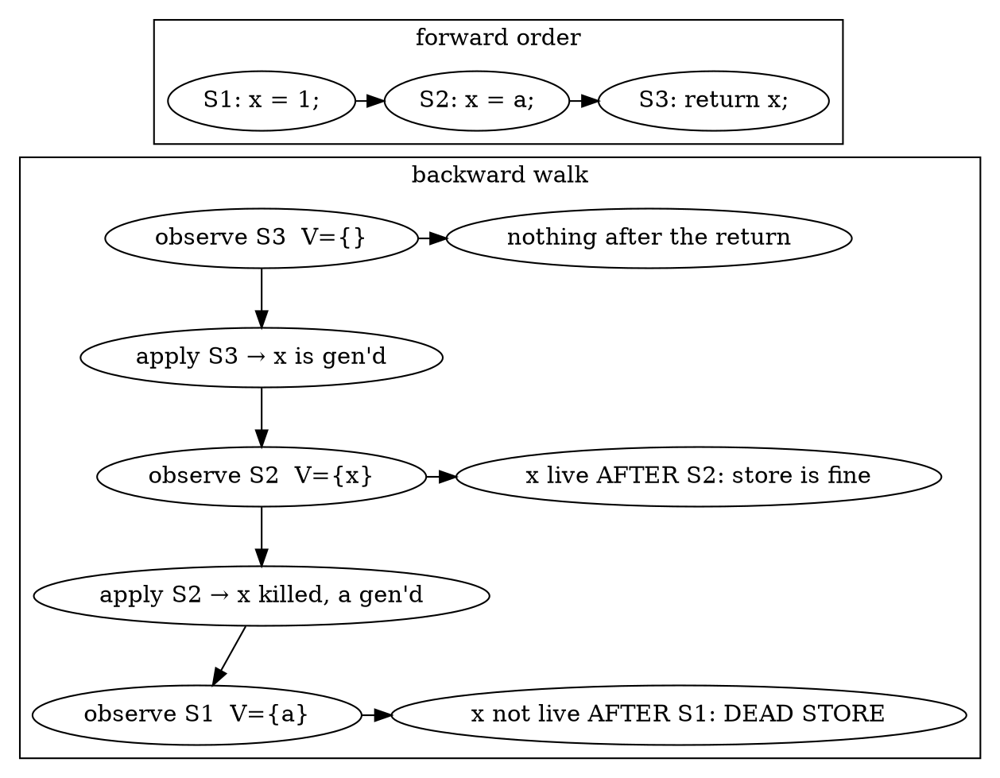

# Part 5 — Classic CFG Analyses

[← Part 4 — Graph Algorithms over the CFG](part_4_graph_algorithms.md) | [Part 6 — The FlowSensitive Dataflow Framework →](part_6_dataflow_framework.md)

## What You'll Learn

- Backward liveness written by hand over the CFG (`use`/`def`, a fixed point, a bit vector per block) and checked block by block against `LiveVariables` and `RelaxedLiveVariables`
- What `killAtAssign` really changes, and how `LiveVariables::Observer::observeStmt` turns liveness into a dead-store finder
- `runUninitializedVariablesAnalysis` with your own `UninitVariablesHandler`: the five `UninitUse::Kind`s, branches, const-reference uses, self-initialisation, and why the analysis finds nothing on a default CFG
- `reachable_code::FindUnreachableCode` and its `Callback`: the four `UnreachableKind`s, the silenceable-condition range, and the `BuildOptions` Sema picks for each analysis
- The annotation-driven analyses: `runThreadSafetyAnalysis` (all 18 handler hooks), `ConsumedAnalyzer` (typestate) and `checkCalledOnceParameters` (and why Sema only runs it for Objective-C)
- The experimental lifetime-safety subsystem: loans, origins, the fact dump, and the real flags
- `CFGCallback` (`BuildOptions::Observer`): the four hooks and the Sema warnings they back
- How `AnalysisBasedWarnings::IssueWarnings` composes all of it: one `AnalysisDeclContext`, one CFG built for the union of the enabled analyses, a fixed order

## The Big Picture

Parts 2–4 built CFGs and walked them. This part uses the analyses that ship with Clang and that `-Wall` runs on every function. All of them are consumers of one CFG:



Every analysis the CFG node fans out to is a **client of the CFG you learned to read**: a function over blocks, edges and elements. What differs is the lattice and what the client does with the answer. Each tool in this part wires one analysis to a handler that *prints* what Sema would turn into a diagnostic, so you can see the analysis API and the warning side by side.

| Tool (this part) | Section | Does |
|------------------|---------|------|
| `p05_liveness` | 5.1 | hand-written backward liveness, compared with `LiveVariables` / `RelaxedLiveVariables` per block |
| `p05_deadstores` | 5.2 | `LiveVariables::Observer` dead-store finder; `--trace` shows every `observeStmt` |
| `p05_uninit` | 5.3 | `UninitVariablesHandler` that prints kind, branches, const-ref/ptr flags |
| `p05_unreachable` | 5.4 | `reachable_code::Callback` that prints kind and ranges; choose the `alwaysAdd` set |
| `p05_tsa`, `p05_consumed`, `p05_calledonce` | 5.5 | handlers for thread safety, consumed typestate and called-once |
| `p05_lifetime` | 5.6 | `LifetimeSafetyReporter`; `--facts` dumps the loan/origin facts |
| `p05_tautology` | 5.7 | `CFGCallback` the way Sema's `LogicalErrorHandler` uses it |
| `p05_pipeline` | 5.8 | `IssueWarnings` in miniature: union options, one CFG, Sema's order |

Build them (the first build compiles each tool against the monolithic dylibs; later ones are incremental):

```bash
scripts/build.sh p05_liveness p05_deadstores p05_uninit p05_unreachable p05_tsa \
                 p05_consumed p05_calledonce p05_lifetime p05_tautology p05_pipeline
```

Every Clang diagnostic quoted in this part comes from the Homebrew `clang++` 22.1.8 with the platform flags from `scripts/flags.sh` (Part 1.4). `$(scripts/flags.sh)` below expands to `-resource-dir … -isysroot …`.

---

## Section 5.1 — Hand-written bit-vector liveness versus `LiveVariables`

### Why

Liveness is the "hello world" of dataflow: if you can write it yourself against the CFG, every other analysis in this part is a variation. Writing it by hand also tells you exactly what `LiveVariables` computes — and what it means by `killAtAssign`.

### What to Do

**Sample file:** `manifests/p05_liveness.cpp` — `straight`, `diamond`, `loop` and `overwritten`: one control-flow shape each.

A variable is **live** at a point if some path from that point reads it before writing it. Liveness runs *backward*:

```
  out[B] = union of in[S]   for every successor S of B
  in[B]  = use[B] ∪ (out[B] − def[B])
```

On a CFG whose elements are the individual sub-expressions (the "linearized" CFG that Sema's `setAllAlwaysAdd()` produces, Section 5.4) the per-block transfer function is a reverse walk over the elements:

| Element (walking backward) | Effect on the live set |
|----------------------------|------------------------|
| `BinaryOperator` `x = e` whose LHS is a `DeclRefExpr` | **kill** `x` |
| `DeclStmt` `T x = e;` | **kill** `x` |
| `DeclRefExpr` `x` used as an rvalue | **gen**: add `x` |
| `DeclRefExpr` `x` that is the LHS of `=` | nothing — it is a write, not a read |

Look at a real CFG first. `diamond` with the Sema preset (Section 2.3):

```bash
build/bin/p02_walk manifests/p05_liveness.cpp --func=diamond --preset=sema
```

```text expected
== diamond: 6 blocks
B0  elements=0  (EXIT)
B1  elements=3
  [ 0] Statement            DeclRefExpr        x
  [ 1] Statement            ImplicitCastExpr   x
  [ 2] Statement            ReturnStmt         return x
B2  elements=3
  [ 0] Statement            IntegerLiteral     2
  [ 1] Statement            DeclRefExpr        x
  [ 2] Statement            BinaryOperator     x = 2
B3  elements=3
  [ 0] Statement            IntegerLiteral     1
  [ 1] Statement            DeclRefExpr        x
  [ 2] Statement            BinaryOperator     x = 1
B4  elements=5
  [ 0] Statement            DeclStmt           int x
  [ 1] Statement            DeclRefExpr        a
  [ 2] Statement            ImplicitCastExpr   a
  [ 3] Statement            IntegerLiteral     0
  [ 4] Statement            BinaryOperator     a > 0
B5  elements=0  (ENTRY)
```



Read that backward by hand: `B1` generates `x`, so `x` is live at the end of both `B3` and `B2`. Both assign `x` before reading it, so `x` is *not* live at the end of `B4`. `a` is read in `B4`, so it is live at the end of `B5`.

`p05_liveness` does exactly this with a `uint64_t` per block, iterating blocks from the highest ID (the entry) downward until nothing changes, and then asks the real `LiveVariables` the same question — `isLive(const CFGBlock*, const VarDecl*)`, which means "live at the **end** of the block":

```cpp
AnalysisDeclContext AC(nullptr, FD);
cfglab::applyPreset(AC.getCFGBuildOptions(), cfglab::semaPreset());   // before the first getCFG()
std::unique_ptr<LiveVariables> LV = LiveVariables::create(AC);        // = computeLiveness(AC, /*killAtAssign=*/true)
bool live = LV->isLive(Block, VarDecl);                               // live at the END of Block
```

```bash
build/bin/p05_liveness manifests/p05_liveness.cpp --func=diamond
```

```text expected
== diamond  (LiveVariables, hand-written rounds=2)
  B5   live-out hand={a}          LV={a}          same
  B4   live-out hand={}           LV={}           same
  B3   live-out hand={x}          LV={x}          same
  B2   live-out hand={x}          LV={x}          same
  B1   live-out hand={}           LV={}           same
  B0   live-out hand={}           LV={}           same
  blocks that differ: 0
```

Same answer on every block. `rounds=2` is the number of passes the hand-written solver needed: one to propagate, one to confirm nothing changed. A loop needs more because the fact has to travel around the back edge:

```bash
build/bin/p05_liveness manifests/p05_liveness.cpp --func=loop
```

```text expected
== loop  (LiveVariables, hand-written rounds=4)
  B6   live-out hand={n}          LV={n}          same
  B5   live-out hand={n sum i}    LV={n sum i}    same
  B4   live-out hand={n sum i}    LV={n sum i}    same
  B3   live-out hand={n sum i}    LV={n sum i}    same
  B2   live-out hand={n sum i}    LV={n sum i}    same
  B1   live-out hand={}           LV={}           same
  B0   live-out hand={}           LV={}           same
  blocks that differ: 0
```

`n`, `sum` and `i` are all live around the loop (`B2`–`B5`): each is read in the condition, the body or the increment and written only after being read.

**`LiveVariables` has a second flavour.** `RelaxedLiveVariables::create` calls the same `computeLiveness` with `killAtAssign = false`:

| API | `killAtAssign` | Assignment `x = e` |
|-----|----------------|--------------------|
| `LiveVariables::create(AC)` | `true` | kills `x`; the LHS `DeclRefExpr` is not a use |
| `RelaxedLiveVariables::create(AC)` | `false` | kills nothing, and the LHS `DeclRefExpr` counts as a use of `x` |

```bash
build/bin/p05_liveness manifests/p05_liveness.cpp --func=diamond --relaxed
```

```text expected
== diamond  (RelaxedLiveVariables, hand-written rounds=2)
  B5   live-out hand={a}          LV={a}          same
  B4   live-out hand={x}          LV={x}          same
  B3   live-out hand={x}          LV={x}          same
  B2   live-out hand={x}          LV={x}          same
  B1   live-out hand={}           LV={}           same
  B0   live-out hand={}           LV={}           same
  blocks that differ: 0
```

Compare `B4` with the strict run: it was `{}` and is now `{x}`. In the relaxed analysis the assignments in `B3` and `B2` *use* `x`, so `x` is live all the way back to its declaration. The tool's `--relaxed` flag switches the hand-written pass the same way (no kill, LHS counts as a use) and still matches on every block — which is the evidence for the table above.

The two analyses answer different questions: *strict* is "may this value be read later?" (dead-store detection, Section 5.2), *relaxed* is "is this variable mentioned on some later path?" (a coarser answer that keeps a variable alive across an assignment — useful for "is it worth tracking this variable at all?").

`LivenessValues` has three sets, and only one is the variable story:

| Field | Holds |
|-------|-------|
| `liveDecls` | `VarDecl`s live here |
| `liveBindings` | structured bindings (`auto [a, b] = ...`) |
| `liveExprs` | *expression values* produced in one block and consumed in another (`a && b` leaves a value in flight across blocks) |

`dumpBlockLiveness(SM)` prints `liveDecls` per block to **stderr**; `dumpExprLiveness(SM)` prints the expression sets. The tool's `--dump` calls the first:

```bash
build/bin/p05_liveness manifests/p05_liveness.cpp --func=diamond --dump 2>&1 | sed -n '9,$p'
```

```text expected

[ B0 (live variables at block exit) ]

[ B1 (live variables at block exit) ]

[ B2 (live variables at block exit) ]
 x <manifests/p05_liveness.cpp:13:7>

[ B3 (live variables at block exit) ]
 x <manifests/p05_liveness.cpp:13:7>

[ B4 (live variables at block exit) ]

[ B5 (live variables at block exit) ]
 a <manifests/p05_liveness.cpp:12:17>
```

**Common mistakes**

- Treating the LHS `DeclRefExpr` of `x = 1` as a use. In the linearized CFG it *is* an element (`B3`: literal, `x`, `x = 1`), so a naive "every `DeclRefExpr` is a use" pass makes `x` live above its own assignment and never finds a dead store.
- Reading `isLive(Block, D)` as "live at the start". It is the block **exit** set.
- Running the solver in forward block order. It still converges, just in more rounds; walking from the highest ID to `B0` is the natural order for a backward problem.
- Building the CFG with the default `BuildOptions`. Sub-expressions are folded into their parent (Section 2.2), so there is no separate `DeclRefExpr` element to see. Sema's analyses always set `alwaysAdd` for this reason (all classes, or a seven-class subset).

### Verify

Does the hand-written pass agree with `LiveVariables` on every block of every sample function, in both modes?

```bash
for m in "" --relaxed; do
  build/bin/p05_liveness manifests/p05_liveness.cpp $m | grep -c 'differ: 0'
done
```

### Expected

```text expected
4
4
```

Four functions, and zero differing blocks in each mode: the 25-line solver reproduces `LiveVariables` and `RelaxedLiveVariables` exactly on the CFG Sema uses.

> [!hint]- Quiz: in `overwritten`, `int x = 1; x = a; return x;`, which block-end sets would change if the first store were removed?
> `liveDecls` is reported at block *ends*, and all three statements sit in one block.

> [!success]- Answer
> None. Block-end liveness cannot see inside a block. That is exactly why Section 5.2 uses the *statement-level* `Observer`: it is called between the statements of a block.

**Exercises**

1. Extend `HandLiveness::transfer` to treat `UnaryOperator` `++`/`--` as kill-and-gen (it reads and writes `x`). Check that nothing changes for `loop` (the `++i` already makes `i` a use).
2. Add a statement-level `isLive` to the hand-written pass: print the live set before every element of `B2` in `straight`.
3. Make the tool report variables that are live at the **entry** block's end but are not parameters. That set is the "possibly uninitialised" candidates; Section 5.3 does this properly.

---

## Section 5.2 — `LiveVariables::Observer`: a dead-store finder

### Why

Block-end sets are too coarse to answer "is the value stored by *this assignment* ever read?". `LiveVariables::runOnAllBlocks(Observer&)` replays each block's transfer functions and tells you the live set between *statements* — which is all a dead-store checker needs.

### What to Do

**Sample file:** `manifests/p05_deadstores.cpp` — `overwritten`, `call_result`, `live_stores`, `never_read`, `address_taken`, `loop_carried`.

The callback:

```cpp
class Observer {
public:
  virtual void observeStmt(const Stmt *S, const CFGBlock *currentBlock,
                           const LivenessValues &V) {}
};
void LiveVariables::runOnAllBlocks(Observer &obs);
```

The header says it is called "right before invoking the liveness transfer function on the given statement". The analysis walks each block **backward**, so "before applying S's transfer function" means `V` is the set live **after** `S` in program order. A store `x = e` whose `V` does not contain `x` is dead:



The finder (`tools/p05_deadstores/main.cpp`) is short:

```cpp
void observeStmt(const Stmt *S, const CFGBlock *B, const LiveVariables::LivenessValues &V) override {
  if (auto *BO = dyn_cast<BinaryOperator>(S); BO && BO->getOpcode() == BO_Assign)
    if (auto *DR = dyn_cast<DeclRefExpr>(BO->getLHS()->IgnoreParens()))
      if (auto *VD = dyn_cast<VarDecl>(DR->getDecl()); VD && !V.isLive(VD)) report(VD, "store");
  if (auto *DS = dyn_cast<DeclStmt>(S))
    for (const Decl *D : DS->decls())
      if (auto *VD = dyn_cast<VarDecl>(D); VD && VD->hasInit() && !V.isLive(VD)) report(VD, "initialization");
}
```

It also skips variables whose address is taken (`&z`): a callee may read the "dead" store through the pointer. Run it:

```bash
build/bin/p05_deadstores manifests/p05_deadstores.cpp
```

```text expected
== overwritten
  line 7: dead initialization to 'x'
== call_result
  line 14: dead initialization to 'y'
  line 15: dead store to 'y'
== live_stores
  no dead stores
== never_read
  line 30: dead initialization to 'unused'
== address_taken
  no dead stores
== loop_carried
  no dead stores
```

`live_stores` and `loop_carried` are the negative controls: `x = 1` on one branch is read on the path that takes it, and `prev = cur` is read by the next iteration (or by the `return`). `address_taken` is silent on purpose.

`--trace` prints every `observeStmt` call for one function, so you can see the "after" semantics directly:

```bash
build/bin/p05_deadstores manifests/p05_deadstores.cpp --func=overwritten --trace
```

```text expected
== overwritten
  observe B1  ReturnStmt         live-after={}  line 9
  observe B1  ImplicitCastExpr   live-after={}  line 9
  observe B1  DeclRefExpr        live-after={}  line 9
  observe B1  BinaryOperator     live-after={x}  line 8
  observe B1  DeclRefExpr        live-after={}  line 8
  observe B1  ImplicitCastExpr   live-after={}  line 8
  observe B1  DeclRefExpr        live-after={}  line 8
  observe B1  DeclStmt           live-after={a}  line 7
  observe B1  IntegerLiteral     live-after={a}  line 7
  line 7: dead initialization to 'x'
```

The printed order is the order of the walk, last statement first: the `return` is observed with nothing live; the `DeclRefExpr x` for the return value comes next; then the `BinaryOperator` `x = a` is observed with `x` **live** (the return reads it) — the second store is fine. The next `DeclStmt` `int x = 1` is observed with only `{a}` live: `x` was killed by the assignment above it, so the initialisation is dead.

**The `killAtAssign` switch is what makes this work.** With `RelaxedLiveVariables` nothing is ever killed by an assignment, so a variable that is read anywhere later stays live all the way back and every store looks used:

```bash
build/bin/p05_deadstores manifests/p05_deadstores.cpp --relaxed
```

```text expected
== overwritten
  no dead stores
== call_result
  no dead stores
== live_stores
  no dead stores
== never_read
  line 30: dead initialization to 'unused'
== address_taken
  no dead stores
== loop_carried
  no dead stores
```

Only `never_read` survives — that variable is not read on *any* path, so even the relaxed analysis cannot keep it alive. That is the whole difference between the two classes: strict liveness is a **value** analysis, relaxed liveness is a **name** analysis.

**Cross-check with the Static Analyzer.** The `deadcode.DeadStores` checker is built on exactly this `Observer`. `scripts/dumpcfg.sh` takes a `CHECKER=`:

```bash
CHECKER=deadcode.DeadStores scripts/dumpcfg.sh manifests/p05_deadstores.cpp 2>&1 | grep warning:
```

```text expected
manifests/p05_deadstores.cpp:15:3: warning: Value stored to 'y' is never read [deadcode.DeadStores]
manifests/p05_deadstores.cpp:30:7: warning: Value stored to 'unused' during its initialization is never read [deadcode.DeadStores]
```

The checker reports two of our four findings: the dead assignment `y = g(a)` (line 15) and the never-read `unused` (line 30). It drops `int x = 1` (line 7) and `int y = 0` (line 14): a constant initialiser is a deliberate default, not a bug. The mechanism is identical; the policy (which findings are worth a warning) is what a production checker adds on top.

**Common mistakes**

- Reading `V` as the state *before* `S`. It is the state **after**; if you check `V.isLive(x)` for a *use* of `x` you will get the wrong answer.
- Forgetting that `observeStmt` is also called for **expressions** (it is a visit of every element, not just statements): filter by `dyn_cast`.
- Not excluding address-taken variables, references and statics. Liveness over `VarDecl`s does not see writes and reads through pointers.
- Looking only at `BinaryOperator`. A compound assignment (`x += 1`) is a `CompoundAssignOperator` and *reads* `x`, so it is never a dead store by itself.

### Verify

How many dead stores does each flavour find?

```bash
for m in "" --relaxed; do
  build/bin/p05_deadstores manifests/p05_deadstores.cpp $m | grep -c dead
done
```

### Expected

```text expected
7
6
```

Four with `LiveVariables` (killing on assignment), one with `RelaxedLiveVariables`.

> [!hint]- Quiz: why can `observeStmt` not tell you the live set *before* a statement?
> It is called before the transfer function of a backward walk. What would the "before" set be, and when does it become available?

> [!success]- Answer
> The "before" (program order) set is the **result** of applying `S`'s transfer function, which has not been applied when the callback runs. It is the set passed to the next `observeStmt` call in the same block, i.e. the previous statement's "after".

**Exercises**

1. Skip stores whose right-hand side is a constant (`IntegerLiteral`) to mimic the analyzer's initialiser heuristic. Which lines remain?
2. Report the line of the *killing* store for each dead store: remember the last `BinaryOperator` you saw for the same variable while walking backward.
3. Teach the finder about `CompoundAssignOperator`: when is `x += 1` followed by no read a dead store, and why does the finder need `V` at that point rather than at the previous statement?

---

## Section 5.3 — `UninitializedValues`: kinds of uninitialised use

### Why

`int x; ... return x;` is the classic "read before write". `runUninitializedVariablesAnalysis` finds it, classifies *how* uninitialised the use is, and tells you which branch to blame. Those classifications drive three different warnings.

### What to Do

**Sample file:** `manifests/p05_uninit.cpp` — one function per kind, plus two silent controls (`escape_ok`, `clean`).

The entry point and its handler (`UninitializedValues.h`):

```cpp
void runUninitializedVariablesAnalysis(const DeclContext &dc, const CFG &cfg,
                                       AnalysisDeclContext &ac,
                                       UninitVariablesHandler &handler,
                                       UninitVariablesAnalysisStats &stats);

class UninitVariablesHandler {
  virtual void handleUseOfUninitVariable(const VarDecl *vd, const UninitUse &use);
  virtual void handleSelfInit(const VarDecl *vd);        // int x = x;
};
```

`UninitUse` is the report. `getKind()` is derived from flags:

| `UninitUse::Kind` | Meaning | Becomes (Sema) |
|-------------------|---------|----------------|
| `Always` | no path initialises the variable | `-Wuninitialized` "is uninitialized when used here" |
| `Sometimes` | a *particular branch* leaves it uninitialised; `branch_begin()..branch_end()` name the `Terminator` and which output (`0`=true, `1`=false) | `-Wsometimes-uninitialized` "is used uninitialized whenever 'if' condition is false" |
| `Maybe` | some paths initialise it, no single branch is to blame | `-Wconditional-uninitialized` "may be uninitialized when used here" |
| `AfterDecl` | uninitialised the first time it is reached after the declaration | `warn_sometimes_uninit_var` with its own wording (`DiagUninitUse`) |
| `AfterCall` | uninitialised the first time it is reached after the function is called | same diagnostic, another wording |

Two more flags describe *how* the variable was used: `isConstRefUse()` (passed as `const T&`) and `isConstPtrUse()` (`&x` passed as `const T*`) — they select `-Wuninitialized-const-reference` and `-Wuninitialized-const-pointer`.

```bash
build/bin/p05_uninit manifests/p05_uninit.cpp
```

```text expected
== always
  use of 'x' kind=Always line 10
  stats: variables=1 blockVisits=3
== sometimes
  use of 'x' kind=Sometimes line 18
    because IfStmt at line 16 takes output 1
  stats: variables=1 blockVisits=5
== maybe
  use of 'x' kind=Maybe line 31
  stats: variables=1 blockVisits=9
== in_loop
  use of 'x' kind=Maybe line 39
  stats: variables=3 blockVisits=9
== self_init
  self-init of 'x' line 47
  use of 'x' kind=Always line 48
  stats: variables=1 blockVisits=3
== const_uses
  use of 'r' kind=Always line 55 [const-ref]
  use of 'p' kind=Always line 56 [const-ptr]
  stats: variables=2 blockVisits=3
== escape_ok
  stats: variables=1 blockVisits=2
== clean
  stats: variables=1 blockVisits=5
```

Walk through it:

- `always`: no assignment at all, so `Always`.
- `sometimes`: the `IfStmt`'s false edge (`takes output 1`) skips the store. The `Branch{Terminator, Output}` pair is what Sema turns into the "whenever 'if' condition is false" text and the note under it.
- `maybe`: the `switch` and the `if` together leave a path uninitialised, but there is no single branch that *always* does, so the kind is `Maybe`. `in_loop` is `Maybe` too: the first iteration reads garbage, later iterations do not.
- `self_init`: the analysis calls `handleSelfInit` for `int x = x;` **and** reports the later read as `Always`. Sema uses this pair to report once, at the initialiser (`hasSelfInit && hasAlwaysUninitializedUse`) — see the "within its own initialization" warning below.
- `const_uses`: passing `r` to a `const int&` and `&p` to a `const int*` count as reads; the flags say which. `escape_ok` passes `&e` to a *non-const* `int*`, which may initialise it, so there is no report.
- `AfterDecl` and `AfterCall` are in the enum and in Sema's diagnostics but none of the shapes in this sample (nor a dozen loop/block variants tried while writing this section) produced them; do not rely on provoking them from ordinary functions.

`UninitVariablesAnalysisStats` reports the work done. `NumVariablesAnalyzed` is the number of tracked locals; `NumBlockVisits` is the worklist cost. Sema sums them for `-Xclang -print-stats` ("N functions analyzed for uninitialiazed variables").

**What the diagnostics look like** with Clang itself. `-Wall` enables `-Wuninitialized` and `-Wsometimes-uninitialized`; `-Wconditional-uninitialized` is *not* in `-Wall` and must be asked for:

```bash
bash -c '/opt/homebrew/opt/llvm/bin/clang++ -std=c++17 -fsyntax-only -Wall -Wconditional-uninitialized $(scripts/flags.sh) manifests/p05_uninit.cpp 2>&1 | grep warning: | sed "s/^[^ ]* //"'
```

```text expected
warning: variable 'x' is uninitialized when used here [-Wuninitialized]
warning: variable 'x' is used uninitialized whenever 'if' condition is false [-Wsometimes-uninitialized]
warning: variable 'x' may be uninitialized when used here [-Wconditional-uninitialized]
warning: variable 'x' may be uninitialized when used here [-Wconditional-uninitialized]
warning: variable 'x' is uninitialized when used within its own initialization [-Wuninitialized]
warning: variable 'r' is uninitialized when passed as a const reference argument here [-Wuninitialized-const-reference]
warning: variable 'p' is uninitialized when passed as a const pointer argument here [-Wuninitialized-const-pointer]
```

Every `Always`, `Sometimes` and `Maybe` line above has a matching warning; `Maybe` appears twice (`maybe`, `in_loop`).

> [!warning] The analysis needs a CFG with `DeclRefExpr`, `BinaryOperator`, ... as elements
> Sema builds the CFG for this analysis with either `setAllAlwaysAdd()` (when another analysis needs it) or a seven-class subset: `BinaryOperator`, `CompoundAssignOperator`, `BlockExpr`, `CStyleCastExpr`, `DeclRefExpr`, `ImplicitCastExpr`, `UnaryOperator` (Section 5.4). With the *default* `BuildOptions` the elements the analysis looks for have been folded into their parents and it silently finds nothing. `p05_uninit` has `--minimal-cfg` (the seven classes) and `--default-cfg` (none):

```bash
build/bin/p05_uninit manifests/p05_uninit.cpp --func=sometimes --minimal-cfg
build/bin/p05_uninit manifests/p05_uninit.cpp --func=sometimes --default-cfg
```

```text expected
== sometimes
  use of 'x' kind=Sometimes line 18
    because IfStmt at line 16 takes output 1
  stats: variables=1 blockVisits=5
== sometimes
  stats: variables=1 blockVisits=4
```

Same function, same analysis call, same variable: the default CFG reports nothing (and the block-visit count differs, because the analysis saw a different graph).

**Common mistakes**

- Passing a `CFG` built with default options. No warning, no crash, no report — the worst kind of failure.
- Forgetting that the analysis never reports uses through a *non-const* pointer or reference (`escape_ok`): the callee may initialise it.
- Reporting every `handleUseOfUninitVariable` call. Sema keeps only the first use per variable (`diagnoseUnitializedVar`); a variable read ten times gets one warning.
- Expecting `Maybe` in `-Wall`. It is a separate, off-by-default group.

### Verify

How many reports of each kind does the sample produce?

```bash
build/bin/p05_uninit manifests/p05_uninit.cpp | grep -o 'kind=[A-Za-z]*' | sort | uniq -c
```

### Expected

```text expected
   4 kind=Always
   2 kind=Maybe
   1 kind=Sometimes
```

Four `Always` (`always`, the read in `self_init`, and the two const-uses), one `Sometimes`, two `Maybe` (`maybe`, `in_loop`).

> [!hint]- Quiz: why is `escape_ok` silent but `const_uses` is not?
> Think about what the callee is allowed to do with the argument.

> [!success]- Answer
> `void take_ptr(int *)` may write through the pointer, so `&e` is a potential initialisation, not a read. `const int&` and `const int*` cannot write: the only thing the callee can do is read, so passing an uninitialised variable is a read of garbage.

**Exercises**

1. Write a function where the same variable has two uses with different kinds (`Sometimes` first, `Always` later). Which does `p05_uninit` print, and which would Sema warn about?
2. Print the CFG block of each `Branch::Terminator` using `CFGStmtMap` (Part 2.7), so the output says "blame B3".
3. Compare `NumBlockVisits` for `sometimes` and `maybe`. What makes the second so much more expensive?

---

## Section 5.4 — `ReachableCode` and how Sema picks `BuildOptions`

### Why

The CFG knows which blocks have no path from the entry. Turning that into "this line is dead, and here is how to say it" is `reachable_code::FindUnreachableCode`. It is also the analysis that explains *why* Sema configures `BuildOptions` the way it does.

### What to Do

**Sample file:** `manifests/p05_unreachable.cpp` — one unreachable construct per function: `after_return`, `after_noreturn`, `dead_break`, `dead_increment`, `config_macro`, `literal_false`, `after_infinite`, and a silent `clean`.

The API (`ReachableCode.h`):

```cpp
namespace clang::reachable_code {
enum UnreachableKind { UK_Return, UK_Break, UK_Loop_Increment, UK_Other };

class Callback {
  virtual void HandleUnreachable(UnreachableKind UK, SourceLocation L,
                                 SourceRange ConditionVal, SourceRange R1,
                                 SourceRange R2, bool HasFallThroughAttr) = 0;
};
unsigned ScanReachableFromBlock(const CFGBlock *Start, llvm::BitVector &Reachable);
void FindUnreachableCode(AnalysisDeclContext &AC, Preprocessor &PP, Callback &CB);
}
```

| Parameter | Meaning |
|-----------|---------|
| `UK` | what kind of dead code: a `return`, a `break`, a loop increment, anything else |
| `L` | where to point the warning |
| `ConditionVal` | the *condition* whose constant value made the code dead (e.g. the `0` of `if (0)`); Sema offers to "silence" it by wrapping it in `/* DISABLES CODE */ ( … )` |
| `R1`, `R2` | ranges to underline |
| `HasFallThroughAttr` | the dead statement is `[[fallthrough]];` |

`ScanReachableFromBlock` is the lower-level building block: mark every block reachable from `Start` and count them. `FindUnreachableCode` is the policy layer on top of that reachability: it picks a statement to blame for each dead region and classifies it. The `Preprocessor` is in the signature because the classifier inspects macro expansions when it decides whether a condition is a configuration value.

`p05_unreachable` calls both and prints what the callback receives plus the raw reachability (columns, not whole ranges):

```bash
build/bin/p05_unreachable manifests/p05_unreachable.cpp
```

```text expected
== after_return
  UK_Other at 9:3  R1=3-3
  reachable 3 of 4 blocks; unreachable: B1
== after_noreturn
  UK_Return at 15:10  R1=10-10
  reachable 3 of 4 blocks; unreachable: B1
== dead_break
  UK_Break at 23:5  R1=5-5
  reachable 5 of 6 blocks; unreachable: B3
== dead_increment
  UK_Loop_Increment at 30:26  R1=26-26  R2=valid
  reachable 6 of 7 blocks; unreachable: B2
== config_macro
  (callback never called)
  reachable 3 of 4 blocks; unreachable: B1
== literal_false
  UK_Other at 45:5  silenceable-cond=7-7  R1=5-5
  reachable 3 of 4 blocks; unreachable: B1
== after_infinite
  UK_Return at 52:10  R1=10-10
  reachable 4 of 6 blocks; unreachable: B0 B1
== clean
  (callback never called)
  reachable 5 of 5 blocks; unreachable: none
```

Read it:

- `after_return` is `UK_Other` — the dead statement is `use(a);`, an ordinary call.
- `after_noreturn` and `after_infinite` are `UK_Return`: the CFG marks the code after `die()` or an endless `while (1)` unreachable and the first dead statement is a `return`.
- `dead_break` is `UK_Break`; `dead_increment` is `UK_Loop_Increment` (and sets `R2`, a second range to underline).
- `config_macro` never reaches the callback even though block `B1` is unreachable: `DEBUG_LOG` expands from a macro, so the dead branch is a *configuration value* and `FindUnreachableCode` treats it as intentional. `literal_false` is the same shape with a literal `0` — reported, with a `silenceable-cond` range.
- `after_infinite` shows `unreachable: B0 B1`: with an endless loop even the *exit* block is unreachable.

The real warnings, for comparison. `-Wunreachable-code` is **not** the whole family:

```bash
bash -c '/opt/homebrew/opt/llvm/bin/clang++ -std=c++17 -fsyntax-only -Wunreachable-code-aggressive $(scripts/flags.sh) manifests/p05_unreachable.cpp 2>&1 | grep warning:'
```

```text expected
manifests/p05_unreachable.cpp:9:3: warning: code will never be executed [-Wunreachable-code]
manifests/p05_unreachable.cpp:15:10: warning: 'return' will never be executed [-Wunreachable-code-return]
manifests/p05_unreachable.cpp:23:5: warning: 'break' will never be executed [-Wunreachable-code-break]
manifests/p05_unreachable.cpp:30:26: warning: loop will run at most once (loop increment never executed) [-Wunreachable-code-loop-increment]
manifests/p05_unreachable.cpp:45:5: warning: code will never be executed [-Wunreachable-code]
manifests/p05_unreachable.cpp:52:10: warning: 'return' will never be executed [-Wunreachable-code-return]
```

Same functions, same lines, same classification — `UK_Other` is `-Wunreachable-code`, `UK_Return` is `-Wunreachable-code-return`, `UK_Break` is `-Wunreachable-code-break`, `UK_Loop_Increment` is `-Wunreachable-code-loop-increment`. Which of them you see depends on the group you enable:

```bash
bash -c 'for f in -Wunreachable-code -Wunreachable-code-return -Wunreachable-code-aggressive; do
  printf "%-36s %s\n" $f "$(/opt/homebrew/opt/llvm/bin/clang++ -std=c++17 -fsyntax-only $f $(scripts/flags.sh) manifests/p05_unreachable.cpp 2>&1 | grep -c warning:)"
done'
```

```text expected
-Wunreachable-code                   3
-Wunreachable-code-return            2
-Wunreachable-code-aggressive        6
```

`-Wunreachable-code` is `UK_Other` plus the loop-increment kind; `-Wunreachable-code-aggressive` adds `return` and `break`.

#### How Sema picks `BuildOptions`

`AnalysisBasedWarnings::IssueWarnings` builds **one** `AnalysisDeclContext` per function, so the CFG options are chosen for the *union* of the analyses that are on. The source (`lib/Sema/AnalysisBasedWarnings.cpp`, 22.1.8):

```cpp
AnalysisDeclContext AC(/* AnalysisDeclContextManager */ nullptr, D);
AC.getCFGBuildOptions().PruneTriviallyFalseEdges = true;
AC.getCFGBuildOptions().AddEHEdges = false;               // avoid the n^2 explosion of dtor EH edges
AC.getCFGBuildOptions().AddInitializers = true;
AC.getCFGBuildOptions().AddImplicitDtors = true;
AC.getCFGBuildOptions().AddTemporaryDtors = true;
AC.getCFGBuildOptions().AddCXXNewAllocator = false;
AC.getCFGBuildOptions().AddCXXDefaultInitExprInCtors = true;
if (EnableLifetimeSafetyAnalysis) AC.getCFGBuildOptions().AddLifetime = true;
if (P.enableCheckUnreachable || P.enableThreadSafetyAnalysis ||
    P.enableConsumedAnalysis || EnableLifetimeSafetyAnalysis)
  AC.getCFGBuildOptions().setAllAlwaysAdd();              // "require a linearized CFG"
else
  AC.getCFGBuildOptions().setAlwaysAdd(Stmt::BinaryOperatorClass)
      .setAlwaysAdd(Stmt::CompoundAssignOperatorClass).setAlwaysAdd(Stmt::BlockExprClass)
      .setAlwaysAdd(Stmt::CStyleCastExprClass).setAlwaysAdd(Stmt::DeclRefExprClass)
      .setAlwaysAdd(Stmt::ImplicitCastExprClass).setAlwaysAdd(Stmt::UnaryOperatorClass);
```

| Field | Value | Why |
|-------|-------|-----|
| `PruneTriviallyFalseEdges` | on | so `if (0)` and `while (1)` produce unreachable blocks (Section 2.3) |
| `AddEHEdges` | **off** | a call inside a `try` would otherwise get an edge per destructor; Sema chooses speed |
| `AddInitializers`, `AddImplicitDtors`, `AddTemporaryDtors` | on | destructor calls are real statements for reachability and for typestate |
| `AddCXXNewAllocator` | off | the allocator call is noise for these analyses |
| `alwaysAdd` | all, or seven classes | all = a "linearized" CFG; seven classes = what liveness and uninitialised values read |
| `AddLifetime` | on only for lifetime safety | `LifetimeEnds` elements are the "expire" events (Section 5.6) |
| `Observer` | `LogicalErrorHandler` when a `-Wtautological-*` group is on | Section 5.7 |

`p05_unreachable --cfg=` lets you pick the `alwaysAdd` set. For this file the seven-class subset is enough, but the *default* CFG degrades the classification:

```bash
build/bin/p05_unreachable manifests/p05_unreachable.cpp --cfg=default --func=after_noreturn
build/bin/p05_unreachable manifests/p05_unreachable.cpp --cfg=all --func=after_noreturn
build/bin/p05_unreachable manifests/p05_unreachable.cpp --cfg=default --func=after_return
build/bin/p05_unreachable manifests/p05_unreachable.cpp --cfg=all --func=after_return
```

```text expected
== after_noreturn
  UK_Other at 15:10  R1=10-10
  reachable 3 of 4 blocks; unreachable: B1
== after_noreturn
  UK_Return at 15:10  R1=10-10
  reachable 3 of 4 blocks; unreachable: B1
== after_return
  UK_Other at 9:3  R1=3-8
  reachable 3 of 4 blocks; unreachable: B1
== after_return
  UK_Other at 9:3  R1=3-3
  reachable 3 of 4 blocks; unreachable: B1
```

Without `alwaysAdd` the dead `return` in `after_noreturn` is reported as `UK_Other` (the analysis cannot recognise the shape it expects) and the underlined range `R1` for `after_return` is the whole expression statement instead of one token. Warnings are still produced; they are just worse.

Pruning is the other half. `--no-prune` turns `PruneTriviallyFalseEdges` off:

```bash
build/bin/p05_unreachable manifests/p05_unreachable.cpp --no-prune | grep -B1 'callback never'
```

```text expected
== config_macro
  (callback never called)
--
== literal_false
  (callback never called)
--
== after_infinite
  (callback never called)
--
== clean
  (callback never called)
```

Without pruning, `literal_false` and `after_infinite` join `config_macro` and `clean` in the "never called" list: the CFG keeps the edge for `if (0)` and for the exit of `while (1)`, so the dead code looks reachable. Sema keeps pruning on, because the analysis is only as good as the CFG's idea of "impossible".

**Common mistakes**

- Calling `FindUnreachableCode` on a CFG built with default options and trusting `UK_Other` for everything.
- Expecting `-Wunreachable-code` to report unreachable `return`/`break`. They live in `-aggressive` (or their own groups).
- Reporting on template instantiations. Sema skips `isTemplateInstantiation()` functions: different instantiations change the control flow.
- Assuming a `ScanReachableFromBlock` count of N−1 means one dead statement. A block is a group of statements; use the callback for statements.

### Verify

`FindUnreachableCode` should call back exactly as often as clang prints unreachable-code warnings for the same file:

```bash
echo "tool:  $(build/bin/p05_unreachable manifests/p05_unreachable.cpp | grep -c '^  UK_')"
bash -c 'echo "clang: $(/opt/homebrew/opt/llvm/bin/clang++ -std=c++17 -fsyntax-only -Wunreachable-code-aggressive $(scripts/flags.sh) manifests/p05_unreachable.cpp 2>&1 | grep -c warning:)"'
```

### Expected

```text expected
tool:  6
clang: 6
```

Six reports from the tool, six warnings from Clang: `UnreachableCodeHandler` in Sema is a thin printer over the callback you just wrote.

> [!hint]- Quiz: `config_macro` has an unreachable block but no callback. Is the reachability analysis wrong?
> Compare "unreachable block" with "unreachable code worth a warning".

> [!success]- Answer
> No. `ScanReachableFromBlock` still reports `B1` unreachable — the CFG is right. `FindUnreachableCode` then filters: dead code that exists only because a macro/configuration constant is false is deliberate (`#define DEBUG 0`), so it is not reported. The classifier is policy on top of the graph.

**Exercises**

1. Add a `--format=sema` mode that prints `file:line:col: warning: …` with the same text as Clang for each `UnreachableKind`.
2. Use `ScanReachableFromBlock` to find blocks reachable only through a pruned edge (`getPossiblyUnreachableBlock()`, Part 2.5) and compare with what the callback reports.
3. Write a function whose unreachable code is *inside* a template. Why does Sema skip instantiations, and what does your tool do?

---

## Section 5.5 — Thread safety, consumed typestate and called-once

### Why

These three analyses are **annotation-driven**: they check a protocol that the programmer wrote in attributes (`guarded_by`, `consumable`, `called_once`). The CFG is the same; the lattice is a set of held capabilities, a typestate per variable, or a call count per parameter. Each exposes a *handler* that Sema turns into warnings.

### What to Do

#### Thread safety

**Sample file:** `manifests/p05_tsa.cpp` — an annotated `Mutex`, a `Guard` (scoped capability) and one mistake per function.

```cpp
void threadSafety::runThreadSafetyAnalysis(AnalysisDeclContext &AC, ThreadSafetyHandler &Handler, BeforeSet **Bset);
void threadSafety::threadSafetyCleanup(BeforeSet *Cache);
```

The analysis keeps, for each block, the set of capabilities held at its end, and merges at joins ("each block is traversed exactly once"). It converts the CFG into a typed intermediate language internally (`ThreadSafetyTIL.h`), but the interface to you is the handler. `BeforeSet` caches `acquired_before`/`acquired_after` relations across functions; pass the same pointer for every function in a translation unit (`S.ThreadSafetyDeclCache` in Sema) and free it at the end.

| Handler hook | Fires when | Warning text (Sema) |
|--------------|------------|---------------------|
| `handleMutexNotHeld(Kind, D, POK, Lock, LK, Loc, PossibleMatch*)` | a protected variable/function is used without the specific lock | "writing variable 'x' requires holding mutex 'm' exclusively" |
| `handleNoMutexHeld(D, POK, AK, Loc)` | a protected operation happens while no lock at all is held | (not exercised by the sample) |
| `handleUnmatchedUnlock(Kind, Lock, Loc, LocPrev)` | release of a capability that is not held | "releasing mutex 'm' that was not held" |
| `handleIncorrectUnlockKind(Kind, Lock, Expected, Received, …)` | exclusive release of a shared lock (or reverse) | "releasing mutex 'm' using exclusive access, expected shared access" |
| `handleDoubleLock(Kind, Lock, LocLocked, LocDoubleLock)` | acquiring a capability already held | "acquiring mutex 'm' that is already held" |
| `handleMutexHeldEndOfScope(Kind, Lock, LocLocked, LocEnd, LEK, …)` | held at function end, or on some but not all predecessors of a join | "mutex 'm' is still held at the end of function" / "… is not held on every path through here" |
| `handleExclusiveAndShared(Kind, Lock, Loc1, Loc2)` | held both exclusively and shared | (not exercised) |
| `handleFunExcludesLock(Kind, Fun, Lock, Loc)` | calling an `EXCLUDES(m)` function with `m` held | "cannot call function 'f' while mutex 'm' is held" |
| `handleNegativeNotHeld` (two overloads) | acquiring/calling needs `!m` and it is not proven | "acquiring mutex 'm' requires negative capability '!m'" |
| `handleLockAcquiredBefore(Kind, L1, L2, Loc)` | `acquired_before` order violated | "mutex 'a' must be acquired before 'b'" |
| `handleBeforeAfterCycle(L, Loc)` | cyclic `acquired_before`/`acquired_after` declarations | (not exercised) |
| `handleInvalidLockExp(Loc)` | an attribute argument does not resolve to a capability | (fired once by an invalid `!mu` argument while writing this section) |
| `handleUnmatchedUnderlyingMutexes`, `handleExpectMoreUnderlyingMutexes`, `handleExpectFewerUnderlyingMutexes` | a scoped capability's underlying mutexes differ from what its constructor/destructor annotations promise | (not exercised) |
| `enterFunction(FD)`, `leaveFunction(FD)` | bracket the analysis of one function | (bookkeeping) |

`LockErrorKind` (`LEK_LockedSomeLoopIterations`, `LEK_LockedSomePredecessors`, `LEK_LockedAtEndOfFunction`, `LEK_NotLockedAtEndOfFunction`) says which merge or exit condition triggered `handleMutexHeldEndOfScope`. `ProtectedOperationKind` (`POK_VarAccess`, `POK_FunctionCall`, `POK_PassByRef`, `POK_ReturnPointer`, …) says what was done with the protected thing.

`p05_tsa` implements the hooks that carry diagnostics and prints one line per event:

```bash
build/bin/p05_tsa manifests/p05_tsa.cpp
```

```text expected
== ok
  (no events)
  (1 handleNegativeNotHeld hidden; use --negative)
== ok_scoped
  (no events)
  (1 handleNegativeNotHeld hidden; use --negative)
== unguarded_write
  handleMutexNotHeld         line 45  decl=counter VarAccess needs Exclusive lock=mu
== shared_write
  handleMutexNotHeld         line 50  decl=counter VarAccess needs Exclusive lock=mu
  handleIncorrectUnlockKind  line 51  lock=mu expected=Shared got=Exclusive
  (1 handleNegativeNotHeld hidden; use --negative)
== unmatched_unlock
  handleUnmatchedUnlock      line 55  lock=mu
== double_lock
  handleDoubleLock           line 60  lock=mu
  (2 handleNegativeNotHeld hidden; use --negative)
== held_at_end
  handleMutexHeldEndOfScope  (invalid loc: Sema substitutes the end of the function)  lock=mu locked-at-line=65 LockedAtEndOfFunction
  (1 handleNegativeNotHeld hidden; use --negative)
== one_path
  handleMutexHeldEndOfScope  line 71  lock=mu locked-at-line=70 LockedSomePredecessors
  handleMutexNotHeld         line 71  decl=counter VarAccess needs Exclusive lock=mu
  handleUnmatchedUnlock      line 73  lock=mu
  (1 handleNegativeNotHeld hidden; use --negative)
== call_without
  handleMutexNotHeld         line 77  decl=needs_mu FunctionCall needs Exclusive lock=mu
== call_excluded
  handleFunExcludesLock      line 82  function=wants_free lock=mu
  (1 handleNegativeNotHeld hidden; use --negative)
== bad_order
  handleLockAcquiredBefore   line 89  acquired=second but must come before=first
  (2 handleNegativeNotHeld hidden; use --negative)
```

Highlights:

- `shared_write` produces **two** events: the write needs an exclusive lock (`handleMutexNotHeld`) and the later `Unlock()` is the wrong kind (`handleIncorrectUnlockKind`).
- `held_at_end` reports an *invalid* location: the end of the function. Sema's reporter substitutes the function's closing brace.
- `one_path` is the join case: `handleMutexHeldEndOfScope` with `LockedSomePredecessors`, then a consequence (the write is unguarded on the other path) and the unmatched unlock.
- `ok` and `ok_scoped` produce **no diagnostics**, but the analysis raised one `handleNegativeNotHeld` for each acquire. The tool hides it by default: Sema filters it behind `-Wthread-safety-negative`.

The numbers line up with Clang's:

```bash
bash -c '/opt/homebrew/opt/llvm/bin/clang++ -std=c++17 -fsyntax-only -Wthread-safety $(scripts/flags.sh) manifests/p05_tsa.cpp 2>&1 | grep -c warning:'
bash -c '/opt/homebrew/opt/llvm/bin/clang++ -std=c++17 -fsyntax-only -Wthread-safety -Wthread-safety-negative $(scripts/flags.sh) manifests/p05_tsa.cpp 2>&1 | grep -c warning:'
build/bin/p05_tsa manifests/p05_tsa.cpp | grep -c '^  handle'
build/bin/p05_tsa manifests/p05_tsa.cpp --negative | grep -c '^  handle'
```

```text expected
12
22
12
22
```

12 and 12; 22 and 22. The handler *is* the diagnostic list.

> [!note] Thread safety needs `setAllAlwaysAdd()`
> Sema sets it for this analysis (Section 5.4). `p05_tsa` uses the same options as Sema, so what you see is what `-Wthread-safety` sees.

#### Consumed typestate

**Sample file:** `manifests/p05_consumed.cpp` — a `File` with `consumable(unconsumed)`, `callable_when`, `set_typestate`, `test_typestate`, `param_typestate` and `return_typestate`.

```cpp
consumed::ConsumedAnalyzer Analyzer(WarningHandler);   // WarningHandler : ConsumedWarningsHandlerBase
Analyzer.run(AC);
```

States are `CS_None` (no information), `CS_Unknown`, `CS_Unconsumed` and `CS_Consumed`. A `ConsumedStateMap` per block maps each tracked variable (and temporary) to a state; `intersect` merges two maps at a join (disagreeing states become `Unknown`), and `intersectAtLoopHead` compares the state at the loop entry with the state at the back edge.

```bash
build/bin/p05_consumed manifests/p05_consumed.cpp
```

```text expected
== fine
  (no events)
== use_after_close
  warnUseInInvalidState line 26  method=use var=f state=consumed
== tested
  (no events)
== maybe_closed
  warnUseInInvalidState line 40  method=use var=f state=unknown
== loop_close
  warnLoopStateMismatch line 46  var=f
== wrong_argument
  warnParamTypestateMismatch line 54  expected=unconsumed observed=consumed
== wrong_return
  warnReturnTypestateMismatch line 61  expected=consumed observed=unconsumed
```

| Function | Hook | Why |
|----------|------|-----|
| `use_after_close` | `warnUseInInvalidState` (state `consumed`) | `close()` is `set_typestate(consumed)`, `use()` is `callable_when("unconsumed")` |
| `tested` | nothing | `test_typestate(unconsumed)` makes the true branch of `if (f.is_open())` known-unconsumed |
| `maybe_closed` | `warnUseInInvalidState` (state `unknown`) | the join of `consumed` and `unconsumed` is `Unknown`, and `Unknown` is not `unconsumed` |
| `loop_close` | `warnLoopStateMismatch` | `unconsumed` on entry, `consumed` after one iteration: not a fixed point |
| `wrong_argument` | `warnParamTypestateMismatch` | `param_typestate(unconsumed)` given a `consumed` value |
| `wrong_return` | `warnReturnTypestateMismatch` | `return_typestate(consumed)` but an `unconsumed` object is returned |

Clang says the same (`-Wconsumed` is its own group, not in `-Wall`):

```bash
bash -c '/opt/homebrew/opt/llvm/bin/clang++ -std=c++17 -fsyntax-only -Wconsumed $(scripts/flags.sh) manifests/p05_consumed.cpp 2>&1 | grep warning: | sed "s/^[^ ]* //"'
```

```text expected
warning: invalid invocation of method 'use' on object 'f' while it is in the 'consumed' state [-Wconsumed]
warning: invalid invocation of method 'use' on object 'f' while it is in the 'unknown' state [-Wconsumed]
warning: state of variable 'f' must match at the entry and exit of loop [-Wconsumed]
warning: argument not in expected state; expected 'unconsumed', observed 'consumed' [-Wconsumed]
warning: return value not in expected state; expected 'consumed', observed 'unconsumed' [-Wconsumed]
```

> [!warning] Use the GNU attribute spelling
> `[[clang::consumes]]` is rejected in C++11 syntax (`unknown attribute 'clang::consumes' ignored`, research page section 11.4); `__attribute__((set_typestate(...)))` works. The sample uses the GNU spelling throughout.

#### Called-once parameters

**Sample files:** `manifests/p05_calledonce.m` (Objective-C) and `manifests/p05_calledonce.cpp` (C++).

```cpp
void checkCalledOnceParameters(AnalysisDeclContext &AC, CalledOnceCheckHandler &Handler,
                               bool CheckConventionalParameters);
```

It tracks, for each *tracked parameter* (a block/function-pointer parameter marked `called_once`, or — with `CheckConventionalParameters` — one named like a completion handler), how many times it has been called on each path. Handler hooks: `handleDoubleCall`, two overloads of `handleNeverCalled` (the second explains *why*: `NeverCalledReason::IfThen`, `IfElse`, `Switch`, `SwitchSkipped`, `LoopEntered`, `LoopSkipped`, `FallbackReason`), `handleCapturedNeverCalled`, `handleBlockThatIsGuaranteedToBeCalledOnce` and `handleBlockWithNoGuarantees`.

```bash
build/bin/p05_calledonce manifests/p05_calledonce.m -- -x objective-c -fblocks -w
```

```text expected
== ok
  (no events)
== twice
  handleDoubleCall param=h call-line=18 previous-line=17 completion-handler=0
== missing_else
  handleNeverCalled(branch) param=h at line 23 reason=IfElse called-directly=1 completion-handler=0
== loop_calls
  handleDoubleCall param=h call-line=30 previous-line=30 completion-handler=0
== switch_gap
  handleNeverCalled(branch) param=h at line 39 reason=Switch called-directly=1 completion-handler=0
  handleNeverCalled(branch) param=h at line 35 reason=SwitchSkipped called-directly=1 completion-handler=0
== conventional
  handleNeverCalled(branch) param=completionHandler at line 46 reason=IfElse called-directly=1 completion-handler=1
```

- `twice` and `loop_calls` are double calls (a call in a loop body is a call per iteration).
- `missing_else` is a `handleNeverCalled` with reason `IfElse`: the false edge of the `if` skips the call. `switch_gap` yields two reports, `Switch` (the empty case) and `SwitchSkipped` (no case applies).
- `conventional` is checked without any attribute because the parameter is named `completionHandler` — `completion-handler=1`.

Clang's own warnings for the same file come from `-Wcalled-once-parameter` and `-Wcompletion-handler`:

```bash
bash -c '/opt/homebrew/opt/llvm/bin/clang -x objective-c -fsyntax-only -fblocks -Wcalled-once-parameter -Wcompletion-handler $(scripts/flags.sh) manifests/p05_calledonce.m 2>&1 | grep warning: | sed "s/^[^ ]* //"'
```

```text expected
warning: 'h' parameter marked 'called_once' is called twice [-Wcalled-once-parameter]
warning: 'h' parameter marked 'called_once' is never called when taking false branch [-Wcalled-once-parameter]
warning: 'h' parameter marked 'called_once' is called twice [-Wcalled-once-parameter]
warning: 'h' parameter marked 'called_once' is never called when handling this case [-Wcalled-once-parameter]
warning: 'h' parameter marked 'called_once' is never called when none of the cases applies [-Wcalled-once-parameter]
warning: completion handler is never called when taking false branch [-Wcompletion-handler]
```

**Sema only runs this analysis for Objective-C.** The condition in `IssueWarnings` is `S.getLangOpts().ObjC && !S.getLangOpts().CPlusPlus`. There is a second gate on the attribute itself: in C++, `called_once` is ignored.

```bash
bash -c '/opt/homebrew/opt/llvm/bin/clang++ -std=c++17 -fblocks -fsyntax-only $(scripts/flags.sh) manifests/p05_calledonce.cpp 2>&1 | grep warning:'
build/bin/p05_calledonce manifests/p05_calledonce.cpp -- -std=c++17 -fblocks -w
```

```text expected
manifests/p05_calledonce.cpp:5:56: warning: 'called_once' attribute ignored [-Wignored-attributes]
== attribute_ignored
  (no events)
== conventional
  handleNeverCalled(branch) param=completionHandler at line 12 reason=IfElse called-directly=1 completion-handler=1
```

Clang warns that the attribute is ignored; the tool then shows what remains: `attribute_ignored` produces nothing, while the *convention* check on `conventional` still fires, because nothing stops *you* from calling `checkCalledOnceParameters` on a C++ function.

**Common mistakes**

- Calling `runThreadSafetyAnalysis` with a default CFG: the analysis cannot resolve receivers and reports nothing.
- Forgetting `threadSafetyCleanup(BeforeSet*)`. The cache outlives the function.
- Assuming a `handleNegativeNotHeld` is an error: it only becomes one under `-Wthread-safety-negative`.
- Using `[[clang::consumes]]` (see the warning above).
- Expecting `-Wcalled-once-parameter` in a `.cpp` file. Two gates, neither of them in the analysis.

### Verify

Does every warning Clang prints for the consumed sample correspond to exactly one hook call?

```bash
bash -c 'echo "clang: $(/opt/homebrew/opt/llvm/bin/clang++ -std=c++17 -fsyntax-only -Wconsumed $(scripts/flags.sh) manifests/p05_consumed.cpp 2>&1 | grep -c warning:)"'
echo "tool:  $(build/bin/p05_consumed manifests/p05_consumed.cpp | grep -c '^  warn')"
```

### Expected

```text expected
clang: 5
tool:  5
```

> [!hint]- Quiz: in `tested`, the parameter `f` has no state information on entry. Why is `f.use()` inside `if (f.is_open())` accepted?
> What does `test_typestate(unconsumed)` let the analysis do at the *branch*?

> [!success]- Answer
> The analyzer **splits** the state at the conditional: on the true edge `f` is `Unconsumed`, on the false edge `Consumed`. That is typestate refinement by a test method, the same idea as nullability narrowing after `if (p)`.

**Exercises**

1. Add a `Mutex` method annotated `try_acquire_capability(true)` (e.g. `bool TryLock()`) and write a function that uses it in an `if`. Does the analysis follow the branch the way the consumed analyzer follows `test_typestate`?
2. Add a `shared_lock` reader to `p05_tsa.cpp` and make `shared_write` correct. Which events disappear?
3. For the called-once check, write a handler for `handleBlockThatIsGuaranteedToBeCalledOnce` and `handleBlockWithNoGuarantees`; pass a block literal to a `called_once` parameter and observe which one fires.

---

## Section 5.6 — Lifetime safety (experimental)

### Why

Dangling pointers are the bug the earlier analyses do not see: `int *p = &x; return p;` initialises everything and reaches every line. Clang 22 ships a new intra-procedural analysis (`Analyses/LifetimeSafety/`) that tracks **borrows** over the CFG. It is experimental, off by default, and its API is the least stable of this part — which is the point of looking at it now.

### What to Do

**Sample file:** `manifests/p05_lifetime.cpp` — `return_local`, `dangling_scope`, `pass_through`, `use_in_scope`, `one_branch`.

The model, from the header and the RFC it links:

| Concept | Meaning |
|---------|---------|
| **Loan** | a borrow: `&x` creates a *path loan* on `x`; a pointer parameter has a *placeholder* loan (a borrow from the caller that never expires) |
| **Origin** | a place that holds pointers: every pointer-typed variable or expression gets one |
| **Fact** | one event on the CFG: `Issue` (loan created), `Expire` (storage freed), `OriginFlow` (`p = q`, with an optional kill), `Use`, `OriginEscapes` (returned) |
| **Check** | `Issue`d loans flow along origins; if a loan has expired when its origin is *used* or *escapes*, report |

The pipeline is: *fact generation → loan propagation → live origins → policy* (`LifetimeSafety.h`). The reporter interface is the part you implement:

```cpp
class LifetimeSafetyReporter {
  virtual void reportUseAfterFree(const Expr *IssueExpr, const Expr *UseExpr, SourceLocation FreeLoc, Confidence);
  virtual void reportUseAfterReturn(const Expr *IssueExpr, const Expr *EscapeExpr, SourceLocation ExpiryLoc, Confidence);
  virtual void suggestAnnotation(SuggestionScope, const ParmVarDecl *ParmToAnnotate, const Expr *EscapeExpr);
};
void lifetimes::runLifetimeSafetyAnalysis(AnalysisDeclContext &AC, LifetimeSafetyReporter *Reporter,
                                          LifetimeSafetyStats &Stats, bool CollectStats);
```

`Confidence` is `None`, `Maybe` (potential error, `-Wexperimental-lifetime-safety-strict`) or `Definite` (`-Wexperimental-lifetime-safety-permissive`). The `Expire` facts come from `LifetimeEnds` CFG elements, so the CFG must be built with `AddLifetime = true`, plus `setAllAlwaysAdd()` (Section 5.4).

**The real flags.** The driver rejects the bare spelling; the cc1 option has to be forwarded, and the warning group is `-Wexperimental-lifetime-safety`:

```bash
bash -c '/opt/homebrew/opt/llvm/bin/clang++ -std=c++17 -fsyntax-only -fexperimental-lifetime-safety $(scripts/flags.sh) manifests/p05_lifetime.cpp 2>&1 | head -1'
bash -c '/opt/homebrew/opt/llvm/bin/clang++ -std=c++17 -fsyntax-only -Xclang -fexperimental-lifetime-safety -Wexperimental-lifetime-safety $(scripts/flags.sh) manifests/p05_lifetime.cpp 2>&1 | grep -E "warning:|note:"'
```

```text expected
clang++: error: unknown argument '-fexperimental-lifetime-safety'; did you mean '-Xclang -fexperimental-lifetime-safety'?
manifests/p05_lifetime.cpp:6:13: warning: address of stack memory is returned later [-Wexperimental-lifetime-safety-permissive]
manifests/p05_lifetime.cpp:7:10: note: returned here
manifests/p05_lifetime.cpp:15:10: warning: object whose reference is captured does not live long enough [-Wexperimental-lifetime-safety-permissive]
manifests/p05_lifetime.cpp:16:3: note: destroyed here
manifests/p05_lifetime.cpp:17:4: note: later used here
manifests/p05_lifetime.cpp:35:10: warning: address of stack memory is returned later [-Wexperimental-lifetime-safety-permissive]
manifests/p05_lifetime.cpp:36:10: note: returned here
```

Without `-Xclang`, the driver stops. With it: `return_local` and `one_branch` are "address of stack memory is returned later" (note: "returned here"), `dangling_scope` is "object whose reference is captured does not live long enough" (notes: "destroyed here", "later used here"). Two related groups exist: `-Wexperimental-lifetime-safety-permissive` / `-strict` for the confidence levels, and `-Wexperimental-lifetime-safety-suggestions` (with `-cross-tu-` and `-intra-tu-` variants) for `suggestAnnotation`. `-Wlifetime-safety` is *not* a warning option in 22.1.8.

The same analysis driven from a tool, via the reporter:

```bash
build/bin/p05_lifetime manifests/p05_lifetime.cpp
```

```text expected
== return_local
  reportUseAfterReturn borrowed-at=6 returned-at=7 confidence=Definite
== dangling_scope
  reportUseAfterFree   borrowed-at=15 expired-at=16 used-at=17 confidence=Definite
== pass_through
  suggestAnnotation    param=a
== use_in_scope
  (no events)
== one_branch
  reportUseAfterReturn borrowed-at=35 returned-at=36 confidence=Definite
  suggestAnnotation    param=other
```

Every report is `Definite`; compiling with `-Wexperimental-lifetime-safety-strict` alone prints nothing for this file, so the sample does not exercise `Maybe`. `pass_through` and `one_branch` also receive a `suggestAnnotation` for the parameter that flows to the return — Clang prints those under `-Wexperimental-lifetime-safety-suggestions` as "parameter in intra-TU function should be marked `[[clang::lifetimebound]]`":

```bash
bash -c '/opt/homebrew/opt/llvm/bin/clang++ -std=c++17 -fsyntax-only -Xclang -fexperimental-lifetime-safety -Wexperimental-lifetime-safety-suggestions $(scripts/flags.sh) manifests/p05_lifetime.cpp 2>&1 | grep warning: | sed "s/^[^ ]* //"'
```

```text expected
warning: parameter in intra-TU function should be marked [[clang::lifetimebound]] [-Wexperimental-lifetime-safety-intra-tu-suggestions]
warning: parameter in intra-TU function should be marked [[clang::lifetimebound]] [-Wexperimental-lifetime-safety-intra-tu-suggestions]
```

#### The facts

`--facts` runs `lifetimes::internal::LifetimeSafetyAnalysis` and dumps what the fact generator saw. Start with the correct function, `use_in_scope`:

```bash
build/bin/p05_lifetime manifests/p05_lifetime.cpp --facts --func=use_in_scope 2>&1 | sed -n '5,$p'
```

```text expected
Function: use_in_scope
  Block B2:
  End of Block
  Block B1:
    Issue (0 (Path: z), ToOrigin: 0 (Expr: DeclRefExpr, Decl: z))
    OriginFlow:
	Dest: 1 (Expr: UnaryOperator, Type : int *)
	Src:  0 (Expr: DeclRefExpr, Decl: z)
    OriginFlow:
	Dest: 2 (Decl: p, Type : int *)
	Src:  1 (Expr: UnaryOperator, Type : int *)
    Use (2 (Decl: p, Type : int *), Read)
    Issue (1 (Path: p), ToOrigin: 3 (Expr: DeclRefExpr, Decl: p))
    OriginFlow:
	Dest: 4 (Expr: ImplicitCastExpr, Type : int *)
	Src:  2 (Decl: p, Type : int *)
    OriginFlow:
	Dest: 5 (Expr: UnaryOperator, Type : int &)
	Src:  4 (Expr: ImplicitCastExpr, Type : int *)
    Expire (1 (Path: p))
    Expire (0 (Path: z))
  End of Block
  Block B0:
  End of Block
```

Read `B1` top to bottom:

1. `Issue (0 (Path: z) …)` — `&z` borrows `z` (loan 0), flowing into the `UnaryOperator` origin.
2. `OriginFlow … Dest: p, Src: &z` — `int *p = &z` copies the loans from the expression's origin into `p`'s origin.
3. `Use (p … Read)` — `*p` reads `p`.
4. `Expire (1 (Path: p))`, `Expire (0 (Path: z))` — at the end of the block the locals die (the `LifetimeEnds` elements): *after* the last use.

No loan has expired when `p` is used, so there is nothing to report. Now the buggy `dangling_scope`:

```bash
build/bin/p05_lifetime manifests/p05_lifetime.cpp --facts --func=dangling_scope 2>&1 | sed -n '9,20p'
```

```text expected
  Block B1:
    Issue (0 (Path: y), ToOrigin: 0 (Expr: DeclRefExpr, Decl: y))
    OriginFlow:
	Dest: 1 (Expr: UnaryOperator, Type : int *)
	Src:  0 (Expr: DeclRefExpr, Decl: y)
    Use (3 (Decl: p, Type : int *), Write)
    Issue (1 (Path: p), ToOrigin: 2 (Expr: DeclRefExpr, Decl: p))
    OriginFlow:
	Dest: 3 (Decl: p, Type : int *)
	Src:  1 (Expr: UnaryOperator, Type : int *)
    Expire (0 (Path: y))
    Use (3 (Decl: p, Type : int *), Read)
```

The `Expire (0 (Path: y))` comes **before** the `Use (p … Read)`, and loan 0 is still in `p`'s origin: use-after-free. That ordering test is the whole analysis.

> [!warning] Experimental means experimental
> The entry points live in `clang::lifetimes`; the accessors on `internal::LifetimeSafetyAnalysis` are marked "provided only for testing purposes" in the header, and the feature is gated behind a `-Xclang` flag. Treat this section as a tour, not an API contract.

**Common mistakes**

- Using `-fexperimental-lifetime-safety` without `-Xclang`, or `-Wlifetime-safety` (not a warning in 22.1.8).
- Running the analysis on a CFG built without `AddLifetime`: no `Expire` facts, so nothing is ever freed and nothing is reported.
- Expecting lifetime safety on C. The analysis is C++ only (`getLangOpts().CPlusPlus` in `IssueWarnings`).
- Counting suggestions as defects. `suggestAnnotation` asks for `[[clang::lifetimebound]]` on a parameter; it is not an error.

### Verify

Do the tool and the compiler agree on how many real defects there are?

```bash
echo "tool:  $(build/bin/p05_lifetime manifests/p05_lifetime.cpp | grep -c ' report')"
bash -c 'echo "clang: $(/opt/homebrew/opt/llvm/bin/clang++ -std=c++17 -fsyntax-only -Xclang -fexperimental-lifetime-safety -Wexperimental-lifetime-safety $(scripts/flags.sh) manifests/p05_lifetime.cpp 2>&1 | grep -c warning:)"'
```

### Expected

```text expected
tool:  3
clang: 3
```

Three defects each. The notes (`returned here`, `destroyed here`, `later used here`) are the three arguments of the reporter hooks.

> [!hint]- Quiz: `one_branch` only lets `&w` escape on the `c` path. Why does the analysis still report it?
> Look at the `Expire`/`OriginEscapes` facts in B1 and at what `p`'s origin holds after the join.

> [!success]- Answer
> The join merges the loan sets of both paths, so `p`'s origin holds *both* `other`'s placeholder loan and the loan on `w`. `w` expires in `B1` before `OriginEscapes` of the returned `p`. A path-insensitive loan analysis reports on the union.

**Exercises**

1. Dump the facts for `one_branch` (`--facts --func=one_branch`) and find the `OriginFlow` that carries `&w` into `p`. Which block is it in?
2. Add a struct holding a pointer (`struct View { const int *p; };`) to the sample and return it from a function. Does the analysis follow the flow through the aggregate?
3. Compile the sample with `-Wexperimental-lifetime-safety-strict` only. What changes, and what does that tell you about which confidence levels this sample can produce?

---

## Section 5.7 — `CFGCallback`: always-true comparisons

### Why

Some warnings do not need an analysis after the CFG is built: the builder already evaluated the condition while lowering it. `CFGCallback` is the hook for that. Part 2.3 showed the mechanism; this section shows who uses it and what the warnings look like.

### What to Do

**Sample file:** `manifests/p05_tautology.cpp` — one function per hook, a macro variant and a negative control.

```cpp
class CFGCallback {
public:
  virtual void logicAlwaysTrue(const BinaryOperator *B, bool isAlwaysTrue);
  virtual void compareAlwaysTrue(const BinaryOperator *B, bool isAlwaysTrue);
  virtual void compareBitwiseEquality(const BinaryOperator *B, bool isAlwaysTrue);
  virtual void compareBitwiseOr(const BinaryOperator *B);
};
// installed through CFG::BuildOptions::Observer; fires DURING CFG::buildCFG
```

| Hook | Detects | Sema warning |
|------|---------|--------------|
| `logicAlwaysTrue(B, true/false)` | `!x \|\| x` / `!x && x` | `-Wtautological-negation-compare` |
| `compareAlwaysTrue(B, true/false)` | `x != 1 \|\| x != 2` / `x == 1 && x == 2` | `-Wtautological-overlap-compare` |
| `compareBitwiseEquality(B, false)` | `(x & 4) == 3` | `-Wtautological-bitwise-compare` |
| `compareBitwiseOr(B)` | `x \| 4` as a condition | `-Wtautological-bitwise-compare` |

The hooks run while the builder lowers `&&` and `||` into blocks — it already has to evaluate both sides to decide how to wire the edges, and it gets the "always" answer for free.

```bash
build/bin/p05_tautology manifests/p05_tautology.cpp
```

```text expected
== negation_or
  logicAlwaysTrue        line 6 arg=true  sema=warns  `!x || x`
== negation_and
  logicAlwaysTrue        line 13 arg=false sema=warns  `!x && x`
== overlap_or
  compareAlwaysTrue      line 20 arg=true  sema=warns  `x != 1 || x != 2`
== overlap_and
  compareAlwaysTrue      line 27 arg=false sema=warns  `x == 1 && x == 2`
== bitwise_eq
  compareBitwiseEquality line 34 arg=false sema=warns  `(x & 4) == 3`
== bitwise_or
  compareBitwiseOr       line 41           sema=warns  `x | 4`
== in_macro
  compareAlwaysTrue      line 2 arg=false sema=silent (macro)  `((x) == 1) && x == 2`
== no_hook
  (no callbacks)
```

Every hook fired exactly once on its function; `no_hook` stays silent because `x > 1 && x < 10` legitimately overlaps. `in_macro` shows the policy layer: the builder *does* call back (the overlap is real), but Sema's `LogicalErrorHandler` skips any expression with a macro location (`HasMacroID`, copied into the tool as `hasMacroID`), so `sema=silent`.

Clang agrees, with `-Wall` (these groups are in it):

```bash
bash -c '/opt/homebrew/opt/llvm/bin/clang++ -std=c++17 -fsyntax-only -Wall $(scripts/flags.sh) manifests/p05_tautology.cpp 2>&1 | grep warning: | sed "s/^[^ ]* //"'
```

```text expected
warning: '||' of a value and its negation always evaluates to true [-Wtautological-negation-compare]
warning: '&&' of a value and its negation always evaluates to false [-Wtautological-negation-compare]
warning: overlapping comparisons always evaluate to true [-Wtautological-overlap-compare]
warning: non-overlapping comparisons always evaluate to false [-Wtautological-overlap-compare]
warning: bitwise comparison always evaluates to false [-Wtautological-bitwise-compare]
warning: bitwise or with non-zero value always evaluates to true [-Wtautological-bitwise-compare]
```

Two things to notice about how Sema wires this up (from `IssueWarnings`):

1. `LogicalErrorHandler::hasActiveDiagnostics` is checked first: the `Observer` is installed only if one of the tautological warnings is enabled. With a default `clang++` command line (no `-Wall`) it is not installed at all (the command below prints 0).
2. If no other analysis forces a CFG, Sema builds one *just for the observer*: "If none of the previous checks caused a CFG build, trigger one here for the logical error handler."

```bash
bash -c '/opt/homebrew/opt/llvm/bin/clang++ -std=c++17 -fsyntax-only $(scripts/flags.sh) manifests/p05_tautology.cpp 2>&1 | grep -c warning:'
```

```text expected
0
```

**Common mistakes**

- Looking for the result *after* `buildCFG` returns. The callbacks have already happened; collect them in the handler.
- Reusing one `Observer` across functions without resetting its state: the callbacks carry no function identity.
- Forgetting the macro filter in a custom checker and reporting a `#define`d idiom (`IS_ONE(x) && x == 2`).
- Assuming the callbacks need `setAllAlwaysAdd()`. They fire from the builder's own condition evaluation; the tool uses the Sema preset only to be faithful.

### Verify

Six hooks fire for six real warnings; one extra callback is policy-suppressed:

```bash
echo "callbacks: $(build/bin/p05_tautology manifests/p05_tautology.cpp | grep -c ' line ')"
echo "sema warns: $(build/bin/p05_tautology manifests/p05_tautology.cpp | grep -c 'sema=warns')"
bash -c 'echo "clang -Wall: $(/opt/homebrew/opt/llvm/bin/clang++ -std=c++17 -fsyntax-only -Wall $(scripts/flags.sh) manifests/p05_tautology.cpp 2>&1 | grep -c warning:)"'
```

### Expected

```text expected
callbacks: 7
sema warns: 6
clang -Wall: 6
```

Seven callbacks, six `warns`, six Clang warnings: the seventh is the macro case.

> [!hint]- Quiz: why does the observer see `x != 1 || x != 2` but a plain `if (x != 1)` produces no callback?
> What does the builder have to know in order to call `compareAlwaysTrue`?

> [!success]- Answer
> The hook needs a *pair* of comparisons of the same variable joined by a logical operator: that is when the builder evaluates both operands and can see that the two ranges cover (or never share) a value. A single comparison has nothing to be tautological *with*.

**Exercises**

1. Add `x == 1 || x == 1` (a duplicated operand) to the sample. Does any hook fire? What does that say about the scope of `compareAlwaysTrue`?
2. Print the block number the callback fires in, by recording `B->getBeginLoc()` and mapping it with `CFGStmtMap` after the build.
3. Write the `-Wtautological-*` check *without* `Observer`: walk the finished CFG and look at each logical-operator terminator. What can you no longer see?

---

## Section 5.8 — How `AnalysisBasedWarnings` composes everything

### Why

Each analysis above assumes a CFG with certain properties. Sema runs them all on the *same* object. This section shows the composition rules and checks them against what the compiler actually does — including the order of diagnostics.

### What to Do

**Sample file:** `manifests/p05_pipeline.cpp` — `everything` has one defect for each analysis; `quiet` has none.

`p05_pipeline` is `AnalysisBasedWarnings::IssueWarnings` in miniature:

1. choose `BuildOptions` for the **union** of the enabled analyses (Section 5.4);
2. build one `AnalysisDeclContext`; the first `getCFG()` builds the CFG, later ones return the same object;
3. run the analyses in Sema's order: **unreachable → thread safety → consumed → uninitialised → lifetime**;
4. the `Observer` fires during step 2, so its findings come first.

```bash
build/bin/p05_pipeline manifests/p05_pipeline.cpp
```

```text expected
== everything
  cfg options: alwaysAdd=all addLifetime=yes observer=yes
  cfg: 8 blocks, 50 elements
  0 logical        1   (fired while the CFG was built)
  1 unreachable    1
  2 thread-safety  1
  3 consumed       1
  4 uninitialized  1
  5 lifetime       1
== quiet
  cfg options: alwaysAdd=all addLifetime=yes observer=yes
  cfg: 3 blocks, 6 elements
  0 logical        0   (fired while the CFG was built)
  1 unreachable    0
  2 thread-safety  0
  3 consumed       0
  4 uninitialized  0
  5 lifetime       0
```

The observer and all five analyses report on `everything`; every counter is zero for `quiet`, but the options still apply (`alwaysAdd=all`). The CFG is built once either way.

The cost of the union is visible. Enable only the uninitialised-value analysis and the builder uses the seven-class `alwaysAdd` set; add one analysis that needs linearization and the whole CFG changes shape:

```bash
build/bin/p05_pipeline manifests/p05_pipeline.cpp --func=everything --enable=uninit
build/bin/p05_pipeline manifests/p05_pipeline.cpp --func=everything --enable=uninit,unreachable
build/bin/p05_pipeline manifests/p05_pipeline.cpp --func=everything --enable=uninit,unreachable,lifetime
```

```text expected
== everything
  cfg options: alwaysAdd=7 classes addLifetime=no observer=no
  cfg: 8 blocks, 35 elements
  4 uninitialized  1
== everything
  cfg options: alwaysAdd=all addLifetime=no observer=no
  cfg: 8 blocks, 41 elements
  1 unreachable    1
  4 uninitialized  1
== everything
  cfg options: alwaysAdd=all addLifetime=yes observer=no
  cfg: 8 blocks, 50 elements
  1 unreachable    1
  4 uninitialized  1
  5 lifetime       1
```

| Enabled | `alwaysAdd` | Elements in the CFG |
|---------|-------------|---------------------|
| `uninit` | 7 classes | fewest — only what the analysis reads |
| `+ unreachable` | all | more: every sub-expression is an element |
| `+ lifetime` | all, plus `AddLifetime` | still more: `LifetimeEnds` per scope exit |

Sema runs the same logic with the diagnostics you would see. The six warnings below come out in analysis order, not source order:

```bash
bash -c '/opt/homebrew/opt/llvm/bin/clang++ -std=c++17 -fsyntax-only -Wall -Wunreachable-code-aggressive -Wthread-safety -Wconsumed -Xclang -fexperimental-lifetime-safety -Wexperimental-lifetime-safety $(scripts/flags.sh) manifests/p05_pipeline.cpp 2>&1 | grep warning: | sed "s/^[^ ]* //"'
```

```text expected
warning: overlapping comparisons always evaluate to true [-Wtautological-overlap-compare]
warning: 'return' will never be executed [-Wunreachable-code-return]
warning: writing variable 'shared' requires holding mutex 'mu' exclusively [-Wthread-safety-analysis]
warning: invalid invocation of method 'use' on object 'f' while it is in the 'consumed' state [-Wconsumed]
warning: variable 'x' is used uninitialized whenever 'if' condition is false [-Wsometimes-uninitialized]
warning: object whose reference is captured does not live long enough [-Wexperimental-lifetime-safety-permissive]
```

- The `tautological-overlap-compare` (line 30) is first: it fired during the CFG build, before any analysis ran (the tool prints it as `0 logical`).
- Then `'return' will never be executed` (unreachable), the thread-safety write (line 21), the consumed use (line 24), the sometimes-uninitialised read (line 19) and the lifetime error: the exact order of `IssueWarnings`.
- The source order would have been 19, 21, 24, 28, 30, 32. Diagnostics are grouped by *analysis*, because each analysis finishes (and flushes its reporter) before the next one starts.

The full list of what else `IssueWarnings` runs and in what order (from `AnalysisBasedWarnings.cpp`):

| Order | Check | Gate |
|-------|-------|------|
| – | emit delayed "possibly unreachable" diagnostics | always |
| 1 | missing `return` / fallthrough off the end (`CheckFallThroughForBody`) | `P.enableCheckFallThrough` |
| 2 | unreachable code | `P.enableCheckUnreachable` and not a template instantiation |
| 3 | thread safety | `P.enableThreadSafetyAnalysis` |
| 4 | consumed | `P.enableConsumedAnalysis` |
| 5 | uninitialised values | any of the five `-Wuninitialized` family diagnostics enabled |
| 6 | lifetime safety | `-fexperimental-lifetime-safety` and C++ |
| 7 | called-once | Objective-C and not C++, and either warning group enabled |
| 8 | switch fallthrough | `-Wimplicit-fallthrough` or `[[fallthrough]]` used |
| 9 | ARC repeated weak use, infinite recursion, throw in `noexcept` | respective groups |
| – | build the CFG anyway if the logical error handler wants it | tautological groups |

Two design consequences worth saying aloud:

- **The CFG is a shared cache, built lazily.** `AC.getCFG()` runs the builder once; every later analysis reuses it. That is also why the options must be fixed before the *first* call — a later change to `getCFGBuildOptions()` is silently ignored.
- **The options are the union, not the intersection.** Turn on one more warning and *every* analysis sees a differently shaped CFG. Analyses must therefore work on the richest shape (all sub-expressions as elements) and on the poorest one Sema uses for them (the seven classes, for uninitialised values and liveness).

**Common mistakes**

- Changing `BuildOptions` after calling `getCFG()` on the same `AnalysisDeclContext`.
- Running several analyses on separately built CFGs: all the block IDs differ, so correlating findings across analyses becomes impossible.
- Assuming diagnostic order equals source order. Sort by location if your tool prints them.
- Building one `AnalysisDeclContext` per analysis "to be safe" — you pay the CFG build per analysis, and the destructor-heavy options (`AddTemporaryDtors`, `AddImplicitDtors`) are the expensive part.

### Verify

Does the order of the five analyses in the tool's output match the order of Clang's diagnostics?

```bash
build/bin/p05_pipeline manifests/p05_pipeline.cpp --func=everything | grep -E '^  [0-9]' | sed 's/ *[0-9]*  *(.*//; s/ *[0-9]*$//'
bash -c '/opt/homebrew/opt/llvm/bin/clang++ -std=c++17 -fsyntax-only -Wall -Wunreachable-code-aggressive -Wthread-safety -Wconsumed -Xclang -fexperimental-lifetime-safety -Wexperimental-lifetime-safety $(scripts/flags.sh) manifests/p05_pipeline.cpp 2>&1 | grep -o "\[-W[a-z-]*\]"'
```

### Expected

```text expected
  0 logical
  1 unreachable
  2 thread-safety
  3 consumed
  4 uninitialized
  5 lifetime
[-Wtautological-overlap-compare]
[-Wunreachable-code-return]
[-Wthread-safety-analysis]
[-Wconsumed]
[-Wsometimes-uninitialized]
[-Wexperimental-lifetime-safety-permissive]
```

Both lists read: the observer first (`0 logical` in the tool, the tautological warning in Clang), then unreachable, thread safety, consumed, uninitialised, lifetime.

> [!hint]- Quiz: a project turns on only `-Wuninitialized`. Which `alwaysAdd` set does Sema use, and which analyses from this part would give wrong answers on that CFG?
> Re-read the `if (P.enableCheckUnreachable || …)` condition.

> [!success]- Answer
> The seven-class subset. Uninitialised values and liveness are happy with it. Unreachable-code, thread-safety and consumed analyses would not be (they need the linearized CFG), but with only `-Wuninitialized` on they are not running. The danger is in *your* tool: if you reuse an `AnalysisDeclContext` configured for one set of analyses and run another on it, the CFG shape no longer matches what that analysis was written for.

**Exercises**

1. Add `--enable=fallthrough` to `p05_pipeline` that runs `-Wimplicit-fallthrough`'s logic. (Hint: it is `DiagnoseSwitchLabelsFallthrough`; since that is Sema-internal, a CFG scan for a `case` label reachable from a non-terminating predecessor is the portable version.)
2. Make the tool print CFG build time with and without `AddTemporaryDtors`/`AddImplicitDtors` on a C++ function with many temporaries. How large is the difference?
3. Re-order the analyses in `p05_pipeline` and confirm that the *counts* do not change but the output order does.

---

## Section 5.9 — Checkpoint

| Concept | What You Proved |
|---------|-----------------|
| Backward liveness | A 25-line `use`/`def` solver over the Sema-preset CFG reproduces `LiveVariables::isLive(Block, VarDecl)` on every block (5.1) |
| `killAtAssign` | `LiveVariables` kills on assignment (value analysis); `RelaxedLiveVariables` keeps the LHS as a use (name analysis); the hand-written pass matches both (5.1) |
| `Observer::observeStmt` | `V` is liveness **after** the statement; with it a 30-line finder reports the same dead stores as the analyzer's `deadcode.DeadStores` (5.2) |
| `UninitUse::Kind` | `Always`, `Sometimes` (with `Branch{Terminator, Output}`), `Maybe`; const-ref/ptr flags; `handleSelfInit` (5.3) |
| CFG shape matters | The same uninitialised-value call finds nothing on a default CFG; the seven `alwaysAdd` classes suffice (5.3) |
| `FindUnreachableCode` | The four `UnreachableKind`s map one-to-one to `-Wunreachable-code*`; macro-configured dead code is filtered by policy, not by the graph (5.4) |
| Sema's `BuildOptions` | One set of fields for everything, plus `setAllAlwaysAdd()` when unreachable / thread-safety / consumed / lifetime is on, otherwise seven classes (5.4) |
| Thread safety | 18 handler hooks; the tool's 12 events equal Clang's 12 `-Wthread-safety` warnings, 22 with `-negative` (5.5) |
| Consumed typestate | Five hooks, six functions, five warnings; join of `consumed` and `unconsumed` is `unknown` (5.5) |
| Called-once | Works on Objective-C blocks; `called_once` is ignored in C++ and Sema's driver code is ObjC-only (5.5) |
| Lifetime safety | Loans, origins and facts; `-Xclang -fexperimental-lifetime-safety`; `Expire` before `Use` is the bug (5.6) |
| `CFGCallback` | Four hooks, fired during the build; Sema's handler adds the macro filter and installs itself only when a tautological warning is on (5.7) |
| `IssueWarnings` | One `AnalysisDeclContext`, one CFG for the union of options, fixed analysis order; diagnostics come out in that order (5.8) |

**Ready for Part 6?** You have now used every analysis Clang ships on top of the CFG, each of them a hand-rolled fixed point over a different lattice. [Part 6](part_6_dataflow_framework.md) replaces the hand-rolled loop with the FlowSensitive framework: you supply the lattice and the transfer function, and the engine does the iteration, joins and the path-condition logic for you.

---

[← Part 4 — Graph Algorithms over the CFG](part_4_graph_algorithms.md) | [Part 6 — The FlowSensitive Dataflow Framework →](part_6_dataflow_framework.md)
