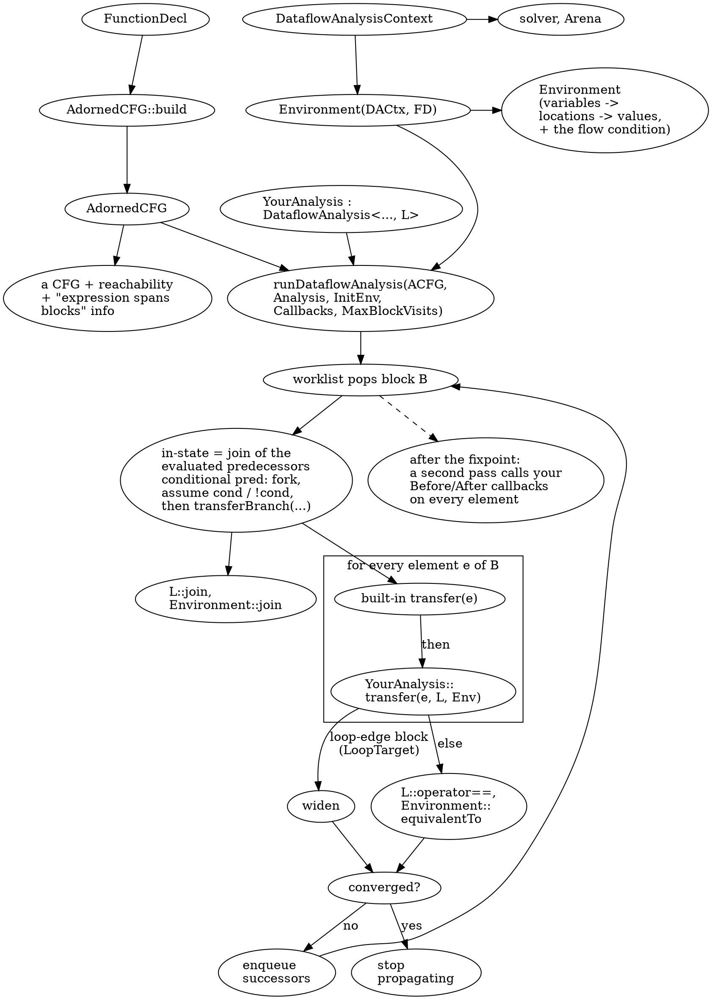
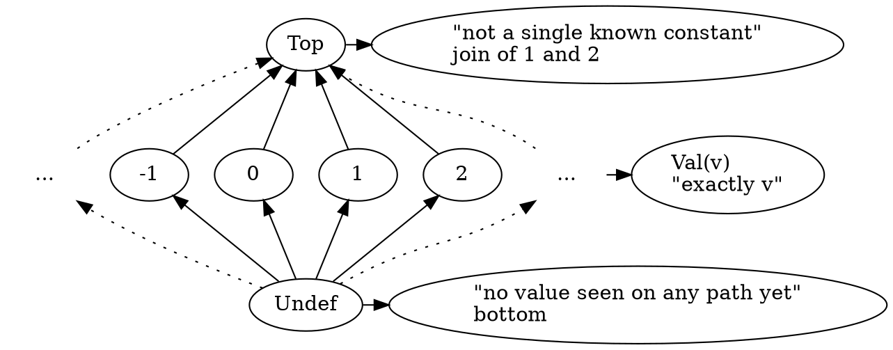
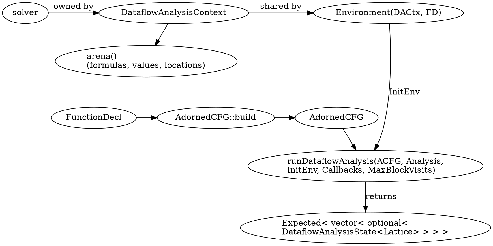
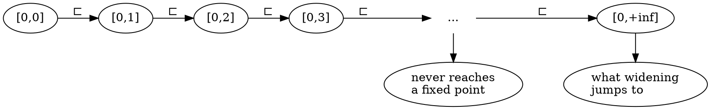
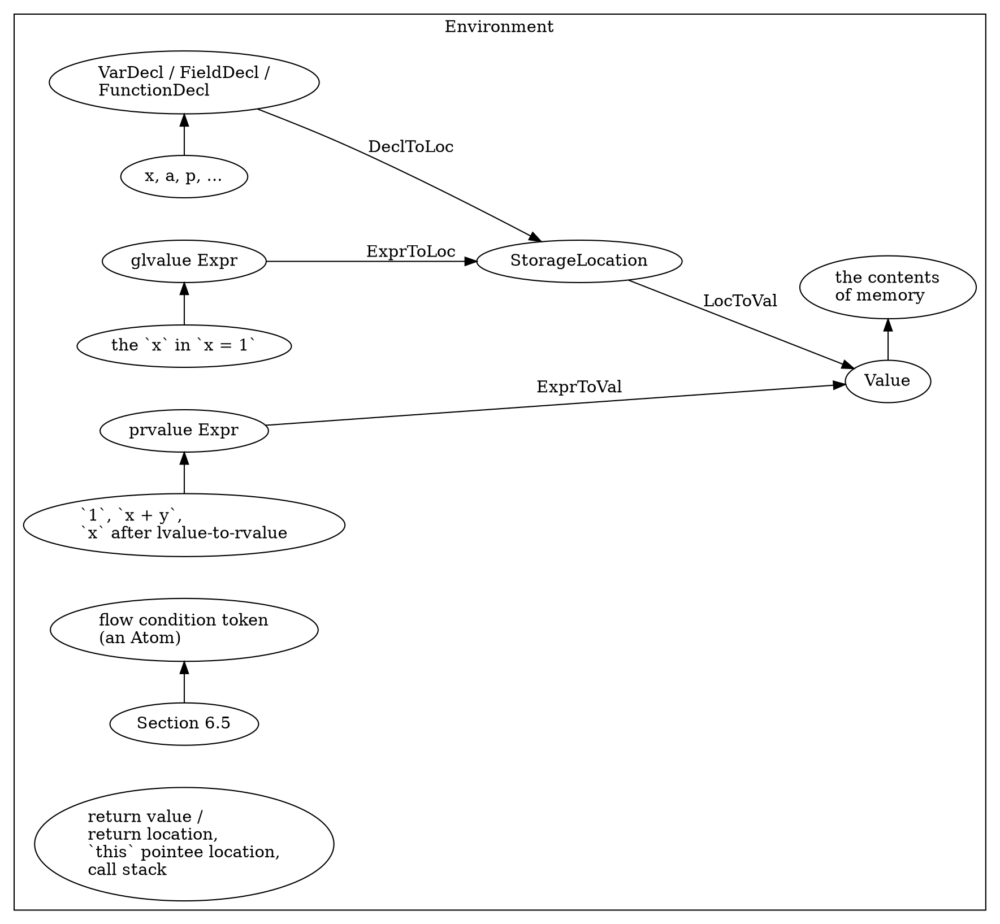

# Part 6 — The FlowSensitive Dataflow Framework

[← Part 5 — Classic CFG Analyses](part_5_classic_analyses.md) | [Part 7 — Capstone & Engineering →](part_7_capstone.md)

## What You'll Learn

- The contract of `DataflowAnalysis<Derived, LatticeT>` (CRTP): `initialElement`, `transfer`, the optional `transferBranch`, and what a lattice must provide (`join` returning a `LatticeEffect`, `operator==`, optionally `widen`)
- Writing a real lattice (a flat constant lattice over `VarMapLattice`), and watching the framework call it
- `AdornedCFG::build`, `DataflowAnalysisContext`, `Environment`, `runDataflowAnalysis`: what each owns, what comes back (`vector<optional<State>>`, indexed by block ID), and `CFGEltCallbacks` Before/After
- Why loops need **widening** for infinite-height lattices, how `LoopTarget` blocks trigger it, and what `MaxBlockVisits` protects you from
- The `Environment`: `StorageLocation` (scalar, record), the five `Value` kinds, `createValue`/`createObject`, `getValue`/`setValue`, `RecordStorageLocation` children and synthetic fields, value properties, and context-sensitive analysis
- `Arena`, `Formula`, `Atom`, flow conditions and the `WatchedLiteralsSolver`; `proves()` / `allows()`; a redundant-condition detector
- `CFGMatchSwitch` / `ASTMatchSwitch` transfer functions and `Environment::ValueModel` (`compare`, `join`, `widen`) — a taint analysis with no lattice at all
- The built-in `UncheckedOptionalAccessModel` + diagnoser, `ChromiumCheckModel`, `CachedConstAccessorsLattice`
- Debugging: the `Logger` interface, `-dataflow-log` (text) and `-dataflow-log=DIR` (HTML), `Environment::dump`

## The Big Picture

Parts 2 to 5 built and read CFGs and ran hand-written passes over them. The FlowSensitive framework is the other kind of analysis: you supply a **lattice**, a **transfer function**, and the framework does the rest — the worklist, joining states where paths meet, proving facts with a SAT solver, and stopping when nothing changes.



The source for that loop is not installed (only headers are), so the diagram is the framework's documented behaviour, confirmed by the traces in this part: Section 6.1 shows the calls arriving, Section 6.3 shows the widening call, Section 6.8 shows the framework's own log.

| Tool (this part) | Section | Does |
|------------------|---------|------|
| `p06_constprop` | 6.1, 6.2 | constant propagation with `VarMapLattice`; per-block and per-element states |
| `p06_contract` | 6.1 | traces every call the framework makes into a lattice and analysis |
| `p06_adorned` | 6.2 | `AdornedCFG` facts, the result vector, callbacks, `MaxBlockVisits`, the build errors |
| `p06_widen` | 6.3 | an interval lattice: no widening, widening, `transferBranch` narrowing |
| `p06_env` | 6.4, 6.8 | dumps locations and values; `createValue`; synthetic fields; properties; inlining |
| `p06_sat` | 6.5 | `Arena`, `Formula`, the solver, flow conditions, the work limit (no C++ input) |
| `p06_flowcond` | 6.5 | redundant-condition detector built on `proves()` |
| `p06_taint` | 6.6 | `CFGMatchSwitch` + `ValueModel`: taint tracking with value properties |
| `p06_optional` | 6.7 | `UncheckedOptionalAccessModel`, options, `ChromiumCheckModel`, limits |
| `p06_log` | 6.8 | a custom `Logger`, `-dataflow-log`, the HTML logger, `Environment::dump` |

All ten tools use the usual `cfglab::runPerFunction` driver and the platform flags from Part 2.1. They accept `--func=NAME` to analyse one function.

> [!note] Build first
> `scripts/build.sh` builds everything; `scripts/build.sh p06_constprop p06_contract` builds just some tools. Every command in this part runs from the lab root.

---

## Section 6.1 — Lattices in code: constant propagation with `VarMapLattice`

### Why

A dataflow analysis is two things: a set of facts ordered by "knows more / knows less" (a **lattice**), and a function that says how each statement changes the facts (a **transfer function**). Before the framework can run your analysis it has to be able to merge two facts and recognise when nothing changed — so those operations have to be written, correctly, as C++ members.

### What to Do

**Sample file:** `manifests/p06_constprop.cpp` — four small functions: straight-line code, a join of equal constants, a join of different constants, and a loop.

#### The lattice

For one `int` variable, constant propagation uses a flat lattice of height three:



`join` is the least upper bound: `join(Undef, x) = x`, `join(Val 5, Val 5) = Val 5`, `join(Val 1, Val 2) = Top`, `join(Top, x) = Top`. Every chain climbs at most two steps, so a fixed point is always reached — the lattice has **finite height**.

A whole function state is a map from variable to that element. `VarMapLattice<E>` is `MapLattice<const VarDecl *, E>`, a `llvm::DenseMap` wrapper. Its `join` joins value by value, and a **missing key counts as bottom**: the key is simply inserted from the other side.

The element type for this analysis (`tools/p06_constprop/constprop.h`):

```cpp
struct Const {
  enum Kind { Undef, Val, Top } K = Undef;
  long long V = 0;

  LatticeEffect join(const Const &O) {                 // in place; say whether *this changed
    if (O.K == Undef || K == Top) return LatticeEffect::Unchanged;
    if (K == Undef) { *this = O; return LatticeEffect::Changed; }
    if (O.K == Top || O.V != V) { *this = top(); return LatticeEffect::Changed; }
    return LatticeEffect::Unchanged;
  }
  bool operator==(const Const &O) const { return K == O.K && (K != Val || V == O.V); }
};
using Lat = VarMapLattice<Const>;
```

#### The contract

`DataflowAnalysis<Derived, LatticeT>` is a CRTP base. These are the members the framework looks for (all verified against `DataflowAnalysis.h`):

| Member | Where | Required? | What the framework does with it |
|--------|-------|-----------|--------------------------------|
| `LatticeT initialElement()` | `Derived` | yes | the state at the entry of the function |
| `void transfer(const CFGElement &, LatticeT &, Environment &)` | `Derived` | yes | apply one CFG element to the state, in place |
| `void transferBranch(bool Branch, const Stmt *Cond, LatticeT &, Environment &)` | `Derived` | optional | called on each outgoing edge of a conditional, after the framework has assumed the condition (Section 6.5) |
| `LatticeEffect join(const LatticeT &)` | `LatticeT` | yes | merge another state in; **return `Changed` iff you changed** |
| `bool operator==(const LatticeT &) const` | `LatticeT` | yes | convergence test |
| `LatticeEffect widen(const LatticeT &Previous)` | `LatticeT` | optional | accelerate or force convergence (Section 6.3); if absent, falls back to an equality test |
| constructor `(ASTContext &)` or `(ASTContext &, DataflowAnalysisOptions)` | `Derived` | yes | `DataflowAnalysis` stores the `ASTContext` |
| `compare` / `join` / `widen` of `Environment::ValueModel` | `Derived` | optional | how *Environment values* merge (Section 6.6) |

`LatticeEffect { Unchanged, Changed }` is the return type of `join` and `widen`; `LatticeJoinEffect` is an alias for it. Two basic lattices ship with the framework: `NoopLattice` (a one-element lattice, for analyses that only use the `Environment`) and `MapLattice`/`VarMapLattice`.

| `MapLattice` member | Notes |
|---------------------|-------|
| `map[key]` (`operator[]`) | inserts a default-constructed element when missing — for `Const` that is `Undef` |
| `find`, `contains`, `begin/end`, `size` | plain `DenseMap` access |
| `join(other)` | per-key `join`; keys missing on one side are inserted; `Changed` if anything was inserted or changed |
| `operator==` | **exact** map equality: "key present with bottom" differs from "key absent" |

> [!warning] Header comment vs code
> The documentation comment at the top of `DataflowAnalysis.h` writes the optional hook as `transferBranch(bool, const Stmt *, TypeErasedLattice &, Environment &)`. The code that actually looks for it (`transferBranchInternal`) is a SFINAE test on `transferBranch(Branch, Stmt, std::declval<LatticeT &>(), Env)`, so the lattice parameter must be your **`LatticeT &`**. A hook with any other signature is not an error — the framework silently picks the no-op overload and your method is never called.

#### The transfer function

`transfer` receives *every* CFG element, so it starts by picking out what it understands: `x = e`, `x += e`, `x++`, and `int x = e`.

```cpp
void transfer(const CFGElement &Elt, Lat &L, Environment &) {
  auto S = Elt.getAs<CFGStmt>();
  if (!S) return;                                   // lifetime markers, destructors, ... : ignore
  if (auto *DS = dyn_cast<DeclStmt>(S->getStmt()))
    for (Decl *D : DS->decls())
      if (auto *V = dyn_cast<VarDecl>(D)) L[V] = V->hasInit() ? eval(V->getInit(), L) : Const{};
  // ... BinaryOperator assignments and ++/-- likewise
}
```

`eval` folds literals, variables, unary minus and `+ - *` over the current state; anything else (a parameter, a call) is `Top`.

Run it on straight-line code and on a join of equal constants. The tool prints the lattice at the **end of each block** (what `runDataflowAnalysis` returns, Section 6.2), entry block first.

```bash
build/bin/p06_constprop manifests/p06_constprop.cpp --func=straight
build/bin/p06_constprop manifests/p06_constprop.cpp --func=same_const
```

```text expected
== straight
  return value: 6
  B2: (empty)
  B1: x=1 y=3
  B0: x=1 y=3
== same_const
  return value: 5
  B5: (empty)
  B4: x=undef
  B3: x=5
  B2: x=5
  B1: x=5
  B0: x=5
```

`return y * 2` evaluates to 6 because `y = x + 2 = 3`. In `same_const` both branches (`B3`, `B2`) end with `x=5`, so the join block `B1` keeps `x=5` and the return value is the constant 5. The entry block `B5` is empty and `B4` has `x=undef`: the declaration `int x;` created the key with the bottom element.

Different constants join to `Top`:

```bash
build/bin/p06_constprop manifests/p06_constprop.cpp --func=diverge
```

```text expected
== diverge
  return value: TOP
  B5: (empty)
  B4: x=undef
  B3: x=1
  B2: x=2
  B1: x=TOP
  B0: x=TOP
```

`B3` ends with `x=1`, `B2` with `x=2`; `B1` is their join and holds `x=TOP`.

> [!hint]- Quiz: why does `diverge` print `B4: x=undef` and not `x=TOP`?
> Which element does a declaration without an initializer produce, and which block holds it?

> [!success]- Answer
> The `DeclStmt` for `int x;` is the first element of `B4`, and `transfer` stores `Const{}` — `Undef`, the bottom. Bottom means "no value on any path yet"; it is only joined away when a branch assigns something. If the declaration stored `Top`, `same_const` could never be proven constant.

#### A loop

```bash
build/bin/p06_constprop manifests/p06_constprop.cpp --func=loop
```

```text expected
== loop
  return value: TOP
  B6: (empty)
  B5: i=0 s=0
  B4: n=TOP i=0 s=TOP
  B3: n=TOP i=0 s=TOP
  B2: n=TOP i=0 s=TOP
  B1: n=TOP i=0 s=TOP
  B0: n=TOP i=0 s=TOP
```

`i` is never written inside the loop, so it stays `0`. `s` starts at 0 and `s += 2` runs a data-dependent number of times: the join of the entry state (`s=0`) with the back-edge state (`s=2`) is `TOP`, and `TOP + 2` is still `TOP` — a fixed point after two passes. Because the lattice has finite height, no widening was needed.

#### Watching the framework call you

`p06_contract` uses a different lattice — the set of variables that *may* have been assigned, join = union — and prints a line every time the framework calls `initialElement`, `transfer`, `transferBranch` or `join`:

```bash
build/bin/p06_contract manifests/p06_contract.cpp --func=branch
```

```text expected
== branch  (analysis starts)
  initialElement()
    transferBranch(true , `a`)
    transfer  x = 1  => {x}
    transferBranch(false, `a`)
    transfer  y = 2  => {y}
    join {x,y} <- {x}  => Changed
== done; state at end of each block:
  B5 {}
  B4 {}
  B3 {x}
  B2 {y}
  B1 {x,y}
  B0 {x,y}
```

Read it top to bottom:

1. `initialElement()` is called once.
2. The framework visits the `true` successor first. Before `x = 1` it calls `transferBranch(true, a)`; before `y = 2` it calls `transferBranch(false, a)`. The condition expression `a` is what the framework passes.
3. Only when the join block is entered, with two evaluated predecessors, does `join` run: `{y}` (left, the first predecessor processed) is joined with `{x}` and the result `{x,y}` is `Changed`. A block with a single predecessor never calls `join`.
4. The state vector at the end lists each block's final state; `B1` (the join block) and `B0` (exit) hold `{x,y}`.

Now the loop:

```bash
build/bin/p06_contract manifests/p06_contract.cpp --func=loop
```

```text expected
== loop  (analysis starts)
  initialElement()
    transferBranch(true , `n`)
    transfer  s = s + n  => {s}
    transfer  n = n - 1  => {n,s}
    join {n,s} <- {}  => Unchanged
    transferBranch(true , `n`)
    transfer  s = s + n  => {n,s}
    transfer  n = n - 1  => {n,s}
    transferBranch(false, `n`)
== done; state at end of each block:
  B6 {}
  B5 {}
  B4 {n,s}
  B3 {n,s}
  B2 {n,s}
  B1 {n,s}
  B0 {n,s}
```

The loop body is transferred twice. The first pass starts from the empty set; the join at the loop head (`join {n,s} <- {}`) merges the back-edge state with the entry state, and since the entry state adds nothing the effect is `Unchanged`. The second pass re-applies the body with `{n,s}` and nothing changes, so the analysis stops. The last `transferBranch(false, n)` is the exit edge.

### Common mistakes

| Mistake | Symptom |
|---------|---------|
| `join` returns `Unchanged` although it changed the lattice | the framework believes the block converged and stops early: wrong, unsound results with no error |
| `join` not monotone / `transfer` not monotone | never converges (hits `MaxBlockVisits`, Section 6.2) or oscillates |
| `operator==` ignores part of the state | premature convergence; the missing part is whatever the first pass computed |
| Iterating a `DenseMap` lattice and printing in map order | output changes from run to run (pointer-hash order). `p06_constprop` sorts by source location before printing |
| Treating "absent from the map" as `Top` in `eval` | joins treat absence as **bottom**; mixing the two silently turns uninitialised variables into constants |
| Expecting `transfer` to see only statements | it sees every `CFGElement`: initializers, lifetime ends, destructors. Filter with `getAs<CFGStmt>()` |

### Verify

The return value of each sample function, predicted from the lattice rules: `straight` is a constant, `same_const` is a constant, `diverge` and `loop` are not.

```bash
for f in straight same_const diverge loop; do
  build/bin/p06_constprop manifests/p06_constprop.cpp --func=$f | grep -E '^==|return value'
done
```

### Expected

```text expected
== straight
  return value: 6
== same_const
  return value: 5
== diverge
  return value: TOP
== loop
  return value: TOP
```

Two constants and two `TOP`s: the lattice join is doing exactly what the table says.

> [!hint]- Quiz: every assignment to `s` in `loop` adds the constant 2. Why is `s` not a constant after the loop?
> What are the two states that meet at the loop head, and what does `join` do with `Val 0` and `Val 2`?

> [!success]- Answer
> At the loop head the entry state (`s=0`) meets the back-edge state (`s=2`). Two different constants join to `Top`, and the analysis has no notion of "the loop ran k times" — a flat lattice can only say "one known constant" or "not known". `Top` then stays `Top` under `+ 2`, so the lattice reaches its fixed point in two passes. Proving `s` is even would need a different lattice.

---

## Section 6.2 — Running an analysis: `AdornedCFG`, `runDataflowAnalysis`, element callbacks

### Why

Section 6.1 gave the framework an analysis; now you have to build the objects it runs on, in the right order, and read the results correctly. Most "no results" and "crash" reports trace back to this wiring: a missing `std::optional` check, a template that was never analysable, a block-visit limit that fired.

### What to Do

**Sample file:** `manifests/p06_adorned.cpp` — `simple`, `ternary` (an expression spanning blocks), `dead_tail` and `endless` (unreachable code), `counted` (a loop), plus a function template. `manifests/p06_adorned.c` is a one-function C file.

#### The five objects



```cpp
auto ACFG = AdornedCFG::build(*FD);                                     // llvm::Expected<AdornedCFG>
if (!ACFG) { /* llvm::toString(ACFG.takeError()) */ return; }

DataflowAnalysisContext DACtx(std::make_unique<WatchedLiteralsSolver>()); // owns solver, Arena
Environment Env(DACtx, *FD);                                            // the entry environment
p06::ConstProp Analysis(Ctx);

auto Res = runDataflowAnalysis(*ACFG, Analysis, Env, Callbacks, MaxBlockVisits);
if (!Res) { /* llvm::toString(Res.takeError()) */ return; }
```

| Object | Created by | Notes |
|--------|-----------|-------|
| `AdornedCFG` | `AdornedCFG::build(const FunctionDecl &)` or `build(const Decl &, Stmt &, ASTContext &)` | the second form analyses an arbitrary statement (a lambda body, an initializer). Returns `llvm::Expected` |
| `DataflowAnalysisContext` | `(std::unique_ptr<Solver>, Options = {})` or `(Solver &, Options = {})` | owns the `Arena` and the caches that keep storage locations stable across revisits. One per function is the norm |
| `Environment` | `Environment(DACtx, const FunctionDecl &)` or `(DACtx, Stmt &)` | the **initial** environment. You do not call `initialize()`: the engine does it on a fork, which is why parameters already have locations (Section 6.4) |
| analysis | your constructor | any state it keeps must be per-run |
| result | `runDataflowAnalysis` | indexed by block ID; `std::nullopt` for blocks never evaluated |

`DataflowAnalysisContext::Options` has two fields, both optional: `ContextSensitiveOpts` (inline callees up to `Depth`, default 2 when engaged — demonstrated in Section 6.4) and `Log` (a `Logger`, Section 6.8). `DataflowAnalysisOptions::BuiltinOpts` (passed to the *analysis* constructor) holds the same `Options` for the built-in transfer functions; set it to `std::nullopt` and the framework's own modelling of statements is switched off (also Section 6.4).

#### What `AdornedCFG` adds to a `CFG`

`AdornedCFG` is a `CFG` built with the "adorned" `BuildOptions` preset from Section 2.3, plus three precomputed answers:

| Member | Meaning |
|--------|---------|
| `getCFG()` | the underlying `const CFG &` |
| `getDecl()` | the declaration it was built for |
| `blockForStmt(const Stmt &)` | the block containing a statement (like `CFGStmtMap`, Section 2.7, but it also looks through nodes the CFG omits) |
| `isBlockReachable(const CFGBlock &)` | is the block reachable from Entry |
| `containsExprConsumedInDifferentBlock(const CFGBlock &)` | does the block contain an expression whose value is used in another block (`?:`, `&&`, `||`) — the engine then keeps expression state across the join |

`p06_adorned` prints those next to the result vector. First an ordinary function with a `?:`:

```bash
build/bin/p06_adorned manifests/p06_adorned.cpp --func=ternary
```

```text expected
== ternary
  result vector has 6 entries, indexed by block ID
  block  elems  reachable  consumed-in-other-block  state
  B5     0      yes        no                       present
  B4     2      yes        yes                      present
  B3     1      yes        yes                      present
  B2     1      yes        yes                      present
  B1     6      yes        no                       present
  B0     0      yes        no                       present
```

The result vector has one entry per block, `B0`..`B5`. In `ternary` the value of `a` is produced in `B4` and consumed by the branch; `b` and `c` are produced in `B2`/`B3` and consumed in `B1`. The three blocks that produce values for others (`B4`, `B3`, `B2`) are flagged in the last column; the join block `B1`, which only consumes them, is not. That is why the engine cannot simply forget expression values at block boundaries.

Now unreachable code:

```bash
build/bin/p06_adorned manifests/p06_adorned.cpp --func=dead_tail
build/bin/p06_adorned manifests/p06_adorned.cpp --func=endless
```

```text expected
== dead_tail
  result vector has 4 entries, indexed by block ID
  block  elems  reachable  consumed-in-other-block  state
  B3     0      yes        no                       present
  B2     4      yes        no                       present
  B1     3      NO         no                       std::nullopt
  B0     0      yes        no                       present
== endless
  result vector has 6 entries, indexed by block ID
  block  elems  reachable  consumed-in-other-block  state
  B5     0      yes        no                       present
  B4     1      yes        no                       present
  B3     2      yes        no                       present
  B2     0      yes        no                       present
  B1     4      NO         no                       std::nullopt
  B0     0      NO         no                       std::nullopt
```

`dead_tail` has a block `B1` holding `a = 5` (after the `return`), but nothing points at it: `reachable` is `NO` and the result entry is `std::nullopt`. In `endless`, `while (true)` has no exit edge (Section 2.3), so the `return a` block `B1` *and* the Exit block `B0` get no state. Code that reads `(*Res)[exit]` unconditionally crashes on any function that never returns.

> [!note] What the state means
> `Res[B]` is the state at the **end** of block `B`, after all of its elements. Section 6.1's tool printed `B4: x=undef` for the block that contains `int x;` and `B1: x=TOP` for the join block — both are end-of-block states. The state at the *start* of a block is the join of its predecessors' end states; there is no API to ask for it directly except a `Before` callback on the first element.

#### What the build refuses

```bash
build/bin/p06_adorned manifests/p06_adorned.cpp --try-template
build/bin/p06_adorned manifests/p06_adorned.c
```

```text expected
AdornedCFG::build(tmpl [template pattern]): error: Cannot analyze templated declarations
== c_function
  AdornedCFG::build failed: Can only analyze C++
```

A template *pattern* has dependent types, so there is nothing to analyse (`runPerFunction` skips them; the tool digs the pattern out of the translation unit to show the message). C code is rejected outright: `AdornedCFG::build` returns the error `Can only analyze C++`. Instantiations, such as `tmpl<int>` used by `use_tmpl`, are ordinary functions and work.

#### Callbacks: `CFGEltCallbacks`

`runDataflowAnalysis` takes an optional `CFGEltCallbacks<Analysis>` with two `std::function`s, `Before` and `After`. Each is called for **every** CFG element with a `DataflowAnalysisState<Lattice>` holding the final lattice and an `Environment`:

```cpp
CFGEltCallbacks<p06::ConstProp> CB;
CB.Before = [&](const CFGElement &E, const DataflowAnalysisState<p06::Lat> &St) { /* state just before E */ };
CB.After  = [&](const CFGElement &E, const DataflowAnalysisState<p06::Lat> &St) { /* state just after  E */ };
```

Three properties matter:

- The callbacks run in a **second pass**, after the fixpoint, with the converged state — so each element is reported exactly once.
- Blocks are visited in **block-ID order** (`B1`, `B2`, ... — the reverse of execution order, because the CFG numbers blocks backwards from Exit); inside a block, elements are in execution order.
- The `Environment` handed to you is a **fork** (`State.Env.fork()` inside `runDataflowAnalysis`), so you may query and even mutate it without changing the analysis.

```bash
build/bin/p06_adorned manifests/p06_adorned.cpp --func=ternary --callbacks
```

```text expected
== ternary
  B1 Before a ? b : c
  B1 After  a ? b : c
  B1 Before a ? b : c
  B1 After  a ? b : c
  B1 Before return a ? b : c
  B1 After  return a ? b : c
  B2 Before b
  B2 After  b
  B3 Before c
  B3 After  c
  B4 Before a
  B4 After  a
  B4 Before a
  B4 After  a
```

The block order is `B1, B2, B3, B4`. `B1` appears first although it runs last; the two identical-looking `a ? b : c` lines in `B1` are different elements — the `ConditionalOperator` and the `ImplicitCastExpr` around it. `p06_adorned` skips the `LifetimeEnds` elements because they are not `CFGStmt`s, but the callbacks do receive them.

With the lattice in the callback, a per-element trace of the constant propagation from Section 6.1 shows the state changing statement by statement:

```bash
build/bin/p06_constprop manifests/p06_constprop.cpp --func=diverge --elements | sed -n 1,16p
```

```text expected
== diverge
  B4
    before int x                      [(empty)]
    after  int x                      [x=undef]
  B3
    before x = 1                      [x=undef]
    after  x = 1                      [x=1]
  B2
    before x = 2                      [x=undef]
    after  x = 2                      [x=2]
  B1
    before return x                   [x=TOP]
    after  return x                   [x=TOP]
  B5: (empty)
  B4: x=undef
  B3: x=1
```

`before x = 1` still shows `x=undef`; `after x = 1` shows `x=1`. The `B1` lines show the join result `x=TOP` already present before `return x`: the join happens when the block is entered, not as an element.

#### `MaxBlockVisits`

The last argument caps the **total number of block visits** (it does not distinguish repeat visits to one block from visits to different blocks). The default is `kDefaultMaxBlockVisits = 20'000`. Exceeding it makes `runDataflowAnalysis` return an error instead of looping forever — the backstop for a lattice that never converges:

```bash
build/bin/p06_adorned manifests/p06_adorned.cpp --func=counted --max-visits=3
build/bin/p06_adorned manifests/p06_adorned.cpp --func=counted | head -3
```

```text expected
== counted
  runDataflowAnalysis failed: maximum number of blocks processed
== counted
  result vector has 7 entries, indexed by block ID
  block  elems  reachable  consumed-in-other-block  state
```

A three-block budget is far too small for a loop (the first run fails with `maximum number of blocks processed`), the default budget is plenty (the second run succeeds). The same error appears, for the same reason, in Section 6.3 when a lattice has no widening.

### Common mistakes

| Mistake | Symptom |
|---------|---------|
| Dereferencing `(*Res)[i]` without checking the `std::optional` | crash on unreachable blocks, including Exit of a non-returning function |
| Ignoring the `llvm::Expected` | an unchecked `Expected` holding an error is a programming error (it aborts in builds with ABI-breaking checks); always test it and consume `takeError()` |
| Building `AdornedCFG` for a template pattern or a C function | the errors shown above; filter with `isTemplated()` and the language first |
| Reusing one `DataflowAnalysisContext` for many functions | works, but formulas, atoms and cached locations pile up and flow-condition numbering depends on the order. Make one per function |
| Expecting callbacks in execution order | they arrive in block-ID order; buffer and sort if you print |
| Mutating the lattice or `Environment` in a callback and expecting it to persist | the callbacks get copies (`fork()`); the analysis has already finished |
| Passing a tiny `MaxBlockVisits` as a performance knob | a failure, not a truncation: you get an error and no partial results |

### Verify

How many blocks never get a state, per function? Predict: none for straight-line code and `?:`, one for `dead_tail`, two for `endless`.

```bash
for f in simple ternary dead_tail endless; do
  printf '%-10s %s\n' $f "$(build/bin/p06_adorned manifests/p06_adorned.cpp --func=$f | grep -c nullopt)"
done
```

### Expected

```text expected
simple     0
ternary    0
dead_tail  1
endless    2
```

The `std::nullopt` entries are exactly the blocks `isBlockReachable` reports as unreachable.

> [!hint]- Quiz: `endless` ends with `return a;`. A checker reports "returned value is 0" at that statement. Where would that report come from?
> Which callback would see the `return`, and does the framework ever call it?

> [!success]- Answer
> Nowhere: the block holding `return a` has `std::nullopt` as its state and the callbacks are only called for evaluated blocks, so `Before`/`After` never fire for it. The statement is dead code. If a checker wants to complain about it, it must use `isBlockReachable` (or Part 5's `ReachableCode`), not the dataflow results.

---

## Section 6.3 — Widening, loops and `MaxBlockVisits`

### Why

A finite lattice converges by itself. Intervals, counters and string lengths do not: `[0,0]`, `[0,1]`, `[0,2]`, ... is an endless ascending chain, so a loop that increments a counter would make the engine iterate until `MaxBlockVisits` fires. **Widening** is the deliberate jump to a coarser answer (`[0,+inf]`) that makes the chain finite.

### What to Do

**Sample file:** `manifests/p06_widen.cpp` — `unbounded` (an `i` that grows with an unknown trip count), `count_up` (`while (i < 10) i++`), and `straight` (no loop).

#### An infinite-height lattice

`p06_widen` tracks the interval `[lo, hi]` of each integer variable (±infinity are the extreme `long long` values; bottom means "no value"). `join` is the interval hull. Nothing in the lattice limits how many times the hull can grow:



First, the lattice with only `join` and `operator==`:

```bash
build/bin/p06_widen manifests/p06_widen.cpp --func=unbounded --max-visits=200
```

```text expected
== unbounded  [no widen]
  analysis failed: maximum number of blocks processed
  (joins so far: 66, widens: 0)
```

The loop body keeps producing `i` one larger, the loop head joins that into a larger interval, and the state never repeats. `--max-visits=200` makes it give up quickly; with the default of 20 000 it takes longer to reach the same error. The counter after the failure shows 66 joins in 200 visits and no widening, because the lattice has none.

#### The `widen` hook

The framework looks for `LatticeEffect widen(const LatticeT &Previous)` on the lattice, with the same SFINAE trick as `transferBranch`. It is called with `*this` = the **new** state of a block and `Previous` = the state that block had the last time. It must (a) replace `*this` with something at least as large as both, and (b) return whether the result differs from `Previous`. The classic interval rule: a bound that moved since last time jumps to infinity.

```cpp
LatticeEffect Interval::widen(const Interval &Prev) {
  if (Prev.Bottom || Bottom) return LatticeEffect::Unchanged;
  Lo = Lo < Prev.Lo ? NegInf : Prev.Lo;       // lower bound fell  -> -inf, else keep
  Hi = Hi > Prev.Hi ? PosInf : Prev.Hi;       // upper bound rose  -> +inf, else keep
  return *this == Prev ? LatticeEffect::Unchanged : LatticeEffect::Changed;
}
```

`MapLattice` has no `widen`, so `p06_widen` wraps it (`struct WidenMap : PlainMap { LatticeEffect widen(const WidenMap &Prev); }`) and widens each key. With it:

```bash
build/bin/p06_widen manifests/p06_widen.cpp --func=unbounded --widen
```

```text expected
== unbounded  [widen]
  B6: (empty)
  B5: i=[0,0]
  B4: n=[-inf,+inf]  i=[0,+inf]
  B3: n=[-inf,+inf]  i=[1,+inf]
  B2: n=[-inf,+inf]  i=[1,+inf]
  B1: n=[-inf,+inf]  i=[0,+inf]
  B0: n=[-inf,+inf]  i=[0,+inf]
  return value: [0,+inf]
  joins=3 widens=2
```

Now the analysis converges: `i` is `[0,+inf]` at the loop head `B4` and in the exit block, and the final answer is `[0,+inf]` — sound ("`i` is non-negative"), and a long way from a precise trip count. Two widenings were enough (`widens=2`).

#### Where widening happens

The engine does not widen everywhere. It compares by `operator==` at ordinary blocks and widens at the one block per loop that carries the loop's back edge — the block with a **`LoopTarget`**. You met it in Part 2.6:

```bash
build/bin/p02_terminators manifests/p06_widen.cpp --func=count_up | head -3
```

```text expected
== count_up
B2
    loopTarget: WhileStmt (line 17)
```

`B2` is the empty block that jumps back to the loop head `B4`, and its `loopTarget` is the `WhileStmt`. In the `count_up` run below it is the block whose value jumps to `+inf` first.

#### Narrowing with `transferBranch`

Widening gives up precision. `count_up` has a condition, `i < 10`, that bounds `i` — if the analysis used it. `transferBranch(Branch, Cond, Lattice &, Environment &)` is where an analysis refines its lattice on one outgoing edge of a conditional: here the true edge clips `hi` to 9 and the false edge raises `lo` to 10. Enable it with `--refine`:

```bash
build/bin/p06_widen manifests/p06_widen.cpp --func=count_up --refine
build/bin/p06_widen manifests/p06_widen.cpp --func=count_up --refine --widen
```

```text expected
== count_up  [no widen] [refine]
  B6: (empty)
  B5: i=[0,0]
  B4: i=[0,10]
  B3: i=[1,10]
  B2: i=[1,10]
  B1: i=[10,10]
  B0: i=[10,10]
  return value: [10,10]
  joins=11 widens=0
== count_up  [widen] [refine]
  B6: (empty)
  B5: i=[0,0]
  B4: i=[0,+inf]
  B3: i=[1,10]
  B2: i=[1,+inf]
  B1: i=[10,+inf]
  B0: i=[10,+inf]
  return value: [10,+inf]
  joins=3 widens=2
```

| Run | Result | Why |
|-----|--------|-----|
| `--refine`, no widen | `[10,10]`, 11 joins | the true edge keeps `i <= 9`, so the chain `[0,0] .. [0,10]` is finite: refinement alone made the lattice converge, and the exit edge pins `i` exactly |
| `--refine --widen` | `[10,+inf]`, 3 joins, 2 widenings | the loop-edge block `B2` is widened to `[1,+inf]` (see its line in the output); the exit edge restores `lo = 10` but nothing brings `hi` back down |
| `--widen` only | `[0,+inf]` | widening with no information about the condition |

Widening trades precision for termination, and the framework has **no narrowing phase** to win the precision back: whatever `+inf` was introduced stays. That is why real analyses prefer lattices whose height is finite for the property they check.

#### Everything else

```bash
build/bin/p06_widen manifests/p06_widen.cpp --func=straight
```

```text expected
== straight  [no widen]
  B2: (empty)
  B1: i=[1,1]
  B0: i=[1,1]
  return value: [1,1]
  joins=0 widens=0
```

No loop, so no `join`, no `widen`, and the answer is exact.

The framework's fallback when a lattice has no `widen` is equality: `widen` degrades to "`Changed` unless the new state equals the previous one". That is correct for any finite-height lattice, which is why Section 6.1's `Const` never needed one. The **Environment** is widened too (`Environment::widen` calls `ValueModel::widen` for values that differ) — Section 6.6.

### Common mistakes

| Mistake | Symptom |
|---------|---------|
| `widen` result smaller than, or incomparable to, `Previous` | the chain is no longer ascending; may never converge |
| `widen` returns `Unchanged` when it did move | premature stop: unsound result |
| Assuming widening happens at every block | only the `LoopTarget` block is widened; a lattice that grows outside a loop (it can't, in a DAG) is simply joined |
| Relying on `MaxBlockVisits` as the termination argument | it only converts non-termination into an error; the fix is widening or a finite lattice |
| Hoping `transferBranch` restores precision after widening | it narrows going forward, but `+inf` already stored in a joined state is not narrowed back |
| Forgetting to forward `join`/`==` when wrapping `MapLattice` | `p06_widen` uses `PlainMap : VarMapLattice<Interval>` and forwards `join` to the base, otherwise the effect is wrong |

### Verify

Check the three headline results in one go.

```bash
for opts in "--func=unbounded --widen" "--func=count_up --refine" "--func=count_up --refine --widen"; do
  build/bin/p06_widen manifests/p06_widen.cpp $opts | grep -E '^==|return value'
done
```

### Expected

```text expected
== unbounded  [widen]
  return value: [0,+inf]
== count_up  [no widen] [refine]
  return value: [10,10]
== count_up  [widen] [refine]
  return value: [10,+inf]
```

Widening alone gives `[0,+inf]`; refinement alone gives the exact `[10,10]`; both together give `[10,+inf]`.

> [!hint]- Quiz: why is the combination `--refine --widen` less precise than `--refine` alone?
> Think about what happens at the first visit of the loop-edge block.

> [!success]- Answer
> With refinement alone the lattice is finite (`hi` is capped at 10 by the condition) so no widening is needed and the exact fixed point `[10,10]` is reached. Once `widen` is available the framework applies it at the loop-edge block `B2` when that block is revisited: its upper bound has moved since the first visit, so it jumps to `+inf`. The false edge can raise `lo` to 10 but cannot lower the `+inf`. Widening is applied whether or not the chain would have been finite.

---

## Section 6.4 — `Environment`: storage locations, values, properties, synthetic fields

### Why

A lattice holds the facts *you* invent. The `Environment` holds the facts the *framework* maintains for you: which variable lives where, what value sits in each location, which expressions evaluated to what, and the flow condition (Section 6.5). It also does the merging at joins, so an analysis that stores its facts as `Value` properties gets path merging for free (Section 6.6). To use it you need to know what it contains.

### What to Do

**Sample file:** `manifests/p06_env.cpp` — `scalars`, `pointers`, `records`, `synthetic`, `calls`.

#### What is inside



Locations and values are allocated by the `Arena` in the `DataflowAnalysisContext` and referred to by address; two things are "the same" when the pointers are equal. `StorageLocation`s come in two kinds, and in Clang 22 `Value` has exactly five:

| `StorageLocation::Kind` | Class | Holds |
|-------------------------|-------|-------|
| `Scalar` | `ScalarStorageLocation` | one `Value` (an `int`, a `bool`, a pointer) |
| `Record` | `RecordStorageLocation` | **no value of its own**: a child location per modelled field (`getChild(FieldDecl)`), plus named **synthetic fields** (`getSyntheticField(name)`) |

| `Value::Kind` | Class | Meaning |
|---------------|-------|---------|
| `Integer` | `IntegerValue` | an opaque integer: identity only, no arithmetic. Literals are interned (`getIntLiteralValue`) |
| `Pointer` | `PointerValue` | a pointer to a `StorageLocation` (`getPointeeLoc()`); the null pointer is a special value per pointee type |
| `TopBool` | `TopBoolValue` | an unconstrained bool |
| `AtomicBool` | `AtomicBoolValue` | a bool backed by a fresh `Atom` — a variable for the SAT solver |
| `FormulaBool` | `FormulaBoolValue` | a bool backed by a compound formula (`a && b`, or the literal `true`) |

`BoolValue` is the common base of the last three; it exposes `formula()`. There is **no `RecordValue` and no `ReferenceValue`** in 22.1.8 (older tutorials use both): a record is only ever a location, and a reference has no location of its own — `StorageLocation`'s constructor asserts its type is not a reference type, and a reference variable is bound to the *referent's* location.

The calls you will use most:

| Call | Does |
|------|------|
| `getStorageLocation(const ValueDecl &)` / `(const Expr &)` | location of a variable / of a glvalue; null if none |
| `setStorageLocation(decl-or-expr, Loc)` | bind; asserts it was unbound |
| `getValue(Loc)` / `getValue(const ValueDecl &)` / `getValue(const Expr &)` | contents; `Loc` must not be a record location |
| `setValue(Loc-or-prvalue-Expr, Val)` | write; `Loc` must not be a record location |
| `get<T>(...)` | `getValue`/`getStorageLocation` followed by `cast_or_null<T>` (asserts on the wrong type) |
| `createValue(QualType)` | a fresh value suitable for the type; **null** for unsupported types; the type must not be a record or reference |
| `createObject(QualType[, InitExpr])`, `createObject(const VarDecl &)` | a location *plus* an initial value |
| `createStorageLocation(Type / Decl / Expr)` | a location only, with no value |
| `create<T>(args...)` | allocate your own `Value` subclass in the arena |
| `getIntLiteralValue(APInt)`, `getBoolLiteralValue(bool)`, `makeAtomicBoolValue()`, `makeTopBoolValue()`, `makeAnd/Or/Not/Implication/Iff` | value and formula factories |
| `fork()` | a copy to mutate independently |
| `dump()` | print everything (Section 6.8) |

#### Inspecting an environment

`p06_env` runs the framework's built-in analysis (`NoopAnalysis`: no lattice, built-in transfer only) and, just before each `return`, prints every variable's location and value. Locations and values get small ids (`L1`, `#3`) in order of first appearance, since addresses would change from run to run.

```bash
build/bin/p06_env manifests/p06_env.cpp --func=scalars
```

```text expected
== scalars
  at `return y`:
    a: Scalar L1 int -> Integer#1
    flag: Scalar L2 bool -> AtomicBool#2 formula=V2
    x: Scalar L3 int -> Integer#3
    y: Scalar L4 int -> Integer#3
    z: Scalar L5 int -> Integer#3
    b: Scalar L6 bool -> AtomicBool#2 formula=V2
    value of the returned expression: Integer#3
```

- `a` and `flag` are parameters: locations and values appeared without any statement creating them, because the engine initialises the entry environment. `int` gets an `Integer`, `bool` gets an `AtomicBool` (its formula is the atom `V2`).
- `y = x` shares the **same Value** as `x` (`#3`): copying copies the pointer, not the contents. That is how the framework knows `x == y`.
- `x = 3` and `z = 3` also share `#3`: integer literals are interned.
- `b = flag` shares `flag`'s bool, so any fact proved about one holds for the other (Section 6.5).
- The expression `y` in `return y` has the value `#3`.

```bash
build/bin/p06_env manifests/p06_env.cpp --func=pointers
```

```text expected
== pointers
  at `return *q`:
    p: Scalar L1 int * -> Pointer#1 -> L2
    v: Scalar L3 int -> Integer#2
    q: Scalar L4 int * -> Pointer#3 -> L3
    n: Scalar L5 int * -> Pointer#4 -> L6
    value of the returned expression: Integer#2
```

The parameter `p` has a `Pointer` value that points at a freshly invented location `L2` (the framework does not know what `p` points to, only that it is something). `q = &v` is a `Pointer` whose pointee is `v`'s own location `L3`, so `*q` reads back `v`'s value (`#2`). `n = nullptr` points at a distinguished null location.

```bash
build/bin/p06_env manifests/p06_env.cpp --func=records
```

```text expected
== records
  at `return s`:
    pt: Record L1 Point
      .x: Scalar L2 int -> Integer#1
      .y: Scalar L3 int -> Integer#2
    ln: Record L4 Line
      .a: Record L5 Point
        .x: Scalar L6 int -> Integer#3
        .y: Scalar L7 int -> Integer#4
    s: Scalar L8 int -> Integer#5
    value of the returned expression: Integer#5
```

A record is a tree of locations. `ln` is a `Line`, which has two `Point` fields `a` and `b` — but only `ln.a` appears: **fields are modelled on demand** (`DataflowAnalysisContext::getModeledFields`: only fields the analysed code mentions). The function reads `ln.a.y` and `pt.x`, so `Point::x` and `Point::y` are modelled (every `Point` has both children), and `Line::a` is; `Line::b` is not. A record location itself never has a value: you read and write its children.

#### What `createValue` can build

```bash
build/bin/p06_env manifests/p06_env.cpp --mode=create --func=scalars
```

```text expected
== createValue / createObject (inside the environment of scalars)
  createValue(int) = Integer#1
  createValue(bool) = AtomicBool#2 formula=V1
  createValue(long) = Integer#3
  createValue(int *) = Pointer#4 -> L1
      pointee location: Scalar L1 int -> Integer#5
  createValue(int **) = Pointer#6 -> L2
      pointee location: Scalar L2 int * -> Pointer#7 -> L3
  createValue(double) = nullptr
  createObject(int): Scalar L4 int -> Integer#8
  getIntLiteralValue(3) twice: same Value
  getIntLiteralValue(3) vs (4): different Values
  getBoolLiteralValue(true) formula: true
  makeAtomicBoolValue() twice: different
```

| Type | Result |
|------|--------|
| `int`, `long` | an `IntegerValue` |
| `bool` | an `AtomicBoolValue` with a fresh atom |
| `int *`, `int **` | a `PointerValue` **and** the pointee locations (and their values), down the chain |
| `double` | `nullptr` — unsupported types give null, so always check |
| record, reference types | not allowed (the call asserts); use `createObject` / `initializeFieldsWithValues` for records |

`getIntLiteralValue(3)` called twice is the same object, `(3)` and `(4)` are different; `getBoolLiteralValue(true)` is a **`FormulaBool`** whose formula is the literal `true`; `makeAtomicBoolValue()` is different every time.

#### Properties and synthetic fields

A `Value` can carry named **properties** (`setProperty(name, Value &)`, `getProperty(name)`), each another `Value` — usually a `BoolValue`. Properties are how Section 6.6 stores "tainted". A *record* cannot carry properties (there is no `RecordValue`); the replacement is a **synthetic field**: an extra named child location that every record of a given type gets. They are declared with `DataflowAnalysisContext::setSyntheticFieldCallback`, which must run **before any `RecordStorageLocation` is created** and must give the same answer for the same type every time. The built-in optional model uses a synthetic field for "has a value".

```bash
build/bin/p06_env manifests/p06_env.cpp --mode=synthetic --func=synthetic
```

```text expected
== synthetic
  c: Record L1 Counter
    .hits: Scalar L2 int -> Integer#1
    $count: Scalar L3 int -> Integer#2
  after setValue($count, <fresh Integer>) and setProperty("checked", true):
    $count: Scalar L3 int -> Integer#3 {checked=FormulaBool#4}
  p: Record L4 Point
```

The callback returned `{"count": int}` for the type `Counter`, so `c` has both its real field `.hits` and a synthetic `$count`. The tool then wrote a fresh `IntegerValue` into `$count` and set the property `checked = true` on it. `p` (a `Point`) has no synthetic fields.

> [!warning] Properties live on the Value, and Values are shared
> A property is stored in the `Value` object, not in the location. Copying a variable copies the `Value` pointer, so every alias sees the property; and interned literals mean *every* use of the literal `5` shares one `Value`. Never `setProperty` on `getIntLiteralValue(...)` — create a fresh `IntegerValue` (as `p06_env` does here and `p06_taint` does for `source()`).

#### Inlining callees (`ContextSensitiveOpts`)

By default a call to a function with a body is opaque: the result is a fresh value. With `DataflowAnalysisContext::Options::ContextSensitiveOpts` the built-in transfer inlines callees up to `Depth` levels using `Environment::pushCall` (the callee's parameters *alias* the argument locations) and `popCall` (the return value comes back). Requirements: the callee is a `FunctionDecl` with a body, no recursion, the body must not reference globals, and arguments map 1:1 to parameters.

```bash
build/bin/p06_env manifests/p06_env.cpp --mode=calls --func=calls
build/bin/p06_env manifests/p06_env.cpp --mode=calls --func=calls --depth=0
build/bin/p06_env manifests/p06_env.cpp --mode=calls --func=calls --depth=2
```

```text expected
== calls
  a = Integer#1
  b = Integer#2
== calls
  a = Integer#1
  b = Integer#2
== calls
  a = Integer#1
  b = Integer#1
```

Without options, and with `Depth = 0` (documented as "disabled"), `b = id(a)` is a fresh `Integer` (`#2`) unrelated to `a` (`#1`). With depth 2 the callee `id` is analysed in a pushed environment and its return value *is* `a`'s value, so `b` and `a` share `#1`.

#### Turning the built-in model off

The built-in transfer functions are what turn `int x = 3;` into "a location for `x` holding the value of `3`". `DataflowAnalysisOptions::BuiltinOpts` is an `std::optional`; construct the analysis with `std::nullopt` and they are skipped:

```bash
build/bin/p06_env manifests/p06_env.cpp --func=scalars --no-builtin
```

```text expected
== scalars
  at `return y`:
    a: Scalar L1 int -> Integer#1
    flag: Scalar L2 bool -> AtomicBool#2 formula=V2
    x: (null location)
    y: (null location)
    z: (null location)
    b: (null location)
    value of the returned expression: (no value)
```

The parameters still have locations and values (the engine initialises those), but the locals have no location at all: no `DeclStmt` was ever modelled, and `return y` has no value. Turn the built-ins off only for an analysis that tracks everything itself; it is rarely worth it.

### Common mistakes

| Mistake | Symptom |
|---------|---------|
| `getValue`/`setValue` on a `RecordStorageLocation` | assertion: records have children, not values |
| `createValue` on a record or reference type | assertion; use `createObject` or `initializeFieldsWithValues` |
| Not checking `createValue`'s null result | crash on unsupported types such as `double` |
| `setStorageLocation` for something that already has one | assertion (`D must not already have a storage location`) |
| `setProperty` on a shared/interned `Value` | the "fact" shows up on unrelated variables |
| Expecting a reference variable to have its own location | it is bound to the referent's location |
| Expecting every field of a record to exist | only fields the analysed code mentions are modelled; `getChild` on a missing one asserts |
| Registering the synthetic-field callback late | assertion (`!RecordStorageLocationCreated`); do it in the analysis constructor |

### Verify

`x`, `y` and `z` all hold the same `Value`:

```bash
build/bin/p06_env manifests/p06_env.cpp --func=scalars | grep -E '^    [xyz]:'
```

### Expected

```text expected
    x: Scalar L3 int -> Integer#3
    y: Scalar L4 int -> Integer#3
    z: Scalar L5 int -> Integer#3
```

Same id three times: copy and equal literals share a `Value`.

> [!hint]- Quiz: `int w = x + 0;` — would `w` share `x`'s `Value`?
> What does the built-in transfer know about `+`?

> [!success]- Answer
> No. The built-in model does not do integer arithmetic (`IntegerValue` has no operations), so `x + 0` produces a fresh `Integer` and `w` is unrelated to `x` as far as the framework knows. That is the reason `p06_taint` (Section 6.6) adds its own transfer case for `+`, `-` and `*`.

---

## Section 6.5 — Flow conditions and SAT: `assume`, `proves`, `allows`, `transferBranch`

### Why

"Is this `if` redundant?" and "Is this optional checked here?" are questions about *paths*: which branches were taken to get here. The framework answers them with logic: every program point has a **flow condition**, a boolean formula over atoms that is true whenever the point is reached, and `proves()` / `allows()` ask a SAT solver what that formula implies.

### What to Do

**Sample files:** `manifests/p06_flowcond.cpp` — nine small functions, each with `if` conditions that are open, redundant or impossible. `p06_sat` needs no input file.

#### `Atom`, `Formula`, `Arena`

An **`Atom`** is a boolean variable named `V0`, `V1`, ... A **`Formula`** is an expression over atoms; the `Arena` builds them. Formulas are interned (same arguments, same object), simplified as they are built, and print in a stable form.

| `Formula::Kind` | Operands | Built with |
|-----------------|----------|-----------|
| `AtomRef` | 0 | `makeAtomRef(Atom)` |
| `Literal` | 0 | `makeLiteral(bool)` |
| `Not` | 1 | `makeNot` |
| `And`, `Or`, `Implies`, `Equal` | 2 | `makeAnd`, `makeOr`, `makeImplies`, `makeEquals` |

```bash
build/bin/p06_sat --demo=arena
```

```text expected
  atoms:           P = V0, Q = V1
  P & Q            (V0 & V1)
  P | !Q           (V0 | !V1)
  P => Q           (V0 => V1)
  P <=> Q          (V0 = V1)
  interned:        And(P,Q) == And(Q,P)  : same object
  simplified:      Or(P,P) is P          : yes
  simplified:      Not(Not(P)) is P      : yes
  simplified:      And(P, true) is P     : yes
  simplified:      And(P, false)         : false
  parseFormula:    "(V0 | !V1)" -> the same interned formula
  kinds:           AtomRef(0) Literal(0) Not(1) And(2) Or(2) Implies(2) Equal(2)
  named atoms:     (is_null | is_error)
```

Pointer equality is formula equality for identical constructions (`And(P,Q)` and `And(Q,P)` are the same object — commutative operators ignore order). `Or(P,P)`, `Not(Not(P))` and `And(P,true)` collapse to `P`; `And(P,false)` is `false`. `parseFormula` reads the printed form back (and may mention atoms that were never made). `Formula::print` takes an optional `AtomNames` map to print `is_null | is_error` instead of `V0 | V1`.

#### The solver

`Solver::solve(ArrayRef<const Formula *>)` decides whether the **conjunction** is satisfiable and returns `Satisfiable` (with a model), `Unsatisfiable`, or `TimedOut`. The framework's implementation is `WatchedLiteralsSolver`, a DPLL SAT solver with watched literals; it takes an optional work limit and reports `reachedLimit()`.

```bash
build/bin/p06_sat --demo=solver
```

```text expected
  solve(P & Q)           : Satisfiable  model: V0=T V1=T
  solve(P & !P)          : Unsatisfiable
  solve(P => Q, P)       : Satisfiable  model: V0=T V1=T
  solve(P => Q, P, !Q)   : Unsatisfiable
  proves/allows are built on solve():
    proves(F)  == unsat( FC & !F )
    allows(F)  == sat( FC & F )
  with FC = (P => Q) & P:
    proves(Q)  : true
    allows(Q)  : true
    allows(!P) : false
```

Everything else is built on `solve`. With a flow condition `FC`:

| Query | Meaning | Implemented as |
|-------|---------|----------------|
| `Env.proves(F)` | `F` holds on **every** way of reaching here | `FC ∧ ¬F` is unsatisfiable |
| `Env.allows(F)` | `F` holds on **some** way of reaching here | `FC ∧ F` is satisfiable |
| `Env.assume(F)` | add `F` to the facts at this point | extends the flow condition |

Both queries return `false` when the solver times out: a timeout can never produce a "proved" diagnostic.

#### Flow conditions

A flow condition is represented by a **token**: an atom whose definition (`token <=> C1 ∧ C2 ∧ ...`) lives in the `DataflowAnalysisContext`. `forkFlowCondition(token)` makes a new token with the same constraints, `addFlowConditionConstraint(token, F)` adds a fact, `joinFlowConditions(a, b)` makes a token for `a ∨ b`, and `flowConditionImplies`/`flowConditionAllows` are what `proves`/`allows` call.

```bash
build/bin/p06_sat --demo=flow
```

```text expected
  P = V0, Q = V1
  FC0 = V2 (a fresh token: nothing known)
  FC0 implies P?  false   allows P? true
  true  edge V3: implies P? true  allows !P? false
  false edge V4: implies P? false  allows P?  false
  join V5 = V3 | V4:
     implies Q? false   (only the true path knew Q)
     implies P | !P? true
     implies P? false   allows P? true   allows !P? true
  contradictory path: assume P on the false edge too
     allows anything? allows(true): false   (unsatisfiable FC allows nothing)
     implies false:   true   (and so implies everything)
```

This is exactly what the engine does around `if (P)`: the true edge forks the token and assumes `P` (`V3`); the false edge forks and assumes `!P` (`V4`); the join block gets `V3 | V4`. Afterwards `P | !P` is implied but `P` alone is not, and only the true path knew `Q`. The last two lines show **vacuous truth**: if a path assumes both `P` and `!P`, its condition is unsatisfiable, so it *implies everything* and allows nothing.

> [!warning] A token means "may have been reached", not "was reached"
> The header says so: wherever a flow-condition token appears in a successor's condition, it means "that point may have been reached". After an `if`/`else` the two branch tokens exclude each other; at a loop head the *entry* token is an ancestor of the *back-edge* token, so they do not. Section 6.6 hits this.

#### A redundant-condition detector

`p06_flowcond` implements the whole checker in a callback. For every `if` condition it asks the environment right after the condition was evaluated: does it **prove** the condition (always true here), or prove its negation (always false)?

```cpp
auto *BV = dyn_cast_or_null<BoolValue>(St.Env.getValue(*Cond));   // the built-in model gave the condition a bool
if (!BV) { /* not modelled */ }
bool AlwaysTrue  = St.Env.proves(BV->formula());
bool AlwaysFalse = St.Env.proves(St.Env.arena().makeNot(BV->formula()));
```

The engine has already done the logic: it gave the condition expression a `BoolValue`, and on each outgoing edge of the branch it forked the flow condition and assumed that value (true edge) or its negation (false edge), *then* called `transferBranch` if the analysis has one.

```bash
build/bin/p06_flowcond manifests/p06_flowcond.cpp
```

```text expected
== open_cond
  line 5: `a`  unknown
== nested_same
  line 12: `a`  unknown
  line 13: `a`  ALWAYS TRUE
== nested_opposite
  line 21: `a`  unknown
  line 24: `a`  ALWAYS FALSE
== after_join
  line 33: `a`  unknown
  line 35: `a`  unknown
== through_local
  line 43: `a`  unknown
  line 44: `b`  ALWAYS TRUE
== compound_a
  line 53: `a`  ALWAYS TRUE
== compound_b
  line 61: `!b`  ALWAYS FALSE
== vacuous
  line 70: `a`  unknown
  line 71: `!a`  ALWAYS FALSE
  line 72: `c`  BOTH PROVEN (unreachable path)
== equal_ints
  line 82: `x == y`  ALWAYS TRUE
== pointer_checks
  line 89: `p`  no BoolValue (not modelled)
  line 90: `p == nullptr`  unknown
== int_truthy
  line 98: `x`  unknown
  line 99: `x`  unknown
== not_modelled
  line 107: `x < 3`  no BoolValue (not modelled)
  line 108: `x < 3`  no BoolValue (not modelled)
```

| Function | Result | Why |
|----------|--------|-----|
| `open_cond` | `unknown` | nothing is known about `a` |
| `nested_same` | inner `a` ALWAYS TRUE | the true edge of `if (a)` assumed `a` |
| `nested_opposite` | inner `a` ALWAYS FALSE | the else-edge assumed `!a` |
| `after_join` | second `a` unknown | after the join the flow condition is `a ∨ ¬a`: no information |
| `through_local` | `b` ALWAYS TRUE | `b = a` shares `a`'s `BoolValue` (Section 6.4) |
| `compound_a`, `compound_b` | `a` ALWAYS TRUE; `!b` ALWAYS FALSE | the true edge of `a && b` knows both operands |
| `vacuous` | `!a` ALWAYS FALSE; then `c` **BOTH PROVEN** | inside `!a` the path condition is `a ∧ ¬a`, unsatisfiable: everything is proved. The tool prints `BOTH PROVEN (unreachable path)` when `F` and `!F` are both proved |
| `equal_ints` | `x == y` ALWAYS TRUE | `y = x` shares the `Value`; comparing a `Value` to itself is `true` |
| `pointer_checks` | `p` has no `BoolValue`; `p == nullptr` unknown | the pointer-to-bool conversion produces no bool value, and the `==` is not tied to it |
| `int_truthy` | both `x` unknown | every `int -> bool` conversion makes a fresh, unrelated bool |
| `not_modelled` | `x < 3` has no `BoolValue` | the built-in model does not interpret ordered comparisons |

The last three rows are the model's limits, not tool bugs: a checker that needs null-pointer or range reasoning has to supply the modelling itself (Section 6.6) or use a lattice (Section 6.3).

`--show-fc` prints the formula, the flow-condition token, and `allows` for each side:

```bash
build/bin/p06_flowcond manifests/p06_flowcond.cpp --func=nested_same --show-fc
```

```text expected
== nested_same
  line 12: `a`  unknown   formula=V2 token=V41 allows(f)=1 allows(!f)=1
  line 13: `a`  ALWAYS TRUE   formula=V2 token=V37 allows(f)=1 allows(!f)=0
```

Both conditions are the same formula, atom `V2` (the value of the parameter `a`). At the outer `if` both `V2` and `!V2` are allowed (`unknown`); at the inner one, under a different token, only `V2` is allowed — so `!V2` is proved false.

#### The solver's work limit

A SAT problem can be exponential. `WatchedLiteralsSolver(WorkLimit)` counts abstract solver steps and gives up with `TimedOut` after `WorkLimit` of them, deterministically. `kDefaultMaxSATIterations` is 1 000 000 000.

```bash
build/bin/p06_sat --demo=limit
```

```text expected
  6 pigeons, 5 holes: 81 clauses (unsatisfiable)
  WatchedLiteralsSolver(10): TimedOut, reachedLimit() = 1
  WatchedLiteralsSolver(100000): Unsatisfiable, reachedLimit() = 0
  (a timed-out query makes proves() AND allows() return false)
```

Six pigeons in five holes is unsatisfiable but needs search; a limit of 10 steps times out and `reachedLimit()` is true, 100 000 steps proves it. `diagnoseFunction` (Section 6.7) turns a reached limit into the error `SAT solver timed out`.

### Common mistakes

| Mistake | Symptom |
|---------|---------|
| Treating "proves both `F` and `!F`" as a normal result | it means the path is infeasible. Report it as unreachable, not as "always true" |
| Treating a failed `proves` as `!F` | `proves(F) == false` only means "not proved"; use `allows` for the other direction |
| Using a flow-condition token as "this path was taken" | it means "may have been reached"; correlated reasoning across a loop head is unsound (Section 6.6) |
| Forgetting that a timeout makes `proves` **and** `allows` false | a "clean" verdict can be a timeout; check `reachedLimit()` (or use `diagnoseFunction`) |
| Building formulas with another context's `Arena` | formulas are arena-allocated and interned; mix them and you get dangling or non-interned nodes |
| Expecting `x < 3` to produce a bool | not modelled; the condition has no `BoolValue` |
| Writing `transferBranch` with the wrong lattice parameter | silently never called (Section 6.1) |

### Verify

The same condition is open at the outer `if` and decided at the inner one:

```bash
build/bin/p06_flowcond manifests/p06_flowcond.cpp --func=nested_same
build/bin/p06_flowcond manifests/p06_flowcond.cpp --func=nested_opposite
```

### Expected

```text expected
== nested_same
  line 12: `a`  unknown
  line 13: `a`  ALWAYS TRUE
== nested_opposite
  line 21: `a`  unknown
  line 24: `a`  ALWAYS FALSE
```

One fact (`a`) decides the inner condition in both directions, depending on which edge was taken.

> [!hint]- Quiz: in `after_join`, `if (a) r = 1; if (a) r = 2;`, the second test is `unknown`. A human knows both tests go the same way. What is the framework missing?
> What is the flow condition after the first `if` completes?

> [!success]- Answer
> The join of the two branch flow conditions, `a ∨ ¬a`, which says nothing. The framework does not remember *which* branch was taken once paths merge unless some value carries the correlation. That is the job of an analysis that stores facts as value properties merged by a `ValueModel::join` (Section 6.6, the `correlated` sample), or of a lattice that tracks the pair of states separately.

---

## Section 6.6 — `CFGMatchSwitch` transfer functions and `ValueModel`

### Why

A real `transfer` is a pile of `if (auto *CE = dyn_cast<CallExpr>(...))` and name checks. The framework ships a small dispatcher that lets you write "when you see *this* AST pattern, do *that*", using the same matchers as `clang-query` (the AST-matcher DSL from the LibTooling lab). And when facts live on `Value`s instead of in a lattice, you must say how two Values merge at a join — that is the `Environment::ValueModel` interface.

### What to Do

**Sample file:** `manifests/p06_taint.cpp` — `source()` returns tainted data, `sanitize(x)` cleans it, `sink(x)` must not receive tainted data; ten functions combine them with copies, arithmetic, branches and loops.

#### The match-switch API

| Type | Role |
|------|------|
| `ASTMatchSwitchBuilder<BaseT, State, Result>` | collects `CaseOf<NodeT>(matcher, action)` calls, then `Build()` |
| `ASTMatchSwitch<BaseT, State, Result>` | the result: `std::function<Result(const BaseT &, ASTContext &, State &)>` |
| `CFGMatchSwitchBuilder<State, Result>` | the same for CFG elements: `CaseOfCFGStmt<NodeT>(matcher, action)` for statement-like elements and `CaseOfCFGInit<NodeT>(matcher, action)` for constructor initializers |
| `CFGMatchSwitch<State, Result>` | `std::function<Result(const CFGElement &, ASTContext &, State &)>`; elements that are neither a statement (`Statement`, `Constructor`, `CXXRecordTypedCall`) nor an initializer are ignored and return a default `Result` |
| action | `Result(const NodeT *, const MatchFinder::MatchResult &, State &)` |
| `TransferState<LatticeT>` | the usual `State`: `{LatticeT &Lattice; Environment &Env;}` |
| `TransferStateForDiagnostics<LatticeT>` | the read-only version given to diagnosers: `{const LatticeT &Lattice; const Environment &Env;}` |

`Build()` wraps all the matchers in one `anyOf`, tags each with `TagN`, and runs the action of the first case that matched. Order your cases from most specific to most general. The switch is built once, in the analysis constructor, and applied in `transfer`:

```cpp
class TaintAnalysis : public DataflowAnalysis<TaintAnalysis, NoopLattice> {
  CFGMatchSwitch<TransferState<NoopLattice>> Switch =
      CFGMatchSwitchBuilder<TransferState<NoopLattice>>()
          .CaseOfCFGStmt<CallExpr>(callExpr(callee(functionDecl(hasName("source")))),
              [](const CallExpr *CE, const MatchFinder::MatchResult &R, State &S) {
                auto &V = S.Env.create<IntegerValue>();          // a fresh Value ...
                V.setProperty("tainted", S.Env.getBoolLiteralValue(true));   // ... marked tainted
                S.Env.setValue(*CE, V);                           // ... as the call's result
              })
          // ... sanitize(), and + - * ...
          .Build();
public:
  void transfer(const CFGElement &Elt, NoopLattice &L, Environment &Env) {
    TransferState<NoopLattice> S(L, Env);
    Switch(Elt, getASTContext(), S);
  }
```

The analysis has **no lattice at all** (`NoopLattice`). The fact "this integer is tainted" is a property on the integer's `Value`, holding a `BoolValue`. The built-in model copies `Value` pointers along assignments, so `int y = x;` carries the property for free; arithmetic creates a new `Value`, so a case for `+ - *` ORs the operands' properties; `sanitize` returns a fresh clean `Value`. `sink(x)` is checked after the fixpoint, in a `Before` callback: `proves(taint)` is TAINTED, `allows(taint)` is MAY BE TAINTED, otherwise clean.

```bash
build/bin/p06_taint manifests/p06_taint.cpp
```

```text expected
== direct
  line 8: sink(x)  TAINTED
== copy
  line 15: sink(y)  TAINTED
== arithmetic
  line 22: sink(y)  TAINTED
== clean
  line 27: sink(x)  clean
== sanitized
  line 33: sink(y)  clean
== branch
  line 41: sink(x)  MAY BE TAINTED
== both
  line 51: sink(x)  TAINTED
== correlated
  line 60: sink(x)  TAINTED
  line 62: sink(x)  clean
== loop
  line 72: sink(x)  MAY BE TAINTED
== swap_loop
  line 85: sink(x)  MAY BE TAINTED
  line 86: sink(y)  MAY BE TAINTED
```

`direct`, `copy` and `arithmetic` are TAINTED; `clean` and `sanitized` are clean. `branch` is the interesting one: `x` is tainted only on the `if (a)` path, so after the merge it MAY BE tainted. `both` is tainted on both paths, hence TAINTED. `correlated` is the payoff: `sink(x)` under `if (a)` is TAINTED, under the `else` it is clean — the analysis remembers which path the taint came from. `loop` is MAY BE TAINTED after a loop that adds `source()` to `x` an unknown number of times.

Which case fired, and how often? `--trace-cases` prints each case and, at the end, how often the framework called the `ValueModel`:

```bash
build/bin/p06_taint manifests/p06_taint.cpp --func=branch --trace-cases
```

```text expected
== branch
    case: source()  `source()`
    case: source()  `source()`
  line 41: sink(x)  MAY BE TAINTED
  ValueModel calls: join=2 widen=0 compare=0
```

`source()` shows up **twice** for a single call: once in the analysis pass and once more in the second, callback pass of Section 6.2 that re-runs the transfer functions. Transfer functions must therefore be repeatable — no counters, no `static` state that assumes one visit per element.

#### `Environment::ValueModel`

Values that live in the `Environment` merge at joins by the framework's rules (`Environment::join`): a location present in both with *the same* `Value` keeps it; if the `Value`s differ, the framework creates a new `Value` of the right kind and asks the model. `DataflowAnalysis` derives from `Environment::ValueModel`, so you override its three virtual functions:

| Virtual | When called | You decide |
|---------|-------------|-----------|
| `ComparisonResult compare(QualType, Val1, Env1, Val2, Env2)` | convergence checks (`Environment::equivalentTo`) for two different Values at one location | `Same`, `Different` or `Unknown` (default) |
| `void join(QualType, Val1, Env1, Val2, Env2, Value &Joined, Environment &JoinedEnv)` | a join of two different Values at one location | set properties on `Joined` (a fresh `Value`); `JoinedEnv` is the merged environment; `Env1`/`Env2` are the two inputs |
| `std::optional<WidenResult> widen(QualType, Value &Prev, const Environment &, Value &Current, Environment &)` | loop-edge block revisited | return `{value, Changed/Unchanged}`, or `std::nullopt` for "not my value". Default: delegate to `compare` |

`p06_taint` overrides `join` so that the merged `Value` records where its taint came from:

```cpp
void join(QualType, const Value &V1, const Environment &E1, const Value &V2, const Environment &E2,
          Value &Joined, Environment &JoinedEnv) override {
  Arena &A = JoinedEnv.arena();
  BoolValue &B = JoinedEnv.makeAtomicBoolValue();                // taint of the merged value: a fresh atom
  const Formula &FC1 = A.makeAtomRef(E1.getFlowConditionToken());
  const Formula &FC2 = A.makeAtomRef(E2.getFlowConditionToken());
  // If we came from path 1, B means what V1's taint meant; from path 2, what V2's did.
  JoinedEnv.assume(A.makeImplies(FC1, A.makeEquals(B.formula(), taintOf(&V1, E1).formula())));
  JoinedEnv.assume(A.makeImplies(FC2, A.makeEquals(B.formula(), taintOf(&V2, E2).formula())));
  Joined.setProperty("tainted", B);
}
```

That is the whole of the path sensitivity in `correlated`: after the merge, "B is true iff we came through the path where `x` was assigned `source()`", and the later `if (a)` selects that path. Without the override the merged `Value` has no property at all:

```bash
build/bin/p06_taint manifests/p06_taint.cpp --func=branch --no-join-model
build/bin/p06_taint manifests/p06_taint.cpp --func=correlated --no-join-model
```

```text expected
== branch
  line 41: sink(x)  clean
== correlated
  line 60: sink(x)  clean
  line 62: sink(x)  clean
```

Both functions now say "clean" for data that is (or may be) tainted — silent false negatives. Property-carrying analyses must override `join`.

#### The loop caveat

The `join` shown above is the *naive* version, available as `--naive-join`. The `join` that `p06_taint` actually uses first checks that the two paths are **disjoint**:

```cpp
bool Disjoint = !JoinedEnv.allows(A.makeAnd(FC1, FC2));
if (Disjoint) { /* the two implications above */ }
else          { /* only definite facts: both proved -> B; neither possible -> !B; else B stays free */ }
```

Why: flow-condition tokens mean "may have been reached" (Section 6.5). After `if/else` the two branch tokens exclude each other, so "FC1 implies B<=>t1 and FC2 implies B<=>t2" is a sound summary. At a **loop head** the entry path's token is an *ancestor* of the back-edge path's token (every back-edge path also went through the entry), so the two implications contradict each other whenever the body ran, and the solver concludes that one side is impossible. The disjointness test is a SAT query on the joined environment.

```bash
build/bin/p06_taint manifests/p06_taint.cpp --func=loop --naive-join
build/bin/p06_taint manifests/p06_taint.cpp --func=swap_loop --naive-join
build/bin/p06_taint manifests/p06_taint.cpp --func=swap_loop
```

```text expected
== loop
  line 72: sink(x)  clean
== swap_loop
  line 85: sink(x)  TAINTED
  line 86: sink(y)  clean
== swap_loop
  line 85: sink(x)  MAY BE TAINTED
  line 86: sink(y)  MAY BE TAINTED
```

With the naive join `loop` reports **clean** (taint added to `x` on every iteration, ignored), and `swap_loop` — where `x` and `y` exchange values each iteration, so either may hold the tainted one — reports `x` TAINTED and `y` clean, which is wrong in both directions. With the disjointness check both are MAY BE TAINTED.

The same program, with the counters the framework reports for a loop:

```bash
build/bin/p06_taint manifests/p06_taint.cpp --func=loop --trace-cases | grep -v case
```

```text expected
== loop
  line 72: sink(x)  MAY BE TAINTED
  ValueModel calls: join=4 widen=0 compare=9
```

The loop head merges the entry and back-edge values, so `join` is called four times in total; convergence checks call `compare` nine times; `widen` is called **zero** times — the loop converged through `compare` before the back-edge block needed revisiting. (Compare Section 6.3, where the lattice's `widen` did run.) `p06_taint` still overrides `widen` and `compare` so that an analysis whose facts live in properties has a convergence argument for loops that do revisit the back-edge block.

> [!warning] The default widening forgets
> If `widen` returns `std::nullopt` and `compare` is `Unknown`, the framework cannot say two Values are equivalent, and for values it does not understand it falls back to dropping what it knows. An analysis that keeps its facts in properties must therefore make `compare`/`widen` collapse them to something stable (the two-point lattice `{clean, may-be-tainted}` of literal formulas, as in `p06_taint::widen`), or the facts silently disappear when a loop is revisited.

### Common mistakes

| Mistake | Symptom |
|---------|---------|
| No `join` override for property-carrying values | merged values have no property: silent false negatives (shown above) |
| Trusting `FC1`/`FC2` to be exclusive in `join` | wrong at loop heads |
| Counting or recording inside `transfer` | the second (callback) pass re-runs it: double counts |
| Registering the broad case before the specific one | `anyOf` runs the first matching case; the narrow case is shadowed |
| Matchers that need `bind` | `Build()` binds `TagN` itself; ask the `MatchFinder::MatchResult` for your own ids only if you bound them in the matcher |
| Setting a property on an existing `Value` instead of a fresh one | the property appears on every alias and on interned literals (Section 6.4) |
| Forgetting that `CFGMatchSwitch` ignores non-statement elements | `LifetimeEnds`, `AutomaticObjectDtor`, ... fall through: handle them in `transfer` before calling the switch |

### Verify

Predict: `branch` MAY BE TAINTED, `correlated` splits into TAINTED and clean, and `sanitized` is clean.

```bash
for f in branch correlated sanitized; do build/bin/p06_taint manifests/p06_taint.cpp --func=$f; done
```

### Expected

```text expected
== branch
  line 41: sink(x)  MAY BE TAINTED
== correlated
  line 60: sink(x)  TAINTED
  line 62: sink(x)  clean
== sanitized
  line 33: sink(y)  clean
```

> [!hint]- Quiz: in `correlated`, what would the two `sink(x)` verdicts be if `join` set the property to a fresh atom but assumed nothing about it?
> Could the solver ever prove that atom true, or false?

> [!success]- Answer
> `MAY BE TAINTED` for both. An unconstrained atom can be true or false on either side of the later `if (a)`, so neither `proves` nor a failed `allows` can succeed. The two implications against the flow-condition tokens are exactly what correlate the merged value with the branch condition.

---

## Section 6.7 — Built-in models: `UncheckedOptionalAccessModel` and friends

### Why

You do not have to write an analysis to use the framework: it ships ones that real tools run — clang-tidy's `bugprone-unchecked-optional-access` is the `UncheckedOptionalAccessModel` of this section. Seeing what such a model does, and how it is driven, tells you what a production analysis looks like.

### What to Do

**Sample file:** `manifests/p06_optional.cpp` — safe and unsafe `std::optional` accesses, a class with a const accessor, and a Chromium-style `CHECK`. It includes `<optional>` on purpose; the tool's platform flags (Part 2.1) find libc++.

#### The model and its diagnoser

| Piece | Header | Role |
|-------|--------|------|
| `UncheckedOptionalAccessModel` | `Models/UncheckedOptionalAccessModel.h` | a `DataflowAnalysis<..., UncheckedOptionalAccessLattice>` that models `std::optional`, `absl::optional` and `base::Optional`: each optional record gets a synthetic boolean field ("holds a value"), updated by `has_value()`, `operator bool`, `reset()`, `emplace()`, construction and assignment |
| `UncheckedOptionalAccessLattice` | same | `CachedConstAccessorsLattice<NoopLattice>` |
| `UncheckedOptionalAccessModelOptions` | same | `IgnoreSmartPointerDereference`, `IgnoreValueCalls` |
| `UncheckedOptionalAccessDiagnoser` | same | a callable `(CFGElement, ASTContext, TransferStateForDiagnostics) -> SmallVector<UncheckedOptionalAccessDiagnostic>`; a diagnostic is just a `CharSourceRange` |
| `diagnoseFunction<Analysis, Diagnostic>(FD, ASTCtx, Diagnoser, MaxSATIterations, MaxBlockVisits)` | `DataflowAnalysis.h` | does everything Section 6.2 did by hand — `AdornedCFG`, solver, context, environment, run — and returns `llvm::Expected<SmallVector<Diagnostic>>` |

`diagnoseFunction` constructs the analysis itself through `createAnalysis<T>(ASTContext &, Environment &)`: so a model that needs the `Environment` (to register synthetic fields) has a constructor `(ASTContext &, Environment &)`, one that does not has `(ASTContext &)`. The diagnoser runs in the callback pass (here `After`), reading the final state — it cannot change the analysis.

```bash
build/bin/p06_optional manifests/p06_optional.cpp
```

```text expected
== ok_has_value
  (no diagnostics)
== ok_negated
  (no diagnostics)
== ok_initialized
  (no diagnostics)
== ok_emplace
  (no diagnostics)
== bad_unchecked
  line 30: unchecked optional access: `o`
== bad_wrong_branch
  line 35: unchecked optional access: `o`
== bad_default
  line 41: unchecked optional access: `o`
== bad_reset
  line 47: unchecked optional access: `o`
== bad_value
  line 54: unchecked optional access: `o`
== bad_merge
  line 63: unchecked optional access: `o`
== cached_ok
  (no diagnostics)
== cached_invalidated
  line 83: unchecked optional access: `b.get()`
== chromium_check
  line 102: unchecked optional access: `o`
```

| Function | Result | Why |
|----------|--------|-----|
| `ok_has_value`, `ok_negated` | clean | the access is dominated by a check; `proves(has_value)` holds in the flow condition |
| `ok_initialized`, `ok_emplace` | clean | constructed from a value / `emplace` sets `has_value` |
| `bad_unchecked` | diagnosed | nothing is known about the parameter |
| `bad_wrong_branch` | diagnosed | the check is on the *empty* path |
| `bad_default` | diagnosed | a default-constructed optional is empty (`proves(!has_value)`) |
| `bad_reset` | diagnosed | `reset()` clears `has_value` after the check |
| `bad_value` | diagnosed | `value()` counts, unless `IgnoreValueCalls` |
| `bad_merge` | diagnosed | only one path checked, so after the merge the optional may be empty |
| `cached_ok` | clean | two calls to the const accessor `b.get()` return "the same" optional (`CachedConstAccessorsLattice`) |
| `cached_invalidated` | diagnosed | the non-const call `b.clear()` invalidated the cache |

The diagnostic range is the **optional** (`o`, `b.get()`), not the `*o` that dereferences it. The tool prints the text of the range with `Lexer::getSourceText`.

#### Options and limits

```bash
build/bin/p06_optional manifests/p06_optional.cpp --func=bad_value
build/bin/p06_optional manifests/p06_optional.cpp --func=bad_value --ignore-value-calls
```

```text expected
== bad_value
  line 54: unchecked optional access: `o`
== bad_value
  (no diagnostics)
```

`IgnoreValueCalls` removes the `value()` diagnostic (the call throws `bad_optional_access` rather than invoking undefined behaviour). `IgnoreSmartPointerDereference` plays the same role for optionals reached through overloaded `operator*` and `operator->` other than the optional's own.

`diagnoseFunction` takes the two limits you met earlier:

```bash
build/bin/p06_optional manifests/p06_optional.cpp --func=bad_merge --max-sat=1
build/bin/p06_optional manifests/p06_optional.cpp --func=ok_has_value --max-visits=2
```

```text expected
== bad_merge
  failed: SAT solver timed out
== ok_has_value
  failed: maximum number of blocks processed
```

A solver that reaches its work limit (`--max-sat`, the `MaxSATIterations` argument) makes the whole call fail with `SAT solver timed out`, rather than risk a wrong "clean". A block-visit overrun fails with the Section 6.2 message. A real tool must handle both `Expected` errors: skip the function, never report "no problems".

#### `ChromiumCheckModel`

Chromium's `CHECK(cond)` aborts when `cond` is false, so code after it may rely on `cond`. `ChromiumCheckModel` is a `DataflowModel` — a reusable `bool transfer(const CFGElement &, Environment &)` that returns whether it recognised the element, rather than a full analysis. It looks for calls to `::logging::CheckError::.*Check` methods and treats the path after such a call as impossible. It is meant to be run *beside* another model: `p06_optional --chromium` wraps both in one analysis,

```cpp
void transfer(const CFGElement &E, UncheckedOptionalAccessLattice &L, Environment &Env) {
  Chromium.transfer(E, Env);        // CHECK failure => this path ends
  Optional.transfer(E, L, Env);
}
```

```bash
build/bin/p06_optional manifests/p06_optional.cpp --func=chromium_check
build/bin/p06_optional manifests/p06_optional.cpp --func=chromium_check --chromium
```

```text expected
== chromium_check
  line 102: unchecked optional access: `o`
== chromium_check
  (no diagnostics)
```

The sample's `CHECK(o.has_value())` expands to `cond ? (void)0 : Voidify() & CheckError::Check(...)`. Without the model the false arm looks like an ordinary path that continues, so `*o` is diagnosed. With it, the `Check` call ends that path and the only way to `*o` goes through `has_value() == true`.

#### `CachedConstAccessorsLattice`

`CachedConstAccessorsLattice<Base>` is a *lattice mixin*, not a model. It remembers, per object, the value returned by each const method, so that two calls `b.get()` return the same `Value` until a non-const method clears the cache (`clearConstMethodReturnValues(RecordLoc)` — the **analysis** must call it; the mixin never does it for you). `join` keeps only the entries that agree in both inputs. That is why `cached_ok` is clean and `cached_invalidated` is not. Reuse it by deriving your lattice from it: `using MyLattice = CachedConstAccessorsLattice<MyBase>;`.

`UncheckedStatusOrAccessModel.h` is a third shipped model, for `absl::StatusOr` (its helpers live in `namespace statusor_model`); it is listed here for completeness and is not exercised in this part.

### Common mistakes

| Mistake | Symptom |
|---------|---------|
| Treating "no diagnostics" as "no problems" when `diagnoseFunction` returned an error | a timed-out function looks clean |
| Running `diagnoseFunction` on a template pattern | `Cannot analyze templated declarations` (Section 6.2); analyse instantiations |
| A diagnostic callback with side effects on the analysis | the callback gets a read-only view (`TransferStateForDiagnostics`); keep state outside |
| Using `Before` and `After` both for the same diagnostic | duplicates, since each element is seen twice (before and after) |
| Forgetting the model's constructor takes the `Environment` | `diagnoseFunction` requires `AnalysisT(ASTContext &, Environment &)` or `AnalysisT(ASTContext &)` |
| Expecting `ChromiumCheckModel` to work alone | it only edits the `Environment`; it needs an analysis around it |

### Verify

The file has 13 functions. Eight are flagged by the optional model alone (`bad_unchecked`, `bad_wrong_branch`, `bad_default`, `bad_reset`, `bad_value`, `bad_merge`, `cached_invalidated`, `chromium_check`); with the Chromium model the last one is cleared.

```bash
build/bin/p06_optional manifests/p06_optional.cpp | grep -c 'unchecked optional access'
build/bin/p06_optional manifests/p06_optional.cpp --chromium | grep -c 'unchecked optional access'
```

### Expected

```text expected
8
7
```

Eight diagnostics without the Chromium model, seven with it.

> [!hint]- Quiz: `bad_reset` checks `if (o)` and then reads `*o` after `o.reset()`. Which part of the model flips the answer from "clean" to "diagnosed"?
> What does `reset()` do to the synthetic field?

> [!success]- Answer
> The model treats `reset()` as writing "empty" into the optional's `has_value` field. The earlier `if (o)` only added a fact to the flow condition *about the old value*; after the write, the question "is `has_value` true now?" is answered from the field's current value and the proof fails. Facts recorded about a location are only as good as the last write to it.

---

## Section 6.8 — Debugging: `-dataflow-log`, HTML logs, `Environment::dump`

### Why

An analysis that gives a surprising answer is a black box until you can see the intermediate states: which block was visited when, what the environment looked like, what the flow condition was. The framework has three windows into a run, from lightweight to thorough, and a handful of context options that shape what you see.

### What to Do

**Sample file:** `manifests/p06_constprop.cpp` (Section 6.1), function `diverge` (an `if/else` with a join) and `same_const`.

#### The `Logger` interface

A `Logger` is told about the *structure* of a run, and the analysis can add its own messages:

| Member | Called when |
|--------|-------------|
| `Logger::null()`, `Logger::textual(llvm::raw_ostream &)`, `Logger::html(factory)` | factories for the stock loggers (a no-op, text to a stream, an HTML page per function) |
| `beginAnalysis(const AdornedCFG &, TypeErasedDataflowAnalysis &)` / `endAnalysis()` | start and end of one `runDataflowAnalysis` |
| `enterBlock(const CFGBlock &, bool PostVisit)` | a block is (re-)processed; `PostVisit` is true in the callback pass of Section 6.2 |
| `enterElement(const CFGElement &)` | the transfer function is about to run on an element |
| `recordState(TypeErasedDataflowAnalysisState &)` | the state after the current element is known |
| `blockConverged()` | the current block's state is final |
| `log(llvm::function_ref<void(raw_ostream &)> Emit)` | **you** call it from `transfer` (or anywhere); `Emit` is only run if the logger is interested; the text arrives in the virtual `logText(StringRef)` |

You install one with `DataflowAnalysisContext::Options::Log`. Inside an analysis the logger is `Env.getDataflowAnalysisContext().getOptions().Log` (never null while an analysis runs — the framework substitutes the no-op logger). `p06_log` defines `TraceLogger` overriding every hook, and wraps Section 6.1's analysis so that a `log()` line is written whenever the lattice changes:

```cpp
Env.getDataflowAnalysisContext().getOptions().Log->log([&](llvm::raw_ostream &OS) {
  OS << "constprop changed the lattice at " << cfglab::stmtText(Stmt, Ctx, 24);
});
```

```bash
build/bin/p06_log manifests/p06_constprop.cpp --func=same_const --logger=custom | grep -v recordState | sed -n 1,24p
```

```text expected
== same_const
[logger] beginAnalysis
[logger] enterBlock B4
[logger]   enterElement Statement  `int x`
[logger]   log: constprop changed the lattice at int x
[logger]   enterElement Statement  `a`
[logger]   enterElement Statement  `a`
[logger]   enterElement Statement  `a`
[logger] enterBlock B3
[logger]   enterElement Statement  `5`
[logger]   enterElement Statement  `x`
[logger]   enterElement Statement  `x = 5`
[logger]   log: constprop changed the lattice at x = 5
[logger] enterBlock B2
[logger]   enterElement Statement  `5`
[logger]   enterElement Statement  `x`
[logger]   enterElement Statement  `x = 5`
[logger]   log: constprop changed the lattice at x = 5
[logger] enterBlock B1
[logger]   enterElement Statement  `x`
[logger]   enterElement Statement  `x`
[logger]   enterElement Statement  `return x`
[logger]   enterElement LifetimeEnds
[logger]   enterElement LifetimeEnds
```

Blocks arrive as `B4, B3, B2, B1, B0` — execution order, unlike the callback pass. Inside each, `enterElement` shows the elements (`int x`, then the sub-expressions `a`...); the `log:` lines appear exactly where `transfer` changed the lattice. For every element the framework calls `enterElement` and then, after the transfer, `recordState`; the example hides the `recordState` lines (they print the flow-condition token, `V4` throughout `B4`).

When callbacks are given to `runDataflowAnalysis`, a second pass walks every block again, flagged `PostVisit`:

```bash
build/bin/p06_log manifests/p06_constprop.cpp --func=same_const --logger=custom --dump-env | grep -E 'beginAnalysis|enterBlock|endAnalysis'
```

```text expected
[logger] beginAnalysis
[logger] enterBlock B4
[logger] enterBlock B3
[logger] enterBlock B2
[logger] enterBlock B1
[logger] enterBlock B0
[logger] enterBlock B0  (post-visit pass)
[logger] enterBlock B1  (post-visit pass)
[logger] enterBlock B2  (post-visit pass)
[logger] enterBlock B3  (post-visit pass)
[logger] enterBlock B4  (post-visit pass)
[logger] enterBlock B5  (post-visit pass)
[logger] endAnalysis
```

The first five `enterBlock` lines are the analysis; the next six, in block-ID order (`B0` .. `B5`, entry included), are the post-visit pass in which `Before`/`After` callbacks run.

#### `-dataflow-log`: the framework's own text log

`-dataflow-log` is a hidden `llvm::cl` option defined *inside* `libclang-cpp`, so any tool that parses `llvm::cl` options through `CommonOptionsParser` accepts it (the lab's tools all do). If `Options::Log` is null, the context checks the flag and builds a textual logger writing to **stderr**. The log is long — it prints the AST and CFG of the function, then the state after every element — so select from it:

```bash
build/bin/p06_log manifests/p06_constprop.cpp --func=diverge -dataflow-log 2>&1 >/dev/null | sed -E 's/0x[0-9a-f]+/0xADDR/g' | grep -E '^=== '
```

```text expected
=== Beginning data flow analysis ===
=== Entering block B4 (iteration 1) ===
=== Entering block B3 (iteration 1) ===
=== Entering block B2 (iteration 1) ===
=== Entering block B1 (iteration 1) ===
=== Entering block B0 (iteration 1) ===
=== Finished analysis: 5 blocks in 5 total steps ===
```

(`2>&1 >/dev/null` sends stderr through the pipe and drops stdout.) Each block is entered once. The last line reports the work done: 5 blocks, 5 steps. For a loop you would see `(iteration 2)` lines — the same information as Section 6.2's `MaxBlockVisits`, block by block.

The most useful part is the state per element, including the **flow condition**. This is the state after `x = 1` in the true branch `B3`:

```bash
build/bin/p06_log manifests/p06_constprop.cpp --func=diverge -dataflow-log 2>&1 >/dev/null \
  | awk '/^Computed state for B3\.3:/{p=1} /^=== Entering block B2/{p=0} p' | sed -n '/Flow condition token/,$p'
```

```text expected
Flow condition token: V8
True atoms: (V0, V1, V2, V4, V5, V6, V8)

Flow condition constraints before simplification:
V8
(V8 = V6)
(V6 = (V4 & V5))
(V4 = V2)
(V2 = V1)
(V1 = V0)
V0
```

Read the constraints from the bottom: `V0` (the function is entered) ... `V4 = V2` (entry flows into `B4`) ... `V6 = (V4 & V5)`: the true edge of `if (a)` is the predecessor's flow condition **and** `V5`, the atom that is the value of the condition `a`. `V8 = V6` is `B3` itself. That is Section 6.5's fork-and-assume, made visible.

#### The HTML log

`-dataflow-log=DIR` (with a directory) selects the **HTML** logger: one numbered page per analysed function (`0.html`, `1.html`, ...), self-contained, to open in a browser.

```bash
mkdir -p out/p06_html
build/bin/p06_log manifests/p06_constprop.cpp --func=diverge -dataflow-log=out/p06_html
ls out/p06_html
grep -o '<section id="[a-z]*"' out/p06_html/0.html
```

```text expected
== diverge
0.html
<section id="timeline"
<section id="function"
<section id="block"
<section id="element"
```

The page is organised as a `timeline` of the analysis steps, the `function` (source and CFG), the selected `block` (with its iterations) and the selected `element`, whose state is the environment and flow condition of the text log. It is the same data as the text log, navigable; open it with `open out/p06_html/0.html`. With no `--func` filter every function the tool analyses gets its own numbered file.

`p06_log` also supports `--logger=textual`, which installs `Logger::textual(llvm::outs())` in the options instead of using the flag — the same text, on stdout, chosen by code rather than by command line.

#### `Environment::dump`

For a single point in a program, call `Environment::dump()` (to `llvm::errs()`) or `dump(raw_ostream &)` — typically from a callback.

```bash
build/bin/p06_log manifests/p06_constprop.cpp --func=diverge --dump-env | sed -E 's/0x[0-9a-f]+/0xADDR/g'
```

```text expected
== diverge
DeclToLoc:
  [a, 0xADDR]
  [x, 0xADDR]
ExprToLoc:
  [0xADDR, 0xADDR]
ExprToVal:
  [0xADDR, 0xADDR: Integer(@0xADDR)]
LocToVal:
  [0xADDR (a), 0xADDR: Integer(@0xADDR)]
  [0xADDR (x), 0xADDR: Integer(@0xADDR)]
ReturnVal: nullptr

Flow condition token: V22
Constraints:
(V11 | V8)
(V11 = !V8)
True atoms: (V0, V1, V2, V4, V19, V22)
Equivalent atoms:
(V5, V6, V8)
(V9, V11)

Flow condition constraints before simplification:
V22
(V22 = V19)
(V19 = (V11 | V8))
(V8 = V6)
(V6 = (V4 & V5))
(V4 = V2)
(V2 = V1)
(V1 = V0)
V0
(V11 = V9)
(V9 = (V4 & !V5))
```

The dump is the environment's four maps (`DeclToLoc`, `ExprToLoc`, `ExprToVal`, `LocToVal`), the return value, and then the flow condition: the token `V22`, the constraints that remain after simplification (`V11 | V8` and `V11 = !V8` — the two branches of the `if`), the atoms known true, groups of equivalent atoms, and finally the *unsimplified* definition chain. Reading it bottom-up: `V9 = (V4 & !V5)` is the false edge, `V11 = V9`; `V8 = V6 = (V4 & V5)` is the true edge; `V19 = (V11 | V8)` is the join; `V22 = V19` is the block holding `return x`. This is the if/else diamond as logic. (Addresses are masked with `sed`.)

#### Options at a glance

| Where | Setting | Effect |
|-------|---------|--------|
| `DataflowAnalysisContext(Solver &, Options)` | `Options::ContextSensitiveOpts` | `std::nullopt`: calls are opaque (default). `ContextSensitiveOptions{Depth}`: inline callees up to `Depth` (Section 6.4) |
| same | `Options::Log` | the `Logger` (this section); if null, the `-dataflow-log` flags decide |
| `WatchedLiteralsSolver(std::int64_t WorkLimit)` | work limit | deterministic SAT timeout (Section 6.5); default unlimited, `diagnoseFunction` passes `kDefaultMaxSATIterations` |
| `runDataflowAnalysis(..., MaxBlockVisits)` | `kDefaultMaxBlockVisits = 20'000` | non-convergence backstop (Sections 6.2, 6.3) |
| analysis constructor | `DataflowAnalysisOptions::BuiltinOpts` | `std::nullopt` disables the built-in transfer functions (Section 6.4) |
| `DataflowAnalysisContext` | `setSyntheticFieldCallback`, `addInvariant` | synthetic record fields; facts true on every path |

### Common mistakes

| Mistake | Symptom |
|---------|---------|
| Looking for `-dataflow-log` output on stdout | it is on stderr |
| Reading the whole log | it contains the AST and CFG first; filter with `grep '^=== '` and `awk` on `Computed state for B...` |
| `Options::Log` pointing at a logger that is destroyed before the context | dangling pointer: the context stores a raw pointer; keep the `unique_ptr` alive past the analysis |
| Comparing logs between runs without masking addresses | pointer values change every run: `sed -E 's/0x[0-9a-f]+/0xADDR/g'` |
| Side effects in `log()` callbacks | `Emit` may never be called (a no-op logger skips it) |
| Expecting the HTML logger to be a stream | it needs a directory; `-dataflow-log=out/x` creates numbered files inside it, and the directory must exist |

### Verify

Predict: `diverge` has 5 blocks and no loop, so the text log enters 5 blocks once each, and the HTML directory has one page.

```bash
build/bin/p06_log manifests/p06_constprop.cpp --func=diverge -dataflow-log 2>&1 >/dev/null | grep -c 'Entering block'
ls out/p06_html | wc -l | tr -d ' '
```

### Expected

```text expected
5
1
```

> [!hint]- Quiz: in the text log, the flow condition of `B3` mentions the atom `V5` and `B2`'s mentions `!V5`. What is `V5`?
> Which value did the built-in model assign to the condition expression `a`?

> [!success]- Answer
> `V5` is the atom of the `AtomicBoolValue` that the built-in model created for the condition `a` — the parameter converted to `bool`. On the true edge the engine assumes `V5`; on the false edge `!V5`. That atom is also what `Env.getValue(*Cond)->formula()` returns in Section 6.5's detector.

---

## Section 6.9 — Checkpoint

| Concept | What You Proved |
|---------|-----------------|
| Lattice contract | `join` returns `Changed`/`Unchanged` and must be monotone; `operator==` decides convergence; `widen` is optional; the framework found `transferBranch` only if its lattice parameter is `LatticeT &` |
| `VarMapLattice` | a `DenseMap` lattice where a missing key is bottom; iterate it in source order, not map order |
| Constant propagation | a flat lattice (`Undef < Val < Top`) joined across branches: `same_const` stays 5, `diverge` becomes `TOP` |
| The call sequence | `initialElement` once; `transfer` per element; `transferBranch` on each outgoing conditional edge; `join` only where two evaluated predecessors meet |
| `AdornedCFG` | C++ only, no templates; `isBlockReachable`, `blockForStmt`, `containsExprConsumedInDifferentBlock` |
| `runDataflowAnalysis` | `Expected<vector<optional<State>>>` indexed by block ID; the state is the **end** of the block; `nullopt` for unreachable blocks |
| Callbacks | `Before`/`After` per element, in a second pass, in block-ID order, with a forked `Environment` |
| `MaxBlockVisits` | counts every block visit; overrun is an error (`maximum number of blocks processed`) |
| Widening | an interval lattice never converges on a counting loop; `widen` at the `LoopTarget` block jumps to `+inf`; no narrowing phase |
| `Environment` | decl/expr to location, location to value; five `Value` kinds, two location kinds; values and interned literals are shared |
| Records | only mentioned fields are modelled; synthetic fields extend any record type; properties live on `Value`s |
| `createValue` | integers, bools, pointers (with their pointees); `nullptr` for `double` |
| Inlining | `ContextSensitiveOpts{Depth}` makes `b = id(a)` share `a`'s value |
| Formulas and SAT | `Arena` interns and simplifies; `WatchedLiteralsSolver` decides satisfiability; a work limit gives `TimedOut`, and `proves`/`allows` both return false |
| Flow conditions | a token per point; `if` forks and assumes `cond` / `!cond`; joins disjoin them; an infeasible path proves everything |
| Redundant conditions | `proves(cond)` and `proves(!cond)` in a callback; not modelled: ordered comparisons, pointer and integer truthiness |
| `CFGMatchSwitch` | matcher + action per case, first match wins; non-statement elements ignored; transfer runs twice (analysis + callback pass) |
| `ValueModel::join` | property-carrying values must override it; flow-condition implications are sound only for disjoint paths |
| `UncheckedOptionalAccessModel` | 13 sample functions: 8 diagnosed; limits make `diagnoseFunction` fail instead of passing; `ChromiumCheckModel` needs an analysis around it |
| Debugging | `Logger` hooks, `-dataflow-log` (stderr, text), `-dataflow-log=DIR` (HTML), `Environment::dump` |

### API surprises collected in this part

1. `ControlFlowContext.h` is `AdornedCFG.h`; there is no `RecordValue` or `ReferenceValue` (5 `Value` kinds); `Environment` has no `SkipPast` parameters.
2. The `transferBranch` hook is documented with `TypeErasedLattice &` but selected with `LatticeT &`; a wrong signature is silently ignored.
3. `LatticeJoinEffect` is an alias of `LatticeEffect`; `join` must return the effect, not `void`.
4. `runDataflowAnalysis`'s result is the state at the **end** of each block, and is `std::nullopt` for unreachable blocks (including `Exit` of a non-returning function).
5. `Before`/`After` callbacks run after the fixpoint, in block-ID order, with a forked `Environment`; transfer functions run twice per element.
6. `getBoolLiteralValue(true)` is a `FormulaBool`, not an `AtomicBool`; `getIntLiteralValue` values are interned and shared.
7. `createValue(double)` returns `nullptr`; `createValue` on records or references asserts.
8. Flow-condition tokens mean "may have been reached"; they are not path-exclusive at loop heads.
9. `proves` and `allows` both return `false` on a solver timeout; an unsatisfiable flow condition makes `proves` true for everything.
10. Pointer-to-bool and int-to-bool conversions, and ordered comparisons, get no useful `BoolValue` from the built-in model.
11. `-dataflow-log` is a hidden `llvm::cl` option inside `libclang-cpp`; it writes to stderr; `=DIR` selects the HTML logger.
12. `DataflowAnalysisContext::Options::ContextSensitiveOpts` with `Depth = 0` is the same as disabled.

**Ready for Part 7?** Next you combine everything in a capstone: the CFG builders, a classic pass and a flow-sensitive checker together in a tool you could ship, and the engineering around it — plugins, clang-tidy integration, whole-translation-unit runs and verification.

---

[← Part 5 — Classic CFG Analyses](part_5_classic_analyses.md) | [Part 7 — Capstone & Engineering →](part_7_capstone.md)
