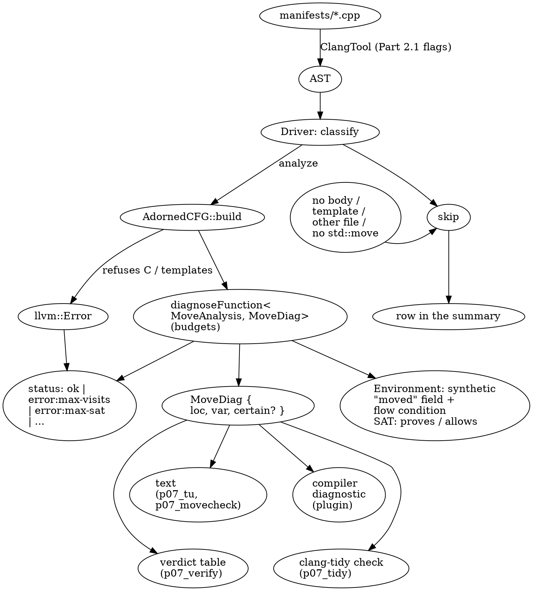
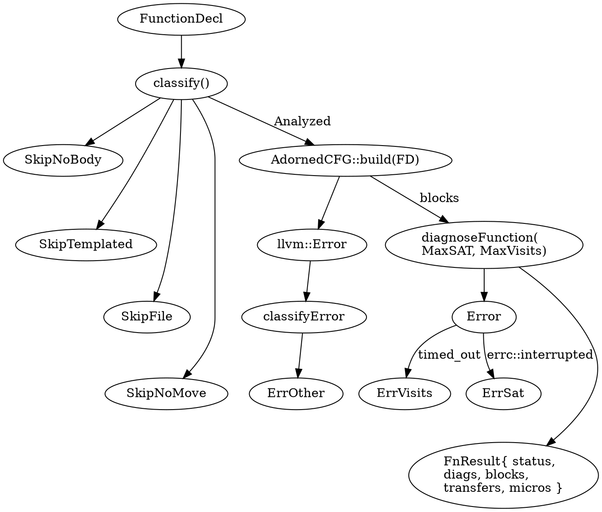

# Part 7 — Capstone & Engineering

[← Part 6 — The FlowSensitive Dataflow Framework](part_6_dataflow_framework.md) | [README](README.md)

## What You'll Learn

- How to turn "a property I care about" into a checker specification: events, per-object state, a join, and fixtures that pin the expected verdicts before any code exists
- A complete use-after-move checker on the FlowSensitive framework: a synthetic `moved` field on every movable object, `Environment` values and flow conditions as the state, and a `DiagnosisCallbacks` diagnoser through `diagnoseFunction`
- Where the framework's contract differs from what the headers suggest: parameters initialised *after* your constructor, `Environment::get<T>` casting without checking, `Before` versus `After` state, vacuous `proves()` on dead paths
- A whole-translation-unit driver: classification and skipping, `MaxBlockVisits` and `MaxSATIterations` budgets, `llvm::Error` triage, crash isolation with `CrashRecoveryContext`, exit codes
- A lit/`-verify`-style test harness with strict `xfail` and `known-fp` markers, so known gaps are recorded instead of forgotten
- Context-sensitive analysis (`ContextSensitiveOpts`, `pushCall`): what it buys, and the measured fact that the callee is *not* run through your transfer function
- Packaging the same checker three ways (standalone tool, Clang plugin, clang-tidy module) and comparing it with `cplusplus.Move` and `bugprone-use-after-move`
- Performance and persistence: a deterministic cost proxy, scaling, budgets derived from CFG shape, and why you store compact tables and verdicts rather than dataflow state
- Combining classic CFG analyses (reachability, dominators, back edges, WTO) with dataflow results

## The Big Picture

Parts 2–6 each taught one layer. A checker that people actually run needs all of them, plus the engineering around them:



All code lives in `tools/p07_*`. One header holds the checker; the other tools wrap it:

| Tool | Section | Does |
|------|---------|------|
| `tools/p07_movecheck/MoveModel.h` | 7.1, 7.2 | the checker: `MoveAnalysis`, `MoveDiagnoser`, `MoveDiag` (header only) |
| `p07_movecheck` | 7.2 | `diagnoseFunction` on every function, prints warnings |
| `p07_tu` (+ `Driver.h`) | 7.3, 7.7 | whole-TU driver: skipping, budgets, error triage, crash recovery, `--emit=tsv` |
| `p07_verify` | 7.4 | test harness: fixtures with `expect` / `xfail` / `known-fp` markers |
| `p07_ctx` | 7.5 | the checker with `ContextSensitiveOpts{Depth}` and a pushCall explainer |
| `p07_plugin`, `p07_tidy` | 7.6 | the checker as a Clang plugin and as a clang-tidy module (shared libraries) |
| `p07_combined` | 7.7 | classic CFG metrics next to the dataflow verdicts |
| `p07_persist` | 7.7 | sizes of compact tables, verdicts and full dataflow state; round trip from text |

> [!note] Build first
> `scripts/build.sh p07_movecheck p07_tu p07_verify p07_ctx p07_combined p07_persist p07_plugin p07_tidy` builds everything this part uses. The two shared libraries land in `build/lib/`, the executables in `build/bin/`.

---

## Section 7.1 — Design a checker

### Why

Code comes last. A checker that was never specified cannot be tested, and a framework analysis with the wrong state model cannot be rescued by clever transfer functions. This section writes the specification: the property, the events that change it, the state, and the sample that fixes the expected answers.

### What to Do

**Sample file:** `manifests/p07_move.cpp` — ten small functions, one use-after-move shape each. `std::move` is declared by hand so no standard header is needed.

**The property.** After an object is moved from, it must not be used again until it is re-initialised.

**The events** the checker must recognise, and what each does to the one bit of state per object (`moved`):

| Event | Syntactic form (in this checker) | Effect on `moved` |
|-------|----------------------------------|-------------------|
| declaration | `Buf a;` | `a.moved = false` |
| move site | `Buf b(std::move(a))`, `x = std::move(a)`, `f(std::move(a))` where `f` takes `T&&` | `a.moved = true` |
| re-initialisation | `a = ...`, `a.reset()` (also `clear`, `assign`, `emplace`, `init`) | `a.moved = false` |
| use | any other mention of `a` | **report** if `a.moved` may be true |

A *move site* is where the value is consumed, not where `std::move` is called: `std::move(a)` alone is only a cast. That is why the checker looks at the constructor or call that receives it.

**Why a bit-vector analysis is not enough.** Part 5's classic analyses are gen/kill sets joined by union. Here that would be "set of possibly-moved variables". It reports `correlated_ok` below, because after the join the set contains `a` and the analysis has forgotten *why*:

```
  void correlated_ok(bool c) {
    Buf a;
    if (c)   sink(std::move(a));     B2: a.moved = true
    if (!c)  a.use();                B1: reached only when c is false
  }
```

The FlowSensitive framework keeps a *flow condition* per `Environment`. At the join after the first `if`, the framework combines the two values of the `moved` flag into one boolean tied to the two branch flow conditions ("moved if `c`"); entering the `!c` branch adds `¬c` to the flow condition; the SAT solver then shows the flag cannot be true there. So the design has three layers:

| Layer | Holds | Why |
|-------|-------|-----|
| Lattice | `NoopLattice` (one element) | all state is in the `Environment`; a second lattice would only duplicate it |
| `Environment` | one synthetic bool field `moved` per movable object, set to a `BoolValue` literal or a joined atom | the framework already aliases references and pointers to the same location, and joins values with flow conditions |
| Diagnoser | `proves(moved)` → "certain", `allows(moved)` → "possible" | two severities from one SAT question each |

**Where the events sit in the CFG.** Part 2 taught the element kinds; this is `maybe_moved` as the analyzer dumps it:

```bash
FN=maybe_moved scripts/dumpcfg.sh manifests/p07_move.cpp 2>&1
```

```text expected
void maybe_moved(bool c)
 [B4 (ENTRY)]
   Succs (1): B3

 [B1]
   1: a
   2: [B1.1] (ImplicitCastExpr, NoOp, const struct Buf)
   3: [B1.2].use
   4: [B1.3]()
   Preds (2): B2 B3
   Succs (1): B0

 [B2]
   1: sink
   2: [B2.1] (ImplicitCastExpr, FunctionToPointerDecay, void (*)(Buf &&))
   3: std::move
   4: [B2.3] (ImplicitCastExpr, BuiltinFnToFnPtr, struct Buf &&(*)(struct Buf &) noexcept)
   5: a
   6: [B2.4]([B2.5])
   7: [B2.2]([B2.6])
   Preds (1): B3
   Succs (1): B1

 [B3]
   1:  (CXXConstructExpr, [B3.2], Buf)
   2: Buf a;
   3: c
   4: [B3.3] (ImplicitCastExpr, LValueToRValue, _Bool)
   T: if [B3.4]
   Preds (1): B4
   Succs (2): B2 B1

 [B0 (EXIT)]
   Preds (1): B1
```

`B3` declares `a` and branches on `c`. `B2` is the move site: the call elements `std::move` / `a` / the call to `sink` appear in evaluation order. `B1` joins both paths and uses `a`. A forward analysis visits `B3`, then `B2`, then joins at `B1`; the checker's work is entirely in what it records at `B3.2` (declaration), `B2.7` (the consuming call) and `B1.1` (the use).

The expectations are already in the sample as trailing comments. They are the specification in executable form:

```bash
grep -n "expect:" manifests/p07_move.cpp
```

```text expected
2:// Trailing `// expect: KIND` comments are the test expectations read by p07_verify (Part 7.4).
28:  a.use(); // expect: certain
52:  a.use(); // expect: possible
70:    a.use(); // expect: certain
77:    sink(std::move(a)); // expect: possible
91:  p.use(); // expect: certain
```

Five bugs. Every other function (`ok_simple`, `reinit_reset`, `reinit_assign`, `correlated_ok`, `loop_ok`) must stay silent. Section 7.4 turns these comments into a test run.

> [!tip] Specification checklist
> Before writing transfer code, answer in writing: *what is the unit of state* (an object, not a variable — references and pointers must alias), *what is the initial value* (here: parameters are live, locals start unmoved), *what does the join mean* (here: "moved on some path" is "possible", "moved on all paths" is "certain"), and *which events are out of scope* (here: moves inside callees, casts other than `std::move`, moves through containers).

### Verify

The two interesting shapes, run on the finished checker:

```bash
build/bin/p07_movecheck manifests/p07_move.cpp --func=maybe_moved
build/bin/p07_movecheck manifests/p07_move.cpp --func=correlated_ok
echo "correlated_ok: $(build/bin/p07_movecheck manifests/p07_move.cpp --func=correlated_ok | wc -l | tr -d ' ') reports"
```

### Expected

```text expected
manifests/p07_move.cpp:52:3: warning: 'a' used after move (possible)
correlated_ok: 0 reports
```

One report for the path-dependent bug, none for the correlated-but-fine one. "possible" means the solver cannot rule the move out; "certain" (Section 7.2) means it proves it.

> [!hint]- Quiz: why is the lattice `NoopLattice` and not a `VarMapLattice<bool>` keyed by `VarDecl`?
> Think about `Buf &r = a; sink(std::move(r)); a.use();`. What is the key of the thing that was moved?

> [!success]- Answer
> A map keyed by `VarDecl` tracks *names*; the move went through `r` and the use is of `a`. The framework's `Environment` maps both to the same `StorageLocation`, so a flag stored on the location (a synthetic field) is the same bit for either name. A `VarDecl`-keyed lattice would need its own alias analysis. (`p07_fixture_more.cpp` has `via_reference` and `via_pointer` to prove this in Section 7.4.)

**Exercises**

1. Add a fourth event to the table: `a.release()` (marks the object as *intentionally* emptied). Which column of the table changes, and what fixture would you write first?
2. The table treats `f(std::move(a))` as a move only when `f` takes `T&&`. Write the fixture for `void g(Buf)` (by value). Which element of the CFG is then the consuming one?

---

## Section 7.2 — Implement it with `Environment`, synthetic fields and a diagnoser

### Why

This is the section where the design meets the framework's actual contract. Three details are not in any tutorial: when your constructor runs relative to the parameter locations, which state a diagnoser sees, and what `proves()` means on a dead path.

### What to Do

**Sample file:** `manifests/p07_move.cpp` (same as Section 7.1).

The checker is `tools/p07_movecheck/MoveModel.h`. It has three parts.

**1. The analysis class.** The contract (Part 6): `DataflowAnalysis<Derived, LatticeT>` with a static `initialElement()` and a `transfer(const CFGElement&, LatticeT&, Environment&)`.

```cpp
class MoveAnalysis : public DataflowAnalysis<MoveAnalysis, NoopLattice> {
public:
  MoveAnalysis(ASTContext &Ctx, Environment &Env)
      : DataflowAnalysis<MoveAnalysis, NoopLattice>(Ctx) {
    Env.getDataflowAnalysisContext().setSyntheticFieldCallback(
        [&Ctx](QualType Ty) -> llvm::StringMap<QualType> {
          llvm::StringMap<QualType> M;
          if (isTrackable(Ty)) M.try_emplace("moved", Ctx.BoolTy);
          return M;
        });
  }
  static NoopLattice initialElement() { return {}; }
  void transfer(const CFGElement &Elt, NoopLattice &, Environment &Env);
};
```

`diagnoseFunction` constructs the analysis with `createAnalysis<AnalysisT>(ASTCtx, Env)`, which prefers an `(ASTContext&, Environment&)` constructor when one exists. That constructor is the only hook that runs **before any record location is created** — and `setSyntheticFieldCallback` must be called before the first one, because all locations of a record type must have the same synthetic fields.

| API | Header | Role here |
|-----|--------|-----------|
| `DataflowAnalysisContext::setSyntheticFieldCallback(std::function<StringMap<QualType>(QualType)>)` | `DataflowAnalysisContext.h` | declare the `moved` field for movable classes |
| `RecordStorageLocation::synthetic_fields()` | `StorageLocation.h` | find the `moved` location of an object |
| `Environment::setValue(StorageLocation&, Value&)` / `getValue(...)` | `DataflowEnvironment.h` | write / read the flag |
| `Environment::getBoolLiteralValue(bool)` | `DataflowEnvironment.h` | the literals `true` / `false` |
| `Environment::proves(const Formula&)`, `allows(const Formula&)` | `DataflowEnvironment.h` | "certain" / "possible" |
| `DataflowAnalysisContext::addInvariant(const Formula&)` | `DataflowAnalysisContext.h` | pin the unknown initial flag of parameters to false |
| `DiagnosisCallbacks<AnalysisT, Diagnostic>{Before, After}` | `DataflowAnalysis.h` | per-element diagnoser callbacks |
| `TransferStateForDiagnostics<Lattice>` | `TypeErasedDataflowAnalysis.h` | `{Lattice, Env}` handed to the callback |
| `diagnoseFunction<AnalysisT, Diagnostic>(FD, Ctx, Callbacks, MaxSATIterations, MaxBlockVisits)` | `DataflowAnalysis.h` | build CFG + solver + environment, run, collect, check the SAT limit |

Check that every name in the table exists in the installed headers:

```bash
cd /opt/homebrew/opt/llvm/include/clang/Analysis/FlowSensitive && grep -o -h -E "setSyntheticFieldCallback|void addInvariant|struct DiagnosisCallbacks|^diagnoseFunction|kDefaultMaxSATIterations =|kDefaultMaxBlockVisits =|bool proves|bool allows|getBoolLiteralValue|synthetic_fields" DataflowAnalysisContext.h DataflowAnalysis.h DataflowEnvironment.h StorageLocation.h | sort -u
```

```text expected
bool allows
bool proves
diagnoseFunction
getBoolLiteralValue
kDefaultMaxBlockVisits =
kDefaultMaxSATIterations =
setSyntheticFieldCallback
struct DiagnosisCallbacks
synthetic_fields
void addInvariant
```

**2. The transfer function.** It does four things, in this order (read `MoveModel.h`): pin the entry state once; on a `DeclStmt` set `moved=false`; on a re-initialising operator call or method set `moved=false`; on a consuming constructor or call whose argument is `std::move(x)` set `moved=true`. It only handles `CFGStmt` elements; the framework's built-in transfer runs first, so the locations of `x` already exist when `transfer` sees the call.

**3. The diagnoser.** A functor called per element. It looks only at glvalue `DeclRefExpr` / `MemberExpr` of a movable type, skips the destination of `x = ...` and the receiver of `x.reset()` (found with `ASTContext::getParents`), reads the object's `moved` flag, and asks the solver:

```
   flag = Env.getValue(movedLoc)            // BoolValue
   proves(flag.formula())   -> certain
   allows(flag.formula())   -> possible
   neither                  -> no report
```

Run it on the whole sample:

```bash
build/bin/p07_movecheck manifests/p07_move.cpp
```

```text expected
manifests/p07_move.cpp:28:3: warning: 'a' used after move (certain)
manifests/p07_move.cpp:52:3: warning: 'a' used after move (possible)
manifests/p07_move.cpp:70:5: warning: 'a' used after move (certain)
manifests/p07_move.cpp:77:20: warning: 'a' used after move (possible)
manifests/p07_move.cpp:91:3: warning: 'p' used after move (certain)
```

Five reports at the lines carrying `// expect:`. Look at what the state actually is. `--dump-env` prints the `Environment` after every mention of a movable object (here masked: addresses become `0xADDR`; only the flag values matter):

```bash
build/bin/p07_movecheck manifests/p07_move.cpp --func=use_after --dump-env | sed -E 's/0x[0-9a-f]+/0xADDR/g' | grep -E "^-- |FormulaBool|warning"
```

```text expected
-- Environment after `a` at line 27
  [0xADDR, 0xADDR: FormulaBool(false)]
-- Environment after `a` at line 28
  [0xADDR, 0xADDR: FormulaBool(true)]
  [0xADDR, 0xADDR: FormulaBool(false)]
manifests/p07_move.cpp:28:3: warning: 'a' used after move (certain)
```

After `a` on line 27 (the first mention, inside `std::move(a)`) the flag of `a` is `FormulaBool(false)`. After `a` on line 28 it is `FormulaBool(true)`, and `b`, the move destination, still carries `false`. That is the synthetic field, living in `LocToVal` of the `Environment`, and the 'certain' report is `proves(true)`.

> [!warning] Mistake 1 — diagnosing the state *before* an expression
> A `DeclRefExpr` element has no storage location until the framework's built-in transfer has run for it. `DiagnosisCallbacks::Before` therefore sees `Environment::getStorageLocation(*E) == nullptr` for the very expression you want to inspect, and a diagnoser written against `Before` silently reports nothing. Use `After` for expression-based diagnoses; use `Before` when you need the state *prior to* a statement-level effect.

`--before` swaps the same diagnoser from `After` to `Before`:

```bash
echo "reports with After:  $(build/bin/p07_movecheck manifests/p07_move.cpp | wc -l | tr -d ' ')"
echo "reports with Before: $(build/bin/p07_movecheck manifests/p07_move.cpp --before | wc -l | tr -d ' ')"
```

```text expected
reports with After:  5
reports with Before: 0
```

> [!warning] Mistake 2 — `Environment::get<RecordStorageLocation>` on a non-record
> `Environment::get<T>(const Expr&)` is `cast_or_null<T>`. The header says it "assert-fails" on a wrong type; Homebrew's LLVM is built without assertions, so it *reinterprets* a `ScalarStorageLocation` as a record. While writing this part the checker crashed with exit status 139 in 18 of 20 runs of `p07_ctx --func=rec` — a function with an `int` parameter and no movable type at all. The fix is one line, used everywhere in `MoveModel.h`:
>
> ```cpp
> dyn_cast_or_null<RecordStorageLocation>(Env.getStorageLocation(X));   // recLoc()
> ```

> [!warning] Mistake 3 — trusting the initial value of parameters
> Parameters, `*this` and their sub-objects get their locations when the engine *initialises the starting `Environment`* — after your analysis constructor ran. In an experiment `Env.get<RecordStorageLocation>(*Param)` was `nullptr` inside the constructor. Their synthetic bool starts as a fresh, unconstrained atom, which makes the first use of every parameter "possibly moved". The fix runs at the first `transfer` call, which sees exactly the starting state:
>
> ```cpp
> Env.getDataflowAnalysisContext().addInvariant(Env.arena().makeNot(BV->formula()));
> ```
>
> `addInvariant` is flow-insensitive ("true on all paths"), so the atom is `false` in every flow condition — including the one flowing into a loop header from the entry block. Clearing the value instead (`setValue(...false)` at the first element) was tried and is wrong: for `void f(Buf &p, bool c) { while (c) p.use(); }` the starting state is joined into the loop header again on every iteration, and the checker reported a spurious "possible". `loop_param` in `p07_fixture_more.cpp` pins this.

> [!warning] Mistake 4 — `proves()` on a dead path
> If the solver shows the flow condition itself is unsatisfiable, `proves(anything)` is vacuously true. The diagnoser therefore also asks `allows(true)` and drops the report when the path is dead (Section 7.5 shows a function where this decides between "clean" and a wrong "certain").

### Verify

Parameters and loops are where the traps are. The sample has `param_bug` (a by-value parameter moved by a move-assignment) and `loop_ok` (a fresh object per iteration):

```bash
build/bin/p07_movecheck manifests/p07_move.cpp --func=param_bug
build/bin/p07_movecheck manifests/p07_move.cpp --func=loop_ok; echo "loop_ok: $(build/bin/p07_movecheck manifests/p07_move.cpp --func=loop_ok | wc -l | tr -d ' ') reports"
```

### Expected

```text expected
manifests/p07_move.cpp:91:3: warning: 'p' used after move (certain)
loop_ok: 0 reports
```

`param_bug` reports only the use after the move, not the first mention of `p` (Mistake 3); `loop_ok` is silent because `Buf a;` resets the flag on every iteration.

> [!hint]- Quiz: `loop_move` reports "possible", not "certain". The object is moved on every iteration after the first. Why can't the solver prove it?
> What is the state flowing into the loop header on the very first visit?

> [!success]- Answer
> The loop header joins two states: the entry (`moved=false`) and the back edge (`moved=true` after the body). A join of `false` and `true` is a fresh atom that is neither provably true nor provably false, so `allows` holds but `proves` does not. Whether the second iteration happens depends on `i < 3` over integers, which the framework does not model (it only gives boolean values to boolean expressions), so "possible" is the honest answer.

**Exercises**

1. Make `a.use()` after `a.reset()` on a *moved parameter* work: write the fixture, then check which of the four mistakes would break it if you got the implementation wrong.
2. Add `std::forward<T>(x)` as a move site. Which function in `MoveModel.h` changes, and which fixture should go in `p07_fixture_gaps.cpp` until it does?

---

## Section 7.3 — A whole-translation-unit driver: skipping, budgets, `llvm::Expected`

### Why

A checker run over a real codebase meets declarations without bodies, template patterns, C files, functions the solver cannot finish, and sooner or later a crash. The driver's job is that none of those loses the other 2,000 functions, and that nothing is ever reported as "clean" when it was only "gave up".

### What to Do

**Sample files:** `manifests/p07_tu.cpp` — one function of every kind the driver must classify; `manifests/p07_tu_c.c` — C input.

The driver is `tools/p07_tu/Driver.h` (used by `p07_tu`, `p07_verify`, the plugin, the tidy module and `p07_combined`). Its design in one picture:



Run it on the sample (`--quiet` hides skipped rows, they are counted in the summary):

```bash
build/bin/p07_tu manifests/p07_tu.cpp --quiet
```

```text expected
bug                ok               diags=1
  manifests/p07_tu.cpp:29:3: warning: 'a' used after move (certain)
clean              ok               diags=0
heavy              ok               diags=0
looped             ok               diags=1
  manifests/p07_tu.cpp:62:22: warning: 'a' used after move (possible)
summary: 14 functions, 4 analyzed, 10 skipped, 0 errors, 2 diagnostics
  ok               4
  skip:no-body     7
  skip:no-move     1
  skip:templated   2
```

Which functions were skipped, and why, from the summary:

| Status | Meaning | How it is decided |
|--------|---------|-------------------|
| `skip:no-body` | declaration only | `!FD->doesThisDeclarationHaveABody()` (the constructors, `sink`, `pick`, `declared_only`) |
| `skip:templated` | template pattern (`tmpl`, `std::move`) | `FD->isTemplated()` — dependent types; `AdornedCFG::build` refuses these |
| `skip:other-file` | not in the main file or in a system header | `SourceManager::isInMainFile` / `isInSystemHeader` |
| `skip:no-move` | cheap AST prefilter: no `std::move` call in the body | a `RecursiveASTVisitor` over the body — `plain` |
| `ok` | analysed to a fixpoint | diagnostics are trustworthy |
| `error:*` | analysis gave up | see below; **diagnostics of a failed function are discarded** |

The prefilter is the single largest saving in practice: most functions contain nothing the checker could find, and building a CFG, an `Environment` and a solver for them is pure waste. `--no-prefilter` shows the difference:

```bash
build/bin/p07_tu manifests/p07_tu.cpp --summary-only | head -1
build/bin/p07_tu manifests/p07_tu.cpp --summary-only --no-prefilter | head -1
```

```text expected
summary: 14 functions, 4 analyzed, 10 skipped, 0 errors, 2 diagnostics
summary: 14 functions, 5 analyzed, 9 skipped, 0 errors, 2 diagnostics
```

**The two budgets** are the second argument pair of `diagnoseFunction`:

| Budget | Meaning | Default | Error when exceeded |
|--------|---------|---------|---------------------|
| `MaxBlockVisits` (`int32`) | total block visits before the engine stops | `kDefaultMaxBlockVisits` = 20,000 | `std::errc::timed_out`, "maximum number of blocks processed" |
| `MaxSATIterations` (`int64`) | iteration limit of the `WatchedLiteralsSolver` | `kDefaultMaxSATIterations` = 1,000,000,000 | `llvm::errc::interrupted`, "SAT solver timed out" |

Both are *counts*, not seconds, so a run is reproducible. Take the sample's two expensive functions, `heavy` (eight independent toggles) and `looped`, and starve them:

```bash
build/bin/p07_tu manifests/p07_tu.cpp --quiet --max-visits=20
```

```text expected
bug                ok               diags=1
  manifests/p07_tu.cpp:29:3: warning: 'a' used after move (certain)
clean              ok               diags=0
heavy              error:max-visits -- maximum number of blocks processed
looped             ok               diags=1
  manifests/p07_tu.cpp:62:22: warning: 'a' used after move (possible)
summary: 14 functions, 3 analyzed, 10 skipped, 1 errors, 2 diagnostics
  error:max-visits 1
  ok               3
  skip:no-body     7
  skip:no-move     1
  skip:templated   2
```

Only `heavy` needs more than 20 block visits. The SAT budget is checked differently:

```bash
build/bin/p07_tu manifests/p07_tu.cpp --quiet --max-sat=5000
```

```text expected
bug                ok               diags=1
  manifests/p07_tu.cpp:29:3: warning: 'a' used after move (certain)
clean              ok               diags=0
heavy              error:max-sat    -- SAT solver timed out
looped             ok               diags=1
  manifests/p07_tu.cpp:62:22: warning: 'a' used after move (possible)
summary: 14 functions, 3 analyzed, 10 skipped, 1 errors, 2 diagnostics
  error:max-sat    1
  ok               3
  skip:no-body     7
  skip:no-move     1
  skip:templated   2
```

Here `heavy` and `looped` stay within the visit budget but the SAT budget fails `heavy` only. Note the order of events in `diagnoseFunction`: the SAT limit is tested **after** the run (`Solver->reachedLimit()`), and until it is hit every `proves()` / `allows()` after the limit returns `false` — "the documented bias toward false negatives". The analysis may have finished with silently weaker answers; the function reports an error rather than results.

**Calibrating a budget** is a measurement loop, not a guess. Which functions survive each value:

```bash
for s in 500 1000 2000 5000 20000; do printf 'max-sat=%-6s fails:' $s; build/bin/p07_tu manifests/p07_tu.cpp --max-sat=$s | grep -E '^[a-z_]+ +error:' | awk '{printf " %s", $1}'; echo; done
```

```text expected
max-sat=500    fails: heavy looped
max-sat=1000   fails: heavy looped
max-sat=2000   fails: heavy
max-sat=5000   fails: heavy
max-sat=20000  fails: heavy
```

**`llvm::Error` triage.** Each failure carries an `std::error_code` and a message. `classifyError` in `Driver.h` consumes the error exactly once (an unconsumed `llvm::Error` aborts a debug build):

```cpp
inline Status classifyError(llvm::Error E, std::string &Msg) {
  std::error_code EC;
  llvm::handleAllErrors(std::move(E), [&](const llvm::ErrorInfoBase &EIB) {
    EC = EIB.convertToErrorCode();
    Msg = EIB.message();
  });
  if (EC == std::errc::timed_out)    return Status::ErrVisits;
  if (EC == llvm::errc::interrupted) return Status::ErrSat;
  return Status::ErrOther;
}
```

An error you did not anticipate is still reported with its message. The C sample shows one: `AdornedCFG::build` rejects C, so each function becomes an `error:other` row and the run continues:

```bash
build/bin/p07_tu manifests/p07_tu_c.c --no-prefilter
```

```text expected
c_function         error:other      -- Can only analyze C++
c_other            error:other      -- Can only analyze C++
summary: 2 functions, 0 analyzed, 0 skipped, 2 errors, 0 diagnostics
  error:other      2
```

**Crash isolation.** A bug in the checker, or a framework assertion in a debug LLVM, should cost one function, not the run. `--recover` wraps each analysis in `llvm::CrashRecoveryContext::RunSafely`; `--crash-in=NAME` is a test hook that dereferences null inside that function:

```bash
build/bin/p07_tu manifests/p07_tu.cpp --quiet --recover --crash-in=bug
```

```text expected
bug                error:crashed    -- crash recovered
clean              ok               diags=0
heavy              ok               diags=0
looped             ok               diags=1
  manifests/p07_tu.cpp:62:22: warning: 'a' used after move (possible)
summary: 14 functions, 3 analyzed, 10 skipped, 1 errors, 1 diagnostics
  error:crashed    1
  ok               3
  skip:no-body     7
  skip:no-move     1
  skip:templated   2
```

Without `--recover` the same hook kills the process (exit status 139 = 128 + SIGSEGV):

```bash
{ build/bin/p07_tu manifests/p07_tu.cpp --quiet --crash-in=bug > /dev/null 2>&1; } 2>/dev/null; echo "exit status: $?"
```

```text expected
exit status: 139
```

**Exit codes.** `p07_tu` returns 0 when clean, 1 when there are diagnostics, 2 when any function errored (errors outrank diagnostics). A CI job can distinguish "found bugs" from "could not finish":

```bash
build/bin/p07_tu manifests/p07_tu.cpp --summary-only > /dev/null; echo "defaults          -> exit $?"
build/bin/p07_tu manifests/p07_tu.cpp --summary-only --max-visits=20 > /dev/null; echo "--max-visits=20   -> exit $?"
build/bin/p07_tu manifests/p07_fixture_gaps.cpp --summary-only --no-prefilter > /dev/null 2>&1; echo "gaps fixture      -> exit $?"
```

```text expected
defaults          -> exit 1
--max-visits=20   -> exit 2
gaps fixture      -> exit 1
```

> [!warning] Common mistakes in a driver
> - **Reporting a failed function as clean.** A budget error means *no information*. `p07_tu` counts it separately and returns 2.
> - **Visiting template instantiations and patterns.** `FD->isTemplated()` is true for the pattern; `AdornedCFG::build` rejects it with an error, but a default `RecursiveASTVisitor` does not visit instantiations anyway (`shouldVisitTemplateInstantiations()` is false), so templates are analysed only when written as plain code.
> - **One row per declaration.** A function with a prototype and a definition is visited twice; `p07_tu` skips a bodiless redeclaration when `FD->getDefinition()` exists.
> - **Swallowing the message.** `error:other` is only useful with the text next to it (`-- Can only analyze C++`).
> - **Setting only one budget.** `MaxBlockVisits` bounds CFG iteration; `MaxSATIterations` bounds each query chain. A function can exceed either alone (the two runs above fail different functions).

### Verify

Only `heavy` should fail at 20 visits; confirm that the list of failing functions is exactly that, and that the diagnostics of the surviving functions are unchanged from the unconstrained run:

```bash
build/bin/p07_tu manifests/p07_tu.cpp --quiet --max-visits=20 | grep -E '^[a-z_]+ +error:' | awk '{print $1, $2}'
diff <(build/bin/p07_tu manifests/p07_tu.cpp --quiet | grep -v "^heavy\|^summary\|^  ok\|^  error") <(build/bin/p07_tu manifests/p07_tu.cpp --quiet --max-visits=20 | grep -v "^heavy\|^summary\|^  ok\|^  error") && echo "surviving results identical"
```

### Expected

```text expected
heavy error:max-visits
surviving results identical
```

A budget removes the functions it must, and changes nothing else.

> [!hint]- Quiz: `diagnoseFunction` returns `llvm::Expected<SmallVector<Diagnostic>>`. If the SAT limit is hit, why does it return the error instead of the diagnostics it already collected?
> What did `proves()` / `allows()` return after the limit was reached?

> [!success]- Answer
> After the limit the solver reports a timeout, and `proves()` / `allows()` return `false` for everything. Diagnostics computed from those answers are a mix of real and missing ones, so the framework refuses to hand them out as a result. The failure is also reported *after* the analysis completes (the check is `Solver->reachedLimit()` at the end), which is why a too-small `MaxSATIterations` fails quickly but not instantly.

**Exercises**

1. Add a third budget the framework does not give you: a wall-clock limit per function. (Hint: `CrashRecoveryContext` plus a watchdog is the wrong tool; why? Use a `Logger` or count transfers and bail out by returning an error from a callback.)
2. Change the driver so a function that fails with `error:max-visits` is retried once with `10x` the visit budget before being reported. Which statuses should be retried and which must not?

---

## Section 7.4 — A test harness: fixtures, expected diagnostics, regressions

### Why

A checker is a heap of heuristics. Every one of them will be changed by someone, and the only defence is a test suite where each shape — the bugs found, the false alarms avoided, the known gaps — is pinned by a fixture. `clang -verify` and LLVM's `lit` work like this; the harness below is the same idea in 200 lines on top of the driver.

### What to Do

**Sample files:** `manifests/p07_move.cpp`, `p07_fixture_more.cpp`, `p07_fixture_gaps.cpp`, `p07_fixture_budget.cpp`, `p07_fixture_broken.cpp`. A fixture is an ordinary source file whose **trailing comments are the expectations**:

| Marker (trailing comment) | Meaning | Strict? |
|---------------------------|---------|---------|
| `// expect: certain` / `possible` | a diagnostic of this kind **on this line** | missing → FAIL, extra on another line → FAIL |
| `// known-fp: possible` | reported today but **wrong**; tolerated | when it disappears → `XPASS` FAIL, remove the marker |
| `// xfail: certain` | **should** be reported, is not today (false negative) | when it appears → `XPASS` FAIL, remove the marker |
| `// expect-error: max-visits` | the function declared on this line must fail with this status | no failure → FAIL |
| `// budget: max-visits=20 max-sat=5000` | file-level budgets (a comment on its own line) | — |

A line with no marker must have no report. That is the whole rule: **absence is an assertion**. The *strictness* of `xfail` and `known-fp` is the point: a gap cannot be silently closed or silently forgotten, because the suite fails the day it changes.

The harness is `tools/p07_verify/main.cpp`. It parses the markers from the main file's text, runs `p07::analyze` on every function (with the fixture's budgets), and compares. Run the primary fixtures:

```bash
build/bin/p07_verify manifests/p07_move.cpp manifests/p07_fixture_more.cpp 2>/dev/null
```

```text expected
PASS p07_move.cpp: 5 expectations, 0 known gaps
PASS p07_fixture_more.cpp: 6 expectations, 0 known gaps
ran 2 fixtures, 2 passed, 0 failed
```

`--verbose` shows each check, including the notes for gaps. The gaps fixture records what the checker cannot do (Sections 7.2 and 7.5):

```bash
build/bin/p07_verify manifests/p07_fixture_gaps.cpp --verbose 2>/dev/null
```

```text expected
PASS p07_fixture_gaps.cpp: 1 expectations, 5 known gaps
  line 31: known false positive (certain)
  line 32: known false positive (certain)
  line 47: ok, possible as expected
  line 49: known false positive (possible)
  line 23: xfail, certain still missing (known gap)
  line 39: xfail, certain still missing (known gap)
ran 1 fixtures, 1 passed, 0 failed
```

Read the fixture next to this output: `move_in_callee` (a false negative, the move is inside `take`), `cast_move` (`static_cast<Buf&&>(a)` is a move the checker does not recognise), `reinit_in_callee` (two false positives: the re-initialisation is inside `renew`) and `loop_correlated` (a false positive: `moved` implies `c`, `c` never changes, but the loop-header join forgets it). Each gap is a sentence in the test suite.

Budgets are part of the contract too. The budget fixture asserts that `big` — and nothing else — fails under `max-visits=20`:

```bash
build/bin/p07_verify manifests/p07_fixture_budget.cpp --verbose 2>/dev/null
```

```text expected
PASS p07_fixture_budget.cpp: 2 expectations, 0 known gaps
  line 18: ok, certain as expected
  line 21: ok, big failed as expected (max-visits)
ran 1 fixtures, 1 passed, 0 failed
```

**What a failing run looks like.** `p07_fixture_broken.cpp` contains one fixture of each failure kind. The exit status is 1:

```bash
build/bin/p07_verify manifests/p07_fixture_broken.cpp 2>/dev/null; echo "exit status: $?"
```

```text expected
FAIL p07_fixture_broken.cpp: 2 expectations, 1 known gaps
  FAIL line 17: unexpected certain   (add: // expect: certain)
  FAIL line 32: unexpected certain   (add: // expect: certain)
  FAIL line 39: XPASS certain is now reported; remove the xfail marker
  FAIL line 17: missing possible
  FAIL line 25: missing certain
ran 1 fixtures, 0 passed, 1 failed
exit status: 1
```

| Output | Cause |
|--------|-------|
| `unexpected certain   (add: // expect: certain)` | a report with no marker; the message is the line to paste if it is correct |
| `missing possible` | a marker with no report (here the kind is wrong: `wrong_kind` expects `possible`, the checker says `certain`, which yields one of each) |
| `XPASS ... remove the xfail marker` | a gap that closed (or, as here, never existed) |

**A regression in action.** Suppose someone removes the `budget:` line from the budget fixture (or raises the default). The `expect-error` becomes a lie, and the suite says so:

```bash
sed '/^\/\/ budget:/d' manifests/p07_fixture_budget.cpp > out/p07_fixture_nobudget.cpp
build/bin/p07_verify out/p07_fixture_nobudget.cpp 2>/dev/null; echo "exit status: $?"
```

```text expected
FAIL p07_fixture_nobudget.cpp: 2 expectations, 0 known gaps
  FAIL line 20: expected failure max-visits did not happen
ran 1 fixtures, 0 passed, 1 failed
exit status: 1
```

**Running the whole suite** (what CI would run; exit status 1 if any fixture fails). The broken fixture is excluded because it fails by design:

```bash
for f in manifests/p07_move.cpp manifests/p07_fixture_more.cpp manifests/p07_fixture_gaps.cpp manifests/p07_fixture_budget.cpp; do build/bin/p07_verify $f 2>/dev/null | head -1; done
```

```text expected
PASS p07_move.cpp: 5 expectations, 0 known gaps
PASS p07_fixture_more.cpp: 6 expectations, 0 known gaps
PASS p07_fixture_gaps.cpp: 1 expectations, 5 known gaps
PASS p07_fixture_budget.cpp: 2 expectations, 0 known gaps
```

> [!warning] Common mistakes in a harness
> - **Matching only counts.** "5 diagnostics" passes when the wrong 5 appear. Match (line, kind).
> - **Markers on the wrong line.** The expectation is for the line the *diagnostic* points at. The `use` in `x.use();` is at `x`; the second-iteration move in `sink(std::move(a))` points at `a` (column of the operand), same line.
> - **Block comments and stale text.** A `// expect:` inside a leading comment is not a marker; only a comment *after code* is. The harness enforces it (header comments in the fixtures mention the markers and are ignored).
> - **A suite that cannot fail.** Keep one deliberately wrong fixture (`p07_fixture_broken.cpp`) so you notice if the harness itself stops detecting failures.
> - **Golden-output diffing for diagnostics with columns.** A reformatted line moves every column; line plus kind is stable.

### Verify

The fixture suite is itself under test: the number of expectations the harness reads must equal the number of `// expect` markers in the files, or a parsing bug could be hiding failures.

```bash
for f in manifests/p07_move.cpp manifests/p07_fixture_more.cpp; do printf '%s: markers=%s harness=' $f "$(grep -c '[;{)] *// expect' $f)"; build/bin/p07_verify $f 2>/dev/null | head -1 | sed -E 's/.*: ([0-9]+) expectations.*/\1/'; done
```

### Expected

```text expected
manifests/p07_move.cpp: markers=5 harness=5
manifests/p07_fixture_more.cpp: markers=6 harness=6
```

Both counts agree for both files.

> [!hint]- Quiz: why does the harness make `xfail` strict? A passing "expected failure" is good news.
> Think about the person who closes the gap six months from now.

> [!success]- Answer
> Without strictness the marker rots: the gap is closed, the comment still says the checker cannot do it, and nobody learns that the capability exists (or that a refactor reopened it). With `XPASS` as a failure, whoever changes the behaviour is forced to touch the fixture and the next reader sees the true state. The same goes for `known-fp`.

**Exercises**

1. Write a fixture `p07_fixture_members.cpp` for moves of data members through `this->m` and through a reference to a member. Start with the markers only (red), then make it green.
2. Extend `p07_verify` with `--update`: for each unexpected report print the marker comment that would make it pass. (It already prints it inside the FAIL message.) What should `--update` never do automatically, and why?

---

## Section 7.5 — Context-sensitive analysis and its limits

### Why

Real code moves objects into helpers, and asks helpers whether a path is possible. Intra-procedural analysis treats every call as an unknown. The framework has an opt-in mode that descends into callees; this section measures what it changes and where it stops, because the header's description and the observed behaviour differ in useful ways.

### What to Do

**Sample file:** `manifests/p07_ctx.cpp` — helper functions (`always_true`, `take`, `renew`, `bump`, `rec`) and one caller per scenario.

**The option.** `DataflowAnalysisContext::Options::ContextSensitiveOpts` is an `std::optional<ContextSensitiveOptions>`; `ContextSensitiveOptions::Depth` (default 2) is "the maximum depth to analyze. A value of zero is equivalent to disabling context-sensitive analysis entirely." `diagnoseFunction` constructs its own `DataflowAnalysisContext` with default options, so it **cannot** turn the mode on. `p07_ctx` does by hand what `diagnoseFunction` does, with the option set:

```cpp
WatchedLiteralsSolver Solver;
DataflowAnalysisContext::Options Opts;
if (Depth > 0) Opts.ContextSensitiveOpts = ContextSensitiveOptions{(unsigned)Depth};
DataflowAnalysisContext DACtx(Solver, Opts);
Environment Env(DACtx, *FD);
p07::MoveAnalysis Analysis(Ctx, Env);
auto R = runDataflowAnalysis(*ACFG, Analysis, Env, CB);      // CB.After = the diagnoser
```

When the option is on, the engine handles a `CallExpr` by `Environment::pushCall`, analyses the callee's `AdornedCFG` and `popCall`s the result back. The header lists the conditions: the callee must be a `FunctionDecl`, its arguments must map 1:1 to its parameters, recursion is not allowed (`canDescend`), and "the body of the callee must not reference globals". `p07_ctx --explain` lists each call and what these rules say:

```bash
build/bin/p07_ctx manifests/p07_ctx.cpp --depth=2 --explain | sed -n 3,40p
```

```text expected
guard_literal:
  call always_true at line 23: descendable
  call sink at line 24: not descended (no body)
  call always_false at line 25: descendable
guard_opaque:
  call unknown at line 32: not descended (no body)
  call sink at line 33: not descended (no body)
  call unknown at line 34: not descended (no body)
take:
  call sink at line 39: not descended (no body)
move_in_callee:
  call take at line 42: descendable
renew:
reinit_in_callee:
  call sink at line 50: not descended (no body)
  call renew at line 51: descendable
bump:
unbump:
global_callee:
  call bump at line 61: descendable [callee references a global]
  call sink at line 62: not descended (no body)
  call unbump at line 63: descendable [callee references a global]
rec:
  call rec at line 68: not descended (recursion (callee is the caller))
recursive_callee:
  call rec at line 71: descendable
  call sink at line 72: not descended (no body)
wrap_true:
  call always_true at line 77: descendable
wrap2_true:
  call wrap_true at line 78: descendable
deep:
  call wrap2_true at line 81: descendable
  call sink at line 82: not descended (no body)
  call wrap2_true at line 83: descendable
```

**Scenario 1 — a guard hidden behind a call.** `guard_literal` moves under `if (always_true())` and uses under `if (always_false())`. Intra-procedurally each call is a fresh unknown boolean, so the use is "possibly after the move". With descent the solver sees the literals `true` and `false`:

```bash
for d in 0 1; do build/bin/p07_ctx manifests/p07_ctx.cpp --depth=$d --func=guard_literal; done
```

```text expected
guard_literal (depth 0, 40 transfers):
  manifests/p07_ctx.cpp:26:5: warning: 'a' used after move (possible)
guard_literal (depth 1, 40 transfers): clean
```

**Scenario 2 — the guard is an opaque call.** `guard_opaque` is the same shape with `unknown()` (declared, no body). Nothing can be learned, at any depth, and the report must stay:

```bash
build/bin/p07_ctx manifests/p07_ctx.cpp --depth=3 --func=guard_opaque
```

```text expected
guard_opaque (depth 3, 42 transfers):
  manifests/p07_ctx.cpp:35:5: warning: 'a' used after move (possible)
```

**Scenario 3 — depth counts call levels.** `deep` hides the literal behind `wrap2_true()` → `wrap_true()` → `always_true()`, three levels:

```bash
for d in 1 2 3; do build/bin/p07_ctx manifests/p07_ctx.cpp --depth=$d --func=deep; done
```

```text expected
deep (depth 1, 42 transfers):
  manifests/p07_ctx.cpp:84:5: warning: 'a' used after move (possible)
deep (depth 2, 42 transfers):
  manifests/p07_ctx.cpp:84:5: warning: 'a' used after move (possible)
deep (depth 3, 42 transfers): clean
```

The report disappears at depth 3, not before. `Depth` bounds `Environment::callStackSize()`.

**Scenario 4 — the surprise: your transfer does not run in the callee.** `move_in_callee` moves inside `take(Buf&)` and uses afterwards; `reinit_in_callee` re-initialises inside `renew(Buf&)`. If descent ran our analysis in the callee, the first would be reported (the move is visible) and the use in the second would not (the flag is cleared):

```bash
for d in 0 3; do build/bin/p07_ctx manifests/p07_ctx.cpp --depth=$d --func=move_in_callee; done
build/bin/p07_ctx manifests/p07_ctx.cpp --depth=3 --func=reinit_in_callee
```

```text expected
move_in_callee (depth 0, 22 transfers): clean
move_in_callee (depth 3, 22 transfers): clean
reinit_in_callee (depth 3, 36 transfers):
  manifests/p07_ctx.cpp:51:9: warning: 'a' used after move (certain)
  manifests/p07_ctx.cpp:52:3: warning: 'a' used after move (certain)
```

Neither happens. `move_in_callee` stays clean; `reinit_in_callee` still reports the use at line 52 (and the passing of the moved object at line 51). The flag written inside `take` / `renew` never reaches the caller. The numbers explain why: `transfers` is a counter incremented in `MoveAnalysis::transfer`, and it is **identical at every depth** while the callee's CFG elements clearly exist:

```bash
for d in 0 1 2 3; do build/bin/p07_ctx manifests/p07_ctx.cpp --depth=$d --func=deep | head -1; done
```

```text expected
deep (depth 0, 42 transfers):
deep (depth 1, 42 transfers):
deep (depth 2, 42 transfers):
deep (depth 3, 42 transfers): clean
```

> [!warning] Context sensitivity propagates the *built-in* model, not yours
> In Clang 22.1.8 the callee is analysed with the framework's built-in transfer functions only; the elements of the callee are never passed to the `transfer()` of *your* analysis (measured above: the same transfer count at depth 0 to 3). What does cross the call boundary is what the built-in transfer produces — values, aliasing through reference parameters, return values, and therefore the flow conditions of boolean results. That is exactly the effect in scenarios 1 and 3. If your property is carried by a custom side effect (the `moved` flag), a helper that sets or clears it is invisible. The practical rule: model such helpers **at the call site** (as the checker does for `reset()` and `std::move`), or with a summary table keyed by callee, rather than hoping depth will find them.

**Scenario 5 — globals, recursion.** The header says the callee must not reference globals. `bump()` increments a global and returns `true`, `unbump()` returns `false`; `global_callee` guards the move with `bump()` and the use with `unbump()`:

```bash
for d in 0 1; do build/bin/p07_ctx manifests/p07_ctx.cpp --depth=$d --func=global_callee; done
```

```text expected
global_callee (depth 0, 40 transfers):
  manifests/p07_ctx.cpp:64:5: warning: 'a' used after move (possible)
global_callee (depth 1, 40 transfers): clean
```

> [!warning] The header and the engine disagree about globals
> `DataflowEnvironment.h` lists "the body of the callee must not reference globals" as a requirement of `pushCall`. In 22.1.8 the engine descends into `bump()` anyway and uses its literal result (the report disappears at depth 1). The requirement reads like a stale warning (the same header has a separate warning that symbolic values for globals are "not currently invalidated on function calls", which *is* a soundness caveat). `p07_ctx --explain` marks these calls `[callee references a global]` instead of refusing them. Trust the experiment, and re-check after a compiler upgrade.

Recursion is different: `canDescend` refuses a callee that is already on the call stack. `recursive_callee` calls `rec(3)`, whose result is `n == 0 ? true : rec(n - 1)`:

```bash
build/bin/p07_ctx manifests/p07_ctx.cpp --depth=3 --explain --func=rec
build/bin/p07_ctx manifests/p07_ctx.cpp --depth=3 --func=recursive_callee
```

```text expected
rec:
  call rec at line 68: not descended (recursion (callee is the caller))
recursive_callee (depth 3, 36 transfers):
  manifests/p07_ctx.cpp:73:3: warning: 'a' used after move (possible)
```

The outer call to `rec` is descendable, the inner (self) call is not, and the result of the conditional stays unknown.

**The dead-path guard of Section 7.2, in practice.** With descent, `if (always_false()) a.use();` is a path the solver proves infeasible. Without the guard in the diagnoser the report becomes a wrong *certain*, because `proves(anything)` is vacuously true under a contradictory flow condition:

```bash
build/bin/p07_ctx manifests/p07_ctx.cpp --depth=1 --func=guard_literal --no-dead-guard
```

```text expected
guard_literal (depth 1, 40 transfers):
  manifests/p07_ctx.cpp:26:5: warning: 'a' used after move (certain)
```

**What depth costs.** Every descended call analyses the callee again in the caller's `Environment`. For a checker whose state is not in the callee anyway (scenario 4), the cost buys only boolean precision. `Depth` of 1 or 2 is typical; the default is 2.

| Question | Answer (22.1.8, measured) |
|----------|---------------------------|
| Does the callee run my `transfer`? | No: only the built-in transfer (same `transfers` count at every depth) |
| What crosses the boundary? | values, aliasing via references, return values, flow conditions |
| Can I enable it through `diagnoseFunction`? | No: it builds its own context; write the driver (`p07_ctx`) |
| Callee without a body? | Not descended (measured: `sink`, `unknown`). Header: the callee must be a `FunctionDecl` |
| Recursion? | A callee already on the stack is refused; others are analysed once |
| Callee references a global? | Descended in practice, contrary to the header |
| Cost | the callee is analysed in the caller's `Environment` at each call site (by the engine's design; not measured here) |

### Verify

The depth at which `deep` becomes clean is the number of call levels between the guard and the literal. Compute it from the tool rather than reading it off:

```bash
for d in 0 1 2 3 4; do printf 'depth %s: ' $d; build/bin/p07_ctx manifests/p07_ctx.cpp --depth=$d --func=deep | grep -c "warning" ; done
```

### Expected

```text expected
depth 0: 1
depth 1: 1
depth 2: 1
depth 3: 0
depth 4: 0
```

A report at depths 0 to 2, none from depth 3 on.

> [!hint]- Quiz: you want `move_in_callee` to be reported. Name two places the knowledge could live.
> One is about the call, the other about the callee's declaration.

> [!success]- Answer
> At the call site: treat `take(a)` as a move of `a` when `take` is known to move its argument (a table of callees, or an attribute). On the declaration: annotate `take` (`[[clang::annotate("moves_arg0")]]` read through `FunctionDecl::specific_attrs<AnnotateAttr>()`) and have `transfer` consult it for any call. Both keep the knowledge where the analysis can see it without descending.

**Exercises**

1. Add the summary-table approach: `--moves=take:0,sink:0` marks parameter 0 of `take` as a consumed-by-move parameter. Which rule in `transfer()` handles it, and does `move_in_callee` move from `xfail` to `expect`?
2. Find the smallest `--depth` at which `reinit_in_callee` is *not* worse than at depth 0, and explain what you find.

---

## Section 7.6 — Packaging: clang-tidy-style check, plugin, comparison with the Static Analyzer

### Why

An analysis only matters when it runs where people work: in the compiler, in the linter, in CI. The checker is already a function from `FunctionDecl` to diagnostics, so each packaging is a thin shell. This section builds two, runs both for real, and then asks the honest question: what does the Static Analyzer already give you?

### What to Do

**Sample file:** `manifests/p07_move.cpp` for the packaged forms, `manifests/p07_compare.cpp` for the comparison.

**Packaging 1 — a Clang plugin** (`tools/p07_plugin/plugin.cpp`). A `PluginASTAction` registered with `FrontendPluginRegistry::Add`, loaded into the real `clang` with `-Xclang -load`. Its diagnostics are compiler diagnostics (caret, `-Werror`, `-Wno-...` aware):

```cpp
struct MoveAction : PluginASTAction {
  std::unique_ptr<ASTConsumer> CreateASTConsumer(CompilerInstance &CI, StringRef) override;
  bool ParseArgs(const CompilerInstance &, const std::vector<std::string> &Args) override;   // max-visits=N
  ActionType getActionType() override { return AddAfterMainAction; }
};
static FrontendPluginRegistry::Add<MoveAction> X("p07-move", "use-after-move checker (Part 7)");
```

It must be a loadable module linked against the **same** `libclang-cpp`/`libLLVM` dylibs as the compiler, so both share one copy of the plugin registry; `tools/p07_plugin/CMakeLists.txt` uses `add_library(... MODULE)` and writes `build/lib/p07_plugin.dylib`. Homebrew's `clang` links those dylibs (`otool -L $(brew --prefix llvm)/bin/clang`), which is what makes this work. Run it:

```bash
/opt/homebrew/opt/llvm/bin/clang++ -std=c++17 -fsyntax-only -Xclang -load -Xclang build/lib/p07_plugin.dylib -Xclang -add-plugin -Xclang p07-move manifests/p07_move.cpp 2>&1 | grep -A2 "warning:" | head -15
```

```text expected
manifests/p07_move.cpp:28:3: warning: 'a' used after move (certain) [p07-move]
   28 |   a.use(); // expect: certain
      |   ^
manifests/p07_move.cpp:52:3: warning: 'a' used after move (possible) [p07-move]
   52 |   a.use(); // expect: possible
      |   ^
manifests/p07_move.cpp:70:5: warning: 'a' used after move (certain) [p07-move]
   70 |     a.use(); // expect: certain
      |     ^
manifests/p07_move.cpp:77:20: warning: 'a' used after move (possible) [p07-move]
   77 |     sink(std::move(a)); // expect: possible
      |                    ^
manifests/p07_move.cpp:91:3: warning: 'p' used after move (certain) [p07-move]
   91 |   p.use(); // expect: certain
      |   ^
```

The same plugin with a starved budget turns `heavy` into a *diagnostic about the analysis* instead of a silent skip. Plugin arguments come after `-plugin-arg-<name>`:

```bash
/opt/homebrew/opt/llvm/bin/clang++ -std=c++17 -fsyntax-only -Xclang -load -Xclang build/lib/p07_plugin.dylib -Xclang -add-plugin -Xclang p07-move -Xclang -plugin-arg-p07-move -Xclang max-visits=20 manifests/p07_tu.cpp 2>&1 | grep "warning:"
```

```text expected
manifests/p07_tu.cpp:29:3: warning: 'a' used after move (certain) [p07-move]
manifests/p07_tu.cpp:40:6: warning: p07-move gave up on 'heavy': maximum number of blocks processed
manifests/p07_tu.cpp:62:22: warning: 'a' used after move (possible) [p07-move]
```

**Packaging 2 — a clang-tidy check** (`tools/p07_tidy/UseAfterMoveDataflowCheck.cpp`). The shape of every tidy check: a `ClangTidyCheck` subclass with `registerMatchers` (a cheap AST pre-filter, the matcher equivalent of the driver's `std::move` scan), `check` (receives the matched `FunctionDecl`), `diag(...)` for output, and a `ClangTidyModule` that registers the name. The analysis is the same call:

```cpp
void check(const MatchFinder::MatchResult &R) override {
  const auto *FD = R.Nodes.getNodeAs<FunctionDecl>("fn");
  p07::FnResult Res = p07::analyze(FD, *R.Context, Opts);
  for (const p07::MoveDiag &D : Res.Diags)
    diag(D.Loc, "'%0' used after move (%1)") << D.Var << (D.Certain ? "certain" : "possible");
}
```

Homebrew ships clang-tidy's libraries only as static archives, so the module is not linked against them; `target_link_options(... -undefined dynamic_lookup)` leaves the clang-tidy symbols to be resolved from the `clang-tidy` executable when it loads the module with `--load`:

```bash
/opt/homebrew/opt/llvm/bin/clang-tidy --load=build/lib/p07_tidy.dylib -checks='-*,p07-use-after-move' manifests/p07_move.cpp -- -std=c++17 $(scripts/flags.sh) 2>&1 | grep "warning:"
```

```text expected
manifests/p07_move.cpp:28:3: warning: 'a' used after move (certain) [p07-use-after-move]
manifests/p07_move.cpp:52:3: warning: 'a' used after move (possible) [p07-use-after-move]
manifests/p07_move.cpp:70:5: warning: 'a' used after move (certain) [p07-use-after-move]
manifests/p07_move.cpp:77:20: warning: 'a' used after move (possible) [p07-use-after-move]
manifests/p07_move.cpp:91:3: warning: 'p' used after move (certain) [p07-use-after-move]
```

> [!note] Why these two and not a third "tool wrapper"
> A plugin runs inside every compile (cost per build, `-Werror` integration, one process). A tidy module runs on demand over a compilation database and plays with `NOLINT`, `-checks=`, `--fix`. The standalone `p07_tu` is the one that can run budgets, recovery and `--emit=tsv` as it likes. The analysis code is the same in all three; the *driver* differs.

**The comparison** the stub promised: what the Static Analyzer and clang-tidy already do on the same shapes. `manifests/p07_compare.cpp` writes each shape with a move constructor, which both existing checkers understand:

```bash
F=$(scripts/flags.sh); X=manifests/p07_compare.cpp
echo "--- cplusplus.Move (Static Analyzer)"; /opt/homebrew/opt/llvm/bin/clang --analyze -o /dev/null -Xclang -analyzer-checker=cplusplus.Move -std=c++17 $F $X 2>&1 | grep "warning:" | sed -E 's/warning: //'
echo "--- bugprone-use-after-move (clang-tidy)"; /opt/homebrew/opt/llvm/bin/clang-tidy -checks='-*,bugprone-use-after-move' $X -- -std=c++17 $F 2>&1 | grep "warning:" | sed -E 's/warning: //; s|.*/manifests|manifests|'
echo "--- p07 (this part)"; build/bin/p07_movecheck $X | sed -E 's/warning: //'
```

```text expected
--- cplusplus.Move (Static Analyzer)
manifests/p07_compare.cpp:19:3: Method called on moved-from object 'a' [cplusplus.Move]
manifests/p07_compare.cpp:28:3: Method called on moved-from object 'a' [cplusplus.Move]
manifests/p07_compare.cpp:61:9: Moved-from object 'a' is moved [cplusplus.Move]
--- bugprone-use-after-move (clang-tidy)
manifests/p07_compare.cpp:19:3: 'a' used after it was moved [bugprone-use-after-move]
manifests/p07_compare.cpp:28:3: 'a' used after it was moved [bugprone-use-after-move]
manifests/p07_compare.cpp:38:5: 'a' used after it was moved [bugprone-use-after-move]
manifests/p07_compare.cpp:45:3: 'a' used after it was moved [bugprone-use-after-move]
manifests/p07_compare.cpp:61:21: 'a' used after it was moved [bugprone-use-after-move]
--- p07 (this part)
manifests/p07_compare.cpp:19:3: 'a' used after move (certain)
manifests/p07_compare.cpp:28:3: 'a' used after move (possible)
manifests/p07_compare.cpp:61:21: 'a' used after move (possible)
```

Mapping the line numbers back to the functions in `p07_compare.cpp`:

| Function | Line | Truth | `cplusplus.Move` | `bugprone-use-after-move` | `p07` |
|----------|------|-------|------------------|---------------------------|-------|
| `straight` | 19 | bug | reported | reported | certain |
| `one_path` | 28 | bug on one path | reported | reported | possible |
| `correlated` | 38 | fine | silent | **false positive** | silent |
| `reinit_reset` | 45–46 | fine | silent | **false positive** (on `a.reset()`) | silent |
| `reinit_assign` | 54 | fine | silent | silent | silent |
| `in_loop` | 61 | bug | reported ("is moved") | reported | possible |

This is the whole trade-off in one table:

| | Static Analyzer (`cplusplus.Move`) | clang-tidy (`bugprone-use-after-move`) | FlowSensitive checker (this part) |
|-|------------------------------------|-----------------------------------------|-----------------------------------|
| Engine | exploded graph: explores *paths* | AST + CFG reachability from the move to the use | forward dataflow over the CFG, SAT on flow conditions |
| Correlated branches | handled (a path has one `c`) | **not** handled (reachability only) | handled (solver) |
| Cost model | path explosion, cut off by its own budgets | cheap | per-function fixpoint + SAT budgets |
| Question answered | "is there a path that ...?" | "can the use be reached after the move?" | "does a move *reach* this use on all / some paths?" |
| Custom types and helpers | knows the standard library's idioms | knows `reset`/`clear` of std types only | whatever you model |
| Strength | very few false positives on what it models | zero setup | proofs on *all* paths, tolerant of syntax variation |

Two more differences show up when the move goes through a function taking `T&&`, as in `p07_move.cpp`: the analyzer's `cplusplus.Move` and clang-tidy model move constructors and move assignments; `sink(std::move(a))` is a move to *our* checker because we chose that rule. Check it:

```bash
F=$(scripts/flags.sh)
echo "cplusplus.Move on p07_move.cpp: $(/opt/homebrew/opt/llvm/bin/clang --analyze -o /dev/null -Xclang -analyzer-checker=cplusplus.Move -std=c++17 $F manifests/p07_move.cpp 2>&1 | grep -c 'warning:') of 5 bugs"
echo "p07 on p07_move.cpp:           $(build/bin/p07_movecheck manifests/p07_move.cpp | grep -c 'warning:') of 5 bugs"
```

```text expected
cplusplus.Move on p07_move.cpp: 2 of 5 bugs
p07 on p07_move.cpp:           5 of 5 bugs
```

> [!tip] When to choose which
> Use the **Static Analyzer** when the property is "exists a path to a bad state" and a path-sensitive engine with built-in modelling of the library is enough: memory, locks, the `cplusplus.*` family. Use the **FlowSensitive framework** when the property must hold on **all** paths, equivalent code written differently must get the same answer, or you need your own domain model (this checker, `UncheckedOptionalAccess`, nullability). Use **clang-tidy** as the delivery vehicle for either. A new check is far cheaper to *prototype* as an `AST matcher` or a CFG pass; reach for dataflow when the false-positive rate of the cheap version is the problem.

### Verify

Every diagnostic from the plugin is a diagnostic from the standalone tool: same lines, same kinds.

```bash
diff <(/opt/homebrew/opt/llvm/bin/clang++ -std=c++17 -fsyntax-only -Xclang -load -Xclang build/lib/p07_plugin.dylib -Xclang -add-plugin -Xclang p07-move manifests/p07_move.cpp 2>&1 | grep "warning:" | sed -E 's/^[^:]*:([0-9]+):([0-9]+): warning: (.*) \[p07-move\]$/\1:\2 \3/') <(build/bin/p07_movecheck manifests/p07_move.cpp | sed -E 's/^[^:]*:([0-9]+):([0-9]+): warning: (.*)$/\1:\2 \3/') && echo "plugin and standalone agree"
```

### Expected

```text expected
plugin and standalone agree
```

Packaging changed how the diagnostics are delivered, not what they say.

> [!hint]- Quiz: the tidy module is built with `-undefined dynamic_lookup` but the plugin is linked normally. Why can't the plugin do the same, or the tidy module link normally?
> Where do `FrontendPluginRegistry` and `ClangTidyModuleRegistry` live, respectively?

> [!success]- Answer
> `FrontendPluginRegistry` is in `libclang-cpp.dylib`, which the `clang` executable itself loads, so the plugin links to the same dylib and registers into the compiler's registry. `ClangTidyModuleRegistry` and the rest of clang-tidy are only available as static archives in this installation, linked into the `clang-tidy` executable; the module cannot link a second copy (it would register into a different registry) and instead leaves the symbols undefined and takes them from the host at load time.

**Exercises**

1. Add a `-Xclang -plugin-arg-p07-move -Xclang no-dead-guard` argument that turns `DeadPathGuard` off. What does `ParseArgs` return for an unknown argument, and what does clang do with it?
2. The tidy check has a `MaxBlockVisits` option (`storeOptions`). Pass it through `-config='{CheckOptions: {p07-use-after-move.MaxBlockVisits: 20}}'` and confirm `heavy` fails.

---

## Section 7.7 — Performance and persistence

### Why

"It works" becomes "it runs over the whole code base nightly" only after three questions have numbers: what does a function cost, how does the cost scale, and what is worth saving between runs? The classic analyses of Parts 4 and 5 answer the middle question cheaply, which is why they belong next to the dataflow analysis rather than before it.

### What to Do

**Sample files:** `manifests/p07_tu.cpp`, `manifests/p07_combined.cpp`, and generated `out/p07_scale.cpp`.

**A deterministic cost proxy.** Wall-clock time depends on the machine and the minute. `MoveAnalysis::transfer` increments a counter; `p07_tu --emit=tsv` prints, per function, the number of CFG blocks, the transfer calls, and the diagnostics. Same input, same numbers, on any machine:

```bash
build/bin/p07_tu manifests/p07_tu.cpp --emit=tsv | awk -F'\t' '$2=="ok"{printf "%-8s blocks=%-3s transfers=%-4s diags=%s\n",$1,$3,$4,$5}'
```

```text expected
bug      blocks=3   transfers=28   diags=1
clean    blocks=3   transfers=20   diags=0
heavy    blocks=23  transfers=156  diags=0
looped   blocks=9   transfers=112  diags=1
```

**Scaling.** Generate one function per size: `N` independent `if (cI) m = !m;` toggles, then a move guarded by `m` and a use guarded by `!m`. Blocks and transfers are linear in `N`; the solver is where the superlinear part lives:

```bash
{
  echo 'namespace std { template <class T> T &&move(T &t) noexcept { return static_cast<T &&>(t); } }'
  echo 'struct Buf { Buf(); Buf(Buf &&); void use() const; };'
  echo 'void sink(Buf &&);'
  for n in 2 4 8 16 32; do
    printf 'void toggles_%s(' $n; for ((i=0;i<n;i++)); do [ $i -gt 0 ] && printf ', '; printf 'bool c%d' $i; done; printf ') {\n  Buf a;\n  bool m = false;\n'
    for ((i=0;i<n;i++)); do printf '  if (c%d) m = !m;\n' $i; done
    printf '  if (m) sink(std::move(a));\n  if (!m) a.use();\n}\n'
  done
} > out/p07_scale.cpp
build/bin/p07_tu out/p07_scale.cpp --emit=tsv | awk -F'\t' '$1 ~ /^toggles/{printf "%-12s blocks=%-4s transfers=%-5s diags=%s\n",$1,$3,$4,$5}'
```

```text expected
toggles_2    blocks=11   transfers=72    diags=0
toggles_4    blocks=15   transfers=100   diags=0
toggles_8    blocks=23   transfers=156   diags=0
toggles_16   blocks=39   transfers=268   diags=0
toggles_32   blocks=71   transfers=492   diags=0
```

Time, which is *not* deterministic, is printed with `--time`. The shape of the curve is the stable part: compare the 8-toggle and 32-toggle functions (4x the size) and see whether time grew by more than the same factor:

```bash
build/bin/p07_tu out/p07_scale.cpp --time --quiet | awk '/^toggles_8 /{a=$(NF-1)} /^toggles_32 /{b=$(NF-1)} END{sub(/\[/,"",a); sub(/\[/,"",b); print (b+0 > 4*a ? "time grew faster than the input (superlinear)" : "time grew no faster than the input")}'
```

```text expected
time grew faster than the input (superlinear)
```

So a budget on block visits (linear in the function) protects against loops; a budget on SAT iterations protects against this. They are different failure modes (Section 7.3).

**Choosing the visit budget from the CFG shape** is a classic-analysis job. `p07_combined` builds the CFG exactly as `AdornedCFG::build` does (through `AnalysisDeclContext` and `cfglab::adornedPreset()`), computes shape metrics with Part 4's tools, then runs the dataflow:

| Metric | Source | Meaning |
|--------|--------|---------|
| `blocks`, `edges` | `CFG::size()`, non-null `succs()` | size |
| `cyclo` | `E - N + 2` | independent paths |
| `loops` | back edges found by a DFS | iterations needed to converge |
| `reducible` | `getIntervalWTO(*G).has_value()` | `nullopt` means irreducible control flow (a `goto` into a loop) |

```bash
build/bin/p07_combined manifests/p07_combined.cpp | grep -v "^  "
```

```text expected
line         blocks=3   edges=2   cyclo=1  loops=0 reducible -> ok transfers=28 diags=1
noisy        blocks=5   edges=5   cyclo=2  loops=0 reducible -> ok transfers=52 diags=3
diamond      blocks=6   edges=6   cyclo=2  loops=0 reducible -> ok transfers=40 diags=1
loop1        blocks=7   edges=7   cyclo=2  loops=1 reducible -> ok transfers=57 diags=0
loop2        blocks=12  edges=14  cyclo=4  loops=2 reducible -> ok transfers=109 diags=1
irreducible  blocks=9   edges=10  cyclo=3  loops=1 irreducible -> ok transfers=73 diags=0
```

`irreducible` is a `goto` into a `for` body. The block count and loop count give a budget formula that adapts to the function: `p07_combined --auto-budget=PCT` sets `MaxBlockVisits = PCT% × blocks × (1 + loops)`. How low can PCT go before functions fail?

```bash
for p in 50 70 100; do echo "PCT=$p"; build/bin/p07_combined manifests/p07_combined.cpp --auto-budget=$p | grep -v "^  " | awk '{b=$0; sub(/.*budget=/,"",b); sub(/ transfers=.*/,"",b); printf "  %-12s budget=%s\n", $1, b}'; done
```

```text expected
PCT=50
  line         budget=1 -> error:max-visits
  noisy        budget=2 -> error:max-visits
  diamond      budget=3 -> error:max-visits
  loop1        budget=7 -> error:max-visits
  loop2        budget=18 -> ok
  irreducible  budget=9 -> error:max-visits
PCT=70
  line         budget=2 -> ok
  noisy        budget=3 -> error:max-visits
  diamond      budget=4 -> error:max-visits
  loop1        budget=9 -> ok
  loop2        budget=25 -> ok
  irreducible  budget=12 -> ok
PCT=100
  line         budget=3 -> ok
  noisy        budget=5 -> ok
  diamond      budget=6 -> ok
  loop1        budget=14 -> ok
  loop2        budget=36 -> ok
  irreducible  budget=18 -> ok
```

Block visits are fewer than `blocks × (1 + loops)` in these functions (the entry and exit blocks are never "visited"), so 100% is safe here and is a sensible starting point; the right production factor comes from the calibration loop of Section 7.3 run over your own code.

**Classic results cross-checking and filtering dataflow results.** The third and fourth columns of the output above are not decoration. For every diagnostic, `p07_combined` uses:

- `CFGStmtMap` to find the block of the use, and the blocks of every `std::move` call;
- `CFGReverseBlockReachabilityAnalysis` (Part 4) to check that **some move site can reach the use**. A diagnostic whose use is unreachable from every move would be a bug in the checker; the column `xcheck` says `ok` or `SUSPICIOUS`;
- `CFGDomTree` (Part 4) with `--first-use-only` to drop a report whose block is dominated by an earlier report on the same object: after the first use, the rest is noise.

```bash
build/bin/p07_combined manifests/p07_combined.cpp --func=noisy
build/bin/p07_combined manifests/p07_combined.cpp --func=noisy --first-use-only
```

```text expected
noisy        blocks=5   edges=5   cyclo=2  loops=0 reducible -> ok transfers=52 diags=3
  manifests/p07_combined.cpp:26:3: warning: 'a' used after move (certain)  [B3, xcheck ok]
  manifests/p07_combined.cpp:27:3: warning: 'a' used after move (certain)  [B3, xcheck ok]
  manifests/p07_combined.cpp:29:5: warning: 'a' used after move (certain)  [B2, xcheck ok]
noisy        blocks=5   edges=5   cyclo=2  loops=0 reducible -> ok transfers=52 diags=3
  manifests/p07_combined.cpp:26:3: warning: 'a' used after move (certain)  [B3, xcheck ok]
  manifests/p07_combined.cpp:27:3: warning: 'a' used after move (certain)  [B3, xcheck ok]  (dropped: dominated by an earlier report)
  manifests/p07_combined.cpp:29:5: warning: 'a' used after move (certain)  [B2, xcheck ok]  (dropped: dominated by an earlier report)
```

Three reports become one actionable report plus two marked as dominated. The classic analysis (dominance) shaped the dataflow output; the dataflow output (which uses are real) drove the classic one.

**Persistence: what to store between runs.** A nightly run over a large code base wants to remember something. There are three candidates, in increasing size. `p07_persist` builds all three for every function with a `std::move`:

| Representation | Contents | Needs Clang to read? |
|----------------|----------|----------------------|
| **tables** | one TSV row per block: id, element count, terminator kind, successors | no |
| **verdicts** | one row per function: status and diagnostics | no |
| **full state** | the `Environment` after every element, as `Environment::dump()` prints it | no, but huge and tied to the solver's internal atom numbering |

```bash
build/bin/p07_persist manifests/p07_combined.cpp
```

```text expected
line           blocks=3   tables=40    verdicts=130  full-state ~ 157 x tables
noisy          blocks=5   tables=82    verdicts=371  full-state ~ 166 x tables
diamond        blocks=6   tables=107   verdicts=134  full-state ~ 102 x tables
loop1          blocks=7   tables=109   verdicts=11   full-state ~ 134 x tables
loop2          blocks=12  tables=205   verdicts=131  full-state ~ 203 x tables
irreducible    blocks=9   tables=211   verdicts=17   full-state ~ 116 x tables
total: tables=754 verdicts=794 full-state=111821 bytes
```

The full state is two orders of magnitude larger than the tables, grows with the number of distinct values and atoms, and is meaningless without the exact engine version that produced it. It is a **debugging** artifact (`-dataflow-log`, `Environment::dump`), not a database. The compact tables are stable, cheap, and answer structural questions later with no Clang at all. What the table looks like for `loop1`:

```bash
build/bin/p07_persist manifests/p07_combined.cpp --func=loop1 --dump-tables
```

```text expected
loop1	0	0	-	-
loop1	1	9	-	0
loop1	2	2	-	4
loop1	3	4	-	2
loop1	4	5	StmtBranch	3,1
loop1	5	4	-	4
loop1	6	0	-	5
```

Columns: function, block id, number of elements, terminator kind (`-` for none), successor ids (`-` for none). `B6` is the entry (no predecessors), `B0` the exit. The round trip reads **only that text** and recomputes the loop count and entry→exit reachability; the live Clang answer is printed next to it:

```bash
build/bin/p07_persist manifests/p07_combined.cpp --roundtrip
```

```text expected
line: loops from tables=0 live=0, exit reachable from entry (tables)=yes
noisy: loops from tables=0 live=0, exit reachable from entry (tables)=yes
diamond: loops from tables=0 live=0, exit reachable from entry (tables)=yes
loop1: loops from tables=1 live=1, exit reachable from entry (tables)=yes
loop2: loops from tables=2 live=2, exit reachable from entry (tables)=yes
irreducible: loops from tables=1 live=1, exit reachable from entry (tables)=yes
```

Both counts agree for every function: the tables lost nothing the classic analyses need. The strategy follows from the sizes: persist **tables + verdicts** (keyed by function and source hash), recompute dataflow only for functions whose source or whose callees' declarations changed, and keep the full state for the function you are debugging.

> [!warning] Common mistakes
> - **Measuring wall time on one run.** Use counters (`transfers`, block visits, SAT iterations) for regressions and time only for the trend.
> - **Persisting solver output.** Atom numbers (`V11`) and flow-condition tokens are allocated in analysis order; two runs with a different function order give different numbers for the same facts.
> - **A budget that is a guess.** Derive it (shape formula) or calibrate it (a loop over values) — then record the value with the results.
> - **Profiling the wrong layer.** Building `AdornedCFG` is cheap; the solver and the join of `Environment`s dominate. `p07_tu --time` per function tells you which function to look at first.
> - **Ignoring that the prefilter is part of the performance story.** `skip:no-move` removed more work than any solver tuning would have.

### Verify

The round trip must agree with the live CFG for every function. Count disagreements:

```bash
build/bin/p07_persist manifests/p07_combined.cpp --roundtrip | sed -E 's/.*tables=([0-9]+) live=([0-9]+),.*/\1 \2/' | awk '$1 != $2 {bad++} END {print (bad+0) " disagreements in " NR " functions"}'
```

### Expected

```text expected
0 disagreements in 6 functions
```

> [!hint]- Quiz: tables plus verdicts are about 1% of the full state. Why not store the verdict only?
> What can you do with a table that you cannot do with "function X had two warnings"?

> [!success]- Answer
> With the tables you can recompute structural facts (loops, reachability, dominators, complexity) for incremental decisions without re-parsing, and you can bound the cost of re-analysis before paying it. The verdict alone says nothing about *why* a function was cheap or expensive, and cannot tell you which functions to re-run when a callee's declaration changes.

**Exercises**

1. Add a `--cache DIR` mode to `p07_tu`: skip a function whose `(name, source-text hash)` is already in `DIR` with an `ok` verdict. What must be in the key for a *context-sensitive* run?
2. Use `p07_combined` to find the function in a real project (`--func` over a larger file) with the highest `cyclo`; run `p07_tu --time` on it. Is cost correlated with `cyclo`, with `blocks`, or with nothing?

---

## Section 7.8 — Checkpoint

| Concept | What You Proved |
|---------|-----------------|
| Specification first | The property, events, state and join were written down, and `manifests/p07_move.cpp` fixed the expected answers (7.1) |
| State in the `Environment` | A synthetic `moved` bool on movable records, `NoopLattice`, aliasing for free through references and pointers (7.1, 7.2) |
| Two severities from SAT | `proves` → certain, `allows` → possible; correlated branches handled by flow conditions (7.1, 7.2) |
| Framework contract details | Parameters initialised after your constructor, `After` not `Before` for expressions, `get<T>` is an unchecked cast, `proves` is vacuous on dead paths (7.2) |
| `diagnoseFunction` | Builds CFG + solver + environment, takes `MaxSATIterations` / `MaxBlockVisits`, returns `llvm::Expected` (7.2, 7.3) |
| Whole-TU driver | Classification and skip reasons, AST prefilter, error triage by `error_code`, `CrashRecoveryContext`, exit codes 0/1/2 (7.3) |
| Budgets are counts | `MaxBlockVisits` and `MaxSATIterations` fail different functions; a failed function reports no diagnostics (7.3) |
| Test harness | `expect` / `known-fp` / `xfail` / `expect-error` / `budget` markers; absence is an assertion; strict gaps; exit status (7.4) |
| Context sensitivity | Needs a hand-built `DataflowAnalysisContext`; depth = call levels; the callee runs the built-in transfer, **not** your `transfer`; globals are descended despite the header (7.5) |
| Packaging | Plugin (`PluginASTAction`, shared dylibs) and clang-tidy module (`ClangTidyCheck`, `--load`) around one analysis (7.6) |
| Comparison | Static Analyzer: path-sensitive, library-aware; clang-tidy: reachability only; FlowSensitive: all-paths proof plus your own model (7.6) |
| Performance | Transfer count as a deterministic proxy; linear CFG, superlinear solver; budgets derived from shape or calibrated (7.3, 7.7) |
| Classic + dataflow | Reachability cross-check, dominator-based noise reduction, back edges and WTO for budgets (7.7) |
| Persistence | Compact tables and verdicts are small, stable and Clang-free; full dataflow state is a debugging artifact (7.7) |

**What is next.** You now have the complete path from `clang --analyze` dumps (Part 1) to a packaged, tested, budgeted flow-sensitive checker. For depth: the framework's own models in `clang/Analysis/FlowSensitive/Models/` (`UncheckedOptionalAccessModel`, `UncheckedStatusOrAccessModel`, `ChromiumCheckModel`) are the production examples of what Section 7.2 built by hand; the research page `wiki/pages/research/clang-cfg-api.md` lists every source this lab was checked against; and `-dataflow-log` (Part 6.9) is the tool for the day a report is wrong and you need to see the state.

**Ready to build your own checker?** Pick a property from your own code base (an output parameter that is not set on every path, a lock released twice, an unchecked `expected`), write ten fixtures for it first, and run them through `p07_verify` before writing the first line of `transfer()`.

---

[← Part 6 — The FlowSensitive Dataflow Framework](part_6_dataflow_framework.md) | [README](README.md)
