# Part 8 — Call Graphs

[← Part 7 — Capstone & Engineering](part_7_capstone.md) | [README](README.md)

## What You'll Learn

- What a `clang::CallGraph` is: one node per function, one edge per call *site* that names its callee, and the synthetic `< root >` node that has an edge to **every** function (not only to the ones nobody calls)
- How to build one in a tool (`addToCallGraph`), look nodes up (canonical declarations only), read the call sites from `CallRecord`, and export the graph as DOT and JSON
- What gets in and, more important, what stays out: template patterns, `__inline*` names, function pointers, block variables, `delete`, implicit destructors and the dynamic targets of virtual calls
- LLVM's graph algorithms through `GraphTraits<CallGraph*>`: reachability, strongly connected components for recursion, and a callers-of map (there is no `Inverse<CallGraph*>`)
- The two traversal orders: callees first (post-order, what summaries need) and callers first (reverse post-order, what the Static Analyzer uses), checked against `-analyzer-display-progress`
- A bottom-up summary analysis (does this function reach a `[[noreturn]]` function, and how deep is its call chain?) with a fixed point inside cyclic SCCs
- Joining the call graph with the CFG: which block and element holds each call, and which calls the graph has no edge for
- Extending the graph with edges for function-pointer and virtual calls (address-taken matching, devirtualisation, class-hierarchy analysis) and what each rule trades away
- A cross-translation-unit checker: merge per-TU graphs by USR, report recursion and sink chains with `file:line` and exit codes

## The Big Picture

Parts 2 to 7 stayed inside one function: one body, one CFG, facts about its paths. The questions people actually ask cross function boundaries: can this function recurse, can it end up in `abort()`, who calls this, is this function dead? The structure that answers them is the **call graph**, the inter-procedural companion of the CFG.

| | CFG (Parts 1-7) | Call graph (Part 8) |
|---|-----------------|---------------------|
| Scope | one function body | one translation unit (several in Section 8.9) |
| Node | basic block | function: one node per declaration chain |
| Edge | control transfer between blocks | a call expression whose callee is known by name |
| Entry | the `ENTRY` block | the synthetic `< root >` node |
| Built by | `CFG::buildCFG`, one per function | `CallGraph::addToCallGraph`, one per translation unit |
| Header | `clang/Analysis/CFG.h` | `clang/Analysis/CallGraph.h` |
| Complete? | exact for the function, given the `BuildOptions` | **incomplete by design**: it records direct calls the AST states syntactically, nothing else |

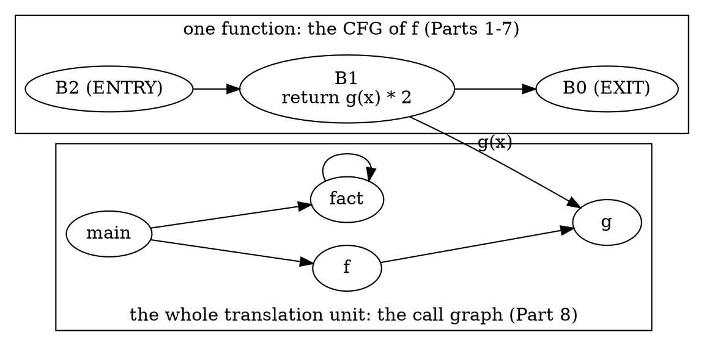

The last row of the table is the theme of the whole part. A CFG tells you everything that can happen in one function. A call graph tells you what the AST *says* about calls between functions, and it says nothing about a call through a function pointer, a block variable, `delete`, an implicit destructor, or the dynamic target of a virtual call. Every analysis you build on it (reachability, recursion, summaries) inherits those holes, so the sections run in this order: read the graph (8.1 to 8.3), traverse it (8.4, 8.5), compute on it (8.6), join it with the CFG (8.7), repair its holes (8.8) and merge several of them (8.9).

| Tool (this part) | Section | Does |
|------------------|---------|------|
| `p08_nodes` | 8.1 to 8.3 | the nodes and edges of a `CallGraph`: library dump, call sites, node kinds, USRs, name lookup, DOT and JSON export |
| `p08_walk` | 8.4, 8.5 | traversals through `GraphTraits`: post-order, reverse post-order, SCCs, reachability, dead functions, callers-of |
| `p08_summary` | 8.6 | bottom-up summaries over the SCCs (`sink`, `depth`) with a traced fixed point |
| `p08_sites` | 8.7 | the call sites in a function's CFG joined with the graph (`AnyCall`), and an interprocedural walk |
| `p08_resolve` | 8.8 | extra edges for function-pointer and virtual calls: `--fnptr`, `--devirt`, `--cha` |
| `p08_xtu` | 8.9 | merge the call graphs of several files by USR |
| `p08_check` | 8.9 | a cross-TU recursion and `[[noreturn]]`-sink checker on the merged graph |

The sample files, one per topic (every function is small and named for what it demonstrates):

| File | Used in | Holds |
|------|---------|-------|
| `manifests/p08_basic.cpp` | 8.1, 8.2 | `main`, `f`, `g`, a self-recursive `fact`, a dead `unused`: six lines of dump |
| `manifests/p08_include.cpp` | 8.2, 8.3 | templates, implicit members, `new`/`delete`, default arguments, lambdas, a block, a function pointer: every inclusion rule |
| `manifests/p08_objc.m` | 8.3 | Objective-C messages and blocks |
| `manifests/p08_recursion.cpp` | 8.4, 8.8 | self, mutual, three-way and overlapping recursion, and recursion hidden behind a pointer or a virtual call |
| `manifests/p08_reach.cpp` | 8.4, 8.5 | dead functions, `static` versus external linkage, an address-taken callback, a leaf with several callers |
| `manifests/p08_sink.cpp` | 8.6 | a `[[noreturn]]` sink, always/may/none callers, cycles that meet the sink, a deep chain |
| `manifests/p08_sites.cpp` | 8.7 | one `main` with every kind of call site |
| `manifests/p08_virtual.cpp`, `manifests/p08_fnptr.cpp` | 8.8 | a class hierarchy and a set of address-taken functions |
| `manifests/p08_xtu.h`, `p08_xtu_a.cpp`, `p08_xtu_b.cpp` | 8.9 | two translation units with a cross-file cycle and a sink |

The seven tools share one output grammar, so you learn it once:

- **One record per line**, fields separated by single spaces; a name is quoted only when it contains a space (`"operator new"`).
- `<root>` is left out of every list and edge set unless you pass `--with-root`; an empty list prints `-`.
- Names are qualified (`Holder::Holder`); a template instantiation gets its arguments (`twice<int>`); a lambda's call operator and a block carry the line they are on (`two_lambdas()::(lambda@L59)::operator()`, `<block@L70>`). Section 8.2 explains why.
- Lists are sorted by name, never by pointer, so every output is the same on every run. `--sort=source` and `--sort=rpo` change that.
- `--emit=dot` and `--emit=json` export the same graph in the lab's diagram vocabulary (Section 8.2).
- Only the functions defined in the main file and the nodes they call are listed; `--all-files` lists the functions defined in headers too. Compiler flags go after `--` (`-- -std=c++17 -fblocks`).

---

## Section 8.1 — What a call graph is: `debug.DumpCallGraph`, the dump order and `< root >`

### Why

Part 1.6 ran `debug.DumpCallGraph` and moved on. The dump is the shortest way to see a `CallGraph`, and it holds three things worth reading properly before you build anything on the graph: one entry per call *site*, a `< root >` node that is not what the header says it is, and an order that is neither source order nor alphabetical.

### What to Do

**Sample file:** `manifests/p08_basic.cpp` — `main` calls `f` and `fact`, `f` calls `g`, `fact` calls itself, and `unused` is called by nobody.

```cpp
int g(int x) { return x + 1; }
int f(int x) { return g(x) * 2; }
int fact(int n) { return n <= 1 ? 1 : n * fact(n - 1); }
int unused(int x) { return x; }
int main() { return f(1) + fact(3); }
```

Build the tools of this part once (the sections below use all seven; `scripts/build.sh` with no argument builds them with everything else):

```bash
scripts/build.sh p08_nodes p08_walk p08_summary p08_sites p08_resolve p08_xtu p08_check
```

```bash
scripts/build.sh --list | grep '^p08_'
```

```text expected
p08_check
p08_nodes
p08_resolve
p08_sites
p08_summary
p08_walk
p08_xtu
```

The Static Analyzer prints the graph with `debug.DumpCallGraph`:

```bash
CHECKER=debug.DumpCallGraph scripts/dumpcfg.sh manifests/p08_basic.cpp
```

```text expected
 --- Call graph Dump ---
  Function: < root > calls: g f fact unused main
  Function: main calls: f fact
  Function: unused calls:
  Function: fact calls: fact
  Function: f calls: g
  Function: g calls:
```

This is **not** a CFG dump: there are no blocks and nothing is ordered by execution. Each line is one node, `Function: <caller> calls: <callees>`, and it means *may call*:

- A node is a function, one per declaration chain. `unused calls:` is a node with no callees (a leaf); `fact calls: fact` is a **self edge**, the call graph's picture of recursion.
- An edge is a call *site*, not a pair of functions. The graph keeps one `CallRecord` per call expression, so `main` with two calls to `f` prints `main calls: f f fact` (Exercise 1).
- Nothing says *where* in `f` the call to `g` happens, or under which condition. That is what the CFG is for (Section 8.7).

**`< root >` has an edge to every function.** The first line lists `g f fact unused main`: all five, including `g`, which `f` calls. Part 1.6 described the root as "calling every function that nobody else calls"; that is not what the code does. This is `CallGraph::getOrInsertNode` in LLVM 22.1.8 (`clang/lib/Analysis/CallGraph.cpp`):

```cpp
  Node = std::make_unique<CallGraphNode>(F);
  // Make Root node a parent of all functions to make sure all are reachable.
  if (F)
    Root->addCallee({Node.get(), /*Call=*/nullptr});
  return Node.get();
```

Every *new* node is appended to the root's callees, with a null call expression. The root exists so that a traversal starting there (`GraphTraits<CallGraph*>::getEntryNode` returns it) reaches every node, including the ones nobody calls. It is **not** a marker for "externally visible" or "has no caller", whatever the comment on `getRoot()` in `CallGraph.h` suggests. The order of its callees (`g f fact unused main`) is simply the order in which the nodes were created, which here is definition order.

**The dump order.** `CallGraph::print` does not iterate the graph: `begin()` and `end()` walk a `DenseMap` keyed by pointers, and the header warns that the order is non-deterministic. Instead it walks a reverse post-order from the root:

```cpp
  // We are going to print the graph in reverse post order, partially, to make
  // sure the output is deterministic.
  llvm::ReversePostOrderTraversal<const CallGraph *> RPOT(this);
```

In a reverse post-order a function appears before the functions it calls (cycles aside): `main`, then `f`, then `g`. Functions that do not depend on each other come out in reverse definition order, which is why `unused` and `fact` precede `f`. Section 8.5 returns to this order, because the Static Analyzer uses the same traversal to decide which function to analyse first.

**Where the dump comes from.** The checker behind `debug.DumpCallGraph` is three lines (`clang/lib/StaticAnalyzer/Checkers/DebugCheckers.cpp`):

```cpp
    CallGraph CG;
    CG.addToCallGraph(const_cast<TranslationUnitDecl*>(TU));
    CG.dump();
```

`dump()` writes to **stderr**, like `CFG::dump()` (Part 2). The lab's `p08_nodes --dump` calls `CallGraph::print()` on stdout, and the text is byte for byte the same:

```bash
diff <(CHECKER=debug.DumpCallGraph scripts/dumpcfg.sh manifests/p08_basic.cpp) <(build/bin/p08_nodes manifests/p08_basic.cpp --dump) && echo identical
```

```text expected
identical
```

`--dump --no-root` drops the `< root >` line. The other output modes of `p08_nodes` print the graph in the grammar every tool of this part shares: a `node` line per function and an `edge` line per call. By default the root is left out, because its edges carry no information:

```bash
build/bin/p08_nodes manifests/p08_basic.cpp --edges
```

```text expected
== p08_basic.cpp: 5 nodes, 4 edges
node f
node fact
node g
node main
node unused
edge f -> g
edge fact -> fact
edge main -> f
edge main -> fact
```

Four edges: `f -> g`, `fact -> fact`, `main -> f`, `main -> fact`. With `--with-root` the root and its five edges appear as well:

```bash
build/bin/p08_nodes manifests/p08_basic.cpp --edges --with-root
```

```text expected
== p08_basic.cpp: 6 nodes, 9 edges
node <root>
node f
node fact
node g
node main
node unused
edge <root> -> f
edge <root> -> fact
edge <root> -> g
edge <root> -> main
edge <root> -> unused
edge f -> g
edge fact -> fact
edge main -> f
edge main -> fact
```

Nine edges, six nodes: the root adds exactly one edge per function, and the header counts it as a node (`CallGraph::size()` counts it too, so a TU of five functions has `size() == 6`). Here is the same graph as a picture, with the root's fan-out drawn as the dashed `weak` edges it deserves:

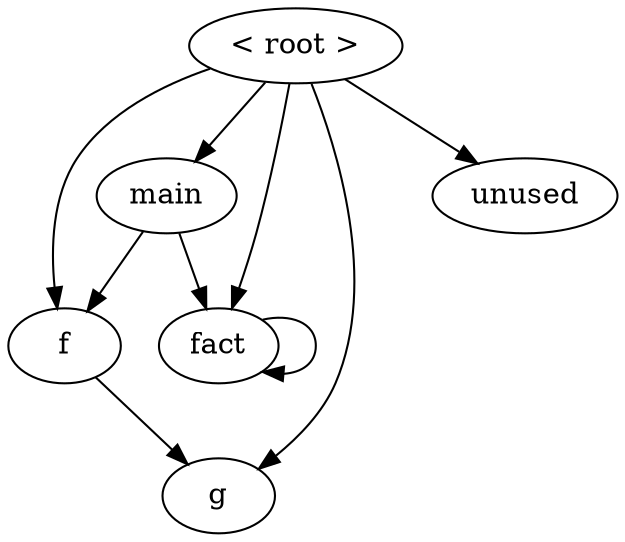

> [!note] `debug.ViewCallGraph`
> Part 1.6 showed how to capture the DOT file of `debug.ViewCallGraph` without opening a viewer. Its labels come from the same `DOTGraphTraits` that Section 8.2 warns about.

### Verify

The root has one edge per function, whatever the shape of the graph. Count them in the recursion sample (`p08_recursion.cpp`, 14 functions):

```bash
build/bin/p08_nodes manifests/p08_recursion.cpp --with-root --edges | awk '/^node /{n++} /^edge <root> /{r++} END {print r " edges from <root>, " n-1 " functions"}'
```

### Expected

```text expected
14 edges from <root>, 14 functions
```

Both numbers agree (`n-1` because the `node <root>` line is not a function): the root reaches every node, whether or not another function calls it.

> [!hint]- Quiz: `g` is called by `f`, so why is it also listed under `< root >`?
> Read `getOrInsertNode`: when does a node get an edge from the root?

> [!success]- Answer
> Because the root gets an edge to *every* node the moment the node is created, with a null call expression. The root is an entry node for whole-graph traversals, not a "nobody calls this" marker. A function whose *only* caller is `< root >` is one that nobody in this translation unit calls, and the way to find those is to ignore the root's edges (Section 8.4 does).

### Common mistakes

| Mistake | Symptom |
|---------|---------|
| Treating the root's callees as the program's entry points or its externally visible functions | every function is "an entry point"; dead-code answers are empty |
| Iterating `for (auto &KV : CG)` and printing in that order | output changes from run to run (a `DenseMap` keyed by pointer); sort, or traverse from the root |
| Calling `CG.dump()` in a tool and piping stdout | nothing arrives: `dump()` writes to stderr; call `print(llvm::outs())` |
| Counting `CG.size()` as the number of functions | one too many: the root is a node |

### Exercises

1. Copy `manifests/p08_basic.cpp` to `out/ex_twice.cpp`, change `main` to `return f(1) + f(2) + fact(3);`, and run `build/bin/p08_nodes out/ex_twice.cpp --dump`. Which line changes, and what does it tell you about edges versus pairs of functions? (`p08_nodes out/ex_twice.cpp --edges --sites` shows the two call sites.)
2. Run `build/bin/p08_nodes manifests/p08_basic.cpp --dump --no-root` and decide which function is "dead" from the output alone. Is the answer the same as for `< root >`'s callee list?

---

## Section 8.2 — Building a `CallGraph` in C++: nodes, `CallRecord`, names and DOT/JSON export

### Why

A dump is for reading; a tool needs the graph as data. Building one takes four lines, but the container has three details that decide whether your tool is correct (nodes are keyed by *canonical* declarations), reproducible (iteration order is a `DenseMap`'s) and readable (the library's own names collide). This section is the API tour, and ends with the exports the rest of the part uses.

### What to Do

**Sample files:** `manifests/p08_basic.cpp` for the API, `manifests/p08_recursion.cpp` for declarations and definitions that differ, `manifests/p08_include.cpp` for the names.

**Building the graph.** The graph is a visitor you *run* and a map you *query*. `CallGraph` derives from `DynamicRecursiveASTVisitor`, and `addToCallGraph(Decl*)` is just `TraverseDecl`, so you hand it the translation unit. The lab's helper in `tools/common/cglab.h`:

```cpp
inline std::unique_ptr<CallGraph> buildCallGraph(ASTContext &Ctx) {
  auto CG = std::make_unique<CallGraph>();
  CG->addToCallGraph(Ctx.getTranslationUnitDecl());
  return CG;
}
```

Where Part 2's tools used `runPerFunction`, every tool of this part uses `cglab::runPerTU(argc, argv, Cat, report)`: the graph belongs to the translation unit, so `report(ASTContext &, CallGraph &)` runs once per file, after the AST is complete (in `HandleTranslationUnit`). `CG.addToCallGraph(FD)` on a single function also works, and extends an existing graph.

**The container.** Five types, one ownership chain:

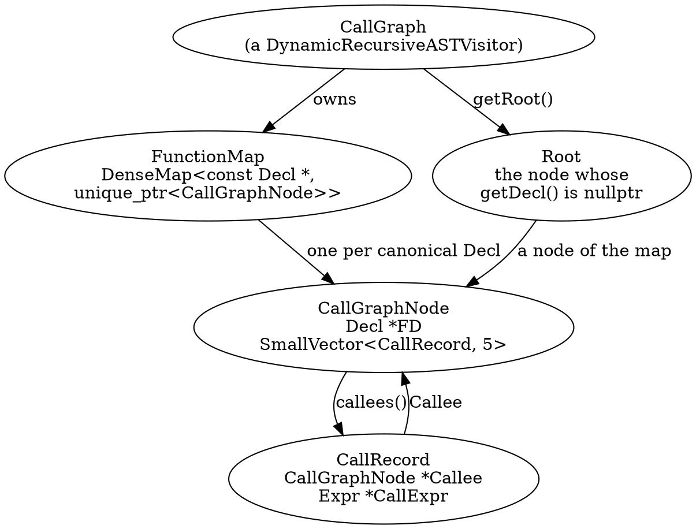

| API | What it gives you | Gotcha |
|-----|-------------------|--------|
| `CG.size()` | the number of nodes | includes the root: five functions give `size() == 6` |
| `CG.getRoot()` | the root node (`getDecl() == nullptr`) | has an edge to every node (Section 8.1) |
| `CG.getNode(D)` | the node of `D`, or null | looks `D` up **as given**: only the canonical declaration is a key |
| `CG.getOrInsertNode(D)` | the node, inserted if missing | canonicalises first; this is what the builder calls |
| `for (auto &KV : CG)` | `pair<const Decl *, unique_ptr<CallGraphNode>>` | `DenseMap` order: different on every run. Sort before printing. The root's key is `nullptr` |
| `CGN->getDecl()` | the declaration the node is keyed by | the canonical declaration, usually the bodiless first one |
| `CGN->getDefinition()` | the declaration with the body | |
| `CGN->callees()`, `size()`, `empty()` | the `CallRecord`s, in call-site (AST) order | one record per call *expression* |
| `CallRecord::Callee` | the callee's node | `CallRecord` converts implicitly to `CallGraphNode *`, which is what lets `GraphTraits` treat records as children |
| `CallRecord::CallExpr` | the call **site**: a `CallExpr`, `CXXMemberCallExpr`, `CXXOperatorCallExpr`, `CXXConstructExpr`, `CXXNewExpr` or `ObjCMessageExpr` | null on the root's edges |
| `operator==` on `CallRecord` | compares the **callee only** | two sites calling the same function compare equal |
| `print(os)`, `dump()`, `viewGraph()` | text to a stream, text to stderr, a GraphViz window | Section 8.1 |

`p08_nodes --edges --sites --kinds` prints exactly these fields: the node kind, and for every edge the call site's line, the class of the call expression and the edge kind:

```bash
build/bin/p08_nodes manifests/p08_basic.cpp --edges --sites --kinds
```

```text expected
== p08_basic.cpp: 5 nodes, 4 edges
node f kind=def
node fact kind=def
node g kind=def
node main kind=def
node unused kind=def
edge f -> g @L3 CallExpr kind=call
edge fact -> fact @L6 CallExpr kind=call
edge main -> f @L11 CallExpr kind=call
edge main -> fact @L11 CallExpr kind=call
```

`@L3 CallExpr` is the `CallRecord::CallExpr` of the edge `f -> g`: line 3 of the file, and a plain `CallExpr`. On a node, `kind=` is the lab's classification (`def`, `decl`, `implicit`, `tpl`, `lambda`, `block`, `objc`; Section 8.3 shows them all); on an edge it is the kind of call (`call`, `ctor`, `new`, `objc`, `block`, `op`).

**Names.** `CallGraphNode::print` uses `NamedDecl::printQualifiedName`, which is fine for `Holder::Holder` and wrong for three kinds of node. In the library's own dump, from the sample whose whole point is to contain them:

```bash
build/bin/p08_nodes manifests/p08_include.cpp --dump -- -std=c++17 -fblocks | grep -E 'Function: (use_tpl|twice|two_lambdas|blk_now) calls'
```

```text expected
  Function: blk_now calls: < >
  Function: two_lambdas calls: two_lambdas()::(lambda)::operator() two_lambdas()::(lambda)::operator()
  Function: use_tpl calls: twice twice
  Function: twice calls: helper helper
  Function: twice calls: helper helper
```

- Both instantiations of `template <typename T> T twice(T)` print as `twice`: `printQualifiedName` drops the template arguments, so `use_tpl calls: twice twice` and there are two `Function: twice` lines.
- Both lambdas in `two_lambdas` print as `two_lambdas()::(lambda)::operator()`.
- A block has no name at all: `< >`.

The tools' naming rule, in `cglab::nodeName`, makes the printed name identify the node: template arguments are appended (`twice<int>`), a lambda's closure type gets the line it is written on (`(lambda@L59)`), a block is `<block@L70>`, an Objective-C method keeps its selector (`Counter::bump:`). If two names still collide the rule adds the parameter types, then `@L<line>`, then `#k`.

```bash
build/bin/p08_nodes manifests/p08_include.cpp --kinds -- -std=c++17 -fblocks | grep -E 'twice|lambda|block'
```

```text expected
node <block@L66> kind=block
node <block@L70> kind=block
node twice<double> kind=tpl
node twice<int> kind=tpl
node two_lambdas kind=def
node two_lambdas()::(lambda@L59)::operator() kind=lambda
node two_lambdas()::(lambda@L60)::operator() kind=lambda
```

**Stable identity: the USR.** Names are only unique inside one translation unit. For a key that survives across files (Section 8.9) the tools use the **USR**, `clang::index::generateUSRForDecl`, which `--usr` prints:

```bash
build/bin/p08_nodes manifests/p08_include.cpp --usr -- -std=c++17 -fblocks | grep -E 'twice|file_local|block'
```

```text expected
node <block@L66> usr=-
node <block@L70> usr=-
node file_local usr=c:p08_include.cpp@F@file_local#
node twice<double> usr=c:@F@twice<#d>#d#
node twice<int> usr=c:@F@twice<#I>#I#
```

A USR encodes name, scope and signature (`twice<#I>#I#` is `twice<int>(int)`). A `static` function is prefixed with its file (`c:p08_include.cpp@F@file_local#`), so two `static void local()` in different files get different USRs. A block has **no USR** (`usr=-`): it must be keyed by its position.

**Looking a node up.** `getNode` does not canonicalise, which only matters when a function is declared before it is defined. `is_odd` in `p08_recursion.cpp` is: line 7 declares it, line 9 defines it. `--lookup` asks `getNode` about every declaration in the redeclaration chain, with and without canonicalising first (`cglab::lookupNode`):

```bash
build/bin/p08_nodes manifests/p08_recursion.cpp --lookup=is_odd
```

```text expected
lookup is_odd @L7 decl canonical getNode=found canonicalised=found
lookup is_odd @L9 def redecl getNode=null canonicalised=found
```

The call `is_odd(3)` in `main` comes after the definition, so the `FunctionDecl` the call expression refers to is the line-9 redeclaration: `getNode` returns null for it, although the node exists. `getCanonicalDecl()` first, or `lookupNode`, always works.

> [!warning] `getNode` is the one lookup that does not canonicalise
> `CallGraph::getOrInsertNode(D)` replaces `D` by `D->getCanonicalDecl()` (except for Objective-C methods) before it touches the map, so the *builder* is always consistent. `getNode(D) const` is a plain `FunctionMap.find(D)`. A tool that takes a `FunctionDecl` from a call expression or from `FD->getDefinition()` and calls `getNode` on it gets null whenever that declaration is not the first one. For an Objective-C method the key is the method in the `@implementation`, whose canonical declaration is the `@interface` one, so `lookupNode` tries the implementation too.

**Exports.** Every tool takes `--emit=text|dot|json`. The DOT output follows the lab's diagram contract ("Diagrams" in `docs/AUTHORING.md`: `class=` and nothing else), so a tool's own DOT can be pasted into a document as is:

```bash
build/bin/p08_nodes manifests/p08_basic.cpp --emit=dot
```

```text expected
digraph p08_basic {
  f;
  fact [class="recursive"];
  g;
  main [class="entry"];
  unused;
  f -> g;
  fact -> fact [class="back"];
  main -> f;
  main -> fact;
}
```

`main` is `entry`, `fact` is `recursive` and its self edge is `back`; with `--sites` each edge gets an `@L<line>` label, with `--with-root` the root and its `weak` edges appear. The JSON export (`llvm::json`, keys in alphabetical order, as in Part 2.8) carries what the text output has and more: every node has its `scc`, `po`, `rpo` numbers (Sections 8.4 and 8.5) and `recursive`; every edge its `line`, `col` and `back`. The column is how you tell two calls on one line apart, which the text output cannot do:

```bash
build/bin/p08_nodes manifests/p08_include.cpp --emit=json -- -std=c++17 -fblocks | python3 -c 'import json,sys; [print(e["from"], "->", e["to"], "line", e["line"], "col", e["col"]) for e in json.load(sys.stdin)["edges"] if e["from"] == "twice<int>"]'
```

```text expected
twice<int> -> helper line 20 col 45
twice<int> -> helper line 20 col 57
```

Two `CallRecord`s, one callee: they compare equal as records (`operator==` looks at the callee only), and the graph keeps both.

The third export is the library's own: `llvm::WriteGraph` over the call graph, which `--library-dot` prints with the `Node0x…` pointer ids replaced by `N<id>` (in name order, the root is `N0`) and the node blocks sorted, so the text is stable (the same normalisation as Part 1.5):

```bash
build/bin/p08_nodes manifests/p08_basic.cpp --library-dot | head -9
```

```text expected
digraph "CallGraph" {
	label="CallGraph";

	N0 [shape=record,label="{\< root \>}"];
	N0 -> N3;
	N0 -> N1;
	N0 -> N2;
	N0 -> N5;
	N0 -> N4;
```

> [!warning] `WriteGraph` on `const CallGraph*` prints empty labels
> The `DOTGraphTraits<const CallGraph *>` that labels nodes (`< root >`, or the unqualified name) is defined inside `CallGraph.cpp`, not in the header. A tool that calls `llvm::WriteGraph(OS, static_cast<const CallGraph *>(&CG))` instantiates the *default* traits and gets `label="{}"` on every node, with `Node0x…` ids. `--library-dot` works around it with a thin wrapper type, `cglab::LibGraph`, that carries a copy of CallGraph.cpp's labelling rule. Even then the labels are unqualified names (`run`, not `Base::run`), so two methods with the same name look alike; prefer the tools' own `--emit=dot`.

### Verify

The text output, the JSON and the DOT output describe one graph. Compare the three counts for `p08_basic.cpp`:

```bash
build/bin/p08_nodes manifests/p08_basic.cpp | head -1
build/bin/p08_nodes manifests/p08_basic.cpp --emit=json | python3 -c 'import json,sys; d=json.load(sys.stdin); print(len(d["nodes"]), "nodes,", len(d["edges"]), "edges in the JSON")'
mkdir -p out && build/bin/p08_nodes manifests/p08_basic.cpp --emit=dot | dot -Tsvg -o out/p08_basic.svg && grep -c 'class="node' out/p08_basic.svg
```

### Expected

```text expected
== p08_basic.cpp: 5 nodes, 4 edges
5 nodes, 4 edges in the JSON
5
```

Five nodes four edges in the text header and the JSON, and five node elements in the SVG that `dot` drew from the DOT export. Open `out/p08_basic.svg` to look at it.

> [!hint]- Quiz: why does `CG.getNode(FD)` return null for the definition of `is_odd`, although `is_odd` is a node?
> Which declaration is the key of the map, and which one did you pass?

> [!success]- Answer
> Nodes are keyed by the *canonical* declaration, the first one in the redeclaration chain (`int is_odd(int);` on line 7). The definition on line 9 is a later redeclaration, and `getNode` looks up the pointer it is given. Call `FD->getCanonicalDecl()` first (or `cglab::lookupNode`), as `getOrInsertNode` does internally.

### Common mistakes

| Mistake | Symptom |
|---------|---------|
| `CG.getNode(FD)` with the declaration from a call expression or from `getDefinition()` | null for any function declared before it is defined |
| Using `printQualifiedName` as an identity | two template instantiations or two lambdas merge into one "node" in your own map |
| Treating `CallRecord::CallExpr` as always non-null | crash on the root's edges (their expression is null) |
| Using the `==` of `CallRecord` to deduplicate call sites | two sites to the same callee collapse into one |
| Printing a `Decl *` or `CallGraphNode *` anywhere | output differs on every run and cannot be checked by `doccheck.py` |

### Exercises

1. Predict, then run, `build/bin/p08_nodes manifests/p08_recursion.cpp --lookup=pong` and `--lookup=ping`. Which of the two prints a `getNode=null` line, and why?
2. `--sort=name` is the default. Compare `--sort=source` and `--sort=rpo` on `p08_basic.cpp`: which of them gives the order of the dump from Section 8.1 (without the root)?

---

## Section 8.3 — What gets in and what stays out: `includeInGraph`, templates, implicit code, lambdas, blocks, Objective-C

### Why

The call graph is **unsound by design**: it records what the AST states syntactically with a direct callee, and everything else is missing. Reachability, recursion detection and summaries are all computed on it, so before using it you need the list of what it leaves out, and the list of what it puts in that you might not expect (nodes for functions with no body, a node per template instantiation, nodes for implicit members).

### What to Do

**Sample files:** `manifests/p08_include.cpp` — one function per rule, with a comment above each; `manifests/p08_objc.m` for Objective-C. The first needs `-- -std=c++17 -fblocks` (blocks are off in C++ by default), the second `-- -x objective-c -fblocks -w`.

**Two doors into the graph.** A function becomes a node in one of two ways, and each has its own rule (`clang/lib/Analysis/CallGraph.cpp`, comments dropped):

```cpp
bool CallGraph::includeInGraph(const Decl *D) {
  if (!D->hasBody())
    return false;
  return includeCalleeInGraph(D);
}

bool CallGraph::includeCalleeInGraph(const Decl *D) {
  if (const FunctionDecl *FD = dyn_cast<FunctionDecl>(D)) {
    if (FD->isDependentContext())
      return false;
    IdentifierInfo *II = FD->getIdentifier();
    if (II && II->getName().starts_with("__inline"))
      return false;
  }
  return true;
}
```

The visitor's `VisitFunctionDecl` is the first door: a declaration that `includeInGraph` accepts *and* that is a definition gets a node, and its body is walked for calls. The second door is `CGBuilder::addCalledDecl`: every callee the builder finds is checked with `includeCalleeInGraph` only, so a function **without a body** becomes a node too, as a callee, with no callees of its own. Template patterns (`isDependentContext()`) and identifiers that start with `__inline` are refused by both doors.

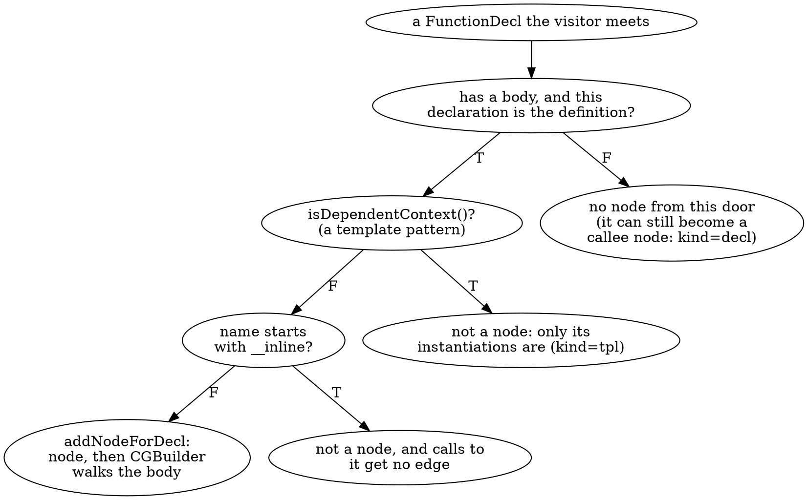

**Node kinds.** `p08_nodes --kinds` adds the kind of each node. Everything that is not a plain definition (`def`) is where the surprises are:

```bash
build/bin/p08_nodes manifests/p08_include.cpp --kinds -- -std=c++17 -fblocks | grep -v 'kind=def'
```

```text expected
== p08_include.cpp: 37 nodes, 33 edges
node <block@L66> kind=block
node <block@L70> kind=block
node Base::Base kind=implicit
node Derived::Derived kind=implicit
node Derived::~Derived kind=implicit
node Member::Member kind=implicit
node declared_only kind=decl
node fail kind=decl noreturn
node "operator new" kind=decl
node twice<double> kind=tpl
node twice<int> kind=tpl
node two_lambdas()::(lambda@L59)::operator() kind=lambda
node two_lambdas()::(lambda@L60)::operator() kind=lambda
```

- `decl`: callee-only nodes. `declared_only` and `fail` are declared, never defined; `fail` is `[[noreturn]]`, the sink of Section 8.6. `"operator new"` is the implicit global allocation function that a `new` expression calls: nobody wrote it, and it has no body.
- `tpl`: `twice<int>` and `twice<double>`. The template *pattern* `twice` is not a node (it is a dependent context); each instantiation is one, and `use_tpl` has an edge to each.
- `implicit`: members the compiler wrote: `Base::Base`, `Derived::Derived`, `Derived::~Derived`, `Member::Member`. They are nodes because the visitor flags below include implicit code.
- `lambda`: the closure's `operator()` is a node. Both lambdas of `two_lambdas` have one, told apart by the line.
- `block`: each block literal is a node (`<block@L66>`, `<block@L70>`), added by `addNodesForBlocks`.

The `__inline` rule is the one that is easiest to miss. `uses_inline_helper` calls `__inline_helper`, and the graph has neither the node nor the edge:

```bash
build/bin/p08_nodes manifests/p08_include.cpp --edges --func=uses_inline_helper -- -std=c++17 -fblocks
build/bin/p08_nodes manifests/p08_include.cpp -- -std=c++17 -fblocks | grep -c '__inline'
```

```text expected
== p08_include.cpp: 37 nodes, 33 edges
node uses_inline_helper
0
```

**Why instantiations and implicit members are in at all.** `CallGraph` is a `DynamicRecursiveASTVisitor`. Its behaviour flags are *data members* there, and the `CallGraph` constructor sets three of them:

| Data member | Default in the visitor | Set by `CallGraph()` | What it buys |
|-------------|------------------------|----------------------|--------------|
| `ShouldVisitTemplateInstantiations` | `false` | `true` | the visitor enters instantiations, so `twice<int>` and `twice<double>` are nodes |
| `ShouldVisitImplicitCode` | `false` | `true` | implicit constructors, destructors and so on are visited, so `Derived::Derived` is a node |
| `ShouldWalkTypesOfTypeLocs` | `true` | `false` | the visitor does not walk into types: there are no calls there, and it is cheaper |

> [!warning] The visitor flags are variables, not `shouldVisit...()` overrides
> Older tutorials (and the CRTP `RecursiveASTVisitor`) control the traversal by overriding `shouldVisitTemplateInstantiations()` and friends. In Clang 22, `DynamicRecursiveASTVisitor.h` says it plainly: "Instead of functions (e.g. `shouldVisitImplicitCode()`), this class uses member variables (e.g. `ShouldVisitImplicitCode`) to control visitation behaviour." You assign them in your constructor, exactly as `CallGraph::CallGraph()` does; code written for the old API either fails to compile (an `override` of a function that no longer exists) or silently does nothing (a plain method that nobody calls).

**What `CGBuilder` records.** Nodes are half the graph. The edges come from `CGBuilder`, a `StmtVisitor` that walks each body, and it is narrower than "every call":

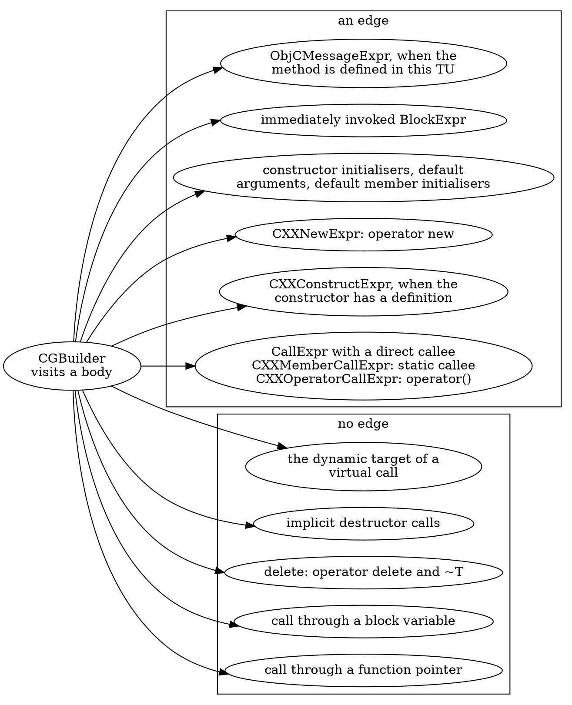

Each rule has a function in the sample. **Constructors, `new` and `delete`**: `with_obj` constructs a `Holder` (an edge to `Holder::Holder`) and destroys it at the closing brace (no edge to `Holder::~Holder`); `with_new` has an edge to `operator new` and to the constructor, and its `delete p` adds nothing at all; `use_derived` calls the implicit constructor and a method:

```bash
for f in with_obj with_new use_derived; do
  build/bin/p08_nodes manifests/p08_include.cpp --edges --sites --func=$f -- -std=c++17 -fblocks | sed 1d
done
```

```text expected
node with_obj
edge with_obj -> Holder::Holder @L47 CXXConstructExpr
node with_new
edge with_new -> Holder::Holder @L49 CXXConstructExpr
edge with_new -> "operator new" @L49 CXXNewExpr
node use_derived
edge use_derived -> Derived::Derived @L35 CXXConstructExpr
edge use_derived -> Derived::run @L35 CXXMemberCallExpr
```

**Defaults are charged to the user.** The body of a default argument or of a default member initialiser is not evaluated at its declaration but at every place that uses the default, so the edge starts there: `use_default` calls `leaf` on line 52 (where `dflt`'s default argument is written) although the call `dflt()` is on line 53. `Member::Member`, the implicit constructor, owns the call in `int m = helper(3);`. And the **constructor initialisers** `Holder() : v(leaf(1))` are visited by `addNodeForDecl` (`constructor->inits()`), so `Holder::Holder` has an edge to `leaf`. The graph is more complete here than the CFG is by default (Section 8.7):

```bash
for f in use_default use_member Member::Member Holder::Holder; do
  build/bin/p08_nodes manifests/p08_include.cpp --edges --sites --func=$f -- -std=c++17 -fblocks | sed 1d
done
```

```text expected
node use_default
edge use_default -> dflt @L53 CallExpr
edge use_default -> leaf @L52 CallExpr
node use_member
edge use_member -> Member::Member @L55 CXXConstructExpr
node Member::Member
edge Member::Member -> helper @L54 CallExpr
node Holder::Holder
edge Holder::Holder -> leaf @L42 CallExpr
```

**Lambdas, blocks, pointers and virtual calls.** A lambda is called through `operator()`, so `two_lambdas` has an edge (`CXXOperatorCallExpr`) to each closure's node. A block literal that is called *immediately* is an edge to a block node (`blk_now`); a block stored in a variable and called later is not (`blk_var`: the callee is the variable). A function pointer has no callee the AST can name (`indirect`). A virtual call has one: the method that name lookup finds in the object's static type (`dispatch` calls `Base::run`, never `Derived::run`):

```bash
for f in two_lambdas blk_now blk_var indirect dispatch; do
  build/bin/p08_nodes manifests/p08_include.cpp --edges --sites --func=$f -- -std=c++17 -fblocks | sed 1d
done
```

```text expected
node two_lambdas
edge two_lambdas -> two_lambdas()::(lambda@L59)::operator() @L61 CXXOperatorCallExpr
edge two_lambdas -> two_lambdas()::(lambda@L60)::operator() @L61 CXXOperatorCallExpr
node blk_now
edge blk_now -> <block@L70> @L70 CallExpr
node blk_var
node indirect
node dispatch
edge dispatch -> Base::run @L38 CXXMemberCallExpr
```

**Objective-C.** A message send is an edge only when the receiver's interface has the method *defined* in this translation unit (`lookupPrivateMethod`); a block literal is a block node as in C++:

```bash
build/bin/p08_nodes manifests/p08_objc.m --edges --kinds -- -x objective-c -fblocks -w
```

```text expected
== p08_objc.m: 7 nodes, 5 edges
node <block@L18> kind=block
node <block@L22> kind=block
node Counter::bump: kind=objc
node immediate kind=def
node leaf kind=def
node send kind=def
node via_var kind=def
edge <block@L18> -> leaf kind=call
edge <block@L22> -> leaf kind=call
edge Counter::bump: -> leaf kind=call
edge immediate -> <block@L18> kind=block
edge send -> Counter::bump: kind=objc
```

`send -> Counter::bump:` is there; `[c external:2]` is not, because `external:` is only declared. `immediate` calls its block (`<block@L18>`), `via_var` does not.

### Verify

Which functions have no outgoing edge although their body contains a call? Predict first. The command prints every plain definition (`kind=def`) that has no callee:

```bash
build/bin/p08_nodes manifests/p08_include.cpp --kinds --edges -- -std=c++17 -fblocks \
  | awk '/^node /{ if ($3 == "kind=def") d[$2] = 1 } /^edge /{ delete d[$2] } END { for (n in d) print n }' | LC_ALL=C sort
```

### Expected

```text expected
Base::~Base
blk_var
dflt
indirect
leaf
uses_inline_helper
```

Six functions without callees. Three are genuine leaves: `leaf` and `Base::~Base` have no calls in their bodies, and neither has `dflt`: the call in its default argument is charged to its users, as above. Three are **holes**: `blk_var` (a call through a block variable), `indirect` (a call through a function pointer) and `uses_inline_helper` (the callee is excluded by name). The graph cannot tell the two groups apart; only the CFG (Section 8.7) can.

> [!hint]- Quiz: `with_new` has edges to `operator new` and `Holder::Holder`. `delete p` adds no edge. Which two callees are missing, and where else could you see them?
> Part 3.1 listed an element of the CFG that stands for what `delete` destroys.

> [!success]- Answer
> `operator delete` and the destructor `Holder::~Holder`. The graph's `CGBuilder` has no `VisitCXXDeleteExpr`, and implicit destructor calls are not expressions at all. Both are visible in the CFG: the `CXXDeleteExpr` statement gives `AnyCall::Deallocator` for `operator delete`, and a `DeleteDtor` element, which appears even with default `BuildOptions`, names the destructor. Section 8.7 lists them as `missing:delete`.

### Common mistakes

| Mistake | Symptom |
|---------|---------|
| Assuming "no callees" means "calls nothing" | `indirect`, `blk_var` and any function that only uses pointers or blocks look like leaves |
| Looking for the template pattern in the graph | there is only `twice<int>` and `twice<double>`; the pattern is a dependent context |
| Counting on an edge to a destructor | scope exit, temporaries and `delete` call destructors, and none of them is an edge |
| Expecting `Derived::run` under `dispatch` | a virtual call has the static callee only (Section 8.8 adds the rest) |
| Compiling `p08_include.cpp` without `-fblocks` | the two blocks are a parse error, not nodes |

### Exercises

1. Add `int __inline_other(int x) { return leaf(x); }` and a caller to a copy of the sample in `out/`. Does `__inline_other` become a node? Does the edge from its caller appear? What happens to the call to `leaf` inside it?
2. Run `build/bin/p08_nodes manifests/p08_include.cpp --dump -- -std=c++17 -fblocks | grep -c 'Function: twice'`. Why does the library dump print two `Function: twice` lines?

---

## Section 8.4 — Traversals through `GraphTraits`: reachability, recursion and callers-of

### Why

Part 4.6 ran LLVM's generic graph algorithms on a CFG and fell into a trap: a null successor. The call graph plugs into the same library through `GraphTraits`, and this time every child is a real node. The questions you can now ask the whole translation unit are the useful ones: what can `main` reach, which functions are recursive, which are dead, and who calls this?

### What to Do

**Sample files:** `manifests/p08_recursion.cpp` (self, mutual, three-way and overlapping recursion, and two kinds of recursion the graph cannot see) and `manifests/p08_reach.cpp` (dead functions, linkage, an address-taken callback, a leaf with several callers).

`clang/Analysis/CallGraph.h` specialises `llvm::GraphTraits` for `CallGraphNode*`, `const CallGraphNode*`, `CallGraph*` and `const CallGraph*`. The children of a node are its `CallRecord`s, which convert implicitly to `CallGraphNode*`; the entry node of a whole `CallGraph*` is the root. So the algorithms of Part 4.6 work unchanged:

| Algorithm | Header | Call-graph call |
|-----------|--------|-----------------|
| depth first | `DepthFirstIterator.h` | `llvm::depth_first(CG.getNode(Canonical))` for one function, `llvm::depth_first(&CG)` from the root |
| post order | `PostOrderIterator.h` | `llvm::post_order(&CG)` |
| reverse post order | `PostOrderIterator.h` | `llvm::ReversePostOrderTraversal<CallGraph *> R(&CG)` |
| strongly connected components | `SCCIterator.h` | `for (auto I = llvm::scc_begin(&CG); !I.isAtEnd(); ++I)` and `I.hasCycle()` |
| callers of a function | none | there is no `Inverse<CallGraph *>`: build a reverse map once |

`p08_walk` runs them. All of its output uses the grammar from the Big Picture; `--edges` adds the call edges after the lists, so the site can draw the graph.

**Recursion is a strongly connected component.** `scc_iterator` yields the components **callees first**, exactly as in Part 4.6 (sinks first). `hasCycle()` is true for a component of two or more nodes, and for a single node with a self edge:

```bash
build/bin/p08_walk manifests/p08_recursion.cpp --sccs --edges
```

```text expected
scc 0 cyclic self: fact
scc 1 cyclic mutual: is_even is_odd
scc 2 cyclic mutual: pang ping pong
scc 3 cyclic mutual: a b c
scc 4: step
scc 5: Shape::area
scc 6: measure
scc 7: Grid::area
scc 8: main
edge Grid::area -> measure
edge a -> b
edge b -> a
edge b -> c
edge c -> b
edge fact -> fact
edge is_even -> is_odd
edge is_odd -> is_even
edge main -> a
edge main -> fact
edge main -> is_even
edge main -> is_odd
edge main -> ping
edge main -> step
edge measure -> Shape::area
edge pang -> ping
edge ping -> pong
edge pong -> pang
```

`<id>` is the position in `scc_iterator` order, trivial components included (`scc 4: step` has no `cyclic`). The cyclic ones:

- `scc 0 cyclic self: fact` is the self edge `fact -> fact`.
- `scc 1` is plain mutual recursion, `is_even <-> is_odd`; `scc 2` is the three-way cycle `ping -> pong -> pang -> ping`.
- `scc 3` has **three** members although it is "two cycles": `a <-> b` and `b <-> c` share `b`, and an SCC is maximal, so they merge. Section 4.6 made the same point about nested loops.

Two functions are *meant* to be recursive and are not in any cyclic component. `step` calls itself through the pointer `next_step`; `Grid::area` calls `measure`, which calls `s.area(n)` on a `Shape &`, which is `Grid::area` again at run time. The graph has no edge for the first and only the *static* callee `Shape::area` for the second (Section 8.3), so both look acyclic until Section 8.8 puts the edges back.

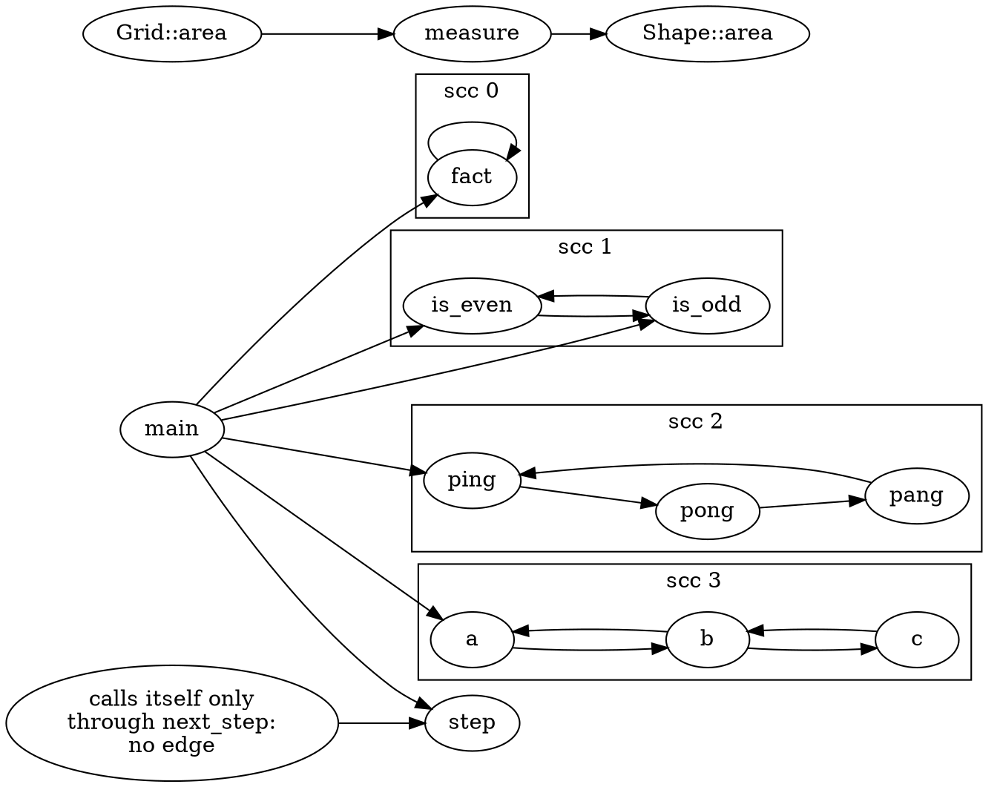

**Reachability.** `llvm::depth_first` from a node is "everything this function can reach through recorded edges". `--from=NAME` prints the reach set, and `--dead` adds the complement, the functions that are **not** reached:

```bash
build/bin/p08_walk manifests/p08_reach.cpp --from=main --dead --edges
```

```text expected
reach main: file_local helper leaf main
dead: Base::run callback_target helper_of_unused static_unused unused
edge Base::run -> leaf
edge callback_target -> helper
edge file_local -> leaf
edge helper -> leaf
edge helper_of_unused -> helper
edge main -> file_local
edge main -> helper
edge static_unused -> file_local
edge unused -> helper_of_unused
edge unused -> leaf
```

`main` reaches `helper`, `file_local` and, through them, `leaf`. The dead list is longer than "nobody calls it": `unused` and `helper_of_unused` are dead in the ordinary sense (the second only because the first is dead), and so is `static_unused`. But `callback_target` is dead too, although `main` takes its address and calls it through `cb(3)`, and so is `Base::run`, a virtual method that something may well call through a base pointer. "Dead" here means *not reachable through the recorded edges*, which is only as good as the graph (Section 8.3).

What counts as a root changes the answer. `--roots=` selects them: `main` (just `main`), `external` (every definition with external linkage, since another translation unit may call it) and `all` (every function that nobody else calls):

```bash
for r in main external all; do echo "--roots=$r"; build/bin/p08_walk manifests/p08_reach.cpp --dead --roots=$r; done
```

```text expected
--roots=main
dead: Base::run callback_target helper_of_unused static_unused unused
--roots=external
dead: static_unused
--roots=all
dead: -
```

With external linkage as the root set only `static_unused` is dead: it is the one function that nothing inside this file calls and nothing outside can. With `--roots=all` nothing is dead at all, because every function that nobody calls is a root by definition; that choice answers "what is reachable from somewhere", not "what is dead". Which roots to use is a decision about your program (an executable has `main`; a library has its exported functions), not something the graph knows. Note that `< root >` is *not* the answer: it reaches everything by construction (Section 8.1), which is why `--dead` ignores its edges.

**Callers of a function.** The graph stores callees only. The `Inverse<>` wrapper that gave Part 4.6 the predecessors of a block does not exist for the call graph:

```bash
grep -c Inverse /opt/homebrew/opt/llvm/include/clang/Analysis/CallGraph.h || true
```

```text expected
0
```

> [!warning] There is no `GraphTraits<Inverse<CallGraph*>>`
> `post_order(Inverse<CallGraph *>(&CG))` does not compile ("no type named `UnknownGraphTypeError` in `llvm::Inverse<clang::CallGraph *>`"): `CallGraph.h` specialises only the forward traits, and the grep above finds no `Inverse` in it at all. To ask "who calls `leaf`?", walk every node's `callees()` once and fill a `DenseMap<CallGraphNode *, SmallVector<CallGraphNode *>>`; `cglab::Graph::callers()` does that, and a depth-first search over the map gives the *transitive* callers.

```bash
build/bin/p08_walk manifests/p08_reach.cpp --callers=leaf --transitive --edges
```

```text expected
callers leaf: Base::run file_local helper unused
callers* leaf: Base::run callback_target file_local helper helper_of_unused main static_unused unused
edge Base::run -> leaf
edge callback_target -> helper
edge file_local -> leaf
edge helper -> leaf
edge helper_of_unused -> helper
edge main -> file_local
edge main -> helper
edge static_unused -> file_local
edge unused -> helper_of_unused
edge unused -> leaf
```

`callers` is the direct callers, `callers*` the transitive ones: everything that can end up in `leaf`, including `main` (through `helper` and `file_local`). The edges listed are the ones among `leaf` and those callers. This is how you answer "if I change `leaf`, what do I have to re-test?", and the answer shares the graph's holes: `callback_target` is listed because it calls `helper`, although nothing in the graph calls `callback_target`.

### Verify

Read `manifests/p08_sink.cpp` (Section 8.6 uses it) and write down which functions are recursive before you run anything. The cycles are the lines of the form "`f` calls `f`", or a loop through several functions:

```bash
build/bin/p08_walk manifests/p08_sink.cpp --sccs --cyclic --edges
```

### Expected

```text expected
scc 5 cyclic self: retry
scc 6 cyclic self: fact
scc 7 cyclic mutual: ping pong
scc 8 cyclic mutual: ring_a ring_b ring_c
edge always_dies -> die
edge always_dies -> fail
edge die -> fail
edge fact -> fact
edge guarded -> die
edge level1 -> level2
edge level2 -> level3
edge level3 -> level4
edge main -> fact
edge main -> guarded
edge main -> ping
edge main -> top
edge ping -> pong
edge pong -> die
edge pong -> ping
edge retry -> fail
edge retry -> retry
edge ring_a -> ring_b
edge ring_b -> ring_c
edge ring_c -> fail
edge ring_c -> ring_a
edge top -> level1
edge top -> safe
```

`retry` and `fact` call themselves, `ping` and `pong` call each other, and the three `ring_*` functions form a cycle of three. `main`, `top`, the `level*` chain, `die`, `guarded` and the rest are trivial components and `--cyclic` hides them from the `scc` lines (the `edge` lines still list every call). The ids match the ones `p08_summary` prints in Section 8.6.

> [!hint]- Quiz: `--from=main` reports `callback_target` as dead although `main` stores its address in a pointer and calls it. What would make the graph say otherwise?
> What does `CGBuilder` record for a call through a pointer, and which function could provide the missing edge?

> [!success]- Answer
> `CGBuilder` records only calls with a direct callee, and `cb(3)` has none, so there is no edge `main -> callback_target`. Two ways out: add the edge by resolving the indirect call (Section 8.8's `--fnptr` matches the pointer's type against the address-taken functions), or change the question and treat every address-taken function as a root, as `--roots=external` does for linkage.

### Common mistakes

| Mistake | Symptom |
|---------|---------|
| Reading "dead" as "never called" | functions used through pointers, vtables or other translation units are reported dead |
| Starting the traversal at the root and calling it "reachable from `main`" | everything is reachable: the root has an edge to every node |
| Looking for `Inverse<CallGraph *>` | compile error, or an empty answer from a hand-written inverse that forgot the self edges |
| Treating a one-node SCC as recursive | only a self edge makes it cyclic; `hasCycle()` says so, a plain `size() > 1` does not |
| Comparing `scc` ids between runs of different files | the id is a position in `scc_iterator` order, not a name |

### Exercises

1. Copy `manifests/p08_reach.cpp` to `out/ex_reach.cpp` and make `main` call `unused(1)`. Predict the new `--from=main` dead list, then run it.
2. `build/bin/p08_walk manifests/p08_reach.cpp --callers=helper --transitive`: predict `callers*` from the `--edges` output above, then check. Which of those callers are dead?

---

## Section 8.5 — Orders: post-order, reverse post-order and the Static Analyzer's `ipa` modes

### Why

Any analysis that passes information along call edges has to choose a direction. **Post-order** visits callees before callers: the order a summary needs, because the callee's result exists when the caller asks for it. **Reverse post-order** visits callers before callees: the order you want when deciding which functions are entry points. The Static Analyzer chooses the second, on purpose, and you can watch it do so.

### What to Do

**Sample file:** `manifests/p08_reach.cpp` — nine functions: `main` calls `helper` and `file_local` (and `callback_target` through a pointer); `helper` and `file_local` call `leaf`; `unused` and `static_unused` call down into the same helpers.

**Two orders from the same traversal.** `llvm::post_order(&CG)` emits a node after all of its callees (depth first, finishing order); `llvm::ReversePostOrderTraversal<CallGraph *>` is its exact reverse. Both start at the root, so the root is last in one and first in the other. `p08_walk` leaves it out unless you ask:

```bash
build/bin/p08_walk manifests/p08_reach.cpp --order=po --with-root
build/bin/p08_walk manifests/p08_reach.cpp --order=rpo --with-root
```

```text expected
order po: leaf helper helper_of_unused unused file_local static_unused Base::run callback_target main <root>
order rpo: <root> main callback_target Base::run static_unused file_local unused helper_of_unused helper leaf
```

Read the first line left to right: `leaf` comes out first (everything it needs, nothing), `main` last, then the root. The second line is the same list backwards. Neither order is unique: the depth-first search visits a node's callees in the order the graph recorded them, so `helper_of_unused` before `unused` is a consequence of the source, not a rule. What *is* guaranteed (outside cycles) is the direction: in post-order a callee precedes every caller, in reverse post-order a caller precedes every callee. A cycle breaks that guarantee for its members, because they are callers of each other; Section 8.6 deals with them by treating the whole SCC as one unit.

Without the root, with the edges, so you can see which way they point:

```bash
build/bin/p08_walk manifests/p08_reach.cpp --order=po
build/bin/p08_walk manifests/p08_reach.cpp --order=rpo --edges
```

```text expected
order po: leaf helper helper_of_unused unused file_local static_unused Base::run callback_target main
order rpo: main callback_target Base::run static_unused file_local unused helper_of_unused helper leaf
edge Base::run -> leaf
edge callback_target -> helper
edge file_local -> leaf
edge helper -> leaf
edge helper_of_unused -> helper
edge main -> file_local
edge main -> helper
edge static_unused -> file_local
edge unused -> helper_of_unused
edge unused -> leaf
```

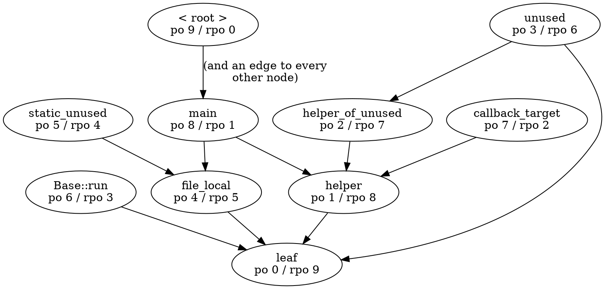

The picture numbers the nodes the way `--with-root` lists them, from 0. Every edge goes from a larger `po` to a smaller one, and from a smaller `rpo` to a larger one: that is the direction guarantee.

**What the Static Analyzer does with it.** The analyzer builds exactly this graph (`CallGraph CG; CG.addToCallGraph(...)` for the top-level declarations) and walks `ReversePostOrderTraversal<CallGraph *>`. This is `AnalysisConsumer::HandleDeclsCallGraph` in 22.1.8 (`clang/lib/StaticAnalyzer/Frontend/AnalysisConsumer.cpp`), shortened:

```cpp
  // Walk over all of the call graph nodes in topological order, so that we
  // analyze parents before the children. Skip the functions inlined into
  // the previously processed functions. Use external Visited set to identify
  // inlined functions. The topological order allows the "do not reanalyze
  // previously inlined function" performance heuristic to be triggered more
  // often.
  SetOfConstDecls Visited;
  SetOfConstDecls VisitedAsTopLevel;
  llvm::ReversePostOrderTraversal<clang::CallGraph*> RPOT(&CG);
  for (auto &N : RPOT) {
    Decl *D = N->getDecl();
    // Skip the abstract root node.
    if (!D)
      continue;
    // Skip the functions which have been processed already or previously
    // inlined.
    if (shouldSkipFunction(D, Visited, VisitedAsTopLevel))
      continue;
    // ... Analyze the function.
    SetOfConstDecls VisitedCallees;
    HandleCode(D, AM_Path, getInliningModeForFunction(D, Visited),
               (Mgr->options.InliningMode == All ? nullptr : &VisitedCallees));
    // Add the visited callees to the global visited set.
    for (const Decl *Callee : VisitedCallees)
      Visited.insert(/* the canonical declaration of Callee */);
  }
```

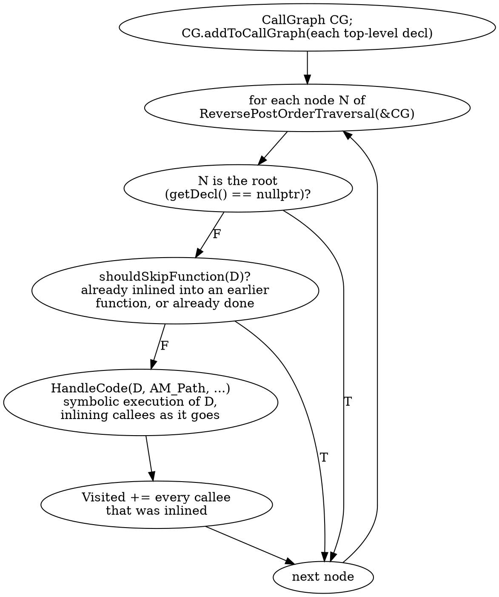

Why callers first? Because the analyzer *inlines*. Analysing `main` symbolically follows the call to `helper`, and `leaf` inside it, with the real argument values. A function that has been inlined into a caller needs no analysis of its own, so the analyzer records it in `Visited` and skips it when the traversal reaches it. In bottom-up order `leaf` would be analysed first with unknown arguments, then again when each caller inlines it: more work and less precision. The source comment says it: the top-down order makes the "do not reanalyze previously inlined function" heuristic "triggered more often".

> [!warning] The Static Analyzer is top-down, not bottom-up
> Summary-based tools go callees first (Section 8.6). The analyzer does not: it is the best-known consumer of `CallGraph`, and it walks the *reverse* post-order. If you remember "the analyzer analyses bottom-up", this is the place to unlearn it.

**Watching it happen.** `-analyzer-display-progress` makes the analyzer print each function it analyses, with a time. The commands below keep only the `ANALYZE (Path...)` lines (the path-sensitive pass; `ANALYZE (Syntax)` lines are the AST-only checkers, in definition order) and strip the times and parameter lists, so the output is stable. The `-Xclang` options go to the compiler front end, as in Part 1.4:

```bash
order() {
  CHECKER=core scripts/dumpcfg.sh manifests/p08_reach.cpp -Xclang -analyzer-display-progress "$@" 2>&1 \
    | sed -n -E 's/^ANALYZE( \(Path[^)]*\))?: manifests\/p08_reach.cpp ([^(]*)\(.*\) : [0-9.]+ ms$/\2/p' | paste -sd' ' -
}
echo "defaults:           $(order)"
echo "max-inlinable-size: $(order -Xclang -analyzer-config -Xclang max-inlinable-size=1)"
echo "inlining-mode=all:  $(order -Xclang -analyzer-inlining-mode=all)"
echo "ipa=none:           $(order -Xclang -analyzer-config -Xclang ipa=none)"
```

```text expected
defaults:           main Base::run static_unused unused
max-inlinable-size: main callback_target Base::run static_unused file_local unused helper_of_unused helper leaf
inlining-mode=all:  main callback_target Base::run static_unused file_local unused helper_of_unused helper leaf
ipa=none:           leaf helper helper_of_unused unused file_local static_unused Base::run callback_target main
```

With the defaults the analyzer starts a path-sensitive analysis for **four** functions only. `main` comes first (the first node of the reverse post-order) and inlines everything it can: `helper`, `file_local`, `leaf`, and `callback_target`, which the call graph has no edge to, but whose address the analyzer follows through `cb`. `Base::run` and `static_unused` are not called by anything that was analysed before them. `unused` inlines `helper_of_unused`. Everything else was inlined into an earlier function, so it is in `Visited` and skipped.

The other three lines change one setting each. These are the keys of `-analyzer-config` involved, as `clang -cc1 -analyzer-config-help` describes them in 22.1.8:

| Setting | Meaning | Effect on the order |
|---------|---------|---------------------|
| `max-inlinable-size=N` | "the bound on the number of basic blocks in an inlined function" (default 100 in deep mode) | `N=1` makes nothing inlinable: every function is a top-level entry, so the **whole** reverse post-order appears |
| `-analyzer-inlining-mode=all` | the function-selection heuristic (`all`, or `noredundancy`) | `all` does not record inlined callees, so nothing is skipped: the same full list |
| `ipa=none` | "the mode of inter-procedural analysis": `none`, `basic-inlining`, `inlining`, `dynamic`, `dynamic-bifurcate` | with `none` the call graph is not used at all: functions come in **declaration order**, and the progress line has a different format (`ANALYZE: file fn`, no mode) |
| `ipa-always-inline-size=N` | the size in blocks under which a function is always inlined (default 3) | changes which functions disappear from the default list |

The second and third lines are the call graph's reverse post-order, `main callback_target Base::run ... leaf`, exactly. The fourth line is the declaration order of the file, which here also equals the post-order only because every helper is defined before its callers. `shouldSkipFunction` makes two exceptions to the skipping: Objective-C methods and C++ copy and move assignment operators are analysed as top-level functions even if they were inlined before (the self-assignment check needs both situations).

### Verify

The claim to check: with inlining off, the analyzer visits the functions in the reverse post-order of the call graph that `p08_walk` computes with `GraphTraits`. The command defines the same `order` helper and compares the two lists:

```bash
order() {
  CHECKER=core scripts/dumpcfg.sh manifests/p08_reach.cpp -Xclang -analyzer-display-progress "$@" 2>&1 \
    | sed -n -E 's/^ANALYZE( \(Path[^)]*\))?: manifests\/p08_reach.cpp ([^(]*)\(.*\) : [0-9.]+ ms$/\2/p' | paste -sd' ' -
}
diff <(order -Xclang -analyzer-config -Xclang max-inlinable-size=1) <(build/bin/p08_walk manifests/p08_reach.cpp --order=rpo | sed 's/^order rpo: //') && echo "analyzer order == reverse post-order of the call graph"
```

### Expected

```text expected
analyzer order == reverse post-order of the call graph
```

The lab's `ReversePostOrderTraversal<CallGraph *>` and the analyzer's agree to the last function, and the analyzer's default list is that order with the inlined functions removed.

> [!hint]- Quiz: with the defaults, `helper` is never a top-level analysis entry although three functions call it. Why, and which switch makes it one?
> Look at the order, at `Visited`, and at the first function that calls it.

> [!success]- Answer
> The reverse post-order reaches `main` first; analysing it inlines `helper` (and `leaf` inside it), so both are added to `Visited`, and when the traversal arrives at them `shouldSkipFunction` skips them. `max-inlinable-size=1` makes nothing inlinable, and `-analyzer-inlining-mode=all` stops recording inlined callees, so every function is analysed as a top-level entry, in the order of the call graph.

### Common mistakes

| Mistake | Symptom |
|---------|---------|
| Using post-order for "which function does the analyzer start with" | the answer is the *last* element; the analyzer starts at the first of the reverse |
| Expecting one canonical order | the order depends on the callee order of each node, which is source order |
| Comparing `-analyzer-display-progress` output with its times | differs on every run; filter `ANALYZE (Path`, strip ` : N ms` |
| Using an `-analyzer-config` key you have not checked | an unknown key is a hard error (`-analyzer-config-compatibility-mode=true` is the escape hatch); check `clang -cc1 -analyzer-config-help` |
| Assuming `ipa=none` only turns off inlining | it turns off the call graph too: the order and the progress format change |

### Exercises

1. Run the `order` helper with `max-inlinable-size=2` and then with `max-inlinable-size=3`. The list changes between the two values. Count the blocks of `leaf` (`FN=leaf CHECKER=debug.DumpCFG scripts/dumpcfg.sh manifests/p08_reach.cpp`) and explain where the threshold is.
2. Change the file name inside the helper to `manifests/p08_recursion.cpp` and run it with the defaults and with `max-inlinable-size=1`. The second line equals `build/bin/p08_walk manifests/p08_recursion.cpp --order=rpo`, although the graph has cycles. The first line has three functions, and `build/bin/p08_walk manifests/p08_recursion.cpp --from=main --dead` lists three functions that `main` cannot reach. Two of them are on both lists: which one is not, and why was it skipped?

---

## Section 8.6 — Bottom-up summaries over SCCs: a transitive `noreturn` analysis with a fixed point

### Why

A **summary** is a fact about a whole function, computed from the summaries of the functions it calls: "may this function end the program?", "how deep can its call chain get?". Compute it once per function and every caller can use it without re-reading the callee. That only works if the callee's summary exists before the caller asks for it, which is what the callees-first order of `scc_iterator` guarantees, and inside a cycle it does not exist yet, so you iterate until nothing changes: a fixed point, one level up from the worklists of Part 4.7 and the lattice joins of Part 6.

### What to Do

**Sample file:** `manifests/p08_sink.cpp` — a `[[noreturn]]` function `fail`, and functions that reach it in every way there is: always, sometimes, never, through self recursion, through mutual recursion, and through a three-member cycle.

| Function | What it does | Expected `sink` summary |
|----------|--------------|-------------------------|
| `fail` | declared `[[noreturn]]`, never defined: the **sink** | `always` |
| `die` | calls `fail()` | `always` |
| `always_dies` | `if (x) fail(); else die();` | `always` (both branches end in a sink) |
| `guarded` | `if (x < 0) die(); return x;` | `may` (one path avoids it) |
| `safe` | `return x + 1;` | `none` |
| `retry` | self recursion that calls `fail()` on one branch | `may` |
| `fact` | self recursion, no sink | `none` |
| `ping`, `pong` | mutual recursion; `pong` calls `die()` on one branch | `may`, `may` |
| `ring_a`, `ring_b`, `ring_c` | a three-member cycle; `ring_c` calls `fail()` on one branch | `may` ×3 |
| `level4` ... `level1`, `top` | a call chain with no recursion and no sink | `none` |

**The property.** `p08_summary --prop=sink` computes a three-point lattice per function, `none < may < always`:

- `none`: no chain of calls leads to a sink.
- `may`: some chain of calls reaches a sink.
- `always`: **every path** through the function's own CFG passes a call that is itself `always`. This is where the call graph and the CFG meet: the tool builds each function's CFG, removes every block that contains an always-sink call, and asks whether `EXIT` is still reachable from `ENTRY`. If it is not, the function cannot return normally.

A sink is a function with `FunctionDecl::isNoReturn()` (the attribute is on the declaration, so `fail` needs no body), or the function you name with `--sink=NAME`. The transfer function of a member `f` is therefore: `always` if `f` is a sink, or if removing the blocks that call an `always` callee disconnects `ENTRY` from `EXIT`; `may` if some callee is not `none`; otherwise `none`.

**The order.** `llvm::scc_begin(&CG)` hands out the components callees first (Section 8.4), so when a component is processed every function outside it already has its final summary. For an acyclic component (one function, no self edge) one pass is enough. For a **cyclic** component the answer of each member depends on the others, so the tool iterates. This is the loop, from `tools/p08_summary/Summary.h`:

```cpp
    for (;;) {
      std::vector<Summary> Next;
      bool Changed = false;
      for (const CallGraphNode *N : S.Members) {
        Summary V = R.Opt.P == Prop::Sink ? sinkTransfer(N) : depthTransfer(N);
        Changed |= !V.sameValue(val(N));
        Next.push_back(V);
      }
      for (size_t K = 0; K < Next.size(); ++K) val(S.Members[K]) = Next[K];
      if (!S.Cyclic || !Changed) return;
      ++S.Iter;
    }
```

Each pass computes every member from the values of the **previous** pass and writes them all at once (a Jacobi pass), so the number of passes depends on the graph and not on the order in which the members are visited. `iter` counts the passes, including the last one, which changes nothing and proves the fixed point.

```bash
build/bin/p08_summary manifests/p08_sink.cpp --prop=sink
```

```text expected
scc 0: fail iter=1
summary fail: sink=always
scc 1: die iter=1
summary die: sink=always via fail
scc 2: always_dies iter=1
summary always_dies: sink=always via fail
scc 3: guarded iter=1
summary guarded: sink=may via die
scc 4: safe iter=1
summary safe: sink=none
scc 5 cyclic: retry iter=2
summary retry: sink=may via fail
scc 6 cyclic: fact iter=1
summary fact: sink=none
scc 7 cyclic: ping pong iter=3
summary ping: sink=may via pong
summary pong: sink=may via die
scc 8 cyclic: ring_a ring_b ring_c iter=4
summary ring_a: sink=may via ring_b
summary ring_b: sink=may via ring_c
summary ring_c: sink=may via fail
scc 9: level4 iter=1
summary level4: sink=none
scc 10: level3 iter=1
summary level3: sink=none
scc 11: level2 iter=1
summary level2: sink=none
scc 12: level1 iter=1
summary level1: sink=none
scc 13: top iter=1
summary top: sink=none
scc 14: main iter=1
summary main: sink=may via guarded
```

One `scc` line per component, in processing order (`fail` first, `main` last), then one `summary` line per member. `via X` names the next function of the shortest chain to a sink, so `guarded: sink=may via die` reads "guarded can reach a sink, through die". The answers match the table. Look at `always_dies` and `guarded`: both have a sink on a branch, and only the CFG tells `always` from `may`.

**The fixed point, pass by pass.** `--trace` prints every pass of every cyclic component. The three-member cycle is the interesting one: `ring_c` is the only member that calls the sink directly.

```bash
build/bin/p08_summary manifests/p08_sink.cpp --prop=sink --trace --func=ring_a --edges
```

```text expected
scc 8 cyclic: ring_a ring_b ring_c iter=4
trace scc 8 iter 1: ring_a=none ring_b=none ring_c=may
trace scc 8 iter 2: ring_a=none ring_b=may ring_c=may
trace scc 8 iter 3: ring_a=may ring_b=may ring_c=may
trace scc 8 iter 4: ring_a=may ring_b=may ring_c=may
summary ring_a: sink=may via ring_b
summary ring_b: sink=may via ring_c
summary ring_c: sink=may via fail
edge ring_a -> ring_b
edge ring_b -> ring_c
edge ring_c -> ring_a
```

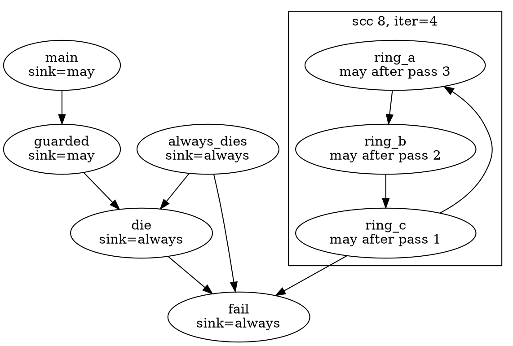

Pass 1 changes only `ring_c` (it calls `fail`, a `may`-or-better callee). `ring_b` calls `ring_c`, which was `none` when pass 1 started, so it learns one pass later; `ring_a` learns in pass 3; pass 4 changes nothing. The fact travels **one call edge per pass**, against the direction of the edges, and passes are only needed because the SCC is a cycle: outside one, the callee-first order already delivered the answer. The same count for every cyclic component:

```bash
build/bin/p08_summary manifests/p08_sink.cpp --prop=sink | grep cyclic
```

```text expected
scc 5 cyclic: retry iter=2
scc 6 cyclic: fact iter=1
scc 7 cyclic: ping pong iter=3
scc 8 cyclic: ring_a ring_b ring_c iter=4
```

| Component | Members *k* | `iter` | Why |
|-----------|------------:|-------:|-----|
| `retry` | 1 | 2 | pass 1 finds `may` (the sink is a direct callee), pass 2 confirms |
| `fact` | 1 | 1 | nothing is ever `may`: pass 1 changes nothing |
| `ping`, `pong` | 2 | 3 | `pong` is `may` in pass 1 (it calls `die`), `ping` in pass 2, pass 3 confirms |
| `ring_a`, `ring_b`, `ring_c` | 3 | 4 | the sink needs three passes to travel round the cycle |

For a boolean "may reach" property the bound is *k* + 1 passes: at most one member per pass is newly right, and one more pass to see that nothing changed. With the three-point lattice the general bound is the lattice height times *k*.

**A property without a fixed point: `depth`.** `--prop=depth` computes the length of the longest call chain below a function: 0 for a leaf, one more than the deepest callee otherwise. On a cycle that never settles (every pass adds one more call), so the tool **widens**: all members of a cyclic component jump straight to the top of the lattice, `inf`, and are not iterated (`iter=1`). This is the same idea as the widening in Part 6.3, in a lattice you can see:

```bash
build/bin/p08_summary manifests/p08_sink.cpp --prop=depth | grep '^summary'
```

```text expected
summary fail: depth=0
summary die: depth=1 via fail
summary always_dies: depth=2 via die
summary guarded: depth=2 via die
summary safe: depth=0
summary retry: depth=inf
summary fact: depth=inf
summary ping: depth=inf
summary pong: depth=inf
summary ring_a: depth=inf
summary ring_b: depth=inf
summary ring_c: depth=inf
summary level4: depth=0
summary level3: depth=1 via level4
summary level2: depth=2 via level3
summary level1: depth=3 via level2
summary top: depth=4 via level1
summary main: depth=5 via top
```

The non-recursive chain is exact: `level4` is 0, `level3` is 1, ... `top` is 4 (`via level1`), and `main` is 5 (`via top`). Every member of a cycle is `inf`. By default only the *members* are `inf`: `main` calls `ping`, which is `inf`, but the tool counts that call as one step and reports the finite depth of the other chain. `--inf=reach` propagates `inf` to every caller of a cycle instead, which is the stricter reading of "can this recurse without bound?":

```bash
build/bin/p08_summary manifests/p08_sink.cpp --prop=depth --inf=reach | grep -E 'summary (guarded|ping|main)'
```

```text expected
summary guarded: depth=2 via die
summary ping: depth=inf
summary main: depth=inf via ping
```

> [!warning] A summary has no call-site context
> `main` calls `guarded(1)`, and `guarded(1)` never reaches `die` because `x < 0` is false; the summary says `may` regardless. A summary describes the function for *all* callers. That is what makes it cheap (computed once per function, in a fixed order) and also what makes it imprecise. Part 7.5 measured the other end of the trade-off: context-sensitive analysis, which descends into the callee with the caller's state and pays for it per call site.

> [!warning] The summary only knows the graph's edges
> A sink behind a function pointer, a virtual call, a block variable, an implicit destructor or a `delete` is invisible: Section 8.3's list applies here unchanged. "`none`" means "no recorded chain reaches a sink", not "this function cannot terminate the program".

### Verify

Any function can be the sink. Declare `die` the sink with `--sink=NAME` and predict what happens to `always_dies` (it calls `fail()` on one branch and `die()` on the other), `retry`, and the `ring_*` functions, which only ever reached `fail` directly:

```bash
build/bin/p08_summary manifests/p08_sink.cpp --prop=sink --sink=die | grep -E '^summary (die|always_dies|guarded|retry|ring_a|ping|main):'
```

### Expected

```text expected
summary die: sink=always
summary always_dies: sink=may via die
summary guarded: sink=may via die
summary retry: sink=none
summary ping: sink=may via pong
summary ring_a: sink=none
summary main: sink=may via guarded
```

`die` itself is now the `always` sink. `always_dies` fell from `always` to `may`: its `if (x) fail();` branch no longer ends in a sink, so there is a path from `ENTRY` to `EXIT` that avoids every sink. `retry` and the ring reached only `fail`, so they are `none`. `ping` is still `may` (through `pong`'s call to `die`).

> [!hint]- Quiz: why does a boolean "may reach a sink" summary need at most *k* + 1 passes for a cyclic component of *k* members, and what happens with `depth`?
> How far does the fact travel in one pass, and what does one more call do to a depth inside a cycle?

> [!success]- Answer
> A pass reads only the previous pass's values, so a newly known `may` moves one call edge per pass; a chain through *k* members is at most *k* edges long, which makes *k* changing passes plus one that confirms. The property only moves up a finite lattice (`none` to `may`), so it must stop. `depth` has no such bound on a cycle: every extra trip around adds one, so iterating never terminates, and the tool widens to `inf` at once instead (`iter=1`).

### Common mistakes

| Mistake | Symptom |
|---------|---------|
| Processing functions in reverse post-order for a bottom-up summary | a caller reads its callee's initial value; the results depend on source order |
| Iterating cycles in place (updating a member and reading it in the same pass) | the `iter` count depends on the visiting order, and some orders converge faster; use passes that read the previous values |
| Treating `may` as "every path" | `guarded` is `may`; only the CFG check gives `always` |
| Expecting `depth` to be finite for recursion | it is `inf` by definition; widen instead of iterating |
| Trusting `none` | a sink behind a function pointer or an implicit destructor is invisible (Section 8.3) |

### Exercises

1. Copy `manifests/p08_sink.cpp` to `out/ex_sink.cpp` and add `if (n == 7) die();` at the start of `ring_a`. Predict the `iter` of `scc 8` and the trace before you run `build/bin/p08_summary out/ex_sink.cpp --prop=sink --trace --func=ring_a`.
2. `--prop=sink --sink=safe`: which functions become `may`, and what does `main` tell you about the length of the chain to `safe`? (`--prop=depth` has the numbers.)

---

## Section 8.7 — Call sites in the CFG: `AnyCall`, callees per block and an interprocedural walk

### Why

The call graph says *that* `f` may call `g`. The CFG says *where*: in which block, as which element, under which branch. Joining the two is the first inter-procedural analysis you can write, and it has a second use: the CFG sees calls the graph has no edge for (the destructors of Part 3.1, `delete`, calls through a pointer), so the join is also how you measure the graph's holes in a real function.

### What to Do

**Sample file:** `manifests/p08_sites.cpp` — `main` contains every kind of call site; `branches` has calls in the branches and the body of a loop; `dispatch` makes a virtual call; `apply` calls through a function pointer; `Holder` has a constructor with an initialiser and a destructor.

```cpp
int main() {
  Holder h(1);
  Derived d;
  int total = branches(h.value) + dispatch(d);
  total += apply(helper, total);
  total += external(total);
  Holder *p = new Holder(total);
  delete p;
  return total + Holder(3).value;
}
```

**`AnyCall`.** `clang/Analysis/AnyCall.h` is a small wrapper that puts every kind of call-like expression behind one interface, so an analysis does not need a `dyn_cast` ladder. `AnyCall::forExpr(const Expr *)` returns an `AnyCall` for a call expression (`std::nullopt` for anything else), `getKind()` says which kind, and `getDecl()` is the statically known callee, **null** when there is none (a function pointer):

| `AnyCall::Kind` | Comes from | In the sample |
|-----------------|------------|---------------|
| `Function` | `CallExpr`: function, member function, pointer | `branches(...)`, `fn(x)` |
| `Constructor` | `CXXConstructExpr` | `Holder h(1);`, `new Holder(total)` |
| `Allocator` | `CXXNewExpr` | `new Holder(total)` calls `operator new` |
| `Deallocator` | `CXXDeleteExpr` | `delete p` calls `operator delete` |
| `Destructor` | **no expression**: `AnyCall(const CXXDestructorDecl *)` | scope exit, temporaries, `delete` |
| `ObjCMethod`, `Block`, `InheritedConstructor` | message sends, calls through block pointers, `using Base::Base` | not in this sample |

**What is a site.** `p08_sites` walks the elements of a function's CFG. A `CFGStmt` whose statement is an expression that `AnyCall::forExpr` accepts is a site; the implicit destructor elements (`AutomaticObjectDtor`, `TemporaryDtor`, `DeleteDtor`, ... all `CFGImplicitDtor`) are sites too, built from their destructor declaration with `AnyCall(const CXXDestructorDecl *)`: they have no expression and no `CallRecord`, which is exactly why the graph misses them. Each site is addressed `B<id>.<i>`, the position the dump of Part 1.2 shows as `[B1.4]`. The CFG is built with the options you pass (`--preset`, `--set`, `--clear`, as in every CFG tool of Parts 2 to 7); the `analyzer` preset is what `debug.DumpCFG` uses.

Every site is then compared with the call graph and gets a **class**:

| Class | Meaning | Example |
|-------|---------|---------|
| `resolved` | the graph has an edge for this very call expression, and the callee has a body | `branches`, `dispatch`, `Holder::Holder` |
| `virtual static=X` | a virtual call: the graph recorded only the static callee `X` | `b.run(3)` in `dispatch` |
| `missing:indirect` | no callee is known; the callee prints as `?` | `fn(x)` in `apply` |
| `missing:implicit-dtor` | a destructor call that is not an expression | the three destructors at the end of `main` |
| `missing:delete` | what `delete` calls: `operator delete` and the destructor | `delete p` |
| `missing:decl` | the callee is known but has no body in this file | `external`, `operator new` |
| `missing:node`, `missing:edge` | a callee with a body that the graph leaves out (`__inline` names), or has a node for but no edge (should not happen) | none here |

**Where the calls are.** `branches` has a branch and a loop, so its sites are in different blocks. `--succs` prints the CFG's edges, with `T` and `F` on a two-way branch (successor 0 is the true edge, Part 2.5):

```bash
build/bin/p08_sites manifests/p08_sites.cpp --func=branches --preset=analyzer --succs
```

```text expected
== branches: 10 blocks, 3 sites
site branches B7.6 Function helper resolved
site branches B6.6 Function leaf resolved
site branches B3.6 Function leaf resolved
succ branches B9 -> B8
succ branches B8 -> B7 T
succ branches B8 -> B6 F
succ branches B7 -> B5
succ branches B6 -> B5
succ branches B5 -> B4
succ branches B4 -> B3 T
succ branches B4 -> B1 F
succ branches B3 -> B2
succ branches B2 -> B4
succ branches B1 -> B0
```

Read it with the CFG in mind. `B8` ends in `x > 0` and goes to `B7` on `T` and `B6` on `F`; `helper` is called in `B7` (the `then` branch) and `leaf` in `B6` (the `else` branch); `B4` is the loop condition and `leaf` is called in its body `B3`, which loops back through `B2`. The call graph has the edges `branches -> helper` and `branches -> leaf` and nothing else: it cannot say that `helper` is on the true branch only, or that `leaf` is called in a loop.

**All the kinds, in `main`.** Under the analyzer preset `main` is a single block, `B1`, so every site is an element of it:

```bash
build/bin/p08_sites manifests/p08_sites.cpp --func=main --preset=analyzer
```

```text expected
== main: 3 blocks, 14 sites
site main B1.2 Constructor Holder::Holder resolved
site main B1.4 Constructor Derived::Derived resolved
site main B1.11 Function branches resolved
site main B1.16 Function dispatch resolved
site main B1.26 Function apply resolved
site main B1.33 Function external missing:decl
site main B1.38 Constructor Holder::Holder resolved
site main B1.39 Allocator "operator new" missing:decl
site main B1.43 Destructor Holder::~Holder missing:delete
site main B1.44 Deallocator "operator delete" missing:delete
site main B1.48 Constructor Holder::Holder resolved
site main B1.55 Destructor Holder::~Holder missing:implicit-dtor
site main B1.57 Destructor Derived::~Derived missing:implicit-dtor
site main B1.58 Destructor Holder::~Holder missing:implicit-dtor
```

- The constructors and the three plain calls are `resolved`: `Holder::Holder` (three times: for `h`, for the `new` and for the temporary `Holder(3)`), `Derived::Derived`, `branches`, `dispatch`, `apply`.
- `external` and `operator new` are `missing:decl`: the graph has the nodes, but there is nothing to descend into.
- `delete p` appears as two sites, `Destructor Holder::~Holder` and `Deallocator "operator delete"`, both `missing:delete`.
- The last three, at `B1.55`, `B1.57` and `B1.58`, are the destructors that run at the end of `main` in reverse order of construction: the temporary `Holder(3)`, `d`, `h`. They are `missing:implicit-dtor`: the CFG shows them, the graph does not.

The other two interesting functions have one site each:

```bash
for f in dispatch apply; do build/bin/p08_sites manifests/p08_sites.cpp --func=$f --preset=analyzer; done
```

```text expected
== dispatch: 3 blocks, 1 sites
site dispatch B1.4 Function ? virtual static=Base::run
== apply: 3 blocks, 1 sites
site apply B1.5 Function ? missing:indirect
```

`dispatch` has a callee (`getDecl()` is `Base::run`), but the call goes through the vtable, so the class is `virtual static=Base::run`: the graph's edge `dispatch -> Base::run` is only the static answer, and `Derived::run` is invisible (Section 8.8 adds it). `apply` has no callee at all: `getDecl()` is null, the site is `?`, `missing:indirect`.

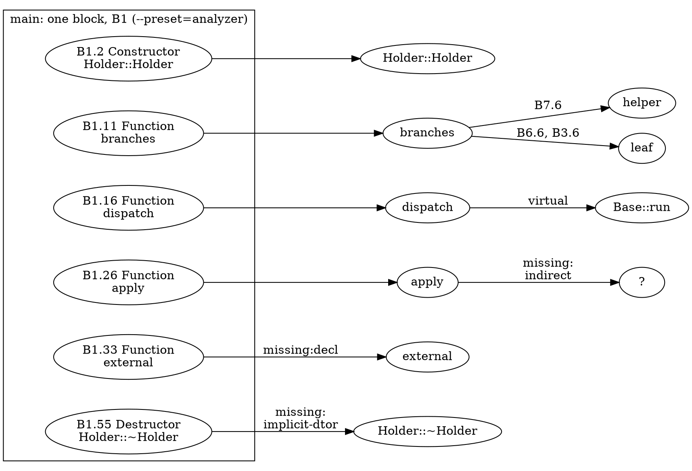

**Two presets, two element numberings.** Element numbers belong to a set of `BuildOptions`: the analyzer preset lists every sub-expression as its own element (Section 2.2, `setAlwaysAdd`), so `B1.11` is `B1.5` in the default build. The sites themselves differ too: a CFG built with the default options has no `AutomaticObjectDtor` elements, hence fewer sites. The Verify step below counts them. One more difference matters for the graph join: **constructor initialisers**. The call graph visits them (`Holder::Holder -> leaf` in Section 8.3), but the default CFG leaves them out until you ask:

```bash
build/bin/p08_sites manifests/p08_sites.cpp --func=Holder::Holder
build/bin/p08_sites manifests/p08_sites.cpp --func=Holder::Holder --set=AddInitializers
```

```text expected
== Holder::Holder: 2 blocks, 0 sites
== Holder::Holder: 3 blocks, 1 sites
site Holder::Holder B1.1 Function leaf resolved
```

Without `AddInitializers` the constructor's CFG has two blocks, `ENTRY` and `EXIT`, and no site: the call `leaf(v)` in `: value(leaf(v))` is not in the CFG at all. With it, a third block appears with the call. Any analysis that joins the two structures has to build the CFG with the options that match what it is asking.

**The interprocedural walk.** With sites resolved, a walk follows them: start at the entry of one function, visit its blocks in reverse post-order (the order of `PostOrderCFGView`, Part 4.2), and at every `resolved` site descend into the callee's CFG, up to `--depth` calls deep. `walk <depth> <function>:B<id>` is a block visited, and `-> <callee>` marks the site that sent the walk down. Only calls that are `resolved` are followed: a virtual site, an indirect site, a body-less callee and the implicit destructors are not (the walk would have to guess). The lines that mark the descents are the shape of the walk:

```bash
build/bin/p08_sites manifests/p08_sites.cpp --walk=main --depth=2 --preset=analyzer | grep -- '->'
```

```text expected
walk 0 main:B1 -> Holder::Holder
walk 1 Holder::Holder:B1 -> leaf
walk 0 main:B1 -> Derived::Derived
walk 1 Derived::Derived:B1 -> Base::Base
walk 0 main:B1 -> branches
walk 1 branches:B7 -> helper
walk 2 helper:B1 -> leaf
walk 1 branches:B6 -> leaf
walk 1 branches:B3 -> leaf
walk 0 main:B1 -> dispatch
walk 0 main:B1 -> apply
walk 0 main:B1 -> Holder::Holder
walk 1 Holder::Holder:B1 -> leaf
walk 0 main:B1 -> Holder::Holder
walk 1 Holder::Holder:B1 -> leaf
```

`main` descends into `Holder::Holder`, which calls `leaf`; into `Derived::Derived`, which calls the implicit `Base::Base`; into `branches`, where `B7` descends into `helper` (and from there, at depth 2, into `leaf`) while `B6` and `B3` descend into `leaf` directly. `dispatch` and `apply` are entered but contribute no further descent: their sites are `virtual` and `missing:indirect`. `--depth=2` stops the walk at depth 2: `leaf` is visited from `helper` but nothing below it is followed.

> [!note] Compare with Part 7.5
> `Environment::pushCall` in Part 7.5 does the same descent, but carries the caller's *state* into the callee and reports what the callee did with it. The walk here carries nothing: it answers "which code can run below this call", not "with which values". That is the whole difference between a call-graph traversal and a context-sensitive analysis.

### Verify

Predict how many `missing:implicit-dtor` sites `main` has under the default options and under the analyzer preset, then count them:

```bash
for p in default analyzer; do
  echo "$p: $(build/bin/p08_sites manifests/p08_sites.cpp --func=main --preset=$p | grep -c 'missing:implicit-dtor') implicit-dtor sites"
done
```

### Expected

```text expected
default: 0 implicit-dtor sites
analyzer: 3 implicit-dtor sites
```

The default CFG has none; the analyzer preset (`AddImplicitDtors` and `AddTemporaryDtors` on) has the three destructors at the end of `main`. Everything the graph "misses" in a function is a site with a `missing:` class in the CFG built with the right options.

> [!hint]- Quiz: which sites of `main` does the walk descend into for `Holder h;`, and why does the destructor not count?
> The walk follows `resolved` sites. What is the class of the destructor site, and which `CallRecord` would it need?

> [!success]- Answer
> It descends into the constructor, `Constructor Holder::Holder resolved`. The destructor of `h` is a `missing:implicit-dtor` site: the CFG has an `AutomaticObjectDtor` element for it, but it is not an expression, so `CGBuilder` never made a `CallRecord` for it and the tool has to synthesise the callee from `AnyCall(const CXXDestructorDecl *)`. A site with no edge in the graph is not `resolved`, so the walk does not follow it.

### Common mistakes

| Mistake | Symptom |
|---------|---------|
| Calling `AnyCall::forExpr` and treating a null `getDecl()` as "unknown function" for every site | a virtual call has a decl; check `isVirtual()` and the qualifier before you call it resolved |
| Looking for destructor calls among the `CFGStmt` elements | there are none: they are `CFGImplicitDtor` elements, and only appear with the options on |
| Comparing `B1.N` numbers across presets | the numbering belongs to the options |
| Building the CFG with default options and expecting constructor initialisers | `AddInitializers` is off by default |
| Assuming the call graph's edge for a callee covers every call to it | the edge belongs to *one* call expression; two calls give two records, and a call the graph missed gives none |

### Exercises

1. `build/bin/p08_sites manifests/p08_sites.cpp --unresolved --preset=analyzer`: for each function, which sites can the walk never follow, and which class is the most common?
2. In `main`, add `--set=AddImplicitDtors` to the default preset, then `--set=AddImplicitDtors,AddTemporaryDtors`. Which of the three destructor sites does each option add?

---

## Section 8.8 — Resolving indirect and virtual calls: function pointers, devirtualisation and CHA

### Why

Sections 8.3 and 8.7 found the two largest holes in the call graph: a call through a function pointer has no edge, and a virtual call has only the *static* callee. Every analysis on the graph inherits them, and recursion through a pointer or a vtable (the `step` and `Grid::area` of Section 8.4) is invisible. The fix is to **extend** the graph with edges you compute, and every rule for doing so trades two properties against each other: **soundness** (did you add *every* real target?) and **precision** (did you add *only* real targets?).

### What to Do

**Sample files:** `manifests/p08_virtual.cpp` (a hierarchy with a `final` class, a class nothing instantiates, an abstract base) and `manifests/p08_fnptr.cpp` (address-taken functions of two signatures, a table of pointers, a callback).

`CallGraphNode::addCallee` is public, so `p08_resolve` adds its edges to the real `clang::CallGraph` (and can re-run the SCC algorithm on the result). `CallGraph` has no way to *remove* an edge, so the static edge of a virtual call stays next to the ones the rules add. The tool prints one record per decision:

- `add <caller> -> <callee> @L<line> reason=... [candidates=n]`: an edge was added.
- `skip <caller> @L<line> reason=...`: a site no rule could resolve.
- `stats: edges <before> -> <after>, indirect sites <n>, resolved <m>` with `--counts` (`--stats` is taken by LLVM's own `-stats` option; the printed line still starts with `stats:`). *Indirect sites* are all function-pointer calls and all virtual calls; a site that `--devirt` resolves to the method the graph already has counts as resolved without an `add` line.

**The virtual calls in the graph.** One edge per call site: the method that name lookup finds in the *static* type of the object expression. The three sites of the sample, in the graph:

```cpp
int dispatch(Base &b) { return b.run(3); }                        // site A: dynamic type unknown
int call_final(Final &f) { return static_cast<Base &>(f).run(1); } // site B: a 'final' class
int call_local() {                                                // site C: a local object
  Derived d;
  return static_cast<Base &>(d).run(2);
}
```

```bash
for f in dispatch call_final call_local; do build/bin/p08_nodes manifests/p08_virtual.cpp --edges --sites --func=$f | sed 1d; done
```

```text expected
node dispatch
edge dispatch -> Base::run @L26 CXXMemberCallExpr
node call_final
edge call_final -> Base::run @L28 CXXMemberCallExpr
node call_local
edge call_local -> Base::run @L32 CXXMemberCallExpr
edge call_local -> Derived::Derived @L31 CXXConstructExpr
```

All three have an edge to `Base::run`, which is right for site A and a lossy answer for B and C. The sample writes `static_cast<Base &>(...)` on purpose: without the cast, `f.run(1)` is looked up in `Final`, the static callee is `Final::run`, and the graph already has the exact edge; there would be nothing for devirtualisation to add. The cast hides the type from name lookup but not from the compiler.

**Rule 1: devirtualise when the type is known (`--devirt`).** `CXXMethodDecl::getDevirtualizedMethod(const Expr *Base, bool IsAppleKext)` answers "which method runs here?" when the object's dynamic type is determined: the method or its class is `final`, the object is a local variable or temporary with a known type, or the call is qualified (`b.Base::run()`). It returns null otherwise. `CXXRecordDecl::isEffectivelyFinal()` is the class-level test.

```bash
build/bin/p08_resolve manifests/p08_virtual.cpp --devirt --counts
```

```text expected
add call_final -> Final::run @L28 reason=devirt-final
add call_local -> Derived::run @L32 reason=devirt-static
stats: edges 21 -> 23, indirect sites 5, resolved 2
```

`call_final` resolves to `Final::run` (`devirt-final`: the class is `final`) and `call_local` to `Derived::run` (`devirt-static`: the object `d` has exactly the type `Derived`). `dispatch` takes a reference of unknown dynamic type, so no rule here can resolve it. Two edges were added (`edges 21 -> 23`) and two of the five virtual sites are resolved.

**Rule 2: class-hierarchy analysis (`--cha`).** When the type is not known, assume the worst: every override, in any class of this translation unit that derives from the static type of the object, may run. The tool walks every `CXXRecordDecl`, skips abstract classes and finds each class's version of the method with `getCorrespondingMethodInClass`:

```bash
build/bin/p08_resolve manifests/p08_virtual.cpp --cha --counts
```

```text expected
add call_final -> Derived::run @L28 reason=cha candidates=4
add call_final -> Final::run @L28 reason=cha candidates=4
add call_final -> Unused::run @L28 reason=cha candidates=4
add call_local -> Derived::run @L32 reason=cha candidates=4
add call_local -> Final::run @L32 reason=cha candidates=4
add call_local -> Unused::run @L32 reason=cha candidates=4
add dispatch -> Derived::run @L26 reason=cha candidates=4
add dispatch -> Final::run @L26 reason=cha candidates=4
add dispatch -> Unused::run @L26 reason=cha candidates=4
skip use_orphan @L48 reason=no-overrider
add use_shape -> Square::area @L42 reason=cha candidates=1
stats: edges 21 -> 31, indirect sites 5, resolved 4
```

`dispatch` gains `Derived::run`, `Final::run` and `Unused::run`: `candidates=4` counts `Base::run`, which the graph already had. Two things in this list are worth stopping on. First, **`Unused::run`** is in: nothing in the file instantiates `Unused`, and CHA does not know that. That is a loss of *precision*: an impossible target. Second, CHA also adds three overriders to `call_final` and `call_local`, whose dynamic types are known exactly: CHA ignores what `--devirt` knows, which is why `--all` runs devirtualisation first and hands CHA only the sites that remain. `use_shape` calls a pure virtual function; the only implementation in the file is `Square::area` (`candidates=1`). And `use_orphan` is skipped, `no-overrider`: an abstract base with no implementation anywhere in this translation unit has *no* possible target.

```bash
build/bin/p08_resolve manifests/p08_virtual.cpp --all --counts
```

```text expected
add call_final -> Final::run @L28 reason=devirt-final
add call_local -> Derived::run @L32 reason=devirt-static
add dispatch -> Derived::run @L26 reason=cha candidates=4
add dispatch -> Final::run @L26 reason=cha candidates=4
add dispatch -> Unused::run @L26 reason=cha candidates=4
skip use_orphan @L48 reason=no-overrider
add use_shape -> Square::area @L42 reason=cha candidates=1
stats: edges 21 -> 27, indirect sites 5, resolved 4
```

With `--all` the exact answers win (`devirt-final`, `devirt-static`), and only `dispatch`, `use_shape` and `use_orphan` go to CHA: `edges 21 -> 27`.

**Rule 3: function pointers (`--fnptr`).** An indirect call has no callee, but its callee has a *type*, and only a function whose **address is taken** can ever be called through a pointer. The tool collects the address-taken functions (a `DeclRefExpr` to a function that is not in callee position: an argument, an initialiser, a table entry) and gives every indirect site an edge to each one whose function type matches the pointer's, with `ASTContext::hasSameFunctionTypeIgnoringExceptionSpec`:

```bash
build/bin/p08_resolve manifests/p08_fnptr.cpp --counts --sccs
build/bin/p08_resolve manifests/p08_fnptr.cpp --fnptr --counts --sccs
```

```text expected
stats: edges 5 -> 5, indirect sites 4, resolved 0
add apply -> add_one @L11 reason=fnptr-sig candidates=3
add apply -> recurse_via_ptr @L11 reason=fnptr-sig candidates=3
add apply -> sub_one @L11 reason=fnptr-sig candidates=3
add call_wide -> widen @L16 reason=fnptr-sig candidates=1
skip fire @L18 reason=unknown-type
add via_table -> add_one @L14 reason=fnptr-sig candidates=3
add via_table -> recurse_via_ptr @L14 reason=fnptr-sig candidates=3
add via_table -> sub_one @L14 reason=fnptr-sig candidates=3
stats: edges 5 -> 12, indirect sites 4, resolved 3
scc 4 cyclic mutual: apply recurse_via_ptr
```

The first command shows the graph as clang built it: four indirect sites, no edge added, no cycle. The second adds seven edges (`5 -> 12`):

- `apply` and `via_table` call a pointer of type `int (*)(int)`, and **three** functions of that type have their address taken: `add_one` and `sub_one` (both in the initialiser of `table`; `add_one` is also passed to `apply` in `main`) and `recurse_via_ptr` (passed to `apply`). `never_taken` has the same signature, but nobody takes its address, so it is not a candidate.
- `call_wide` calls a `long (*)(long)`; only `widen` has that type.
- `fire` calls a `void (*)(int, int)`: no function in the file has that type, so it is skipped, `unknown-type`.

And the last line is the payoff: `scc 4 cyclic mutual: apply recurse_via_ptr`. `recurse_via_ptr` calls `apply(recurse_via_ptr, n - 1)`, and `apply` calls its parameter; the recursion existed all along, and the graph could not see it until the missing edges were added.

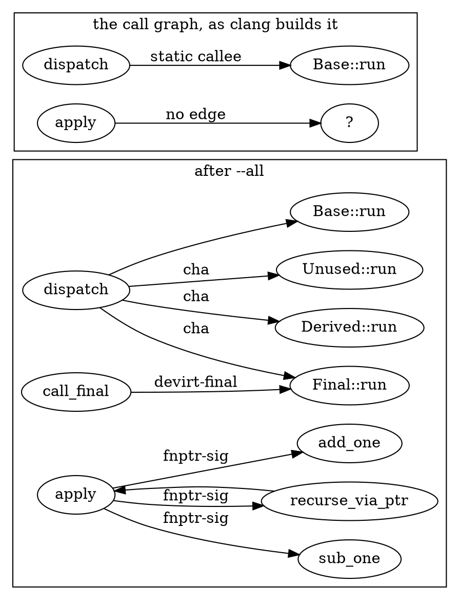

**What each rule gives up.**

| Rule | Adds | Sound? | Precise? | Example |
|------|------|--------|----------|---------|
| `--devirt` | the single exact target, when the dynamic type is known | yes: it is the only possible target | yes, but it resolves few sites | `call_final -> Final::run` |
| `--cha` | every overrider in this translation unit | for the classes this TU can see; a subclass defined in another TU is missed | no: includes classes that are never instantiated | `dispatch -> Unused::run` |
| `--fnptr` | an edge to every address-taken function of the same type | for pointers whose values come from this TU; a function whose address was taken elsewhere is missed | no: `apply` gets all three, though one call passes one | `apply -> sub_one` |

> [!warning] "Sound" means sound for what this translation unit can see
> `Unused::run` is a *precision* loss: an edge that no execution takes. A subclass of `Base` in another file, called through `dispatch`, is a *soundness* loss: a real target that the analysis never learns. A single translation unit cannot fix the second; the sound answer for a pointer or a virtual call is "every function of that type, every override, in the whole program". Section 8.9 merges graphs across files, but the rules still run per TU.

The Static Analyzer makes the same trade-offs, with path information: `ipa=dynamic` resolves a virtual call from the dynamic type it has inferred for the object, and `ipa=dynamic-bifurcate` explores both the exact target and the conservative case (`clang -cc1 -analyzer-config-help` lists both). `clang-tidy`'s `misc-no-recursion`, which Section 8.9 recreates, resolves nothing: it builds a plain `CallGraph` and reports its cycles. The whole-program version of this section is what the cidx call-graph plans work on (`wiki/pages/planning/cidx-devirtualized-callgraph.md`, `wiki/pages/planning/cidx-higher-order-callgraph.md`).

### Verify

Recursion through a callback and through a virtual call is the reason to resolve at all. `p08_recursion.cpp` has both. Predict which cyclic SCCs appear once the rules run:

```bash
for flags in "" "--all"; do echo "[$flags]"; build/bin/p08_resolve manifests/p08_recursion.cpp $flags --sccs | grep -E 'step|Grid'; done
```

### Expected

```text expected
[]
[--all]
add measure -> Grid::area @L35 reason=cha candidates=2
add step -> step @L28 reason=fnptr-sig candidates=1
scc 4 cyclic self: step
scc 6 cyclic mutual: Grid::area measure
```

Without the rules neither `step` nor `Grid::area` is in a cycle: nothing matches. With `--all` the two `add` lines are the edges that close them. `--fnptr` finds that `next_step` can only be `step` (`candidates=1`) and adds `step -> step`, a self edge: `scc 4 cyclic self: step`. CHA adds `measure -> Grid::area` for `s.area(n)` on a `Shape &` (`candidates=2`: `Shape::area`, which the graph already had, and `Grid::area`), closing the cycle `Grid::area -> measure -> Grid::area`: `scc 6 cyclic mutual: Grid::area measure`.

> [!hint]- Quiz: why can `--fnptr` be sound for a single translation unit and still miss a target?
> Where else can an address come from?

> [!success]- Answer
> The rule only knows the address-taken functions *of this TU*. A pointer can be handed in from another translation unit (an argument, a global initialised elsewhere, a registration function), and a function whose address is taken in another file never enters the candidate set. Soundness needs every function of the right type whose address is taken *anywhere in the program*, which a per-TU graph cannot provide; that is the argument for whole-program tools.

### Common mistakes

| Mistake | Symptom |
|---------|---------|
| Writing `f.run(1)` on a `final` object to test devirtualisation | the static callee is already `Final::run`; nothing to add, and the test passes for the wrong reason |
| Treating CHA's candidates as the possible targets | they include classes that are never instantiated, such as `Unused` |
| Forgetting that the static edge stays | `call_final` ends up with `Base::run` *and* `Final::run` after `--devirt` |
| Using `--fnptr` as if it were precise | every indirect call of a type gets the whole candidate set |
| Passing `--stats` | LLVM registers `-stats` itself and the tool aborts at start-up with "registered more than once"; the flag is `--counts` |

### Exercises

1. Copy `manifests/p08_virtual.cpp` to `out/ex_virtual.cpp` and make `Derived` `final` (`struct Derived final : Base`). Predict which line of `--devirt --counts` changes, then run it.
2. In another copy, delete the `Unused` class and its overrider. How do `candidates=` and the number of added edges change for `--cha`? Is that a gain in precision or a change in soundness?

---

## Section 8.9 — Capstone: a cross-TU recursion and sink checker merged by USR

### Why

Everything so far worked on one translation unit, and so does `clang-tidy`'s `misc-no-recursion`: a cycle that goes through two `.cpp` files, `a_fn -> b_fn -> a_fn`, is invisible to it. A `ClangTool` over several files builds one `CallGraph` per file and frees each with its AST, so the cross-file edge simply does not exist in any of them. This section merges the graphs by a stable key, the USR, and runs the two checks of the part (recursion, Section 8.4; reaching a `[[noreturn]]` sink, Section 8.6) on the result, reporting `file:line` diagnostics and an exit status like a real checker.

### What to Do

**Sample files:** `manifests/p08_xtu.h` (shared declarations), `manifests/p08_xtu_a.cpp` and `manifests/p08_xtu_b.cpp`.

```cpp
// p08_xtu.h
int a_fn(int n);                           // defined in p08_xtu_a.cpp
int b_fn(int n);                           // defined in p08_xtu_b.cpp
[[noreturn]] void fail();                  // defined nowhere: the sink
inline int shared(int x) { return x + 1; } // defined in every TU that includes this header
```

```cpp
// p08_xtu_a.cpp
#include "p08_xtu.h"
static int local() { return shared(1); }
int a_fn(int n) { return n <= 0 ? local() : b_fn(n - 1); }
int main() { return a_fn(3); }
```

```cpp
// p08_xtu_b.cpp
#include "p08_xtu.h"
static int local() { return shared(2); }
int b_fn(int n) { return n <= 0 ? local() : a_fn(n - 1); }  // calls back into a.cpp
void die() { fail(); }
void cleanup() { die(); }
```

`a_fn` calls `b_fn`, which calls `a_fn`: a cycle across two files. `cleanup -> die -> fail` reaches the sink. Both files define a `static` function called `local`, and both include the inline function `shared`.

**One graph per TU does not compose.** Run on `p08_xtu_a.cpp` alone, `b_fn` is a node with no body and no callees, a callee-only `decl` node, exactly like `declared_only` in Section 8.3, and there is no cycle:

```bash
build/bin/p08_xtu manifests/p08_xtu_a.cpp --edges 2>/dev/null
```

```text expected
== merged: 5 nodes, 4 edges, 1 tus
node a_fn kind=def tus=p08_xtu_a.cpp
node b_fn kind=decl tus=p08_xtu_a.cpp
node local kind=def static tus=p08_xtu_a.cpp
node main kind=def tus=p08_xtu_a.cpp
node shared kind=def tus=p08_xtu_a.cpp
edge a_fn -> b_fn @p08_xtu_a.cpp:5
edge a_fn -> local @p08_xtu_a.cpp:5
edge local -> shared @p08_xtu_a.cpp:4
edge main -> a_fn @p08_xtu_a.cpp:6
```

A node of `CallGraph` is a `Decl *` of *that* translation unit's AST. The `b_fn` of `a.cpp` (a declaration) and the `b_fn` of `b.cpp` (a definition) are two unrelated pointers in two ASTs that never coexist. Names are no better: two `static void local()` in different files are different functions with the same name. What the two sides share is the **USR** (Section 8.2): the same function has the same USR in every translation unit that sees it, and a `static` function's USR carries its file name.

**The merge.** `tools/p08_xtu/Merge.h` merges the per-TU graphs by USR. A node has no USR when it is a block; blocks are keyed by `file:line:column`.

| Rule | What it does | Why |
|------|--------------|-----|
| Key | the USR; for a block, `file:line:column` | a stable identity across ASTs |
| Node kind | `def` if **any** TU defines it, else `decl` | a declaration in one TU becomes the definition from another |
| `tus=` | the TUs that *define* the function (for a `decl` node: the ones that mention it) | provenance: where the code is |
| Inline function | defined in every TU that includes it, and still **one** node | the same USR; `tus=` lists both files |
| `static` | two functions of the same name stay two nodes; names that print alike get `@<tu>` appended | different USRs (file-prefixed) |
| Edges | the union, deduplicated by (caller, callee, call-site file, line, column) | an inline function's edges are seen twice |
| `xtu` | an edge whose callee is defined, but not in some TU the edge was seen in | the edge exists only because of the merge |

```bash
build/bin/p08_xtu manifests/p08_xtu_a.cpp manifests/p08_xtu_b.cpp --edges 2>/dev/null
```

```text expected
== merged: 9 nodes, 9 edges, 2 tus
node a_fn kind=def tus=p08_xtu_a.cpp
node b_fn kind=def tus=p08_xtu_b.cpp
node cleanup kind=def tus=p08_xtu_b.cpp
node die kind=def tus=p08_xtu_b.cpp
node fail kind=decl noreturn tus=p08_xtu_b.cpp
node local@p08_xtu_a.cpp kind=def static tus=p08_xtu_a.cpp
node local@p08_xtu_b.cpp kind=def static tus=p08_xtu_b.cpp
node main kind=def tus=p08_xtu_a.cpp
node shared kind=def tus=p08_xtu_a.cpp,p08_xtu_b.cpp
edge a_fn -> b_fn @p08_xtu_a.cpp:5 xtu
edge a_fn -> local@p08_xtu_a.cpp @p08_xtu_a.cpp:5
edge b_fn -> a_fn @p08_xtu_b.cpp:7 xtu
edge b_fn -> local@p08_xtu_b.cpp @p08_xtu_b.cpp:7
edge cleanup -> die @p08_xtu_b.cpp:9
edge die -> fail @p08_xtu_b.cpp:8
edge local@p08_xtu_a.cpp -> shared @p08_xtu_a.cpp:4
edge local@p08_xtu_b.cpp -> shared @p08_xtu_b.cpp:4
edge main -> a_fn @p08_xtu_a.cpp:6
```

With two or more files `ClangTool` prints `[1/2] Processing file ...` on stderr; the commands of this section discard it with `2>/dev/null`. Reading the merged graph:

- `b_fn` is `def`, with `tus=p08_xtu_b.cpp`: the declaration seen by `a.cpp` and the definition in `b.cpp` are one node.
- `a_fn -> b_fn` and `b_fn -> a_fn` are both marked `xtu`: each resolves only because of the merge, and together they are the cycle that no single TU contains.
- `shared` is **one** node, `tus=p08_xtu_a.cpp,p08_xtu_b.cpp`, with an edge from each file's `local`.
- The two `local` functions are two nodes, `local@p08_xtu_a.cpp` and `local@p08_xtu_b.cpp`.
- `fail` is `decl noreturn`: nobody defines it. It stays in the merged graph as the sink.

The identities behind it:

```bash
build/bin/p08_xtu manifests/p08_xtu_a.cpp manifests/p08_xtu_b.cpp --usr 2>/dev/null | grep -E 'local|shared'
```

```text expected
node local@p08_xtu_a.cpp kind=def static tus=p08_xtu_a.cpp usr=c:p08_xtu_a.cpp@F@local#
node local@p08_xtu_b.cpp kind=def static tus=p08_xtu_b.cpp usr=c:p08_xtu_b.cpp@F@local#
node shared kind=def tus=p08_xtu_a.cpp,p08_xtu_b.cpp usr=c:@F@shared#I#
```

`--unresolved` lists the functions no TU defines, with the file that declares them:

```bash
build/bin/p08_xtu manifests/p08_xtu_a.cpp manifests/p08_xtu_b.cpp --unresolved 2>/dev/null | grep '^unresolved'
```

```text expected
unresolved fail (decl in p08_xtu.h)
```

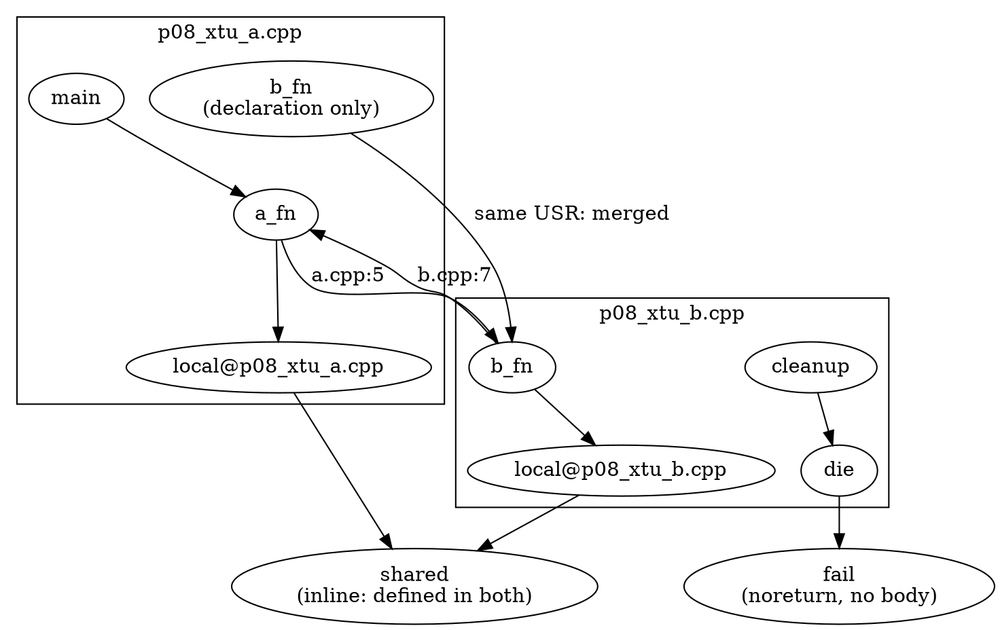

**The checker.** `p08_check` merges the graphs and reports two kinds of finding, in the shape of a compiler diagnostic. Its two algorithms are the ones the part built:

- **Recursion**, the check of `misc-no-recursion` (which runs `scc_iterator` and `hasCycle()`, calls out every function of a cyclic SCC, and then follows callees inside the SCC until one repeats), but on the merged graph: one cycle per cyclic SCC, found by a breadth-first search from the SCC's first function by name back to itself. The location is the first call site of the cycle.
- **Reaches a sink**, the "may" summary of Section 8.6: for every function that can reach a `[[noreturn]]` function, one chain, the shortest by call count; the location is the first call of the chain. `--sink=NAME` makes any function the sink instead.

The merged graph has no single `ASTContext`, so `Summary.h` (which builds CFGs for the `always` level) cannot run on it; `p08_check` does its own breadth-first chain search on the merged graph, with the same rule as `sinkPath`. Exit status: `0` no diagnostics, `1` diagnostics, `2` the front end failed or the options were wrong, the convention of `p07_tu` (Section 7.3).

```bash
(build/bin/p08_check manifests/p08_xtu_a.cpp manifests/p08_xtu_b.cpp 2>/dev/null; echo "exit=$?")
```

```text expected
diag manifests/p08_xtu_a.cpp:5: recursion: a_fn -> b_fn -> a_fn
diag manifests/p08_xtu_b.cpp:8: reaches-sink: die -> fail
diag manifests/p08_xtu_b.cpp:9: reaches-sink: cleanup -> die -> fail
summary: 8 functions, 2 recursive, 2 reach a sink
exit=1
```

The recursion diagnostic is at `p08_xtu_a.cpp:5`: the call to `b_fn` in `a_fn`. The two sink chains are at `p08_xtu_b.cpp:8` (`die` calls `fail`) and `:9` (`cleanup` calls `die`, which reaches `fail`). The summary counts the defined functions (eight: `a_fn`, `b_fn`, `cleanup`, `die`, `main`, `shared` and the two `local`s), the functions on a cycle (`a_fn`, `b_fn`) and the functions with a chain (`die`, `cleanup`; the sink itself is not counted). `--trace` prints every hop of every chain, with the call site of each:

```bash
build/bin/p08_check manifests/p08_xtu_a.cpp manifests/p08_xtu_b.cpp --trace 2>/dev/null
```

```text expected
diag manifests/p08_xtu_a.cpp:5: recursion: a_fn -> b_fn -> a_fn
trace recursion: a_fn -> b_fn @manifests/p08_xtu_a.cpp:5
trace recursion: b_fn -> a_fn @manifests/p08_xtu_b.cpp:7
diag manifests/p08_xtu_b.cpp:8: reaches-sink: die -> fail
trace reaches-sink: die -> fail @manifests/p08_xtu_b.cpp:8
diag manifests/p08_xtu_b.cpp:9: reaches-sink: cleanup -> die -> fail
trace reaches-sink: cleanup -> die @manifests/p08_xtu_b.cpp:9
trace reaches-sink: die -> fail @manifests/p08_xtu_b.cpp:8
summary: 8 functions, 2 recursive, 2 reach a sink
```

The recursion chain crosses files: the first hop is at `p08_xtu_a.cpp:5`, the second at `p08_xtu_b.cpp:7`. That is the edge a per-TU checker never sees.

**Packaging.** Section 7.6 packaged one analysis three ways (standalone, plugin, clang-tidy module). The merge is the part that does not fit a compiler plugin or a tidy check, which see one TU at a time; this checker is a standalone tool for that reason. A real clang-tidy version would need a two-pass design: collect per-TU facts (functions, USRs, edges) in a first run, merge them outside the compiler, and report in a second. That is what Section 7.7 argued for persistence: store compact tables, not state.

### Verify

Predict the three exit codes: the two files together, the first file alone, and a file that does not exist:

```bash
for files in "manifests/p08_xtu_a.cpp manifests/p08_xtu_b.cpp" "manifests/p08_xtu_a.cpp" "manifests/missing.cpp"; do
  build/bin/p08_check $files >/dev/null 2>&1; echo "$files -> exit $?"
done
```

### Expected

```text expected
manifests/p08_xtu_a.cpp manifests/p08_xtu_b.cpp -> exit 1
manifests/p08_xtu_a.cpp -> exit 0
manifests/missing.cpp -> exit 2
```

Together, the checker finds the cycle and the chains (`1`). With `a.cpp` alone, `b_fn` is a node with no callees and `die` and `cleanup` are not there at all: no cycle, no chain, exit `0`. A missing file is a front-end failure (`2`), distinct from "the code has findings".

> [!hint]- Quiz: the inline function `shared()` is defined in the header, so both translation units define it. How many nodes does it have after the merge, and what would `CallGraph::getNode` have said inside one of the TUs?
> What is the same, and what is different, between the two copies?

> [!success]- Answer
> One node, with `tus=p08_xtu_a.cpp,p08_xtu_b.cpp`: both copies have the same USR (`c:@F@shared#I#`), so the merge treats them as one function, and their edges are deduplicated. Inside one TU it is an ordinary definition node, found by `getNode` on its canonical declaration like any other (Section 8.2); the merge is only needed to see that two such nodes are the same function. Compare `local`, whose USR contains the file name: two nodes.

### Common mistakes

| Mistake | Symptom |
|---------|---------|
| Keying the merge by printed name | the two `static local()` become one node, and overloads of one name merge |
| Keying by `Decl *` | nothing merges: the pointers belong to different ASTs |
| Keeping the `CallGraph` after the TU is done | dangling pointers: it holds `Decl *` of an AST that is gone (the merge copies *names, USRs and positions* inside the action) |
| Treating `decl` as "does not exist" | the declaration in `a.cpp` is the same function as the definition in `b.cpp` |
| Running the checker on one file and reading "no findings" as "none" | `a.cpp` alone has no cycle: the cycle needs both files |
| Parsing the diagnostics with `grep` and ignoring the exit status | the status is the contract (`0`, `1`, `2`), like `p07_tu` |

### Exercises

1. Run `build/bin/p08_check manifests/p08_xtu_a.cpp manifests/p08_xtu_b.cpp --sink=die --no-recursion 2>/dev/null`. Which diagnostics remain, and why is `die` not reported as reaching a sink?
2. Swap the two file names on the command line. Is anything in the output different? Why is that a requirement for a checker whose output is compared in tests?
3. Package `p08_check` as a clang-tidy check using the CMake pattern of `tools/p07_tidy/` (Section 7.6). Which half of the algorithm survives, and which must move out of the check?

---

## Section 8.10 — Checkpoint

| Concept | What You Proved |
|---------|-----------------|
| What a call graph is | A node per function (keyed by its canonical declaration), an edge per call *site*; `< root >` has an edge to **every** node, so it is an entry for traversals and not a "nobody calls this" marker (8.1) |
| The dump | `debug.DumpCallGraph` prints a reverse post-order from the root, which is why it is deterministic and why callers come first; `dump()` writes to stderr (8.1) |
| The API | `addToCallGraph` runs a visitor; `getNode` does not canonicalise, `getOrInsertNode` does; a `CallRecord` holds the callee and the call expression, and compares by callee only; `size()` counts the root; `printQualifiedName` loses template arguments, lambdas and blocks (8.2) |
| Exports | DOT with the lab's classes, JSON with `scc`/`po`/`rpo`/line/column, and the library's own `WriteGraph`, whose labels come out empty unless a wrapper supplies the traits (8.2) |
| What gets in | Two doors (`includeInGraph` for definitions, `includeCalleeInGraph` for callees); declaration-only functions, template instantiations, implicit members, lambdas and blocks are nodes; template patterns and `__inline*` names are not; the visitor flags are data members in Clang 22 (8.3) |
| What stays out | Function pointers, block variables, `delete`, implicit destructors and the dynamic target of a virtual call have no edge; "no callees" does not mean "calls nothing" (8.3) |
| `GraphTraits` | `depth_first`, `post_order`, `ReversePostOrderTraversal` and `scc_iterator` work on `CallGraph*` with no null-successor trap; there is no `Inverse<CallGraph*>`, so callers come from a reverse map (8.4) |
| Recursion and dead code | A cyclic SCC is recursion (a self edge or two-plus members); "dead" depends on the roots you choose; recursion behind a pointer or a vtable is invisible (8.4) |
| Orders | Post-order is callees first (summaries), reverse post-order is callers first; the Static Analyzer walks the reverse order and skips what it inlined (`Visited`); `ipa=none` drops the graph altogether (8.5) |
| Summaries | Components in `scc_iterator` order, Jacobi passes inside cycles, `iter` is at most *k* + 1 for a boolean property, `depth` is widened to `inf`; a summary has no call-site context (8.6) |
| Graph and CFG together | `AnyCall` gives every call-like element one interface; each site is `resolved` or a `missing:` class; implicit destructors and `delete` exist only in the CFG; the options decide what the CFG has (`AddInitializers`, `AddImplicitDtors`, `AddTemporaryDtors`); an interprocedural walk descends only into resolved sites (8.7) |
| Resolution | `--devirt` (exact, few sites), `--cha` (every overrider this TU sees), `--fnptr` (every address-taken function of the type): each trades soundness against precision, the static edge stays, and the cycles hidden in 8.4 appear (8.8) |
| Cross-TU | Per-TU graphs do not compose; the USR is the key, an inline function stays one node, two `static` functions stay two, `xtu` edges exist only after the merge; the checker reports `file:line` diagnostics and exit codes 0/1/2 (8.9) |

**What is next.** You now have the structure that connects the lab's two halves: the CFG says what happens inside a function, the call graph says what the functions can do to each other. For depth: `clang-tidy`'s `misc-no-recursion` (`clang-tools-extra/clang-tidy/misc/NoRecursionCheck.cpp`) is the production version of 8.9's recursion check, and `AnalysisConsumer::HandleDeclsCallGraph` is the one of 8.5; the Static Analyzer's cross-translation-unit mode solves the problem of 8.9 for path-sensitive analysis, and its `ipa=dynamic-bifurcate` mode is the path-sensitive version of 8.8's resolution. The whole-program version of Sections 8.8 and 8.9 (devirtualised and higher-order call graphs over a persistent index) is described in `wiki/pages/planning/cidx-devirtualized-callgraph.md` and `wiki/pages/planning/cidx-higher-order-callgraph.md`, and `wiki/pages/research/clang-cfg-api.md` lists every source this lab was checked against.

**Ready to use it on your own code?** Pick a property of your own code base that crosses function boundaries (a lock that must be released by every caller, a function that must never be reached from an interrupt handler, a deprecated API that nothing may call transitively) and decide first which roots, which holes and which resolution rules the answer can tolerate. Then write ten fixtures for it, as Section 7.4 taught, before the first line of the traversal.

---

[← Part 7 — Capstone & Engineering](part_7_capstone.md) | [README](README.md)
