# Part 8 — Call Graph Fundamentals

[← Part 7 — Capstone & Engineering](part_7_capstone.md) | [Part 9 — Call Graph Algorithms →](part_9_call_graph_algorithms.md)

## What You'll Learn

- What a `clang::CallGraph` is: one node per function, one edge per call *site* that names its callee, and the synthetic `< root >` node that has an edge to **every** function (not only to the ones nobody calls)
- The container in detail: `CallGraph`, `CallGraphNode`, `CallRecord`, why only the canonical declaration is a key, and why `getNode` and `getOrInsertNode` disagree
- Names and identity: why a printed name is not an identity (template arguments, lambdas, blocks, selectors) and what the USR adds
- The builder: `CallGraph` is a `DynamicRecursiveASTVisitor` with two doors into the graph, public visitor flags, a `TraverseStmt` that does nothing, and an incremental `addToCallGraph`
- What `CGBuilder` records (calls, constructors, `new`, initialisers, default arguments, lambdas, blocks, Objective-C messages) and what stays out (function pointers, block variables, `delete`, implicit destructors, virtual targets)
- `clang::AnyCall`, the one interface for every call-like expression and declaration that the Static Analyzer and the dataflow framework use
- A call graph of your own: a visitor that records what `CGBuilder` skips, diffed edge by edge against the library's
- The exports: the lab's DOT and JSON, `print`, `dump`, `llvm::WriteGraph` and `viewGraph`

## The Big Picture

Parts 2 to 7 stayed inside one function: one body, one CFG, facts about its paths. The questions people actually ask cross function boundaries: can this function recurse, can it end up in `abort()`, who calls this, is this function dead? The structure that answers them is the **call graph**, the inter-procedural companion of the CFG. Four parts cover it, and this one is the foundation:

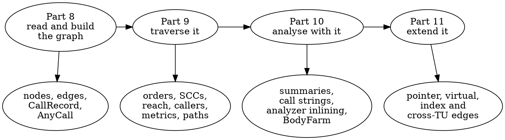

How it compares to the CFG (the last row is the theme of the whole track):

| | CFG (Parts 1-7) | Call graph (Parts 8-11) |
|---|-----------------|-------------------------|
| Scope | one function body | one translation unit (several in Section 11.5) |
| Node | basic block | function: one node per declaration chain |
| Edge | control transfer between blocks | a call expression whose callee is known by name |
| Entry | the `ENTRY` block | the synthetic `< root >` node |
| Built by | `CFG::buildCFG`, one per function | `CallGraph::addToCallGraph`, one per translation unit (or one per declaration, Section 8.4) |
| Header | `clang/Analysis/CFG.h` | `clang/Analysis/CallGraph.h` |
| Complete? | exact for the function, given the `BuildOptions` | **incomplete by design**: it records direct calls the AST states syntactically, nothing else |

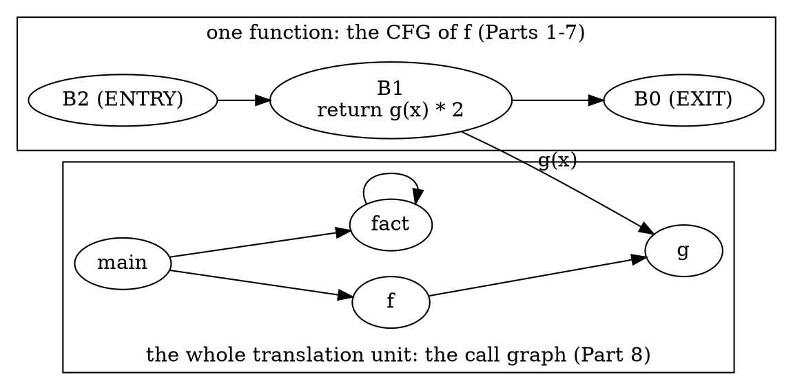

A CFG tells you everything that can happen in one function. A call graph tells you what the AST *says* about calls between functions, and it says nothing about a call through a function pointer, a block variable, `delete`, an implicit destructor, or the dynamic target of a virtual call. Every analysis you build on it (reachability, recursion, summaries) inherits those holes, so the sections run in this order: read the graph (8.1 to 8.3), see how it is built and what that leaves out (8.4 to 8.6), name every call with `AnyCall` (8.7), build your own graph and diff it against the library's (8.8), and export it (8.9). Part 9 then runs algorithms on it, Part 10 analyses with it, and Part 11 repairs its holes and merges several of them.

| Tool (this part) | Section | Does |
|------------------|---------|------|
| `p08_nodes` | 8.1 to 8.3, 8.9 | the nodes and edges of a `CallGraph`: library dump, call sites, node kinds, USRs, name lookup, DOT and JSON export, `viewGraph` |
| `p08_build` | 8.4 | builds the graph itself: the visitor flags, the two doors, and one declaration at a time |
| `p08_anycall` | 8.7 | what `AnyCall::forExpr` and `AnyCall::forDecl` say about every call and every definition |
| `p08_mine` | 8.8 | a hand-written call graph, diffed edge by edge against the library's |

The sample files, one per topic (every function is small and named for what it demonstrates):

| File | Used in | Holds |
|------|---------|-------|
| `manifests/p08_basic.cpp` | 8.1, 8.2, 8.9 | `main`, `f`, `g`, a self-recursive `fact`, a dead `unused`: six lines of dump |
| `manifests/p08_include.cpp` | 8.2 to 8.6, 8.8, 8.9 | templates, implicit members, `new`/`delete`, default arguments, lambdas, a block, a function pointer: every inclusion rule |
| `manifests/p08_objc.m` | 8.3, 8.6 to 8.8 | Objective-C messages and blocks |
| `manifests/p08_calls.cpp` | 8.7, 8.8 | one call of every `AnyCall` kind in one `main` |
| `manifests/p09_recursion.cpp` | 8.1, 8.2, 8.4 | functions declared before they are defined (and, for Part 9, every shape of recursion) |

The call-graph tools of Parts 8 to 11 share one output grammar, so you learn it once:

- **One record per line**, fields separated by single spaces; a name is quoted only when it contains a space (`"operator new"`).
- `<root>` is left out of every list and edge set unless you pass `--with-root`; an empty list prints `-`.
- Names are qualified (`Holder::Holder`); a template instantiation gets its arguments (`twice<int>`); a lambda's call operator and a block carry the line they are on (`two_lambdas()::(lambda@L59)::operator()`, `<block@L70>`). Section 8.3 explains why.
- Lists are sorted by name, never by pointer, so every output is the same on every run. `--sort=source` and `--sort=rpo` change that.
- `--emit=dot` and `--emit=json` export the same graph in the lab's diagram vocabulary (Section 8.9).
- Only the functions defined in the main file and the nodes they call are listed; `--all-files` lists the functions defined in headers too. Compiler flags go after `--` (`-- -std=c++17 -fblocks`).

---

## Section 8.1 — What a call graph is: `debug.DumpCallGraph`, the dump order and `< root >`

### Why

Part 1.6 ran `debug.DumpCallGraph` and moved on. The dump is the shortest way to see a `CallGraph`, and it holds three things worth reading properly before you build anything on the graph: one entry per call *site*, a `< root >` node that is not what the header says it is, and an order that is neither source order nor alphabetical.

### What to Do

**Sample file:** `manifests/p08_basic.cpp` — `main` calls `f` and `fact`, `f` calls `g`, `fact` calls itself, and `unused` is called by nobody.

```cpp
int g(int x) { return x + 1; }
int f(int x) { return g(x) * 2; }
int fact(int n) { return n <= 1 ? 1 : n * fact(n - 1); }
int unused(int x) { return x; }
int main() { return f(1) + fact(3); }
```

Build the tools of this part once (`scripts/build.sh` with no argument builds them with everything else):

```bash
scripts/build.sh p08_nodes p08_build p08_anycall p08_mine
```

```bash
scripts/build.sh --list | grep '^p08_'
```

```text expected
p08_anycall
p08_build
p08_mine
p08_nodes
```

The Static Analyzer prints the graph with `debug.DumpCallGraph`:

```bash
CHECKER=debug.DumpCallGraph scripts/dumpcfg.sh manifests/p08_basic.cpp
```

```text expected
 --- Call graph Dump ---
  Function: < root > calls: g f fact unused main
  Function: main calls: f fact
  Function: unused calls:
  Function: fact calls: fact
  Function: f calls: g
  Function: g calls:
```

This is **not** a CFG dump: there are no blocks and nothing is ordered by execution. Each line is one node, `Function: <caller> calls: <callees>`, and it means *may call*:

- A node is a function, one per declaration chain. `unused calls:` is a node with no callees (a leaf); `fact calls: fact` is a **self edge**, the call graph's picture of recursion.
- An edge is a call *site*, not a pair of functions. The graph keeps one `CallRecord` per call expression, so `main` with two calls to `f` prints `main calls: f f fact` (Exercise 1).
- Nothing says *where* in `f` the call to `g` happens, or under which condition. That is what the CFG is for (Section 10.1).

**`< root >` has an edge to every function.** The first line lists `g f fact unused main`: all five, including `g`, which `f` calls. Part 1.6 described the root as "calling every function that nobody else calls"; that is not what the code does. This is `CallGraph::getOrInsertNode` in LLVM 22.1.8 (`clang/lib/Analysis/CallGraph.cpp`):

```cpp
  Node = std::make_unique<CallGraphNode>(F);
  // Make Root node a parent of all functions to make sure all are reachable.
  if (F)
    Root->addCallee({Node.get(), /*Call=*/nullptr});
  return Node.get();
```

Every *new* node is appended to the root's callees, with a null call expression. The root exists so that a traversal starting there (`GraphTraits<CallGraph*>::getEntryNode` returns it) reaches every node, including the ones nobody calls. It is **not** a marker for "externally visible" or "has no caller", whatever the comment on `getRoot()` in `CallGraph.h` suggests. The order of its callees (`g f fact unused main`) is simply the order in which the nodes were created, which here is definition order.

**The dump order.** `CallGraph::print` does not iterate the graph: `begin()` and `end()` walk a `DenseMap` keyed by pointers, and the header warns that the order is non-deterministic. Instead it walks a reverse post-order from the root:

```cpp
  // We are going to print the graph in reverse post order, partially, to make
  // sure the output is deterministic.
  llvm::ReversePostOrderTraversal<const CallGraph *> RPOT(this);
```

In a reverse post-order a function appears before the functions it calls (cycles aside): `main`, then `f`, then `g`. Functions that do not depend on each other come out in reverse definition order, which is why `unused` and `fact` precede `f`. Section 9.1 returns to this order, and Section 9.7 shows the Static Analyzer using it to decide which function to analyse first.

**Where the dump comes from.** The checker behind `debug.DumpCallGraph` is `CallGraphDumper`, three lines (`clang/lib/StaticAnalyzer/Checkers/DebugCheckers.cpp`):

```cpp
    CallGraph CG;
    CG.addToCallGraph(const_cast<TranslationUnitDecl*>(TU));
    CG.dump();
```

`dump()` writes to **stderr**, like `CFG::dump()` (Part 2). The lab's `p08_nodes --dump` calls `CallGraph::print()` on stdout, and the text is byte for byte the same:

```bash
diff <(CHECKER=debug.DumpCallGraph scripts/dumpcfg.sh manifests/p08_basic.cpp) <(build/bin/p08_nodes manifests/p08_basic.cpp --dump) && echo identical
```

```text expected
identical
```

`--dump --no-root` drops the `< root >` line. The other output modes of `p08_nodes` print the graph in the grammar every tool of this track shares: a `node` line per function and an `edge` line per call. By default the root is left out, because its edges carry no information:

```bash
build/bin/p08_nodes manifests/p08_basic.cpp --edges
```

```text expected
== p08_basic.cpp: 5 nodes, 4 edges
node f
node fact
node g
node main
node unused
edge f -> g
edge fact -> fact
edge main -> f
edge main -> fact
```

Four edges: `f -> g`, `fact -> fact`, `main -> f`, `main -> fact`. With `--with-root` the root and its five edges appear as well:

```bash
build/bin/p08_nodes manifests/p08_basic.cpp --edges --with-root
```

```text expected
== p08_basic.cpp: 6 nodes, 9 edges
node <root>
node f
node fact
node g
node main
node unused
edge <root> -> f
edge <root> -> fact
edge <root> -> g
edge <root> -> main
edge <root> -> unused
edge f -> g
edge fact -> fact
edge main -> f
edge main -> fact
```

Nine edges, six nodes: the root adds exactly one edge per function, and the header counts it as a node (`CallGraph::size()` counts it too, so a TU of five functions has `size() == 6`). Here is the same graph as a picture, with the root's fan-out drawn as the dashed `weak` edges it deserves:

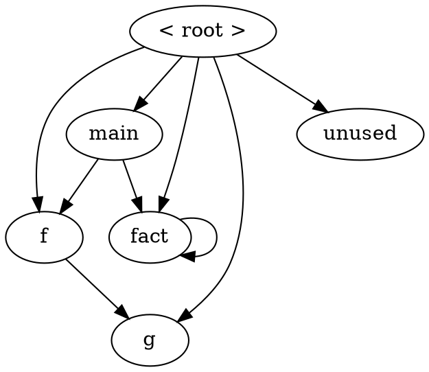

> [!note] `debug.ViewCallGraph`
> Part 1.6 showed how to capture the DOT file of `debug.ViewCallGraph` without opening a viewer. Its labels come from the same `DOTGraphTraits` that Section 8.9 warns about, and `p08_nodes --view` reproduces it.

### Verify

The root has one edge per function, whatever the shape of the graph. Count them in the recursion sample (`p09_recursion.cpp`, 14 functions):

```bash
build/bin/p08_nodes manifests/p09_recursion.cpp --with-root --edges | awk '/^node /{n++} /^edge <root> /{r++} END {print r " edges from <root>, " n-1 " functions"}'
```

### Expected

```text expected
14 edges from <root>, 14 functions
```

Both numbers agree (`n-1` because the `node <root>` line is not a function): the root reaches every node, whether or not another function calls it.

> [!hint]- Quiz: `g` is called by `f`, so why is it also listed under `< root >`?
> Read `getOrInsertNode`: when does a node get an edge from the root?

> [!success]- Answer
> Because the root gets an edge to *every* node the moment the node is created, with a null call expression. The root is an entry node for whole-graph traversals, not a "nobody calls this" marker. A function whose *only* caller is `< root >` is one that nobody in this translation unit calls, and the way to find those is to ignore the root's edges (Section 9.3 does).

### Common mistakes

| Mistake | Symptom |
|---------|---------|
| Treating the root's callees as the program's entry points or its externally visible functions | every function is "an entry point"; dead-code answers are empty |
| Iterating `for (auto &KV : CG)` and printing in that order | output changes from run to run (a `DenseMap` keyed by pointer); sort, or traverse from the root |
| Calling `CG.dump()` in a tool and piping stdout | nothing arrives: `dump()` writes to stderr; call `print(llvm::outs())` |
| Counting `CG.size()` as the number of functions | one too many: the root is a node |

### Exercises

1. Copy `manifests/p08_basic.cpp` to `out/ex_twice.cpp`, change `main` to `return f(1) + f(2) + fact(3);`, and run `build/bin/p08_nodes out/ex_twice.cpp --dump`. Which line changes, and what does it tell you about edges versus pairs of functions? (`p08_nodes out/ex_twice.cpp --edges --sites` shows the two call sites.)
2. Run `build/bin/p08_nodes manifests/p08_basic.cpp --dump --no-root` and decide which function is "dead" from the output alone. Is the answer the same as for `< root >`'s callee list?

---

## Section 8.2 — The container: `CallGraph`, `CallGraphNode`, `CallRecord` and canonical declarations

### Why

A dump is for reading; a tool needs the graph as data. Building one takes four lines, but the container has three details that decide whether your tool is correct (nodes are keyed by *canonical* declarations), reproducible (iteration order is a `DenseMap`'s) and honest about call sites (a record is a callee *and* an expression, but compares by callee only). This section is the API tour of the three classes.

### What to Do

**Sample files:** `manifests/p08_basic.cpp` for the API, `manifests/p09_recursion.cpp` for functions that are declared before they are defined, `manifests/p08_include.cpp` for two calls to one callee.

**Building the graph.** The graph is a visitor you *run* and a map you *query*. `CallGraph` derives from `DynamicRecursiveASTVisitor`, and `addToCallGraph(Decl*)` is just `TraverseDecl`, so you hand it the translation unit. The lab's helper in `tools/common/cglab.h`:

```cpp
inline std::unique_ptr<CallGraph> buildCallGraph(ASTContext &Ctx) {
  auto CG = std::make_unique<CallGraph>();
  CG->addToCallGraph(Ctx.getTranslationUnitDecl());
  return CG;
}
```

Where Part 2's tools used `runPerFunction`, the call-graph tools use `cglab::runPerTU(argc, argv, Cat, report)`: the graph belongs to the translation unit, so `report(ASTContext &, CallGraph &)` runs once per file, after the AST is complete (in `HandleTranslationUnit`). `CG.addToCallGraph(FD)` on a single function also works, and extends an existing graph (Section 8.4 builds one that way).

**The container.** Three classes, one ownership chain:

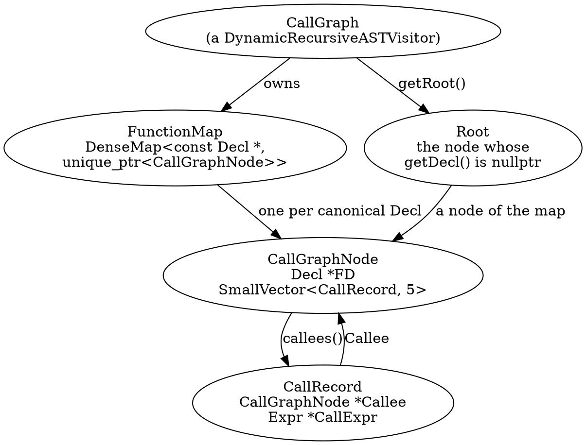

`CallGraph` is the container and the builder at once; the builder half is Section 8.4. The query half:

| API | What it gives you | Gotcha |
|-----|-------------------|--------|
| `CG.size()` | the number of nodes | includes the root: five functions give `size() == 6` |
| `CG.getRoot()` | the root node (`getDecl() == nullptr`) | has an edge to every node (Section 8.1) |
| `CG.getNode(D)` | the node of `D`, or null | looks `D` up **as given**: only the canonical declaration is a key |
| `CG.getOrInsertNode(D)` | the node, inserted if missing | canonicalises first (except Objective-C methods); this is what the builder calls |
| `for (auto &KV : CG)`, `begin()`, `end()` | `pair<const Decl *, unique_ptr<CallGraphNode>>` | `DenseMap` order: different on every run. Sort before printing. The root's key is `nullptr` |
| `CG.addToCallGraph(D)` | traverses `D` and adds what it finds | can be called many times, one declaration each (Section 8.4) |

| `CallGraphNode` API | What it gives you | Gotcha |
|---------------------|-------------------|--------|
| `getDecl()` | the declaration the node is keyed by | the canonical declaration, usually the bodiless first one; null for the root |
| `getDefinition()` | the declaration with the body | `getDecl()->getAsFunction()->getDefinition()`: only meaningful for a function node, since a block, an Objective-C method or the root has no `getAsFunction()` |
| `callees()`, `begin()`, `end()` | the `CallRecord`s, in call-site (AST) order | one record per call *expression* |
| `size()`, `empty()` | the number of records, whether there are none | `size()` counts call **sites**, not distinct callees |
| `addCallee(Rec)` | appends a record | what `CGBuilder` calls; nothing deduplicates |
| `print(os)`, `dump()` | the node's name; to a stream, to stderr | `printQualifiedName`: Section 8.3 |

| `CallRecord` | What it holds | Gotcha |
|--------------|---------------|--------|
| `Callee` | the callee's node | `CallRecord` converts implicitly to `CallGraphNode *`, which is what lets `GraphTraits` treat records as children |
| `CallExpr` | the call **site**: a `CallExpr`, `CXXMemberCallExpr`, `CXXOperatorCallExpr`, `CXXConstructExpr`, `CXXNewExpr` or `ObjCMessageExpr` | null on the root's edges; the field's type is `Expr *`, so the class has to be recovered with `dyn_cast` |
| `operator==` | compares the **callee only** | two sites calling the same function compare equal |
| `DenseMapInfo<CallRecord>` | hashes the callee only | a `DenseSet<CallRecord>` keeps one record per callee: the header's own note says so |

`p08_nodes --edges --sites --kinds` prints exactly these fields: the node kind, and for every edge the call site's line, the class of the call expression and the edge kind:

```bash
build/bin/p08_nodes manifests/p08_basic.cpp --edges --sites --kinds
```

```text expected
== p08_basic.cpp: 5 nodes, 4 edges
node f kind=def
node fact kind=def
node g kind=def
node main kind=def
node unused kind=def
edge f -> g @L3 CallExpr kind=call
edge fact -> fact @L6 CallExpr kind=call
edge main -> f @L11 CallExpr kind=call
edge main -> fact @L11 CallExpr kind=call
```

`@L3 CallExpr` is the `CallRecord::CallExpr` of the edge `f -> g`: line 3 of the file, and a plain `CallExpr`. On a node, `kind=` is the lab's classification (`def`, `decl`, `implicit`, `tpl`, `lambda`, `block`, `objc`; Sections 8.3 and 8.4 show them all); on an edge it is the kind of call (`call`, `ctor`, `new`, `objc`, `block`, `op`).

**One record per call site.** `twice<int>` in `p08_include.cpp` calls `helper` twice in one expression (`helper(t) + helper(t)`). The graph keeps both records, and they compare equal:

```bash
build/bin/p08_nodes manifests/p08_include.cpp --edges --sites --func='twice<int>' -- -std=c++17 -fblocks
```

```text expected
== p08_include.cpp: 37 nodes, 33 edges
node twice<int>
edge twice<int> -> helper @L20 CallExpr
edge twice<int> -> helper @L20 CallExpr
```

Two identical-looking lines: `node->size()` is 2 for a node with one distinct callee. The record's expression tells the two apart (they differ in column, which the JSON export of Section 8.9 prints), and that is the only thing that does: a tool that puts `CallRecord` in a `DenseSet`, or removes duplicates with `operator==`, counts one call where there are two.

**Looking a node up.** `getNode` does not canonicalise, which only matters when a function is declared before it is defined. `is_odd` in `p09_recursion.cpp` is: line 7 declares it, line 9 defines it. `--lookup` asks `getNode` about every declaration in the redeclaration chain, with and without canonicalising first (`cglab::lookupNode`):

```bash
build/bin/p08_nodes manifests/p09_recursion.cpp --lookup=is_odd
```

```text expected
lookup is_odd @L7 decl canonical getNode=found canonicalised=found
lookup is_odd @L9 def redecl getNode=null canonicalised=found
```

The call `is_odd(3)` in `main` comes after the definition, so the `FunctionDecl` the call expression refers to is the line-9 redeclaration: `getNode` returns null for it, although the node exists. The node's `getDefinition()` is that same line-9 declaration, the one with the body, while its `getDecl()` is the bodiless line-7 one. `getCanonicalDecl()` first, or `lookupNode`, always works.

> [!warning] `getNode` is the one lookup that does not canonicalise
> `CallGraph::getOrInsertNode(D)` replaces `D` by `D->getCanonicalDecl()` (except for Objective-C methods) before it touches the map, so the *builder* is always consistent. `getNode(D) const` is a plain `FunctionMap.find(D)`. A tool that takes a `FunctionDecl` from a call expression or from `FD->getDefinition()` and calls `getNode` on it gets null whenever that declaration is not the first one. For an Objective-C method the key is the method in the `@implementation`, whose canonical declaration is the `@interface` one, so `lookupNode` tries the implementation too.

### Verify

How common is the trap? Ask `--lookup` about every function of `p09_recursion.cpp` and count the answers. Predict first: which functions are declared before their definition (read the file), and how many declarations does the file have in all?

```bash
for f in $(build/bin/p08_nodes manifests/p09_recursion.cpp | awk '/^node /{print $2}'); do
  build/bin/p08_nodes manifests/p09_recursion.cpp --lookup=$f
done | awk '{ g[$6]++; c[$7]++ } END { for (k in g) print k, g[k]; for (k in c) print k, c[k] }' | sort
```

### Expected

```text expected
canonicalised=found 20
getNode=found 14
getNode=null 6
```

Fourteen functions have twenty declarations. `getNode` finds the node for the fourteen canonical ones and returns null for the six redeclarations (`is_odd`, `pong`, `pang`, `b`, `c` and `step`: each is declared first and defined later), while the canonicalised lookup finds all twenty.

> [!hint]- Quiz: why does `CG.getNode(FD)` return null for the definition of `is_odd`, although `is_odd` is a node?
> Which declaration is the key of the map, and which one did you pass?

> [!success]- Answer
> Nodes are keyed by the *canonical* declaration, the first one in the redeclaration chain (`int is_odd(int);` on line 7). The definition on line 9 is a later redeclaration, and `getNode` looks up the pointer it is given. Call `FD->getCanonicalDecl()` first (or `cglab::lookupNode`), as `getOrInsertNode` does internally.

### Common mistakes

| Mistake | Symptom |
|---------|---------|
| `CG.getNode(FD)` with the declaration from a call expression or from `getDefinition()` | null for any function declared before it is defined |
| Treating `CallRecord::CallExpr` as always non-null | crash on the root's edges (their expression is null) |
| Using the `==` of `CallRecord` to deduplicate call sites | two sites to the same callee collapse into one |
| Calling `getDefinition()` on every node | crash on the root (`getDecl()` is null) and on blocks and Objective-C methods (`getAsFunction()` is null) |
| Reading `CallGraphNode::size()` as "the number of callees" | it is the number of call sites |
| Printing a `Decl *` or `CallGraphNode *` anywhere | output differs on every run and cannot be checked by `doccheck.py` |

### Exercises

1. Predict, then run, `build/bin/p08_nodes manifests/p09_recursion.cpp --lookup=pong` and `--lookup=ping`. Which of the two prints a `getNode=null` line, and why?
2. `--sort=name` is the default. Compare `--sort=source` and `--sort=rpo` on `p08_basic.cpp`: which of them gives the order of the dump from Section 8.1 (without the root)?

---

## Section 8.3 — Names and identity: `printQualifiedName`, template arguments, lambdas, blocks, selectors and the USR

### Why

Every tool that prints, diffs, saves or merges a call graph needs a *name* for a node, and the one the library gives you is wrong for three kinds of node. A printed name is for reading; an identity is what two runs, two translation units and two tools agree on. This section separates the three names a node has, and shows which one to use for what.

### What to Do

**Sample files:** `manifests/p08_include.cpp` (compile with `-- -std=c++17 -fblocks`, since blocks are off in C++ by default) and `manifests/p08_objc.m` (`-- -x objective-c -fblocks -w`).

One node, three names:

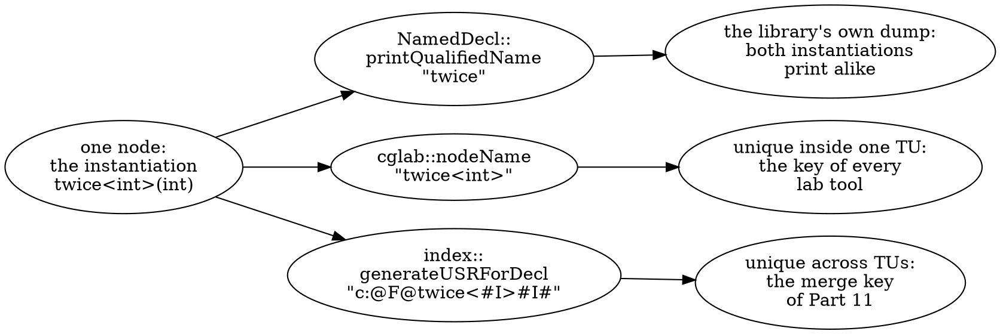

**The library's name.** `CallGraphNode::print` uses `NamedDecl::printQualifiedName`, which is fine for `Holder::Holder` and wrong for three kinds of node. In the library's own dump, from the sample whose whole point is to contain them:

```bash
build/bin/p08_nodes manifests/p08_include.cpp --dump -- -std=c++17 -fblocks | grep -E 'Function: (use_tpl|twice|two_lambdas|blk_now) calls'
```

```text expected
  Function: blk_now calls: < >
  Function: two_lambdas calls: two_lambdas()::(lambda)::operator() two_lambdas()::(lambda)::operator()
  Function: use_tpl calls: twice twice
  Function: twice calls: helper helper
  Function: twice calls: helper helper
```

- Both instantiations of `template <typename T> T twice(T)` print as `twice`: `printQualifiedName` drops the template arguments, so `use_tpl calls: twice twice` and there are two `Function: twice` lines.
- Both lambdas in `two_lambdas` print as `two_lambdas()::(lambda)::operator()`.
- A block has no name at all: `< >`.

**The lab's name.** The tools' naming rule, `cglab::nodeName`, makes the printed name identify the node inside one translation unit. It starts from `printQualifiedName` and repairs it, one rule per kind of node:

| Node | Rule | Example |
|------|------|---------|
| a function, a method | `NamedDecl::printQualifiedName` | `Holder::Holder` |
| a template instantiation | the arguments of `FunctionDecl::getTemplateSpecializationArgs()` are appended | `twice<int>` |
| a lambda's call operator | each closure type (`CXXRecordDecl::isLambda()`) in the enclosing declaration contexts gets the line it is written on | `two_lambdas()::(lambda@L59)::operator()` |
| a block | a `BlockDecl` has no name; the line of its caret | `<block@L70>` |
| an Objective-C method | class and selector (`ObjCMethodDecl::getSelector()`), colons kept | `Counter::bump:` |
| two nodes that still print alike | the parameter types, then `@L<line>`, then `#<k>` in source order | `S::m(int)`, `S::m(long)` |

```bash
build/bin/p08_nodes manifests/p08_include.cpp --kinds -- -std=c++17 -fblocks | grep -E 'twice|lambda|block'
```

```text expected
node <block@L66> kind=block
node <block@L70> kind=block
node twice<double> kind=tpl
node twice<int> kind=tpl
node two_lambdas kind=def
node two_lambdas()::(lambda@L59)::operator() kind=lambda
node two_lambdas()::(lambda@L60)::operator() kind=lambda
```

The last row of the table needs a sample with overloads, and the sample is short enough to write on the spot. The two `over` functions and the two `S::m` methods print alike, so the rule appends their parameter types; the USR (next paragraph) tells them apart on its own, with `#I#` for `int`, `#d#` for `double` and `#L#` for `long`:

```bash
mkdir -p out && cat > out/ex_overload.cpp <<'EOF'
int over(int x) { return x; }
int over(double x) { return (int)x; }
struct S { int m(int); int m(long); };
int S::m(int x) { return over(x); }
int S::m(long x) { return over((double)x); }
int main() { S s; return s.m(1) + s.m(2L); }
EOF
build/bin/p08_nodes out/ex_overload.cpp --edges --sites --usr
```

```text expected
== ex_overload.cpp: 6 nodes, 5 edges
node S::S usr=c:@S@S@F@S#
node S::m(int) usr=c:@S@S@F@m#I#
node S::m(long) usr=c:@S@S@F@m#L#
node main usr=c:@F@main#
node over(double) usr=c:@F@over#d#
node over(int) usr=c:@F@over#I#
edge S::m(int) -> over(int) @L4 CallExpr
edge S::m(long) -> over(double) @L5 CallExpr
edge main -> S::S @L6 CXXConstructExpr
edge main -> S::m(int) @L6 CXXMemberCallExpr
edge main -> S::m(long) @L6 CXXMemberCallExpr
```

The signature is added only where it is needed: `main` and `S::S` keep their plain names.

**Stable identity: the USR.** Names are only unique inside one translation unit. For a key that survives across files (Part 11) the tools use the **USR**, `clang::index::generateUSRForDecl`, which `--usr` prints:

```bash
build/bin/p08_nodes manifests/p08_include.cpp --usr -- -std=c++17 -fblocks | grep -E 'twice|file_local|lambda|block'
```

```text expected
node <block@L66> usr=-
node <block@L70> usr=-
node file_local usr=c:p08_include.cpp@F@file_local#
node twice<double> usr=c:@F@twice<#d>#d#
node twice<int> usr=c:@F@twice<#I>#I#
node two_lambdas usr=c:@F@two_lambdas#
node two_lambdas()::(lambda@L59)::operator() usr=c:p08_include.cpp@2099@F@two_lambdas#@Sa@F@operator()#I#1
node two_lambdas()::(lambda@L60)::operator() usr=c:p08_include.cpp@2141@F@two_lambdas#@Sa@F@operator()#I#1
```

A USR encodes name, scope and signature (`twice<#I>#I#` is `twice<int>(int)`). A `static` function is prefixed with its file (`c:p08_include.cpp@F@file_local#`), so two `static void local()` in different files get different USRs (Exercise 2). A lambda is an anonymous class, so its USR carries the file and a **byte offset** (`@2099` and `@2141`): stable for one file, and different after you edit above it. A block has **no USR** (`usr=-`): it must be keyed by its position. An Objective-C method's USR is its class and selector:

```bash
build/bin/p08_nodes manifests/p08_objc.m --usr -- -x objective-c -fblocks -w | grep Counter
```

```text expected
node Counter::bump: usr=c:objc(cs)Counter(im)bump:
```

### Verify

Count what each name can tell apart in `p08_include.cpp`. Predict first: how many of the 37 nodes can the library's printed name not tell apart from another, and how many have no USR?

```bash
f="-- -std=c++17 -fblocks"
lib=$(build/bin/p08_nodes manifests/p08_include.cpp --dump $f | sed -n 's/^  Function: \(.*\) calls:.*/\1/p')
echo "library: $(echo "$lib" | sort -u | awk 'END{print NR}') distinct names for $(echo "$lib" | awk 'END{print NR}') entries"
echo "lab:     $(build/bin/p08_nodes manifests/p08_include.cpp --usr $f | awk '/^node /{print $2}' | sort -u | awk 'END{print NR}') distinct names for $(build/bin/p08_nodes manifests/p08_include.cpp $f | head -1 | sed -E 's/.*: ([0-9]+) nodes.*/\1/') nodes"
echo "USR:     $(build/bin/p08_nodes manifests/p08_include.cpp --usr $f | awk '/^node / && $NF != "usr=-" {print $NF}' | sort -u | awk 'END{print NR}') distinct USRs, $(build/bin/p08_nodes manifests/p08_include.cpp --usr $f | grep -c 'usr=-$') nodes without one"
```

### Expected

```text expected
library: 35 distinct names for 38 entries
lab:     37 distinct names for 37 nodes
USR:     35 distinct USRs, 2 nodes without one
```

The library's dump has 38 entries (37 functions and the root) but only 35 distinct names: the two `twice` instantiations, the two lambdas and the two blocks each collapse into one. The lab's names are all distinct, and so are the 35 USRs of the nodes that have one; the two blocks have none.

> [!hint]- Quiz: two files each define `static void local()`. Do their nodes have the same printed name? The same USR?
> Look at the USR of `file_local` above, and at what comes between `c:` and `@F`.

> [!success]- Answer
> Same printed name (`local`), different USRs: a `static` function has internal linkage, so the USR starts with the file name (`c:ex_a.cpp@F@local#`, `c:ex_b.cpp@F@local#`; Exercise 2 runs it). Merging two translation units by printed name would join two unrelated functions; merging by USR keeps them apart. An extern function has the same USR in both files, which is what makes it one node after the merge.

### Common mistakes

| Mistake | Symptom |
|---------|---------|
| Using `printQualifiedName` as an identity | two template instantiations, two lambdas or two overloads merge into one "node" in your own map |
| Keying a map by the printed name across translation units | two `static` functions with one name join; one extern function appears twice if it prints differently |
| Expecting a USR for a block | it is empty (`usr=-`); key blocks by their position |
| Storing the USR of a lambda and expecting it to survive an edit | it contains a byte offset into the file |
| Printing a `Decl *` as the name | differs on every run and cannot be checked by `doccheck.py` |

### Exercises

1. Run `build/bin/p08_nodes manifests/p08_include.cpp --dump -- -std=c++17 -fblocks | grep 'Function: twice'`, then `build/bin/p08_nodes manifests/p08_include.cpp -- -std=c++17 -fblocks | grep twice`. Why does the library dump print two identical `Function: twice` lines, and how do the lab's names tell the two instantiations apart?
2. Write `static void local() {}` and a caller into `out/ex_a.cpp` and `out/ex_b.cpp` (a function `a()` and a function `b()`), and run `build/bin/p08_nodes out/ex_a.cpp --usr | grep local` on each. Compare the two USRs.

---

## Section 8.4 — The builder: a `DynamicRecursiveASTVisitor` with two doors, four flags and an incremental `addToCallGraph`

### Why

Until now the graph was a finished object. It is also a visitor you can configure, subclass and feed one declaration at a time, and what it contains is the result of three decisions made in `CallGraph.h` and `CallGraph.cpp`: which declarations the visitor reaches, which of them become nodes, and which statements it looks at. When a graph is missing a node or an edge you did not expect to lose, the fix is in one of those three places.

### What to Do

**Sample files:** `manifests/p08_include.cpp` (compile with `-- -std=c++17 -fblocks`), and `manifests/p09_recursion.cpp` for building one declaration at a time. The tool is `p08_build`: it builds the graph itself, so that flags can be set before the traversal.

**The visitor.** `CallGraph` derives from `DynamicRecursiveASTVisitor`. `addToCallGraph(D)` is `TraverseDecl(D)`, which walks namespaces, classes and functions, and calls `VisitFunctionDecl` for each function it meets. `CallGraph` overrides that and two other members (`clang/Analysis/CallGraph.h`):

```cpp
  bool VisitFunctionDecl(FunctionDecl *FD) override {
    // We skip function template definitions, as their semantics is
    // only determined when they are instantiated.
    if (includeInGraph(FD) && FD->isThisDeclarationADefinition()) {
      // Add all blocks declared inside this function to the graph.
      addNodesForBlocks(FD);
      // If this function has external linkage, anything could call it.
      // Note, we are not precise here. For example, the function could have
      // its address taken.
      addNodeForDecl(FD, FD->isGlobal());
    }
    return true;
  }

  // We are only collecting the declarations, so do not step into the bodies.
  bool TraverseStmt(Stmt *S) override { return true; }
```

`VisitObjCMethodDecl` is the same for Objective-C methods. The visitor therefore never looks inside a body: `TraverseStmt` is overridden to do nothing, and every edge comes from `CGBuilder`, a separate `StmtVisitor` that `addNodeForDecl` runs over each body (`clang/lib/Analysis/CallGraph.cpp`, an assertion and a comment dropped):

```cpp
void CallGraph::addNodeForDecl(Decl* D, bool IsGlobal) {
  CallGraphNode *Node = getOrInsertNode(D);

  // Process all the calls by this function as well.
  CGBuilder builder(this, Node);
  if (Stmt *Body = D->getBody())
    builder.Visit(Body);

  // Include C++ constructor member initializers.
  if (auto constructor = dyn_cast<CXXConstructorDecl>(D)) {
    for (CXXCtorInitializer *init : constructor->inits()) {
      builder.Visit(init->getInit());
    }
  }
}
```

> [!note] `IsGlobal` is never read
> `addNodeForDecl` takes a second parameter, and nothing in its body uses it. The comment in `VisitFunctionDecl` ("if this function has external linkage, anything could call it") and the one on `getRoot()` ("all the functions available externally are represented as callees") describe a root that follows linkage. The code does not: `getOrInsertNode` connects every node to the root (Section 8.1), and a function's linkage has no effect on its node.

**Two doors.** A function becomes a node in one of two ways, and each has its own rule:

```cpp
bool CallGraph::includeInGraph(const Decl *D) {
  if (!D->hasBody())
    return false;
  return includeCalleeInGraph(D);
}

bool CallGraph::includeCalleeInGraph(const Decl *D) {
  if (const FunctionDecl *FD = dyn_cast<FunctionDecl>(D)) {
    if (FD->isDependentContext())
      return false;
    IdentifierInfo *II = FD->getIdentifier();
    if (II && II->getName().starts_with("__inline"))
      return false;
  }
  return true;
}
```

`VisitFunctionDecl` is the first door: a declaration that `includeInGraph` accepts *and* that is a definition gets a node, and its body is walked for calls. The second door is `CGBuilder::addCalledDecl`: every callee the builder finds is checked with `includeCalleeInGraph` only, so a function **without a body** becomes a node too, as a callee, with no callees of its own. Template patterns (`isDependentContext()`) and identifiers that start with `__inline` are refused by both doors.

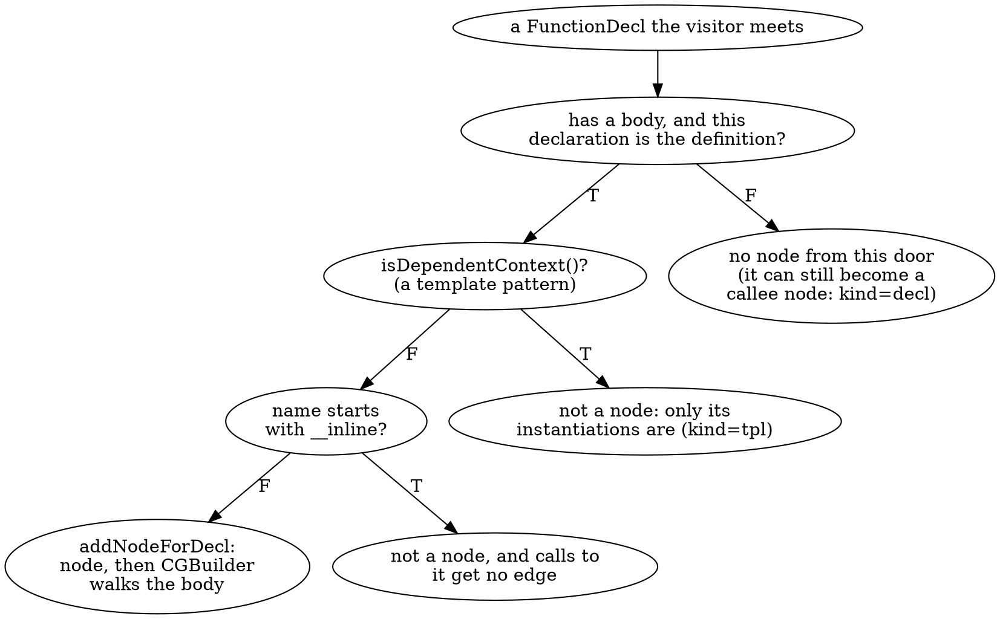

`p08_build` records which door each node came through. The library keeps no record of it, so the tool's graph is a small subclass of `CallGraph` that hooks the virtual `VisitFunctionDecl` and remembers the declarations that reached `addNodeForDecl`:

```cpp
struct DoorGraph : CallGraph {
  std::set<const Decl *> DefDoor;

  bool VisitFunctionDecl(FunctionDecl *FD) override {
    if (includeInGraph(FD) && FD->isThisDeclarationADefinition()) DefDoor.insert(FD->getCanonicalDecl());
    return CallGraph::VisitFunctionDecl(FD);
  }
  // ... the same for VisitObjCMethodDecl
};
```

`--doors` adds `door=def`, `door=callee` or `door=block` to every node. Print the ones that did not come through the definition door:

```bash
build/bin/p08_build manifests/p08_include.cpp --doors -- -std=c++17 -fblocks | grep -v 'door=def'
```

```text expected
flags implicit=1 instantiations=1 typelocs=0 lambda-body=1
== p08_include.cpp: 37 nodes, 33 edges
node <block@L66> door=block
node <block@L70> door=block
node declared_only door=callee
node fail door=callee
node "operator new" door=callee
```

The first line is the visitor's flags (below). Of the 37 nodes, 32 came through the definition door, the lambdas' call operators and the implicit members among them. The two blocks (`door=block`) are added by `addNodesForBlocks`, which `VisitFunctionDecl` calls first. And three nodes exist only because somebody calls them: `declared_only` and `fail` have no body anywhere, and `"operator new"` is the compiler's implicit allocation function, which a `new` expression calls and nobody defines.

**The flags.** `DynamicRecursiveASTVisitor` has four public data members that decide what the traversal of the *declarations* reaches (`clang/AST/DynamicRecursiveASTVisitor.h`). The `CallGraph` constructor sets three of them:

| Data member | Default in the visitor | After `CallGraph()` | `p08_build` | What it controls |
|-------------|------------------------|---------------------|-------------|------------------|
| `ShouldVisitTemplateInstantiations` | `false` | `true` | `--instantiations=0\|1` | whether the visitor enters instantiations such as `twice<int>`, and so walks their bodies |
| `ShouldVisitImplicitCode` | `false` | `true` | `--implicit=0\|1` | whether implicit constructors, destructors and assignment operators are visited |
| `ShouldWalkTypesOfTypeLocs` | `true` | `false` | `--typelocs=0\|1` | whether the visitor descends into types |
| `ShouldVisitLambdaBody` | `true` | `true` (not set) | `--lambda-body=0\|1` | whether the visitor descends into a lambda's body |

They are data members, so you assign them after construction and before `addToCallGraph`: `p08_build` does exactly that, and its first output line says what was in force.

> [!warning] The visitor flags are variables, not `shouldVisit...()` overrides
> Older tutorials (and the CRTP `RecursiveASTVisitor`) control the traversal by overriding `shouldVisitTemplateInstantiations()` and friends. In Clang 22, `DynamicRecursiveASTVisitor.h` says it plainly: "Instead of functions (e.g. `shouldVisitImplicitCode()`), this class uses member variables (e.g. `ShouldVisitImplicitCode`) to control visitation behaviour." You assign them in your constructor, exactly as `CallGraph::CallGraph()` does; code written for the old API either fails to compile (an `override` of a function that no longer exists) or silently does nothing (a plain method that nobody calls).

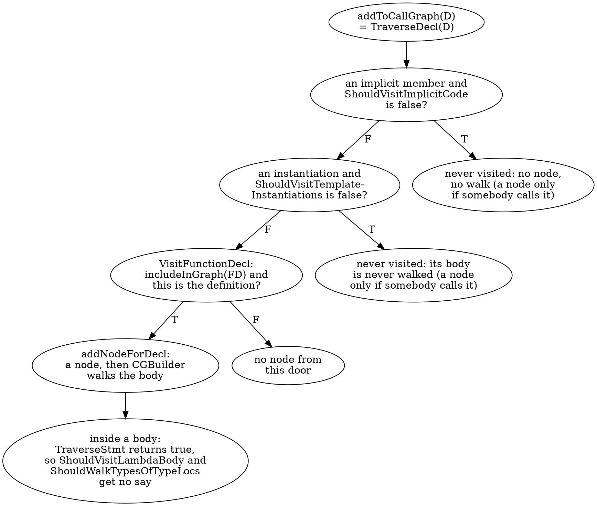

Switch the flags one at a time. **Implicit code first.** With `--implicit=0` the visitor skips the members the compiler wrote. A skipped member loses its node unless something calls it, and loses its body's edges either way:

```bash
build/bin/p08_build manifests/p08_include.cpp --implicit=0 --doors --edges -- -std=c++17 -fblocks | grep -E '^(flags|diff)|Base::Base|Derived::|Member::'
```

```text expected
flags implicit=0 instantiations=1 typelocs=0 lambda-body=1
node Derived::Derived door=callee
node Derived::run door=def
node Member::Member door=callee
edge Derived::run -> helper
edge use_derived -> Derived::Derived
edge use_derived -> Derived::run
edge use_member -> Member::Member
diff: nodes 37 -> 35 (-Base::Base -Derived::~Derived) edges 33 -> 31
```

`Base::Base` and `Derived::~Derived` are gone: nobody calls them and nothing else reaches them. `Derived::Derived` and `Member::Member` survive but changed door (`door=callee`): `use_derived` and `use_member` call them, so they enter as callees, and their bodies are not walked, which is what the two lost edges are (`Derived::Derived -> Base::Base` and `Member::Member -> helper`, the default member initialiser of Section 8.5). The `diff:` line compares with the graph the library's own flags build from the same file.

**Template instantiations.** With `--instantiations=0` the instantiations are not visited, so their bodies are not walked:

```bash
build/bin/p08_build manifests/p08_include.cpp --instantiations=0 --doors --edges -- -std=c++17 -fblocks | grep -E '^(flags|diff)|twice|use_tpl'
```

```text expected
flags implicit=1 instantiations=0 typelocs=0 lambda-body=1
node twice<double> door=callee
node twice<int> door=callee
node use_tpl door=def
edge use_tpl -> twice<double>
edge use_tpl -> twice<int>
diff: nodes 37 -> 37 edges 33 -> 29
```

The node count does not move (37 to 37) but the edge count falls by four. `twice<int>` and `twice<double>` are still nodes: `use_tpl` calls them, and a callee needs only the second door. They are now `door=callee`, and the two `helper` calls in each body (four edges) are gone. The flag removes **edges**, not nodes.

**The two flags that change nothing.** `ShouldWalkTypesOfTypeLocs` and `ShouldVisitLambdaBody` would matter to a visitor that traverses statements. This one does not (`TraverseStmt` returns `true`), and `CGBuilder` enters a lambda by hand (`VisitLambdaExpr` calls `VisitFunctionDecl` on its call operator), so neither flag has anything to decide:

```bash
build/bin/p08_build manifests/p08_include.cpp --typelocs=1 --lambda-body=0 -- -std=c++17 -fblocks | grep -E '^(flags|==|diff)'
```

```text expected
flags implicit=1 instantiations=1 typelocs=1 lambda-body=0
== p08_include.cpp: 37 nodes, 33 edges
diff: nodes 37 -> 37 edges 33 -> 33
```

Both flags differ from the library's, so `diff:` is printed, and it says the graph is the same (37 nodes and 33 edges before and after).

**One declaration at a time.** `addToCallGraph` does not need the whole translation unit. Each call traverses one declaration and adds what it finds to the graph you already have, so a tool can build the graph as declarations arrive. The Static Analyzer does: `AnalysisConsumer::HandleDeclsCallGraph` loops over the top-level declarations it collected and calls `CG.addToCallGraph(LocalTUDecls[i])` for each. `--incremental` feeds the definitions of the main file to `addToCallGraph(FD)` one by one in source order, and prints the graph's `size()` (the root counts) and the nodes that appeared after each:

```bash
build/bin/p08_build manifests/p09_recursion.cpp --incremental | grep '^after'
```

```text expected
after fact: size=2 new: fact
after is_even: size=4 new: is_even is_odd
after is_odd: size=4 new: -
after ping: size=6 new: ping pong
after pong: size=7 new: pang
after pang: size=7 new: -
after a: size=9 new: a b
after b: size=10 new: c
after c: size=10 new: -
after step: size=11 new: step
after Shape::area: size=12 new: Shape::area
after measure: size=13 new: measure
after Grid::area: size=14 new: Grid::area
after main: size=15 new: main
```

A callee that is not defined yet becomes a node at once. `is_even` calls `is_odd`, which comes later in the file, so `after is_even` already lists `is_odd` (`size=4`: the root, `fact`, `is_even`, `is_odd`). When `is_odd` itself is added, nothing is new (`new: -`): the existing node gets its callees. The same happens for `ping`/`pong`/`pang` and `a`/`b`/`c`. The forward references only change *when* a node appears: the final size is 15, the fourteen functions and the root.

### Verify

`--incremental` feeds only the functions the source spells: no implicit members, no template patterns, no instantiations. Predict which flag settings give the same graph, then compare the node and edge lines:

```bash
f="-- -std=c++17 -fblocks"
diff <(build/bin/p08_build manifests/p08_include.cpp --incremental --edges $f | grep -E '^(node|edge)') \
     <(build/bin/p08_build manifests/p08_include.cpp --implicit=0 --instantiations=0 --edges $f | grep -E '^(node|edge)') && echo identical
```

### Expected

```text expected
identical
```

Feeding the definitions by hand is the same as turning off implicit code and template instantiations in the visitor: both leave out `Base::Base` and `Derived::~Derived`, give `Derived::Derived`, `Member::Member`, `twice<int>` and `twice<double>` the callee door and no callees (35 nodes, 27 edges). Whether a function enters the graph depends on which declarations the visitor is *shown*.

> [!hint]- Quiz: with `ShouldVisitTemplateInstantiations = false`, why does `twice<int>` still exist, and why does `use_tpl -> twice<int>` survive while `twice<int> -> helper` vanishes?
> Which door does each of the three need, and which function's body does `CGBuilder` walk?

> [!success]- Answer
> `use_tpl` is a definition the visitor reaches, so `CGBuilder` walks its body and finds the call `twice(1)`. The direct callee is the instantiation `twice<int>`, which passes `includeCalleeInGraph` (it is not a dependent context), so `getOrInsertNode` creates its node through the callee door and the edge is recorded. `twice<int>`'s own body would be walked only if the visitor reached the instantiation through `VisitFunctionDecl`, which `ShouldVisitTemplateInstantiations = false` prevents. A node can exist without its body ever being looked at.

### Common mistakes

| Mistake | Symptom |
|---------|---------|
| Overriding `shouldVisitImplicitCode()` like the old `RecursiveASTVisitor` | an `override` error, or a method that nothing calls |
| Setting a flag after `addToCallGraph` | too late: the traversal is done, the graph does not change |
| Expecting `--instantiations=0` to remove the instantiations from the graph | they stay (callee door); only their edges go |
| Expecting `ShouldVisitLambdaBody = false` to hide lambda calls | nothing changes: statements are never traversed, and `CGBuilder` enters lambdas itself |
| Building from a list of definitions and expecting implicit members or instantiation bodies | they are not definitions the source spells, so they are not fed |
| Treating `FD->isGlobal()` or linkage as something the builder uses | `addNodeForDecl` never reads `IsGlobal` |

### Exercises

1. Run `build/bin/p08_build manifests/p08_include.cpp --incremental -- -std=c++17 -fblocks | grep '^after'`. Which step adds nothing, and why does the definition it feeds not become a node? Which step introduces `twice<int>` and `twice<double>`, and why that one?
2. Run `build/bin/p08_build manifests/p08_objc.m --doors -- -x objective-c -fblocks -w`. Which doors appear? There is no `door=callee` node although `send` messages `Counter::external:`: why not (Section 8.5)?

---

## Section 8.5 — What `CGBuilder` records: calls, constructors, `new`, initialisers, default arguments, lambdas and blocks

### Why

Nodes are half the graph. The edges come from `CGBuilder`, a `StmtVisitor` that walks each body, and it is narrower than "every call" and wider than "every call expression": it records `new` and constructors, it charges a default argument to the caller that uses it, and it visits constructor initialisers that the default CFG leaves out. To predict an edge you need its rules, and this section lists them, one sample function each.

### What to Do

**Sample file:** `manifests/p08_include.cpp` — one function per rule, with a comment above each. Compile with `-- -std=c++17 -fblocks`.

`CGBuilder` lives in an anonymous namespace in `CallGraph.cpp`, so you cannot reuse or extend it (Section 8.8 writes a replacement). It has a handful of `Visit` members, and `VisitStmt` descends into every child, so a call that is an argument of another call is found too:

| `CGBuilder` member | What it records | Sample function |
|--------------------|-----------------|-----------------|
| `VisitCallExpr` | an edge when `getDirectCallee()` is a function, or when the callee is a block literal (`BlockExpr`); this covers member calls (`CXXMemberCallExpr`) and `operator()` (`CXXOperatorCallExpr`) | `use_derived`, `two_lambdas`, `blk_now` |
| `VisitCXXNewExpr` | an edge to `getOperatorNew()` | `with_new` |
| `VisitCXXConstructExpr` | an edge to the constructor, but only one that has a definition (`Ctor->getDefinition()`) | `with_obj`, `use_derived` |
| `VisitCXXDefaultArgExpr`, `VisitCXXDefaultInitExpr` | visit the default's expression **here**, at the use | `use_default`, `Member::Member` |
| `VisitLambdaExpr` | no edge: it adds the closure's call operator as a node, through `VisitFunctionDecl` | `two_lambdas` |
| `VisitObjCMessageExpr` | an edge to the method **definition** found in this translation unit (`lookupPrivateMethod`), if there is one | `send` in `p08_objc.m` |
| `addNodeForDecl` (not a `Visit`) | the initialisers of a constructor, `constructor->inits()` | `Holder::Holder` |

There is no `VisitCXXDeleteExpr`, no member for `CXXInheritedCtorInitExpr`, and nothing for a destructor: Section 8.6 and Section 8.8 come back to them.

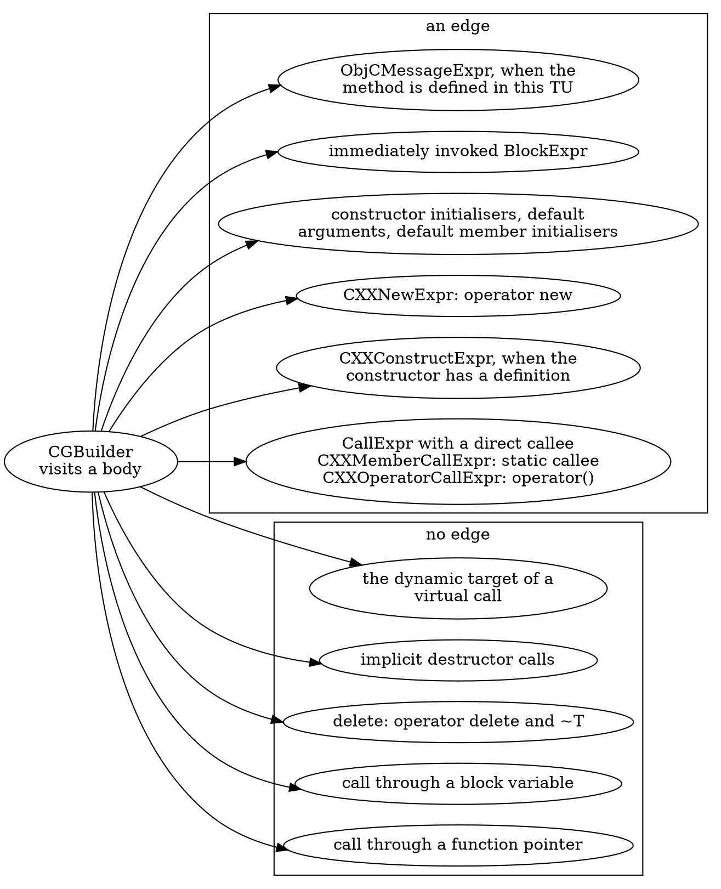

**Constructors, `new` and `delete`.** `with_obj` constructs a `Holder` (an edge to `Holder::Holder`) and destroys it at the closing brace (no edge to `Holder::~Holder`); `with_new` has an edge to `operator new` and to the constructor, and its `delete p` adds nothing at all; `use_derived` calls the implicit constructor and a method:

```bash
for f in with_obj with_new use_derived; do
  build/bin/p08_nodes manifests/p08_include.cpp --edges --sites --func=$f -- -std=c++17 -fblocks | sed 1d
done
```

```text expected
node with_obj
edge with_obj -> Holder::Holder @L47 CXXConstructExpr
node with_new
edge with_new -> Holder::Holder @L49 CXXConstructExpr
edge with_new -> "operator new" @L49 CXXNewExpr
node use_derived
edge use_derived -> Derived::Derived @L35 CXXConstructExpr
edge use_derived -> Derived::run @L35 CXXMemberCallExpr
```

The class after the line is the expression the edge came from: `CXXConstructExpr`, `CXXNewExpr`, `CXXMemberCallExpr`. `new Holder` gives two edges at one line, one per expression, because the allocation and the construction are two calls.

**Defaults are charged to the user.** The body of a default argument or of a default member initialiser is not evaluated at its declaration but at every place that uses the default, and the AST says so: a use of the default holds a `CXXDefaultArgExpr` that wraps the expression. `CGBuilder` visits it there, so the edge starts at the user: `use_default` calls `leaf` on line 52 (where `dflt`'s default argument is written) although the call `dflt()` is on line 53. `Member::Member`, the implicit constructor, owns the call in `int m = helper(3);`. And the **constructor initialisers** `Holder() : v(leaf(1))` are visited by `addNodeForDecl` (`constructor->inits()`), so `Holder::Holder` has an edge to `leaf`. The graph is more complete here than the CFG is by default (Section 10.1):

```bash
for f in use_default use_member Member::Member Holder::Holder; do
  build/bin/p08_nodes manifests/p08_include.cpp --edges --sites --func=$f -- -std=c++17 -fblocks | sed 1d
done
```

```text expected
node use_default
edge use_default -> dflt @L53 CallExpr
edge use_default -> leaf @L52 CallExpr
node use_member
edge use_member -> Member::Member @L55 CXXConstructExpr
node Member::Member
edge Member::Member -> helper @L54 CallExpr
node Holder::Holder
edge Holder::Holder -> leaf @L42 CallExpr
```

Two consequences. `dflt` itself has no callee (its default argument is not one of its calls), and a function that uses the default twice has two edges, one per use (Exercise 2).

**Lambdas, blocks, pointers and virtual calls.** A lambda is called through `operator()`, so `two_lambdas` has an edge (`CXXOperatorCallExpr`) to each closure's node. A block literal that is called *immediately* is an edge to a block node (`blk_now`); a block stored in a variable and called later is not (`blk_var`: the callee is the variable). A function pointer has no callee the AST can name (`indirect`). A virtual call has one: the method that name lookup finds in the object's static type (`dispatch` calls `Base::run`, never `Derived::run`):

```bash
for f in two_lambdas blk_now blk_var indirect dispatch; do
  build/bin/p08_nodes manifests/p08_include.cpp --edges --sites --func=$f -- -std=c++17 -fblocks | sed 1d
done
```

```text expected
node two_lambdas
edge two_lambdas -> two_lambdas()::(lambda@L59)::operator() @L61 CXXOperatorCallExpr
edge two_lambdas -> two_lambdas()::(lambda@L60)::operator() @L61 CXXOperatorCallExpr
node blk_now
edge blk_now -> <block@L70> @L70 CallExpr
node blk_var
node indirect
node dispatch
edge dispatch -> Base::run @L38 CXXMemberCallExpr
```

`blk_var` and `indirect` print a node line and no edges: the three recorded calls are the lambdas', the block's and the static `Base::run`. What the graph leaves out is the next section.

### Verify

Which classes of expression did the library turn into edges in this sample? The last field of an `--sites` edge line is the expression class. Predict the set before you run it: there are 33 edges, and the file contains a `delete`, a block variable, a pointer call and a default argument.

```bash
build/bin/p08_nodes manifests/p08_include.cpp --edges --sites -- -std=c++17 -fblocks | awk '/^edge /{c[$NF]++} END {for (k in c) print c[k], k}' | sort -k2
```

### Expected

```text expected
23 CallExpr
5 CXXConstructExpr
2 CXXMemberCallExpr
1 CXXNewExpr
2 CXXOperatorCallExpr
```

Five classes make 33 edges. There is no `CXXDeleteExpr`, no `CXXDefaultArgExpr` (the default was visited in place of the node) and no class for a call through a pointer or a block variable. An immediately invoked block (`blk_now`) is a plain `CallExpr` whose callee is a `BlockExpr`.

> [!hint]- Quiz: where is the edge for `int m = helper(3);` in `struct Member { int m = helper(3); };`, and why there?
> `Member` declares no constructor. What does the AST put the initialiser into?

> [!success]- Answer
> On `Member::Member -> helper`, the implicit constructor. A default member initialiser is evaluated by every constructor that does not initialise the member itself, so the compiler wires it into the constructor's initialiser list as a `CXXDefaultInitExpr`; `addNodeForDecl` visits the constructor's `inits()`, and `VisitCXXDefaultInitExpr` visits the wrapped expression. `use_member` only constructs a `Member`, so its own edge is `use_member -> Member::Member`.

### Common mistakes

| Mistake | Symptom |
|---------|---------|
| Looking for an edge at the line of the call to a function whose default argument calls something | the edge is at the line where the default is *written*, from the caller that uses it |
| Expecting one edge per callee | one per call expression: `new` is two (allocation and construction), a default used twice is two |
| Expecting an edge to a constructor declared elsewhere | `VisitCXXConstructExpr` records only constructors that have a definition |
| Expecting the call graph to miss constructor initialisers because the default CFG does | the graph visits `inits()`; the default CFG needs `AddInitializers` |
| Expecting `Derived::run` under `dispatch` | a virtual call has the static callee only (Section 8.6; Part 11 adds the rest) |
| Compiling `p08_include.cpp` without `-fblocks` | the two blocks are a parse error, not nodes |

### Exercises

1. Copy `manifests/p08_include.cpp` to `out/ex_dflt.cpp` with `sed 's/int dflt(int x = leaf(2))/int dflt(int x = helper(2))/' manifests/p08_include.cpp > out/ex_dflt.cpp`. Predict the edges of `use_default`, then check with `build/bin/p08_nodes out/ex_dflt.cpp --edges --sites --func=use_default -- -std=c++17 -fblocks`.
2. Make `use_default` call `dflt()` twice (`sed 's/int use_default() { return dflt(); }/int use_default() { return dflt() + dflt(); }/' manifests/p08_include.cpp > out/ex_dflt2.cpp`). How many edges to `leaf` does it get, and at which line?

---

## Section 8.6 — What stays out: function pointers, block variables, `delete`, implicit destructors, virtual targets and Objective-C's rule

### Why

The call graph is **unsound by design**: it records what the AST states syntactically with a direct callee, and everything else is missing. Reachability, recursion detection and summaries are all computed on it, so before using it you need the list of what it leaves out, and a way to tell a function that calls nothing from a function whose calls the graph cannot see.

### What to Do

**Sample files:** `manifests/p08_include.cpp` (compile with `-- -std=c++17 -fblocks`) and `manifests/p08_objc.m` (`-- -x objective-c -fblocks -w`).

Section 8.5 listed what `CGBuilder` records. Everything else is a hole, and each hole has a reason in the code:

| Hole | Why there is no edge | Sample function | Who can see it |
|------|----------------------|-----------------|----------------|
| a call through a function pointer | `getDirectCallee()` is null, and the callee is not a block literal | `indirect` | Part 11 matches the pointer's type against the address-taken functions |
| a call through a block *variable* | only a block **literal** as callee is handled | `blk_var` | nothing in the lab resolves it; Section 8.8 records it as a call to `?` |
| the dynamic target of a virtual call | `getDirectCallee()` is the method that lookup finds in the static type | `dispatch` (`Base::run`, never `Derived::run`) | Part 11: devirtualisation, class-hierarchy analysis |
| `delete p` | there is no `VisitCXXDeleteExpr`: neither `operator delete` nor `~T` | `with_new` | the CFG (Section 10.1), `AnyCall`'s `Deallocator` (Section 8.7), your own visitor (Section 8.8) |
| implicit destructor calls | scope exit and temporaries are not expressions | `with_obj` | the CFG's implicit-destructor elements (Section 10.1) |
| a callee whose name starts with `__inline` | `includeCalleeInGraph` refuses it | `uses_inline_helper` | your own visitor (Section 8.8) |
| calls inside a template *pattern* | a dependent context is refused by both doors; only instantiations are walked | `twice` | the instantiations carry the same calls; Section 8.8 and Section 11.4 record the pattern |
| an Objective-C message to a method not defined here | `lookupPrivateMethod` needs an implementation in this translation unit | `send` in `p08_objc.m` | |

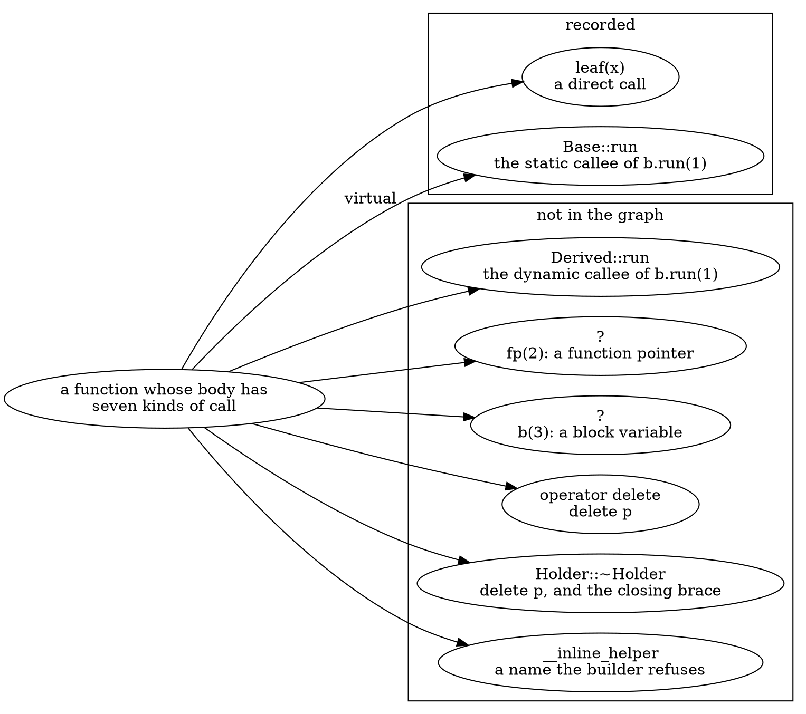

**The `__inline` rule** is the one that is easiest to miss. `uses_inline_helper` calls `__inline_helper`, and the graph has neither the node nor the edge:

```bash
build/bin/p08_nodes manifests/p08_include.cpp --edges --func=uses_inline_helper -- -std=c++17 -fblocks
build/bin/p08_nodes manifests/p08_include.cpp -- -std=c++17 -fblocks | grep -c '__inline'
```

```text expected
== p08_include.cpp: 37 nodes, 33 edges
node uses_inline_helper
0
```

Neither door lets such a function in, so the helper is invisible and so is every call to it, including the calls it makes itself (Exercise 1). If your code base has functions with this prefix, they are a hole.

**Objective-C.** A message send is an edge only when the receiver's interface has the method *defined* in this translation unit (`lookupPrivateMethod`); a block literal is a block node as in C++, and a block variable is as invisible as in C++:

```bash
build/bin/p08_nodes manifests/p08_objc.m --edges --kinds -- -x objective-c -fblocks -w
```

```text expected
== p08_objc.m: 7 nodes, 5 edges
node <block@L18> kind=block
node <block@L22> kind=block
node Counter::bump: kind=objc
node immediate kind=def
node leaf kind=def
node send kind=def
node via_var kind=def
edge <block@L18> -> leaf kind=call
edge <block@L22> -> leaf kind=call
edge Counter::bump: -> leaf kind=call
edge immediate -> <block@L18> kind=block
edge send -> Counter::bump: kind=objc
```

`send -> Counter::bump:` is there; `[c external:2]` is not, because `external:` is only declared. `immediate` calls its block (`<block@L18>`), `via_var` does not. `AnyCall` (Section 8.7) sees both messages: the graph is the narrower of the two.

### Verify

Which functions have no outgoing edge although their body contains a call? Predict first. The command prints every plain definition (`kind=def`) that has no callee:

```bash
build/bin/p08_nodes manifests/p08_include.cpp --kinds --edges -- -std=c++17 -fblocks \
  | awk '/^node /{ if ($3 == "kind=def") d[$2] = 1 } /^edge /{ delete d[$2] } END { for (n in d) print n }' | LC_ALL=C sort
```

### Expected

```text expected
Base::~Base
blk_var
dflt
indirect
leaf
uses_inline_helper
```

Six functions without callees. Three are genuine leaves: `leaf` and `Base::~Base` have no calls in their bodies, and neither has `dflt`: the call in its default argument is charged to its users (Section 8.5). Three are **holes**: `blk_var` (a call through a block variable), `indirect` (a call through a function pointer) and `uses_inline_helper` (the callee is excluded by name). The graph cannot tell the two groups apart; only the CFG (Part 10) or a visitor of your own (Section 8.8) can.

> [!warning] "No callees" does not mean "calls nothing"
> Every analysis in Parts 9 to 11 reads an empty callee list as a leaf. Three of the six leaves above are not: dead-code answers, recursion checks and summaries computed on this graph inherit them silently. When a result looks too good, count the holes in the functions it covers.

> [!hint]- Quiz: `with_new` has edges to `operator new` and `Holder::Holder`. `delete p` adds no edge. Which two callees are missing, and where else could you see them?
> Part 3.1 listed an element of the CFG that stands for what `delete` destroys.

> [!success]- Answer
> `operator delete` and the destructor `Holder::~Holder`. The graph's `CGBuilder` has no `VisitCXXDeleteExpr`, and implicit destructor calls are not expressions at all. Both are visible in the CFG: the `CXXDeleteExpr` statement gives `AnyCall::Deallocator` for `operator delete` (Section 8.7), and a `DeleteDtor` element, which appears even with default `BuildOptions`, names the destructor (Section 10.1 lists it as `missing:delete`). Section 8.8's visitor adds both edges to the graph itself.

### Common mistakes

| Mistake | Symptom |
|---------|---------|
| Assuming "no callees" means "calls nothing" | `indirect`, `blk_var` and any function that only uses pointers or blocks look like leaves |
| Looking for the template pattern in the graph | there is only `twice<int>` and `twice<double>`; the pattern is a dependent context |
| Counting on an edge to a destructor | scope exit, temporaries and `delete` call destructors, and none of them is an edge |
| Expecting `Derived::run` under `dispatch` | a virtual call has the static callee only |
| Naming a helper `__inline_something` | the graph never sees it or any call to it |
| Expecting an edge for every Objective-C message | only a message to a method with a definition in this translation unit |

### Exercises

1. Add `int __inline_other(int x) { return leaf(x); }` and a caller `int calls_other() { return __inline_other(1); }` to a copy of the sample in `out/`. Does `__inline_other` become a node? Does the edge from its caller appear? What happens to the call to `leaf` inside it?
2. In `p08_objc.m`, `external:` is declared but not defined. Which of the nodes and edges above would appear if you added `- (int)external:(int)x { return leaf(x); }` to the `@implementation`?

---

## Section 8.7 — `AnyCall`: one interface for every call-like expression and declaration

### Why

`CallRecord::CallExpr` is an `Expr *`. To ask what a call is (a function, a constructor, a block, an allocation?) you would write a `dyn_cast` ladder over six or more classes, and every tool would write it differently. Part 10 joins the graph with the CFG, where the elements are calls of every kind, so you want the wrapper that the Static Analyzer and the dataflow framework use: `clang::AnyCall`. This section learns its interface on one sample that has a call of each kind.

### What to Do

**Sample file:** `manifests/p08_calls.cpp` — `main` makes one call of every kind. Compile with `-- -std=c++17 -fblocks`. It has no standard headers: `operator new` and `operator delete` are the compiler's implicit declarations.

```cpp
int main() {
  Counter c;
  int r = twice(1);                       // Function: a plain call
  r += c.bump(2);                         // Function: a member call
  r += c(3);                              // Function: operator() is a call to a member
  r += fp(4);                             // Function with no declaration: a pointer call
  Holder h(5);                            // Constructor
  Holder *p = new Holder(6);              // Allocator (operator new), then Constructor
  delete p;                               // Deallocator (operator delete); the destructor is not an expression
  Derived d(7);                           // Constructor: the inheriting constructor
  auto lam = [](int x) { return twice(x); };
  r += lam(8);                            // Function: the lambda's operator()
  r += through_block(^(int x) { return twice(x); });  // Block literal passed on, then called through a variable
  r += ^(int x) { return twice(x); }(9);  // Block: an immediately invoked block literal
  return r + h.v + d.b;                   // the destructors of h and c run here: no expression, no AnyCall
}
```

**The interface.** `clang/Analysis/AnyCall.h` is a small value class: one expression or one declaration (or both), and a kind.

| Member | What it does |
|--------|--------------|
| `AnyCall::forExpr(const Expr *)` | an `AnyCall` for `CallExpr` (and its subclasses: member calls, `operator()`, user-defined literals), `ObjCMessageExpr`, `CXXNewExpr`, `CXXDeleteExpr`, `CXXConstructExpr` and `CXXInheritedCtorInitExpr`; `std::nullopt` for any other expression |
| `AnyCall::forDecl(const Decl *)` | an `AnyCall` for a `FunctionDecl` (a plain function, a constructor, a destructor) or an `ObjCMethodDecl`; `std::nullopt` for anything else (the header's own comment: "FIXME: block support") |
| the constructors | one per expression class, and four from declarations (`CXXDestructorDecl`, `CXXConstructorDecl`, `ObjCMethodDecl`, `FunctionDecl`): the destructor form has **no expression** |
| `getKind()` | one of eight `AnyCall::Kind` values, below |
| `getDecl()` | the statically known callee, **null** when there is none (a function pointer or a block variable) |
| `getExpr()` | the call expression, null for the declaration-only forms |
| `parameters()`, `param_size()`, `param_empty()`, `param_begin()`, `param_end()` | the formal parameters of the callee (function, method or block), empty when `getDecl()` is null |
| `getReturnType(Ctx)` | the return type: from the call expression when there is one, else from the declaration |
| `getIdentifier()` | the callee's identifier, null for an operator, a constructor or a callee-less call |

| `AnyCall::Kind` | Comes from | In the sample |
|-----------------|------------|---------------|
| `Function` | `CallExpr`: function, member function, `operator()`, pointer | `twice(1)`, `c.bump(2)`, `c(3)`, `fp(4)`, `lam(8)` |
| `ObjCMethod` | `ObjCMessageExpr` | `[c bump:1]` in `p08_objc.m` |
| `Block` | a `CallExpr` whose callee has a block-pointer type | `^(int x) {...}(9)`, `blk(3)` |
| `Destructor` | **no expression**: `AnyCall(const CXXDestructorDecl *)`, or `forDecl(~T)` | `Holder::~Holder`, which no expression in the sample calls |
| `Constructor` | `CXXConstructExpr` (and `forDecl` of a constructor) | `Counter c;`, `Holder h(5)`, `new Holder(6)`, `Derived d(7)` |
| `InheritedConstructor` | `CXXInheritedCtorInitExpr`, from `using Base::Base` | the initialiser of the inheriting constructor |
| `Allocator` | `CXXNewExpr` | `new Holder(6)` calls `operator new` |
| `Deallocator` | `CXXDeleteExpr` | `delete p` calls `operator delete` |

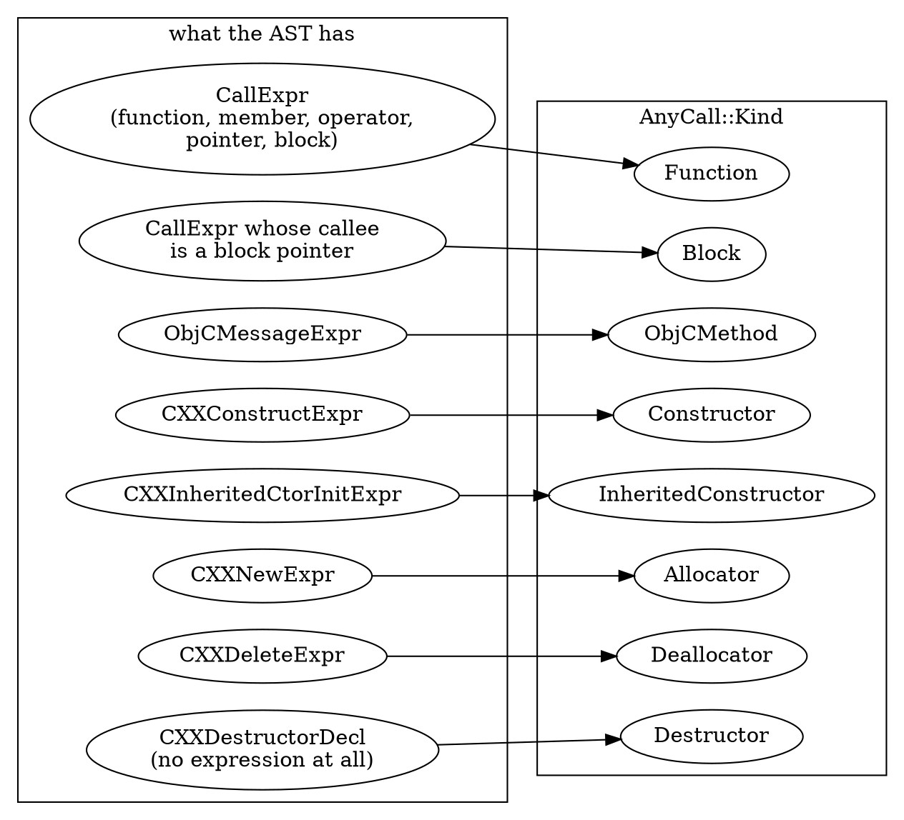

`p08_anycall` walks every body in the main file (implicit members and template instantiations included) and prints what `AnyCall::forExpr` says about each expression, under the function it is written in. One line per call: the expression class, the kind, the declaration (`?` when `getDecl()` is null), the number of parameters, the return type, and the identifier when there is one. Start with `main`:

```bash
build/bin/p08_anycall manifests/p08_calls.cpp --func=main -- -std=c++17 -fblocks
```

```text expected
call main @L32 CXXConstructExpr kind=Constructor decl=Counter::Counter params=0 ret=void
call main @L33 CallExpr kind=Function decl=twice params=1 ret=int ident=twice
call main @L34 CXXMemberCallExpr kind=Function decl=Counter::bump params=1 ret=int ident=bump
call main @L35 CXXOperatorCallExpr kind=Function decl=Counter::operator() params=1 ret=int
call main @L36 CallExpr kind=Function decl=? params=0 ret=int
call main @L37 CXXConstructExpr kind=Constructor decl=Holder::Holder params=1 ret=void
call main @L38 CXXNewExpr kind=Allocator decl="operator new" params=1 ret=void *
call main @L38 CXXConstructExpr kind=Constructor decl=Holder::Holder params=1 ret=void
call main @L39 CXXDeleteExpr kind=Deallocator decl="operator delete" params=2 ret=void
call main @L40 CXXConstructExpr kind=Constructor decl=Derived::Base params=1 ret=void
call main @L42 CXXOperatorCallExpr kind=Function decl=main()::(lambda@L41)::operator() params=1 ret=int
call main @L43 CallExpr kind=Function decl=through_block params=1 ret=int ident=through_block
call main @L44 CallExpr kind=Block decl=<block@L44> params=1 ret=int
```

Read the lines against the source:

- `Counter c;` is a `Constructor` call to the implicit `Counter::Counter`. `c(3)` is a `CXXOperatorCallExpr`, and `AnyCall` still calls it a `Function`: the class is the expression's, the kind is the callee's. It has no `ident=`, because `operator()` has no identifier.
- **`fp(4)` has `decl=?` and `params=0`.** `AnyCall(const CallExpr *)` takes `getCalleeDecl()`, which here is the *variable* `fp`, and drops it, because a variable is not a `FunctionDecl`. A call whose `getDecl()` is null is a call through a pointer.
- `new Holder(6)` is two lines at line 38: the `Allocator` (declaration `"operator new"`, return type `void *`) and the `Constructor`.
- **`delete p` is a `Deallocator` with `params=2`**: the sized `operator delete(void *, size_t)` that C++14 selects. It is one line: the destructor `~Holder`, which `delete` also runs, is not a second call expression.
- `Derived d(7)` constructs through the inheriting constructor, printed `Derived::Base`: the constructor that `using Base::Base` adds to `Derived`.
- `lam(8)` is a `Function` whose declaration is the closure's call operator.
- The last two lines are the blocks. The `Block` call at line 44 is a block literal called on the spot: its `decl` is the block itself, `<block@L44>`, and `params=1`. The line-43 literal is only passed to `through_block`; it is not a call.

The calls written in the other functions of the file:

```bash
build/bin/p08_anycall manifests/p08_calls.cpp -- -std=c++17 -fblocks | grep -v '^call main '
```

```text expected
call <block@L43> @L43 CallExpr kind=Function decl=twice params=1 ret=int ident=twice
call <block@L44> @L44 CallExpr kind=Function decl=twice params=1 ret=int ident=twice
call Derived::Base @L25 CXXInheritedCtorInitExpr kind=InheritedConstructor decl=Base::Base params=1 ret=void
call Holder::Holder @L14 CallExpr kind=Function decl=twice params=1 ret=int ident=twice
call main()::(lambda@L41)::operator() @L41 CallExpr kind=Function decl=twice params=1 ret=int ident=twice
call through_block @L29 CallExpr kind=Block decl=? params=0 ret=int
```

Three things to notice. `Derived::Base` contains a `CXXInheritedCtorInitExpr`, the initialiser that forwards to `Base::Base`, an `InheritedConstructor`. `through_block` calls `blk(3)`, a `Block` with `decl=?`: a block *variable*, like a function pointer, has no declaration to name. And the calls inside the two blocks and the lambda are listed under the block or the closure that contains them, which is how the graph assigns them as well.

**The declaration side.** `forDecl` wraps a definition instead of a call. `--decls` prints one line per definition in the main file, with its kind, parameter count and return type:

```bash
build/bin/p08_anycall manifests/p08_calls.cpp --decls -- -std=c++17 -fblocks | grep '^decl'
```

```text expected
decl Base::Base kind=Constructor params=1 ret=void
decl Counter::Counter kind=Constructor params=0 ret=void
decl Counter::bump kind=Function params=1 ret=int
decl Counter::operator() kind=Function params=1 ret=int
decl Derived::Base kind=Constructor params=1 ret=void
decl Holder::Holder kind=Constructor params=1 ret=void
decl Holder::~Holder kind=Destructor params=0 ret=void
decl main kind=Function params=0 ret=int
decl main()::(lambda@L41)::operator() kind=Function params=1 ret=int
decl through_block kind=Function params=1 ret=int
decl twice kind=Function params=1 ret=int
```

This is the only place the `Destructor` kind appears: `Holder::~Holder` has no call expression anywhere in the file, but it is a callable declaration. Part 10 builds `AnyCall(const CXXDestructorDecl *)` for the destructor elements of a CFG, which have no expression either. `--kinds` counts the call lines per kind:

```bash
build/bin/p08_anycall manifests/p08_calls.cpp --kinds -- -std=c++17 -fblocks | tail -1
build/bin/p08_anycall manifests/p08_objc.m --func=send -- -x objective-c -fblocks -w
```

```text expected
kinds: Function=10 ObjCMethod=0 Block=2 Destructor=0 Constructor=4 InheritedConstructor=1 Allocator=1 Deallocator=1
call send @L15 ObjCMessageExpr kind=ObjCMethod decl=Counter::bump: params=1 ret=int
call send @L15 ObjCMessageExpr kind=ObjCMethod decl=Counter::external: params=1 ret=int
```

The second command is the Objective-C kind. `send` messages `bump:` and `external:`: `AnyCall` sees both (`ObjCMethodDecl` of the *declared* method), while the call graph recorded only `send -> Counter::bump:` (Section 8.6).

**The join with the graph.** Every `CallRecord` holds an expression, so `AnyCall` classifies each edge:

```cpp
for (const CallGraphNode::CallRecord &R : *Node)
  if (R.CallExpr)                                         // null on the root's edges
    if (std::optional<AnyCall> AC = AnyCall::forExpr(R.CallExpr))
      llvm::outs() << AC->getKind() << " " << AC->getDecl() << "\n";
```

The reverse is the useful direction: walk the bodies, ask `AnyCall` for every call, and look each up in the graph. The calls with no edge are the graph's holes, measured instead of listed.

### Verify

Count the calls `AnyCall` sees in `p08_calls.cpp` and the edges the graph records. Predict the difference from Section 8.6: which calls does `CGBuilder` not record?

```bash
echo "AnyCall sites: $(build/bin/p08_anycall manifests/p08_calls.cpp -- -std=c++17 -fblocks | grep -c '^call ')"
echo "graph edges:   $(build/bin/p08_nodes manifests/p08_calls.cpp --edges -- -std=c++17 -fblocks | grep -c '^edge ')"
```

### Expected

```text expected
AnyCall sites: 19
graph edges:   15
```

Nineteen calls and fifteen edges: four calls have no edge. They are the pointer call `fp(4)`, the block-variable call `blk(3)` in `through_block`, `delete p`, and the inherited-constructor initialiser in `Derived::Base`. Section 8.8 builds a graph that records them.

> [!hint]- Quiz: `AnyCall(const CXXDestructorDecl *)` has no expression. Which CFG elements will Part 10 build it from?
> Part 3.1 listed the elements that stand for a destructor call.

> [!success]- Answer
> The implicit-destructor elements, `CFGImplicitDtor`: `AutomaticObjectDtor` (scope exit), `TemporaryDtor`, `MemberDtor`, `BaseDtor` and `DeleteDtor` (what `delete` destroys). None is a statement, so none has an `Expr` for `forExpr`; each names a `CXXDestructorDecl`, which is what the destructor constructor takes. That is also why the call graph, which is built from expressions, has no edge for them.

### Common mistakes

| Mistake | Symptom |
|---------|---------|
| Treating a null `getDecl()` as "an unknown function" without looking at `getKind()` | a `Function` call is a pointer call, a `Block` call a block-variable call: different holes, different fixes |
| Calling `getReturnType(Ctx)` on a declaration-backed kind with no declaration | for `Constructor`, `Destructor`, `Allocator` and `Deallocator` it casts `getDecl()` and needs one (`p08_anycall` prints `ret=?` for those) |
| Expecting `forExpr` to accept any expression | it returns `std::nullopt` for everything outside the seven classes |
| Looking for destructors in `forExpr` | there is no expression; use `AnyCall(const CXXDestructorDecl *)` or `forDecl` |
| Expecting `getIdentifier()` for an operator or a constructor | null: only named declarations have an identifier |
| Treating `kind=Function` as "a function was named" | a `Function` call through a pointer has no declaration |

### Exercises

1. Run `build/bin/p08_anycall manifests/p08_include.cpp --func=dispatch -- -std=c++17 -fblocks`, then the same for `indirect` and `blk_var`. Which of the three has a `decl`, which kind is each, and which of them has an edge in `build/bin/p08_nodes manifests/p08_include.cpp --edges --func=...`?
2. `build/bin/p08_anycall manifests/p08_include.cpp --func=with_new -- -std=c++17 -fblocks` has three lines. Which is the one the call graph has no edge for, and which callee of it has no `AnyCall` line at all?

---

## Section 8.8 — Your own call graph: a visitor that records what `CGBuilder` skips, diffed against the library's

### Why

The library's policy is fixed. `CGBuilder` sits in an anonymous namespace with a hard-coded list of `Visit` members, and the visitor above it cannot be told to record a `delete`, a pointer call or a template pattern. When an analysis needs those edges, you write the builder yourself. Doing it teaches the rest of the part by contrast: every difference between your graph and the library's is a decision the library made for you, and the diff shows each one with its line number.

### What to Do

**Sample files:** `manifests/p08_include.cpp` and `manifests/p08_calls.cpp` (compile with `-- -std=c++17 -fblocks`), and `manifests/p08_objc.m` (`-- -x objective-c -fblocks -w`).

**The design.** `p08_mine` is a `cglab::ContextVisitor`: a `DynamicRecursiveASTVisitor` that remembers the function, method or block it is inside, so that every call it meets knows its caller. It visits implicit code and template instantiations, as `CallGraph` does, and it reproduces the library's rules exactly (a direct callee or a block literal, `new`, a constructor with a definition, an Objective-C message to a defined method, the lambda's call operator as a node). On top of that it records, switchable with `--policy`:

| Policy | What `mine` adds | What the library does instead |
|--------|------------------|-------------------------------|
| `delete` | `delete p` is an edge to `operator delete` and, when the class has a non-trivial destructor, to `~T` | nothing: there is no `VisitCXXDeleteExpr` |
| `fnptr` | a call through a pointer or a block variable is an edge to a pseudo node `?(<callee type>)`, one per type | nothing: `getDirectCallee()` is null |
| `tplpattern` | calls in a template *pattern* are recorded under the pattern, a node of kind `tpl-pattern`; a callee that is an overload set with one function is resolved to it | `includeInGraph` refuses a dependent context |
| `inline` | functions whose name starts with `__inline` are nodes and callees | `includeCalleeInGraph` refuses them |
| `inherited` | a `CXXInheritedCtorInitExpr` is an edge to the base-class constructor | no member visits it |

`--policy=none` is the library's rules and nothing else. All five are on by default. One difference is not a policy, because it is a choice about *where* to charge a call. A default argument and an in-class initialiser are charged to where they are **written**: the visitor overrides `TraverseCXXDefaultArgExpr` and `TraverseCXXDefaultInitExpr` to do nothing at the use, so the call lands on the declaration that spells the default.

```cpp
  bool TraverseCXXDefaultArgExpr(CXXDefaultArgExpr *) override { return true; }
  bool TraverseCXXDefaultInitExpr(CXXDefaultInitExpr *) override { return true; }
```

The most involved member is the `delete` one, because the destructor is not in the expression:

```cpp
  bool VisitCXXDeleteExpr(CXXDeleteExpr *E) override {
    if (!P.Delete || !cur()) return true;
    add(E->getOperatorDelete(), E);
    QualType Destroyed = E->getDestroyedType(); // null for a dependent type that is not a pointer
    if (const CXXRecordDecl *RD = Destroyed.isNull() ? nullptr : Destroyed->getAsCXXRecordDecl())
      if (RD->hasDefinition())
        if (const CXXDestructorDecl *D = RD->getDestructor())
          if (!D->isTrivial()) add(D, E);
    return true;
  }
```

The price of owning the builder is naming and canonicalisation: `p08_mine` reuses the names of Section 8.3 and keys declarations by `getCanonicalDecl()` (Objective-C methods as they are), or the diff would be full of false differences. It identifies an edge by caller, callee, **line and column**, so two calls on one line stay two.

**The output.** `== <file>: lib N nodes M edges, mine N' nodes M' edges`; a `node` line per node of the union with `in=lib|mine|both` (`--kinds` adds the kind); an `edge` line per edge with `both`, `only-lib` or `only-mine` and the call's line; and `diff: only-lib=<n> only-mine=<n> both=<n>`.

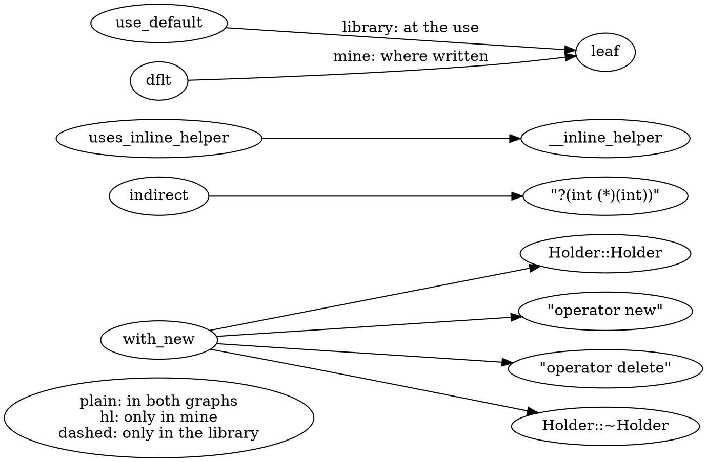

**Step 1: the baseline.** With `--policy=none` the only differences from the library are the two default charges (the default argument of `dflt`, and the default member initialiser `int m = helper(3)`, which the library charges to `Member::Member` and `mine` to the field `Member::m`). Everything else, 31 of the library's 33 edges, is `both`:

```bash
build/bin/p08_mine manifests/p08_include.cpp --policy=none -- -std=c++17 -fblocks | grep -E '^(==|edge .* only-|diff)'
```

```text expected
== p08_include.cpp: lib 37 nodes 33 edges, mine 38 nodes 33 edges
edge Member::Member -> helper only-lib @L54
edge Member::m -> helper only-mine @L54
edge dflt -> leaf only-mine @L52
edge use_default -> leaf only-lib @L52
diff: only-lib=2 only-mine=2 both=31
```

A hand-written visitor agrees with the library on every edge but those, which is what lets you trust the rest of the diff.

**Step 2: the default policy.** All five policies on:

```bash
build/bin/p08_mine manifests/p08_include.cpp -- -std=c++17 -fblocks | grep -E '^(==|edge .* only-|diff)'
```

```text expected
== p08_include.cpp: lib 37 nodes 33 edges, mine 43 nodes 40 edges
edge Member::Member -> helper only-lib @L54
edge Member::m -> helper only-mine @L54
edge blk_var -> "?(int (^)(int))" only-mine @L67
edge dflt -> leaf only-mine @L52
edge indirect -> "?(int (*)(int))" only-mine @L75
edge twice -> helper only-mine @L20
edge twice -> helper only-mine @L20
edge use_default -> leaf only-lib @L52
edge uses_inline_helper -> __inline_helper only-mine @L9
edge with_new -> Holder::~Holder only-mine @L49
edge with_new -> "operator delete" only-mine @L49
diff: only-lib=2 only-mine=9 both=31
```

The four default-charge lines of the baseline are still there; the rest are edges the library lacks:

- `with_new -> "operator delete"` and `with_new -> Holder::~Holder`, both at line 49: the two missing callees of `delete p` (Section 8.6's quiz).
- `indirect -> "?(int (*)(int))"` and `blk_var -> "?(int (^)(int))"`: a call through a pointer or a block variable, as an edge to a pseudo node named by the callee's *type*. It does not say which function is called, only that something of that type is.
- `uses_inline_helper -> __inline_helper`: the call the `__inline` rule hides.
- `twice -> helper`, twice at line 20: the calls in the template pattern. The library has them under `twice<int>` and `twice<double>`; `mine` also has them under the pattern.

The nodes that exist only in `mine`, with their kinds:

```bash
build/bin/p08_mine manifests/p08_include.cpp --only=mine --kinds --edges=false -- -std=c++17 -fblocks
```

```text expected
== p08_include.cpp: lib 37 nodes 33 edges, mine 43 nodes 40 edges
node "?(int (*)(int))" in=mine kind=indirect
node "?(int (^)(int))" in=mine kind=indirect
node Member::m in=mine kind=field
node __inline_helper in=mine kind=def
node "operator delete" in=mine kind=decl
node twice in=mine kind=tpl-pattern
```

The `indirect` kind is the pseudo nodes, `field` the `Member::m` of the default charge, and `tpl-pattern` the pattern `twice`; `decl` is `operator delete` (declared, never defined) and `def` is `__inline_helper`.

**Step 3: one function.** `--func` restricts the edge list to one caller, which is how you read a single `delete`:

```bash
build/bin/p08_mine manifests/p08_include.cpp --func=with_new -- -std=c++17 -fblocks
```

```text expected
== p08_include.cpp: lib 37 nodes 33 edges, mine 43 nodes 40 edges
node with_new in=both
edge with_new -> Holder::Holder both @L49
edge with_new -> Holder::~Holder only-mine @L49
edge with_new -> "operator delete" only-mine @L49
edge with_new -> "operator new" both @L49
diff: only-lib=0 only-mine=2 both=2
```

The library has `with_new -> Holder::Holder` and `-> "operator new"` (`both`); `mine` adds the two callees of the `delete`. The `diff:` line counts the edges of this caller only.

**Step 4: the other samples.** `p08_calls.cpp` has all four calls Section 8.7 counted as missing, and the destructor of the `delete`:

```bash
build/bin/p08_mine manifests/p08_calls.cpp -- -std=c++17 -fblocks | grep -E '^(edge .* only-|diff)'
```

```text expected
edge Derived::Base -> Base::Base only-mine @L25
edge main -> "?(int (*)(int))" only-mine @L36
edge main -> Holder::~Holder only-mine @L39
edge main -> "operator delete" only-mine @L39
edge through_block -> "?(int (^)(int))" only-mine @L29
diff: only-lib=0 only-mine=5 both=15
```

The inherited constructor (`Derived::Base -> Base::Base`), the pointer call, the block-variable call, and the two callees of `delete`. The library's 15 edges are all `both`.

### Verify

Section 8.7 counted 19 `AnyCall` sites against 15 graph edges in `p08_calls.cpp`. Predict how many edges `mine` has that the library lacks, then read the `diff:` line:

```bash
build/bin/p08_mine manifests/p08_calls.cpp -- -std=c++17 -fblocks | tail -1
```

### Expected

```text expected
diff: only-lib=0 only-mine=5 both=15
```

Five: the four calls with no edge (19 - 15) and the destructor that the `delete` also runs, which has no `AnyCall` site of its own. `both=15` is every edge the library has, and `only-lib=0`: your graph is a superset of the library's.

> [!hint]- Quiz: why does your visitor see the call in `dflt`'s default argument under `dflt`, and the library under `use_default`?
> Which AST node does a call to `dflt()` contain, and what does `CGBuilder` do with it?

> [!success]- Answer
> A call that uses a default argument contains a `CXXDefaultArgExpr` that wraps the default's expression. `CGBuilder` has a `VisitCXXDefaultArgExpr` that visits the wrapped expression, so the edge is made while walking the *caller*. A visitor that traverses declarations meets the same expression where it is written, inside the `ParmVarDecl`, and `p08_mine` also overrides `TraverseCXXDefaultArgExpr` to do nothing at the use, so the call is charged once, to `dflt`. Neither is wrong: it is the choice between "which function runs this code when it is called" (the user) and "where is the call written" (the declaration), and the first is what a call graph built for reachability wants, the second what a source-location query wants. `clang::index` makes the second choice too (Section 11.4).

### Common mistakes

| Mistake | Symptom |
|---------|---------|
| Using the printed name as the node key in your own visitor | two instantiations, lambdas or overloads merge (Section 8.3); reuse the lab's naming |
| Keying edges by caller and callee only when you diff | two calls to one callee on one line collapse into one; the key here is caller, callee, line and column |
| Looking up a declaration without `getCanonicalDecl()` | the same function appears as two nodes (Section 8.2) |
| Forgetting that the default arguments are charged elsewhere | the diff shows `use_default` losing an edge and `dflt` gaining one: not a bug |
| Visiting implicit code and instantiations differently from the library | the diff fills with nodes that are not a policy difference; `mine` sets both flags like `CallGraph()` does |
| Treating `?(type)` as a callee | it is a class of callees named by their type; resolving it is Part 11's job |

### Exercises

1. Run `build/bin/p08_mine manifests/p08_include.cpp --policy=delete -- -std=c++17 -fblocks | grep -E '^(edge .* only-|diff)'`. Which `only-mine` edges remain, and which of them does `--policy=delete` not control?
2. Run `build/bin/p08_mine manifests/p08_objc.m --policy=fnptr -- -x objective-c -fblocks -w | grep -E '^(edge .* only-|diff)'`. Which Objective-C hole does it fill?

---

## Section 8.9 — Exports: the lab's DOT and JSON, the library's `WriteGraph`, `print`, `dump` and `viewGraph`

### Why

A graph has to leave the process to be useful: to be looked at, diffed between two commits, loaded by a script, or merged with the graph of another translation unit (Part 11). There are the lab's own exports, built for those uses, and the library's three (`print`/`dump`, `WriteGraph`, `viewGraph`), of which `dump` and `viewGraph` are what `debug.DumpCallGraph` and `debug.ViewCallGraph` call. This section runs all of them on one graph and says what each is for, and where the library's own export is trapped.

### What to Do

**Sample files:** `manifests/p08_basic.cpp` for the exports, `manifests/p08_include.cpp` for the call-site columns.

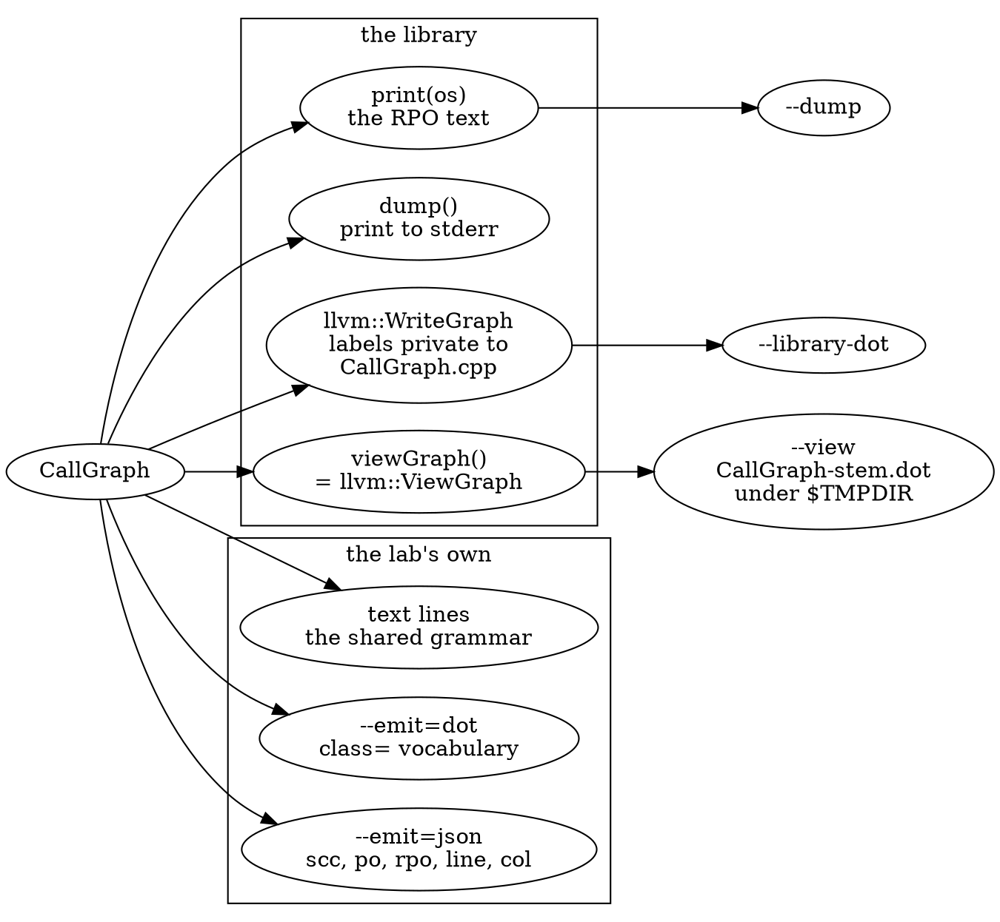

| Export | Command | What it carries | Use it for |
|--------|---------|-----------------|------------|
| the lab's text | (default), `--edges`, `--sites`, `--kinds`, `--usr` | one record per line, the shared grammar | reading, `grep`, `diff`, the Expected blocks of this lab |
| `CallGraph::print` | `--dump` | the reverse post-order text of Section 8.1 | comparing with `debug.DumpCallGraph` |
| the lab's DOT | `--emit=dot` | nodes and edges with `class=` only, as the diagram contract says | pasting a graph into a document, `dot -Tsvg` |
| the lab's JSON | `--emit=json` | every node with `scc`, `po`, `rpo`, `recursive`, `usr`; every edge with `line`, `col`, `back` | scripts, saving a graph per translation unit (Part 11) |
| `llvm::WriteGraph` | `--library-dot` | the library's DOT, ids normalised | seeing what the library draws |
| `CallGraph::viewGraph` | `--view` | the same DOT through `llvm::ViewGraph` | what `debug.ViewCallGraph` writes |

**The lab's DOT.** Every tool takes `--emit=text|dot|json`. The DOT output follows the lab's diagram contract ("Diagrams" in `docs/AUTHORING.md`: `class=` and nothing else), so a tool's own DOT can be pasted into a document as is:

```bash
build/bin/p08_nodes manifests/p08_basic.cpp --emit=dot
```

```text expected
digraph p08_basic {
  f;
  fact [class="recursive"];
  g;
  main [class="entry"];
  unused;
  f -> g;
  fact -> fact [class="back"];
  main -> f;
  main -> fact;
}
```

`main` is `entry`, `fact` is `recursive` and its self edge is `back`; with `--sites` each edge gets an `@L<line>` label, with `--with-root` the root and its `weak` edges appear. Parallel edges (two calls to one callee) are folded into one edge labelled `×2`, so a picture does not draw the same arrow twice; the JSON keeps both.

**The lab's JSON** (`llvm::json`, keys in alphabetical order, as in Part 2.8) carries what the text output has and more. The keys first:

```bash
build/bin/p08_nodes manifests/p08_basic.cpp --emit=json | python3 -c 'import json,sys; d=json.load(sys.stdin); print("top: ", " ".join(sorted(d))); print("node:", " ".join(sorted(d["nodes"][0]))); print("edge:", " ".join(sorted(d["edges"][0])))'
```

```text expected
top:  edges file nodes sccs
node: kind line name noreturn po recursive rpo scc static usr
edge: back class col from kind line to
```

Every node has the `scc`, `po` and `rpo` numbers that Sections 9.1 and 9.2 compute, and `recursive`; every edge has its `line`, `col` and `back`. The column is how you tell two calls on one line apart, which the text output cannot do (Section 8.2's `twice<int>`):

```bash
build/bin/p08_nodes manifests/p08_include.cpp --emit=json -- -std=c++17 -fblocks | python3 -c 'import json,sys; [print(e["from"], "->", e["to"], "line", e["line"], "col", e["col"]) for e in json.load(sys.stdin)["edges"] if e["from"] == "twice<int>"]'
```

```text expected
twice<int> -> helper line 20 col 45
twice<int> -> helper line 20 col 57
```

Two `CallRecord`s, one callee: they compare equal as records (`operator==` looks at the callee only), and the graph keeps both.

**The library's `WriteGraph`.** `llvm::WriteGraph` over the call graph, which `--library-dot` prints with the `Node0x…` pointer ids replaced by `N<id>` (in name order, the root is `N0`) and the node blocks sorted, so the text is stable (the same normalisation as Part 1.5):

```bash
build/bin/p08_nodes manifests/p08_basic.cpp --library-dot | head -9
```

```text expected
digraph "CallGraph" {
	label="CallGraph";

	N0 [shape=record,label="{\< root \>}"];
	N0 -> N3;
	N0 -> N1;
	N0 -> N2;
	N0 -> N5;
	N0 -> N4;
```

> [!warning] `WriteGraph` on `const CallGraph*` prints empty labels
> The `DOTGraphTraits<const CallGraph *>` that labels nodes (`< root >`, or the unqualified name) is defined inside `CallGraph.cpp`, not in the header. A tool that calls `llvm::WriteGraph(OS, static_cast<const CallGraph *>(&CG))` instantiates the *default* traits and gets `label="{}"` on every node, with `Node0x…` ids. `--library-dot` works around it with a thin wrapper type, `cglab::LibGraph`, that carries a copy of CallGraph.cpp's labelling rule. Even then the labels are unqualified names (`run`, not `Base::run`), so two methods with the same name look alike; prefer the tools' own `--emit=dot`.

**The library's `viewGraph`.** `CallGraph::viewGraph()` is `llvm::ViewGraph(this, "CallGraph")` and it is defined *inside* `CallGraph.cpp`, where the labelling traits are visible: it is the one export that gets the labels right without a workaround. It writes `CallGraph-<random>.dot` into `$TMPDIR` and then tries to launch a viewer. Part 1.5's trick keeps the viewer from starting: point `TMPDIR` at a directory you own and give the process an empty `PATH`, so that no viewer program can be found. `p08_nodes --view` runs the real `viewGraph()`, rewrites the pointer ids as `--library-dot` does, saves the result as `CallGraph-<file stem>.dot` next to the library's file and prints where. The tool does not suppress the viewer itself, so **always run it with the environment below**: without an empty `PATH` it opens a window (on macOS, through `open`). The library's own `Writing '…'` line and its "couldn't find a usable graph viewer" error are on stderr:

```bash
rm -rf out/view && mkdir -p out/view
TMPDIR=out/view PATH=/var/empty build/bin/p08_nodes manifests/p08_basic.cpp --view 2>/dev/null
diff <(build/bin/p08_nodes manifests/p08_basic.cpp --library-dot) out/view/CallGraph-p08_basic.dot
```

```text expected
view: out/view/CallGraph-p08_basic.dot
1,2c1
< digraph "CallGraph" {
< 	label="CallGraph";
---
> digraph unnamed {
```

The only differences between the wrapper's output and the real `viewGraph()` file are the first two lines: `ViewGraph` writes a `digraph unnamed` with no title. The labels, the node numbers and the edges are identical, which is the evidence that the wrapper in `--library-dot` reproduces the library's labelling rule. `debug.ViewCallGraph` (Part 1.6) is the same call.

### Verify

The text output, the JSON and the DOT output describe one graph. Compare the three counts for `p08_basic.cpp`:

```bash
build/bin/p08_nodes manifests/p08_basic.cpp | head -1
build/bin/p08_nodes manifests/p08_basic.cpp --emit=json | python3 -c 'import json,sys; d=json.load(sys.stdin); print(len(d["nodes"]), "nodes,", len(d["edges"]), "edges in the JSON")'
mkdir -p out && build/bin/p08_nodes manifests/p08_basic.cpp --emit=dot | dot -Tsvg -o out/p08_basic.svg && grep -c 'class="node' out/p08_basic.svg
```

### Expected

```text expected
== p08_basic.cpp: 5 nodes, 4 edges
5 nodes, 4 edges in the JSON
5
```

Five nodes four edges in the text header and the JSON, and five node elements in the SVG that `dot` drew from the DOT export. Open `out/p08_basic.svg` to look at it.

> [!hint]- Quiz: why does `llvm::WriteGraph(OS, &CG)` in your own tool print `label="{}"` on every node, while `CG.viewGraph()` gets the labels right?
> Where is `DOTGraphTraits<const CallGraph *>` defined, and which of the two calls is compiled where it is visible?

> [!success]- Answer
> `DOTGraphTraits<const CallGraph *>` is a specialisation that lives in `CallGraph.cpp`, not in a header. `viewGraph()` is a member compiled in that file, so it sees the specialisation; your call to `WriteGraph` is compiled in your tool, where only the default traits exist, which label nothing. Either wrap the graph in your own type with your own traits (as `cglab::LibGraph` does), or write the DOT yourself.

### Common mistakes

| Mistake | Symptom |
|---------|---------|
| Calling `CG.viewGraph()` in a script | tries to open a viewer; set `TMPDIR` to a directory you own and `PATH=/var/empty` (run `p08_nodes --view` the way the command in Section 8.9 does) |
| Using `WriteGraph` on a `CallGraph` and expecting names | empty labels and `Node0x…` pointer ids that change on every run |
| Diffing two runs of `--library-dot` without normalising | the pointer ids differ; the tool rewrites them to `N<id>` |
| Parsing the text output to find a call's column | the text has the line only; use the JSON |
| Pasting `--library-dot` into a document | the library's DOT has `shape=record` boxes and no `class=`, so it does not follow the diagram contract: use `--emit=dot` |

### Exercises

1. `build/bin/p08_nodes manifests/p08_include.cpp --emit=dot -- -std=c++17 -fblocks | grep 'twice<int>'`, and the same with `--sites`. How does the DOT show the two `twice<int> -> helper` records, and where do the two calls differ in the JSON?
2. `build/bin/p08_nodes manifests/p08_basic.cpp --emit=dot --with-root | head -12`. Which edges are `weak`, and why is every function reachable from `root`?

---

## Section 8.10 — Checkpoint

| Concept | What You Proved |
|---------|-----------------|
| What a call graph is | A node per function (keyed by its canonical declaration), an edge per call *site*; `< root >` has an edge to **every** node, so it is an entry for traversals and not a "nobody calls this" marker (8.1) |
| The dump | `debug.DumpCallGraph` prints a reverse post-order from the root, which is why it is deterministic and why callers come first; `dump()` writes to stderr (8.1) |
| The container | `CallGraph` owns a `DenseMap` of `CallGraphNode`s, each a `SmallVector<CallRecord>`; `getNode` does not canonicalise, `getOrInsertNode` does; a `CallRecord` holds the callee and the call expression and compares by callee only; `size()` counts the root, a node's `size()` counts call sites (8.2) |
| Names and identity | `printQualifiedName` loses template arguments, lambdas and blocks; the lab's naming rule repairs them inside one translation unit; the USR is the identity across files, empty for a block and offset-based for a lambda (8.3) |
| The builder | `CallGraph` is a visitor with two doors (`includeInGraph` for definitions, `includeCalleeInGraph` for callees) and flags that are data members; `TraverseStmt` is a no-op, so edges come from `CGBuilder`; `--instantiations=0` removes edges and not nodes; `addToCallGraph` builds one declaration at a time, which is what the Static Analyzer does (8.4) |
| What `CGBuilder` records | Direct calls, `new`, constructors with a definition, constructor initialisers, default arguments and member initialisers (charged to the user), block literals called in place, Objective-C messages to defined methods (8.5) |
| What stays out | Function pointers, block variables, `delete`, implicit destructors, the dynamic target of a virtual call, `__inline*` names, template patterns; "no callees" does not mean "calls nothing" (8.6) |
| `AnyCall` | One interface for eight kinds of call, from expressions (`forExpr`) or declarations (`forDecl`); `getDecl()` is null for a pointer or block-variable call; the `Destructor` kind has no expression; counting its sites against the graph's edges measures the holes (8.7) |
| A graph of your own | A hand-written visitor reproduces the library's rules and then adds `delete`, pointer calls, template patterns, `__inline` names and inherited constructors; the diff keys edges by caller, callee, line and column; defaults can be charged to the use or to the declaration (8.8) |
| Exports | Text, DOT with the lab's classes, JSON with `scc`/`po`/`rpo`/line/column, the library's `print`, and `WriteGraph` (empty labels unless a wrapper supplies the traits) versus `viewGraph` (labels right, because it is compiled where the traits are visible) (8.9) |

**Ready for Part 9?** You can read, build and name a call graph and you know exactly which calls it leaves out. [Part 9](part_9_call_graph_algorithms.md) runs LLVM's graph algorithms on it: traversal orders, strongly connected components for recursion, reachability, callers, metrics and witness paths, and the Static Analyzer's own use of the order.

---

[← Part 7 — Capstone & Engineering](part_7_capstone.md) | [Part 9 — Call Graph Algorithms →](part_9_call_graph_algorithms.md)
