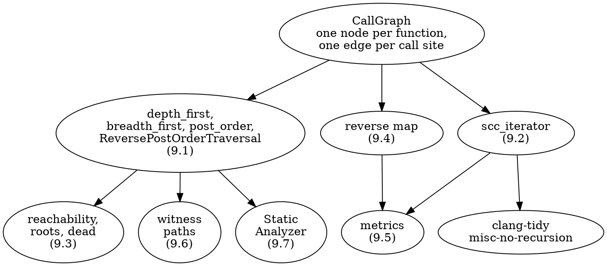
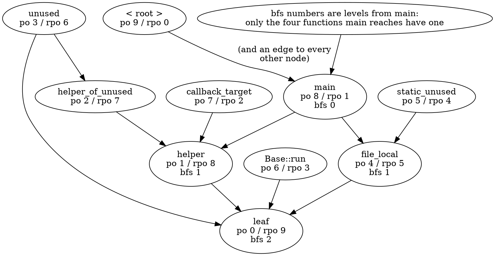
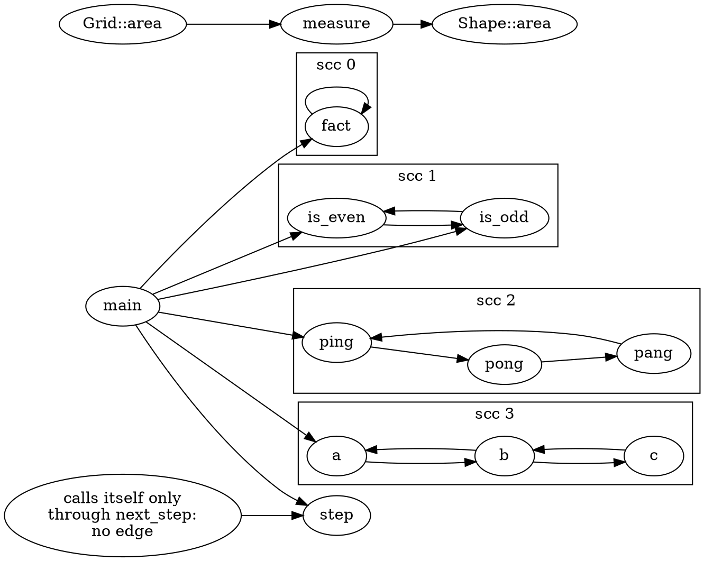
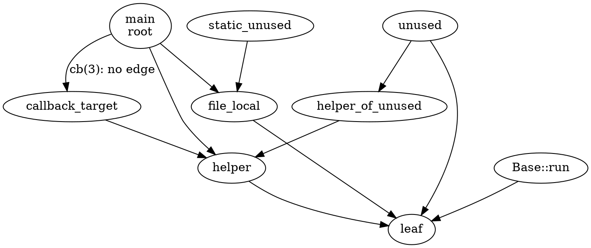
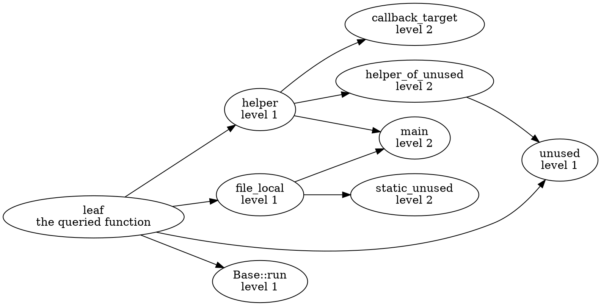
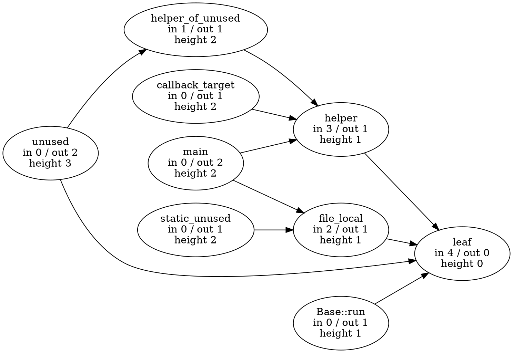
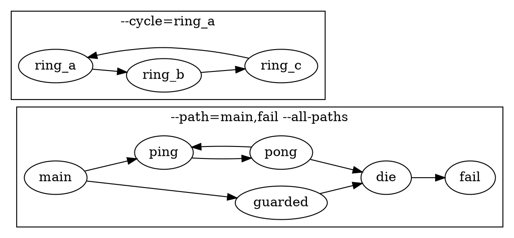
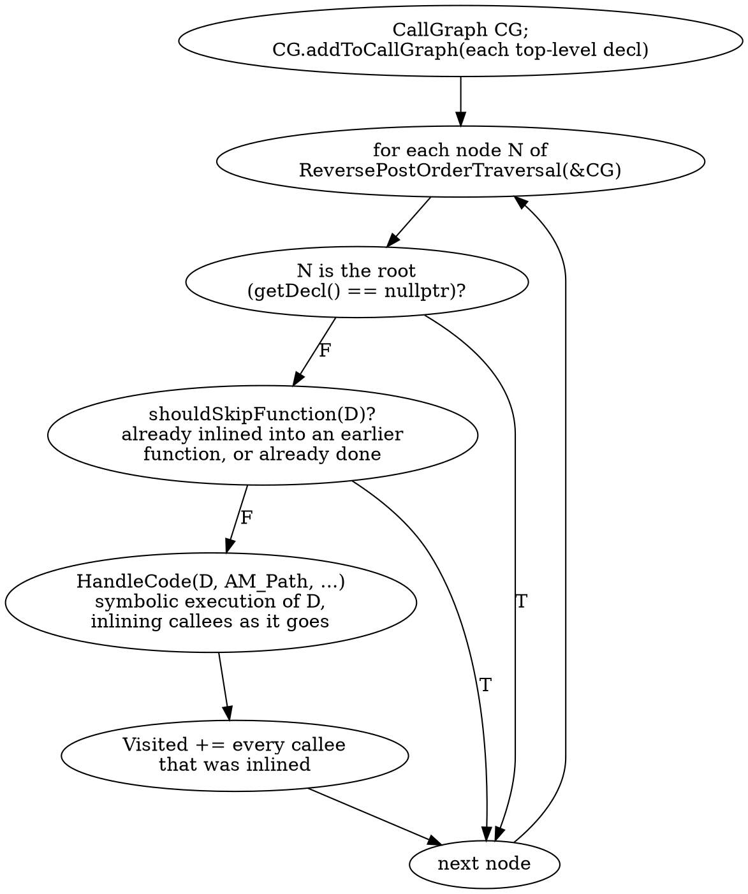
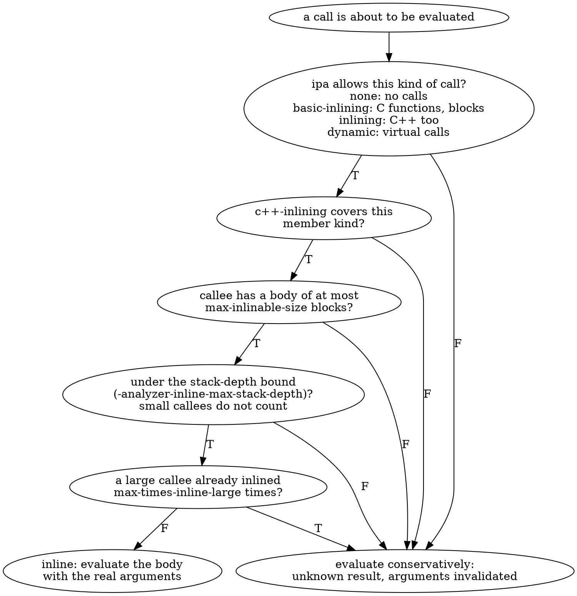

# Part 9 — Call Graph Algorithms

[← Part 8 — Call Graph Fundamentals](part_8_call_graphs.md) | [Part 10 — Interprocedural Analysis →](part_10_interprocedural_analysis.md)

## What You'll Learn

- How `clang::CallGraph` plugs into LLVM's graph library through `GraphTraits` (`CallGraph.h:242-310`), why the children of a node are its `CallRecord`s, and what each generic traversal (`depth_first`, `breadth_first`, `post_order`, `ReversePostOrderTraversal`) produces and is good for
- Strongly connected components as recursion: `scc_iterator`, `hasCycle()`, the order the components come out in, and how `clang-tidy`'s `misc-no-recursion` does exactly this
- Reachability, the three things "root" can mean, and what "dead" means for a graph that is only as good as its edges
- Callers: there is no `Inverse<CallGraph*>`, so the reverse graph is a copy with its own `GraphTraits`; direct versus transitive callers, and traversal orders over the reverse graph
- Metrics: fan-in, fan-out, call sites, height, SCC, dead and leaf counts, each one a single traversal
- Witness paths: the shortest call chain between two functions and the shortest cycle through one, by breadth-first search, and how that differs from `misc-no-recursion`'s `pathfindSomeCycle`
- The one production consumer of the call graph's order, the Static Analyzer: `HandleDeclsCallGraph`, which functions become top-level entries and which are skipped, `-analyzer-display-progress`, `-analyzer-note-analysis-entry-points` and `debug.Stats`
- The switches that decide how much the analyzer inlines (`mode`, `ipa`, `max-inlinable-size`, `ipa-always-inline-size`, `-analyzer-inline-max-stack-depth`, `-analyzer-inlining-mode`), how to observe the effect of each, and two traps in how they are spelled

## The Big Picture

Part 8 built the call graph and listed everything it leaves out. Part 9 treats it the way Part 4 treated the CFG: as a directed graph, and asks the questions graph theory asks of one. The answers are what Part 10 (summaries, call strings, the analyzer's inlining) and Part 11 (repairing the graph's holes) stand on.

| Question | Part 4 (the CFG) | Part 9 (the call graph) | Section |
|----------|------------------|-------------------------|---------|
| In which order do I visit the nodes? | `PostOrderCFGView`, `getIntervalWTO` | `post_order`, `ReversePostOrderTraversal`, `depth_first`, `breadth_first` through `GraphTraits<CallGraph*>` | 9.1 |
| Where are the cycles? | back edges, natural loops, `scc_iterator` | `scc_iterator`: a cyclic component is recursion | 9.2 |
| What can this node reach? | `CFGReverseBlockReachabilityAnalysis` | `depth_first` from a set of roots | 9.3 |
| Who points at this node? | `Inverse<>` | nothing in `CallGraph.h`: a reverse map you build | 9.4 |
| How big and how connected is it? | cyclomatic complexity (Part 2) | fan-in, fan-out, call sites, height | 9.5 |
| Show me one path. | dominators, slicing | breadth-first witness chains and cycles | 9.6 |
| Who uses the graph in production? | every analysis of Part 5 | the Static Analyzer's top-down order | 9.7, 9.8 |



`depth_first`, `breadth_first`, `post_order` and `ReversePostOrderTraversal`, and `scc_iterator`, are LLVM's: all they need from the graph is `GraphTraits`, which `CallGraph.h` supplies. The reverse map is the one structure the library does not give you (Section 9.4). Reachability, witness paths and the metrics are a few dozen lines of lab code on top of the same callee lists. `clang-tidy` and the Static Analyzer are what Clang itself does with a call graph, and they are the reason the order of a traversal matters at all.

| Tool (this part) | Section | Does |
|------------------|---------|------|
| `p09_walk` | 9.1 to 9.4, 9.6 | traversal orders (`po`, `rpo`, `dfs`, `bfs`, forward or over the reverse graph), SCCs, reachability, dead functions, callers, shortest paths and cycles |
| `p09_metrics` | 9.5 | `in`, `out`, `sites`, `height`, `scc` per function, and the totals of the graph |
| `scripts/dumpcfg.sh` | 9.7, 9.8 | the Static Analyzer with `-analyzer-display-progress`, `debug.Stats` and `clang_analyzer_eval` |
| `clang-tidy` | 9.2, 9.6 | the `misc-no-recursion` check, as the production reference for 9.2 and 9.6 |

The sample files (every function is small and named for what it demonstrates):

| File | Used in | Holds |
|------|---------|-------|
| `manifests/p09_reach.cpp` | 9.1, 9.3, 9.4, 9.5, 9.7 | nine functions: dead code, `static` versus external linkage, an address-taken callback, a leaf with four callers |
| `manifests/p09_recursion.cpp` | 9.2, 9.5, 9.6 | self, mutual, three-way and overlapping recursion, and recursion hidden behind a pointer or a virtual call |
| `manifests/p10_sink.cpp` | 9.6 | a `[[noreturn]]` sink reached by two chains, and a ring of three functions (shared with Section 10.3) |
| `manifests/p10_sites.cpp` | 9.5 | one `main` with nine call sites for seven callees (shared with Section 10.1) |
| `manifests/p10_analyzer.cpp` | 9.7, 9.8 | four `clang_analyzer_eval` questions and a null-pointer chain; run through the analyzer only (shared with Part 10) |

`p09_walk` and `p09_metrics` use the output grammar of Part 8: one record per line, names quoted only when they contain a space, `<root>` left out unless you pass `--with-root`, `-` for an empty list, lists sorted by name. The records that are new in this part:

| Record | Printed by | Means |
|--------|------------|-------|
| `order po\|rpo\|dfs\|bfs [reverse] [<from>]: …` | `p09_walk --order=` | one traversal, in traversal order (not sorted); `bfs` prints `<name>@<level>` |
| `scc <id> [cyclic self\|mutual]: …` | `p09_walk --sccs` | one SCC, in `scc_iterator` order |
| `reach <from>: …`, `dead: …` | `p09_walk --from=`, `--dead` | reachability from a start node or a root set |
| `callers <f>: …`, `callers* <f>: …` | `p09_walk --callers=` | direct and transitive callers |
| `path A -> … -> B (<n> calls)`, `cycle F -> … -> F` | `p09_walk --path=`, `--cycle=` | a witness chain |
| `metric <fn> in=… out=… sites=… height=… scc=…`, `totals: …` | `p09_metrics` | the per-function numbers and the graph's totals |

---

## Section 9.1 — `GraphTraits<CallGraph*>` and the generic traversals: `depth_first`, `breadth_first`, `post_order` and `ReversePostOrderTraversal`

### Why

Every analysis that sends information along call edges has to pick a direction: callees before callers, or callers before callees. LLVM already implements the orders; all it needs from a graph is a `GraphTraits` specialisation, and `CallGraph.h` provides one. This section shows what that specialisation exposes, what each traversal yields on the same graph, and which order is for which job.

### What to Do

**Sample file:** `manifests/p09_reach.cpp` — nine functions: `main` calls `helper` and `file_local` (and `callback_target` through a pointer); `helper` and `file_local` call `leaf`; `unused` and `static_unused` call down into the same helpers; `Base::run` is a virtual method that calls `leaf`.

Build the tools of this part once (`scripts/build.sh` with no argument builds them with everything else):

```bash
scripts/build.sh p09_walk p09_metrics
```

```bash
scripts/build.sh --list | grep '^p09_'
```

```text expected
p09_metrics
p09_walk
```

**What `CallGraph.h` provides.** Four specialisations of `llvm::GraphTraits` (`CallGraph.h:242-310`):

| Specialisation | Entry node | Children of a node | Extra |
|----------------|------------|--------------------|-------|
| `GraphTraits<CallGraphNode*>`, `GraphTraits<const CallGraphNode*>` | the node itself | its `CallRecord`s, `begin()` to `end()` | none |
| `GraphTraits<CallGraph*>`, `GraphTraits<const CallGraph*>` | **the root**: `getEntryNode` returns `getRoot()`, with the header comment "Start at the external node!" | as above | `nodes_begin()`, `nodes_end()`, `size()` |

Two details decide how every traversal below behaves:

- **A child is a `CallRecord`, not a node.** `CallRecord{Callee, CallExpr}` converts implicitly to `CallGraphNode*` (`operator CallGraphNode *() const`, `CallGraph.h:159`), so the algorithms see the callee and the call expression rides along unused. There is **one record per call site**: a function that calls `leaf` twice has `leaf` twice among its children. Every traversal keeps a visited set, so repeats are harmless there; an algorithm that *counts* children has to fold them (Section 9.5 does).
- **The entry node is the synthetic root**, which has an edge to every node (Section 8.1). `llvm::depth_first(&CG)` and `llvm::post_order(&CG)` therefore cover the whole graph, and "what the entry reaches" says nothing. To ask about one function, start from its node: `llvm::depth_first(CG.getNode(F))`.

Children come in **record order**, which is the source order of the calls in the body (`CGBuilder` walks the body in order), and the root's children come in the order the nodes were created (definitions in file order; a callee that is only declared is created at its first call). That is why every traversal is deterministic even though `CallGraph::begin()` iterates a `DenseMap` keyed by `const Decl*`: never iterate the graph itself when order matters, and sort by name when you print a set (the lab's default).

Five iterators cover what you will ever ask of the graph:

| Iterator | Header | Call | Order | Use it for |
|----------|--------|------|-------|------------|
| depth first | `DepthFirstIterator.h` | `llvm::depth_first(&CG)`, `depth_first(node)` | preorder: a node, then everything below its first callee, and so on | reachability (Section 9.3) |
| breadth first | `BreadthFirstIterator.h` | `llvm::breadth_first(node)`, `bf_begin(node)` with `getLevel()` | by distance from the start | shortest call depth, witness chains (Section 9.6) |
| post order | `PostOrderIterator.h` | `llvm::post_order(&CG)` | a node **after** all its callees | bottom-up work: summaries (Section 10.3) |
| reverse post order | `PostOrderIterator.h` | `llvm::ReversePostOrderTraversal<CallGraph *> R(&CG)` | a node **before** its callees | top-down work: the Static Analyzer (Section 9.7) |
| SCCs | `SCCIterator.h` | `llvm::scc_begin(&CG)` | components, callees first | recursion (Section 9.2) |

`ReversePostOrderTraversal` does its whole walk in the constructor (the header calls it "expensive to create": build one and iterate it as often as you like).

`p09_walk` runs them. `--order=` selects the iterator, `--from=NAME` the start node (default: the root), `--with-root` keeps `<root>` in the list, `--edges` adds the call edges so the site can draw the graph.

**Two orders from the same traversal.** `post_order` emits a node after all of its callees (depth first, finishing order); `ReversePostOrderTraversal` is its exact reverse. Both start at the root, so the root is last in one and first in the other:

```bash
build/bin/p09_walk manifests/p09_reach.cpp --order=po --with-root
build/bin/p09_walk manifests/p09_reach.cpp --order=rpo --with-root
```

```text expected
order po: leaf helper helper_of_unused unused file_local static_unused Base::run callback_target main <root>
order rpo: <root> main callback_target Base::run static_unused file_local unused helper_of_unused helper leaf
```

Read the first line left to right: `leaf` comes out first (everything it needs: nothing), `main` last, then the root. The second line is the same list backwards. Neither order is unique: the depth-first search visits a node's callees in record order, so `helper_of_unused` before `unused` is a consequence of the source, not a rule. What **is** guaranteed (outside cycles) is the direction: in post-order a callee precedes every caller, in reverse post-order a caller precedes every callee. A cycle breaks that guarantee for its members, because they are callers of each other; Section 9.2 treats the whole component as one unit instead.

Without the root, with the edges, so you can see which way they point:

```bash
build/bin/p09_walk manifests/p09_reach.cpp --order=po
build/bin/p09_walk manifests/p09_reach.cpp --order=rpo --edges
```

```text expected
order po: leaf helper helper_of_unused unused file_local static_unused Base::run callback_target main
order rpo: main callback_target Base::run static_unused file_local unused helper_of_unused helper leaf
edge Base::run -> leaf
edge callback_target -> helper
edge file_local -> leaf
edge helper -> leaf
edge helper_of_unused -> helper
edge main -> file_local
edge main -> helper
edge static_unused -> file_local
edge unused -> helper_of_unused
edge unused -> leaf
```



The picture numbers the nodes the way `--with-root` lists them, from 0. Every edge goes from a larger `po` to a smaller one, and from a smaller `rpo` to a larger one: that is the direction guarantee, and the Verify below checks it on every edge.

**Depth first and breadth first from a function.** Starting at `main` instead of the root gives the part of the graph `main` can reach, in the two orders that do not need the finishing times. `--order=bfs` prints `<name>@<level>`, where the level is `bf_iterator::getLevel()` (`BreadthFirstIterator.h:144`):

```bash
build/bin/p09_walk manifests/p09_reach.cpp --order=dfs --from=main
build/bin/p09_walk manifests/p09_reach.cpp --order=bfs --from=main
```

```text expected
order dfs main: main helper leaf file_local
order bfs main: main@0 helper@1 file_local@1 leaf@2
```

Depth first goes **down** one callee chain before it tries the next: `main`, `helper`, `leaf` (below `helper`), and only then `file_local`. Breadth first goes **across**: both of `main`'s callees (level 1) before their callee `leaf` (level 2). `leaf` is reached by two paths of two calls here, so the level says nothing about which one you took; what it gives is the **length of a shortest chain of calls** from the start, which Section 9.6 turns into the chain itself.

The same iterators from the root are a trap, and a short one to see:

```bash
build/bin/p09_walk manifests/p09_reach.cpp --order=bfs
```

```text expected
order bfs <root>: leaf@1 helper@1 helper_of_unused@1 unused@1 file_local@1 static_unused@1 Base::run@1 callback_target@1 main@1
```

Every function is at level 1, whether `main` calls it or nobody does. A level is only as informative as the start node.

> [!warning] Do not read `po` and `rpo` as "bottom-up" and "top-down" without the cycles caveat
> The names say *where in the order* a node sits relative to its callees. They do not say a callee's result is ready when the caller is reached: that holds only outside cycles, where `p09_walk --order=po` on `manifests/p09_recursion.cpp` already breaks it for five of its eighteen edges (Exercise 1). Summaries over recursion need the SCC order of Section 9.2, not a plain post-order.

### Verify

The claim to check is the direction guarantee: in post-order every callee precedes its caller, so for every edge the caller's position is **later** than the callee's. The awk script reads the position of each name from the `order` line and tests each `edge` line:

```bash
build/bin/p09_walk manifests/p09_reach.cpp --order=po --edges | awk '
  /^order po:/ { for (i = 3; i <= NF; i++) pos[$i] = i; next }
  /^edge/      { n++; if (pos[$2] > pos[$4]) ok++ }
  END          { print ok " of " n " edges go from a later to an earlier post-order position" }'
```

### Expected

```text expected
10 of 10 edges go from a later to an earlier post-order position
```

All of them. The library's `post_order` and the edges of the library's graph agree, which is all a bottom-up algorithm needs. Exercise 1 runs the same script on a graph with recursion.

> [!hint]- Quiz: why is `--order=bfs` from the root useless, and what would you start from instead?
> What does the root have an edge to?

> [!success]- Answer
> The root has a direct edge to **every** function (Section 8.1), so every function is one step from it: all of them come out at level 1 (the output above). A breadth-first level is a distance from the start node, so the start has to be a function: `--from=main` gives the call depth from the program's entry (`main@0 helper@1 file_local@1 leaf@2`), and `--from=F` the call depth below any function you care about.

### Common mistakes

| Mistake | Symptom |
|---------|---------|
| Starting a traversal at the root and calling the result "what `main` reaches" | everything is reached; start at `CG.getNode(main)` |
| Iterating `for (auto &P : CG)` to get an order | `DenseMap` order, which depends on addresses; use a traversal, or sort by name |
| Building a `ReversePostOrderTraversal` for every query | the constructor walks the whole graph each time (the header: "expensive to create"); build one and reuse it |
| Taking the number of children as the number of callees | children are call *sites*; a callee called twice appears twice |
| Treating `po` as bottom-up inside recursion | the members of a cycle are callers of each other; use the SCC order (Section 9.2) |

### Exercises

1. Run the Verify script on `manifests/p09_recursion.cpp`. It prints `13 of 18`. List the five edges that break the guarantee (change the `END` block to print the edges whose caller is not later) and say what they have in common.
2. `build/bin/p09_walk manifests/p09_recursion.cpp --order=bfs --from=main`: `pong` and `b` are at level 2, `pang` and `c` at level 3. Which call chain puts each of them where it is?

---

## Section 9.2 — Strongly connected components: `scc_iterator`, recursion and `clang-tidy`'s `misc-no-recursion`

### Why

A function that can call itself, directly or through others, is the case almost every analysis has to special-case: a summary needs a fixed point (Section 10.3), inlining needs a bound (Section 9.8), and some coding standards ban it outright. In a call graph, recursion is a **cyclic strongly connected component**, and LLVM enumerates components for you. Clang's own `misc-no-recursion` check is little more than that loop, so you can compare your tool against production.

### What to Do

**Sample file:** `manifests/p09_recursion.cpp` — `fact` (self recursion), `is_even` / `is_odd` (mutual), `ping` / `pong` / `pang` (a three-function cycle), `a` / `b` / `c` (two cycles sharing `b`), and two functions that are recursive at run time but whose recursion the graph cannot see: `step` (it calls itself through the pointer `next_step`) and `Grid::area` (it calls `measure`, which calls `s.area(n)` on a `Shape &`).

**`scc_iterator` over a `CallGraph*`.** `llvm::scc_begin(&CG)` runs Tarjan's algorithm over `GraphTraits<CallGraph*>`; each step of the iterator is one component, a `const std::vector<CallGraphNode*>&` (`SCCIterator.h`). Three facts matter:

- **Order.** The header says the components come "in reverse topological order of the SCC DAG": a component is produced only after every component it can reach. In call-graph words, **callees first**, the same order as `post_order` (Section 9.1) but with every cycle collapsed into one unit. That is the order a bottom-up analysis needs: when it reaches a component, everything the component calls already has a result.
- **`hasCycle()`.** True for a component of two or more nodes, and for a single node with an edge to itself (`SCCIterator.h:133-136`; the implementation compares each child with the node, which works because a `CallRecord` converts to `CallGraphNode*`). A test of `scc.size() > 1` misses `fact`.
- **The root.** `scc_begin(&CG)` starts at the root, so the root is a component of its own, produced last. `p09_walk` numbers it (the highest `scc` id) and prints it only with `--with-root`.

`p09_walk --sccs` prints one record per component, `scc <id> [cyclic self|mutual]: <members>`. The id is the position in `scc_iterator` order, trivial components included; `self` is the lab's word for a one-member cyclic component, `mutual` for a larger one:

```bash
build/bin/p09_walk manifests/p09_recursion.cpp --sccs --edges
```

```text expected
scc 0 cyclic self: fact
scc 1 cyclic mutual: is_even is_odd
scc 2 cyclic mutual: pang ping pong
scc 3 cyclic mutual: a b c
scc 4: step
scc 5: Shape::area
scc 6: measure
scc 7: Grid::area
scc 8: main
edge Grid::area -> measure
edge a -> b
edge b -> a
edge b -> c
edge c -> b
edge fact -> fact
edge is_even -> is_odd
edge is_odd -> is_even
edge main -> a
edge main -> fact
edge main -> is_even
edge main -> is_odd
edge main -> ping
edge main -> step
edge measure -> Shape::area
edge pang -> ping
edge ping -> pong
edge pong -> pang
```

`scc 0` to `scc 3` are the cyclic ones, in callees-first order, and `scc 8: main` is the caller above all of them:

- `scc 0 cyclic self: fact` is the self edge `fact -> fact`.
- `scc 1` is plain mutual recursion, `is_even <-> is_odd`; `scc 2` is the three-way cycle `ping -> pong -> pang -> ping`.
- `scc 3` has **three** members although it is "two cycles": `a <-> b` and `b <-> c` share `b`, and an SCC is maximal, so they merge. Section 4.6 made the same point about nested loops.

Two functions are *meant* to be recursive and are not in any cyclic component: `scc 4: step` and `scc 7: Grid::area`. The graph has no edge for the call through `next_step`, and for the virtual call in `measure` it has only the *static* callee `Shape::area` (Section 8.6), so both look acyclic until Part 11 puts the edges back.



**The production version of this loop.** `clang-tidy`'s `misc-no-recursion` (`clang-tools-extra/clang-tidy/misc/NoRecursionCheck.cpp` in 22.1.8) registers a matcher on the translation unit, builds `CallGraph CG; CG.addToCallGraph(TU)`, and runs exactly the loop you just read about:

```cpp
  for (llvm::scc_iterator<CallGraph *> SCCI = llvm::scc_begin(&CG),
                                       SCCE = llvm::scc_end(&CG);
       SCCI != SCCE; ++SCCI) {
    if (!SCCI.hasCycle()) // We only care about cycles, not standalone nodes.
      continue;
    handleSCC(*SCCI);
  }
```

`handleSCC` warns at the definition of **every** member (`function 'x' is within a recursive call chain`), then prints **one** example chain for the component as notes (`Frame #1: function 'a' calls function 'b' here:`), found by `pathfindSomeCycle` (Section 9.6 reads it). The check adds nothing to the graph, so it inherits every hole of it:

```bash
/opt/homebrew/opt/llvm/bin/clang-tidy -checks='-*,misc-no-recursion' manifests/p09_recursion.cpp -- -std=c++17 2>/dev/null \
  | grep -E 'warning|Frame' | sed -E 's|^.*/manifests/|manifests/|; s/ \[misc-no-recursion\]//'
```

```text expected
manifests/p09_recursion.cpp:4:5: warning: function 'fact' is within a recursive call chain
manifests/p09_recursion.cpp:4:43: note: Frame #1: function 'fact' calls function 'fact' here:
manifests/p09_recursion.cpp:8:5: warning: function 'is_even' is within a recursive call chain
manifests/p09_recursion.cpp:9:41: note: Frame #1: function 'is_odd' calls function 'is_even' here:
manifests/p09_recursion.cpp:8:42: note: Frame #2: function 'is_even' calls function 'is_odd' here:
manifests/p09_recursion.cpp:9:5: warning: function 'is_odd' is within a recursive call chain
manifests/p09_recursion.cpp:14:5: warning: function 'ping' is within a recursive call chain
manifests/p09_recursion.cpp:16:26: note: Frame #1: function 'pang' calls function 'ping' here:
manifests/p09_recursion.cpp:14:39: note: Frame #2: function 'ping' calls function 'pong' here:
manifests/p09_recursion.cpp:15:26: note: Frame #3: function 'pong' calls function 'pang' here:
manifests/p09_recursion.cpp:15:5: warning: function 'pong' is within a recursive call chain
manifests/p09_recursion.cpp:16:5: warning: function 'pang' is within a recursive call chain
manifests/p09_recursion.cpp:21:5: warning: function 'a' is within a recursive call chain
manifests/p09_recursion.cpp:22:36: note: Frame #1: function 'b' calls function 'a' here:
manifests/p09_recursion.cpp:21:36: note: Frame #2: function 'a' calls function 'b' here:
manifests/p09_recursion.cpp:22:5: warning: function 'b' is within a recursive call chain
manifests/p09_recursion.cpp:23:5: warning: function 'c' is within a recursive call chain
```

`-checks='-*,misc-no-recursion'` switches every check off and this one on. The command drops stderr (it only holds the `9 warnings generated.` count), keeps the warning and `Frame` lines, and strips the absolute path clang-tidy prints. Nine functions warn, the members of the same four components the lab found, and `step` and `Grid::area` do not. One chain per component: the chain for `is_even` / `is_odd` starts at `is_odd`, the one for `a` / `b` / `c` at `b` and has two frames although the component has three members.

> [!warning] The production check has the same blind spots
> `misc-no-recursion` runs on the same `CallGraph`, so it cannot see recursion through a function pointer or a virtual call. The lab's `--sccs` and clang-tidy agree on everything in this file, including what they both miss. A tool that says "no recursion" says "no recursion the AST states by name".

### Verify

Compare the two tools on the member sets: the functions clang-tidy warns about must be exactly the members of the cyclic components `p09_walk` prints.

```bash
diff <(/opt/homebrew/opt/llvm/bin/clang-tidy -checks='-*,misc-no-recursion' manifests/p09_recursion.cpp -- -std=c++17 2>/dev/null \
         | sed -nE "s/.*function '([^']*)' is within.*/\1/p" | sort) \
     <(build/bin/p09_walk manifests/p09_recursion.cpp --sccs --cyclic | sed -E 's/^scc [0-9]+ cyclic (self|mutual): //' | tr ' ' '\n' | sort) \
  && echo "clang-tidy and --sccs agree on the recursive functions"
```

### Expected

```text expected
clang-tidy and --sccs agree on the recursive functions
```

Two independent programs, one library loop. They agree because both build the same `CallGraph` and ask `scc_iterator` the same question.

> [!hint]- Quiz: `scc 3` has three members for what looks like two cycles. Why is it one component, and what would the SCC of `a <-> b` alone be?
> Which node do both cycles share? What does "maximal" mean in the definition of an SCC?

> [!success]- Answer
> `a <-> b` and `b <-> c` both run through `b`, so `a`, `b` and `c` can all reach each other (`a` reaches `c` through `b`, and `c` reaches `a` through `b`). A strongly connected component is a *maximal* set of mutually reachable nodes, so it cannot stop at `{a, b}`: `c` belongs too. SCCs count recursion *groups*, not cycles; the number of distinct cycles is not something `scc_iterator` reports (Section 9.6 finds one cycle at a time).

### Common mistakes

| Mistake | Symptom |
|---------|---------|
| Treating a one-node SCC as recursive | only a self edge makes it cyclic; use `hasCycle()`, not `size() > 1` |
| Reading `scc_iterator` order as top-down | components come **callees first** |
| Counting cyclic SCCs as "number of recursive cycles" | overlapping cycles merge: `scc 3` is one component |
| Comparing `scc` ids between files or tools | an id is a position in one run's `scc_iterator` order, not a name |
| Concluding "no recursion" from "no cyclic SCC" | pointer and virtual recursion have no edges (`step`, `Grid::area`) |

### Exercises

1. Copy `manifests/p09_recursion.cpp` to `out/ex_rec.cpp` and change the body of `step` to call `step(n - 1)` directly. Predict the new `--sccs --cyclic` output, then run it, and run clang-tidy on the copy.
2. `build/bin/p09_walk manifests/p09_recursion.cpp --sccs --with-root | tail -2`. Which id does the root get, and why is it always the last component?

---

## Section 9.3 — Reachability, roots and dead functions

### Why

"Which functions can `main` reach?" and "which functions are dead?" are the same question asked from two sides, and both depend on a decision the graph cannot make for you: **what counts as a root**. An executable starts at `main`; a library is entered through every exported function; and a function whose address is stored somewhere is entered through a pointer the graph does not record.

### What to Do

**Sample file:** `manifests/p09_reach.cpp` — dead functions (`unused`, `helper_of_unused`), a `static` function nobody calls (`static_unused`), a callback whose address `main` takes (`callback_target`), a virtual method (`Base::run`) and a `leaf` with four callers.

**Reachability is a depth-first search.** `llvm::depth_first(CG.getNode(F))` from Section 9.1 visits exactly the nodes reachable from `F` through recorded edges, `F` itself included. `p09_walk --from=NAME` prints that set sorted by name (`reach <from>: …`); `--dead` prints its complement, the nodes the roots do not reach. The synthetic `< root >` is never a start and never in the answer: it reaches everything by construction (Section 8.1), which is why `--dead` ignores its edges.

```bash
build/bin/p09_walk manifests/p09_reach.cpp --from=main --dead --edges
```

```text expected
reach main: file_local helper leaf main
dead: Base::run callback_target helper_of_unused static_unused unused
edge Base::run -> leaf
edge callback_target -> helper
edge file_local -> leaf
edge helper -> leaf
edge helper_of_unused -> helper
edge main -> file_local
edge main -> helper
edge static_unused -> file_local
edge unused -> helper_of_unused
edge unused -> leaf
```

`main` reaches `helper` and `file_local` and, through them, `leaf`. The dead list is longer than "nobody calls it":

- `unused` and `static_unused` are dead in the ordinary sense, and `helper_of_unused` only because its single caller is dead.
- `callback_target` is dead too, although `main` takes its address and calls it through `cb(3)`. The call has no named callee, so `CGBuilder` records no edge (Section 8.6).
- `Base::run` is dead because nothing calls it by name; a virtual method may well be called through a base pointer.

"Dead" here means **not reachable through the recorded edges**, which is only as good as the graph. Two of the five names above, `callback_target` and `Base::run`, would surprise the author of the program.

**Choosing the roots.** `--roots=` selects the start set of `--dead`:

| `--roots=` | Roots | "Dead" then means | Use it for |
|------------|-------|-------------------|------------|
| `main` | just `main` | not reachable from the program's entry | an executable |
| `external` | every definition with external linkage | not reachable even for another translation unit that calls into this one | a library |
| `all` | every function that nobody else calls | only a cycle that nobody enters; the roots are the entry points the graph can see | "what are the entry points?" (Section 9.5's `root` flag) |

```bash
for r in main external all; do echo "--roots=$r"; build/bin/p09_walk manifests/p09_reach.cpp --dead --roots=$r; done
```

```text expected
--roots=main
dead: Base::run callback_target helper_of_unused static_unused unused
--roots=external
dead: static_unused
--roots=all
dead: -
```

With external linkage as the root set only `static_unused` is dead: it is the one function that nothing inside this file calls and nothing outside can. With `--roots=all` nothing is dead in this file, because every function that nobody calls is a root by definition: that choice answers "what is reachable from somewhere", not "what is dead". (What survives it is a cycle nobody enters: on `manifests/p10_sink.cpp` it still reports `ring_a ring_b ring_c`, whose members are only called by each other.) Which set to use is a decision about your program (an executable has `main`; a library has its exported functions), not something the graph knows.



The highlighted nodes are the reach set of `main`; the dim ones are dead from `main`. The dashed edge is the call the AST makes and the graph does not record. The edges from dim nodes into the reach set are real edges, and they are why "dead" and "has no callers" are different statements: `helper` has three callers and `callback_target` is one of them.

### Verify

Reachable plus dead must be every function. The command counts the names on the `reach` and `dead` lines and compares the sum with the `functions=` total of `p09_metrics` (Section 9.5):

```bash
build/bin/p09_walk manifests/p09_reach.cpp --from=main --dead | awk '/^reach/ { r = NF - 2 } /^dead:/ { d = NF - 1 } END { print r " reached + " d " dead = " r + d }'
build/bin/p09_metrics manifests/p09_reach.cpp | tail -1 | grep -o 'functions=[0-9]*'
```

### Expected

```text expected
4 reached + 5 dead = 9
functions=9
```

Nine functions, split four and five. `--dead` and `--from` partition the graph, with `main` counted on the reached side.

> [!hint]- Quiz: `callback_target` is reported dead although `main` stores its address and calls it. What would make the graph say otherwise?
> What does `CGBuilder` record for a call through a pointer, and which function could provide the missing edge?

> [!success]- Answer
> `CGBuilder` records only calls with a direct callee, and `cb(3)` has none, so there is no edge `main -> callback_target`. Two ways out: add the edge by resolving the indirect call (Section 11.1 matches the pointer's type against the address-taken functions), or change the question and treat every address-taken function as a root, as `--roots=external` does for linkage.

### Common mistakes

| Mistake | Symptom |
|---------|---------|
| Reading "dead" as "never called" | functions used through pointers, vtables or other translation units are reported dead |
| Starting at the root and calling it "reachable from `main`" | everything is reachable: the root has an edge to every node |
| Using `--roots=main` for a library | every exported function is reported dead |
| Using `--roots=all` to find dead code | almost nothing is dead: every uncalled function is a root; only unentered cycles remain |
| Forgetting `static` | `--roots=external` keeps exported functions alive, not file-local ones |

### Exercises

1. Copy `manifests/p09_reach.cpp` to `out/ex_reach.cpp` and make `main` call `unused(1)`. Predict the new `--from=main` dead list, then run it.
2. `build/bin/p09_walk manifests/p09_reach.cpp --from=callback_target`: what does it reach, and why is `leaf` in the answer although `callback_target` never calls it directly?

---

## Section 9.4 — Callers: the reverse graph, the missing `Inverse<CallGraph*>` and transitive callers

### Why

The graph stores **callees**. The questions a maintainer asks are mostly about **callers**: who calls `leaf`, what do I have to re-test if I change it, what is the fan-in of this function. Part 4.6 answered the CFG's version with `Inverse<>`. For the call graph there is no such wrapper, so you build the reverse yourself, and once you have it every generic algorithm runs on the reverse graph too.

### What to Do

**Sample file:** `manifests/p09_reach.cpp` (the same nine functions as Section 9.3).

**There is no `Inverse<CallGraph*>`.** `CallGraph.h` specialises only the forward traits:

```bash
grep -c Inverse /opt/homebrew/opt/llvm/include/clang/Analysis/CallGraph.h || true
```

```text expected
0
```

> [!warning] `post_order(Inverse<CallGraph*>(&CG))` does not compile
> The header contains no `Inverse` at all (the grep above counts zero), so `llvm::post_order(llvm::Inverse<clang::CallGraph *>(&CG))` fails with "no type named `UnknownGraphTypeError`". A call graph node does not even know its callers: `CallGraphNode` holds only `CalledFunctions`.

The way out is the one Part 4.6 used for the CFG. Walk every node's `callees()` once, fill a map from callee to its callers, and give a **copy** of the graph its own `GraphTraits`. The lab does both in `tools/common/cglab.h`: `cglab::Graph` snapshots the `CallGraph` once and files every edge under its callee as well as its caller (an in-edge list per node, filled in the same pass), `callers()` is a worklist over those lists, and `cglab::AdjGraph` is a plain index-based graph with a ten-line `GraphTraits` (`getEntryNode` is node 0, `child_begin` is its `Kids`). `p09_walk` fills an `AdjGraph` with the edges **callee → caller**, one per distinct caller, plus a synthetic root that reaches every function, exactly like the real one. After that `post_order`, `ReversePostOrderTraversal`, `depth_first` and `bf_begin` run on it without a change: the code of `p09_walk --reverse` is the code of `p09_walk` with a different graph.

**Direct and transitive callers.** `--callers=NAME` prints the direct callers; `--transitive` adds the transitive ones (everything that can end up in `NAME`), a depth-first search over the reverse map:

```bash
build/bin/p09_walk manifests/p09_reach.cpp --callers=leaf --transitive --edges
```

```text expected
callers leaf: Base::run file_local helper unused
callers* leaf: Base::run callback_target file_local helper helper_of_unused main static_unused unused
edge Base::run -> leaf
edge callback_target -> helper
edge file_local -> leaf
edge helper -> leaf
edge helper_of_unused -> helper
edge main -> file_local
edge main -> helper
edge static_unused -> file_local
edge unused -> helper_of_unused
edge unused -> leaf
```

`callers` is the direct callers of `leaf`, `callers*` the transitive ones, including `main` (through `helper` and `file_local`). The edges listed are the ones among `leaf` and those callers. This is the answer to "if I change `leaf`, what do I have to re-test?", and it shares the graph's holes: `callback_target` is listed because it calls `helper`, although nothing in the graph calls `callback_target`.

**Orders over the reverse graph.** `--reverse` runs the `--order` iterator over the `AdjGraph` instead. With `--from=F` the walk starts at `F`, so it visits `F` and its transitive callers:

```bash
build/bin/p09_walk manifests/p09_reach.cpp --order=po --reverse
build/bin/p09_walk manifests/p09_reach.cpp --order=bfs --reverse --from=leaf
```

```text expected
order po reverse: Base::run callback_target main static_unused file_local unused helper_of_unused helper leaf
order bfs reverse leaf: leaf@0 Base::run@1 file_local@1 helper@1 unused@1 main@2 static_unused@2 callback_target@2 helper_of_unused@2
```

The first line is `post_order` of the reverse graph. Its edges point from callee to caller, so a node is emitted after all its *callers*: **callers first**, the same direction guarantee as the forward `rpo` of Section 9.1 (`main` is before `helper`, `helper` before `leaf`), reached from the other side. The second line is a breadth-first search from `leaf` over the reverse edges: the level is the length of a shortest chain **up** from `leaf`, so `main@2` says "`main` calls `leaf` through one intermediate function".

The reverse graph is the picture of `callers*`:



Every edge is a call edge **reversed**: `leaf -> helper` means "`helper` calls `leaf`". The levels are the `bfs` levels printed above; `unused` is at level 1 because it calls `leaf` directly, although it also reaches it through `helper_of_unused`.

### Verify

Two ways of asking for the same set: the nodes a depth-first search over the reverse graph visits from `leaf`, and `leaf` plus the transitive callers computed from the reverse map. They must be equal.

```bash
diff <(build/bin/p09_walk manifests/p09_reach.cpp --order=dfs --reverse --from=leaf | sed 's/^[^:]*: //' | tr ' ' '\n' | sort) \
     <(build/bin/p09_walk manifests/p09_reach.cpp --callers=leaf --transitive | sed -n 2p | sed 's/^[^:]*: //; s/$/ leaf/' | tr ' ' '\n' | sort) \
  && echo "reverse DFS from leaf == leaf + its transitive callers"
```

### Expected

```text expected
reverse DFS from leaf == leaf + its transitive callers
```

The reverse map and the reverse graph's traversals describe the same relation. (`--order=dfs --reverse` uses `depth_first` over the `AdjGraph`; `--transitive` is a search over the map: two code paths, one answer.)

> [!hint]- Quiz: `--order=po --reverse` and the forward `--order=rpo` both put callers before callees. Run both on `manifests/p09_reach.cpp`: are they the same sequence, and why (not)?
> How many orders put every caller before its callees?

> [!success]- Answer
> They are not the same: forward `rpo` is `main callback_target Base::run static_unused file_local unused helper_of_unused helper leaf`, reverse `po` is `Base::run callback_target main static_unused file_local unused helper_of_unused helper leaf`. Both satisfy the direction guarantee (every caller before its callees), but a DAG has many topological orders and each traversal picks one by the order in which its depth-first search happens to visit the nodes. The forward walk starts at the root and follows each function's callees in record order; the reverse walk starts at the root and follows each function's callers. They agree on the guarantee, and on nothing else. Code that needs "a topological order" may use either; code that needs *the analyzer's* order (Section 9.7) must use the forward `ReversePostOrderTraversal` of the real graph.

### Common mistakes

| Mistake | Symptom |
|---------|---------|
| Looking for `Inverse<CallGraph *>` | compile error, or an empty answer from a hand-written inverse that forgot the self edges |
| Keying your own reverse map by `Decl*` | two redeclarations of one function become two keys; key by `CallGraphNode*`, which exists once per canonical declaration (Section 8.2) |
| Treating `callers` as "who calls this at run time" | calls through pointers and virtual calls have no edges: both lists are underestimates |
| Reading `callers*` as a list of *direct* dependants | it is the closure; `callers` is the direct set |
| Expecting two orders that satisfy the same guarantee to be equal | topological orders are not unique (the quiz) |

### Exercises

1. `build/bin/p09_walk manifests/p09_reach.cpp --callers=helper --transitive`: predict `callers*` from the edge list in this section, then check. Which of those callers are dead (Section 9.3)?
2. `--order=bfs --reverse --from=main`: what does it print, and what does that say about a function nobody calls?

---

## Section 9.5 — Metrics: fan-in, fan-out, call sites, height and the SCC condensation

### Why

People ask a call graph for numbers before they ask it for anything clever: which function has the most callers, which one calls the most, how deep is the deepest chain, how much of the program is recursive or dead. Each number is one traversal of what you already have, and each has a definition worth stating, because the obvious one (`CallGraphNode::size()`) does not mean what its name suggests.

### What to Do

**Sample files:** `manifests/p09_reach.cpp` (a DAG with dead code), `manifests/p09_recursion.cpp` (cycles and holes) and `manifests/p10_sites.cpp` (one `main` that calls some callees more than once).

`p09_metrics` prints one `metric` record per function and a `totals:` line last. Every number counts **the graph's own edges**, so every hole of Section 8.6 (pointer calls, virtual targets) is a hole in the numbers too:

| Field | Definition | Computed by |
|-------|------------|-------------|
| `in` | **distinct** callers; a self call counts, so a recursive function is its own caller (fan-in) | the reverse map of Section 9.4 |
| `out` | **distinct** callees (fan-out) | `callees()` with the repeats folded |
| `sites` | call sites that name a callee: `CallGraphNode::size()`; always `sites >= out` | the length of the `CallRecord` vector |
| `height` | the longest chain of calls **below** the function: `0` for a leaf, `1 +` the highest callee otherwise, `inf` inside a cyclic SCC | one pass over the SCCs of Section 9.2, callees first |
| `scc` | the id `p09_walk --sccs` prints | `scc_iterator` order |
| `recursive`, `leaf`, `root`, `dead` | a member of a cyclic SCC; no callee at all; nobody **else** calls it; not reachable from `main` (judged only when the file defines `main`) | the fields above |

`totals:` adds `functions`, `edges` (distinct caller-callee pairs: the sum of `out`), `sites` (the sum of `sites`), `sccs`, `cyclic`, `dead`, `leaves`, `roots` and the greatest `height`.

The height needs the condensation (the DAG you get by collapsing each SCC to one node): in a DAG the longest chain below a node is `1 +` the longest below its callees, so one pass in `scc_iterator` order, callees first, computes it. A cycle has no longest chain, so its members get `inf`; a function that only calls into a cycle counts that call as `1`.

```bash
build/bin/p09_metrics manifests/p09_reach.cpp --edges
```

```text expected
metric Base::run in=0 out=1 sites=1 height=1 scc=6 dead root
metric callback_target in=0 out=1 sites=1 height=2 scc=7 dead root
metric file_local in=2 out=1 sites=1 height=1 scc=4
metric helper in=3 out=1 sites=1 height=1 scc=1
metric helper_of_unused in=1 out=1 sites=1 height=2 scc=2 dead
metric leaf in=4 out=0 sites=0 height=0 scc=0 leaf
metric main in=0 out=2 sites=2 height=2 scc=8 root
metric static_unused in=0 out=1 sites=1 height=2 scc=5 dead root
metric unused in=0 out=2 sites=2 height=3 scc=3 dead root
edge Base::run -> leaf
edge callback_target -> helper
edge file_local -> leaf
edge helper -> leaf
edge helper_of_unused -> helper
edge main -> file_local
edge main -> helper
edge static_unused -> file_local
edge unused -> helper_of_unused
edge unused -> leaf
totals: functions=9 edges=10 sites=10 sccs=9 cyclic=0 dead=5 leaves=1 roots=5 height=3
```

Read the table the way a maintainer would. `leaf` has `in=4` and `out=0`: the most depended-on function and a leaf (`height=0`); a change to it has the widest blast radius (Section 9.4's `callers*`). `main` has `out=2` and `height=2`. Five functions are `root` (nobody else calls them): `main`, which is meant to be, and four that nobody calls at all, which are all `dead`. `unused` has `height=3`, the longest chain in the graph (`unused -> helper_of_unused -> helper -> leaf`), which is the `height=3` of the totals. In this file `sites` equals `out` everywhere, because no function calls the same callee twice.



**Metrics inherit the holes.** The same tool on the file with recursion:

```bash
build/bin/p09_metrics manifests/p09_recursion.cpp
```

```text expected
metric Grid::area in=0 out=1 sites=1 height=2 scc=7 dead root
metric Shape::area in=1 out=0 sites=0 height=0 scc=5 dead leaf
metric a in=2 out=1 sites=1 height=inf scc=3 recursive
metric b in=2 out=2 sites=2 height=inf scc=3 recursive
metric c in=1 out=1 sites=1 height=inf scc=3 recursive
metric fact in=2 out=1 sites=1 height=inf scc=0 recursive
metric is_even in=2 out=1 sites=1 height=inf scc=1 recursive
metric is_odd in=2 out=1 sites=1 height=inf scc=1 recursive
metric main in=0 out=6 sites=6 height=1 scc=8 root
metric measure in=1 out=1 sites=1 height=1 scc=6 dead
metric pang in=1 out=1 sites=1 height=inf scc=2 recursive
metric ping in=2 out=1 sites=1 height=inf scc=2 recursive
metric pong in=1 out=1 sites=1 height=inf scc=2 recursive
metric step in=1 out=0 sites=0 height=0 scc=4 leaf
totals: functions=14 edges=18 sites=18 sccs=9 cyclic=4 dead=3 leaves=2 roots=2 height=inf
```

- Every member of a cyclic SCC has `height=inf` and `recursive`, and the four cyclic components are `cyclic=4` in the totals.
- `main` has `height=1`, not `inf`: it calls into cycles (each counts as one call) and one leaf, and the rule is that a chain *entering* a cycle is counted as one step and then stops being measured.
- `step` is a `leaf` (`out=0`, `height=0`) although it calls a function through a pointer: a leaf is a node without recorded callees, not a function that makes no calls.
- `Grid::area` is `dead root`: nothing in the file calls it by name, although `measure` calls it at run time.

**Ranking.** `--top=N` keeps the N highest functions by `--by=in|out|sites|height` (default `in`), descending, ties by name; `--by` without `--top` sorts them all. `manifests/p10_sites.cpp` has a `main` with nine call sites:

```bash
build/bin/p09_metrics manifests/p10_sites.cpp --top=2 --by=sites
```

```text expected
metric main in=0 out=7 sites=9 height=3 scc=15 root
metric branches in=1 out=2 sites=3 height=2 scc=12
totals: functions=16 edges=16 sites=19 sccs=16 cyclic=0 dead=4 leaves=7 roots=5 height=3
```

`main` calls seven different functions (`out=7`) from nine places (`sites=9`): `Holder::Holder` three times, the other six callees once each. `branches` has `out=2` and `sites=3`: it calls `leaf` twice, in the `else` branch and in the loop. `out` answers "how many functions does this depend on", `sites` answers "how many call expressions does this contain"; `CallGraphNode::size()` is the second.

> [!warning] `CallGraphNode::size()` is the number of call sites, not callees
> `size()` returns `CalledFunctions.size()`, one `CallRecord` per call site (`CallGraph.h`), so a function that calls one callee four times has `size() == 4`. `CallRecord::operator==` compares callees only, which is what makes folding the repeats cheap. The totals show the difference at graph level: `edges=16` distinct pairs against `sites=19` records for `manifests/p10_sites.cpp`.

### Verify

The `sites` total is the number of call records in the graph, which is the "edges" figure `p08_nodes` prints in its header (it counts records, not pairs). Predict which of the two totals of `p09_metrics` equals it:

```bash
build/bin/p08_nodes manifests/p10_sites.cpp | head -1
build/bin/p09_metrics manifests/p10_sites.cpp | tail -1
```

### Expected

```text expected
== p10_sites.cpp: 16 nodes, 19 edges
totals: functions=16 edges=16 sites=19 sccs=16 cyclic=0 dead=4 leaves=7 roots=5 height=3
```

`19`: the `sites` total, not `edges=16`. The 16 functions are the same on both sides, and the three records that `edges` folds away are the two extra `Holder::Holder` calls in `main` and the second `leaf` call in `branches`.

> [!hint]- Quiz: why can `out` be smaller than `sites`, and which of the two does `CallGraphNode::size()` give?
> What does `CGBuilder` add to the callee vector when a function calls the same callee twice?

> [!success]- Answer
> `CGBuilder` appends one `CallRecord` per call expression whose callee it can name, so a callee called twice is in the vector twice. `size()` is the length of that vector: the number of **sites** (`sites`). `out` is the number of *distinct* callees, which needs the repeats folded (`CallRecord::operator==` compares callees, which is what makes that cheap). In `manifests/p10_sites.cpp`, `main` has `sites=9` and `out=7`.

### Common mistakes

| Mistake | Symptom |
|---------|---------|
| Using `CallGraphNode::size()` as "number of callees" | it counts call sites: fan-out is overstated for repeated calls |
| Reading `height=0` as "makes no calls" | a leaf is a node without *recorded* callees: `step` calls through a pointer and is a leaf |
| Expecting `height` to be finite for recursion | every member of a cyclic SCC is `inf` |
| Taking `in=0` as "dead" | `main` and every exported entry point have it; use `dead` (reachability) for that |
| Comparing metrics of two files | the numbers are of one translation unit's recorded edges only |

### Exercises

1. `build/bin/p09_metrics manifests/p10_sink.cpp --by=height --top=4`: which four functions rank first, and what do they share? Which function has the greatest *finite* height (`--by=height --top=6`), and which chain of calls is it?
2. Copy `manifests/p09_reach.cpp` to `out/ex_metrics.cpp`, make `helper` call `leaf` twice (`leaf(x) + leaf(x)`), and re-run `p09_metrics --func=helper`. Which of `out` and `sites` changes?

---

## Section 9.6 — Witness paths: shortest call chains and `pathfindSomeCycle`

### Why

"`main` can reach `fail`" is a set statement. A diagnostic needs a **chain**: `main -> guarded -> die -> fail` is something a person can read, check and fix. The same holds for recursion: "these four functions are recursive" (Section 9.2) is less useful than "`a` calls `b` calls `a`". This section computes chains: the shortest call chain between two functions, the shortest cycle through one, and a bounded enumeration of the alternatives. The `via` of Section 10.4 and the `diag` lines of Section 11.7 print what is computed here.

### What to Do

**Sample file:** `manifests/p10_sink.cpp` — `fail()` is a `[[noreturn]]` sink (declared, never defined); `die` calls it; `guarded` calls `die` on one branch; `safe` reaches nothing; `retry` calls itself and `fail`; `ping` / `pong` are mutually recursive and `pong` calls `die`; `ring_a` / `ring_b` / `ring_c` form a three-function cycle whose last member calls `fail`. `main` calls `top`, `guarded`, `ping` and `fact`.

**The shortest chain: breadth first with parent pointers.** Breadth-first search explores nodes in order of distance, so the first time it discovers `B` it has found a chain with the fewest calls; the parent pointers recorded on the way give the chain back, last node to first. The search runs over each node's *distinct* callees in record order (Section 9.1) and never through `<root>`, whose edge to everything would make every chain one call long. When two chains have the same length, the callee recorded first wins. `--path=A,B` prints the chain and its length in calls, or `none`:

```bash
build/bin/p09_walk manifests/p10_sink.cpp --path=main,fail
build/bin/p09_walk manifests/p10_sink.cpp --path=safe,fail
build/bin/p09_walk manifests/p10_sink.cpp --path=main,main; echo "exit=$?"
```

```text expected
path main -> guarded -> die -> fail (3 calls)
path safe -> fail: none
p09_walk: --path needs two different functions; --cycle=main is the question for recursion
exit=2
```

`main` reaches `fail` along two chains (the next block lists both); the search reports the one with three calls, through `guarded`, not the four-call one through `ping` and `pong`. `safe` reaches nothing, so there is no chain. `--path=main,main` is an error that points you to the question you meant: a function's chain to itself is a **cycle**, and it needs at least one call, which is a different search (below).

**Every chain, with bounds.** `--all-paths` enumerates *simple* paths (no node twice) by depth-first search, pruned to nodes that can reach `B`, at most `--max-len` calls long (default 8) and at most `--max-paths` printed (default 5), shortest first, and ends with a summary line `paths: <shown> shown, <found> found, limit <max-len>`:

```bash
build/bin/p09_walk manifests/p10_sink.cpp --path=main,fail --all-paths
build/bin/p09_walk manifests/p10_sink.cpp --path=main,fail --all-paths --max-len=3
build/bin/p09_walk manifests/p10_sink.cpp --path=main,fail --all-paths --max-paths=1
```

```text expected
path main -> guarded -> die -> fail (3 calls)
path main -> ping -> pong -> die -> fail (4 calls)
paths: 2 shown, 2 found, limit 8
path main -> guarded -> die -> fail (3 calls)
paths: 1 shown, 1 found, limit 3
path main -> guarded -> die -> fail (3 calls)
paths: 1 shown, 2 found, limit 8
```

The first run finds both chains. With `--max-len=3` the four-call chain is over the limit and is not enumerated, so `found` drops to 1; with `--max-paths=1` both are found but only the shortest is shown (`1 shown, 2 found`). The bounds are not a luxury: the number of simple paths between two nodes can grow exponentially with the size of the graph (a chain of ten diamonds has 1024 of them), and a tool that prints a witness should return in a blink on a graph of thousands of functions (Section 11.8).

**The shortest cycle through a function.** `--cycle=F` runs the same breadth-first search with two changes: it starts at `F` and must come **back** to `F` after at least one call, and it only visits `F`'s own SCC (Section 9.2), since a cycle through `F` cannot leave it. A self call is the shortest possible cycle:

```bash
for f in ring_a retry ping die; do build/bin/p09_walk manifests/p10_sink.cpp --cycle=$f; done
```

```text expected
cycle ring_a -> ring_b -> ring_c -> ring_a
cycle retry -> retry
cycle ping -> pong -> ping
cycle die: none
```

`ring_a`'s cycle has all three members, `retry`'s is the self call, and `ping`'s has two. `die` is in no cycle: its component is trivial, and `--cycle` answers `none`.



Top: `--path=main,fail`. The highlighted chain is the shortest; the dim `ping` / `pong` branch is the alternative that `--all-paths` also lists. Bottom: `--cycle=ring_a`; the closing edge is the back edge of the cycle.

**What `misc-no-recursion` does instead.** Section 9.2 showed that clang-tidy prints one chain per cyclic component. It finds it with `pathfindSomeCycle` (`NoRecursionCheck.cpp`, 22.1.8), a *walk*, not a search:

```cpp
// In given SCC, find *some* call stack that will be cyclic.
// This will only find *one* such stack, it might not be the smallest one,
// and there may be other loops.
static CallStackTy pathfindSomeCycle(ArrayRef<CallGraphNode *> SCC) {
  // ...
  // Arbitrarily take the first element of SCC as entry point.
  CallGraphNode::CallRecord EntryNode(SCC.front(), /*CallExpr=*/nullptr);
  // Continue recursing into subsequent callees that are part of this SCC,
  // and are thus known to be part of the call graph loop, until loop forms.
  CallGraphNode::CallRecord *Node = &EntryNode;
  while (true) {
    // Did we see this node before?
    if (!CallStackSet.insert(*Node))
      break; // Cycle completed! Note that didn't insert the node into stack!
    // Else, perform depth-first traversal: out of all callees, pick first one
    // that is part of this SCC. This is not guaranteed to yield shortest cycle.
    Node = llvm::find_if(Node->Callee->callees(), NodeIsPartOfSCC);
  }
  // ...
}
```

It starts at the first member of the component, repeatedly steps to the **first callee that is in the same component**, and stops when a node repeats; the check then drops the front of the stack until the cycle starts. That is linear and deterministic, and the comment says what it costs: the cycle it prints is *a* cycle, not the shortest. A four-function ring with a shortcut makes the difference visible. In `x`, the first callee is `y`, so the walk goes the long way round; the breadth-first search finds the shortcut `x -> z`:

```bash
mkdir -p out
cat > out/ex_cycle.cpp <<'EOF'
int y(int n);
int z(int n);
int w(int n);
int x(int n) { return n == 0 ? 0 : y(n - 1) + z(n - 1); }
int y(int n) { return w(n); }
int w(int n) { return z(n); }
int z(int n) { return x(n); }
int main() { return x(3); }
EOF
/opt/homebrew/opt/llvm/bin/clang-tidy -checks='-*,misc-no-recursion' out/ex_cycle.cpp -- -std=c++17 2>/dev/null \
  | sed -nE "s/.*Frame #[0-9]+: function '([^']*)' calls function '([^']*)'.*/\1 -> \2/p" \
  | awk 'NR == 1 { s = $1 } { s = s " -> " $3 } END { print "tidy:  " s }'
build/bin/p09_walk out/ex_cycle.cpp --cycle=z | sed 's/^cycle /lab:   /'
```

```text expected
tidy:  z -> x -> y -> w -> z
lab:   z -> x -> z
```

Both are valid cycles of the same component. clang-tidy starts at `z` (the first member of the component in `scc_iterator` order), takes `z -> x`, then `x -> y` because `y` is `x`'s first callee in the component, and goes round through `w`: four calls. The lab's search from `z` finds `z -> x -> z`, two calls, because `x` calls `z` directly. For a diagnostic that a person reads, shortest is kinder; for a tool that must never be slow, the walk is enough. Either way, the chain is only a **witness**: it proves recursion exists and says nothing about the other cycles.

> [!warning] A chain only exists in the graph's edges
> `path A -> B: none` means "no chain of *recorded* calls", not "`A` cannot reach `B`". A chain through a function pointer or a virtual call has no edges to follow (Section 8.6); Part 11 adds the missing edges, and a chain search over the extended graph can follow them.

### Verify

clang-tidy's chain for the three-function component starts at `pang`. The lab's shortest cycle through `pang` is forced to be the same here, because the component is a plain ring with no shortcut. Extract the `Frame` lines of the chain that starts at `pang`, rebuild it as a chain, and put the lab's answer next to it:

```bash
/opt/homebrew/opt/llvm/bin/clang-tidy -checks='-*,misc-no-recursion' manifests/p09_recursion.cpp -- -std=c++17 2>/dev/null \
  | sed -nE "/starting from function 'pang'/,/starting point/ s/.*Frame #[0-9]+: function '([^']*)' calls function '([^']*)'.*/\1 -> \2/p" \
  | awk 'NR == 1 { s = $1 } { s = s " -> " $3 } END { print "tidy:  " s }'
build/bin/p09_walk manifests/p09_recursion.cpp --cycle=pang | sed 's/^cycle /lab:   /'
```

### Expected

```text expected
tidy:  pang -> ping -> pong -> pang
lab:   pang -> ping -> pong -> pang
```

The same ring from the same starting point. Where a component has a shortcut (the block above) the two diverge; where it is a ring, the walk and the search can only agree.

> [!hint]- Quiz: why breadth first, and not depth first, for "the shortest chain"? What would `depth_first` from `main` give for `fail`?
> In what order does each search discover nodes?

> [!success]- Answer
> A breadth-first search discovers nodes in order of distance from the start, so the first time it reaches `B` the chain it holds is as short as any (every node at distance *d* is discovered before any at *d* + 1). A depth-first search commits to the first callee and follows it as far as it goes: from `main` in `manifests/p10_sink.cpp` the first callee is `top` (no chain to `fail`), then `guarded` (the three-call chain here), then `ping`; with the callees in another order it would report the four-call chain through `ping` first. DFS finds *a* chain, BFS finds a *shortest* one. (`misc-no-recursion`'s `pathfindSomeCycle` is the DFS-style walk, and the comment above it says so.)

### Common mistakes

| Mistake | Symptom |
|---------|---------|
| Using `depth_first` to find "the" path and presenting it as shortest | a longer chain is printed whenever the first callee leads the long way round |
| `--all-paths` without bounds on a large graph | exponential time and output; keep `--max-len` and `--max-paths` |
| Reading `path A -> B: none` as "unreachable at run time" | pointer and virtual calls have no edges |
| Calling the clang-tidy chain "the cycle" | it is one cycle of the component, not the shortest and not the only one |
| `--path=A,A` for recursion | an error: use `--cycle=A` |

### Exercises

1. `build/bin/p09_walk manifests/p10_sink.cpp --path=main,fail --all-paths --max-len=4`: how many chains are there? Run it again with `--max-len=2`: the answer is `none`, although `--path=main,fail` found a chain. What does that tell you about reading a bounded `none`?
2. Copy `out/ex_cycle.cpp` to `out/ex_cycle2.cpp` and swap the two calls in `x` (`z(n - 1) + y(n - 1)`). Predict clang-tidy's chain, then run both tools. Why did the lab's answer not change?

---

## Section 9.7 — The Static Analyzer's order: `HandleDeclsCallGraph`, `-analyzer-display-progress`, `-analyzer-note-analysis-entry-points` and `debug.Stats`

### Why

The Static Analyzer is the best-known consumer of `CallGraph`, and it uses the one order Section 9.1 called "top-down": **callers first**. That choice decides which functions the analyzer starts a path-sensitive analysis from (its *top-level entries*), which it skips, and why a bug in a small helper is reported from the function that calls it. You can watch the order with two switches and a checker, and compare it with the reverse post-order you computed yourself.

### What to Do

**Sample files:** `manifests/p09_reach.cpp` (the nine functions of Section 9.3; the order) and `manifests/p10_analyzer.cpp` (a `main` with four `clang_analyzer_eval` questions, a virtual call, and a null pointer that travels down two calls; **analyzer only**: run it through `scripts/dumpcfg.sh`, never through a `build/bin` tool).

**What the analyzer does with the graph.** It builds exactly the graph of Part 8 (`CallGraph CG; CG.addToCallGraph(...)` for the top-level declarations) and walks `ReversePostOrderTraversal<CallGraph *>`. This is `AnalysisConsumer::HandleDeclsCallGraph` in 22.1.8 (`clang/lib/StaticAnalyzer/Frontend/AnalysisConsumer.cpp`), shortened:

```cpp
  // Walk over all of the call graph nodes in topological order, so that we
  // analyze parents before the children. Skip the functions inlined into
  // the previously processed functions. Use external Visited set to identify
  // inlined functions. The topological order allows the "do not reanalyze
  // previously inlined function" performance heuristic to be triggered more
  // often.
  SetOfConstDecls Visited;
  SetOfConstDecls VisitedAsTopLevel;
  llvm::ReversePostOrderTraversal<clang::CallGraph*> RPOT(&CG);
  for (auto &N : RPOT) {
    Decl *D = N->getDecl();
    // Skip the abstract root node.
    if (!D)
      continue;
    // Skip the functions which have been processed already or previously
    // inlined.
    if (shouldSkipFunction(D, Visited, VisitedAsTopLevel))
      continue;
    // ... Analyze the function.
    SetOfConstDecls VisitedCallees;
    HandleCode(D, AM_Path, getInliningModeForFunction(D, Visited),
               (Mgr->options.InliningMode == All ? nullptr : &VisitedCallees));
    // Add the visited callees to the global visited set.
    for (const Decl *Callee : VisitedCallees)
      Visited.insert(/* the canonical declaration of Callee */);
  }
```



Why callers first? Because the analyzer **inlines**. Analysing `main` symbolically follows the call to `helper`, and `leaf` inside it, with the real argument values. A function that has been inlined into a caller needs no analysis of its own, so the analyzer records it in `Visited` and skips it when the traversal reaches it. In bottom-up order `leaf` would be analysed first with unknown arguments, then again when each caller inlines it: more work and less precision. The source comment says it: the top-down order makes the "do not reanalyze previously inlined function" heuristic "triggered more often".

> [!warning] The Static Analyzer is top-down, not bottom-up
> Summary-based tools go callees first (Section 10.3). The analyzer does not: it walks the *reverse* post-order. If you remember "the analyzer analyses bottom-up", this is the place to unlearn it.

`shouldSkipFunction` has three special cases next to "skip what was inlined or already done": inheriting constructors are **never** analysed as top-level functions (they have no body written down, so a bug could not be displayed), and Objective-C methods and C++ copy and move assignment operators are analysed as top-level functions **even if** they were inlined before (the self-assignment check needs both situations). And if inlining is off, the call graph is not used at all: `HandleTranslationUnit` calls `HandleDeclsCallGraph` only when `Mgr->shouldInlineCall()`, and otherwise uses "the simplest function order", the order of definition.

**Watching it happen.** `-analyzer-display-progress` makes the analyzer print each function it analyses, with a time. The helper below keeps only the `ANALYZE (Path…)` lines (the path-sensitive pass; the `ANALYZE (Syntax)` lines belong to the AST-only checkers, in definition order) and strips the times and parameter lists, so the output is stable. The `-Xclang` options go to the compiler front end, as in Part 1.4; `CHECKER=core` keeps the debug dumps out of the way:

```bash
order() {
  CHECKER=core scripts/dumpcfg.sh manifests/p09_reach.cpp -Xclang -analyzer-display-progress "$@" 2>&1 \
    | sed -n -E 's/^ANALYZE( \(Path[^)]*\))?: manifests\/p09_reach.cpp ([^(]*)\(.*\) : [0-9.]+ ms$/\2/p' | paste -sd' ' -
}
echo "defaults:           $(order)"
echo "max-inlinable-size: $(order -Xclang -analyzer-config -Xclang max-inlinable-size=1)"
echo "inlining-mode=all:  $(order -Xclang -analyzer-inlining-mode=all)"
echo "ipa=none:           $(order -Xclang -analyzer-config -Xclang ipa=none)"
```

```text expected
defaults:           main Base::run static_unused unused
max-inlinable-size: main callback_target Base::run static_unused file_local unused helper_of_unused helper leaf
inlining-mode=all:  main callback_target Base::run static_unused file_local unused helper_of_unused helper leaf
ipa=none:           leaf helper helper_of_unused unused file_local static_unused Base::run callback_target main
```

With the defaults the analyzer starts a path-sensitive analysis for **four** functions only. `main` comes first (the first node of the reverse post-order) and inlines everything it can: `helper`, `file_local`, `leaf`, and `callback_target`, which the call graph has no edge to, but whose address the analyzer follows through `cb`. `Base::run` and `static_unused` are not called by anything that was analysed before them. `unused` inlines `helper_of_unused`. Everything else was inlined into an earlier function, so it is in `Visited` and skipped.

The other three lines change one setting each (all of them are in the table of Section 9.8):

| Setting | Effect on the order |
|---------|---------------------|
| `max-inlinable-size=1` | nothing is small enough to inline, so every function is a top-level entry and the **whole** reverse post-order appears |
| `-analyzer-inlining-mode=all` | `all` does not record inlined callees, so nothing is skipped: the same full list |
| `ipa=none` | no inlining, no call graph: functions come in **declaration order**, and the progress line has a different format (`ANALYZE: file fn`, no mode) |

The second and third lines are the call graph's reverse post-order, `main callback_target Base::run … leaf`, exactly. The fourth line is the declaration order of the file, which here also equals the post-order only because every helper is defined before its callers.

**Entries are not the graph's edges.** `manifests/p10_analyzer.cpp` has a case where the analyzer and the call graph disagree. Compare the reverse post-order of the graph with the functions the analyzer actually starts from:

```bash
build/bin/p09_walk manifests/p10_analyzer.cpp --order=rpo
CHECKER=core scripts/dumpcfg.sh manifests/p10_analyzer.cpp -Xclang -analyzer-display-progress 2>&1 \
  | sed -n -E 's/^ANALYZE \(Path[^)]*\): manifests\/p10_analyzer.cpp ([^(]*)\(.*\) : [0-9.]+ ms$/entry: \1/p'
```

```text expected
order rpo: null_chain forward_ptr read_ptr main clang_analyzer_eval fact dispatch Derived::Derived Derived::~Derived Derived::run Base::Base Base::~Base Base::run big helper
entry: null_chain
entry: main
entry: Base::run
```

Fifteen nodes, three entries, twelve skips. `null_chain` comes first in the order, and `forward_ptr` and `read_ptr` after it were inlined into it. `helper`, `big`, `fact`, `dispatch`, `Derived::run` and the constructors and destructors of `Derived` and `Base` were inlined into `main`. `clang_analyzer_eval` is a declaration with no body, so there is nothing to analyse. `Derived::run` is the surprise: the call graph has an edge `dispatch -> Base::run` (the **static** callee of `b.run(1)`, Section 8.6) and none to `Derived::run`, yet the analyzer inlined `Derived::run`, because it knows the dynamic type of `d`. Nothing inlined `Base::run`, so it becomes an entry of its own. `Visited` is filled from what the **engine** inlined, not from the graph's edges.

**`debug.Stats`: what each entry's analysis looked like.** The `debug.Stats` checker prints one line per top-level entry, with the size of its CFG and whether the exploration finished. It is deterministic, unlike `-analyzer-stats`, whose wall times are not (Section 9.8). The diagnostics come out sorted by source line, not in analysis order, and the function name is the unqualified one:

```bash
CHECKER=debug.Stats scripts/dumpcfg.sh manifests/p10_analyzer.cpp 2>&1 | grep -F '[debug.Stats]' | sed -E 's/^[^ ]+ warning: //; s/ \[debug.Stats\]$//'
```

```text expected
run -> Total CFGBlocks: 3 | Unreachable CFGBlocks: 0 | Exhausted Block: no | Empty WorkList: yes
main -> Total CFGBlocks: 3 | Unreachable CFGBlocks: 0 | Exhausted Block: no | Empty WorkList: yes
null_chain -> Total CFGBlocks: 3 | Unreachable CFGBlocks: 0 | Exhausted Block: no | Empty WorkList: yes
```

The same three entries (`run` is `Base::run`), each with a three-block CFG (entry, body, exit), no unreachable block, and `Empty WorkList: yes`: the exploration ran to the end and did not stop at a budget. Section 9.8 lowers the `max-nodes` budget and shows the last flag turn to `no`. The functions inlined into these entries do not appear at all: `debug.Stats` is per *top-level* function.

**`-analyzer-note-analysis-entry-points`: which entry a report came from.** The switch adds a note `[debug] analyzing from <entry>` to every path report. It works only with `-analyzer-output=text` and only when there is a report, so it needs a sample with a bug: `null_chain` passes `nullptr` to `forward_ptr`, which passes it to `read_ptr`, which dereferences it.

```bash
CHECKER=core scripts/dumpcfg.sh manifests/p10_analyzer.cpp -Xclang -analyzer-output=text -Xclang -analyzer-note-analysis-entry-points 2>&1 \
  | grep -E 'warning: |note: \[debug\]|Calling'
echo "ipa=none: $(CHECKER=core scripts/dumpcfg.sh manifests/p10_analyzer.cpp -Xclang -analyzer-config -Xclang ipa=none 2>&1 | grep -c 'Dereference of null') warnings"
```

```text expected
manifests/p10_analyzer.cpp:37:31: warning: Dereference of null pointer (loaded from variable 'p') [core.NullDereference]
manifests/p10_analyzer.cpp:39:5: note: [debug] analyzing from null_chain()
manifests/p10_analyzer.cpp:39:27: note: Calling 'forward_ptr'
manifests/p10_analyzer.cpp:38:34: note: Calling 'read_ptr'
ipa=none: 0 warnings
```

The bug is on line 37, inside `read_ptr`, but the analyzer found it while analysing `null_chain` (line 39), through the two `Calling` frames. `read_ptr` is never an entry, and if it were analysed alone, `p` would be an unknown pointer and there would be no report: with `ipa=none` the analyzer reports nothing. Inlining from the top is what finds bugs that depend on a caller's values, and the order of this section decides which caller gets to be the context.

### Verify

The claim to check: with inlining off (every function becomes an entry), the analyzer visits the functions in the reverse post-order of the call graph that `p09_walk` computes with `GraphTraits`. The command defines the same `order` helper and compares the two lists:

```bash
order() {
  CHECKER=core scripts/dumpcfg.sh manifests/p09_reach.cpp -Xclang -analyzer-display-progress "$@" 2>&1 \
    | sed -n -E 's/^ANALYZE( \(Path[^)]*\))?: manifests\/p09_reach.cpp ([^(]*)\(.*\) : [0-9.]+ ms$/\2/p' | paste -sd' ' -
}
diff <(order -Xclang -analyzer-config -Xclang max-inlinable-size=1) <(build/bin/p09_walk manifests/p09_reach.cpp --order=rpo | sed 's/^order rpo: //') && echo "analyzer order == reverse post-order of the call graph"
```

### Expected

```text expected
analyzer order == reverse post-order of the call graph
```

The lab's `ReversePostOrderTraversal<CallGraph *>` and the analyzer's agree to the last function, and the analyzer's default list is that order with the inlined functions removed.

> [!hint]- Quiz: with the defaults, `helper` is never a top-level analysis entry although three functions call it. Why, and which switch makes it one?
> Look at the order, at `Visited`, and at the first function that calls it.

> [!success]- Answer
> The reverse post-order reaches `main` first; analysing it inlines `helper` (and `leaf` inside it), so both are added to `Visited`, and when the traversal arrives at them `shouldSkipFunction` skips them. `max-inlinable-size=1` makes nothing inlinable, and `-analyzer-inlining-mode=all` stops recording inlined callees, so every function is analysed as a top-level entry, in the order of the call graph.

### Common mistakes

| Mistake | Symptom |
|---------|---------|
| Using post-order for "which function does the analyzer start with" | the answer is the *last* element; the analyzer starts at the first of the reverse |
| Expecting one canonical order | the order depends on the callee order of each node, which is source order |
| Comparing `-analyzer-display-progress` output with its times | differs on every run; filter `ANALYZE (Path`, strip ` : N ms` |
| Assuming the analyzer's entries are "the roots of the call graph" | an entry is any function that nothing analysed earlier inlined; the engine inlines through edges the graph does not have (`Derived::run`) |
| Assuming `ipa=none` only turns off inlining | it turns off the call graph too: the order and the progress format change |
| Looking for `-analyzer-note-analysis-entry-points` output in a plist or without a report | the note exists only in `-analyzer-output=text` diagnostics, attached to a report |

### Exercises

1. Run the `order` helper with `max-inlinable-size=2` and then with `max-inlinable-size=3`. The list changes between the two values. Count the blocks of `leaf` (`FN=leaf CHECKER=debug.DumpCFG scripts/dumpcfg.sh manifests/p09_reach.cpp`) and explain where the threshold is.
2. Change the file name inside the helper to `manifests/p09_recursion.cpp` and run it with the defaults and with `max-inlinable-size=1`. The second line equals `build/bin/p09_walk manifests/p09_recursion.cpp --order=rpo`, although the graph has cycles. The first line has three functions, and `build/bin/p09_walk manifests/p09_recursion.cpp --from=main --dead` lists three functions that `main` cannot reach. Two of them are on both lists: which one is not, and why was it skipped?

---

## Section 9.8 — Inlining configuration: `mode`, `ipa`, `max-inlinable-size`, `ipa-always-inline-size`, `-analyzer-inline-max-stack-depth`, `-analyzer-inlining-mode` and the statistics switches

### Why

Section 9.7 changed three settings to move the analyzer's *order*. They are the visible part of a larger set of switches that decide **how far the analyzer follows a call**: whether it inlines at all, which kinds of callee, how big a callee may be, how many frames deep, and which functions become entries. Every one of them changes the *answers*, not only the order: a call that is inlined is evaluated precisely, a call that is not is evaluated conservatively. Two of the switches are also spelled in a way that bites, and the failure is silent.

### What to Do

**Sample file:** `manifests/p10_analyzer.cpp` (analyzer only: run it through `scripts/dumpcfg.sh`). Its `main` asks four questions with `clang_analyzer_eval`, one per inlining rule:

| Line | Question | The callee | Blocks |
|------|----------|------------|--------|
| 29 | `clang_analyzer_eval(helper(1) == 2)` | a small plain function | 3 |
| 30 | `clang_analyzer_eval(big(0) == 0)` | a function with five `if`s | 13 |
| 32 | `clang_analyzer_eval(dispatch(d) == 11)` | a virtual call on a local `Derived d` | 3 |
| 33 | `clang_analyzer_eval(fact(3) == 6)` | recursion, three nested frames | 6 |

`clang_analyzer_eval(expr)` is a hook of the `debug.ExprInspection` checker: the analyzer reports `TRUE` when `expr` holds on every path that reaches the call, `FALSE` when it holds on none, and **both a `FALSE` and a `TRUE` warning on the same line** when it cannot tell: the value is *unknown*. That is the observable that separates a call the analyzer inlined (it knows the callee's result) from one it evaluated conservatively (the result is a fresh unknown symbol). The helper `ev` used throughout this section runs the analysis with the extra flags you give it and folds the four lines into one, `unknown` where both appeared.

**The switches.** Defaults are for the default `mode=deep` (`AnalyzerOptions.def`; `clang -cc1 -analyzer-config-help` quotes the same text):

| Switch | Default | Spelled | What it decides |
|--------|---------|---------|-----------------|
| `ipa` | `dynamic-bifurcate` (`inlining` in shallow mode) | `-analyzer-config ipa=<none\|basic-inlining\|inlining\|dynamic\|dynamic-bifurcate>` | which calls are inlined at all: none; C functions and blocks; C++ and Objective-C callees too; virtual calls resolved by dynamic type; the same, splitting the path when the type is not exact (`IPAKind`, `AnalyzerOptions.h:90`) |
| `c++-inlining` | `destructors` | `-analyzer-config c++-inlining=<none\|methods\|constructors\|destructors>` | which C++ member functions: each value includes the ones before it (`CXXInlineableMemberKind`) |
| `max-inlinable-size` | 100 (4 in shallow mode) | `-analyzer-config max-inlinable-size=N` | the bound on the number of basic blocks of an inlined callee |
| `ipa-always-inline-size` | 3 | `-analyzer-config ipa-always-inline-size=N` | "the size of the functions (in basic blocks), which should be considered to be small enough to always inline"; a *small* callee does not count against the stack-depth bound (Verify below) |
| `max-times-inline-large` | 32 | `-analyzer-config max-times-inline-large=N` | how many times a *large* function may be inlined; large means at least `min-cfg-size-treat-functions-as-large` (default 14) blocks |
| stack depth | 4 | **`-analyzer-inline-max-stack-depth N`** (a cc1 flag) | "bound on stack depth while inlining" |
| inlining mode | `noredundancy` | **`-analyzer-inlining-mode=<all\|noredundancy>`** (a cc1 flag) | which functions become entries: `all` analyses every function as top level; `noredundancy` skips ones already inlined (Section 9.7) |
| `mode` | `deep` | `-analyzer-config mode=<deep\|shallow>` | the high-level mode: it sets the defaults of exactly three options, `ipa`, `max-inlinable-size` and `max-nodes` |
| `max-nodes` | 225000 (75000 in shallow mode) | `-analyzer-config max-nodes=N` | the budget: nodes of the exploded graph per top-level function |
| `faux-bodies` | `true` | `-analyzer-config faux-bodies=<true\|false>` | synthesised bodies for well-known functions (Section 10.7) |

Through the driver, every `-analyzer-config` and every cc1 flag needs `-Xclang` in front of **each** token, as in Part 1.4: `-Xclang -analyzer-config -Xclang ipa=none`, `-Xclang -analyzer-inline-max-stack-depth -Xclang 2`.

**`ipa` and `c++-inlining`: whether and which.** Set one switch at a time and read the four answers:

```bash
ev() {
  CHECKER=debug.ExprInspection scripts/dumpcfg.sh manifests/p10_analyzer.cpp "$@" 2>&1 \
    | awk -F: '/ExprInspection/ { split($5, v, " "); r[$2] = ($2 in r && r[$2] != v[1]) ? "unknown" : v[1] }
               END { printf "helper=%s big=%s dispatch=%s fact=%s\n", r[29], r[30], r[32], r[33] }'
}
printf '%-26s %s\n' "defaults:" "$(ev)"
for k in ipa=none ipa=basic-inlining ipa=inlining ipa=dynamic ipa=dynamic-bifurcate c++-inlining=none; do
  printf '%-26s %s\n' "$k:" "$(ev -Xclang -analyzer-config -Xclang $k)"
done
```

```text expected
defaults:                  helper=TRUE big=TRUE dispatch=TRUE fact=TRUE
ipa=none:                  helper=unknown big=unknown dispatch=unknown fact=unknown
ipa=basic-inlining:        helper=TRUE big=TRUE dispatch=unknown fact=TRUE
ipa=inlining:              helper=TRUE big=TRUE dispatch=TRUE fact=TRUE
ipa=dynamic:               helper=TRUE big=TRUE dispatch=TRUE fact=TRUE
ipa=dynamic-bifurcate:     helper=TRUE big=TRUE dispatch=TRUE fact=TRUE
c++-inlining=none:         helper=TRUE big=TRUE dispatch=unknown fact=TRUE
```

- **`ipa=none`**: every call is unknown, including `helper(1) == 2`. The analyzer never enters a callee; the return value is a fresh symbol.
- **`ipa=basic-inlining`**: calls of plain functions are inlined (`helper`, `big`, `fact` are `TRUE`), C++ member calls are not, so the virtual call `dispatch(d)` is unknown.
- **`ipa=inlining` and above**: the virtual call is resolved too, because the analyzer knows the *exact* dynamic type of `d` (it constructed `d` on the line before). What `dynamic` and `dynamic-bifurcate` add is for receivers whose type is not exact; Section 11.3 builds that case.
- **`c++-inlining=none`**: C functions are inlined, no C++ member function is: the same row as `basic-inlining` for this file.

**`max-inlinable-size`: how big.** The size is counted in CFG blocks (the entry and exit blocks count: `helper` has three), and the bound is inclusive. The sample was written so that each callee has a different count; read them first, then raise the bound across each one:

```bash
ev() {
  CHECKER=debug.ExprInspection scripts/dumpcfg.sh manifests/p10_analyzer.cpp "$@" 2>&1 \
    | awk -F: '/ExprInspection/ { split($5, v, " "); r[$2] = ($2 in r && r[$2] != v[1]) ? "unknown" : v[1] }
               END { printf "helper=%s big=%s dispatch=%s fact=%s\n", r[29], r[30], r[32], r[33] }'
}
for f in helper dispatch fact big; do echo "$f: $(FN=$f scripts/dumpcfg.sh manifests/p10_analyzer.cpp | grep -c '^ \[B') blocks"; done
for n in 2 3 6 13; do printf 'max-inlinable-size=%-3s %s\n' $n "$(ev -Xclang -analyzer-config -Xclang max-inlinable-size=$n)"; done
```

```text expected
helper: 3 blocks
dispatch: 3 blocks
fact: 6 blocks
big: 13 blocks
max-inlinable-size=2   helper=unknown big=unknown dispatch=unknown fact=unknown
max-inlinable-size=3   helper=TRUE big=unknown dispatch=TRUE fact=unknown
max-inlinable-size=6   helper=TRUE big=unknown dispatch=TRUE fact=TRUE
max-inlinable-size=13  helper=TRUE big=TRUE dispatch=TRUE fact=TRUE
```

A ladder: at 2 nothing fits, at 3 `helper` and `dispatch` (three blocks each) fit, at 6 `fact` (six blocks) joins, and at 13 `big` completes the set. The default of 100 is far above the sample, which is why the defaults row above is all `TRUE`. In shallow mode the default is 4 and the same file gives `big` and `fact` unknown (`-analyzer-config mode=shallow`): a function of five or more blocks is never inlined there.

**`-analyzer-inline-max-stack-depth`: how deep.** `fact(3)` needs three nested frames of `fact` before the base case returns a constant. Run the analysis with the bound at 1, 2 and 3:

```bash
ev() {
  CHECKER=debug.ExprInspection scripts/dumpcfg.sh manifests/p10_analyzer.cpp "$@" 2>&1 \
    | awk -F: '/ExprInspection/ { split($5, v, " "); r[$2] = ($2 in r && r[$2] != v[1]) ? "unknown" : v[1] }
               END { printf "helper=%s big=%s dispatch=%s fact=%s\n", r[29], r[30], r[32], r[33] }'
}
for d in 1 2 3; do printf 'inline-max-stack-depth=%s  %s\n' $d "$(ev -Xclang -analyzer-inline-max-stack-depth -Xclang $d)"; done
```

```text expected
inline-max-stack-depth=1  helper=TRUE big=TRUE dispatch=TRUE fact=unknown
inline-max-stack-depth=2  helper=TRUE big=TRUE dispatch=TRUE fact=unknown
inline-max-stack-depth=3  helper=TRUE big=TRUE dispatch=TRUE fact=TRUE
```

Only `fact` depends on the bound: unknown at 1 and 2 (the frame past the bound is refused, so the recursion never reaches `n <= 1` and the result is a fresh symbol) and `TRUE` at 3. The other three answers do not move: `helper`, `dispatch` and `Derived::run` are *small* callees (a straight-line CFG, no branches), and small callees do not count against the bound; `big` is only one frame below `main`. The default is 4, which is why the default row of the first table has `fact=TRUE`. Verify below shows how the bound interacts with `ipa-always-inline-size`.

> [!warning] `inline-max-stack-depth` is not an `-analyzer-config` key
> The bound is a **separate cc1 flag**, `-analyzer-inline-max-stack-depth <N>` (`clang -cc1 -help`: "Bound on stack depth while inlining (4 by default)"), stored in `AnalyzerOptions::InlineMaxStackDepth`. It is not in `-analyzer-config-help` at all. Writing it as a key (`clang -cc1 -analyze -analyzer-config inline-max-stack-depth=1`) is `error: unknown analyzer-config 'inline-max-stack-depth'` in the strict front end and a silent no-op through the driver (next warning).

```bash
/opt/homebrew/opt/llvm/bin/clang -cc1 -analyzer-config-help | grep -ci depth
/opt/homebrew/opt/llvm/bin/clang -cc1 -help | grep -A1 'analyzer-inline-max-stack-depth'
```

```text expected
0
  -analyzer-inline-max-stack-depth <value>
                          Bound on stack depth while inlining (4 by default)
```

The first number is the count of lines mentioning "depth" in the `-analyzer-config` key list: zero.

> [!warning] Through the driver an unknown `-analyzer-config` key is silently ignored
> It is tempting to expect an unknown key to be a hard error. It is not, in any command of this lab. When the driver sees `-Xclang -analyzer-config` it adds `-analyzer-config-compatibility-mode=true` to the cc1 command line, and in that mode an unknown key is ignored without a message. Only `clang -cc1` is strict. So a typo in a key, or a cc1 flag spelled as a key, runs a perfectly normal analysis **with the default settings**, and the output looks plausible.

```bash
/opt/homebrew/opt/llvm/bin/clang --analyze -### -Xclang -analyzer-config -Xclang bogus-key=1 -o /dev/null -x c++ manifests/p10_analyzer.cpp 2>&1 | grep -o '"-analyzer-config[^"]*"'
CHECKER=core scripts/dumpcfg.sh manifests/p10_analyzer.cpp -Xclang -analyzer-config -Xclang bogus-key=1 > /dev/null 2>&1; echo "driver: exit=$?"
/opt/homebrew/opt/llvm/bin/clang -cc1 -analyze -analyzer-checker=core -analyzer-config bogus-key=1 -x c++ -std=c++17 manifests/p10_analyzer.cpp 2>&1 | grep error; echo "cc1: exit=${PIPESTATUS[0]}"
```

```text expected
"-analyzer-config-compatibility-mode=true"
"-analyzer-config"
driver: exit=0
error: unknown analyzer-config 'bogus-key'
cc1: exit=1
```

The `-###` line shows the flag the driver added next to the user's `-analyzer-config`; the driver run exits 0; the cc1 run prints the error and exits 1. The defence is to check every key against `clang -cc1 -analyzer-config-help`, and to **observe an effect** (a changed order, a changed `clang_analyzer_eval` answer) before believing a switch did anything.

**The statistics switches.** Four ways to look at what the analyzer did:

| Switch | Kind | Prints | Reproducible? |
|--------|------|--------|---------------|
| `-analyzer-display-progress` | cc1 flag | one `ANALYZE` line per analysed function, with a time (Section 9.7) | the order, yes; the times, no |
| `-analyzer-note-analysis-entry-points` | cc1 flag | `note: [debug] analyzing from f()` on a path report (Section 9.7) | yes |
| `debug.Stats` | checker | per top-level entry: CFG blocks, unreachable blocks, `Exhausted Block`, `Empty WorkList` (Section 9.7) | yes |
| `-analyzer-stats` | cc1 flag | LLVM timers: wall times, instruction counts | **no** |

```bash
CHECKER=core scripts/dumpcfg.sh manifests/p10_analyzer.cpp -Xclang -analyzer-stats 2>&1 | grep -oE '[A-Z][A-Za-z -]*time$'
for n in 225000 60; do
  CHECKER=debug.Stats scripts/dumpcfg.sh manifests/p10_analyzer.cpp -Xclang -analyzer-config -Xclang max-nodes=$n 2>&1 \
    | grep -F '[debug.Stats]' | sed -E 's/^[^ ]+ warning: ([^ ]+) .*Empty WorkList: ([a-z]+).*/\1=\2/' | paste -sd' ' - | sed "s/^/max-nodes=$n: /"
done
```

```text expected
Path exploration time
Syntax-based analysis time
Path-sensitive report post-processing time
max-nodes=225000: run=yes main=yes null_chain=yes
max-nodes=60: Derived=yes ~Derived=yes run=yes dispatch=yes fact=no main=no null_chain=yes
```

The three timer names are the stable part of `-analyzer-stats`; the numbers beside them change on every run, so only the names can be checked. `debug.Stats` is what you reach for when a function's analysis looks incomplete: each entry is `name=<Empty WorkList>`. At the default budget all three entries finished (`yes`). With `max-nodes=60` `main` and `fact` did not (`no`: the exploration stopped with paths left), and **four more functions** (`Derived`, `~Derived`, `dispatch`, `fact`) show up as entries of their own: a budget that is too small does not only lose paths, it changes which functions are analysed on their own and in which context.



The picture orders the questions logically; the analyzer's own `shouldInlineCall` (`ExprEngine.h:826`) asks them in its own order and with more cases; Section 10.6 reads the decision as the analyzer makes it. What the picture does give you is the **map from a switch to the test it controls**, which is what you need when an expected `TRUE` turns out `unknown`: go down the chain until a switch explains it.

### Verify

The bound of `-analyzer-inline-max-stack-depth` and the size `ipa-always-inline-size` interact: a *small* callee does not count against the bound, and small means a CFG without branches or at most that many blocks. Predict, for a bound of 0 (no nested frame at all), the three rows below: `helper` and `dispatch` have no branches, `big` has 13 blocks and five `if`s, `fact` has 6 blocks and is recursive:

```bash
ev() {
  CHECKER=debug.ExprInspection scripts/dumpcfg.sh manifests/p10_analyzer.cpp "$@" 2>&1 \
    | awk -F: '/ExprInspection/ { split($5, v, " "); r[$2] = ($2 in r && r[$2] != v[1]) ? "unknown" : v[1] }
               END { printf "helper=%s big=%s dispatch=%s fact=%s\n", r[29], r[30], r[32], r[33] }'
}
for a in 0 12 13; do printf 'always-inline-size=%-2s %s\n' $a "$(ev -Xclang -analyzer-inline-max-stack-depth -Xclang 0 -Xclang -analyzer-config -Xclang ipa-always-inline-size=$a)"; done
```

### Expected

```text expected
always-inline-size=0  helper=TRUE big=unknown dispatch=TRUE fact=unknown
always-inline-size=12 helper=TRUE big=unknown dispatch=TRUE fact=unknown
always-inline-size=13 helper=TRUE big=TRUE dispatch=TRUE fact=unknown
```

Only `big` changes, and only at 13, its block count: then it counts as small and is let through a bound of 0. `helper` and `dispatch` are inlined at a bound of 0 in every row, even with `ipa-always-inline-size=0`, because a CFG without branches is small whatever the size setting says. `fact` stays unknown in all three: a recursive callee is never exempt, which is also why it is the sample's depth-sensitive call.

> [!hint]- Quiz: `mode=shallow` changes which three defaults?
> Look at the options that `AnalyzerOptions.def` declares as depending on the user mode.

> [!success]- Answer
> `ipa` (`inlining` instead of `dynamic-bifurcate`), `max-inlinable-size` (4 instead of 100) and `max-nodes` (75000 instead of 225000): the three `ANALYZER_OPTION_DEPENDS_ON_USER_MODE` entries, and the three whose help text says "in shallow mode". Everything else keeps its value, including `-analyzer-inline-max-stack-depth` (4 in both modes).

### Common mistakes

| Mistake | Symptom |
|---------|---------|
| Writing `-analyzer-config inline-max-stack-depth=N` | `error: unknown analyzer-config` from `clang -cc1`; through the driver, silence and default behaviour |
| Believing the driver rejects unknown `-analyzer-config` keys | it ignores them (compatibility mode); only `-cc1` is strict |
| Forgetting `-Xclang` before the value | `-Xclang -analyzer-config max-inlinable-size=1` gives `clang: error: no such file or directory: 'max-inlinable-size=1'`: the value became an input file |
| Concluding a switch "worked" because the run printed no error | observe an effect: the order, a `clang_analyzer_eval` answer, a `debug.Stats` flag |
| Treating the first table's all-`TRUE` row as "the analyzer inlines everything" | the sample is small; with `mode=shallow` (`max-inlinable-size` 4) `big` and `fact` are unknown |
| Using `max-nodes` as a speed knob without `debug.Stats` | a small budget changes which functions are entries and leaves explorations unfinished (`Empty WorkList: no`) |

### Exercises

1. Run the `ev` helper with `-Xclang -analyzer-config -Xclang mode=shallow` and predict the row first, from the block counts of the ladder above (`max-inlinable-size` is 4 in shallow mode).
2. `ipa=basic-inlining` and `c++-inlining=none` each turn the `dispatch` answer into `unknown`. Predict the row for `-Xclang -analyzer-config -Xclang ipa=basic-inlining,c++-inlining=methods` and for `ipa=inlining,c++-inlining=none` (a comma-separated list is accepted), then run both: does one switch decide the answer, or do both have to allow the call?

---

## Section 9.9 — Checkpoint

| Concept | What You Proved |
|---------|-----------------|
| `GraphTraits<CallGraph*>` | the entry node is the root and the children of a node are its `CallRecord`s, one per call site; `post_order`, `ReversePostOrderTraversal`, `depth_first` and `breadth_first` all run on a `CallGraph*` without glue (9.1) |
| Direction guarantee | in post-order every callee precedes its caller: all edges of `p09_reach.cpp` point from a later to an earlier position; recursion breaks it (9.1) |
| Breadth-first levels | `bf_iterator::getLevel()` is the call depth from the start, and it is only informative from a function, not from the root (9.1) |
| `scc_iterator` | components come callees first; `hasCycle()` is true for two or more members or a self edge; the production check `misc-no-recursion` is that loop, and it agrees with `--sccs` on every recursive function (9.2) |
| Reachability | `depth_first` from a root set; "dead" depends on the roots (`main`, `external`, `all`) and on the edges the graph has, so `callback_target` and `Base::run` are "dead" (9.3) |
| Callers | `CallGraph.h` has no `Inverse<>`; a reverse map plus an `AdjGraph` with its own `GraphTraits` gives direct and transitive callers and every traversal over the reverse graph (9.4) |
| Metrics | `in`, `out`, `sites`, `height`, `scc`; `CallGraphNode::size()` is the number of call sites, not callees (`sites=19` against `edges=16`); height is `inf` inside cycles (9.5) |
| Witness paths | breadth-first search gives the shortest call chain and, inside one SCC, the shortest cycle; `pathfindSomeCycle` is a walk that may take the long way round (9.6) |
| Static Analyzer order | `HandleDeclsCallGraph` walks the reverse post-order and skips what was inlined; with inlining off the order is the graph's reverse post-order; the engine inlines through edges the graph does not have (`Derived::run`), so `Base::run` stays an entry of `p10_analyzer.cpp` (9.7) |
| Inlining switches | `ipa`, `c++-inlining`, `max-inlinable-size`, `ipa-always-inline-size` and the stack-depth bound each move a `clang_analyzer_eval` answer; the depth bound is a cc1 flag, not a key, and the driver ignores unknown keys silently (9.8) |

**Ready for Part 10?** You can now order, cut, count and chain a call graph, and you know the one order the Static Analyzer uses; [Part 10](part_10_interprocedural_analysis.md) builds the analyses that need them: call sites in the CFG, an interprocedural walk, bottom-up summaries with a fixed point over the SCCs, call strings, and how the analyzer itself goes interprocedural.

---

[← Part 8 — Call Graph Fundamentals](part_8_call_graphs.md) | [Part 10 — Interprocedural Analysis →](part_10_interprocedural_analysis.md)
